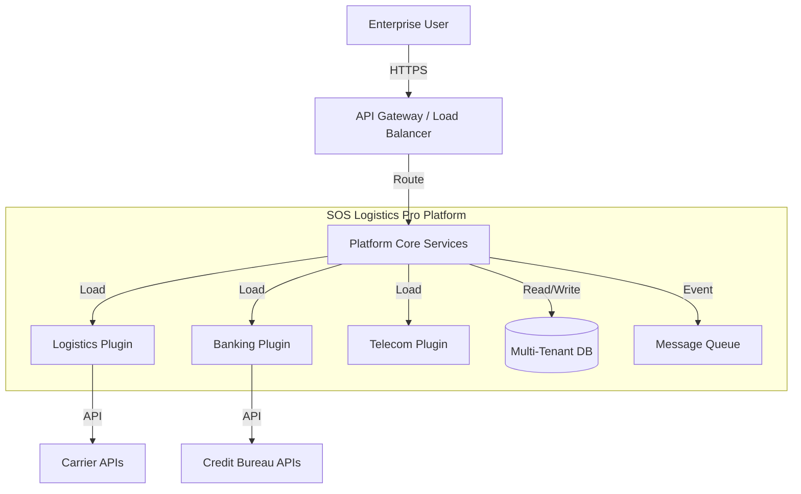

# High-Level Design (HLD) Document: Configurable Enterprise Platform

## 1. Architectural Overview
The platform follows a **Modular Monolith** or **Micro-kernel Architecture** (depending on deployment scale), transitioning towards **Microservices**. The core system acts as a host for domain-specific plugins, managing common concerns like authentication, tenant resolution, and request routing.

*   **Core Kernel:** Manages lifecycle, security, and orchestration.
*   **Domain Plugins:** Independent modules containing business logic, loaded dynamically or configured at build time.

## 2. System Context Diagram

## 3. Container Diagram
*   **Web App (React):** Single Page Application (SPA) with dynamic form rendering based on tenant configuration.
*   **API Service (Node.js/TypeScript or Go):** REST/gRPC API layer.
    *   **Auth Module:** Handles JWT and Tenant ID extraction.
    *   **Orchestrator:** Routes requests to the appropriate plugin adapter.
*   **Plugin Containers:**
    *   Can be separate microservices (for isolation) or shared libraries (for performance).
    *   *Decision:* Start with shared libraries (Strategy Pattern) within the same process for Phase 1, moving to gRPC microservices for Phase 2+.
*   **Database (PostgreSQL):** Stores core data (Users, Tenants) and domain data (JSONB or separate schemas).

## 4. Technology Stack
*   **Frontend:** React, TypeScript, Tailwind CSS, Shadcn UI.
*   **Backend:** Node.js (Supabase Edge Functions) or Go for high-performance services.
*   **Database:** PostgreSQL (Supabase) with Row Level Security (RLS).
*   **Messaging:** Redis (for caching) and RabbitMQ/Kafka (for async fulfillment events).
*   **API Gateway:** Kong or Nginx.
*   **Infrastructure:** Docker, Kubernetes (K8s).

## 5. Data Flow Diagrams (DFD)

### Cross-Domain Quotation Process
1.  **Request:** User submits `POST /api/v1/quote` with `tenant_id` header.
2.  **Auth:** Gateway validates JWT and extracts `tenant_id`.
3.  **Resolution:** Core Service looks up `Tenant Configuration` to identify the active `Domain Plugin` (e.g., Logistics).
4.  **Delegation:** Core Service invokes `LogisticsPlugin.generateQuote(payload)`.
5.  **Execution:** Plugin executes business logic (e.g., distance calc * rate).
6.  **Response:** Plugin returns standardized `Quote` object.
7.  **Persist:** Core saves metadata; Plugin saves domain details (JSONB).

## 6. Key Design Decisions

### 6.1 Plugin Mechanism
*   **Choice:** **Strategy Pattern with Dependency Injection**.
*   **Justification:** Allows swapping implementations at runtime based on context. For the initial phase, simpler than OSGi and faster than separate microservices.
*   **Alternative:** **gRPC Plugins** (HashiCorp go-plugin style) - reserved for high-scale isolation needs later.

### 6.2 Communication Protocol
*   **Choice:** **REST over HTTP/2** (internal) or **gRPC**.
*   **Justification:** REST is easier for initial web integration; gRPC provides type safety and performance for inter-service communication.

### 6.3 State Management
*   **Choice:** **Stateless Services**.
*   **Justification:** Essential for horizontal scaling. All state is externalized to Redis/Postgres.
