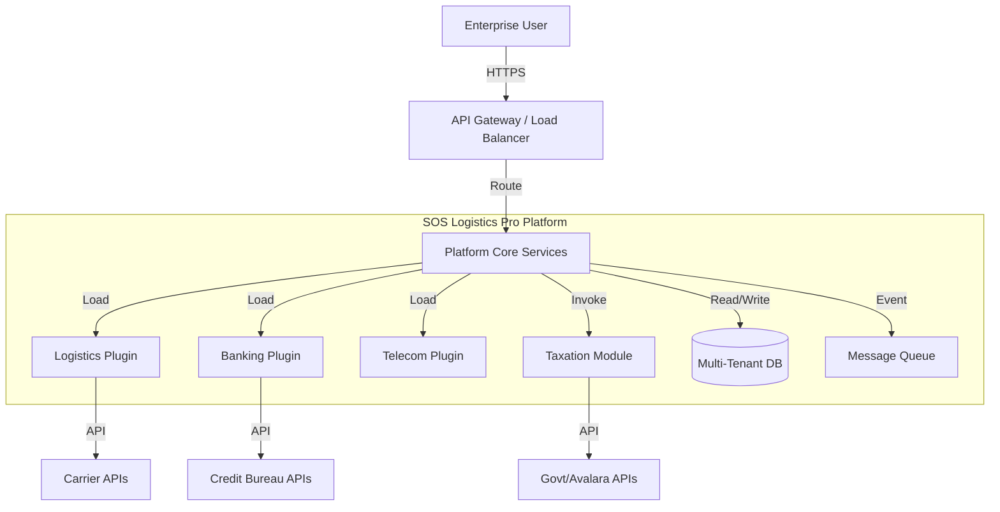
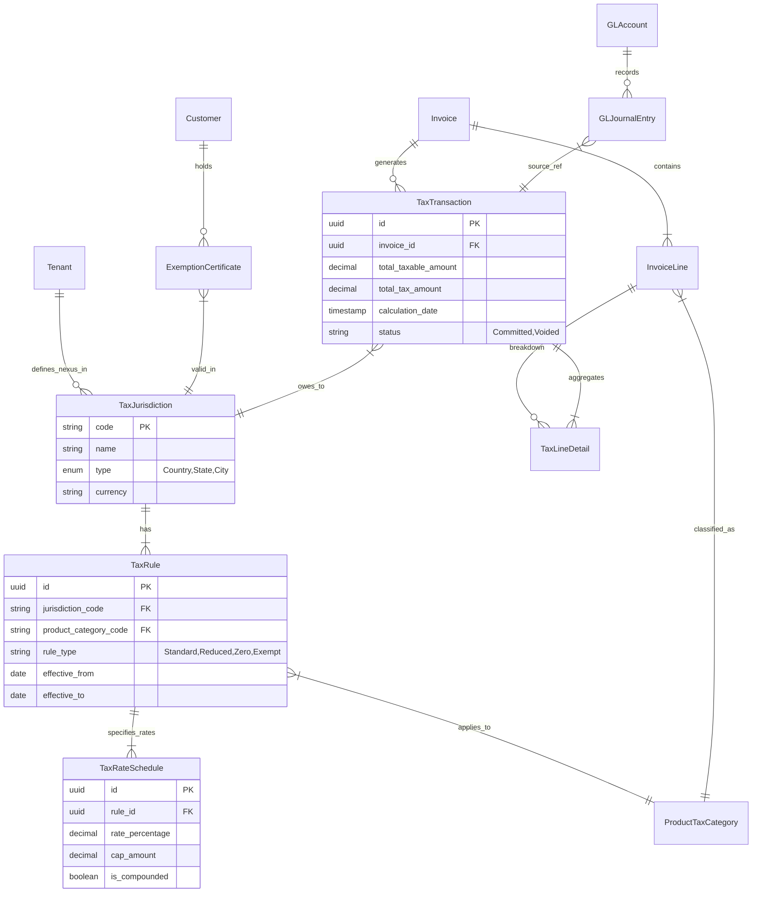

# High-Level Design (HLD) Document: Configurable Enterprise Platform

## 1. Architectural Overview
The platform follows a **Modular Monolith** or **Micro-kernel Architecture** (depending on deployment scale), transitioning towards **Microservices**. The core system acts as a host for domain-specific plugins, managing common concerns like authentication, tenant resolution, and request routing.

*   **Core Kernel:** Manages lifecycle, security, and orchestration.
*   **Domain Plugins:** Independent modules containing business logic, loaded dynamically or configured at build time.

## 2. System Context Diagram


## 3. Container Diagram
*   **Web App (React):** Single Page Application (SPA) with dynamic form rendering based on tenant configuration.
*   **API Service (Node.js/TypeScript or Go):** REST/gRPC API layer.
    *   **Auth Module:** Handles JWT and Tenant ID extraction.
    *   **Orchestrator:** Routes requests to the appropriate plugin adapter.
    *   **Taxation Service:** Dedicated module for tax calculation and compliance checks.
*   **Plugin Containers:**
    *   Can be separate microservices (for isolation) or shared libraries (for performance).
    *   *Decision:* Start with shared libraries (Strategy Pattern) within the same process for Phase 1, moving to gRPC microservices for Phase 2+.
*   **Database (PostgreSQL):** Stores core data (Users, Tenants) and domain data (JSONB or separate schemas).

## 4. Taxation & Financials Data Model

### 4.1 Entity Relationship Diagram (ERD)


### 4.2 Core Entities
*   **TaxJurisdiction:** Represents a taxing authority (e.g., "US-NY", "DE-Federal").
*   **TaxRule:** Links a product category and jurisdiction to a tax behavior, versioned by date.
*   **ExemptionCertificate:** Stores customer tax documents (file path, expiry, validation status).
*   **TaxTransaction:** The immutable record of tax liability created upon invoice finalization.
*   **GLJournalEntry:** Financial record for double-entry bookkeeping (Debits/Credits).

## 5. API Specification (Financial & Tax)

### 5.1 Billing & Invoicing API

#### `POST /api/v1/invoices`
Creates a draft invoice and triggers preliminary tax calculation.
*   **Request:**
    ```json
    {
      "customer_id": "cust_123",
      "currency": "USD",
      "lines": [
        { "sku": "SVC-LOG-001", "quantity": 1, "unit_price": 500.00, "tax_code": "FRT01" }
      ]
    }
    ```
*   **Response:**
    ```json
    {
      "invoice_id": "inv_999",
      "status": "DRAFT",
      "subtotal": 500.00,
      "tax_total": 45.00,
      "total": 545.00,
      "tax_breakdown": [ ... ]
    }
    ```

#### `POST /api/v1/invoices/{id}/finalize`
Finalizes the invoice, commits tax to the Audit Log, and triggers GL posting.
*   **Response:** `200 OK` with finalized Invoice object.

### 5.2 GL Integration API

#### `POST /api/v1/gl/journals`
(Internal) Records a journal entry. Triggered by Invoice Finalization.
*   **Request:**
    ```json
    {
      "reference_id": "inv_999",
      "date": "2023-10-27",
      "entries": [
        { "account_code": "1200-AR", "type": "DEBIT", "amount": 545.00 },
        { "account_code": "4000-REV", "type": "CREDIT", "amount": 500.00 },
        { "account_code": "2200-TAX-LIAB", "type": "CREDIT", "amount": 45.00 }
      ]
    }
    ```

### 5.3 Tax Calculation API

#### `POST /api/v1/tax/calculate`
(As previously defined, but enhanced with detailed nexus check).
*   **Logic:**
    1.  Validate Address & Nexus.
    2.  Check for valid Exemption Certificate.
    3.  Find matching TaxRule (effective date).
    4.  Apply Rate (compound if needed).
    5.  Return detailed breakdown.

## 6. Technology Stack
*   **Frontend:** React, TypeScript, Tailwind CSS, Shadcn UI.
*   **Backend:** Node.js (Supabase Edge Functions) or Go for high-performance services.
*   **Database:** PostgreSQL (Supabase) with Row Level Security (RLS).
*   **Messaging:** Redis (for caching) and RabbitMQ/Kafka (for async fulfillment events).
*   **API Gateway:** Kong or Nginx.
*   **Infrastructure:** Docker, Kubernetes (K8s).

## 5. Data Flow Diagrams (DFD)

### Cross-Domain Quotation Process
1.  **Request:** User submits `POST /api/v1/quote` with `tenant_id` header.
2.  **Auth:** Gateway validates JWT and extracts `tenant_id`.
3.  **Resolution:** Core Service looks up `Tenant Configuration` to identify the active `Domain Plugin` (e.g., Logistics).
4.  **Delegation:** Core Service invokes `LogisticsPlugin.generateQuote(payload)`.
5.  **Execution:** Plugin executes business logic (e.g., distance calc * rate).
6.  **Response:** Plugin returns standardized `Quote` object.
7.  **Persist:** Core saves metadata; Plugin saves domain details (JSONB).

## 6. Key Design Decisions

### 6.1 Plugin Mechanism
*   **Choice:** **Strategy Pattern with Dependency Injection**.
*   **Justification:** Allows swapping implementations at runtime based on context. For the initial phase, simpler than OSGi and faster than separate microservices.
*   **Alternative:** **gRPC Plugins** (HashiCorp go-plugin style) - reserved for high-scale isolation needs later.

### 6.2 Communication Protocol
*   **Choice:** **REST over HTTP/2** (internal) or **gRPC**.
*   **Justification:** REST is easier for initial web integration; gRPC provides type safety and performance for inter-service communication.

### 6.3 State Management
*   **Choice:** **Stateless Services**.
*   **Justification:** Essential for horizontal scaling. All state is externalized to Redis/Postgres.
