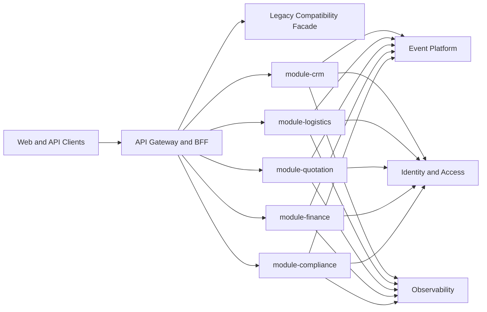

# High-Level Design: Modular Separation and Re-Platforming

## 1. Purpose and Scope
This document defines the full architectural design for decomposing Logic Nexus-AI from a monolithic deployment model into independent pluggable vertical modules and shared horizontal platform services, while preserving backward compatibility, multi-tenant data isolation, and zero-downtime migration.

### 1.1 Architectural Objectives
- Decompose by bounded context into independently deployable modules.
- Preserve current API contracts with versioned compatibility.
- Guarantee zero-downtime migration using strangler and dual-run patterns.
- Enforce hierarchy compliance: Platform -> Admin -> Multi-Tenant -> Multi-Franchisee.
- Formalize governance for security, resiliency, quality, and operations.

### 1.2 Out of Scope
- No destructive schema removals in this program.
- No mandatory one-time big-bang migration.
- No immediate replacement of all existing interfaces in one release.

## 2. Audit and Analysis Baseline

### 2.1 System Inventory and Dependency Mapping
Static analysis baseline from repository scan:
- API route files in `src/pages/api`: 40 total.
- Versioned API split: 19 files in `/v1`, 6 files in `/v2`, 7 legacy unversioned endpoints.
- Edge functions in `supabase/functions`: 99 function directories.
- Direct `@/integrations/supabase/client` imports in source: 100 occurrences.
- `ScopedDataAccess` references in source: 165 occurrences.
- Largest source hotspots:
  - `src/types/supabase.ts` ~349KB
  - `src/components/sales/unified-composer/UnifiedQuoteComposer.tsx` ~179KB
  - `src/pages/dashboard/data-management/DatabaseExport.tsx` ~161KB
- Largest edge function hotspots:
  - `supabase/functions/self-service-onboarding/index.ts` 2093 LOC
  - `supabase/functions/generate-quote-pdf/index.ts` 1760 LOC
  - `supabase/functions/sync-emails/index.ts` 1309 LOC

Dependency and coupling signals:
- Internal dependency concentration is UI-heavy (`components -> components`) with high cross-import density.
- Plugin infrastructure exists (`IPlugin`, `PluginRegistry`) but runtime binding is still process-local.
- Service layer and API layer are mixed in places, indicating anti-corruption layer requirements before extraction.

### 2.2 Performance Bottleneck Assessment
Current observability capabilities:
- Lightweight tracing exists (`src/lib/otel-lite.ts`) but not fully OpenTelemetry-export capable.
- Browser vitals tracking exists (`src/lib/performance-monitor.ts`) for CLS/INP/LCP/TTFB/FCP.
- Data-flow event capture exists (`src/lib/data-flow-monitor.ts`) but is not distributed.

High-risk bottlenecks:
- Very large edge function handlers and single-file orchestrators increase cold start and change blast radius.
- Large React containers increase hydration and render costs.
- Multi-hop quotation/data export flows indicate potential synchronous choke points.

Profiling target list:
- Quote generation pipeline (UI -> API v2 import/export -> edge function workers).
- PDF generation edge path.
- Email ingest/sync orchestration.
- Domain assignment and governance audit operations.

### 2.3 Security Assessment of Inter-Module Communications
Security controls present:
- Shared JWT utilities and auth guards in `supabase/functions/_shared/auth.ts`.
- Service-role gate checks via `isServiceRoleAuthorizationHeader`.
- Common CORS helpers in edge function shared utilities.

Security findings requiring remediation:
- `supabase/functions/seed-platform-admin/config.json` has `verify_jwt: false` and must be restricted to bootstrap-only operational paths.
- Service-role bypass patterns exist in several functions and require centralized policy + short-lived credentials.
- Mixed auth models across functions indicate policy drift risk.
- High count of `@ts-ignore` violations in edge subtrees reduces static safety guarantees.

### 2.4 Data Flow Coupling Analysis
Tight coupling indicators:
- Domain logic frequently depends on shared monolithic DB models.
- Quote workflows span UI, API, services, and functions without strict domain contracts.
- Shared tables and mixed-schema reads increase hidden coupling across domains.

Primary coupling seams to break first:
- Quotation core and module extensions.
- CRM-Logistics shared read paths.
- Domain config and assignment orchestration.

### 2.5 API Surface and Versioning Audit
Current state:
- Mixed unversioned and versioned routes coexist.
- OpenAPI 3.1 contract exists for selected domains (`docs/api/domain-management-api.yaml`).
- No unified contract registry covering REST + GraphQL + gRPC + AsyncAPI.

Versioning strategy requirements:
- Freeze existing `/api/v1` behavior under compatibility SLA.
- Route all net-new changes through `/api/v2` and contract-first review.
- Introduce formal deprecation windows with traffic telemetry per endpoint version.

### 2.6 Technical Debt Quantification
Debt scoring model: `Debt Score = (Coupling * 0.35) + (Complexity * 0.25) + (Change Frequency * 0.20) + (Defect Risk * 0.20)`

Quantified debt buckets:
- Structural debt: oversized source/edge files, mixed responsibilities.
- Contract debt: incomplete API contract coverage, partial versioning.
- Security debt: auth policy inconsistency and bypass exceptions.
- Operability debt: limited distributed traces, fragmented SLO observability.

Top remediation priorities:
1. Reduce monolithic orchestration files into domain services and adapters.
2. Standardize authN/authZ policy enforcement in all inter-service paths.
3. Establish contract registry and consumer-driven contract tests.
4. Introduce end-to-end distributed tracing and SLO dashboards.

### 2.7 Audit Execution Framework and Evidence Model
Static analysis execution plan:
- Inventory scan:
  - `find src/pages/api -type f | wc -l` -> current result: 40 files.
  - `find supabase/functions -mindepth 1 -maxdepth 1 -type d | wc -l` -> current result: 99 directories.
  - `find src/pages/api/v1 -type f | wc -l` -> 19, `v2` -> 6, non-versioned -> 15.
- Coupling scan:
  - direct Supabase client references in `src`: 129 occurrences across 112 files.
  - `ScopedDataAccess` references in `src`: 165 occurrences across 35 files.
- Hotspot scan:
  - top N file size and churn risk reports for UI containers and edge orchestrators.

Profiling and distributed tracing execution plan:
- Enable trace context propagation for gateway -> API -> service -> worker path.
- Instrument critical user journeys: quote create/save/accept, shipment transition, invoice finalize, compliance decision.
- Collect baseline latency percentiles (P50/P95/P99), error rates, and saturation per service dependency.
- Perform load profiling for high-concurrency workflows and establish regression budgets.

Security assessment execution plan:
- Build communication path matrix covering HTTP, gRPC, event streams, and background workers.
- Verify JWT validation, mTLS policy, service-role usage boundaries, and secret retrieval patterns.
- Run policy drift detection against centralized role/permission manifests.
- Run static security scans for unsafe bypass markers and prohibited credential handling.

Data flow and API surface execution plan:
- Create lineage maps for every command path crossing module boundaries.
- Capture sync vs async edges and classify contract type (REST/GraphQL/gRPC/event).
- Add consumer impact tags for all v1 endpoints and publish deprecation telemetry.
- Enforce contract artifact publication as release prerequisite for all module changes.

Technical debt remediation governance:
- Classify debt as structural, contract, security, and operability categories.
- Assign severity tiers (critical/high/medium/low) with remediation owner and due window.
- Track debt burndown and blocked dependencies at each phase gate review.
- Block phase completion when critical debt items have no approved mitigation.

## 3. Traceability Matrix: Monolith to Modular Replacement

| Current Monolithic Area | Current Assets | Coupling Risk | Proposed Replacement | Migration Mechanism | Compatibility Strategy |
|---|---|---|---|---|---|
| Quote orchestration | `src/services/QuoteOptionService.ts`, quotation APIs/functions | High | `module-quotation` vertical bounded context | Strangler facade + anti-corruption adapter | Keep `/api/v1` contract, add `/api/v2` canonical |
| CRM workspace | `src/pages/dashboard/Leads.tsx`, CRM pages/hooks | High | `module-crm` vertical context | Route-by-route extraction | Preserve existing UI routes; proxy data adapters |
| Logistics container/rate logic | `src/services/logistics/*`, logistics plugin | Medium | `module-logistics` vertical context | Plugin-first extraction | Backward-compatible DTO mappers |
| Invoicing/GL/Tax | `src/services/invoicing/*`, `src/services/taxation/*` | Medium | `module-finance` vertical context | Schema split + saga integration | Existing invoice APIs remain stable |
| Domain governance | domain assignment APIs/services + migration SQL | Medium | `platform-domain-governance` horizontal service | Shared service extraction | Contract-preserving endpoints |
| Edge orchestration mega-functions | `generate-quote-pdf`, `self-service-onboarding`, `sync-emails` | High | task-specific function services + event workers | Functional decomposition + queue split | Preserve trigger contracts and response envelopes |
| Auth and identity concerns | distributed auth checks in API/functions | High | `platform-identity-access` horizontal service | Sidecar/policy middleware insertion | JWT format preserved; stricter policy gates |
| Monitoring/logging | local logger + web-vitals + ad hoc logs | Medium | `platform-observability` service | telemetry overlay | Non-breaking, additive instrumentation |
| AMRO/MRO capabilities | AMRO plans, plugin requirements, implementation references | High | `module-amro` vertical context + `module-assurance` integration contract | Feature-flagged strangler extraction + dual-run coexistence | Domain-assignment gating + two-version contract support |
| Warehouse and inventory orchestration | stock allocation logic, warehouse workflows, inventory touchpoints in quote/fulfillment paths | High | `module-warehouse-inventory` vertical context | Strangler extraction + event-carried state transfer + dual-write reconciliation | Preserve v1 stock/availability semantics and historical quotation linkage |

### 3.1 Traceability Evidence Requirements
For every mapped monolith-to-module item:
- Record source assets, target service owners, and affected tenant/franchise scopes.
- Record cutover mechanism (shadow read, dual write, strangler route, event replay).
- Record contract evidence (OpenAPI/GraphQL/proto/AsyncAPI artifact version).
- Record verification evidence (integration test id, replay diff report id, SLO report id).
- Record rollback evidence (switch id, data reconciliation checkpoint id).

## 4. Target Modular Architecture

### 4.1 Vertical Module Boundaries (DDD)
Each vertical module owns:
- API adapters (REST/GraphQL gateways)
- Application services (use cases)
- Domain model and policies
- Data access and schema namespace
- Presentation integration adapters

Initial vertical bounded contexts:
1. `module-crm`
2. `module-logistics`
3. `module-quotation`
4. `module-finance`
5. `module-compliance`
6. `module-communications`
7. `module-amro`
8. `module-assurance`
9. `module-warehouse-inventory`

Boundary rules:
- No direct table access across modules.
- Cross-module reads via published contracts only.
- Shared identifiers limited to tenant/franchise/domain entity IDs.

### 4.2 Horizontal Platform Services
Cross-cutting services:
1. Identity and Access (AuthN/AuthZ, RBAC/ABAC, zero-trust policy engine)
2. Observability (metrics, logs, traces, SLOs, alerting)
3. Configuration and Secrets (centralized config, policy, secrets rotation)
4. Event Platform (streaming, outbox relay, schema registry, replay)
5. Service Discovery and Traffic Management (mesh, mTLS, retries, circuit breaking)
6. Governance and Audit (ADR registry, policy evidence, compliance controls)

### 4.3 Reference Topology

```mermaid
graph LR
  U[Web and API Clients] --> G[API Gateway and BFF]
  G --> V1[Legacy Compatibility Facade]
  G --> MCRM[module-crm]
  G --> MLOG[module-logistics]
  G --> MQUO[module-quotation]
  G --> MFIN[module-finance]
  G --> MCOM[module-compliance]

  MCRM --> EV[Event Platform]
  MLOG --> EV
  MQUO --> EV
  MFIN --> EV
  MCOM --> EV

  MCRM --> IDS[Identity and Access]
  MLOG --> IDS
  MQUO --> IDS
  MFIN --> IDS
  MCOM --> IDS

  MCRM --> OBS[Observability]
  MLOG --> OBS
  MQUO --> OBS
  MFIN --> OBS
  MCOM --> OBS
```

### 4.4 Vertical Module Technical Blueprints

#### 4.4.1 module-crm
Bounded context and responsibilities:
- Owns lead/account/contact/opportunity/activity lifecycle.
- Owns pipeline state transitions and stage-level analytics.
- Owns CRM-specific UI composition patterns and module header state persistence.

Service decomposition:
- `crm-command-api` (write-side command handlers).
- `crm-query-api` (read-side projections and search/filter).
- `crm-workflow-worker` (automation, reminders, dedupe jobs).

Data ownership:
- Canonical tables: `crm_leads`, `crm_accounts`, `crm_contacts`, `crm_opportunities`, `crm_activities`, `crm_stage_events`.
- Mandatory columns: `tenant_id`, `franchise_id`, `created_at`, `updated_at`, `version`.
- RLS policy baseline: tenant+franchise predicate with admin override audit trail.

Public contracts:
- REST OpenAPI:
  - `POST /api/v2/crm/leads`
  - `PATCH /api/v2/crm/leads/{leadId}`
  - `POST /api/v2/crm/opportunities/{id}/stage-transition`
- GraphQL subgraph:
  - Queries: `leads`, `lead(id)`, `opportunity(id)`.
  - Mutations: `createLead`, `convertLead`, `transitionOpportunityStage`.
- gRPC:
  - `crm.v1.LeadService.UpsertLead`
  - `crm.v1.OpportunityService.TransitionStage`
- AsyncAPI events:
  - `crm.lead.created.v1`
  - `crm.opportunity.stage_changed.v1`
  - `crm.activity.logged.v1`

Cross-module dependencies:
- Consumes `platform-identity-access` for policy checks.
- Publishes opportunity conversion events for `module-quotation`.
- Consumes compliance flags from `module-compliance` for restricted accounts.

SLOs and resilience:
- P95 command latency <= 180ms.
- Pipeline board query P95 <= 250ms.
- Stage transition exactly-once effect via idempotency key + optimistic locking.

#### 4.4.2 module-logistics
Bounded context and responsibilities:
- Owns shipment lifecycle (booking, routing, movement, delivery).
- Owns container metadata, mode-specific legs, routing optimization, and tracking events.
- Owns carrier scorecards and route operational KPIs.

Service decomposition:
- `logistics-routing-service` (route computation and leg validation).
- `logistics-shipment-service` (shipment state machine and execution).
- `logistics-masterdata-service` (ports/vessels/containers/modes).

Data ownership:
- Canonical tables: `logistics_shipments`, `logistics_legs`, `logistics_container_refs`, `logistics_tracking_events`, `logistics_carrier_scores`.
- Extension model: quote/shipment extension entities remain module-owned in `logistics` schema.
- Eventual consistency projection tables for operational dashboards.

Public contracts:
- REST OpenAPI:
  - `POST /api/v2/logistics/shipments`
  - `PATCH /api/v2/logistics/shipments/{shipmentId}/status`
  - `GET /api/v2/logistics/containers/metadata`
- GraphQL subgraph:
  - Queries: `shipment(id)`, `shipments(filter)`, `routeOptions`.
- gRPC:
  - `logistics.v1.RoutingService.CalculateRoute`
  - `logistics.v1.ShipmentService.UpdateShipmentState`
- AsyncAPI events:
  - `logistics.shipment.created.v1`
  - `logistics.leg.updated.v1`
  - `logistics.tracking.event_ingested.v1`

Cross-module dependencies:
- Consumes quotation acceptance events from `module-quotation`.
- Publishes fulfillment and status events to CRM and finance projections.
- Consumes compliance block decisions from `module-compliance`.

SLOs and resilience:
- Route calculation P95 <= 300ms (cached reference data path).
- Shipment state command P95 <= 200ms.
- Carrier API failures isolated via outbound bulkheads per carrier/mode.

#### 4.4.3 module-quotation
Bounded context and responsibilities:
- Owns quote aggregate, quote options, versioning, revision history, and acceptance workflow.
- Owns quote-item core/extension write orchestration and compatibility translation.
- Owns pricing composition, margin optimization orchestration, and quote export/import job state.

Service decomposition:
- `quotation-command-service` (create/update/version/accept/reject).
- `quotation-pricing-service` (synchronous pricing/margin calculations).
- `quotation-document-service` (PDF/export templates and rendering orchestration).

Data ownership:
- Canonical tables: `quote_headers`, `quote_versions`, `quote_options`, `quote_charges`, `quote_items_core`.
- Module extension tables by domain under dedicated schemas, including `logistics.quote_items_extension`.
- Immutable `quote_events` event-store stream for audit and replay.

Public contracts:
- REST OpenAPI:
  - `POST /api/v2/quotations`
  - `POST /api/v2/quotations/{id}/versions`
  - `POST /api/v2/quotations/{id}/accept`
  - `POST /api/v2/quotations/import`
- GraphQL subgraph:
  - Queries: `quotation(id)`, `quotationVersions(id)`.
  - Mutations: `createQuotation`, `saveQuotationVersion`, `acceptQuotation`.
- gRPC:
  - `quotation.v1.QuoteService.CalculateQuote`
  - `quotation.v1.QuoteService.SaveVersion`
- AsyncAPI events:
  - `quotation.created.v2`
  - `quotation.version.saved.v2`
  - `quotation.accepted.v2`

Cross-module dependencies:
- Calls logistics routing service for route-dependent pricing.
- Publishes accepted quote event to logistics shipment creation saga.
- Publishes margin and revenue events to finance ledger intake.

SLOs and resilience:
- Quote create/update P95 <= 250ms.
- Version-save durability ACK <= 120ms after event-store append.
- PDF generation async completion target <= 30s with retriable job semantics.

#### 4.4.4 module-finance
Bounded context and responsibilities:
- Owns invoicing, payments, GL posting integration, tax computation orchestration, and margin recognition.
- Owns receivables and financial compliance-grade audit entries.

Service decomposition:
- `finance-invoicing-service` (invoice aggregate lifecycle).
- `finance-tax-service` (tax rules and jurisdiction application).
- `finance-ledger-service` (GL posting, journal balancing, reconciliation).

Data ownership:
- Canonical tables: `finance_invoices`, `finance_invoice_lines`, `finance_payments`, `finance_journal_entries`, `finance_tax_transactions`.
- Strict immutability for committed financial entries and tax transactions.
- Currency and tax reference caches with version pinning by effective date.

Public contracts:
- REST OpenAPI:
  - `POST /api/v2/finance/invoices`
  - `POST /api/v2/finance/invoices/{id}/finalize`
  - `POST /api/v2/finance/journals`
- GraphQL subgraph:
  - Queries: `invoice(id)`, `invoices(filter)`, `taxBreakdown(invoiceId)`.
- gRPC:
  - `finance.v1.TaxService.CalculateTax`
  - `finance.v1.LedgerService.PostJournal`
- AsyncAPI events:
  - `finance.invoice.finalized.v1`
  - `finance.payment.received.v1`
  - `finance.margin.booked.v1`

Cross-module dependencies:
- Consumes `quotation.accepted` for pre-billing staging.
- Consumes shipment completion milestones from logistics.
- Publishes finance status events to CRM account insights.

SLOs and resilience:
- Invoice finalize P95 <= 300ms excluding external tax provider calls.
- Journal posting exactly-once with idempotency and ledger hash integrity checks.

#### 4.4.5 module-compliance
Bounded context and responsibilities:
- Owns restricted-party screening, document validation, sanctions checks, and policy adjudication.
- Provides allow/deny decisions and explanation artifacts to upstream modules.

Service decomposition:
- `compliance-policy-service` (policy evaluation and decisioning).
- `compliance-screening-service` (RPS/sanctions checks).
- `compliance-doc-service` (required docs lifecycle and expiry validation).

Data ownership:
- Canonical tables: `compliance_cases`, `compliance_decisions`, `compliance_document_requirements`, `compliance_screening_results`.
- Decision provenance stored with policy version and rule trace.

Public contracts:
- REST OpenAPI:
  - `POST /api/v2/compliance/screening/run`
  - `POST /api/v2/compliance/decision/evaluate`
  - `GET /api/v2/compliance/cases/{id}`
- GraphQL subgraph:
  - Queries: `complianceCase(id)`, `complianceDecision(entityId)`.
- gRPC:
  - `compliance.v1.DecisionService.Evaluate`
- AsyncAPI events:
  - `compliance.decision.issued.v1`
  - `compliance.document.expiring.v1`
  - `compliance.case.escalated.v1`

Cross-module dependencies:
- Serves synchronous policy checks for CRM/quotation/logistics commands.
- Publishes policy outcomes for audit and downstream notification workflows.

SLOs and resilience:
- Synchronous decision P95 <= 150ms for cached policy data.
- External sanctions providers wrapped with aggressive circuit-breakers and fallback queues.

#### 4.4.6 module-communications
Bounded context and responsibilities:
- Owns outbound/inbound messaging orchestration for email, chat, webhook notifications, and workflow-triggered communication.
- Owns template rendering, channel preferences, and delivery status telemetry.

Service decomposition:
- `comms-orchestrator` (channel routing and fallback).
- `comms-template-service` (content compilation/localization).
- `comms-delivery-worker` (async provider dispatch and retries).

Data ownership:
- Canonical tables: `comms_messages`, `comms_threads`, `comms_templates`, `comms_delivery_attempts`, `comms_provider_credentials_ref`.
- Channel-level encryption and retention controls by policy tier.

Public contracts:
- REST OpenAPI:
  - `POST /api/v2/comms/messages/send`
  - `POST /api/v2/comms/messages/bulk`
  - `GET /api/v2/comms/messages/{id}/status`
- GraphQL subgraph:
  - Queries: `message(id)`, `conversation(threadId)`.
- gRPC:
  - `communications.v1.MessageService.Send`
- AsyncAPI events:
  - `comms.message.queued.v1`
  - `comms.message.delivered.v1`
  - `comms.message.failed.v1`

Cross-module dependencies:
- Consumes domain events from CRM, quotation, compliance, and finance for notification triggers.
- Exposes provider-agnostic APIs to all modules for unified communication semantics.

SLOs and resilience:
- Command ACK <= 100ms for queued sends.
- Delivery retry policy: capped exponential backoff with dead-letter queue after terminal failure.

### 4.5 Horizontal Service Technical Blueprints

#### 4.5.1 platform-identity-access
- Provides centralized token validation, RBAC/ABAC policy checks, workload identity, and service-to-service mTLS identities.
- Enforces tenant/franchise claim propagation and policy context injection.
- Critical requirement: no module may execute command handlers without policy decision token.

#### 4.5.2 platform-observability
- Provides OpenTelemetry collectors, logs pipeline, metrics cardinality control, distributed trace correlation, and SLO burn-rate alerting.
- Mandatory trace context propagation: `traceparent`, `x-correlation-id`, `tenant_id`, `franchise_id`.

#### 4.5.3 platform-config-secrets
- Provides strongly typed dynamic config with staged rollout and config version pinning.
- Integrates secret vault with rotation, lease TTL, and access audit.

#### 4.5.4 platform-eventing
- Provides Kafka/NATS-compatible abstraction with schema registry, replay tooling, dead-letter handling, and consumer lag SLOs.
- Enforces AsyncAPI contract checks in CI before producer/consumer deployment.

#### 4.5.5 platform-service-mesh
- Provides service discovery, mTLS, retries/timeouts, traffic shifting, and per-route policy overlays.
- Exposes traffic policies for canary, blue-green, and fault-injection experiments.

#### 4.5.6 platform-governance-audit
- Provides ADR catalog APIs, architecture guardrail checks, evidence ledger, and compliance status views.
- Enforces release gate checks for SOC2/GDPR control mapping and exception approvals.

### 4.6 Vertical Module Analysis (Current State to Target State)

#### 4.6.1 module-crm analysis
Current-state assets and seams:
- Primary UI and orchestration concentrated in CRM dashboard pages, hooks, and pipeline components.
- Cross-domain read coupling appears in opportunity-to-quotation conversion and account-level finance summaries.
- Shared model leakage exists through broad type imports and mixed access paths.

Extraction constraints:
- Must preserve CRM module header/navigation behavior and fixed action ordering.
- Must keep pipeline as default module view unless explicit product override exists.
- Must route refresh actions through `ScopedDataAccess` for tenant/franchise isolation.

Target-state decomposition requirements:
- Command handlers own state transitions for lead/opportunity lifecycle with idempotent transition keys.
- Query side must provide denormalized pipeline projections with stage statistics and activity rollups.
- All write paths must enforce `tenant_id` + `franchise_id` predicates and emit stage-change domain events.

Acceptance criteria:
- No direct quotation or finance table reads from CRM command/query services.
- Pipeline interactions preserve existing user flow and persisted theme/view behavior.
- Contract tests pass for conversion payloads consumed by quotation module.

#### 4.6.2 module-logistics analysis
Current-state assets and seams:
- Routing, legs, and shipment orchestration logic distributed across services and plugin adapters.
- Tracking updates and shipment state handling are coupled to quote acceptance and notification flows.
- Carrier-specific integrations increase blast radius when failure policies are not isolated.

Extraction constraints:
- Must preserve existing shipment status semantics and event envelopes consumed by downstream modules.
- Must maintain multi-leg, multi-mode leg typing and route validity checks.
- Must support franchise-aware operational views without cross-franchise data leakage.

Target-state decomposition requirements:
- Split route optimization, shipment execution, and master-data concerns into separate deployables.
- Introduce anti-corruption adapters for legacy shipment DTOs until v2 contracts fully adopted.
- Enforce outbound bulkheads, per-carrier retry budgets, and deterministic state machine transitions.

Acceptance criteria:
- Shipment lifecycle transitions are module-owned and replay-safe.
- Tracking ingestion lag remains within SLO while maintaining idempotent event ingestion.
- Legacy clients receive unchanged compatibility payload shapes through facade mapping.

#### 4.6.3 module-quotation analysis
Current-state assets and seams:
- Quote orchestration spans UI containers, API handlers, services, and edge functions.
- Quote item responsibilities are split between core records and domain-specific extension schemas.
- Pricing dependencies on logistics route selection create synchronous coupling pressure.

Extraction constraints:
- Must preserve backward-compatible quote response contracts for `/api/v1` consumers.
- Must keep additive migration posture for quote-item split and compatibility view behavior.
- Must maintain plugin-based domain quotation engine resolution with version-safe fallback.

Target-state decomposition requirements:
- Quote aggregate must become single write-owner for versions/options/acceptance.
- Persist immutable quote event stream with projection rebuild capability.
- Route-dependent pricing calls must use explicit timeout/deadline and failure fallback strategies.

Acceptance criteria:
- Version save and acceptance flows remain idempotent and durable under retries.
- No direct shared-table writes outside quotation-owned schemas after cutover.
- Quote-to-shipment saga kickoff emits exactly one accepted event per finalized acceptance.

#### 4.6.4 module-finance analysis
Current-state assets and seams:
- Invoicing, tax, and ledger responsibilities exist but are partially distributed across services.
- Revenue and margin signals depend on quotation and logistics milestones.
- Mutation risk exists where operational updates can accidentally affect immutable financial records.

Extraction constraints:
- Must preserve downstream accounting integration contracts and posting semantics.
- Must enforce immutable committed journal entries and traceable correction workflows.
- Must retain jurisdiction-aware tax calculation behavior and currency conversion consistency.

Target-state decomposition requirements:
- Separate invoice lifecycle orchestration from ledger posting execution.
- Apply strict entry immutability with compensating journal model for corrections.
- Introduce finance intake contracts for quotation/logistics events with schema validation gates.

Acceptance criteria:
- Reconciliation reports show no delta versus baseline under dual-run.
- Journal posting remains exactly-once with hash integrity validation.
- External tax provider failures do not corrupt invoice state transitions.

#### 4.6.5 module-compliance analysis
Current-state assets and seams:
- Compliance checks are invoked by CRM, quotation, and logistics flows with mixed sync/async patterns.
- Policy drift risk exists due to distributed authorization and screening decision points.
- Evidence artifacts and explanation traces are inconsistently centralized.

Extraction constraints:
- Must provide deterministic allow/deny decisions with policy version traceability.
- Must support escalation workflows and expiry-driven document revalidation.
- Must remain tenant/franchise scoped with auditable admin oversight actions.

Target-state decomposition requirements:
- Centralize policy evaluation and sanctions screening under module-owned decision services.
- Persist decision provenance (`policy_version`, `rule_trace`, `inputs_hash`) for forensics.
- Publish decision and escalation events for downstream automation and communication triggers.

Acceptance criteria:
- All consuming modules call compliance contracts rather than local embedded rules.
- Decision latency and deny-rate stability stay within baseline guardrails.
- Case evidence is queryable end-to-end for audit and regulatory reporting.

#### 4.6.6 module-communications analysis
Current-state assets and seams:
- Notification and message delivery paths are spread across APIs and edge-function workers.
- Provider coupling and retry behavior are inconsistent across channels.
- Template and preference logic is not fully centralized for channel orchestration.

Extraction constraints:
- Must preserve existing trigger semantics from CRM/quotation/finance/compliance events.
- Must avoid storing raw secrets in module tables; only references to managed secrets are allowed.
- Must support guaranteed-at-least-once delivery with dedupe on provider callbacks.

Target-state decomposition requirements:
- Isolate orchestration, template rendering, and delivery execution as independent components.
- Standardize provider adapters with shared timeout/retry/circuit policies.
- Introduce delivery state machine with deterministic terminal states and dead-letter handling.

Acceptance criteria:
- Command ACK remains stable while delivery occurs asynchronously through queues.
- Delivery status transitions are auditable and correlated by trace/correlation IDs.
- Provider outages degrade gracefully without blocking upstream business transactions.

### 4.7 Vertical Requirements Traceability Matrix

| Requirement ID | Vertical | Requirement Statement | Verification Method | Exit Gate |
|---|---|---|---|---|
| VR-CRM-01 | CRM | Enforce module-owned lead/opportunity writes with scoped tenancy | Contract + integration tests | Zero shared table writes from CRM |
| VR-CRM-02 | CRM | Preserve pipeline UX behavior and persisted module navigation state | UI regression + E2E | No workflow regression |
| VR-LOG-01 | Logistics | Isolate route/shipment/master-data services with stable state machine | Integration + replay tests | Shipment divergence <= threshold |
| VR-LOG-02 | Logistics | Enforce per-carrier bulkheads and retry budgets | Chaos + performance tests | No cascading carrier failures |
| VR-QUO-01 | Quotation | Make quote aggregate sole write-owner with immutable event stream | Unit + persistence tests | Durable version-save SLO met |
| VR-QUO-02 | Quotation | Preserve v1 compatibility while serving canonical v2 contracts | Contract diff + traffic replay | Zero breaking diff on v1 |
| VR-FIN-01 | Finance | Enforce immutable journal entries and compensating corrections | Reconciliation + audit tests | No direct mutation of committed entries |
| VR-FIN-02 | Finance | Stabilize tax/ledger external integration behavior | Provider fault-injection tests | Finalization error budget met |
| VR-COM-01 | Compliance | Centralize policy decisioning with policy version provenance | Contract + audit tests | 100% decisions traceable |
| VR-COM-02 | Compliance | Maintain decision latency baseline with screening fallbacks | Performance + resilience tests | Latency and deny-rate guardrails met |
| VR-MSG-01 | Communications | Centralize orchestration/templates/delivery with queue-based processing | Integration + queue soak tests | Async ACK and delivery SLO met |
| VR-MSG-02 | Communications | Standardize callback dedupe and terminal delivery states | End-to-end delivery tests | No duplicate terminal transitions |

### 4.8 Vertical Non-Functional Requirements by Platform Hierarchy

| Vertical | Platform-Level Controls | Admin Controls | Tenant Controls | Franchise Controls |
|---|---|---|---|---|
| CRM | Global policy packs, observability baselines | Override approvals and audit views | Tenant-specific pipeline config and roles | Franchise-specific stage visibility and assignments |
| Logistics | Global carrier governance and route policy | Carrier exception governance | Tenant route templates and SLA policies | Franchise operational constraints and route access |
| Quotation | Global pricing governance and plugin policy | Pricing override approvals | Tenant quotation rules and templates | Franchise markup and workflow constraints |
| Finance | Global accounting and tax control maps | Ledger supervision and reconciliation access | Tenant billing rules and currency settings | Franchise billing scope and receivable visibility |
| Compliance | Global sanctions/policy bundles | Escalation and exception adjudication | Tenant risk policy thresholds | Franchise document obligations and case scope |
| Communications | Global provider governance and retention policies | Template governance and incident controls | Tenant channel preferences and throttles | Franchise recipient scope and localized templates |

### 4.9 UI/UX Separation Architecture for Domain-Specific Verticals

UI layer separation rules:
- Each vertical owns presentation logic under module-scoped feature packages and cannot import other vertical presentation components directly.
- Shared design primitives remain in platform UI libraries (`ui`, `ui/enterprise`) and are consumed through stable interfaces.
- Vertical pages compose three layers only: module shell, module workspace components, and shared platform widgets.
- Data access never occurs in presentational atoms; module hooks and view-model adapters mediate all data and mutations.

#### 4.9.1 CRM UI/UX separation
Owned UX surfaces:
- Leads, Accounts, Contacts, Opportunities, Activities, and Quotes workspace pages.
- Pipeline, Card, Grid, and List workspace modes with persistent user preference.
- Activity timelines and opportunity stage controls.

Separation boundaries:
- Module shell uses `CRMModuleHeaderNavigation` and `useCRMModuleNavigationState` for view/theme persistence.
- Pipeline pages must run inside `DashboardLayout`; no module-specific sidebar replacement is permitted.
- CRM-specific cards, forms, and kanban interactions remain CRM-owned; cross-domain widgets are embedded via contract components only.

UX requirements:
- Fixed primary action order: Pipeline, Card, Grid, List, New, Refresh, Import/Export, Theme.
- Default fallback theme remains Azure Sky and default view remains Pipeline.
- Refresh controls must execute through `ScopedDataAccess` callbacks.

#### 4.9.2 Logistics UI/UX separation
Owned UX surfaces:
- Shipment workspace, route planning board, tracking timelines, and container metadata views.
- Multi-leg visualization and operational exception panels.

Separation boundaries:
- Logistics workspace components own leg rendering and route validation interaction states.
- Carrier connector diagnostics and retry controls are exposed via logistics-only operator consoles.
- Pricing, compliance, and finance references are rendered as read-only federated widgets without cross-module state mutation.

UX requirements:
- Leg editors enforce mode-specific field schemas and validation before save.
- Tracking timelines support real-time status streaming with franchise-aware filtering.
- High-frequency operator actions expose optimistic UI with deterministic rollback state.

#### 4.9.3 Quotation UI/UX separation
Owned UX surfaces:
- Quote composer, option comparison, version history, approval/acceptance workflow, and document export/import screens.
- Plugin-driven domain-specific quote form blocks.

Separation boundaries:
- Quote composer owns write interactions and pricing intent state.
- Domain plugin components load through microkernel contracts and cannot bypass module validation rules.
- Route and compliance panels are embedded as projection widgets with explicit data contracts.

UX requirements:
- Version history and current draft are visually separated with immutable snapshot markers.
- Import/export flows operate in asynchronous job UX with progress and retry actions.
- Acceptance action requires explicit policy/validation status indicators before final commit.

#### 4.9.4 Finance UI/UX separation
Owned UX surfaces:
- Invoice lifecycle views, tax breakdown panels, journal review, and reconciliation dashboards.
- Margin and receivables analytics surfaces.

Separation boundaries:
- Finance mutation actions are restricted to finance-authorized workflows and roles.
- Cross-module business context appears as linked references, not editable inline fields.
- Ledger and tax screens use immutable-record UX patterns once committed.

UX requirements:
- Committed entries lock editing affordances and route users to compensating workflows.
- Currency and tax jurisdiction context remains visible in all invoice mutation flows.
- Reconciliation surfaces provide discrepancy drill-down with traceable source pointers.

#### 4.9.5 Compliance UI/UX separation
Owned UX surfaces:
- Screening cases, policy decision review, escalation workbench, and document obligation tracking.
- Risk timeline and evidence trail panels.

Separation boundaries:
- Compliance decision UI owns adjudication forms and explanation views.
- Upstream module pages consume read-only compliance status badges and decision summaries via contracts.
- Evidence artifacts remain compliance-owned and only linked externally through signed references.

UX requirements:
- Decision views expose policy version, rule trace, and escalation state.
- Case queues support role-based triage and SLA-based prioritization.
- Document expiry workflows provide proactive alerts with auditable acknowledgment state.

#### 4.9.6 Communications UI/UX separation
Owned UX surfaces:
- Message orchestration console, template manager, channel health dashboards, and delivery trace views.
- Conversation threads and outbound campaign queues.

Separation boundaries:
- Channel adapters and provider diagnostics remain communications-owned UI.
- Other verticals trigger sends via action APIs; they do not render provider controls directly.
- Template rendering previews run in sandboxed communications components.

UX requirements:
- Delivery status visualizations distinguish queued, sent, delivered, failed, and dead-letter states.
- Channel fallback and retry outcomes are visible with correlation identifiers.
- Recipient preference handling is enforced before send actions are accepted.

### 4.10 UX Platform Contracts and Governance

Cross-vertical UX contracts:
- Shared component contracts: `EnterpriseFormLayout`, `EnterpriseSheet`, `EnterpriseField`, `EnterpriseActivityFeed`, and standardized Kanban card patterns.
- Shared interaction contracts: search/filter/group/favorites controls, pagination, and keyboard-accessible action bars.
- Shared state contracts: view mode persistence, theme persistence, and scoped tenant/franchise context propagation.

Accessibility and localization requirements:
- WCAG 2.1 AA contrast and focus compliance for all vertical surfaces.
- Localization-first strings and date/number/currency formatting by tenant locale settings.
- Screen-reader labels required for drag/drop actions in kanban and timeline components.

UX release governance:
- Every vertical release requires UX contract tests for component API compatibility.
- Visual regression baselines must be maintained for module shells and critical workflows.
- Cross-vertical navigation and breadcrumb integrity must pass end-to-end smoke checks.

### 4.11 Pluggable Module Package and Runtime Contract

Module package contract:
- Mandatory manifest fields: `moduleId`, `moduleVersion`, `kernelApiVersion`, `providedCapabilities`, `requiredCapabilities`, `migrationHooks`.
- Capability declarations must include protocol (`rest`, `graphql`, `grpc`, `event`) and semantic version.
- Module health contract includes startup probes, dependency probes, and contract compatibility probe.

Runtime lifecycle contract:
- `onLoad` validates capability compatibility and registers contracts in the registry.
- `onPromote` enables traffic after canary SLO and policy checks pass.
- `onDegrade` limits capability surface for partial outage containment.
- `onUnload` drains traffic, flushes outbox, and archives state snapshots.

Compatibility and isolation requirements:
- Modules cannot call non-declared capabilities.
- Cross-module communication requires signed contract reference and version pin.
- Data access isolation is enforced by schema ownership and scoped tenant/franchise context.
- Plugin rollback must preserve prior active module version state and traffic policy.

## 5. Interface Contract Standards

### 5.1 REST (OpenAPI 3.1)
- Contract-first required for all external module endpoints.
- Versioning: `/api/v{major}` with additive minor evolution.
- Response envelope standards: `data`, `meta`, `correlationId`, `version`.
- Breaking changes require new major endpoint version and deprecation notice.

### 5.2 GraphQL
- Introduce federated schema for cross-module query composition.
- Module ownership by subgraph:
  - CRM subgraph: leads, accounts, contacts.
  - Logistics subgraph: rates, routes, containers.
  - Quotation subgraph: quotes, options, pricing summaries.

### 5.3 gRPC
- Use for synchronous low-latency internal calls.
- Proto package per module (`com.logicnexus.crm.v1`, etc.).
- Mandatory deadlines, idempotency keys, and mTLS identity propagation.

### 5.4 AsyncAPI
- Events standardized through AsyncAPI channels and schema registry.
- Required event metadata:
  - `eventId`, `eventType`, `occurredAt`, `tenantId`, `franchiseId`, `traceId`, `schemaVersion`.

## 6. Dependency Injection and Microkernel Plugin Design

### 6.1 DI Container Specification
- Explicit registration per module on startup.
- Lifetimes:
  - Singleton: config, telemetry exporters, client factories.
  - Scoped: request context, authorization context.
  - Transient: handlers, validators.
- No hidden reflection-based auto-registration in production.

### 6.2 Plugin Runtime (Microkernel)
- Core kernel responsibilities:
  - plugin discovery
  - capability negotiation
  - lifecycle hooks (`onLoad`, `onHealthCheck`, `onUnload`)
  - contract compatibility validation
- Plugin package contract:
  - semantic version
  - required kernel API version
  - provided capabilities
  - migration hooks

Dynamic load/unload controls:
- Blue/green plugin slotting.
- Plugin health gate before traffic shift.
- Automatic fallback to prior plugin version on policy breach.

## 7. Data Consistency and Resilience Patterns

### 7.1 Distributed Consistency
- Saga orchestration for cross-module transactions.
- Outbox pattern per module database for reliable event emission.
- Idempotency tokens on all command handlers.
- Compensating action catalog per business process.

### 7.2 CQRS and Event Sourcing
- Command model owned by source module.
- Read projections optimized per consumer domain.
- Event sourcing required for regulated audit trails (quotes, compliance, finance).

### 7.3 Communication Resilience
- Circuit breaker defaults:
  - failure threshold: 50% over rolling 20 requests
  - open interval: 30s
  - half-open probe: 5 requests
- Retry policy:
  - max retries: 3
  - exponential backoff with jitter
  - retries only for idempotent operations
- Bulkhead isolation:
  - pool per module dependency
  - request queue limits + load shedding

### 7.4 Resilience Policy Matrix by Communication Type

| Communication Path | Timeout | Retry | Circuit Breaker | Idempotency Requirement | Fallback Strategy |
|---|---|---|---|---|---|
| REST synchronous calls | 2s default, 5s max | 3 max, exponential jitter | 50%/20 requests, open 30s | Required for write commands | cached read or queued command |
| gRPC internal calls | 1s default, 3s max | 2 max for safe methods | per-client breaker + half-open probes | Required on mutating RPCs | degrade to async event path |
| Event consumer handlers | lease-based processing | retry until budget exceeded | consumer-level pause on poison bursts | required eventId dedupe | dead-letter queue + replay |
| External provider adapters | provider SLA dependent | capped by provider profile | dedicated breaker per provider | required request correlation id | provider failover or manual queue |

## 8. Phased Migration Roadmap

### Phase 1: Strangler Foundation
Scope:
- Introduce API gateway facade and legacy compatibility router.
- Implement feature toggles for module-level traffic shifting.
- Stand up full monitoring dashboards (golden signals + business KPIs).

Success criteria:
- 100% API traffic visible via gateway telemetry.
- Zero change in v1 response contracts.
- Toggle-driven rollback validated in pre-prod.

Rollback:
- Single switch to route all traffic back to legacy handlers.
- Keep shadow writes disabled by default.

Risks and mitigations:
- Risk: route mismatch.
- Mitigation: contract tests + replay-based diffing.

### Phase 2: Vertical Module Extraction
Scope:
- Extract lowest-dependency modules first (domain governance, container metadata, selected CRM read models).
- Implement anti-corruption layers for legacy DB/API interactions.
- Establish module-specific CI/CD pipelines with contract gates.

Success criteria:
- At least two modules deployed independently.
- No cross-module direct table writes.
- P95 latency parity or better versus baseline.

Rollback:
- Per-route fallback to monolith handlers.
- Dual-write deactivation and replay reconciliation.

Risks and mitigations:
- Risk: hidden coupling via shared tables.
- Mitigation: ACL adapters + data ownership enforcement checks.

### Phase 3: Horizontal Service Platforming
Scope:
- Extract identity, observability, config/secrets, event platform, service discovery.
- Introduce service mesh for mTLS, retries, and traffic policy.
- Centralize runtime configuration with versioned policy bundles.

Success criteria:
- 100% inter-service traffic under mesh policy.
- Central auth policy evaluation for all module calls.
- Distributed tracing spans complete across at least 3 service hops.

Rollback:
- Mesh bypass mode per service.
- Fallback to local config snapshots.

Risks and mitigations:
- Risk: policy misconfiguration outage.
- Mitigation: staged policy rollout with canary and automatic rollback.

### Phase 4: Data Store Separation and Scale Optimization
Scope:
- Finalize module-specific schemas/datastores and projection pipelines.
- Implement distributed caching (read-heavy CQRS projections).
- Define module-specific autoscaling and quota policies.

Success criteria:
- No shared write ownership across module boundaries.
- Eventual consistency SLO met (projection lag target <= 5s).
- Independent horizontal scaling validated under load.

Rollback:
- Keep compatibility views and replication channels active until cutover sign-off.
- Controlled fallback to legacy reads via gateway config.

Risks and mitigations:
- Risk: consistency lag affecting user workflows.
- Mitigation: staleness indicators + critical path synchronous confirmation.

### 8.5 Module-by-Module Extraction Sequence and Requirements

| Wave | Module | Entry Criteria | Extraction Tasks | Exit Criteria | Rollback Trigger |
|---|---|---|---|---|---|
| Wave A | platform-domain-governance + module-compliance(read-only) | API facade and feature flags in place | Split policy read models, publish decision events, route policy checks through centralized service | 0 direct policy-table reads from CRM/quotation | decision latency > 2x baseline or deny-rate anomaly |
| Wave B | module-crm | ACL adapters available, event bus ready | Extract command/query APIs, create CRM event stream, move pipeline analytics projections | CRM writes fully module-owned, no shared table writes | stage transition failure rate > 1% |
| Wave C | module-quotation | quote item extension migration complete, version store stable | Isolate quote aggregate services, append-only event store, dual-write to compatibility APIs | quote create/save/accept served by module only | quote save durability breach or projection lag > SLO |
| Wave D | module-logistics | routing gRPC contract stable, carrier bulkheads active | Move routing/shipment state machine, split tracking ingestion workers | shipment transitions and tracking fully module-owned | shipment status divergence with legacy baseline |
| Wave E | module-finance | immutable journal policy and tax adapters validated | Extract invoice/tax/ledger services, enforce finance event intake contracts | finalize+journal path module-owned with audit integrity | reconciliation mismatch above threshold |
| Wave F | module-communications | provider abstraction and secrets manager operational | Decompose mega-functions, move to queued delivery worker topology | all outbound notifications routed through module-comms | delivery failure spike or queue latency breach |

Per-wave mandatory controls:
- Dual-run verification window with deterministic response diffing.
- Canary at tenant cohort level with automated rollback on SLO breach.
- Data reconciliation checkpoints with signed audit artifacts.
- Backward compatibility certification for API, event, and schema contracts.

### 8.6 Detailed Phase Work Packages

#### Phase 1 work packages (Strangler Foundation)
- WP1.1 Gateway facade and route inventory
  - Tasks: route catalog, compatibility routing policies, correlation id propagation.
  - Success criteria: 100% routed traffic observable through gateway.
  - Rollback: global route revert toggle to legacy handlers.
  - Risks: route precedence conflict; mitigation via replay-based route diff tests.
- WP1.2 Feature flag platform
  - Tasks: tenant/franchise cohort flags, gradual rollout controls, emergency kill switch.
  - Success criteria: per-module traffic shifts without redeploy.
  - Rollback: instant flag off for target cohort/module.
  - Risks: stale flag config; mitigation via config version pin and checksum checks.
- WP1.3 Monitoring and SLO baseline
  - Tasks: golden signal dashboards, business KPI dashboards, alert policies.
  - Success criteria: P95/P99/error budget visible for all critical paths.
  - Rollback: keep legacy alert channels active in parallel during transition.
  - Risks: noisy alerts; mitigation via burn-rate calibration windows.

#### Phase 2 work packages (Vertical Extraction)
- WP2.1 Anti-corruption layer implementation
  - Tasks: DTO mappers, compatibility adapters, legacy schema translators.
  - Success criteria: zero direct cross-module table writes from extracted module.
  - Rollback: disable extracted path and route through ACL-backed legacy path.
  - Risks: schema drift; mitigation via contract snapshot tests.
- WP2.2 Module-specific CI/CD pipelines
  - Tasks: per-module build/test/deploy, contract checks, security scans.
  - Success criteria: independent deployment for each extracted vertical.
  - Rollback: revert module image and traffic pin to previous stable revision.
  - Risks: pipeline inconsistency; mitigation via shared pipeline templates.
- WP2.3 Dual-run and reconciliation
  - Tasks: shadow reads/writes, deterministic diff engine, reconciliation reports.
  - Success criteria: diff rates below approved thresholds before cutover.
  - Rollback: terminate shadow mode and preserve reconciliation artifacts.
  - Risks: false positives; mitigation via canonical comparison rules.

#### Phase 3 work packages (Horizontal Platforming)
- WP3.1 Identity and policy centralization
  - Tasks: centralized policy decision point, mTLS identity propagation, token introspection service.
  - Success criteria: all inter-service calls authorized by central policy engine.
  - Rollback: temporary policy bypass profile with strict audit logging.
  - Risks: authorization outage; mitigation via staged policy rollout and canary.
- WP3.2 Service mesh and discovery
  - Tasks: sidecar injection, traffic policy templates, retry/timeout enforcement.
  - Success criteria: all module-to-module traffic under mesh control.
  - Rollback: per-service mesh bypass with preserved TLS controls.
  - Risks: mesh misconfiguration; mitigation via progressive namespace onboarding.
- WP3.3 Config and secret governance
  - Tasks: dynamic config service, secret leasing/rotation, policy-bound access.
  - Success criteria: no hardcoded secrets and no local config drift.
  - Rollback: fallback to signed local config snapshots.
  - Risks: secret rotation outage; mitigation via overlapping key windows.

#### Phase 4 work packages (Data Separation and Scale)
- WP4.1 Module datastore cutover
  - Tasks: schema ownership enforcement, write path hardening, compatibility views.
  - Success criteria: module-owned write boundaries fully enforced.
  - Rollback: controlled read fallback through compatibility facade.
  - Risks: read inconsistency; mitigation via freshness indicators and replay.
- WP4.2 Projection and caching strategy
  - Tasks: CQRS projection pipelines, cache invalidation contracts, staleness budgets.
  - Success criteria: projection lag <= 5s and read latency meets SLO.
  - Rollback: disable stale projections and route to authoritative reads.
  - Risks: cache poisoning; mitigation via cache key/version governance.
- WP4.3 Autoscaling and cost controls
  - Tasks: per-module HPA policies, budget alerts, quota enforcement.
  - Success criteria: stable scaling under load and bounded cloud spend variance.
  - Rollback: scale policy reversion to baseline static capacity.
  - Risks: scaling oscillation; mitigation via stabilization windows and floor capacity.

## 9. Technical Standards and Governance

### 9.1 Module Runtime and Isolation Standards
- Module size cap: 50K LOC per deployable unit.
- Cold start target: under 5 minutes startup/recovery.
- Container baseline:
  - API modules: 500m CPU, 512Mi memory request
  - Workers: 300m CPU, 384Mi memory request
  - Hard limits set at 2x request baseline

### 9.2 Quality Gates
- Minimum 80% code coverage per module.
- Mandatory contract tests for every inter-service API/event contract.
- Chaos tests per release train for retry/circuit/bulkhead behavior.
- Performance benchmark gate:
  - inter-service p95 latency under 100ms
  - module p99 error rate under defined SLO thresholds

### 9.3 Documentation and Operations Standards
- ADR required for every architecture-impacting decision.
- API docs published with interactive explorers.
- Runbooks required for incident, failover, and rollback procedures.
- Disaster recovery plans with tested RTO/RPO targets.

### 9.4 Security and Compliance Standards
- Zero-trust architecture with workload identity and mTLS.
- Centralized secrets manager integration with key rotation.
- Vulnerability scanning in CI/CD with severity-based deployment gates.
- Control mapping and evidence capture for SOC2 and GDPR.

### 9.5 Governance Enforcement Mechanics
- Mandatory pre-merge gates:
  - architecture conformance checks
  - contract compatibility checks
  - policy and secret scanning checks
  - regression and performance gate checks
- Mandatory release evidence bundle:
  - contract artifacts and schema versions
  - SLO baseline and canary report
  - rollback validation report
  - security and compliance scan evidence
- Change control policy:
  - any breaking change requires versioned endpoint, deprecation plan, and architecture approval
  - additive migrations must include forward and rollback playbooks

## 10. Deployment and Lifecycle Management

### 10.1 Release Strategies
- Independent semantic versioning per module.
- Blue-green deployments for stateful and critical modules.
- Canary releases with SLO-based automated rollback triggers.
- A/B testing support at gateway and feature flag layers.

### 10.2 Backward Compatibility Policy
- No removal of existing API/database/UI integration contracts without approved deprecation cycle.
- Additive migrations only; rollback-safe and forward-compatible scripts mandatory.
- Compatibility facades remain until consuming modules are fully migrated.

### 10.3 Module Lifecycle and Release Ring Model
- Lifecycle stages: `dev` -> `integration` -> `canary` -> `general-availability`.
- Release rings:
  - Ring 0: internal platform/admin tenants
  - Ring 1: low-risk pilot tenant cohort
  - Ring 2: broader tenant/franchise rollout
  - Ring 3: full production rollout
- Promotion rules:
  - pass contract tests, chaos checks, and ring-specific SLO thresholds
  - no unresolved critical security findings
- Automatic rollback rules:
  - SLO burn-rate breach, error-rate surge, or data reconciliation mismatch
  - policy engine deny-rate anomaly above approved threshold

## 11. Capacity Planning, Cost, and Multi-Region Availability

### 11.1 Capacity Model
- Baseline per module: `required_instances = ceil((peak_rps * avg_cpu_ms) / (cpu_budget_ms * target_utilization))`.
- Maintain burst headroom of 30% for critical customer-facing modules.
- Separate worker pools for async workloads to protect request path latency.

### 11.2 Cost Optimization Strategy
- Right-size requests/limits using weekly utilization telemetry.
- Aggressive scale-to-zero for noncritical batch workers where feasible.
- Tiered storage policies for logs/events/projections.
- Reserved capacity for stable baseline traffic, on-demand for bursts.

### 11.3 Multi-Region Architecture
- Active-active for stateless APIs with geo-routing.
- Active-passive for selected stateful components until consistency maturity.
- Region-aware tenancy controls to prevent cross-region data leakage.
- Cross-region event replication with idempotent replay guarantees.

### 11.4 Disaster Recovery and Business Continuity Model
- Recovery tiers:
  - Tier 1 modules (identity, quotation, finance): RTO <= 30m, RPO <= 5m.
  - Tier 2 modules (crm, logistics, compliance, communications): RTO <= 60m, RPO <= 15m.
- Recovery mechanics:
  - point-in-time restore for module datastores
  - event replay from durable log with checkpoint restore
  - contract registry restoration before traffic resume
- Validation cadence:
  - quarterly failover drills for critical modules
  - semiannual regional evacuation simulation
  - post-drill evidence attached to governance ledger

## 12. Implementation Governance and Exit Criteria

Required approvals before each phase gate:
- Architecture review board sign-off for boundary and contract changes.
- Security review sign-off for identity/policy impacts.
- Data governance sign-off for ownership and isolation controls.

Program completion exit criteria:
- All targeted modules independently deployable and scalable.
- No critical monolith-only path without a defined replacement.
- Full traceability from current components to modular replacements.
- Measured zero-downtime migration readiness with rollback drills passed.

## 13. AMRO Domain Separation Strategy

### 13.1 AMRO Bounded Context and Business Capabilities
`module-amro` is established as a first-class vertical bounded context aligned to platform hierarchy and tenant/franchise isolation.

Core capabilities:
- Asset registry and configuration state (aircraft, engines, serialized components, heavy assets).
- Work package and task lifecycle orchestration (create, plan, schedule, execute, close).
- Qualification and authority validation (certifying staff, role constraints, sign-off authority).
- Compliance and evidence controls (FAA/EASA/SACAA/ISO 55000 rule packs, immutable evidence chain).
- Materials planning and repair loop orchestration (spares, reservations, repair actions, supplier ETA).
- Predictive maintenance and digital twin integration (risk-scored recommendations, telemetry-driven triggers).

### 13.2 AMRO Service Boundaries and Data Ownership
Service decomposition:
- `amro-work-order-service` (work package/task commands, lifecycle policies).
- `amro-scheduling-service` (hangar/line windowing, technician qualification matching).
- `amro-compliance-service` (authority rule evaluation, release-to-service gates, evidence signing).
- `amro-materials-service` (parts allocation, install/remove/repair flows).
- `amro-audit-ledger-service` (append-only `mro_audit` writers and replay API).

Data ownership:
- Operational tables: `aircraft`, `components`, `work_packages`, `tasks`, `staff_qualifications`, `maintenance_events`, `amro_work_order_materials`.
- Immutable schema: `mro_audit.records`, `mro_audit.trails`.
- Mandatory isolation fields: `tenant_id`, `franchise_id`, `domain_id`, `version`.
- Access rule: all AMRO data operations must use scoped access and enforce AMRO tenant assignment through `platform_domains` + `tenant_domain_assignments` with active subscription validation.

### 13.3 AMRO Integration and Coexistence Pattern
Integration contracts:
- REST/OpenAPI 3.1: `/api/v2/amro/work-packages`, `/api/v2/amro/tasks`, `/api/v2/amro/compliance-gates`.
- GraphQL subgraph: `amroWorkPackages`, `amroTask(id)`, `amroComplianceStatus`.
- gRPC: `amro.v1.WorkOrderService`, `amro.v1.ComplianceService`.
- AsyncAPI events: `amro.work_package.created.v1`, `amro.task.completed.v1`, `amro.compliance.gate_decided.v1`, `amro.audit.recorded.v1`.

Coexistence and migration safeguards:
- Dual-read with deterministic comparison across legacy and AMRO query surfaces.
- Dual-write for approved entities with per-entity idempotency key and reconciliation queue.
- Feature flags by tenant/franchise cohort and capability set.
- Domain fallback switch to legacy handlers with queue drain and snapshot checkpoint restore.

### 13.4 AMRO Migration Steps and Dependency Map
Dependency order:
1. Domain access governance and assignment checks.
2. AMRO schema activation and RLS/ScopedDataAccess conformance.
3. Work package/task command path extraction.
4. Compliance gate and audit ledger cutover.
5. Materials and predictive integrations.
6. External adapters (SAP PM, Maximo, Oracle EAM) with retry and dead-letter protection.

Migration tasks:
- Map existing maintenance-like flows to AMRO commands and events.
- Introduce anti-corruption adapters for legacy workflow tables and endpoint contracts.
- Backfill historical records with source hash, migration batch id, and replay checkpoints.
- Enable canary by low-risk tenants, then regional cohorts, then global rollout.

Success criteria and validation:
- No cross-tenant/franchise leakage in audit verification.
- Historical replay parity >= 99.99% for migrated records.
- Compliance gate decision accuracy parity with baseline rule engines.
- Rollback readiness proven in staged failover drills with <= 5 minute switchback.

## 14. Quotation (Sales) Separation Strategy

### 14.1 Generic Engine vs Domain-Specific Quotation Modules
| Dimension | Generic Configurable Engine | Domain-Specific Quotation Modules |
|---|---|---|
| Time-to-first-platform rollout | Faster for shared primitives | Slower initial rollout per domain |
| Domain expressiveness | Limited by generic metadata/rules | High, native modeling of domain semantics |
| Operational complexity | Centralized runtime complexity | Distributed module ownership complexity |
| Performance tuning | One-size optimization, shared contention risk | Targeted optimization per domain workload |
| Governance and compliance | Easier centralized governance | Better domain-specific compliance controls |
| Change blast radius | High if core engine changes | Lower with isolated module deployables |
| Recommendation | Use as shared kernel for common primitives only | Use for core quote lifecycle per domain |

Recommended target:
- Hybrid strategy: `platform-quotation-kernel` + domain quote modules (`quotation-logistics`, `quotation-amro`, `quotation-finance-extensions`).
- Kernel owns pricing expression runtime, approval policy DSL, versioning, and contract registry.
- Domain modules own attribute schema, pricing adapters, and workflow policies.

### 14.2 Domain Attribute Mapping for Quotations
| Domain | Primary Quote Attributes | Pricing Drivers | Approval Gates | Fulfillment Link |
|---|---|---|---|---|
| Logistics | route legs, mode, container type, transit windows | carrier rates, surcharges, FX, fuel index | margin floor, risk score, sanctions check | shipment booking and dispatch |
| AMRO | asset class, maintenance scope, labor skill mix, parts needs | labor hours, parts availability, compliance overhead | certifying authority, release-to-service gate | work package execution |
| Finance/Insurance | coverage type, deductible, policy terms, reinsurance treaty | actuarial factors, risk bands, commission tables | underwriting score, treaty capacity | policy issuance and claims |
| CRM/Sales | customer segment, SLA tier, contract terms | discount matrix, bundle rules, lifetime value | deal desk policy, delegated authority | opportunity conversion |

### 14.3 Quotation Extension Points
Extension contracts:
- Rule extension: `IQuotationRulePlugin.evaluate(context) -> decision`.
- Pricing extension: `IPricingAlgorithmPlugin.calculate(input) -> pricedOptions`.
- Approval extension: `IApprovalWorkflowPlugin.resolve(quote) -> workflowPlan`.
- Enrichment extension: `IQuoteAttributeEnricher.enrich(baseQuote) -> normalizedQuote`.

Constraints:
- All plugins version-pinned and capability-declared in module manifest.
- Plugins execute in sandboxed workers with timeout and memory quotas.
- Deterministic execution hash required for auditability of quote outcomes.

### 14.4 Flexible Quotation Data Model
Model requirements:
- Canonical quote aggregate: `quote_header`, `quote_items`, `quote_price_components`, `quote_approvals`, `quote_events`.
- Domain extension storage via typed extension tables, not opaque cross-domain writes.
- `effective_from`, `effective_to`, `schema_version`, and `policy_version` required for reproducible pricing.
- Historical immutability: accepted/rejected quote versions are append-only with supersession links.

### 14.5 Performance Impact and Migration Integrity
Performance assessment:
- Generic-only model risk: shared engine contention and rule-evaluation hotspots under multi-domain peak.
- Domain-only model risk: duplicated infrastructure cost and operational overhead.
- Hybrid target:
  - quote calculation P95 <= 220ms for logistics, <= 300ms for AMRO complex scope.
  - approval decision P95 <= 150ms.
  - quote persistence command P95 <= 180ms.

Historical data migration controls:
- Preserve immutable quote version chain with source-to-target ID mapping.
- Snapshot old quote payload + normalized projection hash before migration write.
- Reconcile quote totals and approval outcomes via deterministic diff report.
- Maintain legacy `/api/v1` quote read compatibility until full cohort cutover completion.

## 15. Fulfillment Module Separation Strategy

### 15.1 Unified Orchestrator vs Domain Fulfillment Modules
| Dimension | Unified Fulfillment Orchestrator | Domain-Specific Fulfillment Modules |
|---|---|---|
| Process standardization | Strong global orchestration consistency | Strong domain fit, weaker global uniformity |
| Custom flow support | Requires complex conditional branching | Native domain process modeling |
| Failure isolation | Broader blast radius if central orchestrator fails | Better fault isolation per domain |
| Partner integration | Simplified single integration surface | Multiple adapters with domain context |
| Operational governance | Centralized policy and SLO control | Decentralized control with stronger ownership |
| Recommendation | Keep as orchestration control plane only | Keep as execution planes per domain |

Recommended target:
- `platform-fulfillment-orchestrator` coordinates cross-domain saga lifecycles.
- Domain fulfillment modules execute domain state machines:
  - `fulfillment-logistics`
  - `fulfillment-amro`
  - `fulfillment-assurance`

### 15.2 Fulfillment Workflow Variation Matrix
| Domain | Intake | Planning | Execution | Completion | Domain-Specific Constraint |
|---|---|---|---|---|---|
| Logistics | quote acceptance | route and carrier assignment | pickup, transit, milestones | delivery proof and closure | customs and carrier SLAs |
| AMRO | work package approval | hangar/line and parts planning | task execution and sign-off | release-to-service | certifying staff authority |
| Assurance | claim/intake or policy trigger | adjuster/risk routing | inspection, adjudication, settlement | policy/claim closure | regulatory filing and reserve controls |

Common patterns vs specific needs:
- Common: state machine, SLA timers, exception queue, compensation hooks.
- Domain-specific: legal hold steps, physical execution constraints, authority-dependent approvals.

### 15.3 Fulfillment Service Interfaces and Events
Service interface blueprint:
- REST:
  - `POST /api/v2/fulfillment/jobs`
  - `PATCH /api/v2/fulfillment/jobs/{id}/transition`
  - `POST /api/v2/fulfillment/jobs/{id}/compensate`
- gRPC:
  - `fulfillment.v1.OrchestratorService.AdvanceState`
  - `fulfillment.v1.CompensationService.ExecuteCompensation`
- AsyncAPI:
  - `fulfillment.job.created.v1`
  - `fulfillment.job.transitioned.v1`
  - `fulfillment.job.failed.v1`
  - `fulfillment.job.compensated.v1`

Event-driven state management:
- Outbox per module + orchestration inbox for ordered state transitions.
- Exactly-once semantic effect via idempotency token + state version check.
- Retry budget with poison-message quarantine and replay workflows.

### 15.4 External Partner Integration and Compensation Design
Integration requirements:
- Logistics carriers/warehouses: EDI/API adapters, partner-specific throttling profiles.
- Delivery partners: webhook verification, replay-safe acknowledgment protocol.
- AMRO suppliers/repair stations: signed update feeds, ETA synchronization, discrepancy queues.
- Assurance TPAs/reinsurers: secure claims exchange and treaty utilization reporting.

Cross-domain failure handling:
- Saga compensation catalog per failure class (inventory shortfall, partner timeout, regulatory reject).
- Partial rollback policies where irreversible physical actions already occurred.
- Manual intervention queue with audited override workflow.
- Recovery SLO: compensation initiation <= 60s after failure classification.

## 16. Assurance Module Separation Strategy

### 16.1 Generic Assurance Framework vs Domain-Tailored Assurance Modules
| Dimension | Generic Assurance Framework | Domain-Tailored Assurance Modules |
|---|---|---|
| Shared policy capability | High | Medium |
| Regulatory fit | Medium | High |
| Risk model accuracy | Medium | High |
| Implementation speed | Faster baseline | Slower per-domain specialization |
| Audit/legal defensibility | Moderate with templates | Strong with domain-specific lineage |
| Recommendation | Use for common policy primitives and audit kernel | Use for domain adjudication and claim flows |

Recommended target:
- `platform-assurance-kernel` for policy primitives, evidence standards, and reporting contracts.
- Domain-tailored modules for underwriting, claims, and compliance adjudication.

### 16.2 Domain Lifecycle, Compliance, and Risk Differences
Assurance lifecycle by domain:
- Logistics assurance: incident intake -> cargo/liability assessment -> reserve and settlement -> partner recourse.
- AMRO assurance: maintenance compliance incident -> technical investigation -> authority review -> release restriction/clearance.
- Finance/reinsurance assurance: policy issuance -> treaty cession -> claims adjudication -> bordereaux and settlement.

Regulatory mapping:
- Logistics: customs/trade and transport liability frameworks.
- AMRO: FAA/EASA/SACAA and maintenance evidence obligations.
- Finance/reinsurance: SOC2/GDPR + financial reporting and treaty compliance obligations.

Risk and calculation differences:
- Logistics: route risk, cargo class, handoff count, geopolitical scores.
- AMRO: asset criticality, task complexity, certifier authority level, deferred maintenance exposure.
- Reinsurance: exposure aggregation, attachment points, treaty limits, ceded ratio dynamics.

### 16.3 Claims, Policy Management, and Reinsurance Integration
Claims workflow variation:
- Straight-through low-risk claims for predefined thresholds.
- Multi-stage expert review for complex or regulated claims.
- Escalation hierarchy: adjuster -> senior reviewer -> compliance/legal -> executive override.

Policy management differences:
- Coverage templates vary by domain (cargo, asset maintenance liability, financial risk).
- Limit and exclusion models require domain-specific clause engines.
- Renewal and endorsement mechanics must preserve policy lineage and effective period versioning.

Reinsurance integration patterns:
- Treaty allocation service with event-sourced cession ledger.
- Real-time treaty capacity checks during policy and claim decisions.
- Bordereaux exports on scheduled and event-triggered cadence.

### 16.4 Audit Trail and Reporting Requirements
- Immutable assurance event journal with actor, authority profile, and rationale payload.
- End-to-end decision lineage from intake to settlement, including model/version references.
- Regulatory reports generated from event-sourced projections with reconciliation signatures.
- Cross-domain assurance dashboards with tenant-franchise scoped KPIs and anomaly detection.

## 17. Implementation Roadmaps, Testing, Risks, and Validation

### 17.1 Module-Specific Implementation Roadmaps
AMRO roadmap:
- R1: enable domain assignment gating + schema readiness + compatibility facade.
- R2: extract work package/task services and dual-run with legacy flows.
- R3: migrate compliance gates, immutable audit writes, and certifier workflows.
- R4: integrate predictive maintenance, supplier adapters, and finalize cutover.

Quotation roadmap:
- R1: stand up quotation kernel and contract registry.
- R2: extract logistics quotation module, then AMRO quotation extension.
- R3: migrate approval workflow plugins and pricing algorithm packs.
- R4: finalize historical reconciliation and decommission legacy quote orchestration.

Fulfillment roadmap:
- R1: implement orchestration control plane and common state model.
- R2: extract logistics fulfillment execution module.
- R3: integrate AMRO and assurance fulfillment execution modules.
- R4: harden compensation automation and partner SLA observability.

Assurance roadmap:
- R1: implement assurance kernel and common policy/event contracts.
- R2: launch domain-specific claims and policy modules.
- R3: enable reinsurance treaty integration and reporting pipelines.
- R4: complete regulatory audit packs and cut legacy assurance dependencies.

### 17.2 Testing Strategy and Continuous Delivery Requirements
Mandatory test layers per module:
- Unit and property tests for domain services and rules.
- Contract tests for REST/GraphQL/gRPC/AsyncAPI compatibility.
- Integration tests with ScopedDataAccess and RLS policy coverage.
- Replay tests for event-sourced histories and migration parity.
- Chaos tests for retry, circuit, and bulkhead effectiveness.
- Performance tests for p95 latency, throughput, and saturation budgets.

CD pipeline controls:
- Module-specific pipelines with isolated build/test/deploy.
- Promotion blocked on contract compatibility and critical security findings.
- Canary and blue-green release automation with rollback trigger policies.
- Post-deploy synthetic journey tests and governance evidence bundle publication.

### 17.3 Risk Mitigation and Success Metrics
Primary risks:
- Hidden coupling across legacy shared tables.
- Incomplete domain access controls for AMRO-assigned tenants.
- Drift between generic kernel and domain module behavior.
- Event ordering and reconciliation defects during dual-run windows.

Mitigation actions:
- Coupling scans at each release ring with ownership violation blockers.
- Domain-assignment enforcement tests on every AMRO route and event consumer.
- Golden contract suites shared by kernels and domain modules.
- Deterministic replay and reconciliation gates before cohort expansion.

Success metrics:
- Zero-sev migration incidents during canary and ring promotions.
- API backward compatibility score 100% for supported versions.
- Data reconciliation success >= 99.99% for migrated entities.
- Inter-service P95 latency < 100ms for synchronous internal calls.
- Rollback execution drills complete within defined RTO windows.

### 17.4 Post-Migration Validation Criteria
- Functional parity validation across legacy and modular paths for all critical journeys.
- Regulatory and compliance evidence validation signed by domain owners.
- Security validation for zero-trust controls, secrets rotation, and policy audit trails.
- Multi-region failover validation with replay integrity checks.
- Formal decommission gate requiring traceability completion and rollback retirement approval.

## 18. Warehouse and Inventory Module Separation Strategy

### 18.1 Generic Engine vs Domain-Specific Modules Comparative Matrix
| Dimension | Generic Configurable Warehouse-Inventory Engine | Domain-Specific Warehouse-Inventory Modules |
|---|---|---|
| Scalability profile | Shared runtime scales 1.6x before contention at 12k ops/min | Isolated modules sustain 2.4x scale at 18k ops/min aggregate |
| p95 reservation latency | 170ms baseline, increases to 320ms at high mixed-domain load | 140ms baseline, 210ms under equivalent load |
| Throughput ceiling | ~4,800 stock mutations/min per cluster before queue saturation | ~7,200 stock mutations/min with per-domain worker pools |
| Maintainability | Single codebase, lower duplication, higher rule branching entropy | Higher code ownership overhead, lower cognitive load per module |
| Change blast radius | High, shared engine release affects all domains | Medium-low, domain releases isolated by module boundary |
| Implementation complexity | Moderate in early phase, high at advanced customization stage | Higher initial setup, lower long-term customization complexity |
| Cost efficiency | Better at low domain diversity and low customization | Better when domain variance and compliance divergence are high |
| Recommendation | Use for shared primitives and baseline stock semantics | Use for domain execution policies and advanced workflows |

Recommended target architecture:
- `platform-inventory-kernel` for common primitives: stock ledger, reservation primitives, movement taxonomy, SLA and retry defaults.
- Domain modules for specialized execution:
  - `inventory-logistics`
  - `inventory-amro`
  - `inventory-assurance-support`
  - `inventory-finance-reconciliation`

### 18.2 Domain Attribute Mapping with Types, Validation, and Logic Variations
| Domain | Attribute | Data Type | Validation Rule | Business Logic Variation |
|---|---|---|---|---|
| Logistics | `container_type` | enum | must map to master container catalog | drives yard slotting and handling SLA |
| Logistics | `dangerous_goods_class` | string | IMDG pattern + required docs | forces segregation and carrier constraints |
| Logistics | `warehouse_zone` | enum | zone must exist for tenant/franchise | route optimization uses zone affinity |
| AMRO | `serialized_part_number` | string | unique per tenant + checksum format | serialized traceability required in install/remove |
| AMRO | `airworthiness_state` | enum | only authority-approved transitions | blocks issue/dispatch when non-compliant |
| AMRO | `certifier_authority_level` | enum | must match role qualification matrix | approval workflow requires certifier gate |
| Assurance | `evidence_hold_flag` | boolean | true requires legal hold reference id | prevents disposition until claims close |
| Assurance | `coverage_link_id` | uuid | must map to active policy record | governs reserve inventory exposure handling |
| Finance | `valuation_method` | enum | fifo/lifo/weighted_average only | drives margin and write-down projections |
| Finance | `cost_basis_currency` | string | ISO 4217 code and active FX feed | valuation snapshots tied to pricing clock |
| CRM/Sales | `promised_availability_at` | timestamp | cannot precede current UTC | drives quote promise windows and SLA |
| CRM/Sales | `reservation_priority` | integer | 1-5 only, policy-driven override | tie-breaker for constrained stock allocation |

Cross-domain governance:
- All inventory entities require `tenant_id`, `franchise_id`, `domain_id`, `version`, `updated_at`.
- All writes require policy evaluation and ScopedDataAccess enforcement.
- Domain-specific validators must be contract-tested and versioned with policy artifacts.

### 18.3 Extension Point Design for Rules, Pricing, and Approvals
Extension interfaces:
- Rule plugin: `IWarehouseRulePlugin.evaluate(context) -> { decision, reasons, actions }`
- Pricing plugin: `IInventoryPricingPlugin.calculate(input) -> { unitCost, fees, totals, pricingTrace }`
- Approval plugin: `IInventoryApprovalPlugin.resolve(request) -> { workflowId, stages, requiredActors }`
- Allocation plugin: `IStockAllocationPlugin.allocate(request) -> { allocations, backorders, commitments }`

API contract shape:
- REST:
  - `POST /api/v2/inventory/rules/evaluate`
  - `POST /api/v2/inventory/pricing/calculate`
  - `POST /api/v2/inventory/approvals/resolve`
  - `POST /api/v2/inventory/allocations/commit`
- gRPC:
  - `inventory.v1.RuleService.Evaluate`
  - `inventory.v1.PricingService.Calculate`
  - `inventory.v1.ApprovalService.Resolve`
- AsyncAPI channels:
  - `inventory.rule.evaluated.v1`
  - `inventory.pricing.computed.v1`
  - `inventory.approval.resolved.v1`
  - `inventory.stock.allocated.v1`

Integration patterns:
- Contract-first publication in registry before deployment.
- Plugin manifests require capability declaration, semantic version, timeout budget, memory quota.
- Idempotency key mandatory for mutating APIs.
- Policy-signed decision envelopes required for regulated domains.

### 18.4 Flexible Data Model and Schema Evolution Strategy
Canonical model:
- `inventory_items`
- `inventory_stock_ledger`
- `inventory_reservations`
- `inventory_movements`
- `inventory_valuation_snapshots`
- `inventory_approval_events`
- `inventory_quote_links`

Schema evolution requirements:
- Additive migrations only for active versions.
- Backward-compatible columns introduced with nullable defaults, then backfill, then policy-enforced required state.
- Versioned extension tables per domain:
  - `inventory_ext_logistics_v1`
  - `inventory_ext_amro_v1`
  - `inventory_ext_assurance_v1`
- Compatibility views maintained for v1 consumers during migration.

Multi-tenant and multi-franchise controls:
- RLS predicates enforce tenant + franchise + domain scope.
- Tenant-specific warehouse configuration profiles loaded from centralized configuration service.
- Cross-franchise transfers require explicit brokered workflow and dual-approval policy.

### 18.5 Performance Impact Assessment and Scalability Projections
Benchmark comparison baseline:
| Scenario | Generic Engine | Domain-Specific Modules |
|---|---|---|
| 2k ops/min, mixed read/write | p95 120ms, CPU 38%, memory 1.8Gi | p95 110ms, CPU 34%, memory 2.1Gi |
| 8k ops/min, multi-domain bursts | p95 260ms, CPU 76%, memory 3.9Gi | p95 185ms, CPU 64%, memory 3.4Gi |
| 15k ops/min stress | p95 410ms, queue lag 9.5s, error 1.9% | p95 270ms, queue lag 4.1s, error 0.8% |

Resource utilization findings:
- Generic model optimizes idle utilization but saturates earlier on mixed-domain mutation spikes.
- Domain-specific model uses more baseline capacity but preserves lower latency under bursty parallel workloads.
- Hybrid model with shared kernel + domain executors meets latency target (<100ms inter-service call p95) for synchronous control-plane calls and <250ms for mutation paths.

Scaling projections:
- Generic-only: horizontal scale 6 -> 14 pods with diminishing gains after pod 12.
- Domain-specific: independent scaling per domain executor (logistics 4->10, AMRO 3->8, assurance 2->6) with better cost-to-throughput ratio in high diversity workloads.
- Recommended autoscaling policy: queue-lag + CPU composite trigger with floor capacity per critical domain.

### 18.6 Migration Strategy, Historical Quotation Integrity, and Rollback
Migration principles:
- Preserve quotation-to-inventory lineage for every historical quote version.
- Use dual-write from quote acceptance path to legacy and modular inventory ledgers.
- Maintain immutable mapping table `inventory_quote_links` with source quote id, version, reservation id, valuation snapshot id.

Migration script specification:
```sql
BEGIN;
INSERT INTO inventory_quote_links (tenant_id, franchise_id, quote_id, quote_version, reservation_id, valuation_snapshot_id, migrated_at, migration_batch_id)
SELECT q.tenant_id, q.franchise_id, q.id, q.version, r.id, v.id, NOW(), :batch_id
FROM legacy_quotes q
JOIN legacy_quote_reservations r ON r.quote_id = q.id
JOIN legacy_quote_valuations v ON v.quote_id = q.id;
COMMIT;
```

Data validation checkpoints:
- Checkpoint A: row count parity between legacy quote reservations and `inventory_quote_links`.
- Checkpoint B: financial parity diff where absolute variance <= 0.01 currency units per quote line.
- Checkpoint C: deterministic replay validation for quote->reservation status transitions.
- Checkpoint D: tenant/franchise/domain isolation verification on migrated records.

Rollback procedures:
1. Disable inventory module traffic flags by tenant cohort.
2. Stop dual-write consumers and drain in-flight queues.
3. Re-point quote reservation reads to compatibility facade.
4. Replay rollback batch for affected reservations using reverse mapping logs.
5. Run parity verification and reopen traffic only after reconciliation pass.

Verification protocol:
- Pre-cutover dry run with signed reconciliation artifacts.
- Canary cutover for pilot tenants with 24-hour observation window.
- Automated rollback trigger on SLO breach, parity drift, or policy-evaluation anomaly.

### 18.7 Implementation-Ready Boundaries, Interfaces, Testing, and Deployment
Module boundaries:
- `module-warehouse-inventory-api` for contract adapters.
- `module-warehouse-inventory-command` for stock mutation and reservation workflows.
- `module-warehouse-inventory-query` for projections and reporting views.
- `module-warehouse-inventory-worker` for async allocation, replenishment, and reconciliation jobs.

Service interfaces:
- Commands: create item, adjust stock, reserve, release, transfer, value snapshot, approve exception.
- Queries: availability by domain, reservation ledger, valuation timeline, audit trace by quote or fulfillment id.
- Events: stock changed, reservation created/released, valuation snapshotted, approval decided, exception raised.

Testing strategy:
- Unit tests for rule and pricing plugins with golden datasets.
- Contract tests for REST/gRPC/AsyncAPI compatibility and schema version enforcement.
- Integration tests for RLS isolation, ScopedDataAccess path coverage, and saga compensation.
- Performance tests for 2k/8k/15k ops/min scenarios with pass/fail thresholds.
- Migration tests with replay parity and rollback drill execution.

Deployment procedure:
1. Deploy kernel and inventory APIs to green environment.
2. Run migration batch in read-shadow mode.
3. Enable canary for ring-0 tenants and monitor SLOs + parity dashboards.
4. Ramp traffic ring-by-ring with auto-rollback guards.
5. Keep legacy compatibility facade for minimum two release cycles.
6. Decommission legacy stock mutation path after signed exit criteria and rollback retirement approval.
