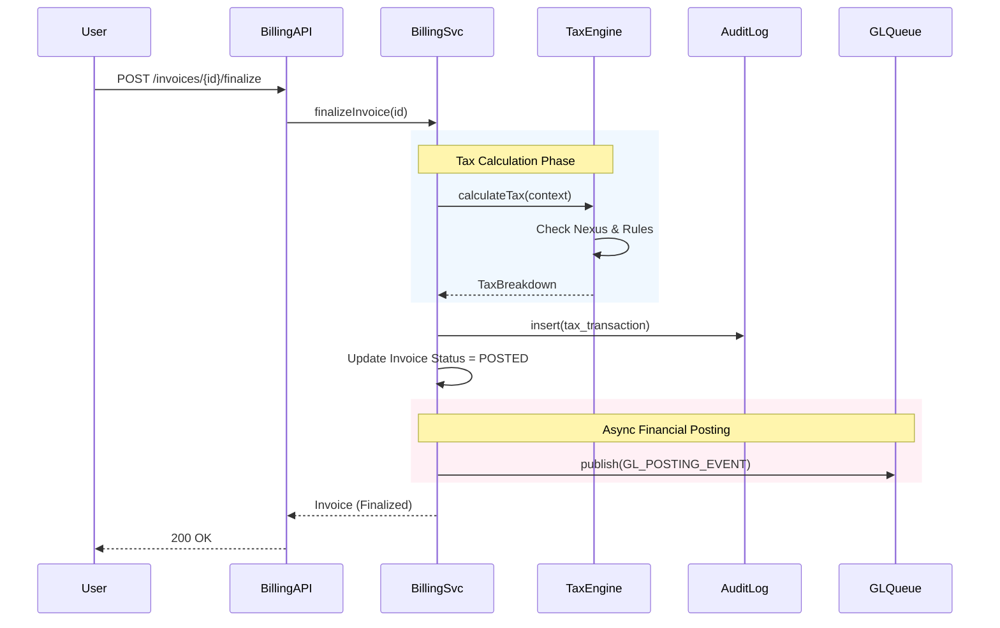

# Low-Level Design (LLD) Document

## 1. Module/Class Diagrams

### Core Interfaces
```typescript
interface IQuotationEngine {
  calculate(context: RequestContext, items: LineItem[]): Promise<QuoteResult>;
  validate(context: RequestContext): ValidationResult;
}

interface IFulfillmentOrchestrator {
  initiate(orderId: string): Promise<FulfillmentPlan>;
  cancel(orderId: string): Promise<boolean>;
}
```

### Domain Implementations
```typescript
class LogisticsQuotationAdapter implements IQuotationEngine {
  calculate(context, items) {
    // Logistics specific logic
    // 1. Calculate Volumetric Weight
    // 2. Query Carrier Rates
    // 3. Apply Fuel Surcharge
    return quote;
  }
}

class BankingQuotationAdapter implements IQuotationEngine {
  calculate(context, items) {
    // Banking specific logic
    // 1. Fetch Credit Score
    // 2. Determine Risk Tier
    // 3. Calculate Interest Rate
    return quote;
  }
}
```

## 2. Database Schema Design (PostgreSQL)

### 2.1 Core Multi-Tenancy
```sql
CREATE TABLE tenants (
  id UUID PRIMARY KEY DEFAULT gen_random_uuid(),
  name TEXT NOT NULL,
  domain_type TEXT NOT NULL CHECK (domain_type IN ('LOGISTICS', 'BANKING', 'TELECOM')),
  config JSONB DEFAULT '{}', -- Feature flags
  created_at TIMESTAMPTZ DEFAULT NOW()
);

CREATE TABLE users (
  id UUID PRIMARY KEY DEFAULT gen_random_uuid(),
  tenant_id UUID REFERENCES tenants(id),
  email TEXT NOT NULL,
  role TEXT NOT NULL,
  UNIQUE(tenant_id, email)
);
```

### 2.2 Taxation & Financials Module
```sql
-- Tax Jurisdictions (Master Data)
CREATE TABLE tax_jurisdictions (
  code TEXT PRIMARY KEY, -- e.g., 'US-NY', 'DE'
  name TEXT NOT NULL,
  type TEXT CHECK (type IN ('COUNTRY', 'STATE', 'CITY', 'DISTRICT')),
  currency_code CHAR(3) NOT NULL
);

-- Tax Rules (Versioned)
CREATE TABLE tax_rules (
  id UUID PRIMARY KEY DEFAULT gen_random_uuid(),
  jurisdiction_code TEXT REFERENCES tax_jurisdictions(code),
  product_category TEXT NOT NULL, -- UNSPSC/HTS
  rule_type TEXT NOT NULL, -- 'STANDARD', 'REDUCED', 'ZERO'
  rate_percentage DECIMAL(5,4) NOT NULL,
  effective_from DATE NOT NULL,
  effective_to DATE,
  created_by UUID REFERENCES users(id)
);

-- Invoices
CREATE TABLE invoices (
  id UUID PRIMARY KEY DEFAULT gen_random_uuid(),
  tenant_id UUID REFERENCES tenants(id),
  customer_id UUID NOT NULL,
  status TEXT CHECK (status IN ('DRAFT', 'POSTED', 'PAID', 'VOID')),
  subtotal DECIMAL(12,2) NOT NULL,
  tax_total DECIMAL(12,2) NOT NULL,
  grand_total DECIMAL(12,2) NOT NULL,
  currency CHAR(3) NOT NULL,
  created_at TIMESTAMPTZ DEFAULT NOW()
);

-- Tax Transactions (Audit Log)
CREATE TABLE tax_transactions (
  id UUID PRIMARY KEY DEFAULT gen_random_uuid(),
  invoice_id UUID REFERENCES invoices(id),
  jurisdiction_code TEXT REFERENCES tax_jurisdictions(code),
  taxable_amount DECIMAL(12,2) NOT NULL,
  tax_amount DECIMAL(12,2) NOT NULL,
  rate_applied DECIMAL(5,4) NOT NULL,
  rule_id UUID REFERENCES tax_rules(id),
  calculation_timestamp TIMESTAMPTZ DEFAULT NOW()
);

-- General Ledger Entries
CREATE TABLE gl_journal_entries (
  id UUID PRIMARY KEY DEFAULT gen_random_uuid(),
  tenant_id UUID REFERENCES tenants(id),
  reference_id UUID NOT NULL, -- Link to Invoice/Payment
  posting_date DATE NOT NULL,
  description TEXT,
  status TEXT CHECK (status IN ('DRAFT', 'POSTED'))
);

CREATE TABLE gl_journal_lines (
  id UUID PRIMARY KEY DEFAULT gen_random_uuid(),
  journal_id UUID REFERENCES gl_journal_entries(id),
  account_code TEXT NOT NULL,
  debit_amount DECIMAL(12,2) DEFAULT 0,
  credit_amount DECIMAL(12,2) DEFAULT 0
);
```

## 3. Class & Component Design

### 3.1 Backend Components (Node.js/TypeScript)
```typescript
// Core Tax Engine
class TaxEngine {
  constructor(private ruleRepo: TaxRuleRepository, private nexusService: NexusService) {}

  async calculateTax(context: TaxContext): Promise<TaxBreakdown> {
    // 1. Validate Nexus
    const nexus = await this.nexusService.checkNexus(context.origin, context.destination);
    if (!nexus.exists) return { total: 0, lines: [] };

    // 2. Fetch Effective Rules
    const rules = await this.ruleRepo.findEffectiveRules(
      nexus.jurisdictions, 
      context.items.map(i => i.productCode),
      context.date
    );

    // 3. Compute
    return this.computeLines(context.items, rules);
  }
}

// Billing Orchestrator
class BillingService {
  constructor(private taxEngine: TaxEngine, private glConnector: IGLConnector) {}

  async finalizeInvoice(invoiceId: string): Promise<Invoice> {
    const invoice = await this.repo.findById(invoiceId);
    
    // 1. Final Tax Calc & Commit
    const taxResult = await this.taxEngine.calculateTax(invoice.toContext());
    await this.taxRepo.saveTransaction(invoice.id, taxResult);
    
    // 2. Update Invoice
    invoice.taxTotal = taxResult.total;
    invoice.status = 'POSTED';
    await this.repo.save(invoice);

    // 3. Post to GL (Async)
    await this.glConnector.postJournal({
      refId: invoice.id,
      entries: [
        { account: 'AR', debit: invoice.total },
        { account: 'SALES', credit: invoice.subtotal },
        { account: 'TAX_LIAB', credit: invoice.taxTotal }
      ]
    });

    return invoice;
  }
}
```

## 4. Sequence Diagrams

### 4.1 Invoice Finalization & Tax Commit


## 5. API Specifications (Tax & Financials)

### 5.1 Tax Calculation
*   **POST** `/api/v1/tax/calculate`
*   **Description:** Stateless calculation for quotes/carts.
*   **Request:**
    ```json
    {
      "date": "2023-10-27",
      "origin": { "country": "US", "zip": "10001" },
      "destination": { "country": "US", "zip": "90210" },
      "items": [
        { "amount": 100.00, "product_code": "81112000" }
      ]
    }
    ```
*   **Response:**
    ```json
    {
      "total_tax": 8.50,
      "breakdown": [
        { "jurisdiction": "CA", "rate": 0.06, "amount": 6.00 },
        { "jurisdiction": "LA County", "rate": 0.025, "amount": 2.50 }
      ]
    }
    ```

### 5.2 GL Journal Sync
*   **POST** `/api/v1/gl/journals` (Internal)
*   **Request:**
    ```json
    {
      "ref_id": "inv_123",
      "entries": [
        { "code": "1200", "type": "DEBIT", "amount": 108.50 },
        { "code": "4000", "type": "CREDIT", "amount": 100.00 },
        { "code": "2200", "type": "CREDIT", "amount": 8.50 }
      ]
    }
    ```

## 6. Error Handling Strategy (Financials)
*   **Precision Errors:** Use `decimal` types in DB and `Big.js` in Node.js to avoid floating point errors.
*   **Tax Service Failure:** If Tax Engine is down, `finalizeInvoice` MUST fail (Atomic Transaction).
*   **GL Sync Failure:** Use "Outbox Pattern". Save event to DB first, then push to Queue. Retry with exponential backoff.
