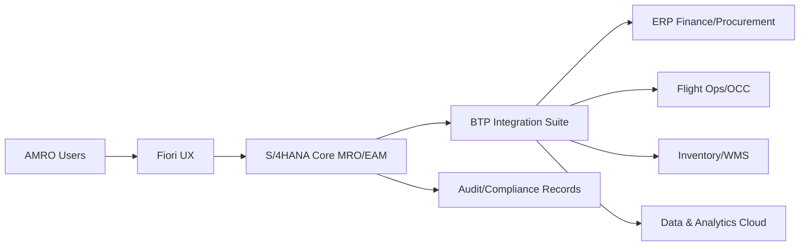
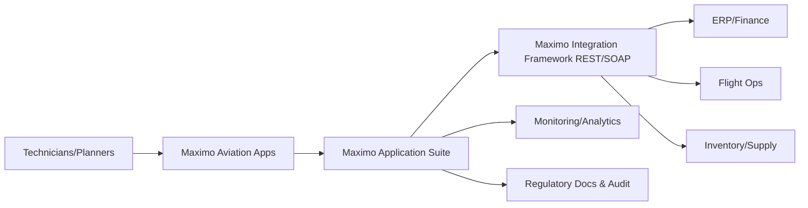
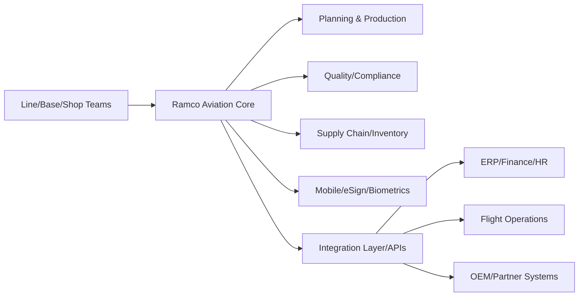
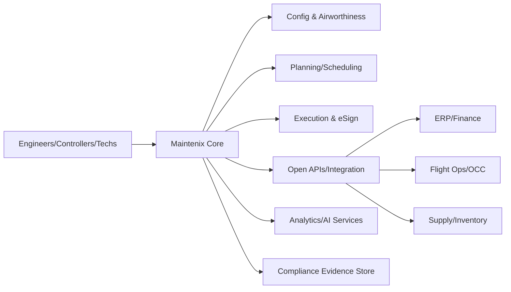
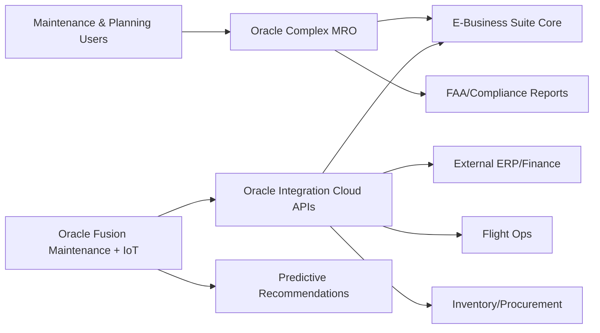
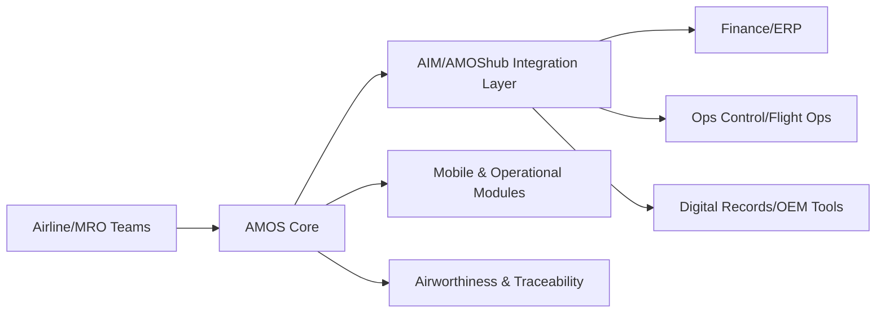
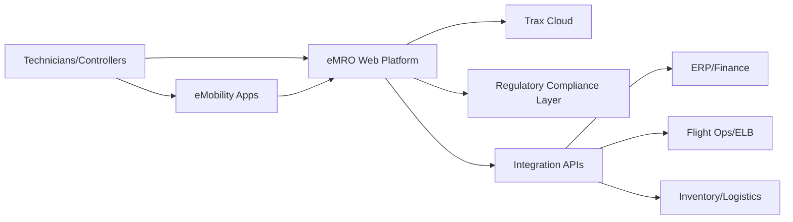
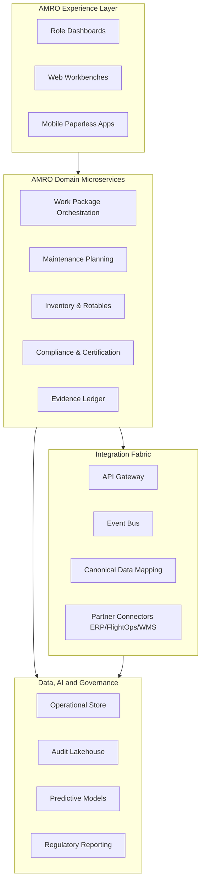

# AMRO Low Level Design (LLD)
## Aircraft Maintenance, Repair, and Overhaul Platform

**Document ID:** LLD-AMRO-001  
**Version:** 2.2.0  
**Date:** 2026-03-21  
**Status:** Draft for Architecture and Compliance Review  
**Owner:** AMRO Architecture Working Group  
**Scope:** Detailed implementation design for AMRO modules, UI/UX, and data architecture across Platform → Admin → Multi-Tenant → Multi-Franchisee hierarchy

---

## 1. Purpose and Design Basis

This Low Level Design defines the executable technical blueprint for delivering AMRO as an industry-leading MRO solution on Logic Nexus-AI. It converts business and regulatory requirements into implementation-grade tasks, user experiences, data models, integration contracts, and validation controls.

### 1.1 Mandatory Source References Consulted

- `docs/AMRO_DOCUMENTATION_INDEX.md`
- `docs/AMRO_COMPREHENSIVE_DESIGN_SPECIFICATION.md`
- `docs/AMRO_IMPLEMENTATION_ROADMAP.md`
- `docs/AMRO_DEPLOYMENT_PROCEDURES.md`
- `artifacts/mro/analysis/amro-plugin-requirements-spec-v1.0.md`
- `docs/plans/2026-03-19-amro-plugin-implementation.md`
- `docs/plans/2026-03-19-amro-plugin-implementation-reference.md`
- `docs/AMRO_PLATFORM_INTEGRATION_ARCHITECTURE.md`
- `docs/AMRO_QUICK_REFERENCE_GUIDE.md`

### 1.2 Design Goals

- Deliver deterministic, auditable maintenance workflows for line, base, and component maintenance.
- Enforce strict tenant and franchise isolation with role-aware access controls.
- Provide high-velocity operations UX for technicians, engineers, inspectors, planners, and management.
- Support FAA/EASA/CAAC evidence models and long-term replayable audit trails.
- Enable real-time and offline-first operations with conflict-safe synchronization.
- Build differentiating capabilities through IoT ingestion, predictive analytics, and AI maintenance forecasting.

### 1.3 Database Rename Addendum (2026-04-25)

- Canonical AMRO template table name is `public.work_order_templates`.
- Legacy name `public.work_order_templates` is retained as a compatibility view during transition.
- API and service layers normalize legacy entity tokens to `work_order_templates`.
- Rollback path restores physical table name to `work_order_templates` and removes compatibility view.

---

## 2. Architecture Context and System Decomposition

### 2.1 Platform Hierarchy Alignment

| Tier | Responsibility | AMRO Responsibilities |
|---|---|---|
| Platform | Global governance, shared IAM, observability, domain registry | Domain registration, cross-tenant controls, global policy templates |
| Admin | Global admin oversight and exception controls | Regulatory pack management, tenant onboarding, audit visibility |
| Multi-Tenant | Tenant-specific operations and data partitioning | Fleet configuration, process templates, local compliance profiles |
| Multi-Franchisee | Franchise-level execution and local process variants | Station-level scheduling, local staffing, shift execution |

### 2.2 LLD Service Components

| Component | Type | Primary Functions | Data Ownership |
|---|---|---|---|
| Maintenance Scheduling Service | Domain service | Slot planning, resource constraints, disruption re-planning | schedules, schedule_constraints |
| Work Order Orchestration Service | Domain service | Work package lifecycle, transitions, closure gates | work_orders, tasks |
| Parts Inventory Service | Domain service | Stock allocation, reservations, rotable traceability | parts_inventory, stock_movements, reservations |
| Compliance Control Service | Domain service | AD/SB controls, MEL/CDL checks, gate enforcement | compliance_records, compliance_obligations |
| Certification Service | Domain service | Staff qualifications, certifying authority, release approval | staff_qualifications, certification_actions |
| Evidence Ledger Service | Domain service | Immutable event trail and signed evidence chain | maintenance_events, mro_audit.records, mro_audit.trails |
| Integration Hub | Adapter layer | ERP/MES/IoT/Webhook connectors | integration_jobs, integration_mappings |
| Forecast Engine | AI service | Failure risk scores, recommendation generation | asset_health_signals, forecast_outputs |

### 2.3 Cross-Cutting Technical Standards

- API contracts: versioned REST + GraphQL compatibility layer.
- Data isolation: mandatory `tenant_id` + `franchise_id` filtering and RLS on all AMRO entities.
- Authorization: RBAC + contextual ABAC checks for certifying privileges.
- Eventing: Kafka topics for lifecycle, compliance, and inventory state changes.
- Observability: OpenTelemetry tracing, structured logs, KPI metrics, SLO dashboards.
- Security: encryption in transit/at rest, signature verification, non-repudiation controls.

---

## 3. Requirement-to-Implementation Traceability

### 3.1 Traceability Identifier Scheme

| Type | Format | Example |
|---|---|---|
| Business Requirement | BR-AMRO-XXX | BR-AMRO-003 |
| Functional Requirement | FR-AMRO-XXX | FR-AMRO-016 |
| Non-Functional Requirement | NFR-AMRO-XXX | NFR-AMRO-004 |
| UX Component | UX-AMRO-XXX | UX-AMRO-005 |
| Data Object | DB-AMRO-XXX | DB-AMRO-012 |
| API Contract | API-AMRO-XXX | API-AMRO-021 |
| Task | TSK-AMRO-Px-XXX | TSK-AMRO-P2-014 |
| Test | TC-AMRO-XXX | TC-AMRO-033 |

### 3.2 Core Traceability Matrix

| BR | FR/NFR | UX | DB | API | Implementation Tasks | Validation |
|---|---|---|---|---|---|---|
| BR-AMRO-001 Reduce maintenance turnaround | FR-001/002/003, NFR-001 | UX-001/002/019 | DB-004/005/006 | API-001/003/015 | TSK-P1-001..018, TSK-P2-004..009 | TC-001, TC-009, TC-027 |
| BR-AMRO-002 Increase planning precision | FR-002/003/015 | UX-003/011/019 | DB-007/010/013 | API-004/008/017 | TSK-P1-019..029, TSK-P2-010..016 | TC-010, TC-014, TC-028 |
| BR-AMRO-003 Meet compliance ≥99.5% | FR-004/016/017/018/019, NFR-004/007 | UX-010/012/013/014 | DB-014/015/016 | API-012/013/018 | TSK-P2-017..030, TSK-P3-011..021 | TC-003, TC-015, TC-033 |
| BR-AMRO-004 Eliminate cross-tenant leakage | NFR-005/007 | UX-017 | DB-001..016 | API-ALL | TSK-P0-001..008, TSK-P1-030..033 | TC-018, TC-019, TC-020 |
| BR-AMRO-005 Support mobile-first execution | FR-010/011/012 | UX-007/008/009/015 | DB-005/015/017 | API-010/011/019 | TSK-P2-001..009, TSK-P3-001..005 | TC-021, TC-022, TC-029 |
| BR-AMRO-006 Enable predictive maintenance differentiation | FR-007/008/009 | UX-001/020 | DB-018/019 | API-020/021 | TSK-P3-022..030, TSK-P4-010..017 | TC-035, TC-036 |

---

## 4. Phase-Wise Implementation Plan and Activities

## 4.1 Phase Overview

| Phase | Weeks | Focus | Milestone | Exit Criteria |
|---|---|---|---|---|
| P0 Foundation | 1-2 | Schema, security, API scaffolding, observability | M0 | Baseline schema, RLS, core contracts, CI checks active |
| P1 Core Workflows | 3-8 | Scheduling + work orders + baseline inventory | M1 | End-to-end create-plan-execute flow operational |
| P2 Compliance and Mobility | 9-14 | Compliance gates, certifications, offline mobile | M2 | Audit replay and mobile sync validated |
| P3 Intelligence and Optimization | 15-20 | Performance hardening, AI forecasting, advanced analytics | M3 | p95/p99 targets and forecast quality baselines met |
| P4 Integration and Scale | 21-26 | ERP/IoT integration, multi-region resilience, GA readiness | M4 | Enterprise adapters and DR drills validated |

### 4.2 Resource Model

| Role | FTE | Key Responsibilities |
|---|---|---|
| Product Manager | 1.0 | Requirement governance, acceptance decisions |
| Solution Architect | 1.0 | Cross-module design integrity, traceability ownership |
| Frontend Engineers | 2.5 | Web and responsive UX delivery |
| Mobile Engineers | 1.5 | Offline execution and sync UX |
| Backend Engineers | 3.0 | Services, APIs, orchestration, integrations |
| Data Engineers | 1.0 | ETL, telemetry pipelines, forecasting data prep |
| QA/Automation | 2.0 | Functional, integration, performance, security tests |
| DevOps/SRE | 1.0 | CI/CD, observability, deployment, DR drills |
| Compliance SME | 0.5 | FAA/EASA/CAAC validation and audit readiness |

### 4.3 Detailed Task Breakdown by Module

#### 4.3.1 Maintenance Scheduling Module

| Task ID | Activity | Dependencies | Owner | Effort | Milestone |
|---|---|---|---|---|---|
| TSK-AMRO-P1-001 | Implement scheduling board UI and slot timeline | P0 APIs, aircraft data | FE | 4d | M1 |
| TSK-AMRO-P1-002 | Build constraint solver (hangar, shift, cert staff) | Staff qualifications, calendar service | BE | 5d | M1 |
| TSK-AMRO-P1-003 | Add disruption re-plan workflow | TSK-P1-002 | FE/BE | 3d | M1 |
| TSK-AMRO-P1-004 | Publish schedule update events | Kafka setup | BE | 2d | M1 |
| TSK-AMRO-P2-004 | Add mobile schedule acknowledgment | Sync engine | Mobile | 2d | M2 |
| TSK-AMRO-P3-002 | Add schedule optimization recommendations | Forecast engine | BE/Data | 4d | M3 |

#### 4.3.2 Work Order Management Module

| Task ID | Activity | Dependencies | Owner | Effort | Milestone |
|---|---|---|---|---|---|
| TSK-AMRO-P1-005 | Create work package CRUD APIs | P0 schema | BE | 5d | M1 |
| TSK-AMRO-P1-006 | Deliver work package list, filters, saved views | UX shell | FE | 4d | M1 |
| TSK-AMRO-P1-007 | Deliver detail sheet with tabs and unsaved protection | TSK-P1-005 | FE | 4d | M1 |
| TSK-AMRO-P1-008 | Build task execution workflow with status transitions | Task schema | FE/BE | 5d | M1 |
| TSK-AMRO-P1-009 | Add role-based action gating | RBAC matrix | FE/BE | 3d | M1 |
| TSK-AMRO-P2-005 | Add e-signature and evidence binding | Signature service | FE/BE | 3d | M2 |
| TSK-AMRO-P2-006 | Implement closure quality gate checks | Compliance service | BE | 4d | M2 |

#### 4.3.3 Parts Inventory Module

| Task ID | Activity | Dependencies | Owner | Effort | Milestone |
|---|---|---|---|---|---|
| TSK-AMRO-P1-010 | Build parts allocation panel in work package | Work package detail | FE | 3d | M1 |
| TSK-AMRO-P1-011 | Implement reservation and allocation APIs | Inventory schema | BE | 4d | M1 |
| TSK-AMRO-P1-012 | Add shortage and ETA indicators | Supplier data | FE/BE | 2d | M1 |
| TSK-AMRO-P2-007 | Add rotable/LLP traceability controls | Component history | BE | 3d | M2 |
| TSK-AMRO-P3-003 | Implement inventory optimization model hooks | Forecast output | Data/BE | 4d | M3 |
| TSK-AMRO-P4-005 | Integrate supplier ASN and ERP procurement sync | Integration hub | BE | 5d | M4 |

#### 4.3.4 Compliance Tracking Module

| Task ID | Activity | Dependencies | Owner | Effort | Milestone |
|---|---|---|---|---|---|
| TSK-AMRO-P2-008 | Implement AD/SB obligation ingestion and mapping | Integration adapters | BE | 5d | M2 |
| TSK-AMRO-P2-009 | Implement MEL/CDL deferral policy engine | Rules model | BE | 4d | M2 |
| TSK-AMRO-P2-010 | Build compliance gate modal and explainability panel | Policy APIs | FE | 3d | M2 |
| TSK-AMRO-P2-011 | Build audit replay timeline and export filters | Audit schema | FE/BE | 4d | M2 |
| TSK-AMRO-P3-004 | Add compliance anomaly detection alerts | Analytics pipeline | Data/BE | 3d | M3 |
| TSK-AMRO-P4-006 | Enable regulator profile packs (FAA/EASA/CAAC) | Compliance metadata | BE | 4d | M4 |

#### 4.3.5 Certification Management Module

| Task ID | Activity | Dependencies | Owner | Effort | Milestone |
|---|---|---|---|---|---|
| TSK-AMRO-P1-013 | Build qualification status indicators in detail UI | Qualification API | FE | 2d | M1 |
| TSK-AMRO-P2-012 | Implement certifying privilege validation service | Staff qualification schema | BE | 4d | M2 |
| TSK-AMRO-P2-013 | Build certification action workflow (approve/reject/defer) | TSK-P2-012 | FE/BE | 3d | M2 |
| TSK-AMRO-P2-014 | Implement expiry warning and suspension automation | Notification service | BE | 3d | M2 |
| TSK-AMRO-P3-005 | Add competency analytics dashboard | KPI pipeline | FE/Data | 3d | M3 |
| TSK-AMRO-P4-007 | Add authority-specific certification templates | Regulator pack service | BE | 3d | M4 |

### 4.4 Phase Dependency Matrix

| Dependency | Consumed By | Criticality | Mitigation |
|---|---|---|---|
| P0 schema + RLS | All modules | High | Block merge until RLS integration tests pass |
| Auth + RBAC claims | Work orders, certification, compliance | High | Contract tests on permission matrix |
| Kafka + telemetry pipelines | Scheduling, compliance, AI | Medium | Degraded sync mode with queued retries |
| Mobile sync engine | Field execution | High | Local queue + deterministic conflict resolver |
| Integration adapters | Compliance and inventory external sync | Medium | Adapter circuit-breakers and replay queue |

### 4.5 Milestone Definition and Evidence

| Milestone | Required Artifacts | Approval Gate |
|---|---|---|
| M0 Foundation | Schema migration report, API scaffold tests, RLS tests | Architecture + Security |
| M1 Core Workflow | E2E create-plan-view test evidence, UX acceptance notes | Product + Engineering |
| M2 Compliance Ready | Audit replay evidence, regulator test packs, signature validation | Compliance + QA |
| M3 Performance + Intelligence | Load test report, p95/p99 report, forecast quality metrics | Engineering + SRE |
| M4 Integration + Scale | ERP/IoT integration report, DR drill results, rollout playbook | Operations + Leadership |

### 4.6 Development Start Sequence (Execution Order)

This section defines the engineering execution order, per-phase implementation scope, and concrete delivery artifacts required to build AMRO.

#### 4.6.1 Phase-by-Phase Engineering Implementation Plan

| Phase | Backend Build Scope | Frontend Build Scope | Data and Security Scope | Test Scope | Deliverables |
|---|---|---|---|---|---|
| P0 Foundation | Build v2 API skeletons, request/response envelope utilities, error model, auth middleware hooks | Build AMRO route shell, module navigation entry points, placeholder pages for Overview/Work Package/Scheduling | Create baseline tables and RLS policies with tenant_id and franchise_id; enforce AMRO domain assignment checks | Add unit tests for auth/access middleware and contract health endpoints | Running AMRO domain routes, secured API scaffold, passing CI baseline |
| P1 Core Workflows | Implement work package lifecycle APIs (create/transition/clone), task step update APIs, parts reserve/shortage APIs | Implement SCR-AMRO-001/002/003/004/005/006/007 baseline views and forms | Implement schema for work_orders, tasks, reservations, stock movements with policy-safe transitions | Add integration tests for plan-to-execute flow and API validation rules | End-to-end flow: create WP -> schedule -> execute task -> reserve parts |
| P2 Compliance and Mobility | Implement compliance gate, exception, dossier APIs; implement certification authority and decision APIs | Implement SCR-AMRO-008/009/010 and mobile execution behavior including offline queue UX | Add compliance_records, obligations, certification_actions, signed evidence references; enforce ABAC cert rules | Add replayable audit tests, signature integrity tests, offline sync conflict tests | Compliance and certification gate path fully executable with audit trail |
| P3 Intelligence and Optimization | Implement risk scoring, intervention recommendation, feedback capture APIs; optimize heavy queries | Implement SCR-AMRO-011/012 analytics, forecast explainability, operator action feedback UI | Add forecast_outputs, asset_health_signals, model feedback policy configs | Add model contract tests, low-confidence flag tests, p95/p99 performance tests | Forecast loop operational: score -> recommend -> outcome feedback |
| P4 Integration and Scale | Implement partner ingest/replay/callback hardening, adapter retries, dead-letter/replay orchestration | Implement integration monitor operational console hardening and admin controls | Add integration_jobs/mappings audit fields, retention rules, and replay governance controls | Add adapter contract tests, resilience tests, DR validation tests | Production-ready integrations with replay, observability, and DR evidence |

#### 4.6.2 Engineering Sequence by Sprint Window

| Sprint Window | Build Order | Mandatory Outputs |
|---|---|---|
| Weeks 1-2 (P0) | Access control -> API scaffolding -> schema/RLS -> observability -> CI gates | Security-approved scaffold PRs, migration scripts, API contract stubs |
| Weeks 3-5 (P1-A) | Work package CRUD/transition APIs -> Work Package List/Create/Detail UI | Working SCR-AMRO-002/003/004 with server-backed APIs |
| Weeks 6-8 (P1-B) | Task execution + parts reservation + scheduling APIs/UI | Working SCR-AMRO-005/006/007 and plan-to-execute integration tests |
| Weeks 9-11 (P2-A) | Compliance APIs/UI + gate explainability + exception workflow | Working SCR-AMRO-008 and dossier generation path |
| Weeks 12-14 (P2-B) | Certification APIs/UI + audit replay timeline + offline sync conflict handling | Working SCR-AMRO-009/010 with signed audit evidence |
| Weeks 15-17 (P3-A) | Forecast scoring + recommendation engine + dashboard integration | Working SCR-AMRO-012 with confidence segmentation and rationale |
| Weeks 18-20 (P3-B) | Query/performance optimization + anomaly tuning + operational SLO hardening | p95/p99 evidence and quality benchmark report |
| Weeks 21-23 (P4-A) | Partner ingest/replay/callback production hardening | Working SCR-AMRO-011 with replay controls and policy checks |
| Weeks 24-26 (P4-B) | Multi-region readiness, DR rehearsal, release hardening | GA readiness pack with DR, rollback, and runbook evidence |

#### 4.6.3 Module-to-Interface Build Order (Developer Backlog Sequence)

| Order | Module | Primary Interfaces to Implement | Depends On | Done Definition |
|---|---|---|---|---|
| 1 | Work Order Management | 15.2.2 create/transition/clone work package | P0 auth + schema | All transition policies and role checks enforced |
| 2 | Task Execution and Evidence | 15.2.3 update step/upload evidence/submit signature | Work package lifecycle | Step-order and signature validity tests pass |
| 3 | Maintenance Scheduling | 15.2.4 assign slot/replan/confirm replan | Work package + staff constraints | No-overlap and capacity validations pass |
| 4 | Parts and Materials | 15.2.5 reserve/shortage response/supplier ETA sync | Work package + inventory schema | Shortage and serialized uniqueness checks pass |
| 5 | Compliance and Airworthiness | 15.2.6 evaluate gate/register exception/generate dossier | Task + parts + scheduling data | Mandatory obligation evidence complete |
| 6 | Certification and Authority | 15.2.7 authority validation/decision/escalation | Compliance outcomes + staff qualifications | Zero unresolved blockers before approve |
| 7 | Integration and Partner Hub | 15.2.8 ingest/replay/publish callback | Core module events stable | Idempotency, allow-list, schema-version checks pass |
| 8 | Forecast and Reliability | 15.2.9 risk score/recommend/outcome capture | Historical events + telemetry | Low-confidence flags and feedback policy checks pass |

#### 4.6.4 Definition of Done per Phase (Developer Acceptance Checklist)

- All phase interfaces are implemented with explicit input contract, output contract, and validation rules.
- Tenant and franchise isolation is enforced in every query path and validated by tests.
- UI screens in the phase are connected to live APIs and preserve required module shell behavior.
- Audit ledger events are emitted for every state-changing operation in the phase.
- Phase test suite passes: unit, integration, and regression tests for impacted modules.
- Repository checks pass before merge: lint, typecheck, and required API contract checks.
- Release artifact includes rollback-safe migration scripts and compatibility notes for changed endpoints.

#### 4.6.5 Target Code Locations by Interface (Direct Engineer Assignment)

| Interface Group | Interface Query Value | Endpoint Route | Handler File | Primary Test File | Contract File to Update | Supporting Files |
|---|---|---|---|---|---|---|
| 15.2.2 Work Package Management | create-work-order | /api/v2/amro/work-orders | src/pages/api/v2/amro/work-orders.ts | src/pages/api/v2/amro/work-orders.test.ts | src/pages/api/v2/amro/contracts/openapi-3.1.yaml | src/pages/api/v2/amro/audit-ledger.ts; src/pages/api/v2/amro/anti-corruption-adapter.ts; src/features/module-amro/pages/AmroHubVerticalPage.tsx; src/pages/api/v2/amro/contracts/contract-endpoints.test.ts |
| 15.2.2 Work Package Management | transition-work-order | /api/v2/amro/work-orders | src/pages/api/v2/amro/work-orders.ts | src/pages/api/v2/amro/work-orders.test.ts | src/pages/api/v2/amro/contracts/openapi-3.1.yaml | src/pages/api/v2/amro/audit-ledger.ts; src/pages/api/v2/amro/anti-corruption-adapter.ts; src/features/module-amro/pages/AmroHubVerticalPage.tsx; src/pages/api/v2/amro/contracts/contract-endpoints.test.ts |
| 15.2.2 Work Package Management | clone-template | /api/v2/amro/work-orders | src/pages/api/v2/amro/work-orders.ts | src/pages/api/v2/amro/work-orders.test.ts | src/pages/api/v2/amro/contracts/openapi-3.1.yaml | src/pages/api/v2/amro/audit-ledger.ts; src/pages/api/v2/amro/anti-corruption-adapter.ts; src/features/module-amro/pages/AmroHubVerticalPage.tsx; src/pages/api/v2/amro/contracts/contract-endpoints.test.ts |
| 15.2.3 Task Execution and Evidence | update-task-step | /api/v2/amro/tasks | src/pages/api/v2/amro/tasks.ts | src/pages/api/v2/amro/tasks.test.ts | src/pages/api/v2/amro/contracts/openapi-3.1.yaml | src/pages/api/v2/amro/audit-ledger.ts; src/pages/api/v2/amro/anti-corruption-adapter.ts; src/features/module-amro/pages/AmroHubVerticalPage.tsx; src/pages/api/v2/amro/contracts/contract-endpoints.test.ts |
| 15.2.3 Task Execution and Evidence | upload-evidence | /api/v2/amro/tasks | src/pages/api/v2/amro/tasks.ts | src/pages/api/v2/amro/tasks.test.ts | src/pages/api/v2/amro/contracts/openapi-3.1.yaml | src/pages/api/v2/amro/audit-ledger.ts; src/pages/api/v2/amro/anti-corruption-adapter.ts; src/features/module-amro/pages/AmroHubVerticalPage.tsx; src/pages/api/v2/amro/contracts/contract-endpoints.test.ts |
| 15.2.3 Task Execution and Evidence | submit-signature | /api/v2/amro/tasks | src/pages/api/v2/amro/tasks.ts | src/pages/api/v2/amro/tasks.test.ts | src/pages/api/v2/amro/contracts/openapi-3.1.yaml | src/pages/api/v2/amro/audit-ledger.ts; src/pages/api/v2/amro/anti-corruption-adapter.ts; src/features/module-amro/pages/AmroHubVerticalPage.tsx; src/pages/api/v2/amro/contracts/contract-endpoints.test.ts |
| 15.2.4 Maintenance Scheduling | assign-maintenance-slot | /api/v2/amro/work-orders | src/pages/api/v2/amro/work-orders.ts | src/pages/api/v2/amro/work-orders.test.ts | src/pages/api/v2/amro/contracts/openapi-3.1.yaml | src/pages/api/v2/amro/audit-ledger.ts; src/pages/api/v2/amro/anti-corruption-adapter.ts; src/features/module-amro/pages/AmroHubVerticalPage.tsx; src/pages/api/v2/amro/contracts/contract-endpoints.test.ts |
| 15.2.4 Maintenance Scheduling | run-replan-simulation | /api/v2/amro/work-orders | src/pages/api/v2/amro/work-orders.ts | src/pages/api/v2/amro/work-orders.test.ts | src/pages/api/v2/amro/contracts/openapi-3.1.yaml | src/pages/api/v2/amro/audit-ledger.ts; src/pages/api/v2/amro/anti-corruption-adapter.ts; src/features/module-amro/pages/AmroHubVerticalPage.tsx; src/pages/api/v2/amro/contracts/contract-endpoints.test.ts |
| 15.2.4 Maintenance Scheduling | confirm-replan | /api/v2/amro/work-orders | src/pages/api/v2/amro/work-orders.ts | src/pages/api/v2/amro/work-orders.test.ts | src/pages/api/v2/amro/contracts/openapi-3.1.yaml | src/pages/api/v2/amro/audit-ledger.ts; src/pages/api/v2/amro/anti-corruption-adapter.ts; src/features/module-amro/pages/AmroHubVerticalPage.tsx; src/pages/api/v2/amro/contracts/contract-endpoints.test.ts |
| 15.2.5 Parts and Materials | reserve-parts | /api/v2/amro/work-orders | src/pages/api/v2/amro/work-orders.ts | src/pages/api/v2/amro/work-orders.test.ts | src/pages/api/v2/amro/contracts/openapi-3.1.yaml | src/pages/api/v2/amro/audit-ledger.ts; src/pages/api/v2/amro/anti-corruption-adapter.ts; src/features/module-amro/pages/AmroHubVerticalPage.tsx; src/pages/api/v2/amro/contracts/contract-endpoints.test.ts |
| 15.2.5 Parts and Materials | process-shortage-response | /api/v2/amro/work-orders | src/pages/api/v2/amro/work-orders.ts | src/pages/api/v2/amro/work-orders.test.ts | src/pages/api/v2/amro/contracts/openapi-3.1.yaml | src/pages/api/v2/amro/audit-ledger.ts; src/pages/api/v2/amro/anti-corruption-adapter.ts; src/features/module-amro/pages/AmroHubVerticalPage.tsx; src/pages/api/v2/amro/contracts/contract-endpoints.test.ts |
| 15.2.5 Parts and Materials | sync-supplier-eta | /api/v2/amro/work-orders | src/pages/api/v2/amro/work-orders.ts | src/pages/api/v2/amro/work-orders.test.ts | src/pages/api/v2/amro/contracts/openapi-3.1.yaml | src/pages/api/v2/amro/audit-ledger.ts; src/pages/api/v2/amro/anti-corruption-adapter.ts; src/features/module-amro/pages/AmroHubVerticalPage.tsx; src/pages/api/v2/amro/contracts/contract-endpoints.test.ts |
| 15.2.6 Compliance and Airworthiness | evaluate-compliance-gate | /api/v2/amro/compliance-gates | src/pages/api/v2/amro/compliance-gates.ts | src/pages/api/v2/amro/compliance-gates.test.ts | src/pages/api/v2/amro/contracts/openapi-3.1.yaml | src/pages/api/v2/amro/audit-ledger.ts; src/pages/api/v2/amro/anti-corruption-adapter.ts; src/features/module-amro/pages/AmroHubVerticalPage.tsx; src/pages/api/v2/amro/contracts/contract-endpoints.test.ts |
| 15.2.6 Compliance and Airworthiness | register-exception-request | /api/v2/amro/compliance-gates | src/pages/api/v2/amro/compliance-gates.ts | src/pages/api/v2/amro/compliance-gates.test.ts | src/pages/api/v2/amro/contracts/openapi-3.1.yaml | src/pages/api/v2/amro/audit-ledger.ts; src/pages/api/v2/amro/anti-corruption-adapter.ts; src/features/module-amro/pages/AmroHubVerticalPage.tsx; src/pages/api/v2/amro/contracts/contract-endpoints.test.ts |
| 15.2.6 Compliance and Airworthiness | generate-compliance-dossier | /api/v2/amro/compliance-gates | src/pages/api/v2/amro/compliance-gates.ts | src/pages/api/v2/amro/compliance-gates.test.ts | src/pages/api/v2/amro/contracts/openapi-3.1.yaml | src/pages/api/v2/amro/audit-ledger.ts; src/pages/api/v2/amro/anti-corruption-adapter.ts; src/features/module-amro/pages/AmroHubVerticalPage.tsx; src/pages/api/v2/amro/contracts/contract-endpoints.test.ts |
| 15.2.7 Certification and Authority | validate-certifying-authority | /api/v2/amro/certification | src/pages/api/v2/amro/certification.ts | src/pages/api/v2/amro/certification.test.ts | src/pages/api/v2/amro/contracts/openapi-3.1.yaml | src/pages/api/v2/amro/audit-ledger.ts; src/pages/api/v2/amro/anti-corruption-adapter.ts; src/features/module-amro/pages/AmroHubVerticalPage.tsx; src/pages/api/v2/amro/contracts/contract-endpoints.test.ts |
| 15.2.7 Certification and Authority | submit-certification-decision | /api/v2/amro/certification | src/pages/api/v2/amro/certification.ts | src/pages/api/v2/amro/certification.test.ts | src/pages/api/v2/amro/contracts/openapi-3.1.yaml | src/pages/api/v2/amro/audit-ledger.ts; src/pages/api/v2/amro/anti-corruption-adapter.ts; src/features/module-amro/pages/AmroHubVerticalPage.tsx; src/pages/api/v2/amro/contracts/contract-endpoints.test.ts |
| 15.2.7 Certification and Authority | escalate-blocked-certification | /api/v2/amro/certification | src/pages/api/v2/amro/certification.ts | src/pages/api/v2/amro/certification.test.ts | src/pages/api/v2/amro/contracts/openapi-3.1.yaml | src/pages/api/v2/amro/audit-ledger.ts; src/pages/api/v2/amro/anti-corruption-adapter.ts; src/features/module-amro/pages/AmroHubVerticalPage.tsx; src/pages/api/v2/amro/contracts/contract-endpoints.test.ts |
| 15.2.8 Integration and Partner Hub | ingest-partner-payload | /api/v2/amro/integration-hub | src/pages/api/v2/amro/integration-hub.ts | src/pages/api/v2/amro/integration-hub.test.ts | src/pages/api/v2/amro/contracts/openapi-3.1.yaml | src/pages/api/v2/amro/audit-ledger.ts; src/pages/api/v2/amro/anti-corruption-adapter.ts; src/pages/api/v2/amro/integration-contracts.ts; src/pages/api/v2/amro/integration-contracts.test.ts; src/pages/api/v2/amro/contracts/asyncapi-2.6.yaml |
| 15.2.8 Integration and Partner Hub | replay-failed-integration-job | /api/v2/amro/integration-hub | src/pages/api/v2/amro/integration-hub.ts | src/pages/api/v2/amro/integration-hub.test.ts | src/pages/api/v2/amro/contracts/openapi-3.1.yaml | src/pages/api/v2/amro/audit-ledger.ts; src/pages/api/v2/amro/anti-corruption-adapter.ts; src/pages/api/v2/amro/integration-contracts.ts; src/pages/api/v2/amro/integration-contracts.test.ts; src/pages/api/v2/amro/contracts/asyncapi-2.6.yaml |
| 15.2.8 Integration and Partner Hub | publish-outbound-callback | /api/v2/amro/integration-hub | src/pages/api/v2/amro/integration-hub.ts | src/pages/api/v2/amro/integration-hub.test.ts | src/pages/api/v2/amro/contracts/openapi-3.1.yaml | src/pages/api/v2/amro/audit-ledger.ts; src/pages/api/v2/amro/anti-corruption-adapter.ts; src/pages/api/v2/amro/integration-contracts.ts; src/pages/api/v2/amro/integration-contracts.test.ts; src/pages/api/v2/amro/contracts/asyncapi-2.6.yaml |
| 15.2.9 Forecast and Reliability | score-maintenance-risk | /api/v2/amro/forecast-reliability | src/pages/api/v2/amro/forecast-reliability.ts | src/pages/api/v2/amro/forecast-reliability.test.ts | src/pages/api/v2/amro/contracts/openapi-3.1.yaml | src/pages/api/v2/amro/audit-ledger.ts; src/pages/api/v2/amro/anti-corruption-adapter.ts; src/features/module-amro/hooks/useAmroOverviewKpi.ts; src/features/module-amro/pages/AmroHubVerticalPage.tsx; src/pages/api/v2/amro/contracts/contract-endpoints.test.ts |
| 15.2.9 Forecast and Reliability | generate-intervention-recommendations | /api/v2/amro/forecast-reliability | src/pages/api/v2/amro/forecast-reliability.ts | src/pages/api/v2/amro/forecast-reliability.test.ts | src/pages/api/v2/amro/contracts/openapi-3.1.yaml | src/pages/api/v2/amro/audit-ledger.ts; src/pages/api/v2/amro/anti-corruption-adapter.ts; src/features/module-amro/hooks/useAmroOverviewKpi.ts; src/features/module-amro/pages/AmroHubVerticalPage.tsx; src/pages/api/v2/amro/contracts/contract-endpoints.test.ts |
| 15.2.9 Forecast and Reliability | capture-recommendation-outcome | /api/v2/amro/forecast-reliability | src/pages/api/v2/amro/forecast-reliability.ts | src/pages/api/v2/amro/forecast-reliability.test.ts | src/pages/api/v2/amro/contracts/openapi-3.1.yaml | src/pages/api/v2/amro/audit-ledger.ts; src/pages/api/v2/amro/anti-corruption-adapter.ts; src/features/module-amro/hooks/useAmroOverviewKpi.ts; src/features/module-amro/pages/AmroHubVerticalPage.tsx; src/pages/api/v2/amro/contracts/contract-endpoints.test.ts |

---

## 5. AMRO UI/UX Low Level Design

### 5.1 UX Architecture

AMRO UI follows a unified module shell pattern:

- Header controls: search, filter, view switch, create action, refresh, import/export.
- Workspace: role-specific primary interaction area.
- Context panel: audit feed, validation hints, activity history.
- Bottom summary: KPI and operational health signals.

### 5.2 Role-Based UX Variants

| Role | Primary Views | Core Actions | Restricted Actions |
|---|---|---|---|
| Technician | Task cards, assigned work package details | Execute steps, capture evidence, request support | Work package closure, compliance override |
| Engineer | Work package detail, materials, schedule board | Plan tasks, assign resources, adjust estimates | Regulatory final sign-off |
| Inspector | Compliance gate, audit timeline, evidence review | Validate evidence, approve/reject tasks | Parts allocation edits |
| Planner | Work package list, scheduler board, capacity views | Create/plan/schedule work packages | Certifying release |
| Management | Overview dashboards, SLA/compliance analytics | Monitor KPIs, approve exceptions | Direct task execution |

### 5.3 Screen Specifications and Wireframes

#### 5.3.1 Overview Dashboard (UX-AMRO-001)

```text
┌────────────────────────────────────────────────────────────────────────────────┐
│ AMRO > Overview      [Date Range] [Regulator] [Export] [Refresh] [Theme]    │
├────────────────────────────────────────────────────────────────────────────────┤
│ KPI Cards: Open WPs | In Progress | Deferred | Compliance Risk | AOG Count   │
├───────────────────────────────────────┬────────────────────────────────────────┤
│ Pipeline Snapshot (Kanban summary)    │ Forecast and Reliability Signals       │
│ - planning/scheduled/in_progress       │ - predicted failures by ATA chapter    │
│ - blocked and overdue counters         │ - confidence score distribution         │
├───────────────────────────────────────┴────────────────────────────────────────┤
│ Bottom KPIs: MTTR | Schedule Adherence | Compliance % | Parts Fill Rate       │
└────────────────────────────────────────────────────────────────────────────────┘
```

#### 5.3.2 Work Package List (UX-AMRO-003)

```text
┌────────────────────────────────────────────────────────────────────────────────┐
│ AMRO > Work Packages   [Search] [Filters] [Group] [Saved View] [New WP]      │
├────────────────────────────────────────────────────────────────────────────────┤
│ Columns: WO# | Aircraft | Priority | Type | Station | Due | Status | Owner   │
│ Row Action: Open | Schedule | Hold | Clone | Export                              │
│ Bulk Action: Assign | Shift Window | Material Reserve | Compliance Precheck       │
└────────────────────────────────────────────────────────────────────────────────┘
```

#### 5.3.3 Work Package Detail (UX-AMRO-005)

```text
┌────────────────────────────────────────────────────────────────────────────────┐
│ WO-2026-1091  [Status] [Assign] [Schedule] [Gate Check] [Close]               │
├───────────────────────────────────────────────┬────────────────────────────────┤
│ Tabs: Overview | Tasks | Materials | Compliance | Notes | Attachments          │
│ Overview: aircraft, scope, downtime, labor     │ Activity Feed                 │
│ Tasks: sequence, assignee, status, evidence    │ Signatures                    │
│ Materials: required, allocated, shortage       │ Overrides                     │
│ Compliance: AD/SB, MEL/CDL, open obligations   │ Gate outcomes                 │
└───────────────────────────────────────────────┴────────────────────────────────┘
```

#### 5.3.4 Mobile Execution Card (UX-AMRO-007/008/009)

```text
┌──────────────────────────────────────┐
│ Task 05/22  [In Progress]            │
├──────────────────────────────────────┤
│ Procedure: ATA 32-41-00              │
│ [ ] Step 1                           │
│ [ ] Step 2                           │
│ [ ] Step 3                           │
│ Evidence: [Photo] [Video] [Note]     │
│ Signature: [PIN] [Digital Cert]      │
│ Sync: 4 queued events                │
│ [Save Offline] [Submit]              │
└──────────────────────────────────────┘
```

### 5.4 Interaction Flows

#### 5.4.1 Plan-to-Release Flow

1. Planner creates work package from schedule/compliance trigger.
2. Engineer plans tasks, labor, parts, and downtime.
3. Scheduler assigns resources and station windows.
4. Technician executes tasks, captures evidence, signs actions.
5. Inspector verifies evidence and compliance outcomes.
6. Certifying authority validates release criteria.
7. Closure writes immutable audit chain and publishes lifecycle event.

#### 5.4.2 Offline-to-Online Sync Flow

1. Mobile client persists signed task events in encrypted local queue.
2. Reconnect triggers sync attempt with sequence and event hash.
3. Conflict resolver compares server version and event ordering.
4. Deterministic merge applies policy for step state and evidence.
5. User sees conflict summary for manual intervention if needed.
6. Canonical state and audit ledger are updated atomically.

### 5.5 Accessibility and Usability Standards

- Accessibility baseline: WCAG 2.1 AA with keyboard-complete navigation.
- Visual contrast: minimum 4.5:1 for text and 3:1 for UI controls.
- Interaction affordance: visible focus ring, drag handles with labels, explicit state text.
- Assistive support: ARIA labels on task actions, evidence controls, and transition buttons.
- Error prevention: confirmation and rationale prompts for closure, overrides, and deferrals.
- Mobile usability: one-thumb primary actions, offline status visibility, large tap targets.

### 5.6 Responsive Design Rules

| Breakpoint | Layout Strategy |
|---|---|
| Desktop (≥1280px) | Split layout: workspace + persistent activity/compliance side panel |
| Tablet (768px-1279px) | Workspace-first; side panel collapsible drawer |
| Mobile (<768px) | Task-centric stacked views, context panels via bottom sheets |

---

## 6. Database Schema and Data Architecture

### 6.1 Data Domains

| Domain | Purpose | Core Tables |
|---|---|---|
| Asset Registry | Aircraft and serialized component master data | aircraft, components, component_positions |
| Work Execution | Work package and task lifecycle | work_orders, tasks, maintenance_events |
| Scheduling | Capacity and slot planning | schedules, schedule_constraints, shift_calendars |
| Inventory | Parts stock, movements, supplier linkage | parts_inventory, stock_movements, reservations, suppliers |
| Compliance | Regulatory obligations and closure evidence | compliance_obligations, compliance_records, regulator_profiles |
| Certification | Technician qualifications and release authority | staff_qualifications, certification_actions |
| Audit | Immutable evidentiary chain | mro_audit.records, mro_audit.trails |
| Integration | External sync and interoperability | integration_jobs, integration_mappings, webhook_outbox |
| Intelligence | Telemetry and forecast outcomes | asset_health_signals, forecast_outputs |

### 6.2 Table Definitions (Operational Core)

#### 6.2.1 aircraft (DB-AMRO-001)

- Primary key: `id` UUID
- Scope: `tenant_id`, `franchise_id`
- Business keys: `tail_number`, `msn`, `operator_code`
- Core attributes: `aircraft_model`, `engine_type`, `status`, `station_code`
- Constraints: unique `(tenant_id, tail_number)`, check on status enum
- Indexes: `(tenant_id, status)`, `(tenant_id, station_code)`, `(tenant_id, updated_at desc)`

#### 6.2.2 work_orders (DB-AMRO-004)

- Primary key: `id` UUID
- Scope: `tenant_id`, `franchise_id`
- FKs: `aircraft_id -> aircraft.id`
- Core attributes: `work_order_number`, `maintenance_type`, `priority`, `status`, `planned_start`, `planned_end`, `estimated_labor_hours`, `estimated_downtime_minutes`
- Constraints: unique `(tenant_id, work_order_number)`, valid status transitions through service layer
- Indexes: `(tenant_id, status, planned_start)`, `(tenant_id, aircraft_id)`, partial index for active statuses

#### 6.2.3 tasks (DB-AMRO-005)

- Primary key: `id` UUID
- Scope: `tenant_id`, `franchise_id`
- FKs: `work_order_id`, `assigned_technician_id`
- Core attributes: `sequence`, `procedure_reference`, `steps_json`, `qualifications_json`, `status`
- Constraints: unique `(work_order_id, sequence)`, step schema validation
- Indexes: `(tenant_id, work_order_id, status)`, GIN on `steps_json`

#### 6.2.4 parts_inventory (DB-AMRO-007)

- Primary key: `id` UUID
- Scope: `tenant_id`, `franchise_id`
- Business keys: `part_number`, `serial_number`, `batch_number`
- Core attributes: `condition_code`, `uom`, `quantity_on_hand`, `quantity_available`, `warehouse_location`, `expiry_date`
- Constraints: quantity consistency checks, serialized uniqueness by tenant
- Indexes: `(tenant_id, part_number)`, `(tenant_id, warehouse_location)`, `(tenant_id, condition_code)`

#### 6.2.5 compliance_obligations and compliance_records (DB-AMRO-014/015)

- `compliance_obligations`: AD/SB/MEL/CDL obligations with due metrics (hours/cycles/date)
- `compliance_records`: execution evidence, decision status, approving authority
- Constraints: authority profile required, due-rule completeness required
- Indexes: `(tenant_id, regulator_code, due_date)`, `(tenant_id, status)`, `(tenant_id, aircraft_id, obligation_type)`

#### 6.2.6 staff_qualifications and certification_actions (DB-AMRO-016/017)

- `staff_qualifications`: ratings, scope, issuer authority, validity windows, certifying flags
- `certification_actions`: release attempts and outcomes, rejection reasons, policy references
- Constraints: no expired certifying release, issuer authority must match regulator profile
- Indexes: `(tenant_id, technician_id, expiration_date)`, `(tenant_id, can_certify_release)`, `(tenant_id, action_status)`

#### 6.2.7 maintenance_events + audit ledgers (DB-AMRO-018)

- Append-only maintenance events with digital signature metadata and event hash.
- Immutable audit records with hash chaining: `previous_hash` + `current_hash`.
- Indexes: `(tenant_id, task_id, created_at desc)`, `(tenant_id, event_type, created_at)`.
- Retention: operational events 10 years; audit ledger per regulatory retention requirements.

### 6.3 Relationship Model

```text
aircraft 1---n work_orders 1---n tasks 1---n maintenance_events
work_orders 1---n reservations n---1 parts_inventory
work_orders 1---n compliance_records n---1 compliance_obligations
tasks n---1 staff_qualifications (via qualification requirements mapping)
work_orders 1---n certification_actions
all operational entities 1---n mro_audit.records/trails
```

### 6.4 Data Integrity and Governance Rules

- All AMRO tables include `tenant_id`, `franchise_id`, `created_at`, `updated_at`, `created_by`, `updated_by`.
- Soft-delete policy uses `deleted_at` plus filtered unique indexes.
- Regulatory actions require non-null signer identity and signature method.
- Constraint enforcement combines DB constraints and domain service validators.
- Every lifecycle transition persists one immutable event and one audit trail record.

### 6.5 Multi-Tenancy and Security

- RLS policies enforce tenant/franchise scopes for all `SELECT/INSERT/UPDATE/DELETE`.
- Platform-admin bypass policy restricted to governance roles and fully audited.
- Scoped data access pattern mandatory for API and background workers.
- Encryption: KMS-wrapped tenant keys for sensitive evidence payload fields.

### 6.6 Migration and Data Conversion Workflow

| Stage | Activity | Output |
|---|---|---|
| Discover | Profile source MRO/ERP datasets and map to AMRO canonical schema | Source-to-target mapping sheet |
| Prepare | Run data quality checks and dedup rules | Cleansed staging datasets |
| Migrate | Execute additive migrations and bulk loads in controlled batches | Versioned migration execution logs |
| Validate | Referential integrity checks, row counts, hash verification | Migration validation report |
| Cutover | Feature-flagged switchover with rollback window | Cutover sign-off report |
| Stabilize | Reconciliation and defect closure | Post-cutover quality report |

### 6.7 Backup, Restore, and DR Strategy

- Snapshot cadence: hourly incremental + daily full backup + weekly immutable archive.
- Recovery objectives: RPO ≤ 15 minutes, RTO ≤ 60 minutes for critical AMRO services.
- Restore method: side-by-side restore database then controlled traffic switch.
- DR drills: quarterly failover simulations with compliance evidence retention checks.
- Blue/green deployment and rollback runbooks remain active during 24h post-release window.

### 6.8 Performance and Scalability

- Target load: 10,000+ concurrent maintenance records with p95 < 500ms read APIs and p99 < 1s dashboard queries.
- Index strategy: composite indexes for tenant + status + time, GIN on JSON evidence and full-text search fields.
- Partitioning: time-based partitioning for maintenance_events and audit trails.
- Caching: Redis for hot KPI aggregates and schedule snapshots.
- Async processing: outbox + queue workers for integration jobs and heavy compliance replay exports.

---

## 7. Integration Architecture and Interoperability

### 7.1 External System Adapters

| Adapter | Protocol | Direction | Purpose |
|---|---|---|---|
| ERP Adapter (SAP/Oracle) | REST/SOAP | Bi-directional | Work order financials, procurement, cost posting |
| Legacy MRO Adapter | REST/File | Inbound | Historical records and active order migration |
| IoT Telemetry Ingest | MQTT/Kafka | Inbound | Sensor events, condition monitoring, health indicators |
| Regulatory Data Feed | API/SFTP | Inbound | AD/SB bulletins, authority updates |
| Notification Gateway | Webhook/SMS/Email | Outbound | Alerts, approvals, compliance exceptions |

### 7.2 Real-Time Synchronization Pattern

1. Source system emits event to ingest gateway.
2. Event normalizer maps source payload to AMRO canonical event model.
3. Deduplication and idempotency key validation occurs.
4. Domain service applies transaction with audit event.
5. Outbox publishes downstream events for analytics and consumers.

### 7.3 API Inventory (LLD Contract Set)

| API ID | Endpoint | Module | Method |
|---|---|---|---|
| API-AMRO-001 | `/api/v2/amro/work-orders` | Work order | GET/POST |
| API-AMRO-002 | `/api/v2/amro/work-orders/{id}` | Work order | GET/PATCH |
| API-AMRO-003 | `/api/v2/amro/work-orders/{id}/transitions` | Work order | POST |
| API-AMRO-004 | `/api/v2/amro/schedules` | Scheduling | GET/POST |
| API-AMRO-005 | `/api/v2/amro/schedules/replan` | Scheduling | POST |
| API-AMRO-006 | `/api/v2/amro/tasks` | Execution | GET/POST |
| API-AMRO-007 | `/api/v2/amro/tasks/{id}/evidence` | Execution | POST |
| API-AMRO-008 | `/api/v2/amro/inventory/reservations` | Inventory | POST/DELETE |
| API-AMRO-009 | `/api/v2/amro/inventory/availability` | Inventory | GET |
| API-AMRO-010 | `/api/v2/amro/compliance/obligations` | Compliance | GET/POST |
| API-AMRO-011 | `/api/v2/amro/compliance/gates/evaluate` | Compliance | POST |
| API-AMRO-012 | `/api/v2/amro/certifications/validate` | Certification | POST |
| API-AMRO-013 | `/api/v2/amro/certifications/actions` | Certification | POST |
| API-AMRO-014 | `/api/v2/amro/audit/replay` | Audit | GET |
| API-AMRO-015 | `/api/v2/amro/forecast/recommendations` | AI Forecast | GET |

---

## 8. Regulatory Compliance Design (FAA, EASA, CAAC)

### 8.1 Compliance Profiles

| Profile | Required Controls | Data Artifacts |
|---|---|---|
| FAA | Airworthiness compliance, certifying release authority, maintenance records integrity | AD linkage, RTS decisions, signer credentials |
| EASA | Continuing airworthiness records, certifying staff validity, task evidence traceability | compliance dossiers, qualification evidence |
| CAAC | Local operational oversight, maintenance qualification checks, maintenance event completeness | regulator profile mapping, localized obligation records |

### 8.2 Compliance Control Points

- Pre-schedule gate: validate aircraft status and unresolved mandatory obligations.
- Pre-execution gate: verify technician competency and certification validity.
- Pre-closure gate: ensure all mandatory tasks, sign-offs, and evidence complete.
- Release gate: certifying authority decision with non-repudiable signature.
- Post-release gate: immutable audit entry and replay readiness verification.

### 8.3 Auditability Requirements

- End-to-end traceability from source trigger to closure decision.
- Cryptographic evidence linkage to detect tampering.
- Time-synchronized actor attribution for every state change.
- Replay export for audits with deterministic sequence and policy context.

---

## 9. Emerging Technology Differentiators

### 9.1 IoT-Driven Condition Monitoring

- Ingest engine vibration, temperature, pressure, and usage-cycle streams.
- Trigger condition-based maintenance work package candidates.
- Surface trend anomalies in planner and manager dashboards.

### 9.2 Predictive Analytics and AI Forecasting

- Train failure-mode risk models using historical maintenance and telemetry features.
- Publish recommendation cards with confidence score and explainability fields.
- Apply human-in-the-loop controls for regulated decision pathways.

### 9.3 Intelligent Optimization

- Dynamic parts reservation recommendations using demand forecasting.
- Shift-aware scheduling optimization balancing compliance windows and capacity.
- Priority scoring for AOG or high-risk tasks to reduce operational disruption.

---

## 10. Quality Engineering and Validation Plan

### 10.1 Test Strategy by Layer

| Layer | Test Types | Exit Criteria |
|---|---|---|
| UI/UX | Component, accessibility, role-permission rendering | Zero critical accessibility defects, role matrix pass |
| API | Contract, integration, authorization, negative-path | Backward compatibility maintained, auth tests pass |
| Data | Migration, integrity, RLS, performance | No leakage, referential consistency, index coverage verified |
| End-to-End | Create-plan-execute-close, offline sync, compliance replay | Critical flows pass for all primary roles |
| Non-Functional | Load, resilience, DR, security | p95/p99 and RPO/RTO targets met |

### 10.2 Mandatory Validation Scenarios

- Tenant isolation attack simulation across tenant and franchise boundaries.
- Certification expiry edge case blocking closure.
- AD/SB mandatory action incomplete preventing release.
- Offline conflict merge with simultaneous desktop update.
- Partial integration outage with queue replay recovery.
- Restore drill from backup with data consistency verification.

---

## 11. Delivery Governance and Change Control

### 11.1 Delivery Controls

- Feature flags for nontrivial capabilities and staged rollout.
- Additive schema migrations with rollback-safe scripts.
- Versioned API strategy for any behavior-contract changes.
- Immediate remediation of test/build errors before new work.

### 11.2 Definition of Done per Module

- Requirement traceability updated in matrix.
- UX behavior validated against role variants and accessibility standards.
- API contracts and error schemas published.
- RLS and authorization tests passed.
- Audit and compliance evidence reproducible.
- Performance and observability baselines established.

---

## 12. Appendix A: Module-Level Traceability Matrix

| Module | BR | FR/NFR | UX IDs | DB IDs | API IDs | Key Tests |
|---|---|---|---|---|---|---|
| Maintenance Scheduling | BR-001/002 | FR-003/015, NFR-001 | UX-019/001 | DB-008/009 | API-004/005 | TC-009, TC-014, TC-028 |
| Work Order Management | BR-001/004 | FR-001/002/004/005, NFR-005 | UX-002/003/004/005/006/017 | DB-004/005/018 | API-001/002/003/006 | TC-001, TC-011, TC-018 |
| Parts Inventory | BR-002 | FR-002/019, NFR-001 | UX-011 | DB-007/010/011 | API-008/009 | TC-012, TC-023 |
| Compliance Tracking | BR-003 | FR-016/017, NFR-004/007 | UX-010/013/014 | DB-014/015 | API-010/011/014 | TC-003, TC-015, TC-033 |
| Certification Management | BR-003 | FR-018, NFR-005 | UX-012 | DB-016/017 | API-012/013 | TC-016, TC-024 |
| AI Forecasting | BR-006 | FR-007/008/009 | UX-001/020 | DB-019 | API-015 | TC-035, TC-036 |

---

## 13. Appendix B: Milestone Timeline

| Week | Milestone Focus | Primary Deliverables |
|---|---|---|
| 1-2 | M0 Foundation | Schema + RLS + API scaffolding + CI checks |
| 3-8 | M1 Core Workflow | Scheduling + Work Orders + Parts baseline + role controls |
| 9-14 | M2 Compliance/Mobile | Compliance gates + certification controls + offline sync |
| 15-20 | M3 Optimization/AI | Performance hardening + forecast engine + advanced KPIs |
| 21-26 | M4 Integration/Scale | ERP + IoT adapters + DR readiness + GA gates |

---

## 14. Global MRO Competitive Analysis and Architecture Insights

### 14.1 Platforms Reviewed

| Platform | Segment | Typical Operator Profile | Publicly Stated Differentiators |
|---|---|---|---|
| AMOS (Swiss-AS) | Aviation-specific MRO suite | Airlines, MRO providers, CAMO organizations | Deep integrated maintenance-engineering-logistics workflows, strong compliance posture, open ecosystem connectivity, paperless/mobile execution capabilities |
| IFS Maintenix / IFS Aviation Maintenance | Enterprise aviation MRO and readiness | Commercial aviation and defense operators | End-to-end maintenance planning and execution, AI-assisted parts recommendations, contract-aware governance, global distributed operations support |
| Ramco Aviation | Cloud-first aviation MRO platform | Airlines, third-party MRO, defense, rotor/UAM operators | Multi-tenant model, mobile-first paperless workflows, AI/automation modules, integrated contracts-engineering-maintenance-supply chain |
| TRAX eMRO + eMobility | Airline/MRO execution and records | Commercial airlines, military, MRO | Device-agnostic web MRO plus role-based mobile suite, technical records/compliance focus, offline capture and sync for field operations |
| Ultramain | Paperless M&E/MRO + ELB | Airlines and large MRO shops | Real-time data capture, paperless system-of-record model, integrated maintenance/supply/financial/quality workflows with mobile apps |
| SAP S/4HANA A&D + EAM | ERP-centric MRO | Large enterprises with strong ERP standardization | Enterprise financial integration, procurement and supply depth, broad enterprise governance integration |
| Oracle Maintenance Cloud | ERP-cloud maintenance | Multi-industry operators and regulated enterprises | Cloud-native enterprise operations, strong procurement/financial workflow coverage, configurable analytics |
| IBM Maximo Application Suite | Asset-management-led MRO | Asset-heavy enterprises, airports, defense/industrial operations | AI-assisted inspections, IoT/condition monitoring, strong enterprise asset lifecycle and reliability tooling |
| CAMP / Flightdocs / business-aviation tools | Maintenance tracking niche | Business aviation operators | Lean deployment, strong compliance and records tracking for smaller fleets |

### 14.2 Cross-Platform Capability Matrix (Best-Practice Lens)

Scoring scale: 1 (limited) to 5 (leading maturity for aviation MRO use cases).

| Capability Domain | AMOS | IFS | Ramco | TRAX | Ultramain | SAP/Oracle/Maximo (combined baseline) | Recommended AMRO Target |
|---|---:|---:|---:|---:|---:|---:|---:|
| End-to-end maintenance planning + execution | 5 | 5 | 4 | 4 | 4 | 3 | 5 |
| Engineering + configuration control depth | 5 | 5 | 4 | 4 | 4 | 3 | 5 |
| Mobile-first paperless task execution | 4 | 4 | 5 | 5 | 5 | 2 | 5 |
| Compliance and audit readiness | 5 | 5 | 4 | 4 | 5 | 3 | 5 |
| Predictive analytics and AI augmentation | 4 | 4 | 4 | 3 | 3 | 4 | 5 |
| Multi-tenant isolation + enterprise governance | 4 | 4 | 5 | 3 | 3 | 4 | 5 |
| Integration openness (ERP/partner ecosystem) | 5 | 5 | 4 | 4 | 4 | 5 | 5 |
| UX consistency and role-tailored workflows | 4 | 4 | 4 | 5 | 4 | 3 | 5 |
| Offline conflict-safe synchronization | 4 | 3 | 4 | 5 | 4 | 2 | 5 |
| Total implementation agility | 4 | 4 | 4 | 4 | 4 | 3 | 5 |

### 14.3 Competitive Feature Comparison Chart

| Feature Family | AMOS | IFS | Ramco | TRAX | Ultramain | AMRO Baseline | AMRO Differentiator |
|---|---|---|---|---|---|---|---|
| Work package lifecycle orchestration | Yes | Yes | Yes | Yes | Yes | Yes | Policy-as-code transitions with explainable decisions |
| Digital task cards and signatures | Yes | Yes | Yes | Yes | Yes | Yes | Dual-sign evidence with tamper-evident ledger chaining |
| Offline technician workflows | Partial/role dependent | Partial | Yes | Yes | Yes | Yes | Deterministic multi-actor merge policy with conflict cockpit |
| AD/SB/MEL/CDL compliance gating | Yes | Yes | Yes | Yes | Yes | Yes | Regulator-specific policy pack injection at runtime |
| Integrated material planning and reservations | Yes | Yes | Yes | Yes | Yes | Yes | Predictive shortage prevention with confidence and alternatives |
| Reliability and predictive maintenance | Yes | Yes | Yes | Partial | Partial | Yes | Unified telemetry + maintenance + environment risk model |
| ERP financial and procurement coupling | Yes | Yes | Yes | Yes | Yes | Yes | Event-driven adapter framework with idempotent replay |
| Advanced audit replay tooling | Yes | Yes | Partial | Strong records focus | Strong paperless record focus | Yes | Timeline replay including rule snapshot and signature chain |
| Multi-tier SaaS governance | Partial | Partial | Strong | Partial | Partial | Strong | Native Platform→Admin→Tenant→Franchise control plane |

### 14.4 UX and Architecture Patterns Observed in Leading Platforms

- End-to-end, single-pane workflows reduce context switches and improve dispatch-to-release cycle time.
- Mobile-first execution is now mandatory; desktop-only execution patterns create measurable throughput loss.
- Paperless evidence capture with digital signatures is a compliance and cost baseline, not a premium feature.
- Role-specific workspaces (technician vs planner vs inspector) materially improve adoption and data quality.
- Open integration models and event-driven data exchange are required for ERP, telemetry, and regulator feeds.
- Predictive recommendations are most effective when surfaced inside planning and execution screens, not standalone analytics.

### 14.5 AMRO Implementation Recommendations from Market Leaders

| Priority | Recommendation | Evidence from Competitor Patterns | AMRO Implementation Action |
|---|---|---|---|
| P0 | Keep one canonical maintenance data model | All leaders emphasize integrated maintenance-engineering-logistics consistency | Preserve canonical AMRO schema and enforce contract-first adapters |
| P0 | Enforce mobile + paperless by default | TRAX and Ultramain show high operational value from field-first workflows | Make mobile execution primary path for task completion and evidence |
| P0 | Treat compliance as gate logic, not reporting | AMOS and IFS position compliance at execution boundaries | Keep mandatory pre-schedule/pre-execution/pre-release gate checks |
| P1 | Embed AI suggestions in operational UI | IFS/Ramco messaging ties AI to planning and materials decisions | Inject forecast cards in schedule board, materials, and risk widgets |
| P1 | Institutionalize open ecosystem connectors | AMOS/IFS/SAP ecosystems rely on interoperability for enterprise adoption | Publish stable adapter contracts, replay queues, and conformance tests |
| P1 | Optimize role UX with low-friction interactions | TRAX and Ramco emphasize role-tailored workflows and mobility | Keep role-based action visibility matrix and compact action surfaces |
| P2 | Increase audit replay fidelity | Compliance-heavy platforms prioritize replay-ready records | Store policy version, signature method, and event hash per transition |

### 14.6 Research Sources Used for Competitive Benchmarking

- Swiss-AS AMOS platform overview: https://www.swiss-as.com/
- Lufthansa Technik Swiss-AS AMOS summary: https://www.lufthansa-technik.com/en/swiss-as
- IFS Aviation Maintenance capability overview: https://www.ifs.com/solutions/capabilities/aviation-maintenance
- IFS Cloud for Aviation Maintenance capability brief: https://www.ifs.com/assets/enterprise-asset-management/ifs-cloud-aviation-maintenance
- Ramco Aviation platform overview: https://www.ramco.com/products/aviation-software/
- Ramco Aviation 6.0 release details: https://www.ramco.com/press-release/ramco-systems-launches-aviation-software-6dot0
- TRAX eMRO overview: https://www.trax.aero/products/emro/
- TRAX eMobility overview: https://www.trax.aero/products/emobility/
- Ultramain platform overview: https://www.ultramain.com/
- Ultramain M&E/MRO software overview: https://www.ultramain.com/me-mro-software/

---

## 15. Expanded Module Specifications (Input/Output and Technical Contracts)

### 15.1 Module Catalog

| Module | Primary Users | Primary Inputs | Primary Outputs | Core Dependencies |
|---|---|---|---|---|
| Overview and KPI Intelligence | Management, planner, compliance lead | Work package states, telemetry, SLA targets, compliance events | KPI cards, risk heatmaps, trend lines, anomalies | Event stream, analytics cache, forecast engine |
| Work Package Management | Planner, engineer, technician | Fleet schedule triggers, task templates, role permissions | Work packages, status transitions, audit events | Scheduling, RBAC, evidence ledger |
| Task Execution and Evidence | Technician, inspector | Task steps, procedures, qualification rules, offline queue | Step completion states, evidence objects, signatures | Mobile sync, signature service, storage |
| Maintenance Scheduling | Planner, operations control | Capacity calendars, aircraft availability, constraints | Slot assignments, replan proposals, conflict alerts | Constraint engine, resource registry |
| Parts and Materials | Store keeper, planner, engineer | Demand from work packages, stock and supplier feeds | Reservations, shortage alerts, procurement triggers | Inventory, ERP adapter, supplier APIs |
| Compliance and Airworthiness | Inspector, compliance officer | AD/SB feeds, MEL/CDL records, regulator profile | Gate decisions, exceptions, dossiers, audit packages | Policy engine, records service |
| Certification and Authority | Inspector, certifying engineer | Staff qualifications, authority scope, expiration dates | Certification decisions, blocked actions, escalation events | IAM, qualification registry |
| Integration and Partner Hub | Integration engineer, operations | External ERP/IoT/regulator payloads | Canonical AMRO events, sync statuses, retries | Adapter runtime, queue, mapping rules |
| Forecast and Reliability | Planner, management | Telemetry features, historical defects, environmental context | Risk scores, suggested interventions, confidence/explainability | ML pipeline, feature store |

### 15.2 Module-Level Input/Output Specifications

#### 15.2.1 Overview and KPI Intelligence

| Interface | Input Contract | Output Contract | Validation Rules |
|---|---|---|---|
| Load KPI dashboard | date_range, station_ids[], fleet_ids[], regulator_profile | kpi_cards[], risk_heatmap, trend_lines[], anomaly_flags[] | Date range required; filters must be tenant-scoped; stale cache returns freshness warning |
| Load operational trends | metric_key, window(7d/30d/90d), compare_window | time_series[], variance, threshold_breaches[] | Metric key must be allow-listed; compare window cannot exceed policy maximum |
| Export KPI snapshot | format(csv/pdf), date_range, selected_widgets[] | export_job_id, download_url, generated_at | Role must include analytics export privilege; export rows capped by policy |

#### 15.2.2 Work Package Management

| Interface | Input Contract | Output Contract | Validation Rules |
|---|---|---|---|
| Create work package | aircraft_id, maintenance_type, planned_window, station, priority, scope_items[] | work_order_id, status=planning, created_at, created_by | Tenant/franchise scope required; aircraft active; required fields non-null |
| Transition work package | work_order_id, target_status, reason_code, actor_signature | updated_status, transition_id, gate_results[] | Transition must be allowed by policy matrix and role |
| Clone template | template_id, aircraft_id, override_fields | new_work_order_id, inherited_tasks_count | Template version must be active and tenant-visible |

#### 15.2.3 Task Execution and Evidence

| Interface | Input Contract | Output Contract | Validation Rules |
|---|---|---|---|
| Update task step | task_id, step_id, action, performed_at, device_id | step_status, task_status, event_hash | Step order policy enforced; conflicting status changes rejected |
| Upload evidence | task_id, evidence_type, media_ref, checksum, metadata | evidence_id, integrity_status | File checksum required; media size and MIME policies enforced |
| Submit signature | task_id, signer_id, method, signature_payload | signature_id, non_repudiation_status | Signer qualification and privilege must be valid at action time |

#### 15.2.4 Maintenance Scheduling

| Interface | Input Contract | Output Contract | Validation Rules |
|---|---|---|---|
| Assign maintenance slot | work_order_id, station_code, slot_start, slot_end, assigned_team[] | schedule_id, assignment_status, conflict_flags[] | No overlap allowed; station capacity and qualification checks required |
| Run replan simulation | disrupted_slots[], priority_rules, planning_horizon | replan_options[], impact_summary, recommended_option | Simulation must include active constraints and tenant-specific calendars |
| Confirm replan | selected_option_id, approver_id, reason | updated_schedule, affected_work_orders[] | Approval role required; all affected packages must be in re-plannable states |

#### 15.2.5 Parts and Materials

| Interface | Input Contract | Output Contract | Validation Rules |
|---|---|---|---|
| Reserve parts | work_order_id, demand_lines[{part_number, quantity, serial?}] | reservations[], reservation_status, shortages[] | Quantity must be positive; serialized parts must be unique per tenant |
| Process shortage response | shortage_id, action(backorder/substitute/escalate), supplier_ref | shortage_status, procurement_trigger_id | Substitute must pass approved compatibility mapping |
| Sync supplier ETA | supplier_event_id, part_number, eta, quantity_confirmed | updated_eta, impacted_work_orders[] | Supplier source must be trusted adapter; ETA must be valid datetime |

#### 15.2.6 Compliance and Airworthiness

| Interface | Input Contract | Output Contract | Validation Rules |
|---|---|---|---|
| Evaluate compliance gate | context(work_order/task), regulator_profile, required_obligations[] | decision(pass/fail), blockers[], rationale | Must include policy version snapshot and decision evidence |
| Register exception request | work_order_id, obligation_id, justification, requested_by | exception_id, review_status, sla_due_at | Justification text mandatory; only allowed roles may request exception |
| Generate compliance dossier | work_order_id, profile(FAA/EASA/CAAC), include_artifacts[] | dossier_id, dossier_status, artifact_manifest[] | All mandatory artifacts must be present before dossier finalization |

#### 15.2.7 Certification and Authority

| Interface | Input Contract | Output Contract | Validation Rules |
|---|---|---|---|
| Validate certifying authority | actor_id, aircraft_scope, maintenance_scope, timestamp | valid/invalid, expiry_info, restriction_reason | Expired or out-of-scope authority always invalid |
| Submit certification decision | work_order_id, decision(approve/reject/defer), signatures[] | certification_action_id, action_status, blockers[] | Approval requires all mandatory signatures and zero unresolved blockers |
| Escalate blocked certification | work_order_id, block_reason, escalation_target | escalation_event_id, escalation_status | Escalation target must belong to valid authority chain |

#### 15.2.8 Integration and Partner Hub

| Interface | Input Contract | Output Contract | Validation Rules |
|---|---|---|---|
| Ingest partner payload | source_system, adapter_version, payload, idempotency_key | ingestion_id, canonical_event_id, parse_status | Source must be allow-listed; idempotency key required for mutating events |
| Replay failed integration job | job_id, replay_reason, requested_by | replay_id, replay_status, retry_count | Replay only allowed for failed/quarantined jobs |
| Publish outbound callback | target_partner, event_type, payload_ref | callback_id, delivery_status, attempt_log[] | Mapping contract must match partner schema version |

#### 15.2.9 Forecast and Reliability

| Interface | Input Contract | Output Contract | Validation Rules |
|---|---|---|---|
| Score maintenance risk | asset_id, telemetry_features[], defect_history[], environment_context | risk_score, confidence_score, top_factors[] | Feature completeness threshold required; low-confidence results flagged |
| Generate intervention recommendations | risk_score, policy_rules, resource_constraints | interventions[], expected_impact, rationale | Recommendations must respect compliance and capacity constraints |
| Capture recommendation outcome | recommendation_id, operator_action, outcome_metrics[] | feedback_id, learning_status, model_update_hint | Outcome window and metric schema must match configured feedback policy |

---

## 16. Complete Screen-Level Design and UI/UX Guidelines

### 16.1 Screen Inventory

| Screen ID | Screen Name | Module | Primary Persona | Device |
|---|---|---|---|---|
| SCR-AMRO-001 | Overview Dashboard | Overview | Management/Planner | Desktop/Tablet |
| SCR-AMRO-002 | Work Package List | Work Package | Planner/Engineer | Desktop/Tablet |
| SCR-AMRO-003 | Work Package Create Drawer | Work Package | Planner | Desktop/Tablet |
| SCR-AMRO-004 | Work Package Detail Sheet | Work Package | Engineer/Inspector | Desktop/Tablet |
| SCR-AMRO-005 | Task Execution Card | Task Execution | Technician | Mobile/Tablet |
| SCR-AMRO-006 | Scheduling Board | Scheduling | Planner | Desktop |
| SCR-AMRO-007 | Materials Reservation Panel | Parts | Store/Planner | Desktop/Tablet |
| SCR-AMRO-008 | Compliance Gate Modal | Compliance | Inspector | Desktop/Tablet |
| SCR-AMRO-009 | Certification Decision Panel | Certification | Certifying Engineer | Desktop/Tablet |
| SCR-AMRO-010 | Audit Replay Timeline | Audit | Compliance/Auditor | Desktop |
| SCR-AMRO-011 | Integration Monitor Console | Integration | Integration Ops | Desktop |
| SCR-AMRO-012 | Forecast Recommendation Hub | Intelligence | Planner/Management | Desktop/Tablet |

### 16.2 Per-Screen Layout Contracts

#### SCR-AMRO-001 Overview Dashboard

- Header: Date range, regulator profile, fleet/station filters, export, refresh.
- Body region A: KPI cards (Open WPs, AOG, Compliance Risk, Deferred, Fill Rate).
- Body region B: Work package status pipeline + risk heatmap.
- Body region C: Forecast panel with confidence segmentation and recommended actions.
- Footer: SLA trend strip (7d/30d), data freshness indicator, sync health.

#### SCR-AMRO-002 Work Package List

- Header: Global search, advanced filters, saved view selector, create action.
- Grid: Frozen identifiers, sortable columns, quick-status chips, overdue highlight rules.
- Right rail: Inline summary of selected row (parts readiness, compliance blockers, assignee).
- Footer: Pagination, bulk action toolbar, export state indicator.

#### SCR-AMRO-004 Work Package Detail Sheet

- Sticky top actions: Assign, schedule, run gate check, hold, close.
- Tab body: Overview, Tasks, Materials, Compliance, Notes, Attachments, Audit.
- Side panel: Activity feed, signature state, pending blockers, escalation shortcuts.
- Guardrails: Unsaved changes warning, state-transition confirmation, role-based button visibility.

#### SCR-AMRO-005 Task Execution Card

- Card top: Task number, status, elapsed/target time, offline queue indicator.
- Main body: Ordered steps with explicit state and mandatory evidence markers.
- Evidence tray: Camera/upload/note controls with integrity status.
- Action row: Save offline, submit, request support; disabled states linked to policy checks.

### 16.3 UI/UX Behavior Rules

- Keep action order stable across modules: search/filter/view/create/refresh/import-export/theme.
- Keep primary action states explicit: enabled, disabled-with-reason, hidden-by-permission.
- Use deterministic color semantics: success, warning, critical, blocked, informational.
- Preserve view and theme in browser storage and restore on remount.
- Default large-data views to server pagination with user-preserved page size.
- Prevent irreversible actions without dual confirmation + rationale capture.

### 16.4 Accessibility and Internationalization Requirements

| Area | Requirement | Acceptance Criteria |
|---|---|---|
| Keyboard navigation | Full workflow keyboard-operable | 100% core actions without pointer input |
| Screen reader labels | Semantic labels and landmarks | Zero blocker issues in accessibility scan |
| Dynamic updates | Announce async status/gate outcomes | ARIA-live regions validated for critical updates |
| Language/locale | Unit/date/time localization support | Locale switch does not break validation or sort behavior |
| Color safety | Non-color-only status communication | Status icon/text present for all color-coded states |

---

## 17. Workflow Specifications with Decision Points and Error Handling

### 17.1 Workflow: Create-Plan-Execute-Release

| Step | Actor | System Action | Decision Point | Error Handling |
|---|---|---|---|---|
| 1 | Planner | Create work package from trigger/template | Is aircraft eligible? | Reject with eligibility reason and remediation link |
| 2 | Engineer | Add scope, tasks, labor, material demands | Are mandatory fields complete? | Field-level errors with required fixes |
| 3 | Planner | Schedule slot and assign team | Are capacity and qualifications valid? | Suggest next feasible slot and alternates |
| 4 | Technician | Execute tasks and capture evidence | Is required evidence complete per step? | Block step close; show missing evidence checklist |
| 5 | Inspector | Run compliance and quality checks | Any unresolved obligations? | Block release and create escalation ticket |
| 6 | Certifying authority | Perform release decision | Is certification authority valid now? | Block and request authorized signatory |
| 7 | System | Commit closure + audit chain + event publish | Commit successful? | Transaction rollback + retry queue with alert |

### 17.2 Workflow: Offline Mobile Synchronization

| Step | Actor/System | Decision Point | Error Handling |
|---|---|---|---|
| Queue local events | Mobile client | Local encryption and signature valid? | Reject local write and surface secure-storage remediation |
| Reconnect and push | Sync engine | Is auth token active? | Refresh token path; if failed, hold queue and alert user |
| Validate order | Server | Sequence gap detected? | Request missing segment replay |
| Merge state | Conflict resolver | Conflict class auto-mergeable? | Auto-merge deterministic conflicts; escalate semantic conflicts |
| Persist canonical | Server | Storage write successful? | Retry with exponential backoff and dead-letter after threshold |
| Confirm completion | Client | All events acknowledged? | Keep pending marker and expose retry action |

### 17.3 Workflow: Compliance Gate Evaluation

| Rule Cluster | Decision Logic | Failure Outcome | Operator Guidance |
|---|---|---|---|
| AD/SB mandatory | All mandatory directives closed | Gate fail, release blocked | Present directive IDs and required actions |
| MEL/CDL deferral | Deferral window and authority validity | Gate fail or conditional pass | Show allowed deferral path and expiry |
| Qualification validity | Assigned actors hold required privileges | Gate fail | Suggest certified alternate personnel |
| Evidence completeness | Mandatory signatures and attachments present | Gate fail | Show missing evidence checklist |
| Policy versioning | Decision taken against active policy snapshot | Hard fail | Force policy refresh and re-evaluation |

---

## 18. Data Flow Diagrams and Event Flows

### 18.1 Operational Data Flow (L0)

```text
Planner/Engineer UI
    -> AMRO API Gateway
    -> Work Order Orchestration Service
    -> Scheduling / Inventory / Compliance Services
    -> Operational Database (tenant scoped)
    -> Audit Ledger Service (immutable chain)
    -> Event Outbox
    -> Kafka Topics
    -> KPI Aggregation / Forecast Engine
    -> Overview Dashboard and Alerts
```

### 18.2 Integration Data Flow (L1)

```text
External ERP/IoT/Regulator Feeds
    -> Integration Adapter Runtime
    -> Canonical Mapper + Validation
    -> Idempotency and Dedup Layer
    -> Domain Services
    -> AMRO Canonical Store
    -> Outbox/Replay Queue
    -> Downstream Consumers (analytics, notifications, partner callbacks)
```

### 18.3 Security-Critical Data Flow (Signature and Release)

```text
Task Completion Request
    -> Signature Validation Service
    -> Qualification and Authority Check
    -> Compliance Gate Evaluator
    -> Transactional Commit (task/work package state)
    -> Audit Hash Chain Append
    -> Signed Release Artifact Storage
```

---

## 19. Detailed API Specifications

### 19.1 API Standards

- Versioning: `/api/v2/amro/*` with additive, backward-compatible evolution.
- Authentication: JWT signing key validation; scoped claims include platform/admin/tenant/franchise roles.
- Authorization: RBAC plus contextual ABAC checks for aircraft scope, station, qualification, and regulator profile.
- Idempotency: required for mutating endpoints using `Idempotency-Key` header.
- Error model: `code`, `message`, `details[]`, `trace_id`, `retryable`.

### 19.2 Representative Endpoint Contracts

#### API-AMRO-001 GET `/api/v2/amro/work-orders`

Request query:
- `status[]`, `station`, `aircraft_id`, `due_before`, `page`, `page_size`, `sort`.

Response body:
- `items[]` with summary fields, `pagination`, `kpi_snapshot`, `applied_filters`.

Errors:
- `AMRO_AUTH_SCOPE_INVALID` (403)
- `AMRO_FILTER_VALIDATION_FAILED` (422)
- `AMRO_RATE_LIMITED` (429)

#### API-AMRO-003 POST `/api/v2/amro/work-orders/{id}/transitions`

Request body:
- `target_status`, `reason_code`, `notes`, `signature`.

Response body:
- `work_order_id`, `from_status`, `to_status`, `gate_results[]`, `audit_event_id`.

Errors:
- `AMRO_TRANSITION_NOT_ALLOWED` (409)
- `AMRO_COMPLIANCE_GATE_FAILED` (409)
- `AMRO_CERTIFICATION_REQUIRED` (403)

#### API-AMRO-011 POST `/api/v2/amro/compliance/gates/evaluate`

Request body:
- `entity_type`, `entity_id`, `regulator_profile`, `evaluation_context`.

Response body:
- `decision`, `blockers[]`, `warnings[]`, `policy_version`, `decision_trace_id`.

Errors:
- `AMRO_POLICY_NOT_FOUND` (404)
- `AMRO_EVALUATION_CONTEXT_INVALID` (422)

#### API-AMRO-014 GET `/api/v2/amro/audit/replay`

Request query:
- `entity_id`, `from`, `to`, `event_types[]`, `include_signatures`, `format`.

Response body:
- `timeline[]`, `hash_validation_status`, `export_ref`.

Errors:
- `AMRO_AUDIT_RANGE_TOO_LARGE` (413)
- `AMRO_EXPORT_UNAVAILABLE` (503)

### 19.3 API Non-Functional Guardrails

| API Class | p95 Target | p99 Target | Availability | Notes |
|---|---:|---:|---:|---|
| Read APIs (list/detail) | 300 ms | 700 ms | 99.95% | Cached KPI snapshots for dashboard paths |
| Transition/gate APIs | 500 ms | 900 ms | 99.95% | Includes policy checks and signature validation |
| Audit replay/export APIs | 1.5 s | 3.0 s | 99.9% | Async fallback for large payload exports |
| Integration ingestion APIs | 400 ms | 1.0 s | 99.95% | Idempotency and dedup included |

---

## 20. Expanded Database Requirements and Schema Extensions

### 20.1 Additional Logical Tables Required for Complete Coverage

| Table | Purpose | Key Columns | Notes |
|---|---|---|---|
| work_order_templates | Reusable scope/task templates | tenant_id, template_code, version, active | Supports standardized planning |
| task_evidence | Structured evidence metadata | task_id, evidence_type, uri, checksum, captured_at | Supports hash-based integrity checks |
| policy_snapshots | Immutable policy version captures | policy_type, version, rules_json, effective_at | Enables audit replay fidelity |
| sync_conflicts | Offline/online merge conflicts | entity_type, entity_id, conflict_class, resolution | Supports conflict cockpit |
| regulator_dossiers | Release compliance packets | work_order_id, regulator_code, dossier_ref | Bundles evidence for audit/export |
| forecast_features | Model feature snapshots | asset_id, feature_vector, inference_time | Supports explainable predictions |
| forecast_decisions | Action outcomes from recommendations | recommendation_id, accepted, outcome_metric | Closes ML feedback loop |

### 20.2 Schema Integrity and Performance Controls

- Use compound unique keys with tenant/franchise prefixes for all business identifiers.
- Enforce append-only semantics on event and ledger tables with trigger-level protection.
- Keep policy snapshot references on every gate and transition decision record.
- Partition high-volume tables (`maintenance_events`, `task_evidence`, `integration_jobs`) monthly.
- Add partial indexes on active statuses for work packages, tasks, obligations, and conflicts.

---

## 21. Security Design and Compliance Enforcement

### 21.1 Identity, Access, and Isolation Controls

| Control Layer | Implementation Requirement | Verification |
|---|---|---|
| Authentication | JWT signing key only; no legacy secret path | Unit + integration tests for token verification |
| Authorization | Platform/Admin/Tenant/Franchise role resolution with ABAC context | Role matrix tests and negative authorization tests |
| Data Isolation | Mandatory tenant/franchise predicates + RLS policies | Automated leakage test suite per release |
| Session Security | Short-lived access token + rotation policy | Token replay and expiry simulation tests |

### 21.2 Data Security Controls

- Encrypt data in transit with TLS 1.2+ and HSTS.
- Encrypt sensitive evidence metadata and signature artifacts at rest via KMS-managed keys.
- Hash-chain all audit records with previous-hash linkage and tamper detection alerts.
- Apply object-storage bucket policies for least-privilege signed URL access.
- Store checksum and MIME metadata for all evidence uploads to detect manipulation.

### 21.3 Operational Security

- Enforce rate limits and anomaly detection on high-risk mutation endpoints.
- Add WAF rules for injection, path traversal, malformed payload, and abuse signatures.
- Maintain immutable security audit logs for privileged actions and policy changes.
- Run quarterly penetration tests covering API, mobile sync, and integration surfaces.

---

## 22. Performance Benchmarks, SLOs, and Capacity Planning

### 22.1 User Experience Performance Benchmarks

| Flow | Target | Hard Limit | Measurement Method |
|---|---:|---:|---|
| Overview dashboard initial load | < 1.0 s | 1.5 s | RUM and synthetic checks |
| Work package list filter apply | < 500 ms | 900 ms | API + UI telemetry |
| Detail tab switch | < 250 ms | 500 ms | Frontend interaction traces |
| Task step submit (online) | < 400 ms | 800 ms | End-to-end trace from device |
| Offline sync reconciliation | < 3 s per 100 events | 8 s | Sync batch metrics |

### 22.2 Platform SLOs

| Service | Availability SLO | Error Budget | Alert Threshold |
|---|---:|---:|---:|
| AMRO API Gateway | 99.95% | 21.6 min/month | 5xx > 1% for 5 min |
| Workflow Orchestration | 99.95% | 21.6 min/month | transition failure > 0.5% |
| Compliance Gate Engine | 99.99% | 4.3 min/month | evaluation timeout > 0.2% |
| Mobile Sync Service | 99.9% | 43.2 min/month | sync backlog age > 10 min |
| Integration Adapter Runtime | 99.9% | 43.2 min/month | replay queue growth > threshold |

### 22.3 Scale Baselines

- Support 25,000 concurrently active work packages per region.
- Support 150,000 task updates per hour sustained burst with no data loss.
- Support 50,000 evidence uploads per day with integrity verification enabled.
- Support 5,000 integration events per minute with idempotent processing.

### 22.4 Engine Module NFR Tie-In (AMRO -> Aircraft -> Engine)

| Engine Capability | Target SLO | Hard Limit | Verification Method |
|---|---:|---:|---|
| Engine dashboard read model refresh | < 700 ms p95 | 1.2 s | End-to-end trace + synthetic checks |
| Engine next-due calculation API | < 250 ms p95 | 500 ms | API latency telemetry |
| Engine configuration graph fetch | < 300 ms p95 | 600 ms | API + DB plan analysis |
| Predictive risk score retrieval | < 400 ms p95 | 800 ms | Scoring pipeline metrics |
| Engine compliance gate evaluation | < 350 ms p95 | 700 ms | Compliance service traces |

- Reliability objective: maintain 99.9% availability for engine-specific APIs and engine dashboard read models.
- Horizontal scale objective: support 10,000+ concurrent authenticated users with tenant-scoped query isolation.
- Compatibility objective: additive API evolution only; existing consumers remain functional during one full deprecation cycle.

---

## 23. Integration Points and Contract Governance

### 23.1 Integration Inventory and Contract Rules

| Integration | Trigger | Payload Standard | Retry and Failure Pattern |
|---|---|---|---|
| ERP procurement sync | Reservation shortage or planned demand | Canonical purchase demand event | Exponential retry + dead-letter + manual replay |
| Finance posting | Work package close and cost finalization | Cost posting command | Guaranteed outbox delivery |
| IoT telemetry ingest | Sensor stream updates | Telemetry envelope v1 | Dedup by source id + sequence |
| Regulator bulletin updates | Scheduled pull / push feed | Obligation feed schema | Validation quarantine for malformed feed |
| Notification channels | Gate fail, SLA breach, cert expiry | Notification command schema | Retry with channel fallback |

### 23.2 Contract Compatibility Policy

- Keep backward-compatible fields stable for one full deprecation cycle.
- Additive changes only without removing required consumer fields.
- Publish adapter conformance tests with fixture datasets per partner system.
- Require schema version tags and capability negotiation for partner endpoints.

---

## 24. Development Blueprint for Every Module, Screen, and Workflow

### 24.1 Delivery Sequence by Dependency

| Sequence | Deliverable Group | Dependency Gate |
|---|---|---|
| 1 | Core schema + RLS + IAM + audit primitives | Security and architecture sign-off |
| 2 | Work package list/create/detail + transitions + role controls | API contract tests pass |
| 3 | Scheduling board + materials reservations + shortage prevention | Inventory and calendar data quality pass |
| 4 | Mobile task execution + offline queue + conflict cockpit | Sync reliability tests pass |
| 5 | Compliance/certification gates + release workflow | Regulator profile validation pass |
| 6 | Forecast recommendations + KPI intelligence integration | Model quality and explainability baseline pass |
| 7 | ERP/IoT/regulator adapters + monitor console + replay | End-to-end integration certification pass |

### 24.2 Module Completion Checklist

- Inputs and outputs implemented exactly per module IO contract.
- Screen-level interaction and role permissions validated.
- Workflow decision points and error paths covered by automated tests.
- API contract, error model, and idempotency behavior validated.
- Schema constraints, indexes, and RLS tests passing.
- Security controls and audit evidence verified.
- Performance benchmarks met under representative load.

---

## 25. Architecture Decision Priorities Based on Competitive Success Patterns

### 25.1 Priority Roadmap

| Priority Window | Decision Theme | Why It Matters | Success Indicator |
|---|---|---|---|
| Immediate | Paperless mobile execution parity | Market leaders treat field mobility as baseline | >90% task execution completed digitally |
| Immediate | Compliance-as-gate architecture | Release safety and regulator confidence | Zero unauthorized releases |
| Immediate | Tenant/franchise isolation hardening | Multi-tenant enterprise trust requirement | Zero cross-tenant data leakage findings |
| Near-term | Embedded AI in planning/materials workflows | Operational differentiation and reduced downtime | Reduction in AOG and material shortages |
| Near-term | High-fidelity audit replay and policy snapshots | Faster regulator response and root-cause analysis | Audit replay completion within SLA |
| Mid-term | Partner ecosystem adapter acceleration | Enterprise integration competitiveness | Faster onboarding of ERP and telemetry partners |

### 25.2 Final Implementation Guidance

- Keep AMRO architecture additive and backward-compatible for APIs, schema, and workflows.
- Prioritize module consistency over bespoke UX variants to preserve operational predictability.
- Instrument every workflow stage with observability and policy version traces.
- Keep security and compliance checks in execution paths, not post-processing paths.
- Treat forecasting as decision support with explainability and human override controls.

### 25.3 Engine API Contract Priorities (Next-Due + Configuration Graph)

| Contract ID | Endpoint | Purpose | Backward Compatibility Rule |
|---|---|---|---|
| API-ENG-001 | `GET /api/v2/amro/engine-assets` | List tenant-scoped engine assets and lifecycle state | Additive fields only; preserve current list response shape |
| API-ENG-002 | `GET /api/v2/amro/engine-assets/:id/configuration-graph` | Return engine serialized configuration, module positions, LLP stack | Keep existing fields stable; new graph nodes are optional |
| API-ENG-003 | `POST /api/v2/amro/engine-assets/:id/next-due` | Calculate next due using usage + policy + compliance constraints | Preserve request field aliases for one deprecation cycle |
| API-ENG-004 | `GET /api/v2/amro/engine-assets/:id/performance-history` | Retrieve trend and anomaly timeline for engine health analysis | Maintain paging contract; additive metrics only |

- Every response must include `tenant_id`, `franchise_id`, and trace identifiers for audit replay.
- Engine API contracts must publish conformance fixtures before partner rollout.

### 25.4 Engine Phased Roadmap (P0/P1/P2)

| Phase | Scope | Deliverables | Acceptance Criteria |
|---|---|---|---|
| P0 | Read-model and baseline contracts | Engine configuration panel, API-ENG-001/002 read contracts, telemetry instrumentation | Engine UI renders configuration entries with < 700 ms p95 |
| P1 | Scheduling and compliance orchestration | API-ENG-003 next-due service, compliance gate hooks, work-order linkage | Next-due outputs traceable to policy snapshots and obligations |
| P2 | Predictive and integration hardening | API-ENG-004, model lifecycle governance, partner event contracts | Failure prediction confidence and drift checks exposed with audit trace |

- Microservice split sequence: `engine-core-service` (P0), `engine-schedule-service` (P1), `engine-intelligence-service` (P2).
- Data contract sequence: stable canonical engine asset envelope first, then additive scheduling/predictive extensions.

---

## 26. Unified Architecture Relationship Mapping

This section is the single-point map from module to UI/UX, database, workflow, and delivery sequence.

### 26.1 System Module and Sub-Module Hierarchy Map

| Module ID | Module | Sub-Modules | Core Ownership Boundary |
|---|---|---|---|
| MOD-AMRO-01 | Overview and KPI Intelligence | KPI Aggregation, Risk Heatmap, Forecast Panel, SLA Trends | Read-mostly operational intelligence |
| MOD-AMRO-02 | Work Package Management | Package CRUD, Status Transition Engine, Saved Views, Detail Context Panel | Work package lifecycle control |
| MOD-AMRO-03 | Task Execution and Evidence | Task Step Engine, Evidence Capture, Signature Capture, Offline Queue | Technician execution and evidence quality |
| MOD-AMRO-04 | Maintenance Scheduling | Slot Planner, Constraint Solver, Disruption Replan, Capacity Calendar | Time and resource planning |
| MOD-AMRO-05 | Parts and Materials | Inventory Availability, Reservation Engine, Shortage Alerting, Supplier ETA | Material readiness and traceability |
| MOD-AMRO-06 | Compliance and Airworthiness | AD/SB Ingestion, MEL/CDL Policy Engine, Gate Evaluator, Dossier Assembly | Regulatory gate enforcement |
| MOD-AMRO-07 | Certification and Authority | Qualification Registry, Certifying Privilege Validation, Release Decision Flow | Release authorization integrity |
| MOD-AMRO-08 | Integration and Partner Hub | Adapter Runtime, Canonical Mapping, Idempotency/Dedup, Replay Queue | External interoperability |
| MOD-AMRO-09 | Forecast and Reliability | Feature Pipeline, Risk Scoring, Recommendation Engine, Outcome Feedback | Predictive maintenance intelligence |
| MOD-AMRO-10 | Audit and Evidence Ledger | Event Append Log, Hash Chain Verifier, Replay Export, Security Audit Trail | Non-repudiation and evidentiary replay |

### 26.2 UI/UX Mapping Matrix (Module → Screen → Wireframe → Flow → Interface Spec)

| Module ID | Primary Screens | Wireframe References | User Flow References | Interface Specifications |
|---|---|---|---|---|
| MOD-AMRO-01 | SCR-AMRO-001 Overview Dashboard | 5.3.1 | 5.4.1, 17.1 | 16.2 dashboard layout contract, 16.3 behavior rules |
| MOD-AMRO-02 | SCR-AMRO-002 List, SCR-AMRO-003 Create Drawer, SCR-AMRO-004 Detail Sheet | 5.3.2, 5.3.3 | 5.4.1, 17.1 | 16.2 list/detail contracts, 16.3 role-gated actions |
| MOD-AMRO-03 | SCR-AMRO-005 Task Execution Card | 5.3.4 | 5.4.2, 17.2 | 16.2 task card contract, 16.4 accessibility |
| MOD-AMRO-04 | SCR-AMRO-006 Scheduling Board | 5.3.1 context, 16.2 board contract | 5.4.1, 17.1 | 16.3 action ordering and constraint feedback rules |
| MOD-AMRO-05 | SCR-AMRO-007 Materials Reservation Panel | 5.3.3 materials tab context | 17.1 | 16.2 detail-side material panel behavior |
| MOD-AMRO-06 | SCR-AMRO-008 Compliance Gate Modal | 5.3.3 compliance tab context | 17.3 | 16.3 irreversible action protections, 16.4 non-color status |
| MOD-AMRO-07 | SCR-AMRO-009 Certification Decision Panel | 5.3.3 signature/release context | 17.1, 17.3 | 16.3 permission visibility, 16.4 keyboard operability |
| MOD-AMRO-08 | SCR-AMRO-011 Integration Monitor Console | 18.2 integration flow | 17.2 sync error path | 23.1 retry/replay contract visibility rules |
| MOD-AMRO-09 | SCR-AMRO-012 Forecast Recommendation Hub | 5.3.1 forecast signals | 17.1 planning decision points | 16.2 recommendation panel and confidence display |
| MOD-AMRO-10 | SCR-AMRO-010 Audit Replay Timeline | 5.3.3 activity/audit context | 17.3 gate rationale path | 19.2 API-AMRO-014 replay interface requirements |

### 26.3 Database Mapping Matrix (Module → Tables → Key Fields → Constraints)

| Module ID | Primary Tables | Key Fields Used by Module | Critical Constraints and Rules |
|---|---|---|---|
| MOD-AMRO-01 | work_orders, maintenance_events, forecast_outputs | status, planned_start, risk_score, created_at | Tenant/franchise scope enforced; KPI queries use indexed status/time fields |
| MOD-AMRO-02 | work_orders, work_order_templates, tasks | work_order_number, maintenance_type, priority, status | Unique `(tenant_id, work_order_number)`; transition policy validation required |
| MOD-AMRO-03 | tasks, task_evidence, maintenance_events, sync_conflicts | sequence, steps_json, checksum, signature metadata | Unique `(work_order_id, sequence)`; evidence checksum mandatory |
| MOD-AMRO-04 | schedules, schedule_constraints, shift_calendars | slot_start, slot_end, station_code, qualification requirements | Constraint solver must enforce capacity and certification availability |
| MOD-AMRO-05 | parts_inventory, reservations, stock_movements, suppliers | part_number, serial_number, quantity_available, eta | Quantity consistency checks; serialized uniqueness per tenant |
| MOD-AMRO-06 | compliance_obligations, compliance_records, regulator_profiles, policy_snapshots | obligation_type, due_date, decision_status, policy_version | Mandatory obligations must pass before release; policy snapshot immutability |
| MOD-AMRO-07 | staff_qualifications, certification_actions, regulator_dossiers | expiration_date, can_certify_release, action_status | Expired authority blocks release; issuer/regulator alignment required |
| MOD-AMRO-08 | integration_jobs, integration_mappings, webhook_outbox | source_system, idempotency_key, replay_status | Idempotency + dedup required; replay queue state must be durable |
| MOD-AMRO-09 | asset_health_signals, forecast_features, forecast_outputs, forecast_decisions | feature_vector, confidence, recommendation_id, accepted | Model outputs traceable to feature snapshot and policy context |
| MOD-AMRO-10 | maintenance_events, mro_audit.records, mro_audit.trails | event_hash, previous_hash, actor_id, timestamp | Append-only semantics; hash-chain integrity required |

### 26.4 Table Relationship Cross-Reference (Functional Join Paths)

| Relationship Path | Purpose | Modules Consuming Path |
|---|---|---|
| aircraft -> work_orders -> tasks -> maintenance_events | End-to-end execution trace | MOD-AMRO-02, 03, 10 |
| work_orders -> reservations -> parts_inventory | Material readiness and shortage control | MOD-AMRO-05 |
| work_orders -> compliance_records -> compliance_obligations | Gate pass/fail rationale | MOD-AMRO-06 |
| tasks -> staff_qualifications -> certification_actions | Qualification and release validity | MOD-AMRO-07 |
| integration_jobs -> webhook_outbox -> maintenance_events | External sync and internal state propagation | MOD-AMRO-08, 10 |
| asset_health_signals -> forecast_outputs -> work_orders | Predictive recommendation to planned work creation | MOD-AMRO-09, 02 |

### 26.5 Workflow and Data-Flow Mapping by Module

| Module ID | Workflow Diagram Reference | Business Logic Sequence | User Interaction Pattern | Data Flow Reference |
|---|---|---|---|---|
| MOD-AMRO-01 | 17.1 (steps 1-3, 7) | Aggregate operational state -> compute KPIs -> publish widgets | Filter, drill-down, export | 18.1 |
| MOD-AMRO-02 | 17.1 (steps 1-3) | Create -> enrich -> transition -> audit append | List, drawer create, detail tab edit | 18.1 |
| MOD-AMRO-03 | 17.2 | Step execute -> evidence attach -> sign -> sync/merge | Mobile task card with offline mode | 18.1, 18.3 |
| MOD-AMRO-04 | 17.1 (step 3) | Constraint validation -> slot allocation -> replan on conflict | Drag/drop schedule and replan prompts | 18.1 |
| MOD-AMRO-05 | 17.1 (step 2-4) | Demand detect -> reserve -> shortage escalate -> ETA update | Inline reservation and bulk reserve actions | 18.1, 18.2 |
| MOD-AMRO-06 | 17.3 | Evaluate obligations -> compute gate result -> block/allow release | Gate modal with blockers and rationale | 18.3 |
| MOD-AMRO-07 | 17.1 (step 6), 17.3 | Validate authority -> capture release decision -> dossier build | Certification panel approve/reject/defer | 18.3 |
| MOD-AMRO-08 | 17.2, 23.1 | Ingest -> map -> dedup -> apply -> replay failed jobs | Console monitoring, retry, quarantine review | 18.2 |
| MOD-AMRO-09 | 17.1 planning decision | Score risk -> generate recommendations -> capture outcomes | Recommendation accept/reject with reasons | 18.1 |
| MOD-AMRO-10 | 17.1 (step 7), 17.3 | Append immutable event -> verify hash chain -> replay export | Audit timeline and export filters | 18.3 |

### 26.6 End-to-End Architecture Flowchart (Module Interaction View)

```text
User Interfaces (SCR-AMRO-001..012)
    -> API Gateway (/api/v2/amro/*, scoped auth)
    -> Domain Modules:
         MOD-AMRO-02 Work Package
         MOD-AMRO-04 Scheduling
         MOD-AMRO-05 Materials
         MOD-AMRO-06 Compliance
         MOD-AMRO-07 Certification
         MOD-AMRO-03 Task Execution
    -> MOD-AMRO-10 Audit Ledger (mandatory append on state change)
    -> Operational Database (tenant_id + franchise_id + RLS)
    -> Event Outbox and Kafka
    -> MOD-AMRO-01 KPI Intelligence + MOD-AMRO-09 Forecast
    -> UI Refresh and Notifications
External Systems
    <-> MOD-AMRO-08 Integration Hub (ERP/IoT/Regulator adapters, replay queues)
```

### 26.6.1 Engine Change Block (Architecture Mapping Extension)

- Add `MOD-AMRO-11 Engine Core` to the architecture map for engine lifecycle, configuration graph, and shop-visit context.
- Add `MOD-AMRO-12 Engine Scheduling` to compute next-due outcomes from meter usage, policy snapshots, and compliance obligations.
- Add `MOD-AMRO-13 Engine Intelligence` for anomaly scoring, health trends, and recommendation traceability.
- Publish engine events through outbox:
  - `engine.asset.configuration.updated`
  - `engine.asset.next_due.computed`
  - `engine.asset.risk.scored`
- Enforce compatibility guardrail: existing AMRO APIs remain available; engine APIs are introduced additively under `/api/v2/amro/engine-*`.

### 26.7 Implementation Sequence Mapping (Build Order, Dependencies, Deployment Priority)

| Sequence | Deliverable Group | Depends On | Blocks/Unblocks | Deployment Priority |
|---|---|---|---|---|
| S1 | Schema foundation, RLS, scoped auth, audit primitives | None | Unblocks all modules | Critical |
| S2 | Work package core (list/create/detail/transitions) | S1 | Unblocks scheduling, materials, compliance | Critical |
| S3 | Scheduling board + constraint engine | S1, S2 | Unblocks execution slotting and capacity governance | High |
| S4 | Task execution mobile + evidence + sync | S1, S2 | Unblocks field operations and paperless flow | Critical |
| S5 | Materials reservations and shortage intelligence | S1, S2, S3 | Unblocks accurate execution and closure quality | High |
| S6 | Compliance gates + certification release controls | S1, S2, S4 | Unblocks regulator-ready release | Critical |
| S7 | Integration hub adapters + monitor console | S1, S2 | Unblocks ERP/IoT/regulator interoperability | High |
| S8 | KPI intelligence and forecast recommendation embedding | S2, S3, S5, S7 | Unblocks optimization and predictive planning | Medium |
| S9 | Audit replay hardening and export controls | S1..S8 | Unblocks full audit readiness and enterprise acceptance | Critical |
| S10 | Scale/performance hardening + DR validation | S1..S9 | Unblocks GA rollout | Critical |

### 26.8 Deployment Wave and Environment Priority Map

| Wave | Environment | Included Sequences | Entry Criteria | Exit Criteria |
|---|---|---|---|---|
| W1 | Dev and Integration | S1-S4 | Core tests and RLS tests passing | Create-plan-execute basic flow stable |
| W2 | Staging Compliance | S5-S7 | Integration contract tests passing | Gate outcomes and sync replay validated |
| W3 | Pre-Prod Performance | S8-S9 | p95/p99 thresholds and audit replay tests passing | Compliance replay and forecast UX accepted |
| W4 | Production GA | S10 | DR drill success, security sign-off, rollout approvals | Controlled GA with SLO monitoring active |

### 26.9 Quick Lookup Cross-Reference Matrix (Single-Row Navigation)

| Module | Sub-Modules | UI/UX | DB Tables | Workflow | APIs | Implementation Sequence |
|---|---|---|---|---|---|---|
| Overview and KPI Intelligence | KPI Aggregation, Risk Heatmap, Forecast Panel | SCR-001, SCR-012 | work_orders, maintenance_events, forecast_outputs | 17.1, 18.1 | API-001, API-015 | S8 |
| Work Package Management | CRUD, Transitions, Detail Context | SCR-002, SCR-003, SCR-004 | work_orders, work_order_templates, tasks | 17.1 | API-001, API-002, API-003 | S2 |
| Task Execution and Evidence | Step Engine, Evidence, Offline Queue | SCR-005 | tasks, task_evidence, maintenance_events, sync_conflicts | 17.2, 18.3 | API-006, API-007 | S4 |
| Maintenance Scheduling | Planner, Solver, Replan | SCR-006 | schedules, schedule_constraints, shift_calendars | 17.1 | API-004, API-005 | S3 |
| Parts and Materials | Availability, Reservation, Shortage | SCR-007 | parts_inventory, reservations, stock_movements, suppliers | 17.1, 18.2 | API-008, API-009 | S5 |
| Compliance and Airworthiness | AD/SB, MEL/CDL, Gate Evaluator | SCR-008 | compliance_obligations, compliance_records, policy_snapshots | 17.3 | API-010, API-011 | S6 |
| Certification and Authority | Qualification, Privilege Validation, Release | SCR-009 | staff_qualifications, certification_actions, regulator_dossiers | 17.1, 17.3 | API-012, API-013 | S6 |
| Integration and Partner Hub | Adapter Runtime, Mapping, Replay Queue | SCR-011 | integration_jobs, integration_mappings, webhook_outbox | 18.2 | API ingestion and webhook contracts | S7 |
| Forecast and Reliability | Feature Pipeline, Risk Engine, Feedback | SCR-012 | asset_health_signals, forecast_features, forecast_outputs, forecast_decisions | 18.1 | API-015 | S8 |
| Audit and Evidence Ledger | Event Append, Hash Verify, Replay Export | SCR-010 | maintenance_events, mro_audit.records, mro_audit.trails | 18.3 | API-014 | S9 |

---

## 27. Mandatory Sequential Implementation Enforcement

This section is normative and mandatory. All AMRO requirements in this LLD must be implemented in strict sequence with no out-of-order execution. A later step cannot begin until the current step satisfies all acceptance criteria and dependency checks.

### 27.1 Sequential Execution Rule

- Implementation order is fixed to Milestones M1 through M10.
- Parallel work is allowed only for tasks fully contained inside the active milestone.
- Cross-milestone development branches, feature toggles, or partial deployments are not permitted unless all prerequisite milestones are formally accepted.
- Any failed validation in a milestone requires immediate remediation and re-validation before progression.

### 27.2 Global Prerequisites and Dependency Gates

All milestones must satisfy the following prerequisite gates before start:

1. Architecture and security scope confirmation approved for Platform -> Admin -> Multi-Tenant -> Multi-Franchisee hierarchy.
2. Tenant/franchise data isolation controls defined and testable for every affected component.
3. API and schema backward-compatibility impact assessment completed.
4. Test plan prepared for unit, integration, contract, security, and performance checks.
5. Observability baseline available (trace IDs, audit events, error telemetry).

### 27.3 Exact Implementation Sequence and Milestone Acceptance Criteria

| Milestone | Execution Order | Component Scope | Required Dependencies | Measurable Acceptance Criteria (all required before next milestone) |
|---|---:|---|---|---|
| M1 | 1 | Schema foundation, RLS, scoped auth, audit primitives | Global prerequisites only | 100% required core tables and indexes migrated; RLS enabled on all AMRO scoped tables; tenant leakage test pass rate = 100%; auth token verification tests pass with JWT signing key only |
| M2 | 2 | Work package core (list/create/detail/transitions) | M1 accepted | API contract tests for API-AMRO-001/002/003 pass; transition policy negative-path tests pass; end-to-end create->transition flow pass rate = 100% in staging |
| M3 | 3 | Scheduling board and constraint engine | M1, M2 accepted | No-overlap/capacity validation tests pass; replan simulation test suite pass rate = 100%; scheduling p95 read/write latency within Section 19.3 targets |
| M4 | 4 | Task execution mobile path, evidence, offline queue | M1, M2, M3 accepted | Step-order enforcement tests pass; evidence integrity checksum validation pass rate = 100%; offline sync conflict test suite pass rate = 100%; mobile critical flows pass for technician role |
| M5 | 5 | Parts and materials reservation and shortage workflow | M1, M2, M3, M4 accepted | Reservation and shortage negative-path tests pass; serialized uniqueness tests pass; shortage-to-procurement trigger flow verified end-to-end with zero data-scope violations |
| M6 | 6 | Compliance gates and certification release controls | M1-M5 accepted | Gate evaluation and blocker handling tests pass; certification authority validity checks pass; zero unresolved blocker rule enforced in release tests; compliance dossier generation tests pass |
| M7 | 7 | Integration hub adapters, idempotency, replay controls | M1-M6 accepted | Adapter contract tests pass for all enabled integrations; idempotency replay tests pass; dead-letter and replay recovery flow tested with successful replay closure rate = 100% |
| M8 | 8 | KPI intelligence and forecast recommendation embedding | M2, M3, M5, M7 accepted | KPI correctness checks pass against baseline datasets; recommendation API contract and explainability fields validated; low-confidence flag behavior passes all policy tests |
| M9 | 9 | Audit replay hardening and export controls | M1-M8 accepted | Hash-chain validation tests pass; replay timeline determinism checks pass; replay/export APIs meet functional contract and authorization tests with 100% pass rate |
| M10 | 10 | Performance hardening, DR validation, and GA readiness | M1-M9 accepted | p95/p99 SLOs meet Section 19.3 and 22 targets; DR rehearsal completed successfully with documented recovery evidence; security and regression suites pass with zero critical defects |

### 27.4 Mandatory Progression Flowchart

```text
M1 Foundation
 -> M2 Work Package Core
 -> M3 Scheduling
 -> M4 Task Execution + Offline Sync
 -> M5 Parts and Materials
 -> M6 Compliance + Certification
 -> M7 Integration Hub + Replay
 -> M8 KPI + Forecast Intelligence
 -> M9 Audit Replay Hardening
 -> M10 Performance + DR + GA
```

### 27.5 Step Completion Validation Protocol

A milestone is complete only when every validation checkpoint below is satisfied:

1. Functional completion: all in-scope interfaces and workflows are implemented per Sections 15-19.
2. Dependency completion: all listed prerequisite milestones are marked accepted.
3. Quality completion: all required automated test suites pass with zero critical defects.
4. Security completion: authentication, authorization, isolation, and audit controls pass verification.
5. Performance completion: milestone-relevant latency and throughput targets are met.
6. Evidence completion: traceable test evidence, logs, and acceptance records are attached.
7. Governance completion: architecture and compliance sign-off is recorded for hierarchy-impacting changes.

If any checkpoint fails, milestone status remains In Progress and the next milestone is blocked.

---

## 28. Database Tables (Authoritative Reference)

This section is the authoritative AMRO schema inventory for all table-level components implemented by:

- `supabase/migrations/20260319143000_create_amro_schema.sql`
- `supabase/migrations/20260319143100_create_amro_audit_schema.sql`

All database implementation and review activities must treat this section as normative.

### 28.1 Inventory Summary

| Table | Purpose | Estimated Row Count (12 months per active tenant) | PK | RLS/Security |
|---|---|---:|---|---|
| `public.aircraft` | Aircraft master registry and lifecycle status | 200-10,000 | `id` | RLS enabled; tenant-isolated; platform-admin override |
| `public.components` | Serialized rotable/repairable component registry | 5,000-250,000 | `id` | RLS enabled; tenant-isolated; aircraft/work package linkage |
| `public.work_orders` | Maintenance package planning/execution container | 1,000-60,000 | `id` | RLS enabled; tenant-isolated; role-gated transitions |
| `public.tasks` | Unit execution tasks inside work packages | 10,000-1,000,000 | `id` | RLS enabled; tenant-isolated; execution evidence fields |
| `public.staff_qualifications` | Certification and authority records | 200-50,000 | `id` | RLS enabled; tenant-isolated; certifier authority controls |
| `public.maintenance_events` | Operational maintenance event stream | 50,000-5,000,000 | `id` | RLS enabled; tenant-isolated; performed-by user required |
| `public.amro_work_order_materials` | Parts/material demand, reservation, and sourcing lines | 5,000-750,000 | `id` | RLS enabled; tenant-isolated; material lifecycle status controls |
| `public.work_order_templates` | Reusable work-order scope and task templates | 500-250,000 | `id` | RLS enabled; tenant/franchise-scoped business key uniqueness |
| `public.task_evidence` | Structured evidence metadata and integrity records | 100,000-30,000,000 | `(id, captured_at)` | RLS enabled; append-only trigger; monthly partitions |
| `public.policy_snapshots` | Immutable policy version captures for decision replay | 5,000-1,000,000 | `id` | RLS enabled; append-only trigger; policy key uniqueness |
| `public.sync_conflicts` | Offline/online merge conflict cockpit and resolutions | 1,000-2,000,000 | `id` | RLS enabled; active-conflict partial index |
| `public.regulator_dossiers` | Regulator release dossiers and evidence bundles | 500-500,000 | `id` | RLS enabled; regulator dossier business uniqueness |
| `public.forecast_features` | ML feature snapshots for explainable recommendations | 100,000-50,000,000 | `id` | RLS enabled; tenant-asset inference uniqueness |
| `public.forecast_decisions` | Recommendation acceptance and outcome feedback loop | 10,000-10,000,000 | `id` | RLS enabled; one decision per recommendation per scope |
| `mro_audit.records` | Immutable hash-linked audit evidence records | 100,000-20,000,000 | `id` | RLS enabled; immutable trigger blocks update/delete |
| `mro_audit.trails` | Immutable replay timeline trail for compliance events | 100,000-20,000,000 | `id` | RLS enabled; immutable trigger blocks update/delete |

### 28.2 Detailed Table Specifications

#### 28.2.1 `public.aircraft`

- Namespace prefix: `public`
- Purpose: Core AMRO aircraft asset registry with operational counters and ownership metadata.
- Primary key: `id`
- Security considerations: Tenant and franchise scoping via `tenant_id` and `franchise_id`; RLS enforced.

| Column | Type | Nullable | Default | Constraints |
|---|---|---|---|---|
| `id` | `uuid` | No | `gen_random_uuid()` | Primary key |
| `tenant_id` | `uuid` | No | — | FK -> `public.tenants(id)` ON DELETE CASCADE |
| `franchise_id` | `uuid` | Yes | — | FK -> `public.franchises(id)` ON DELETE SET NULL |
| `registration` | `text` | No | — | — |
| `aircraft_type` | `text` | No | — | — |
| `manufacturer` | `text` | No | — | — |
| `model` | `text` | No | — | — |
| `serial_number` | `text` | No | — | Unique |
| `line_number` | `text` | Yes | — | — |
| `msn` | `text` | Yes | — | Unique |
| `current_flight_hours` | `decimal(15,2)` | Yes | `0` | — |
| `current_cycles` | `integer` | Yes | `0` | — |
| `current_flight_hours_since_new` | `decimal(15,2)` | Yes | `0` | — |
| `current_cycles_since_new` | `integer` | Yes | `0` | — |
| `owner_id` | `uuid` | Yes | — | FK -> `auth.users(id)` ON DELETE SET NULL |
| `status` | `aircraft_status` | No | `'active'::aircraft_status` | Domain-constrained |
| `operator_code` | `text` | Yes | — | — |
| `base_location` | `text` | Yes | — | — |
| `home_base` | `uuid` | Yes | — | FK -> `public.aircraft(id)` ON DELETE SET NULL |
| `created_at` | `timestamptz` | No | `now()` | — |
| `updated_at` | `timestamptz` | No | `now()` | — |
| `created_by` | `uuid` | Yes | — | FK -> `auth.users(id)` ON DELETE SET NULL |
| `updated_by` | `uuid` | Yes | — | FK -> `auth.users(id)` ON DELETE SET NULL |

- Indexes: `idx_aircraft_tenant_id`, `idx_aircraft_franchise_id`, `idx_aircraft_registration`, `idx_aircraft_serial_number`, `idx_aircraft_status`

#### 28.2.2 `public.components`

- Namespace prefix: `public`
- Purpose: Serialized part/component registry with LLP tracking and assignment context.
- Primary key: `id`
- Security considerations: Tenant scope enforced with RLS; cross-entity traceability to aircraft and work packages.

| Column | Type | Nullable | Default | Constraints |
|---|---|---|---|---|
| `id` | `uuid` | No | `gen_random_uuid()` | Primary key |
| `tenant_id` | `uuid` | No | — | FK -> `public.tenants(id)` ON DELETE CASCADE |
| `franchise_id` | `uuid` | Yes | — | FK -> `public.franchises(id)` ON DELETE SET NULL |
| `aircraft_id` | `uuid` | No | — | FK -> `public.aircraft(id)` ON DELETE CASCADE |
| `part_number` | `text` | No | — | — |
| `serial_number` | `text` | No | — | — |
| `alternate_part_numbers` | `text[]` | Yes | `ARRAY[]::text[]` | — |
| `component_type` | `text` | No | — | — |
| `category` | `text` | No | — | — |
| `manufacturer` | `text` | No | — | — |
| `model` | `text` | No | — | — |
| `ata_chapter` | `varchar(10)` | Yes | — | — |
| `is_llp_part` | `boolean` | Yes | `false` | — |
| `llp_hours` | `decimal(10,2)` | Yes | — | — |
| `llp_cycles` | `integer` | Yes | — | — |
| `llp_calendar_days` | `integer` | Yes | — | — |
| `status` | `component_status` | No | `'installed'::component_status` | Domain-constrained |
| `condition_code` | `text` | Yes | — | — |
| `installation_date` | `timestamptz` | Yes | — | — |
| `removal_date` | `timestamptz` | Yes | — | — |
| `hours_since_new` | `decimal(15,2)` | Yes | `0` | — |
| `cycles_since_new` | `integer` | Yes | `0` | — |
| `location` | `text` | Yes | — | — |
| `work_order_id` | `uuid` | Yes | — | FK (`components_work_order_id_fkey`) -> `public.work_orders(id)` ON DELETE SET NULL |
| `created_at` | `timestamptz` | No | `now()` | — |
| `updated_at` | `timestamptz` | No | `now()` | — |
| `created_by` | `uuid` | Yes | — | FK -> `auth.users(id)` ON DELETE SET NULL |
| `updated_by` | `uuid` | Yes | — | FK -> `auth.users(id)` ON DELETE SET NULL |

- Indexes: `idx_components_tenant_id`, `idx_components_franchise_id`, `idx_components_aircraft_id`, `idx_components_part_number`, `idx_components_serial_number`, `idx_components_status`, `idx_components_work_order_id`

#### 28.2.3 `public.work_orders`

- Namespace prefix: `public`
- Purpose: Central maintenance planning and execution package object.
- Primary key: `id`
- Security considerations: Tenant RLS boundaries; workflow transitions controlled by service policies.

| Column | Type | Nullable | Default | Constraints |
|---|---|---|---|---|
| `id` | `uuid` | No | `gen_random_uuid()` | Primary key |
| `tenant_id` | `uuid` | No | — | FK -> `public.tenants(id)` ON DELETE CASCADE |
| `franchise_id` | `uuid` | Yes | — | FK -> `public.franchises(id)` ON DELETE SET NULL |
| `aircraft_id` | `uuid` | No | — | FK -> `public.aircraft(id)` ON DELETE CASCADE |
| `work_order_number` | `text` | No | — | Unique |
| `title` | `text` | No | — | — |
| `description` | `text` | Yes | — | — |
| `work_type` | `text` | No | — | — |
| `maintenance_type` | `maintenance_type` | No | — | Domain-constrained |
| `priority` | `integer` | Yes | `3` | Check: `priority >= 1 AND priority <= 5` |
| `source` | `varchar(100)` | Yes | — | — |
| `planned_start_date` | `timestamptz` | Yes | — | — |
| `planned_end_date` | `timestamptz` | Yes | — | — |
| `actual_start_date` | `timestamptz` | Yes | — | — |
| `actual_end_date` | `timestamptz` | Yes | — | — |
| `estimated_labor_hours` | `decimal(10,2)` | Yes | — | — |
| `estimated_cost` | `decimal(15,2)` | Yes | — | — |
| `actual_labor_hours` | `decimal(10,2)` | Yes | — | — |
| `actual_cost` | `decimal(15,2)` | Yes | — | — |
| `status` | `work_order_status` | No | `'planning'::work_order_status` | Domain-constrained |
| `assigned_to` | `uuid` | Yes | — | FK -> `auth.users(id)` ON DELETE SET NULL |
| `supervisor_id` | `uuid` | Yes | — | FK -> `auth.users(id)` ON DELETE SET NULL |
| `reference_documents` | `text[]` | Yes | `ARRAY[]::text[]` | — |
| `notes` | `text` | Yes | — | — |
| `external_reference` | `text` | Yes | — | — |
| `created_at` | `timestamptz` | No | `now()` | — |
| `updated_at` | `timestamptz` | No | `now()` | — |
| `created_by` | `uuid` | Yes | — | FK -> `auth.users(id)` ON DELETE SET NULL |
| `updated_by` | `uuid` | Yes | — | FK -> `auth.users(id)` ON DELETE SET NULL |

- Indexes: `idx_work_orders_tenant_id`, `idx_work_orders_franchise_id`, `idx_work_orders_aircraft_id`, `idx_work_orders_work_order_number`, `idx_work_orders_status`, `idx_work_orders_assigned_to`, `idx_work_orders_maintenance_type`

#### 28.2.4 `public.tasks`

- Namespace prefix: `public`
- Purpose: Task-level execution records for each work package.
- Primary key: `id`
- Security considerations: Tenant RLS boundaries; evidence and qualification fields retained as structured JSONB.

| Column | Type | Nullable | Default | Constraints |
|---|---|---|---|---|
| `id` | `uuid` | No | `gen_random_uuid()` | Primary key |
| `tenant_id` | `uuid` | No | — | FK -> `public.tenants(id)` ON DELETE CASCADE |
| `franchise_id` | `uuid` | Yes | — | FK -> `public.franchises(id)` ON DELETE SET NULL |
| `work_order_id` | `uuid` | No | — | FK -> `public.work_orders(id)` ON DELETE CASCADE |
| `work_order_id` | `uuid` | Yes | — | Compatibility alias FK -> `public.work_orders(id)` ON DELETE CASCADE |
| `task_number` | `text` | No | — | — |
| `title` | `text` | No | — | — |
| `description` | `text` | Yes | — | — |
| `task_category` | `text` | No | — | — |
| `estimated_duration_hours` | `interval` | Yes | — | Duration-safe arithmetic for task runtime estimates |
| `complexity_level` | `integer` | Yes | `3` | Check: `complexity_level >= 1 AND complexity_level <= 5` |
| `procedure_reference` | `varchar(255)` | Yes | — | — |
| `steps` | `jsonb` | Yes | — | — |
| `qualifications` | `jsonb` | Yes | — | — |
| `evidence_fields` | `jsonb` | Yes | — | — |
| `sequence_order` | `integer` | Yes | — | — |
| `planned_start_date` | `timestamptz` | Yes | — | — |
| `planned_end_date` | `timestamptz` | Yes | — | — |
| `actual_start_date` | `timestamptz` | Yes | — | — |
| `actual_end_date` | `timestamptz` | Yes | — | — |
| `status` | `task_status` | No | `'pending'::task_status` | Domain-constrained |
| `progress_percentage` | `integer` | Yes | `0` | Check: `progress_percentage >= 0 AND progress_percentage <= 100` |
| `assigned_to` | `uuid` | Yes | — | FK -> `auth.users(id)` ON DELETE SET NULL |
| `qa_verified_by` | `uuid` | Yes | — | FK -> `auth.users(id)` ON DELETE SET NULL |
| `qa_verified_at` | `timestamptz` | Yes | — | — |
| `checklist` | `jsonb` | Yes | `'{}'::jsonb` | — |
| `notes` | `text` | Yes | — | — |
| `created_at` | `timestamptz` | No | `now()` | — |
| `updated_at` | `timestamptz` | No | `now()` | — |
| `created_by` | `uuid` | Yes | — | FK -> `auth.users(id)` ON DELETE SET NULL |
| `updated_by` | `uuid` | Yes | — | FK -> `auth.users(id)` ON DELETE SET NULL |

- Indexes: `idx_tasks_tenant_id`, `idx_tasks_franchise_id`, `idx_tasks_work_order_id`, `idx_tasks_work_order_id_compat`, `idx_tasks_status`, `idx_tasks_assigned_to`, `idx_tasks_task_category`

#### 28.2.5 `public.staff_qualifications`

- Namespace prefix: `public`
- Purpose: Qualification, authority, and certification metadata for maintenance staff.
- Primary key: `id`
- Security considerations: Qualification authority is tenant-scoped and used by release-gate logic.

| Column | Type | Nullable | Default | Constraints |
|---|---|---|---|---|
| `id` | `uuid` | No | `gen_random_uuid()` | Primary key |
| `tenant_id` | `uuid` | No | — | FK -> `public.tenants(id)` ON DELETE CASCADE |
| `franchise_id` | `uuid` | Yes | — | FK -> `public.franchises(id)` ON DELETE SET NULL |
| `staff_id` | `uuid` | No | — | FK -> `auth.users(id)` ON DELETE CASCADE |
| `qualification_code` | `text` | No | — | — |
| `qualification_name` | `text` | No | — | — |
| `issuing_authority` | `text` | No | — | — |
| `issue_date` | `date` | No | — | — |
| `expiration_date` | `date` | Yes | — | — |
| `renewal_date` | `date` | Yes | — | — |
| `is_active` | `boolean` | No | `true` | — |
| `license_number` | `text` | Yes | — | Unique |
| `certificate_number` | `text` | Yes | — | Unique |
| `scope` | `text` | Yes | — | — |
| `rating` | `varchar(100)` | No | — | — |
| `aircraft_types` | `text[]` | Yes | `ARRAY[]::text[]` | — |
| `component_categories` | `text[]` | Yes | `ARRAY[]::text[]` | — |
| `limitations` | `text` | Yes | — | — |
| `can_certify_release` | `boolean` | Yes | `false` | — |
| `can_defer` | `boolean` | Yes | `false` | — |
| `document_url` | `text` | Yes | — | — |
| `supporting_documents` | `text[]` | Yes | `ARRAY[]::text[]` | — |
| `verified_by` | `uuid` | Yes | — | FK -> `auth.users(id)` ON DELETE SET NULL |
| `verified_at` | `timestamptz` | Yes | — | — |
| `created_at` | `timestamptz` | No | `now()` | — |
| `updated_at` | `timestamptz` | No | `now()` | — |
| `created_by` | `uuid` | Yes | — | FK -> `auth.users(id)` ON DELETE SET NULL |
| `updated_by` | `uuid` | Yes | — | FK -> `auth.users(id)` ON DELETE SET NULL |

- Indexes: `idx_staff_qualifications_tenant_id`, `idx_staff_qualifications_franchise_id`, `idx_staff_qualifications_staff_id`, `idx_staff_qualifications_is_active`, `idx_staff_qualifications_expiration_date`, `idx_staff_qualifications_qualification_code`

#### 28.2.6 `public.maintenance_events`

- Namespace prefix: `public`
- Purpose: Operational event ledger for execution, signatures, and compliance-linked actions.
- Primary key: `id`
- Security considerations: Event actor (`performed_by`) is mandatory; signature metadata supports evidentiary traceability.

| Column | Type | Nullable | Default | Constraints |
|---|---|---|---|---|
| `id` | `uuid` | No | `gen_random_uuid()` | Primary key |
| `tenant_id` | `uuid` | No | — | FK -> `public.tenants(id)` ON DELETE CASCADE |
| `franchise_id` | `uuid` | Yes | — | FK -> `public.franchises(id)` ON DELETE SET NULL |
| `aircraft_id` | `uuid` | Yes | — | FK -> `public.aircraft(id)` ON DELETE SET NULL |
| `component_id` | `uuid` | Yes | — | FK -> `public.components(id)` ON DELETE SET NULL |
| `work_order_id` | `uuid` | Yes | — | FK -> `public.work_orders(id)` ON DELETE SET NULL |
| `task_id` | `uuid` | Yes | — | FK -> `public.tasks(id)` ON DELETE SET NULL |
| `event_type` | `text` | No | — | — |
| `event_code` | `text` | Yes | — | — |
| `title` | `text` | No | — | — |
| `description` | `text` | Yes | — | — |
| `performed_by` | `uuid` | No | — | FK -> `auth.users(id)` ON DELETE RESTRICT |
| `approved_by` | `uuid` | Yes | — | FK -> `auth.users(id)` ON DELETE SET NULL |
| `data` | `jsonb` | Yes | `'{}'::jsonb` | — |
| `metadata` | `jsonb` | Yes | `'{}'::jsonb` | — |
| `signature` | `text` | Yes | — | — |
| `signature_timestamp` | `timestamptz` | Yes | — | — |
| `signature_method` | `signature_method` | Yes | — | Domain-constrained |
| `evidence_hash` | `text` | Yes | — | — |
| `regulatory_requirement` | `text` | Yes | — | — |
| `compliance_authority` | `text` | Yes | — | — |
| `event_timestamp` | `timestamptz` | No | `now()` | — |
| `created_at` | `timestamptz` | No | `now()` | — |

- Indexes: `idx_maintenance_events_tenant_id`, `idx_maintenance_events_franchise_id`, `idx_maintenance_events_aircraft_id`, `idx_maintenance_events_component_id`, `idx_maintenance_events_work_order_id`, `idx_maintenance_events_task_id`, `idx_maintenance_events_event_type`, `idx_maintenance_events_event_timestamp`, `idx_maintenance_events_performed_by`

#### 28.2.7 `public.amro_work_order_materials`

- Namespace prefix: `public`
- Purpose: Parts/material demand lines for reservation, shortage handling, and procurement.
- Primary key: `id`
- Security considerations: Critical parts traceability and supplier linkage are tenant-scoped under RLS.

| Column | Type | Nullable | Default | Constraints |
|---|---|---|---|---|
| `id` | `uuid` | No | `gen_random_uuid()` | Primary key |
| `tenant_id` | `uuid` | No | — | FK -> `public.tenants(id)` ON DELETE CASCADE |
| `franchise_id` | `uuid` | Yes | — | FK -> `public.franchises(id)` ON DELETE SET NULL |
| `work_order_id` | `uuid` | No | — | FK -> `public.work_orders(id)` ON DELETE CASCADE |
| `part_number` | `text` | No | — | — |
| `description` | `text` | No | — | — |
| `manufacturer` | `text` | Yes | — | — |
| `component_id` | `uuid` | Yes | — | FK -> `public.components(id)` ON DELETE SET NULL |
| `action` | `material_action` | Yes | — | Domain-constrained |
| `quantity` | `integer` | No | `1` | — |
| `unit_of_measure` | `text` | No | `'EA'` | — |
| `unit_cost` | `decimal(12,2)` | Yes | — | — |
| `total_cost` | `decimal(15,2)` | Yes | — | — |
| `currency` | `text` | Yes | `'USD'` | — |
| `status` | `material_status` | No | `'pending'::material_status` | Domain-constrained |
| `supplier_id` | `text` | Yes | — | — |
| `supplier_name` | `text` | Yes | — | — |
| `purchase_order_number` | `text` | Yes | — | — |
| `order_date` | `timestamptz` | Yes | — | — |
| `required_date` | `timestamptz` | Yes | — | — |
| `received_date` | `timestamptz` | Yes | — | — |
| `batch_lot_number` | `text` | Yes | — | — |
| `material_certification` | `text` | Yes | — | — |
| `notes` | `text` | Yes | — | — |
| `is_critical` | `boolean` | Yes | `false` | — |
| `created_at` | `timestamptz` | No | `now()` | — |
| `updated_at` | `timestamptz` | No | `now()` | — |
| `created_by` | `uuid` | Yes | — | FK -> `auth.users(id)` ON DELETE SET NULL |
| `updated_by` | `uuid` | Yes | — | FK -> `auth.users(id)` ON DELETE SET NULL |

- Indexes: `idx_work_order_materials_tenant_id`, `idx_work_order_materials_franchise_id`, `idx_work_order_materials_work_order_id`, `idx_work_order_materials_part_number`, `idx_work_order_materials_status`, `idx_work_order_materials_order_date`

#### 28.2.8 `mro_audit.records`

- Namespace prefix: `mro_audit`
- Purpose: Immutable hash-linked audit record chain.
- Primary key: `id`
- Security considerations: Update/delete blocked by trigger; RLS tenant isolation; append-only write model.

| Column | Type | Nullable | Default | Constraints |
|---|---|---|---|---|
| `id` | `uuid` | No | `gen_random_uuid()` | Primary key |
| `tenant_id` | `uuid` | No | — | FK -> `public.tenants(id)` ON DELETE CASCADE |
| `record_type` | `audit_record_type` | No | — | Domain-constrained |
| `related_entity_id` | `text` | No | — | — |
| `related_entity_type` | `audit_entity_type` | No | — | Domain-constrained |
| `actor_id` | `text` | No | — | — |
| `actor_role` | `audit_actor_role` | No | — | Domain-constrained |
| `action` | `text` | No | — | — |
| `context` | `jsonb` | Yes | `'{}'::jsonb` | — |
| `signature` | `bytea` | Yes | — | — |
| `previous_hash` | `bytea` | Yes | — | Hash-chain linkage |
| `created_at` | `timestamptz` | No | `now()` | Immutable timestamp intent |

- Indexes: `idx_mro_audit_records_tenant_id`, `idx_mro_audit_records_related_entity`, `idx_mro_audit_records_tenant_created`, `idx_mro_audit_records_created_at`, `idx_mro_audit_records_actor_id`

#### 28.2.9 `mro_audit.trails`

- Namespace prefix: `mro_audit`
- Purpose: Immutable replay timeline events for compliance reconstruction.
- Primary key: `id`
- Security considerations: Update/delete blocked by trigger; RLS tenant isolation; append-only write model.

| Column | Type | Nullable | Default | Constraints |
|---|---|---|---|---|
| `id` | `uuid` | No | `gen_random_uuid()` | Primary key |
| `tenant_id` | `uuid` | No | — | FK -> `public.tenants(id)` ON DELETE CASCADE |
| `event_type` | `audit_event_type` | No | — | Domain-constrained |
| `entity_type` | `audit_entity_type` | No | — | Domain-constrained |
| `entity_id` | `text` | No | — | — |
| `user_id` | `text` | No | — | — |
| `user_email` | `text` | No | — | — |
| `timestamp` | `timestamptz` | No | — | Replay ordering key |
| `action_description` | `text` | No | — | — |
| `regulatory_context` | `jsonb` | Yes | `'{}'::jsonb` | — |
| `created_at` | `timestamptz` | No | `now()` | — |

- Indexes: `idx_mro_audit_trails_tenant_id`, `idx_mro_audit_trails_tenant_created`, `idx_mro_audit_trails_entity`, `idx_mro_audit_trails_created_at`, `idx_mro_audit_trails_timestamp`, `idx_mro_audit_trails_event_type`

#### 28.2.10 `public.work_order_templates`

- Namespace prefix: `public`
- Purpose: Reusable planning templates for standardized work-order scope and task decomposition.
- Estimated row count: 500-250,000 per active tenant per 12 months.
- Primary key: `id`
- Security considerations: Tenant/franchise isolation with RLS; template activation index supports live planning retrieval.

| Column | Type | Nullable | Default | Constraints |
|---|---|---|---|---|
| `id` | `uuid` | No | `gen_random_uuid()` | Primary key |
| `tenant_id` | `uuid` | No | — | FK -> `public.tenants(id)` ON DELETE CASCADE |
| `franchise_id` | `uuid` | Yes | — | FK -> `public.franchises(id)` ON DELETE SET NULL |
| `template_code` | `text` | No | — | Business identifier |
| `version` | `integer` | No | — | Check `version > 0` |
| `active` | `boolean` | No | `true` | Active-state selector |
| `template_name` | `text` | No | — | — |
| `maintenance_type` | `maintenance_type` | No | — | Domain-constrained |
| `scope_json` | `jsonb` | No | `'[]'::jsonb` | Structured scope definition |
| `tasks_json` | `jsonb` | No | `'[]'::jsonb` | Structured task definition |
| `policy_snapshot_id` | `uuid` | Yes | — | FK -> `public.policy_snapshots(id)` ON DELETE SET NULL |
| `created_at` | `timestamptz` | No | `now()` | — |
| `updated_at` | `timestamptz` | No | `now()` | — |
| `created_by` | `uuid` | Yes | — | FK -> `auth.users(id)` ON DELETE SET NULL |
| `updated_by` | `uuid` | Yes | — | FK -> `auth.users(id)` ON DELETE SET NULL |
| `deleted_at` | `timestamptz` | Yes | — | Soft delete marker |

- Unique constraints: `(tenant_id, COALESCE(franchise_id, zero_uuid), template_code, version)` for active rows (`deleted_at IS NULL`)
- Check constraints: `version > 0`, `jsonb_typeof(scope_json) = 'array'`, `jsonb_typeof(tasks_json) = 'array'`
- Indexes: `idx_work_order_templates_tenant_active`, `uq_work_order_templates_tenant_franchise_code_version_active`
- Compatibility: legacy `public.work_order_templates` is an updatable compatibility view mapped to `public.work_order_templates` for transition-safe callers.

#### 28.2.11 `public.task_evidence`

- Namespace prefix: `public`
- Purpose: Immutable structured evidence metadata for execution proof and integrity verification.
- Estimated row count: 100,000-30,000,000 per active tenant per 12 months.
- Primary key: `(id, captured_at)`
- Security considerations: Append-only enforced by trigger; partitioned monthly by `captured_at`; checksum-based deduplication key.

| Column | Type | Nullable | Default | Constraints |
|---|---|---|---|---|
| `id` | `uuid` | No | `gen_random_uuid()` | Composite primary key part |
| `tenant_id` | `uuid` | No | — | FK -> `public.tenants(id)` ON DELETE CASCADE |
| `franchise_id` | `uuid` | Yes | — | FK -> `public.franchises(id)` ON DELETE SET NULL |
| `task_id` | `uuid` | No | — | FK -> `public.tasks(id)` ON DELETE CASCADE |
| `maintenance_event_id` | `uuid` | Yes | — | FK -> `public.maintenance_events(id)` ON DELETE SET NULL |
| `evidence_type` | `text` | No | — | Evidence classification |
| `uri` | `text` | No | — | Evidence URI |
| `checksum` | `text` | No | — | Integrity hash |
| `metadata` | `jsonb` | No | `'{}'::jsonb` | Structured metadata |
| `captured_at` | `timestamptz` | No | `now()` | Composite primary key part; partition key |
| `captured_by` | `uuid` | Yes | — | FK -> `auth.users(id)` ON DELETE SET NULL |
| `created_at` | `timestamptz` | No | `now()` | — |
| `created_by` | `uuid` | Yes | — | FK -> `auth.users(id)` ON DELETE SET NULL |

- Unique constraints: `(tenant_id, COALESCE(franchise_id, zero_uuid), task_id, evidence_type, checksum, captured_at)`
- Indexes: `idx_task_evidence_tenant_task_captured_desc`, `uq_task_evidence_tenant_franchise_task_integrity`

#### 28.2.12 `public.policy_snapshots`

- Namespace prefix: `public`
- Purpose: Immutable policy version snapshots for replayable gate/transition decisions.
- Estimated row count: 5,000-1,000,000 per active tenant per 12 months.
- Primary key: `id`
- Security considerations: Append-only enforced by trigger; referenced by compliance, certification, templates, and forecast decisions.

| Column | Type | Nullable | Default | Constraints |
|---|---|---|---|---|
| `id` | `uuid` | No | `gen_random_uuid()` | Primary key |
| `tenant_id` | `uuid` | No | — | FK -> `public.tenants(id)` ON DELETE CASCADE |
| `franchise_id` | `uuid` | Yes | — | FK -> `public.franchises(id)` ON DELETE SET NULL |
| `policy_type` | `text` | No | — | Policy classification |
| `version` | `integer` | No | — | Check `version > 0` |
| `policy_key` | `text` | No | — | Scope-local business identifier |
| `rules_json` | `jsonb` | No | — | Full policy payload |
| `effective_at` | `timestamptz` | No | — | Effective timestamp |
| `superseded_at` | `timestamptz` | Yes | — | Supersession marker |
| `checksum` | `text` | No | — | Content integrity hash |
| `created_at` | `timestamptz` | No | `now()` | — |
| `created_by` | `uuid` | Yes | — | FK -> `auth.users(id)` ON DELETE SET NULL |

- Unique constraints: `(tenant_id, COALESCE(franchise_id, zero_uuid), policy_type, version)`, `(tenant_id, COALESCE(franchise_id, zero_uuid), policy_key)`
- Indexes: `idx_policy_snapshots_tenant_effective_at`, `uq_policy_snapshots_tenant_franchise_type_version`, `uq_policy_snapshots_tenant_franchise_policy_key`

#### 28.2.13 `public.sync_conflicts`

- Namespace prefix: `public`
- Purpose: Conflict-cockpit records for offline/online merge issues and adjudication outcomes.
- Estimated row count: 1,000-2,000,000 per active tenant per 12 months.
- Primary key: `id`
- Security considerations: Tenant-scoped conflict references; partial active index accelerates unresolved queue operations.

| Column | Type | Nullable | Default | Constraints |
|---|---|---|---|---|
| `id` | `uuid` | No | `gen_random_uuid()` | Primary key |
| `tenant_id` | `uuid` | No | — | FK -> `public.tenants(id)` ON DELETE CASCADE |
| `franchise_id` | `uuid` | Yes | — | FK -> `public.franchises(id)` ON DELETE SET NULL |
| `entity_type` | `text` | No | — | Conflict entity type |
| `entity_id` | `uuid` | No | — | Conflict entity ID |
| `conflict_ref` | `text` | No | — | Scoped business conflict reference |
| `conflict_class` | `text` | No | — | Conflict category |
| `local_payload` | `jsonb` | No | `'{}'::jsonb` | Offline payload |
| `remote_payload` | `jsonb` | No | `'{}'::jsonb` | Server payload |
| `resolution` | `text` | No | `'pending'` | Check-limited lifecycle state |
| `detected_at` | `timestamptz` | No | `now()` | Detection timestamp |
| `resolved_at` | `timestamptz` | Yes | — | Resolution timestamp |
| `resolved_by` | `uuid` | Yes | — | FK -> `auth.users(id)` ON DELETE SET NULL |
| `created_at` | `timestamptz` | No | `now()` | — |
| `updated_at` | `timestamptz` | No | `now()` | — |
| `created_by` | `uuid` | Yes | — | FK -> `auth.users(id)` ON DELETE SET NULL |
| `updated_by` | `uuid` | Yes | — | FK -> `auth.users(id)` ON DELETE SET NULL |
| `deleted_at` | `timestamptz` | Yes | — | Soft delete marker |

- Unique constraints: `(tenant_id, COALESCE(franchise_id, zero_uuid), conflict_ref)`
- Indexes: `idx_sync_conflicts_active_resolution`, `uq_sync_conflicts_tenant_franchise_conflict_ref`

#### 28.2.14 `public.regulator_dossiers`

- Namespace prefix: `public`
- Purpose: Compliance dossier bundles for regulator submissions and export packets.
- Estimated row count: 500-500,000 per active tenant per 12 months.
- Primary key: `id`
- Security considerations: Dossiers inherit tenant scope and work-order linkage; regulator reference uniqueness prevents duplicate packet IDs.

| Column | Type | Nullable | Default | Constraints |
|---|---|---|---|---|
| `id` | `uuid` | No | `gen_random_uuid()` | Primary key |
| `tenant_id` | `uuid` | No | — | FK -> `public.tenants(id)` ON DELETE CASCADE |
| `franchise_id` | `uuid` | Yes | — | FK -> `public.franchises(id)` ON DELETE SET NULL |
| `work_order_id` | `uuid` | No | — | FK -> `public.work_orders(id)` ON DELETE CASCADE |
| `regulator_code` | `text` | No | — | Regulator authority code |
| `dossier_ref` | `text` | No | — | Dossier identifier |
| `dossier_uri` | `text` | Yes | — | External URI |
| `manifest_json` | `jsonb` | No | `'{}'::jsonb` | Submission manifest |
| `status` | `text` | No | `'draft'` | Check-limited lifecycle state |
| `submitted_at` | `timestamptz` | Yes | — | Submission timestamp |
| `created_at` | `timestamptz` | No | `now()` | — |
| `updated_at` | `timestamptz` | No | `now()` | — |
| `created_by` | `uuid` | Yes | — | FK -> `auth.users(id)` ON DELETE SET NULL |
| `updated_by` | `uuid` | Yes | — | FK -> `auth.users(id)` ON DELETE SET NULL |
| `deleted_at` | `timestamptz` | Yes | — | Soft delete marker |

- Unique constraints: `(tenant_id, COALESCE(franchise_id, zero_uuid), regulator_code, dossier_ref)`
- Indexes: `idx_regulator_dossiers_tenant_work_order`, `uq_regulator_dossiers_tenant_franchise_regulator_ref`

#### 28.2.15 `public.forecast_features`

- Namespace prefix: `public`
- Purpose: Feature snapshots used to explain and replay model recommendations.
- Estimated row count: 100,000-50,000,000 per active tenant per 12 months.
- Primary key: `id`
- Security considerations: Tenant-isolated feature vectors; high-write telemetry patterns indexed by tenant/asset/time.

| Column | Type | Nullable | Default | Constraints |
|---|---|---|---|---|
| `id` | `uuid` | No | `gen_random_uuid()` | Primary key |
| `tenant_id` | `uuid` | No | — | FK -> `public.tenants(id)` ON DELETE CASCADE |
| `franchise_id` | `uuid` | Yes | — | FK -> `public.franchises(id)` ON DELETE SET NULL |
| `asset_id` | `uuid` | No | — | FK -> `public.aircraft(id)` ON DELETE CASCADE |
| `feature_vector` | `jsonb` | No | — | Feature payload |
| `inference_time` | `timestamptz` | No | — | Inference timestamp |
| `feature_hash` | `text` | No | — | Feature payload checksum |
| `model_version` | `text` | No | — | Model version label |
| `created_at` | `timestamptz` | No | `now()` | — |
| `created_by` | `uuid` | Yes | — | FK -> `auth.users(id)` ON DELETE SET NULL |

- Unique constraints: `(tenant_id, COALESCE(franchise_id, zero_uuid), asset_id, inference_time)`
- Indexes: `idx_forecast_features_tenant_asset_time_desc`, `uq_forecast_features_tenant_franchise_asset_inference`

#### 28.2.16 `public.forecast_decisions`

- Namespace prefix: `public`
- Purpose: Captures acceptance and measured outcomes for forecast recommendations.
- Estimated row count: 10,000-10,000,000 per active tenant per 12 months.
- Primary key: `id`
- Security considerations: Decision feedback is tenant-scoped and references immutable policy snapshot for replay.

| Column | Type | Nullable | Default | Constraints |
|---|---|---|---|---|
| `id` | `uuid` | No | `gen_random_uuid()` | Primary key |
| `tenant_id` | `uuid` | No | — | FK -> `public.tenants(id)` ON DELETE CASCADE |
| `franchise_id` | `uuid` | Yes | — | FK -> `public.franchises(id)` ON DELETE SET NULL |
| `recommendation_id` | `uuid` | No | — | FK -> `public.forecast_outputs(id)` ON DELETE CASCADE |
| `policy_snapshot_id` | `uuid` | Yes | — | FK -> `public.policy_snapshots(id)` ON DELETE RESTRICT |
| `accepted` | `boolean` | No | — | Decision outcome |
| `outcome_metric` | `numeric(10,2)` | Yes | — | Quantified outcome |
| `outcome_notes` | `text` | Yes | — | Outcome rationale |
| `decided_at` | `timestamptz` | No | `now()` | Decision timestamp |
| `decided_by` | `uuid` | Yes | — | FK -> `auth.users(id)` ON DELETE SET NULL |
| `created_at` | `timestamptz` | No | `now()` | — |
| `created_by` | `uuid` | Yes | — | FK -> `auth.users(id)` ON DELETE SET NULL |

- Unique constraints: `(tenant_id, COALESCE(franchise_id, zero_uuid), recommendation_id)`
- Indexes: `idx_forecast_decisions_tenant_decided_at_desc`, `uq_forecast_decisions_tenant_franchise_recommendation`

#### 28.2.17 `public.shift_calendars`

- Namespace prefix: `public`
- Purpose: Maintains station-level maintenance shift capacity windows used by scheduling and slot optimization.
- Estimated row count: 2,000-1,500,000 per active tenant per 12 months.
- Primary key: `id`
- Security considerations: Tenant/franchise RLS isolation with soft-delete aware uniqueness to avoid cross-franchise leakage.

| Column | Type | Nullable | Default | Constraints |
|---|---|---|---|---|
| `id` | `uuid` | No | `gen_random_uuid()` | Primary key |
| `tenant_id` | `uuid` | No | — | FK -> `public.tenants(id)` ON DELETE CASCADE |
| `franchise_id` | `uuid` | Yes | — | FK -> `public.franchises(id)` ON DELETE SET NULL |
| `station_code` | `text` | No | — | Station identifier |
| `shift_name` | `text` | No | — | Shift label within station scope |
| `shift_start_time` | `time` | No | — | Shift opening time |
| `shift_end_time` | `time` | No | — | Shift closing time |
| `capacity` | `integer` | No | `1` | Check `capacity > 0` |
| `effective_from` | `date` | No | `CURRENT_DATE` | Start date |
| `effective_to` | `date` | Yes | — | Optional end date |
| `is_active` | `boolean` | No | `true` | Active-state selector |
| `created_at` | `timestamptz` | No | `now()` | — |
| `updated_at` | `timestamptz` | No | `now()` | — |
| `deleted_at` | `timestamptz` | Yes | — | Soft delete marker |

- Unique constraints: `(tenant_id, COALESCE(franchise_id, zero_uuid), station_code, shift_name, effective_from)` for active rows (`deleted_at IS NULL`)
- Check constraints: `capacity > 0`, `shift_start_time <> shift_end_time`
- Indexes: `idx_shift_calendars_tenant_station`, `idx_shift_calendars_tenant_active`, `uq_shift_calendars_tenant_franchise_station_shift_effective_active`

#### 28.2.18 `public.regulator_profiles`

- Namespace prefix: `public`
- Purpose: Stores regulator authority profiles and effective policy versions used by compliance gates and release decisions.
- Estimated row count: 500-300,000 per active tenant per 12 months.
- Primary key: `id`
- Security considerations: Tenant/franchise RLS isolation with active-row uniqueness on `(regulator_code, policy_version)` to maintain policy replay integrity.

| Column | Type | Nullable | Default | Constraints |
|---|---|---|---|---|
| `id` | `uuid` | No | `gen_random_uuid()` | Primary key |
| `tenant_id` | `uuid` | No | — | FK -> `public.tenants(id)` ON DELETE CASCADE |
| `franchise_id` | `uuid` | Yes | — | FK -> `public.franchises(id)` ON DELETE SET NULL |
| `regulator_code` | `text` | No | — | Authority business code |
| `regulator_name` | `text` | No | — | Display name |
| `jurisdiction` | `text` | No | — | Jurisdiction scope |
| `policy_version` | `text` | No | — | Effective policy version |
| `effective_from` | `date` | No | `CURRENT_DATE` | Start date |
| `effective_to` | `date` | Yes | — | Optional end date |
| `is_active` | `boolean` | No | `true` | Active-state selector |
| `metadata` | `jsonb` | No | `'{}'::jsonb` | Structured policy metadata |
| `created_at` | `timestamptz` | No | `now()` | — |
| `updated_at` | `timestamptz` | No | `now()` | — |
| `deleted_at` | `timestamptz` | Yes | — | Soft delete marker |

- Unique constraints: `(tenant_id, COALESCE(franchise_id, zero_uuid), regulator_code, policy_version)` for active rows (`deleted_at IS NULL`)
- Check constraints: `regulator_code <> ''`, `regulator_name <> ''`, `jurisdiction <> ''`, `policy_version <> ''`
- Indexes: `idx_regulator_profiles_tenant_code`, `idx_regulator_profiles_tenant_active`, `uq_regulator_profiles_tenant_franchise_code_policy_active`

### 28.3 Supporting Schema Components

- Domains in `public` schema:
  - `aircraft_status`, `component_status`, `maintenance_type`, `work_order_status`, `task_status`, `material_status`, `material_action`, `signature_method`
  - `audit_record_type`, `audit_event_type`, `audit_actor_role`, `audit_entity_type`
- Audit immutability function:
  - `mro_audit.prevent_audit_updates()` blocks update/delete operations on `mro_audit.records` and `mro_audit.trails`
- Immutability triggers:
  - `audit_records_immutable`
  - `audit_trails_immutable`
  - `trg_amro_policy_snapshots_immutable`
  - `trg_amro_task_evidence_immutable`
- Additional immutability function:
  - `public.amro_prevent_mutation_on_immutable()` blocks update/delete on append-only AMRO tables.
- Security posture:
  - RLS is enabled across all AMRO operational and audit tables.
  - Access is controlled by platform-admin and tenant-scoped policies using `public.user_roles`.

### 28.4 Seed Data Process (Master Data Entities)

- Seed migrations:
  - `20260324171000_amro_master_data_entity_seed_pack.sql` seeds `regulator_profiles`, `shift_calendars`, `work_order_templates` and links templates to `policy_snapshots`.
  - `20260324170000_amro_master_data_entity_structure_repairs.sql` applies supporting integrity constraints and active-row unique indexes for these entities.
- Tenant scope logic:
  - Seed execution targets AMRO-assigned tenants in `tenant_domain_assignments` joined to active `platform_domains(code='amro')`.
  - If domain-assignment tables are unavailable, the script falls back to all tenants to preserve deployment continuity.
- Franchise scope logic:
  - One franchise is selected per tenant when available; otherwise tenant-global records are seeded with `franchise_id = NULL`.
- Scenario coverage:
  - Regulator profiles include active and inactive versions plus open-ended and bounded effective windows.
  - Shift calendars include day/swing/night shifts and an overnight shift where `shift_end_time < shift_start_time`.
  - Work package templates include multiple maintenance types, active/inactive template states, and varied JSON scope/task payloads.
- Idempotency and safety:
  - Inserts are guarded with scoped `NOT EXISTS` checks aligned to active-row business keys.
  - Soft-deleted records are excluded from conflict checks via `deleted_at IS NULL`.

## 29. Plugins and Modules Documentation Contract

This section is mandatory for every new AMRO database component and AMRO module API surface.

### 29.1 Required Documentation Targets

Every PR that introduces or changes any of the following must add or update an entry in this section in the same change set:

- New table or table alteration
- New SQL function or trigger function
- New edge function
- New module object or module data contract
- New module API interface or endpoint

### 29.2 Required Entry Format

Each entry must include:

- Component identifier with namespace prefix
- Detailed purpose
- Exhaustive column or field list with data type and nullability
- Primary key definition
- Foreign key relationships and cascade/delete rules
- Unique constraints
- Check constraints
- Default values
- Index definitions
- Estimated row counts (or request volume for APIs/functions)
- Security considerations

### 29.3 Templates

#### Template: Database Table

```text
Component Type: Table
Component Name: <schema.table_name>
Purpose: <business purpose and lifecycle role>
Estimated Row Count: <range and sizing assumptions>
Primary Key: <pk columns>
Foreign Keys:
  - <column> -> <schema.table(column)> ON DELETE <rule>
Unique Constraints:
  - <constraint expression>
Check Constraints:
  - <check expression>
Defaults:
  - <column>: <default expression>
Indexes:
  - <index_name>(<columns>)
Columns:
  - <column_name> | <data_type> | nullable:<yes/no> | default:<value>
Security Considerations:
  - <tenant isolation, RLS, access constraints, audit sensitivity>
Implementation Notes:
  - <migration id, compatibility notes, rollout notes>
```

```text
Component Type: Table
Component Name: public.manufacturers
Purpose: Tenant-scoped AMRO manufacturer registry for normalized aircraft/assembly references.
Estimated Row Count: 200-2000 per tenant
Primary Key: id
Foreign Keys:
  - created_by -> auth.users(id) ON DELETE SET NULL
  - updated_by -> auth.users(id) ON DELETE SET NULL
Unique Constraints:
  - uq_manufacturers_code_active (tenant_id, manufacturer_code) WHERE deleted_at IS NULL
  - uq_manufacturers_name_active (tenant_id, lower(name)) WHERE deleted_at IS NULL
  - uq_manufacturers_id_tenant (id, tenant_id)
Check Constraints:
  - none
Defaults:
  - id: gen_random_uuid()
  - is_active: true
  - metadata: '{}'::jsonb
  - created_at: now()
  - updated_at: now()
  - tenant_id: 'e42ec6fd-6b88-4721-befe-4443d9743120'::uuid
Indexes:
  - uq_manufacturers_code_active(tenant_id, manufacturer_code)
  - uq_manufacturers_name_active(tenant_id, lower(name))
  - uq_manufacturers_id_tenant(id, tenant_id)
  - idx_manufacturers_is_active(is_active)
  - idx_manufacturers_name(lower(name))
  - idx_manufacturers_tenant_id(tenant_id)
  - idx_manufacturers_franchise_id(franchise_id)
Columns:
  - id | uuid | nullable:no | default:gen_random_uuid()
  - manufacturer_code | text | nullable:no | default:-
  - name | text | nullable:no | default:-
  - country | text | nullable:yes | default:null
  - is_active | boolean | nullable:no | default:true
  - metadata | jsonb | nullable:no | default:'{}'::jsonb
  - created_at | timestamptz | nullable:no | default:now()
  - updated_at | timestamptz | nullable:no | default:now()
  - created_by | uuid | nullable:yes | default:null
  - updated_by | uuid | nullable:yes | default:null
  - deleted_at | timestamptz | nullable:yes | default:null
  - tenant_id | uuid | nullable:no | default:'e42ec6fd-6b88-4721-befe-4443d9743120'::uuid
  - franchise_id | uuid | nullable:yes | default:null
Security Considerations:
  - RLS enabled; tenant isolation via user_roles; platform admin override policy.
Implementation Notes:
  - Migration: 20260325000000_amro_multi_tenant_isolation.sql
```

```text
Component Type: Table
Component Name: public.assembly_types
Purpose: Tenant-scoped AMRO reference list for assembly/system classification with standardized descriptions.
Estimated Row Count: 8-25 per tenant (stable reference set)
Primary Key: id
Foreign Keys:
  - created_by -> auth.users(id) ON DELETE SET NULL
  - updated_by -> auth.users(id) ON DELETE SET NULL
Unique Constraints:
  - uq_assembly_types_code (tenant_id, assembly_code)
  - uq_assembly_types_name (tenant_id, lower(name))
Check Constraints:
  - none
Defaults:
  - id: gen_random_uuid()
  - is_active: true
  - metadata: '{}'::jsonb
  - created_at: now()
  - updated_at: now()
  - tenant_id: 'e42ec6fd-6b88-4721-befe-4443d9743120'::uuid
Indexes:
  - uq_assembly_types_code(tenant_id, assembly_code)
  - uq_assembly_types_name(tenant_id, lower(name))
  - idx_assembly_types_active(is_active)
  - idx_assembly_types_tenant_id(tenant_id)
  - idx_assembly_types_franchise_id(franchise_id)
Columns:
  - id | uuid | nullable:no | default:gen_random_uuid()
  - assembly_code | text | nullable:no | default:-
  - name | text | nullable:no | default:-
  - description | text | nullable:no | default:-
  - is_active | boolean | nullable:no | default:true
  - metadata | jsonb | nullable:no | default:'{}'::jsonb
  - created_at | timestamptz | nullable:no | default:now()
  - updated_at | timestamptz | nullable:no | default:now()
  - created_by | uuid | nullable:yes | default:null
  - updated_by | uuid | nullable:yes | default:null
  - tenant_id | uuid | nullable:no | default:'e42ec6fd-6b88-4721-befe-4443d9743120'::uuid
  - franchise_id | uuid | nullable:yes | default:null
Security Considerations:
  - RLS enabled; tenant isolation via user_roles; platform admin override policy.
Implementation Notes:
  - Migration: 20260325000000_amro_multi_tenant_isolation.sql
```

```text
Component Type: Table
Component Name: public.assembly_models
Purpose: Tenant-scoped AMRO model registry tied to manufacturer and assembly type for standardized model selection.
Estimated Row Count: 500-5000 per tenant (fleet scope dependent)
Primary Key: id
Foreign Keys:
  - (manufacturer_id, tenant_id) -> public.manufacturers(id, tenant_id) ON DELETE RESTRICT
  - (assembly_type_id, tenant_id) -> public.assembly_types(id, tenant_id) ON DELETE RESTRICT
  - created_by -> auth.users(id) ON DELETE SET NULL
  - updated_by -> auth.users(id) ON DELETE SET NULL
Unique Constraints:
  - uq_assembly_models_code (tenant_id, manufacturer_id, assembly_type_id, model_code)
  - uq_assembly_models_name (tenant_id, manufacturer_id, assembly_type_id, lower(name))
Check Constraints:
  - none
Defaults:
  - id: gen_random_uuid()
  - is_active: true
  - metadata: '{}'::jsonb
  - created_at: now()
  - updated_at: now()
  - tenant_id: 'e42ec6fd-6b88-4721-befe-4443d9743120'::uuid
Indexes:
  - uq_assembly_models_code(tenant_id, manufacturer_id, assembly_type_id, model_code)
  - uq_assembly_models_name(tenant_id, manufacturer_id, assembly_type_id, lower(name))
  - idx_assembly_models_active(is_active)
  - idx_assembly_models_manufacturer_id(manufacturer_id)
  - idx_assembly_models_assembly_type_id(assembly_type_id)
  - idx_assembly_models_tenant_id(tenant_id)
  - idx_assembly_models_franchise_id(franchise_id)
Columns:
  - id | uuid | nullable:no | default:gen_random_uuid()
  - manufacturer_id | uuid | nullable:no | default:-
  - assembly_type_id | uuid | nullable:no | default:-
  - model_code | text | nullable:no | default:-
  - name | text | nullable:no | default:-
  - primary_model | text | nullable:yes | default:null
  - description | text | nullable:yes | default:null
  - is_active | boolean | nullable:no | default:true
  - metadata | jsonb | nullable:no | default:'{}'::jsonb
  - created_at | timestamptz | nullable:no | default:now()
  - updated_at | timestamptz | nullable:no | default:now()
  - created_by | uuid | nullable:yes | default:null
  - updated_by | uuid | nullable:yes | default:null
  - tenant_id | uuid | nullable:no | default:'e42ec6fd-6b88-4721-befe-4443d9743120'::uuid
  - franchise_id | uuid | nullable:yes | default:null
Security Considerations:
  - RLS enabled; tenant isolation via user_roles; platform admin override policy.
Implementation Notes:
  - Migration: 20260325000000_amro_multi_tenant_isolation.sql
```

```text
Component Type: Table
Component Name: public.work_orders_title
Purpose: Tenant/franchise-scoped catalog for approved Work Package titles and numbering suffix (`wp_title`) consumed by AMRO work order creation.
Estimated Row Count: 20-500 per tenant
Primary Key: id
Foreign Keys:
  - work_orders.work_order_title_id -> public.work_orders_title(id) ON DELETE SET NULL
Unique Constraints:
  - uq_work_orders_title_tenant_title (tenant_id, title)
Check Constraints:
  - ck_work_orders_title_wp_title_not_blank (length(trim(wp_title)) > 0)
Defaults:
  - id: gen_random_uuid()
  - created_at: now()
  - updated_at: now()
Indexes:
  - idx_work_orders_title_tenant_id(tenant_id)
  - idx_work_orders_title_franchise_id(franchise_id)
  - idx_work_orders_work_order_title_id(work_orders.work_order_title_id)
Columns:
  - id | uuid | nullable:no | default:gen_random_uuid()
  - tenant_id | uuid | nullable:no | default:-
  - franchise_id | uuid | nullable:yes | default:null
  - title | text | nullable:no | default:-
  - wp_title | text | nullable:no | default:-
  - created_at | timestamptz | nullable:no | default:now()
  - updated_at | timestamptz | nullable:no | default:now()
Security Considerations:
  - Tenant-scoped lookup enforced by API context before create/number generation.
  - Franchise rows can be shared (`franchise_id IS NULL`) or franchise-restricted.
Implementation Notes:
  - Migration: 20260420131500_amro_work_order_titles_catalog.sql
  - Seed data loaded for tenant `157b8d12-c115-446e-a4dc-d12077751fe2`.
```

```text
Component Type: Table
Component Name: public.directives
Purpose: Tenant/franchise-scoped directive register for recurring maintenance/compliance directives, thresholds, and applicability context.
Estimated Row Count: 1,000-50,000 per tenant
Primary Key: id
Foreign Keys:
  - tenant_id -> public.tenants(id) ON DELETE CASCADE
  - franchise_id -> public.franchises(id) ON DELETE SET NULL
  - category_id -> public.task_categories(id) ON DELETE SET NULL
  - assembly_models -> public.assembly_models(id) ON DELETE SET NULL
Unique Constraints:
  - uq_directives_tenant_sequence (tenant_id, directive_sequence)
Check Constraints:
  - none
Defaults:
  - id: gen_random_uuid()
  - is_mandatory: true
  - created_at: now()
  - repeat_interval: false
  - directive_detail_json: '[]'::jsonb
  - directive_scope_json: '[]'::jsonb
  - location_json: '[]'::jsonb
  - other_details_json: '[]'::jsonb
  - show_in_c_of_a: true
  - attach_file: '[]'::jsonb
Indexes:
  - uq_directives_tenant_sequence(tenant_id, directive_sequence)
  - idx_directives_tenant_id(tenant_id)
  - idx_directives_franchise_id(franchise_id)
  - idx_directives_ata_code(ata_code)
  - idx_directives_directive_no(directive_no)
  - idx_directives_assembly_models(assembly_models)
Columns:
  - id | uuid | nullable:no | default:gen_random_uuid()
  - directive_sequence | integer identity | nullable:no | default:generated always
  - tenant_id | uuid | nullable:no | default:-
  - franchise_id | uuid | nullable:yes | default:null
  - code_form_no | varchar(50) | nullable:yes | default:null
  - ata_code | varchar(10) | nullable:yes | default:null
  - reference_amp | text | nullable:yes | default:null
  - description | text | nullable:yes | default:null
  - category_code | varchar(10) | nullable:yes | default:null
  - estimated_man_hours | numeric(5,2) | nullable:yes | default:null
  - revision_status | text | nullable:yes | default:null
  - threshold_hours | numeric(10,2) | nullable:yes | default:null
  - threshold_cycles | integer | nullable:yes | default:null
  - threshold_calendar | integer | nullable:yes | default:null
  - threshold_landings | integer | nullable:yes | default:null
  - is_mandatory | boolean | nullable:no | default:true
  - created_at | timestamptz | nullable:no | default:now()
  - category_id | uuid | nullable:yes | default:null
  - calendar_unit | public.calendar_unit | nullable:yes | default:null
  - repeat_interval | boolean | nullable:no | default:false
  - assembly_models | uuid | nullable:yes | default:null
  - directive_detail_json | jsonb | nullable:no | default:'[]'::jsonb
  - directive_scope_json | jsonb | nullable:no | default:'[]'::jsonb
  - location_json | jsonb | nullable:no | default:'[]'::jsonb
  - other_details_json | jsonb | nullable:no | default:'[]'::jsonb
  - directive_no | text | nullable:yes | default:null
  - show_in_c_of_a | boolean | nullable:no | default:true
  - applicability | text | nullable:yes | default:null
  - effective_date | timestamptz | nullable:yes | default:null
  - superseded_ad_number | text | nullable:yes | default:null
  - method_of_compliance | text | nullable:yes | default:null
  - attach_file | jsonb | nullable:no | default:'[]'::jsonb
Security Considerations:
  - RLS enabled; tenant + franchise scoping enforced through public.get_user_tenant_id/public.get_user_franchise_id.
  - Platform admin override policy using public.is_platform_admin(auth.uid()).
Implementation Notes:
  - Migration: 20260422120000_amro_directives_and_attachment_backend.sql
  - Attachments are normalized into public.directive_attachments for upload telemetry and retrieval tracking.
```

```text
Component Type: Table
Component Name: public.directive_attachments
Purpose: Canonical file metadata and upload lifecycle state for directive form attachments stored in Supabase Storage bucket directive-attachments.
Estimated Row Count: 5,000-500,000 per tenant
Primary Key: id
Foreign Keys:
  - directive_id -> public.directives(id) ON DELETE CASCADE
  - tenant_id -> public.tenants(id) ON DELETE CASCADE
  - franchise_id -> public.franchises(id) ON DELETE SET NULL
  - uploaded_by -> auth.users(id) ON DELETE SET NULL
Unique Constraints:
  - uq_directive_attachments_file_path (file_path)
Check Constraints:
  - file_size IS NULL OR file_size >= 0
  - upload_status IN ('pending','uploaded','failed','deleted')
Defaults:
  - id: gen_random_uuid()
  - upload_status: 'pending'
  - download_count: 0
  - metadata: '{}'::jsonb
  - created_at: now()
  - updated_at: now()
Indexes:
  - uq_directive_attachments_file_path(file_path)
  - idx_directive_attachments_directive_id(directive_id)
  - idx_directive_attachments_tenant_id(tenant_id)
  - idx_directive_attachments_status(upload_status)
  - idx_directive_attachments_created_at(created_at desc)
Columns:
  - id | uuid | nullable:no | default:gen_random_uuid()
  - directive_id | uuid | nullable:no | default:-
  - tenant_id | uuid | nullable:no | default:-
  - franchise_id | uuid | nullable:yes | default:null
  - file_name | text | nullable:no | default:-
  - file_path | text | nullable:no | default:-
  - mime_type | text | nullable:yes | default:null
  - file_size | bigint | nullable:yes | default:null
  - checksum | text | nullable:yes | default:null
  - upload_status | text | nullable:no | default:'pending'
  - failure_reason | text | nullable:yes | default:null
  - uploaded_by | uuid | nullable:yes | default:null
  - uploaded_at | timestamptz | nullable:yes | default:null
  - last_accessed_at | timestamptz | nullable:yes | default:null
  - download_count | integer | nullable:no | default:0
  - metadata | jsonb | nullable:no | default:'{}'::jsonb
  - created_at | timestamptz | nullable:no | default:now()
  - updated_at | timestamptz | nullable:no | default:now()
Security Considerations:
  - RLS enabled with tenant/franchise constraints and platform-admin override.
  - Storage path policy requires tenant folder alignment and directive folder ownership validation.
Implementation Notes:
  - Migration: 20260422120000_amro_directives_and_attachment_backend.sql
  - Upload flow uses RPC-assisted session creation before storage upload commit.
```

```text
Component Type: Table
Component Name: public.directive_attachment_events
Purpose: Immutable event stream for directive attachment lifecycle, usage telemetry, and monitoring dashboards.
Estimated Row Count: 20,000-5,000,000 per tenant
Primary Key: id
Foreign Keys:
  - attachment_id -> public.directive_attachments(id) ON DELETE CASCADE
  - directive_id -> public.directives(id) ON DELETE CASCADE
  - tenant_id -> public.tenants(id) ON DELETE CASCADE
  - franchise_id -> public.franchises(id) ON DELETE SET NULL
  - event_by -> auth.users(id) ON DELETE SET NULL
Unique Constraints:
  - none
Check Constraints:
  - event_type IN ('upload_session_created','upload_completed','upload_failed','status_changed','downloaded','previewed','metadata_updated','deleted')
Defaults:
  - id: gen_random_uuid()
  - event_payload: '{}'::jsonb
  - event_at: now()
Indexes:
  - idx_directive_attachment_events_attachment_id(attachment_id)
  - idx_directive_attachment_events_directive_id(directive_id)
  - idx_directive_attachment_events_tenant_id(tenant_id)
  - idx_directive_attachment_events_event_at(event_at desc)
  - idx_directive_attachment_events_event_type(event_type)
Columns:
  - id | uuid | nullable:no | default:gen_random_uuid()
  - attachment_id | uuid | nullable:no | default:-
  - directive_id | uuid | nullable:no | default:-
  - tenant_id | uuid | nullable:no | default:-
  - franchise_id | uuid | nullable:yes | default:null
  - event_type | text | nullable:no | default:-
  - event_payload | jsonb | nullable:no | default:'{}'::jsonb
  - event_by | uuid | nullable:yes | default:null
  - event_at | timestamptz | nullable:no | default:now()
Security Considerations:
  - RLS enabled; tenant/franchise scoped reads and writes with platform-admin override.
  - Event payload excludes binary content and stores metadata only.
Implementation Notes:
  - Migration: 20260422120000_amro_directives_and_attachment_backend.sql
  - Trigger and RPC functions append lifecycle events for monitoring/reporting.
```

```text
Component Type: SQL Function
Component Name: public.create_directive_attachment_upload_session(uuid,text,text,bigint,text)
Purpose: Creates upload session metadata, validates tenant/franchise access to directive, and returns deterministic storage target path.
Estimated Request Volume: 500-50,000/day
Primary Key: n/a
Foreign Keys:
  - Uses public.directives and public.directive_attachments scope validation
Unique Constraints:
  - n/a
Check Constraints:
  - File name must be non-empty
Defaults:
  - p_mime_type: null
  - p_file_size: null
  - p_checksum: null
Indexes:
  - n/a
Columns:
  - Returns attachment_id, storage_bucket, storage_path
Security Considerations:
  - SECURITY DEFINER with explicit tenant/franchise validation before insert.
  - Rejects out-of-scope tenants/franchises unless platform admin.
Implementation Notes:
  - Migration: 20260422120000_amro_directives_and_attachment_backend.sql
```

```text
Component Type: SQL Function
Component Name: public.complete_directive_attachment_upload(uuid,boolean,text)
Purpose: Marks attachment upload completion/failure and emits telemetry event.
Estimated Request Volume: 500-50,000/day
Primary Key: n/a
Foreign Keys:
  - Uses public.directive_attachments row scope
Unique Constraints:
  - n/a
Check Constraints:
  - n/a
Defaults:
  - p_upload_success: true
  - p_failure_reason: null
Indexes:
  - n/a
Columns:
  - Returns full public.directive_attachments row
Security Considerations:
  - SECURITY DEFINER with tenant/franchise authorization checks.
Implementation Notes:
  - Migration: 20260422120000_amro_directives_and_attachment_backend.sql
```

```text
Component Type: SQL Function
Component Name: public.record_directive_attachment_access(uuid,text)
Purpose: Records retrieval telemetry (download/preview), updates counters, and appends event tracking record.
Estimated Request Volume: 5,000-250,000/day
Primary Key: n/a
Foreign Keys:
  - Uses public.directive_attachments and public.directive_attachment_events
Unique Constraints:
  - n/a
Check Constraints:
  - p_event_type IN ('downloaded','previewed')
Defaults:
  - p_event_type: 'downloaded'
Indexes:
  - n/a
Columns:
  - Returns void
Security Considerations:
  - SECURITY DEFINER with tenant scope authorization for attachment access events.
Implementation Notes:
  - Migration: 20260422120000_amro_directives_and_attachment_backend.sql
```

```text
Component Type: SQL Function
Component Name: public.get_directive_attachments(uuid)
Purpose: Retrieval API surface for directive form attachment metadata listing.
Estimated Request Volume: 2,000-100,000/day
Primary Key: n/a
Foreign Keys:
  - Uses public.directives access checks
Unique Constraints:
  - n/a
Check Constraints:
  - n/a
Defaults:
  - n/a
Indexes:
  - Uses directive_attachments indexes by directive_id and created_at
Columns:
  - Returns id, file_name, file_path, mime_type, file_size, upload_status, uploaded_by, uploaded_at, last_accessed_at, download_count, metadata
Security Considerations:
  - SECURITY DEFINER with strict tenant guard and platform admin override.
Implementation Notes:
  - Migration: 20260422120000_amro_directives_and_attachment_backend.sql
```

```text
Component Type: SQL Function
Component Name: public.get_directive_attachment_monitoring(timestamptz,timestamptz)
Purpose: Monitoring aggregation for file counts, bytes, failed uploads, and download volume by tenant over a date window.
Estimated Request Volume: 100-10,000/day
Primary Key: n/a
Foreign Keys:
  - Aggregates public.directive_attachments + public.directive_attachment_events
Unique Constraints:
  - n/a
Check Constraints:
  - n/a
Defaults:
  - p_from: now() - interval '30 days'
  - p_to: now()
Indexes:
  - Uses attachment tenant/status and event type/date indexes
Columns:
  - Returns tenant_id, total_files, total_bytes, uploaded_count, failed_count, download_events, last_event_at
Security Considerations:
  - SECURITY DEFINER and tenant-limited aggregation for non-platform users.
Implementation Notes:
  - Migration: 20260422120000_amro_directives_and_attachment_backend.sql
```

```text
Component Type: Module API
Component Name: /api/v2/amro/work-orders (POST create-work-order)
Purpose: Persist AMRO work orders from wizard payloads with title-catalog selection, template linkage, normalized planned dates, and deterministic work package numbering.
Estimated Request Volume: 200-3000 create calls/day per tenant
Field Contract:
  - work_order_title_id | uuid | optional (preferred over free-text title)
  - work_order_template_id | uuid | optional (links to work_orders.work_order_template_id)
  - planned_start_date | ISO/date string | optional (stored as timestamptz)
  - planned_end_date | ISO/date string | optional (stored as timestamptz)
Output Contract:
  - work_order_number | text | format `WP-<REG>-<YYYY>-<SeqNo>-<wp_title>`
Security Considerations:
  - Uses authenticated tenant scope and domain access checks before persistence.
  - Title lookup restricted to tenant (and franchise when applicable).
Implementation Notes:
  - Handler: src/pages/api/v2/amro/work-orders/index.ts
  - Persistence: src/pages/api/v2/amro/work-order-persistence-db.ts
```

```text
Component Type: Table
Component Name: public.directive_frequency_temp
Purpose: Temporary staging table used to ingest directive frequency expressions before parsing into normalized threshold columns.
Estimated Row Count: 100-200,000 per load batch
Primary Key: none
Foreign Keys:
  - none
Unique Constraints:
  - none
Check Constraints:
  - none
Defaults:
  - frequency_sequence: generated always as identity
Indexes:
  - none
Columns:
  - frequency_sequence | integer identity | nullable:no | default:generated always
  - code_form_no | varchar(50) | nullable:yes | default:null
  - ata_code | varchar(10) | nullable:yes | default:null
  - reference_amp | text | nullable:yes | default:null
  - description | text | nullable:yes | default:null
  - category_code | varchar(10) | nullable:yes | default:null
  - estimated_man_hours | interval | nullable:yes | default:null
  - revision_status | text | nullable:yes | default:null
  - frequency | text | nullable:yes | default:null
  - threshold_hours | interval | nullable:yes | default:null
  - threshold_cycles | integer | nullable:yes | default:null
  - threshold_calendar | integer | nullable:yes | default:null
  - threshold_landings | integer | nullable:yes | default:null
  - calendar_unit | public.calendar_unit | nullable:yes | default:null
  - threshold_rins | integer | nullable:yes | default:null
  - threshold_hobbs | integer | nullable:yes | default:null
  - is_parsed_success | boolean | nullable:yes | default:null
Security Considerations:
  - Table is intended for controlled ETL parsing workflows only.
  - No tenant/franchise columns; use privileged execution paths for staging runs.
Implementation Notes:
  - Migration: 20260423113000_create_directive_frequency_temp.sql
  - Migration: 20260426191500_redefine_directive_frequency_temp.sql
```

```text
Component Type: Edge Function
Component Name: parse-directive-frequency-temp
Purpose: Parse free-form directive frequency strings (any token order) and populate normalized threshold columns in public.directive_frequency_temp.
Input Contract:
  - HTTP method: POST (OPTIONS preflight supported)
  - Body: optional, no required payload fields
Output Contract:
  - JSON: { success, total_rows, parsed_rows, skipped_rows, failed_rows, failures[] }
Dependencies:
  - Table: public.directive_frequency_temp
  - Shared modules: _shared/logger.ts, _shared/cors.ts, _shared/auth.ts
Idempotency and Replay:
  - Re-runs are idempotent for identical source text because updates target the same row by frequency_sequence.
  - Missing frequency values are skipped; invalid tokens are reported in failures.
Security Considerations:
  - Access restricted via requireServiceRoleOrAdmin (service role header or admin user role).
  - Uses service-role database client injected by serveWithLogger.
Operational Limits:
  - Processes rows sequentially in a single request; suited for controlled batch sizes.
  - Token parsing handles compact tokens (e.g., 20RI, 500C) and spaced forms (e.g., 660:00 H).
Validation:
  - Manual verification by invoking function and inspecting updated threshold columns in directive_frequency_temp.
Implementation Notes:
  - Handler: supabase/functions/parse-directive-frequency-temp/index.ts
```

#### Template: SQL Function / Trigger Function

```text
Component Type: SQL Function
Component Name: <schema.function_name(arg_types)>
Purpose: <business and technical role>
Input Parameters:
  - <name> | <type> | nullable:<yes/no>
Output Contract:
  - <return type and shape>
Dependencies:
  - <tables/functions/domains>
Security:
  - Security Definer/Invoker
  - Required grants
  - Tenant/franchise access behavior
Performance:
  - Expected p95 target
Validation:
  - Unit/integration test references
```

#### Template: Edge Function

```text
Component Type: Edge Function
Component Name: <function_name>
Purpose: <business capability>
Input Contract:
  - <payload schema>
Output Contract:
  - <response schema>
Dependencies:
  - <db tables, external adapters, queues>
Idempotency and Replay:
  - <keys, conflict policy, retries>
Security Considerations:
  - <auth requirements, tenant scope, secrets usage>
Operational Limits:
  - <rate limits, timeout, payload size>
Validation:
  - <test references>
```

#### Template: Module Object

```text
Component Type: Module Object
Component Name: <module.object_name>
Purpose: <domain role>
Fields:
  - <field> | <type> | nullable:<yes/no> | default:<value>
Relationships:
  - <links to table/object/api>
Constraints:
  - <validation and state rules>
Security Considerations:
  - <scope boundaries and permission model>
```

#### Template: Module API

```text
Component Type: Module API
Component Name: <method path or interface>
Purpose: <business capability>
Input Contract:
  - <fields and validation>
Output Contract:
  - <fields and semantics>
Authorization:
  - <required permissions and hierarchy scope>
Data Dependencies:
  - <tables/functions/objects>
Failure Modes:
  - <status codes and error contracts>
Performance Targets:
  - <p95/p99 and throughput expectations>
```

### 29.4 AUTO-0M3IJA Engine Seed Components

```text
Component Type: Table
Component Name: public.engine_configuration_versions
Purpose: Track versioned engine configuration snapshots for AUTO-0M3IJA and future tenant-scoped engine assets.
Estimated Row Count: 3-20 per component
Primary Key: id
Foreign Keys:
  - tenant_id -> public.tenants(id) ON DELETE CASCADE
  - franchise_id -> public.franchises(id) ON DELETE SET NULL
  - aircraft_id -> public.aircraft(id) ON DELETE CASCADE
  - component_id -> public.components(id) ON DELETE CASCADE
  - created_by -> auth.users(id) ON DELETE SET NULL
  - updated_by -> auth.users(id) ON DELETE SET NULL
Unique Constraints:
  - uq_engine_configuration_versions (tenant_id, aircraft_id, component_id, version_no)
  - uq_engine_configuration_current partial unique (tenant_id, component_id) where is_current = true and deleted_at is null
Check Constraints:
  - ck_engine_configuration_versions_range (effective_to is null or effective_to >= effective_from)
Defaults:
  - id: gen_random_uuid()
  - config_snapshot: '{}'::jsonb
  - is_current: false
  - created_at: now()
  - updated_at: now()
Indexes:
  - idx_engine_configuration_versions_tenant_id(tenant_id)
  - idx_engine_configuration_versions_aircraft_id(aircraft_id)
  - idx_engine_configuration_versions_component_id(component_id)
  - uq_engine_configuration_current(tenant_id, component_id) partial
Columns:
  - id | uuid | nullable:no | default:gen_random_uuid()
  - tenant_id | uuid | nullable:no | default:-
  - franchise_id | uuid | nullable:yes | default:null
  - aircraft_id | uuid | nullable:no | default:-
  - component_id | uuid | nullable:no | default:-
  - version_no | integer | nullable:no | default:-
  - change_summary | text | nullable:no | default:-
  - config_snapshot | jsonb | nullable:no | default:'{}'::jsonb
  - effective_from | timestamptz | nullable:no | default:-
  - effective_to | timestamptz | nullable:yes | default:null
  - is_current | boolean | nullable:no | default:false
  - created_at | timestamptz | nullable:no | default:now()
  - updated_at | timestamptz | nullable:no | default:now()
  - deleted_at | timestamptz | nullable:yes | default:null
  - created_by | uuid | nullable:yes | default:null
  - updated_by | uuid | nullable:yes | default:null
Security Considerations:
  - RLS enabled with platform admin override and tenant/franchise scoped access checks.
Implementation Notes:
  - Migration: 20260404100000_amro_auto_0m3ija_engine_comprehensive_seed.sql
```

```text
Component Type: Table
Component Name: public.engine_parameter_history
Purpose: Maintain high-volume engine parameter time series and effective-range history for seeded and operational engine analytics.
Estimated Row Count: 1,000 per seed run; 50K-5M per tenant over time
Primary Key: id
Foreign Keys:
  - tenant_id -> public.tenants(id) ON DELETE CASCADE
  - franchise_id -> public.franchises(id) ON DELETE SET NULL
  - aircraft_id -> public.aircraft(id) ON DELETE CASCADE
  - component_id -> public.components(id) ON DELETE CASCADE
  - created_by -> auth.users(id) ON DELETE SET NULL
  - updated_by -> auth.users(id) ON DELETE SET NULL
Unique Constraints:
  - none
Check Constraints:
  - flight_phase in (takeoff, climb, cruise, descent, landing)
  - quality_score between 0 and 100 when not null
  - ck_engine_parameter_history_range (effective_to is null or effective_to >= effective_from)
Defaults:
  - id: gen_random_uuid()
  - source: 'seed_rpc'
  - metadata: '{}'::jsonb
  - created_at: now()
  - updated_at: now()
Indexes:
  - idx_engine_parameter_history_tenant_aircraft(tenant_id, aircraft_id, sample_time desc)
  - idx_engine_parameter_history_component_param(component_id, parameter_name, sample_time desc)
Columns:
  - id | uuid | nullable:no | default:gen_random_uuid()
  - tenant_id | uuid | nullable:no | default:-
  - franchise_id | uuid | nullable:yes | default:null
  - aircraft_id | uuid | nullable:no | default:-
  - component_id | uuid | nullable:no | default:-
  - parameter_name | text | nullable:no | default:-
  - parameter_value | numeric(14,4) | nullable:no | default:-
  - unit | text | nullable:no | default:-
  - flight_phase | text | nullable:no | default:-
  - sample_time | timestamptz | nullable:no | default:-
  - effective_from | timestamptz | nullable:no | default:-
  - effective_to | timestamptz | nullable:yes | default:null
  - source | text | nullable:no | default:'seed_rpc'
  - quality_score | numeric(5,2) | nullable:yes | default:null
  - metadata | jsonb | nullable:no | default:'{}'::jsonb
  - created_at | timestamptz | nullable:no | default:now()
  - updated_at | timestamptz | nullable:no | default:now()
  - deleted_at | timestamptz | nullable:yes | default:null
  - created_by | uuid | nullable:yes | default:null
  - updated_by | uuid | nullable:yes | default:null
Security Considerations:
  - RLS enabled; tenant and franchise isolation required for all reads/writes.
Implementation Notes:
  - Migration: 20260404100000_amro_auto_0m3ija_engine_comprehensive_seed.sql
```

```text
Component Type: SQL Function
Component Name: public.seed_auto_0m3ija_engine_dataset(p_tenant_id uuid, p_franchise_id uuid, p_actor_user_id uuid, p_force boolean)
Purpose: Execute end-to-end RPC seeding for AUTO-0M3IJA engine hierarchy, maintenance, performance, compliance, and audit benchmark rows.
Input Parameters:
  - p_tenant_id | uuid | nullable:yes
  - p_franchise_id | uuid | nullable:yes
  - p_actor_user_id | uuid | nullable:yes
  - p_force | boolean | nullable:yes
Output Contract:
  - jsonb object with tenant_id, franchise_id, aircraft_id, execution_ms, and seeded row counts
Dependencies:
  - public.aircraft
  - public.components
  - public.maintenance_schedule
  - public.work_orders
  - public.flight_logs
  - public.asset_health_signals
  - public.engine_parameter_history
  - public.maintenance_events
  - public.compliance_obligations
  - public.compliance_records
  - public.engine_seed_audit_runs
Security:
  - Security Definer
  - Tenant and franchise scope resolved through auth context and helper functions
Performance:
  - Expected p95 target <= 1.5s per single-aircraft seed execution in baseline remote region
Validation:
  - Enforces minimum row counts for parameter, maintenance, and performance datasets
  - Uses trigger-backed validations for ranges, chronology, and identifier format
```

```text
Component Type: SQL Function
Component Name: public.verify_auto_0m3ija_engine_seed(p_tenant_id uuid)
Purpose: Return machine-readable data integrity checks for AUTO-0M3IJA seeding outcomes.
Input Parameters:
  - p_tenant_id | uuid | nullable:yes
Output Contract:
  - setof(check_name text, check_passed boolean, observed_value numeric, required_value numeric, detail text)
Dependencies:
  - public.aircraft
  - public.maintenance_events
  - public.engine_parameter_history
  - public.asset_health_signals
  - public.components
Security:
  - Security Invoker
  - Read scope follows existing RLS policies
Performance:
  - Expected p95 target <= 250ms for seeded single-aircraft verification
Validation:
  - Checks row count thresholds and hierarchy linkage minimums
```

### 29.5 Module API Entries

```text
Component Type: Module API
Component Name: POST /api/v2/amro/work-orders?interface=trace-rotable-llp
Purpose: Apply rotable and LLP traceability controls on serialized AMRO material lines.
Input Contract:
  - component_id | string | required
  - part_number | string | required
  - serial_number | string | required
  - rotable_status | enum(serviceable,unserviceable,quarantined) | required
  - llp_remaining_cycles | number >= 0 | required
  - traceability_action | enum(verify,quarantine,release) | required
Output Contract:
  - traceability_status | enum(verified,quarantined,released)
  - llp_control.threshold_cycles | number
  - llp_control.within_threshold | boolean
  - component_history_ref | string
Authorization:
  - platform_admin or tenant role with dashboards.manage/reports.manage
Data Dependencies:
  - mro_core.material_planning
  - mro_core.components
Failure Modes:
  - 400 invalid status/action/LLP values
  - 403 unauthorized AMRO domain access
  - 422 invalid tenant or franchise scope context
Performance Targets:
  - p95 <= 350ms, throughput 50 req/s per tenant
```

```text
Component Type: Module API
Component Name: POST /api/v2/amro/work-orders?interface=run-inventory-optimization
Purpose: Trigger inventory optimization model hooks using demand and forecast signals for a work package.
Input Contract:
  - work_order_id | string | required
  - forecast_signal_ids | string[] | required
  - optimization_window | string | required
Output Contract:
  - optimization_run_id | string
  - recommendations[] | object(part_number, action, confidence)
  - forecast_signal_count | number
Authorization:
  - platform_admin or tenant role with dashboards.manage/reports.manage
Data Dependencies:
  - mro_core.work_orders
  - mro_core.material_planning
  - mro_analytics.predictive_recommendations
Failure Modes:
  - 400 invalid optimization payload
  - 403 unauthorized AMRO domain access
  - 412 sequential milestone dependency not satisfied (M7 prerequisite)
Performance Targets:
  - p95 <= 500ms, throughput 30 req/s per tenant
```

```text
Component Type: Module API
Component Name: POST /api/v2/amro/work-orders?interface=sync-supplier-asn-erp
Purpose: Reconcile supplier ASN events with ERP procurement records and propagate impacts to work packages.
Input Contract:
  - asn_event_id | string | required
  - procurement_source | enum(sap-pm,oracle-eam,maximo,ariba,coupa) | required
  - po_number | string | required
  - line_items | object[] | required
  - impacted_work_orders | string[] | optional
Output Contract:
  - sync_status | string
  - procurement_sync_id | string
  - impacted_work_orders | string[]
Authorization:
  - platform_admin or tenant role with dashboards.manage/reports.manage
Data Dependencies:
  - mro_integration.supplier_events
  - mro_integration.procurement_sync
  - mro_core.work_orders
Failure Modes:
  - 400 untrusted procurement adapter or empty line items
  - 403 unauthorized AMRO domain access
  - 422 invalid tenant-scoped work package identifiers
Performance Targets:
  - p95 <= 450ms, throughput 40 req/s per tenant
```

```text
Component Type: Module API
Component Name: GET /api/v2/amro/overview-kpi?interface=load-kpi-dashboard
Purpose: Provide CRUD dashboard landing aggregates and scoped overview rows across AMRO modules for Management and Planner personas.
Input Contract:
  - date_range | string(ISO start|end) | required
  - station_ids | string[] | optional
  - fleet_ids | string[] | optional
  - region_ids | string[] | optional
  - regulator_profile | string | optional
  - planner_id | string | optional
  - engineer_id | string | optional
  - page | integer >= 1 | optional, default 1
  - page_size | integer 1..200 | optional, default 15
Output Contract:
  - executive_summary | object(active_work_orders, overdue_tasks, compliance_status_pct, forecast_accuracy_pct)
  - work_order_overview | object[](work_order_id, title, status, planner_id, engineer_id, due_at, progress_pct)
  - pagination | object(page, page_size, total_rows, total_pages)
  - materials_reservation_alerts | object[]
  - compliance_gate_status | object[]
  - integration_monitor | object(status, failed_attempts, failure_rate_pct, recent_failures[])
Authorization:
  - authenticated AMRO domain tenant or franchise scope with active AMRO domain assignment
Data Dependencies:
  - work_order_master
  - materials_inventory
  - compliance_gates
  - integration_logs
  - forecast_recommendations
Failure Modes:
  - 400 invalid date_range or unsupported interface
  - 401 missing or malformed authorization
  - 403 unauthorized AMRO domain access
Performance Targets:
  - p95 <= 450ms, throughput 40 req/s per tenant
```

```text
Component Type: Module API
Component Name: GET /api/v2/amro/overview-kpi?interface=load-operational-trends
Purpose: Load operational trend datasets required by module CRUD monitoring widgets for task execution, scheduling, certification, audit, and forecast.
Input Contract:
  - metric_key | enum(open_work_orders,schedule_adherence,aog_count,compliance_risk,parts_fill_rate) | required
  - window | enum(7d,30d,90d) | required
  - compare_window | string(<N>d) within policy max | required
  - station_ids | string[] | optional
  - fleet_ids | string[] | optional
  - region_ids | string[] | optional
  - page | integer >= 1 | optional, default 1
  - page_size | integer 1..200 | optional, default 15
Output Contract:
  - time_series | object[](date,value)
  - task_execution_monitor | object(technician_count, completed_tasks, average_productivity_pct, mobile_completion_rate_pct)
  - scheduling_board_snapshot | object(upcoming_slots[], resource_utilization_pct)
  - certification_decision_queue | object[]
  - audit_timeline | object[]
  - forecast_recommendation_hub | object[]
  - pagination | object(page, page_size, audit_timeline_total_rows, certification_queue_total_rows)
Authorization:
  - authenticated AMRO domain tenant or franchise scope with active AMRO domain assignment
Data Dependencies:
  - task_execution_status
  - scheduling_board_data
  - certification_records
  - audit_trails
  - forecast_recommendations
Failure Modes:
  - 400 metric_key allow-list violation
  - 400 window validation failure
  - 400 compare_window exceeds policy maximum
  - 403 unauthorized AMRO domain access
Performance Targets:
  - p95 <= 500ms, throughput 30 req/s per tenant
```

```text
Component Type: Module API
Component Name: POST /api/v2/amro/overview-kpi?interface=export-kpi-snapshot
Purpose: Export selected overview dashboard widgets for CRUD operational reporting.
Input Contract:
  - format | enum(csv,pdf,xlsx) | required
  - date_range | string(ISO start|end) | required
  - selected_widgets | enum[](kpi_cards,risk_heatmap,trend_lines,anomaly_flags) | required min:1
Output Contract:
  - export_job_id | string
  - download_url | string
  - generated_at | string(ISO timestamp)
  - policy | object(row_cap, projected_rows, exported_rows, row_cap_applied)
Authorization:
  - platform_admin or tenant role with dashboards.manage or reports.manage
Data Dependencies:
  - overview-kpi aggregation projection
Failure Modes:
  - 400 invalid format
  - 400 unsupported or empty selected_widgets
  - 403 unauthorized permission scope
Performance Targets:
  - p95 <= 350ms, throughput 50 req/s per tenant
```

```text
Component Type: Table
Component Name: public.amro_overview_kpi_snapshots
Purpose: Persist role-scoped overview KPI snapshots, risk heatmap payloads, and trend/anomaly cache objects.
Estimated Row Count: 1,000-50,000 rows per tenant per year depending on snapshot cadence.
Primary Key: id
Foreign Keys:
  - tenant_id -> public.tenants(id) ON DELETE CASCADE
  - franchise_id -> public.franchises(id) ON DELETE SET NULL
  - generated_by -> auth.users(id) ON DELETE SET NULL
Unique Constraints:
  - uq_amro_overview_kpi_snapshots_scope_persona_window(tenant_id, franchise_id, persona, date_range_start, date_range_end, snapshot_at)
Check Constraints:
  - persona in (management, planner, compliance_lead)
  - date_range_end >= date_range_start
  - open_work_orders >= 0
  - in_progress_tasks >= 0
  - deferred_items >= 0
  - compliance_alerts >= 0
  - aog_count >= 0
  - sla_breach_count >= 0
Defaults:
  - id: gen_random_uuid()
  - snapshot_at: now()
  - created_at: now()
  - open_work_orders: 0
  - in_progress_tasks: 0
  - deferred_items: 0
  - compliance_alerts: 0
  - aog_count: 0
  - sla_breach_count: 0
  - risk_heatmap: '{}'::jsonb
  - trend_lines: '[]'::jsonb
  - anomaly_alerts: '[]'::jsonb
Indexes:
  - uq_amro_overview_kpi_snapshots_scope_persona_window(tenant_id, franchise_id, persona, date_range_start, date_range_end, snapshot_at)
  - idx_amro_overview_kpi_snapshots_tenant_snapshot_desc(tenant_id, snapshot_at DESC)
Columns:
  - id | uuid | nullable:no | default:gen_random_uuid()
  - tenant_id | uuid | nullable:no | default:none
  - franchise_id | uuid | nullable:yes | default:none
  - persona | text | nullable:no | default:none
  - date_range_start | date | nullable:no | default:none
  - date_range_end | date | nullable:no | default:none
  - snapshot_at | timestamptz | nullable:no | default:now()
  - open_work_orders | integer | nullable:no | default:0
  - in_progress_tasks | integer | nullable:no | default:0
  - deferred_items | integer | nullable:no | default:0
  - compliance_alerts | integer | nullable:no | default:0
  - aog_count | integer | nullable:no | default:0
  - sla_breach_count | integer | nullable:no | default:0
  - risk_heatmap | jsonb | nullable:no | default:'{}'::jsonb
  - trend_lines | jsonb | nullable:no | default:'[]'::jsonb
  - anomaly_alerts | jsonb | nullable:no | default:'[]'::jsonb
  - cache_fresh_until | timestamptz | nullable:yes | default:none
  - generated_by | uuid | nullable:yes | default:none
  - created_at | timestamptz | nullable:no | default:now()
Security Considerations:
  - RLS enabled with platform-admin override and tenant/franchise scope policy.
  - Snapshot content remains tenant-isolated with franchise boundary enforcement.
Implementation Notes:
  - Migration: 20260323183000_amro_overview_dashboard_analytics.sql
  - Used by AMRO overview KPI cache refresh and role-filtered dashboard rendering.
```

```text
Component Type: Table
Component Name: public.amro_sla_definitions
Purpose: Store tenant/franchise SLA metric definitions, thresholds, and activation windows for dashboard and alert evaluation.
Estimated Row Count: 200-5,000 rows per tenant.
Primary Key: id
Foreign Keys:
  - tenant_id -> public.tenants(id) ON DELETE CASCADE
  - franchise_id -> public.franchises(id) ON DELETE SET NULL
  - created_by -> auth.users(id) ON DELETE SET NULL
  - updated_by -> auth.users(id) ON DELETE SET NULL
Unique Constraints:
  - uq_amro_sla_definitions_scope_code(tenant_id, franchise_id, sla_code)
Check Constraints:
  - comparator in (gte, lte, eq)
  - evaluation_window_minutes > 0
  - effective_to is null or effective_to >= effective_from
Defaults:
  - id: gen_random_uuid()
  - is_active: true
  - effective_from: current_date
  - metadata: '{}'::jsonb
  - created_at: now()
  - updated_at: now()
Indexes:
  - uq_amro_sla_definitions_scope_code(tenant_id, franchise_id, sla_code)
  - idx_amro_sla_definitions_tenant_active(tenant_id, is_active) where is_active=true
Columns:
  - id | uuid | nullable:no | default:gen_random_uuid()
  - tenant_id | uuid | nullable:no | default:none
  - franchise_id | uuid | nullable:yes | default:none
  - sla_code | text | nullable:no | default:none
  - service_tier | text | nullable:no | default:none
  - metric_key | text | nullable:no | default:none
  - comparator | text | nullable:no | default:none
  - target_value | numeric(12,4) | nullable:no | default:none
  - evaluation_window_minutes | integer | nullable:no | default:none
  - is_active | boolean | nullable:no | default:true
  - effective_from | date | nullable:no | default:current_date
  - effective_to | date | nullable:yes | default:none
  - metadata | jsonb | nullable:no | default:'{}'::jsonb
  - created_at | timestamptz | nullable:no | default:now()
  - updated_at | timestamptz | nullable:no | default:now()
  - created_by | uuid | nullable:yes | default:none
  - updated_by | uuid | nullable:yes | default:none
Security Considerations:
  - RLS restricts visibility and mutation by tenant/franchise claims.
  - Threshold changes remain auditable through created_by/updated_by lineage.
Implementation Notes:
  - Migration: 20260323183000_amro_overview_dashboard_analytics.sql
  - Supports SLA breach counters in role-based KPI cards.
```

```text
Component Type: Table
Component Name: public.amro_operational_telemetry
Purpose: Capture normalized telemetry streams for AMRO analytics, trend lines, and anomaly scoring.
Estimated Row Count: 50,000-10,000,000 rows per tenant per year.
Primary Key: id
Foreign Keys:
  - tenant_id -> public.tenants(id) ON DELETE CASCADE
  - franchise_id -> public.franchises(id) ON DELETE SET NULL
  - work_order_id -> public.work_orders(id) ON DELETE SET NULL
  - aircraft_id -> public.aircraft(id) ON DELETE SET NULL
Unique Constraints:
  - uq_amro_operational_telemetry_scope_record_key(tenant_id, franchise_id, source_record_key)
Check Constraints:
  - none
Defaults:
  - id: gen_random_uuid()
  - metadata: '{}'::jsonb
  - created_at: now()
Indexes:
  - idx_amro_operational_telemetry_scope_metric_time(tenant_id, metric_key, recorded_at DESC)
  - idx_amro_operational_telemetry_work_order(work_order_id)
  - uq_amro_operational_telemetry_scope_record_key(tenant_id, franchise_id, source_record_key)
Columns:
  - id | uuid | nullable:no | default:gen_random_uuid()
  - tenant_id | uuid | nullable:no | default:none
  - franchise_id | uuid | nullable:yes | default:none
  - work_order_id | uuid | nullable:yes | default:none
  - aircraft_id | uuid | nullable:yes | default:none
  - source_record_key | text | nullable:no | default:none
  - telemetry_source | text | nullable:no | default:none
  - metric_key | text | nullable:no | default:none
  - metric_value | numeric(14,4) | nullable:no | default:none
  - metric_unit | text | nullable:yes | default:none
  - recorded_at | timestamptz | nullable:no | default:none
  - seasonal_bucket | text | nullable:yes | default:none
  - metadata | jsonb | nullable:no | default:'{}'::jsonb
  - created_at | timestamptz | nullable:no | default:now()
Security Considerations:
  - RLS policy enforces tenant/franchise telemetry segregation.
  - Source-level payload metadata remains scoped to authorized AMRO users.
Implementation Notes:
  - Migration: 20260323183000_amro_overview_dashboard_analytics.sql
  - Supports trend and anomaly calculations for dashboard refresh.
```

```text
Component Type: Table
Component Name: public.amro_compliance_events
Purpose: Capture compliance incidents and resolution lifecycle events for alerting, risk heatmaps, and governance evidence.
Estimated Row Count: 1,000-100,000 rows per tenant per year.
Primary Key: id
Foreign Keys:
  - tenant_id -> public.tenants(id) ON DELETE CASCADE
  - franchise_id -> public.franchises(id) ON DELETE SET NULL
  - obligation_id -> public.compliance_obligations(id) ON DELETE SET NULL
  - work_order_id -> public.work_orders(id) ON DELETE SET NULL
  - task_id -> public.tasks(id) ON DELETE SET NULL
  - maintenance_event_id -> public.maintenance_events(id) ON DELETE SET NULL
  - created_by -> auth.users(id) ON DELETE SET NULL
  - updated_by -> auth.users(id) ON DELETE SET NULL
Unique Constraints:
  - uq_amro_compliance_events_scope_event_code(tenant_id, franchise_id, event_code)
Check Constraints:
  - severity in (low, medium, high, critical)
  - event_status in (open, acknowledged, resolved, dismissed)
Defaults:
  - id: gen_random_uuid()
  - event_status: open
  - details: '{}'::jsonb
  - detected_at: now()
  - created_at: now()
  - updated_at: now()
Indexes:
  - idx_amro_compliance_events_scope_detected_desc(tenant_id, detected_at DESC)
  - idx_amro_compliance_events_scope_status_severity(tenant_id, event_status, severity)
  - uq_amro_compliance_events_scope_event_code(tenant_id, franchise_id, event_code)
Columns:
  - id | uuid | nullable:no | default:gen_random_uuid()
  - tenant_id | uuid | nullable:no | default:none
  - franchise_id | uuid | nullable:yes | default:none
  - obligation_id | uuid | nullable:yes | default:none
  - work_order_id | uuid | nullable:yes | default:none
  - task_id | uuid | nullable:yes | default:none
  - maintenance_event_id | uuid | nullable:yes | default:none
  - event_code | text | nullable:no | default:none
  - event_type | text | nullable:no | default:none
  - severity | text | nullable:no | default:none
  - event_status | text | nullable:no | default:open
  - summary | text | nullable:no | default:none
  - details | jsonb | nullable:no | default:'{}'::jsonb
  - detected_at | timestamptz | nullable:no | default:now()
  - resolved_at | timestamptz | nullable:yes | default:none
  - created_at | timestamptz | nullable:no | default:now()
  - updated_at | timestamptz | nullable:no | default:now()
  - created_by | uuid | nullable:yes | default:none
  - updated_by | uuid | nullable:yes | default:none
Security Considerations:
  - RLS policies protect tenant/franchise event separation and regulator-sensitive data.
  - Event mutation is role-guarded through tenant-scoped authorization.
Implementation Notes:
  - Migration: 20260323183000_amro_overview_dashboard_analytics.sql
  - Feeds compliance alert counters and risk severity distribution visualizations.
```

```text
Component Type: Table
Component Name: amro_audit.amro_workflow_tx_log
Purpose: Persist immutable workflow transition transaction events using the same transactional boundary as work package state mutations.
Estimated Row Count: 100,000-20,000,000 rows per tenant per year.
Primary Key: tx_id
Foreign Keys:
  - tenant_id -> public.tenants(id) ON DELETE CASCADE
  - franchise_id -> public.franchises(id) ON DELETE SET NULL
Unique Constraints:
  - uq_amro_workflow_tx_log_transition(tenant_id, transition_id)
Check Constraints:
  - tx_status in (STARTED, SUCCESS, FAILED)
Defaults:
  - tx_id: gen_random_uuid()
  - tx_timestamp: now()
Indexes:
  - idx_amro_workflow_tx_log_scope_transition(tenant_id, transition_id)
  - idx_amro_workflow_tx_log_scope_timestamp(tenant_id, tx_timestamp DESC)
  - idx_amro_workflow_tx_log_status(tenant_id, tx_status, tx_timestamp DESC)
Columns:
  - tx_id | uuid | nullable:no | default:gen_random_uuid()
  - tenant_id | uuid | nullable:no | default:none
  - franchise_id | uuid | nullable:yes | default:none
  - transition_id | text | nullable:no | default:none
  - gate_name | text | nullable:no | default:none
  - input_payload | jsonb | nullable:no | default:'{}'::jsonb
  - output_payload | jsonb | nullable:no | default:'{}'::jsonb
  - tx_timestamp | timestamptz | nullable:no | default:now()
  - user_ctx | jsonb | nullable:no | default:'{}'::jsonb
  - tx_status | text | nullable:no | default:none
Security Considerations:
  - RLS enabled and scoped by tenant/franchise context.
  - Sensitive payload keys are masked before persistence.
  - Immutable-write trigger blocks update and delete operations.
Implementation Notes:
  - Migration: 20260324195500_amro_workflow_tx_log_and_version.sql
  - Trigger function: amro_audit.prevent_amro_workflow_tx_log_mutation()
```

```text
Component Type: SQL Function
Component Name: amro_audit.prevent_amro_workflow_tx_log_mutation()
Purpose: Enforce immutability of workflow transaction logs by rejecting update and delete attempts.
Input Parameters:
  - none
Output Contract:
  - trigger (raises exception on UPDATE/DELETE)
Dependencies:
  - amro_audit.amro_workflow_tx_log
Security:
  - Security Definer
  - Grants execution to authenticated and service_role
  - Tenant/franchise access behavior enforced by table RLS prior to trigger execution
Performance:
  - Expected p95 <= 1ms per attempted mutation
Validation:
  - src/pages/api/v2/amro/work-orders.test.ts
```

```text
Component Type: Table
Component Name: public.work_orders (version extension)
Purpose: Add optimistic locking version control for concurrent work package transitions.
Estimated Row Count: Existing `public.work_orders` volume; +1 integer column.
Primary Key: id
Foreign Keys:
  - unchanged from existing table contract
Unique Constraints:
  - unchanged from existing table contract
Check Constraints:
  - version >= 1
Defaults:
  - version: 1
Indexes:
  - idx_work_orders_id_version(id, version)
Columns:
  - version | integer | nullable:no | default:1
Security Considerations:
  - Version checks prevent lost updates across concurrent transitions.
  - RLS behavior inherits existing tenant/franchise scope controls.
Implementation Notes:
  - Migration: 20260324195500_amro_workflow_tx_log_and_version.sql
  - Enforced in API transition path with expected_version precondition.
```

```text
Component Type: SQL Function
Component Name: amro_ops.amro_ops_create_work_order(...)
Purpose: Create a tenant/franchise-scoped AMRO work package with persistence-level validation for aircraft state, maintenance type, priority, and non-empty scope.
Input Parameters:
  - p_tenant_id | text | required
  - p_franchise_id | text | required
  - p_user_id | text | required
  - p_aircraft_id | text | required
  - p_maintenance_type | text | required
  - p_planned_window_from | timestamptz | required
  - p_planned_window_to | timestamptz | required
  - p_station | text | required
  - p_priority | text | required
  - p_scope_items | text[] | required (min length 1)
  - p_creation_trigger_source | text | required
  - p_creation_trigger_reference_id | text | required
  - p_creation_triggered_at | timestamptz | required
  - p_engineer_plan | jsonb | optional
Output Contract:
  - work_order_id | text
  - status | text
  - version | integer
  - created_at | timestamptz
  - created_by | text
  - updated_at | timestamptz
  - updated_by | text
Dependencies:
  - amro_ops.work_order
Validation Rules:
  - aircraft_id cannot contain inactive/retired markers
  - maintenance_type in (line, base, component, a-check, c-check)
  - priority in (low, medium, high, critical)
  - p_scope_items length >= 1
Security:
  - Requires tenant/franchise identifiers and persists scoped ownership columns
  - Execution granted to authenticated role in amro_ops schema
Performance:
  - Single-row insert path with indexed primary-key lookup return
Implementation Notes:
  - Migration: V2024.06.15.002__add_version_column_work_order.sql
  - Used by: src/pages/api/v2/amro/work-order-persistence.ts
```

```text
Component Type: SQL Function
Component Name: amro_ops.amro_ops_transition_work_order(...)
Purpose: Transition work package status with optimistic locking, policy-matrix validation, role authorization, and in-transaction workflow audit logging.
Input Parameters:
  - p_tenant_id | text | required
  - p_franchise_id | text | required
  - p_user_id | text | required
  - p_work_order_id | text | required
  - p_current_status | text | required
  - p_target_status | text | required
  - p_reason_code | text | required
  - p_actor_signature | text | required
  - p_expected_version | integer | required
  - p_actor_role | text | required
  - p_transition_id | text | required
  - p_gate_name | text | required
  - p_input_payload | jsonb | optional
  - p_user_ctx | jsonb | optional
Output Contract:
  - work_order_id | text
  - status | text
  - version | integer
  - created_at | timestamptz
  - created_by | text
  - updated_at | timestamptz
  - updated_by | text
Dependencies:
  - amro_ops.work_order
  - amro_audit.amro_workflow_tx_log
Validation Rules:
  - Current and target statuses must be in the supported lifecycle set
  - Transition path must satisfy policy matrix constraints
  - Role-to-status mapping must allow requested target status
  - Version must match expected_version to avoid lost updates
Failure Modes:
  - optimistic lock conflict: version mismatch
  - current_status is invalid for policy matrix
  - target_status is invalid for policy matrix
  - transition is not allowed by policy matrix
  - transition is not allowed for role
Security:
  - Tenant/franchise filters enforced in update predicate
  - Audit insert records transition/user context for immutable traceability
Performance:
  - Single-row update with direct-key predicate and append-only audit write
Implementation Notes:
  - Migration: V2024.06.15.002__add_version_column_work_order.sql
  - Used by: src/pages/api/v2/amro/work-order-persistence.ts
```

```text
Component Type: SQL Function
Component Name: amro_ops.amro_ops_clone_template_work_order(...)
Purpose: Clone a template into a new tenant/franchise-scoped work package after persistence-level aircraft activity validation.
Input Parameters:
  - p_tenant_id | text | required
  - p_franchise_id | text | required
  - p_user_id | text | required
  - p_template_id | text | required
  - p_template_name | text | required
  - p_template_version | text | required
  - p_aircraft_id | text | required
  - p_override_fields | jsonb | optional
Output Contract:
  - work_order_id | text
  - status | text
  - version | integer
  - created_at | timestamptz
  - created_by | text
  - updated_at | timestamptz
  - updated_by | text
  - inherited_tasks_count | integer
Dependencies:
  - amro_ops.work_order
Validation Rules:
  - aircraft_id cannot contain inactive/retired markers
Security:
  - Requires tenant/franchise identifiers and persists scoped ownership columns
  - Execution granted to authenticated role in amro_ops schema
Performance:
  - Single-row insert path with deterministic inherited task count return
Implementation Notes:
  - Migration: V2024.06.15.002__add_version_column_work_order.sql
  - Used by: src/pages/api/v2/amro/work-order-persistence.ts
```

```text
Component Type: Module API
Component Name: GET /api/v2/amro/ops/health/persistence
Purpose: Validate synchronous connectivity to amro_ops persistence path and report elapsed latency against a 500ms threshold.
Input Contract:
  - none
Output Contract:
  - version | string(v2)
  - status | enum(ok,degraded)
  - schema | string(amro_ops)
  - elapsed_ms | number
  - threshold_ms | number(500)
Authorization:
  - authenticated AMRO domain tenant or franchise scope with dashboards.view permission
Data Dependencies:
  - public.work_orders
Failure Modes:
  - 403 unauthorized AMRO domain access
  - 405 unsupported method
  - 500 persistence health probe failure
Performance Targets:
  - p95 <= 500ms, synchronous response required
```

```text
Component Type: Module API
Component Name: GET /api/v2/amro/audits/workflow/{transitionId}
Purpose: Fetch immutable workflow transaction audit record for a specific transition.
Input Contract:
  - transitionId | string | required path parameter
Output Contract:
  - version | string(v2)
  - transition_id | string
  - elapsed_ms | number
  - p99_target_ms | number(50)
  - log | object(tx_id, gate_name, input_payload, output_payload, tx_timestamp, user_ctx, tx_status)
Authorization:
  - authenticated AMRO domain tenant or franchise scope with dashboards.view permission
Data Dependencies:
  - amro_audit.amro_workflow_tx_log
Failure Modes:
  - 403 unauthorized AMRO domain access
  - 404 transition log not found
  - 405 unsupported method
Performance Targets:
  - p99 <= 50ms for indexed transition lookup
```

```text
Component Type: Table
Component Name: public.task_due_extensions
Purpose: Tenant/franchise-scoped extension approval ledger for task due windows (time/value based) with complete request/approval traceability.
Estimated Row Count: 1,000-250,000 per tenant
Primary Key: id
Foreign Keys:
  - tenant_id -> public.tenants(id) ON DELETE CASCADE
  - franchise_id -> public.franchises(id) ON DELETE SET NULL
  - task_id -> public.tasks(id) ON DELETE CASCADE
  - requested_by -> auth.users(id) ON DELETE SET NULL
  - approved_by -> auth.users(id) ON DELETE SET NULL
  - created_by -> auth.users(id) ON DELETE SET NULL
  - updated_by -> auth.users(id) ON DELETE SET NULL
Unique Constraints:
  - none
Check Constraints:
  - extension_scope IN ('hours','cycles','calendar_days','due_date','mixed')
  - extension_unit IS NULL OR extension_unit IN ('hours','cycles','days','months','years')
  - status IN ('pending','approved','rejected','cancelled')
  - status <> 'approved' OR (approved_by IS NOT NULL AND approved_at IS NOT NULL)
  - original_due_at IS NULL OR extended_due_at IS NULL OR extended_due_at >= original_due_at
Defaults:
  - id: gen_random_uuid()
  - status: 'pending'
  - requested_at: now()
  - created_at: now()
  - updated_at: now()
Indexes:
  - idx_task_due_extensions_tenant(tenant_id)
  - idx_task_due_extensions_tenant_franchise(tenant_id, franchise_id)
  - idx_task_due_extensions_task(task_id)
  - idx_task_due_extensions_status(status)
  - idx_task_due_extensions_active_requested(tenant_id, requested_at desc) WHERE deleted_at IS NULL
Columns:
  - id | uuid | nullable:no | default:gen_random_uuid()
  - tenant_id | uuid | nullable:no | default:-
  - franchise_id | uuid | nullable:yes | default:null
  - task_id | uuid | nullable:no | default:-
  - extension_scope | text | nullable:no | default:-
  - extension_value | numeric(10,2) | nullable:yes | default:null
  - extension_unit | text | nullable:yes | default:null
  - original_due_at | timestamptz | nullable:yes | default:null
  - extended_due_at | timestamptz | nullable:yes | default:null
  - original_remaining_value | numeric(12,2) | nullable:yes | default:null
  - extended_remaining_value | numeric(12,2) | nullable:yes | default:null
  - reason | text | nullable:no | default:-
  - approval_remark | text | nullable:yes | default:null
  - source_type | varchar(50) | nullable:yes | default:null
  - source_ref | varchar(100) | nullable:yes | default:null
  - status | text | nullable:no | default:'pending'
  - requested_by | uuid | nullable:yes | default:null
  - requested_at | timestamptz | nullable:no | default:now()
  - approved_by | uuid | nullable:yes | default:null
  - approved_at | timestamptz | nullable:yes | default:null
  - created_at | timestamptz | nullable:no | default:now()
  - updated_at | timestamptz | nullable:no | default:now()
  - created_by | uuid | nullable:yes | default:null
  - updated_by | uuid | nullable:yes | default:null
  - deleted_at | timestamptz | nullable:yes | default:null
Security Considerations:
  - RLS enabled with tenant/franchise policies and platform-admin override.
  - Approval actors are stored for non-repudiation and audit trail replay.
Implementation Notes:
  - Migration: 20260425123000_amro_task_due_extensions_and_tasks_cleanup.sql
```

```text
Component Type: Table
Component Name: public.tasks
Purpose: Core tenant/franchise task execution entity within work orders, including compatibility aliases for legacy consumers during phased cleanup.
Estimated Row Count: 10,000-5,000,000 per tenant
Primary Key: id
Foreign Keys:
  - tenant_id -> public.tenants(id) ON DELETE CASCADE
  - franchise_id -> public.franchises(id) ON DELETE SET NULL
  - work_order_id -> public.work_orders(id) ON DELETE CASCADE
  - work_order_id -> public.work_orders(id) ON DELETE CASCADE (compatibility alias)
  - assigned_to -> auth.users(id) ON DELETE SET NULL
  - assigned_technician_id -> auth.users(id) ON DELETE SET NULL
  - qa_verified_by -> auth.users(id) ON DELETE SET NULL
  - created_by -> auth.users(id) ON DELETE SET NULL
  - updated_by -> auth.users(id) ON DELETE SET NULL
Unique Constraints:
  - uq_tasks_work_order_sequence_active (work_order_id, sequence) WHERE deleted_at IS NULL AND sequence IS NOT NULL
Check Constraints:
  - ck_tasks_sequence_positive (sequence IS NULL OR sequence > 0)
  - ck_tasks_sequence_order_positive (sequence_order IS NULL OR sequence_order > 0)
  - ck_tasks_assignment_alias_consistency (assigned_to IS NULL OR assigned_technician_id IS NULL OR assigned_to = assigned_technician_id)
  - ck_tasks_sequence_alias_consistency (sequence IS NULL OR sequence_order IS NULL OR sequence = sequence_order)
Defaults:
  - id: gen_random_uuid()
  - status: 'pending'::task_status
  - progress_percentage: 0
  - complexity_level: 3
  - checklist: '{}'::jsonb
  - created_at: now()
  - updated_at: now()
Indexes:
  - idx_tasks_assigned_technician_id(assigned_technician_id)
  - idx_tasks_work_order_id(work_order_id)
  - idx_tasks_work_order_id_compat(work_order_id)
  - idx_tasks_sequence_active(work_order_id, sequence) WHERE deleted_at IS NULL AND sequence IS NOT NULL
Columns:
  - work_order_id | uuid | nullable:no | default:none
  - work_order_id | uuid | nullable:yes | default:null (compatibility alias kept in sync with work_order_id)
  - estimated_duration_hours | interval | nullable:yes | default:null
  - sequence | integer | nullable:yes | default:null
  - sequence_order | integer | nullable:yes | default:null (deprecated alias)
  - assigned_technician_id | uuid | nullable:yes | default:null
  - assigned_to | uuid | nullable:yes | default:null (deprecated alias)
  - steps_json | jsonb | nullable:yes | default:null
  - steps | jsonb | nullable:yes | default:null (deprecated alias)
  - qualifications_json | jsonb | nullable:yes | default:null
  - qualifications | jsonb | nullable:yes | default:null (deprecated alias)
Security Considerations:
  - Existing RLS on tasks remains in force; cleanup preserves compatibility while preventing cross-tenant leakage.
  - Canonical-vs-alias sync is enforced at DB layer to reduce divergence risk.
Implementation Notes:
  - Migration: 20260425123000_amro_task_due_extensions_and_tasks_cleanup.sql
  - Migration: 20260426123000_amro_task_templates_and_tasks_interval_work_order_alignment.sql
  - Backfill maps alias values into canonical columns and keeps both representations synchronized.
```

```text
Component Type: SQL Function
Component Name: public.sync_tasks_alias_columns()
Purpose: Normalize and synchronize canonical task columns with legacy alias columns before insert/update to keep backward-compatible readers safe.
Input Parameters:
  - none (trigger context NEW row)
Output Contract:
  - trigger row with synchronized values and updated timestamp
Dependencies:
  - public.tasks
Security:
  - SECURITY INVOKER
  - Executed via trigger on public.tasks writes
  - Tenant/franchise authorization is inherited from table RLS and calling query context
Performance:
  - O(1) per row mutation; expected negligible overhead for task DML workloads
Validation:
  - Migration-level data backfill plus constraints ensure alias consistency after deployment
Implementation Notes:
  - Migration: 20260425123000_amro_task_due_extensions_and_tasks_cleanup.sql
```

```text
Component Type: Table
Component Name: public.amro_work_order_resource_assignments
Purpose: Tenant-scoped resource allocation schedule for AMRO work orders and optional per-task assignment granularity.
Estimated Row Count: 500-1,000,000 per tenant
Primary Key:
  - id
Foreign Keys:
  - work_order_id -> public.work_orders(id) ON DELETE CASCADE
  - task_id -> public.tasks(id) ON DELETE SET NULL
  - resource_id -> public.amro_resource_pools(id) ON DELETE NO ACTION
Unique Constraints:
  - none
Check Constraints:
  - chk_assignment_dates (assigned_start IS NULL OR assigned_end IS NULL OR assigned_start <= assigned_end)
  - assignment_type IN ('primary','support','inspection','certification')
  - assignment_status IN ('planned','confirmed','in_progress','completed','cancelled')
Defaults:
  - id: gen_random_uuid()
  - assignment_status: 'planned'
  - created_at: now()
  - updated_at: now()
Indexes:
  - idx_wo_resource_assignments_tenant(tenant_id)
  - idx_wo_resource_assignments_wo(work_order_id)
  - idx_wo_resource_assignments_task(task_id)
  - idx_wo_resource_assignments_resource(resource_id)
Columns:
  - id | uuid | nullable:no | default:gen_random_uuid()
  - tenant_id | uuid | nullable:no | default:none
  - work_order_id | uuid | nullable:no | default:none
  - task_id | uuid | nullable:yes | default:null
  - resource_id | uuid | nullable:no | default:none
  - assignment_type | text | nullable:no | default:none
  - assigned_start | timestamptz | nullable:yes | default:null
  - assigned_end | timestamptz | nullable:yes | default:null
  - allocated_hours | numeric(10,2) | nullable:yes | default:null
  - assignment_status | text | nullable:no | default:'planned'
  - created_at | timestamptz | nullable:yes | default:now()
  - updated_at | timestamptz | nullable:yes | default:now()
Security Considerations:
  - RLS remains enabled and policy names are normalized to work-order terminology.
  - Tenant scope must always be enforced by scoped access controls in application paths.
Implementation Notes:
  - Migration: 20260425153000_amro_rename_wp_resource_assignments_to_wo.sql
```

```text
Component Type: Table
Component Name: public.amro_work_order_template_categories
Purpose: Tenant-scoped classification taxonomy for work-order template grouping and planning semantics.
Estimated Row Count: 100-50,000 per tenant
Primary Key:
  - id
Foreign Keys:
  - none
Unique Constraints:
  - uq_work_order_template_category_code (tenant_id, category_code)
Check Constraints:
  - category_type IN ('maintenance_check','engine_maintenance','component_repair','modification','inspection','repair','overhaul')
  - typical_interval_type IN ('flight_hours','flight_cycles','calendar_days','condition_based')
Defaults:
  - id: gen_random_uuid()
  - is_active: true
  - created_at: now()
  - updated_at: now()
Indexes:
  - idx_work_order_template_categories_tenant(tenant_id)
  - idx_work_order_template_categories_type(category_type)
Columns:
  - id | uuid | nullable:no | default:gen_random_uuid()
  - tenant_id | uuid | nullable:no | default:none
  - category_code | text | nullable:no | default:none
  - category_name | text | nullable:no | default:none
  - category_type | text | nullable:no | default:none
  - description | text | nullable:yes | default:null
  - typical_duration_hours | numeric(10,2) | nullable:yes | default:null
  - typical_interval_type | text | nullable:yes | default:null
  - typical_interval_value | numeric(10,2) | nullable:yes | default:null
  - is_active | boolean | nullable:yes | default:true
  - created_at | timestamptz | nullable:yes | default:now()
  - updated_at | timestamptz | nullable:yes | default:now()
Security Considerations:
  - RLS enabled; policy identifiers follow work-order naming for platform-admin and tenant-franchise read scopes.
  - Tenant scoping is mandatory for all read/write access paths.
Implementation Notes:
  - Migration: 20260425162000_amro_rename_wp_template_categories_to_wo.sql
```

```text
Component Type: Table
Component Name: public.amro_work_order_compliance_records
Purpose: Tenant-scoped task-level compliance evidence, certification, and directive traceability for AMRO work orders.
Estimated Row Count: 500-1,000,000 per tenant
Primary Key:
  - id
Foreign Keys:
  - work_order_id -> public.work_orders(id) ON DELETE CASCADE
  - task_id -> public.tasks(id) ON DELETE SET NULL
  - directive_id -> public.amro_compliance_directives(id) ON DELETE SET NULL
  - certified_by -> auth.users(id) ON DELETE NO ACTION
  - created_by -> auth.users(id) ON DELETE NO ACTION
  - updated_by -> auth.users(id) ON DELETE NO ACTION
Unique Constraints:
  - none
Check Constraints:
  - compliance_type IN ('AD','SB','inspection','certification','routine')
  - compliance_status IN ('pending','in_progress','completed','deferred','exempted')
Defaults:
  - id: gen_random_uuid()
  - compliance_status: 'pending'
  - evidence_attachments: '[]'::jsonb
  - evidence_captured: false
  - created_at: now()
  - updated_at: now()
Indexes:
  - idx_wo_compliance_records_tenant(tenant_id)
  - idx_wo_compliance_records_wo(work_order_id)
  - idx_wo_compliance_records_task(task_id)
  - idx_wo_compliance_records_directive(directive_id)
  - idx_wo_compliance_records_status(compliance_status)
  - idx_wo_compliance_records_certified_by(certified_by)
Columns:
  - id | uuid | nullable:no | default:gen_random_uuid()
  - tenant_id | uuid | nullable:no | default:none
  - work_order_id | uuid | nullable:no | default:none
  - task_id | uuid | nullable:yes | default:null
  - directive_id | uuid | nullable:yes | default:null
  - compliance_type | text | nullable:no | default:none
  - compliance_reference | text | nullable:yes | default:null
  - compliance_method | text | nullable:yes | default:null
  - compliance_status | text | nullable:no | default:'pending'
  - certified_by | uuid | nullable:yes | default:null
  - certified_at | timestamptz | nullable:yes | default:null
  - certificate_number | text | nullable:yes | default:null
  - license_number | text | nullable:yes | default:null
  - license_expiry | date | nullable:yes | default:null
  - evidence_attachments | jsonb | nullable:no | default:'[]'::jsonb
  - evidence_captured | boolean | nullable:yes | default:false
  - inspection_result | text | nullable:yes | default:null
  - findings | text | nullable:yes | default:null
  - created_by | uuid | nullable:yes | default:null
  - created_at | timestamptz | nullable:yes | default:now()
  - updated_by | uuid | nullable:yes | default:null
  - updated_at | timestamptz | nullable:yes | default:now()
Security Considerations:
  - RLS remains enabled; policy names are normalized to work-order terminology.
  - Tenant and franchise scope enforcement is mandatory for all reads and writes.
Implementation Notes:
  - Migration: 20260425174000_amro_rename_wp_compliance_records_to_wo.sql
```

```text
Component Type: Table
Component Name: public.amro_work_order_template_versions
Purpose: Tenant-scoped version-history and approval workflow state for AMRO work-order templates.
Estimated Row Count: 500-500,000 per tenant
Primary Key:
  - id
Foreign Keys:
  - template_id -> public.work_order_templates(id) ON DELETE CASCADE
  - submitted_by -> auth.users(id) ON DELETE SET NULL
  - reviewed_by -> auth.users(id) ON DELETE SET NULL
  - approved_by -> auth.users(id) ON DELETE SET NULL
  - created_by -> auth.users(id) ON DELETE NO ACTION
  - updated_by -> auth.users(id) ON DELETE NO ACTION
Unique Constraints:
  - uq_template_versions_number (tenant_id, template_id, version_number)
Check Constraints:
  - status IN ('draft','pending_review','approved','active','deprecated','archived')
Defaults:
  - id: gen_random_uuid()
  - status: 'draft'
  - version_number: 1
  - scope_json: '{}'::jsonb
  - tasks_json: '[]'::jsonb
  - materials_json: '[]'::jsonb
  - tooling_json: '[]'::jsonb
  - compliance_requirements_json: '[]'::jsonb
  - created_at: now()
  - updated_at: now()
Indexes:
  - idx_template_versions_tenant(tenant_id)
  - idx_template_versions_template(template_id)
  - idx_template_versions_status(status)
  - idx_template_versions_effective(effective_from, effective_until)
Columns:
  - id | uuid | nullable:no | default:gen_random_uuid()
  - tenant_id | uuid | nullable:no | default:none
  - franchise_id | uuid | nullable:yes | default:null
  - template_id | uuid | nullable:no | default:none
  - version_number | integer | nullable:no | default:1
  - version_label | text | nullable:yes | default:null
  - change_description | text | nullable:no | default:none
  - change_reason | text | nullable:yes | default:null
  - status | text | nullable:no | default:'draft'
  - submitted_by | uuid | nullable:yes | default:null
  - submitted_at | timestamptz | nullable:yes | default:null
  - reviewed_by | uuid | nullable:yes | default:null
  - reviewed_at | timestamptz | nullable:yes | default:null
  - approved_by | uuid | nullable:yes | default:null
  - approved_at | timestamptz | nullable:yes | default:null
  - rejection_reason | text | nullable:yes | default:null
  - scope_json | jsonb | nullable:yes | default:'{}'::jsonb
  - tasks_json | jsonb | nullable:yes | default:'[]'::jsonb
  - materials_json | jsonb | nullable:yes | default:'[]'::jsonb
  - tooling_json | jsonb | nullable:yes | default:'[]'::jsonb
  - compliance_requirements_json | jsonb | nullable:yes | default:'[]'::jsonb
  - effective_from | timestamptz | nullable:yes | default:null
  - effective_until | timestamptz | nullable:yes | default:null
  - aircraft_models | text[] | nullable:yes | default:null
  - engine_models | text[] | nullable:yes | default:null
  - created_by | uuid | nullable:no | default:none
  - created_at | timestamptz | nullable:yes | default:now()
  - updated_by | uuid | nullable:no | default:none
  - updated_at | timestamptz | nullable:yes | default:now()
Security Considerations:
  - RLS enabled; policy names normalized to explicit work-order template version semantics.
  - Tenant and franchise boundaries are mandatory for every CRUD path.
Implementation Notes:
  - Migration: 20260425181000_amro_rename_wp_template_versions_to_wo.sql
```

```text
Component Type: Table
Component Name: public.amro_work_order_audit_log
Purpose: Immutable tenant-scoped audit evidence for AMRO work-order entities and workflow transitions.
Estimated Row Count: 100,000-10,000,000 per tenant
Primary Key:
  - id
Foreign Keys:
  - tenant_id -> public.tenants(id) ON DELETE CASCADE
  - franchise_id -> public.franchises(id) ON DELETE CASCADE
  - performed_by -> auth.users(id) ON DELETE SET NULL
Unique Constraints:
  - none
Check Constraints:
  - entity_type IN ('work_order','task','resource','compliance','certificate','template','directive')
  - action IN ('create','update','delete','approve','reject','activate','deactivate','assign','unassign','complete','defer')
Defaults:
  - id: gen_random_uuid()
  - previous_values: '{}'::jsonb
  - new_values: '{}'::jsonb
  - metadata: '{}'::jsonb
  - checksum: encode(sha256(...), 'hex')
  - performed_at: now()
Indexes:
  - idx_wo_audit_log_tenant(tenant_id)
  - idx_wo_audit_log_entity(entity_type, entity_id)
  - idx_wo_audit_log_action(action)
  - idx_wo_audit_log_performed_at(performed_at)
Columns:
  - id | uuid | nullable:no | default:gen_random_uuid()
  - tenant_id | uuid | nullable:no | default:none
  - franchise_id | uuid | nullable:yes | default:null
  - entity_type | text | nullable:no | default:none
  - entity_id | uuid | nullable:no | default:none
  - action | text | nullable:no | default:none
  - previous_values | jsonb | nullable:yes | default:'{}'::jsonb
  - new_values | jsonb | nullable:yes | default:'{}'::jsonb
  - metadata | jsonb | nullable:yes | default:'{}'::jsonb
  - performed_by | uuid | nullable:yes | default:null
  - performed_at | timestamptz | nullable:yes | default:now()
  - checksum | text | nullable:no | default:encode(...)
Security Considerations:
  - RLS enabled with platform-admin and tenant/franchise-scoped read/write policies.
  - Hash checksum is required for tamper-evidence and audit chain integrity.
Implementation Notes:
  - Migration: 20260425183000_amro_rename_wp_audit_log_to_wo.sql
```

---

## 25. Global Market Research and Technical Evaluation: MRO Aircraft Template Modules (2026)

### 25.1 Executive Summary

This section provides a structured global benchmark of seven enterprise MRO platforms and recommends the optimal implementation strategy for the AMRO -> Aircraft module.

Top 3 recommended solutions for AMRO target-state design:

| Rank | Solution | Why it ranks high for AMRO |
|---|---|---|
| 1 | IFS Maintenix (with IFS Cloud integration pattern) | Strong aviation-native maintenance depth, proven compliance model, high-quality API-led integration posture, strong long-horizon product evolution path |
| 2 | SAP MRO on S/4HANA + BTP (incl. iMRO/4 pattern where required) | Best enterprise ERP adjacency, robust process harmonization, strong composability through BTP, very strong scalability for multi-region operations |
| 3 | Ramco Aviation Suite 6.0 | Aviation-focused integrated suite, strong mobility and paperless operations, solid compliance controls, faster deployment pattern for mid-to-large operators |

Strategic recommendation for Logic Nexus-AI AMRO:

- Adopt a hybrid blueprint: Maintenix-style maintenance data model + SAP/BTP-style integration fabric + Ramco/TRAX-style mobile paperless execution patterns.
- Implement via API-first anti-corruption layer to protect AMRO domain boundaries and preserve future vendor optionality.
- Prioritize compliance-by-design and immutable audit evidence before advanced AI features.

### 25.2 Evaluation Scope and Method

Evaluated solutions (7):

1. SAP MRO (S/4HANA-based A&D MRO patterns, including certified iMRO/4 extension ecosystem)
2. IBM Maximo for Aviation
3. Ramco Aviation Suite
4. IFS Maintenix
5. Oracle Aviation Maintenance (Oracle Complex MRO + Oracle Fusion Cloud Maintenance integration direction)
6. Swiss-AS AMOS
7. TRAX eMRO/eMobility

Evaluation criteria and weights:

| Criterion | Weight (%) | Measurement Focus |
|---|---:|---|
| Microservices architecture and API-first design | 20 | Service decomposition, API maturity, extension architecture |
| Integration capability with AMRO/ERP/Flight Ops/Inventory | 20 | Native connectors, standards support, event-driven fit |
| Aviation regulatory compliance (FAA/EASA/CAAC/ICAO) | 15 | Out-of-box controls, evidence model, regulator readiness |
| UX and role-based dashboards | 10 | Persona flows, mobility, adoption speed |
| Data management and real-time sync/audit | 15 | Data consistency, traceability, near-real-time operations |
| Reporting/analytics/predictive maintenance | 10 | Embedded analytics, AI/ML readiness, actionability |
| Sustainability and modernization roadmap | 10 | Vendor innovation velocity, cloud trajectory, platform longevity |

Scoring scale: 1 (weak) to 5 (leading).  
Weighted score formula: sum(score/5 * criterion_weight).

### 25.3 Detailed Solution Assessments

#### 25.3.1 SAP MRO (S/4HANA + BTP)

Technical architecture:



Assessment:

- Architecture/API-first: Strong enterprise modularity with BTP APIs and events; microservices purity depends on implementation discipline.
- Integration: Excellent in SAP-centric estates; strong non-SAP integration through BTP adapters and API management.
- Compliance: Strong support patterns for regulated A&D environments; typically requires localization for CAAC-specific forms/workflows.
- UX: Mature Fiori role-based UX; rapid adoption if process harmonization is enforced.
- Data/audit: Very strong transactional integrity and traceability in ERP-centric deployments.
- Analytics: Strong SAC and embedded analytics ecosystem; predictive value improves with telemetry integration.
- Sustainability: High long-term viability, strong modernization momentum around cloud and clean-core.

Risks:

- High implementation complexity and change-management burden.
- Over-customization can degrade upgradeability and API simplicity.

#### 25.3.2 IBM Maximo for Aviation

Technical architecture:



Assessment:

- Architecture/API-first: Strong API/integration framework heritage; modern cloud-native decomposition varies by MAS deployment model.
- Integration: Broad interoperability through MIF and enterprise connectors.
- Compliance: Good aviation compliance feature set with regulatory documentation management.
- UX: Improved but can feel heavy without UX modernization and role-specific tailoring.
- Data/audit: Strong asset/work-order history and governance.
- Analytics: Solid, with room to improve aviation-specific predictive models compared to niche aviation products.
- Sustainability: Stable vendor with ongoing MAS modernization path.

Risks:

- Configuration-heavy projects can increase timeline and operating complexity.
- Aviation specialization may require partner accelerators.

#### 25.3.3 Ramco Aviation Suite 6.0

Technical architecture:



Assessment:

- Architecture/API-first: Strong platform integration capabilities; pragmatic modularity.
- Integration: Good fit for mixed IT landscapes; proven in airline/MRO ecosystems.
- Compliance: Strong controls for engineering checks and traceability; regulator-specific packs often require configuration.
- UX: High mobility maturity and operational usability, including paperless execution focus.
- Data/audit: Strong real-time execution data capture and digital sign-off model.
- Analytics: Good operational analytics with increasing AI/ML augmentation.
- Sustainability: Positive roadmap momentum and aviation-focused innovation cadence.

Risks:

- Regional implementation quality can vary by partner capability.
- Some advanced enterprise integration scenarios require targeted custom architecture.

#### 25.3.4 IFS Maintenix

Technical architecture:



Assessment:

- Architecture/API-first: Strong modern API-led posture with composable cloud direction.
- Integration: Strong cross-domain integration fit for airline operations and maintenance ecosystems.
- Compliance: Aviation-native compliance depth is a leading differentiator; supports strict release/governance workflows.
- UX: Role-centric operational workflows with strong maintenance execution support.
- Data/audit: Strong configuration control, digital evidence, and maintenance traceability.
- Analytics: Good predictive/decision support trajectory, especially when paired with broader IFS analytics stack.
- Sustainability: Strong modernization trajectory and active investment in composable platform capabilities.

Risks:

- Licensing and transformation depth can be significant.
- Requires strong master-data and process governance to unlock value.

#### 25.3.5 Oracle Aviation Maintenance (Oracle Complex MRO + Fusion Maintenance)

Technical architecture:



Assessment:

- Architecture/API-first: Strong API capabilities in Oracle cloud integration stack; legacy Complex MRO core may be monolithic in existing deployments.
- Integration: Strong through OIC and REST APIs; migration strategy critical when coexisting legacy and cloud modules.
- Compliance: Mature compliance reporting heritage, strong evidence orientation.
- UX: Modern UX in Fusion context; legacy UX considerations for EBS-heavy landscapes.
- Data/audit: Strong enterprise data governance potential; architecture consistency depends on integration design.
- Analytics: Good predictive maintenance direction through Fusion/IoT.
- Sustainability: High vendor longevity; modernization outcomes depend on cloud migration pace.

Risks:

- Dual-stack architecture complexity (legacy + cloud).
- Migration and data harmonization effort can be substantial.

#### 25.3.6 Swiss-AS AMOS

Technical architecture:



Assessment:

- Architecture/API-first: Open integration orientation with extensive interfaces; architecture depth depends on AMOShub/AIM usage.
- Integration: Strong best-of-breed interoperability, especially in airline operations ecosystems.
- Compliance: Strong airworthiness and operational compliance credibility.
- UX: Operationally familiar to aviation users; modernization quality varies by module.
- Data/audit: Strong maintenance and configuration traceability patterns.
- Analytics: Good baseline operational analytics; advanced predictive capabilities often require additional data platform layers.
- Sustainability: Strong aviation specialization and steady product evolution.

Risks:

- Advanced enterprise AI use cases require external analytics architecture.
- Standardization across multi-region operations may require significant template governance.

#### 25.3.7 TRAX eMRO/eMobility

Technical architecture:



Assessment:

- Architecture/API-first: Strong cloud/mobile-first product orientation with digital operations emphasis.
- Integration: Good practical integration capabilities with airline maintenance operations and mobile workflows.
- Compliance: Strong momentum with FAA/EASA operational evidence in digital logbook deployments.
- UX: Excellent mobility and paperless workflow usability.
- Data/audit: High-quality digital capture, signatures, and field-level synchronization patterns.
- Analytics: Good operational analytics; deep predictive stack often requires external augmentation.
- Sustainability: Strong innovation around mobility/cloud; long-term enterprise breadth smaller than mega-suite vendors.

Risks:

- Enterprise-wide ERP/process breadth is narrower than full-suite ERP-centric competitors.
- Large transformation programs may require additional ecosystem tooling.

### 25.4 Comparative Weighted Scoring Matrix

| Solution | Architecture/API (20) | Integration (20) | Compliance (15) | UX (10) | Data/Audit (15) | Analytics (10) | Sustainability (10) | Weighted Score (/100) |
|---|---:|---:|---:|---:|---:|---:|---:|---:|
| IFS Maintenix | 18 | 17 | 14 | 8 | 13 | 8 | 9 | **87** |
| SAP MRO (S/4 + BTP) | 16 | 18 | 13 | 8 | 13 | 9 | 9 | **86** |
| Ramco Aviation Suite | 16 | 16 | 13 | 9 | 12 | 8 | 8 | **82** |
| TRAX eMRO/eMobility | 15 | 15 | 12 | 9 | 12 | 7 | 8 | **78** |
| Swiss-AS AMOS | 14 | 16 | 12 | 8 | 12 | 7 | 8 | **77** |
| Oracle Aviation Maintenance | 14 | 15 | 12 | 7 | 12 | 8 | 8 | **76** |
| IBM Maximo for Aviation | 13 | 15 | 12 | 7 | 12 | 7 | 8 | **74** |

Decision interpretation for AMRO:

- IFS and SAP are near-tied; selection depends on whether AMRO prioritizes aviation-native M&E depth (IFS) or ERP-core standardization (SAP).
- Ramco is the strongest balance for faster operational digitization with lower transformation burden.
- TRAX and AMOS are strong reference designs for mobility and integration patterns even if not selected as primary enterprise backbone.

### 25.5 TCO Analysis (5-Year) and Commercial Model

#### 25.5.1 Cost Model Assumptions

- Baseline target organization: 120 aircraft, 6 maintenance stations, 900 maintenance users, 600 named system users.
- Deployment model: hybrid-cloud with multi-region DR and regulated audit retention.
- Includes: software licensing/subscription, implementation partner services, integration build, training, support, upgrade runway.

#### 25.5.2 Estimated 5-Year TCO Range (USD, Millions)

| Solution | License/Subscription | Implementation & Integration | Training & Change | Run/Ops & Support | 5-Year TCO Range |
|---|---:|---:|---:|---:|---:|
| IFS Maintenix | 6.5-9.0 | 8.0-12.0 | 1.8-2.8 | 4.5-6.5 | **20.8-30.3** |
| SAP MRO (S/4 + BTP) | 7.5-11.0 | 10.0-15.0 | 2.2-3.5 | 5.0-7.5 | **24.7-37.0** |
| Ramco Aviation Suite | 5.0-7.5 | 6.5-10.0 | 1.5-2.4 | 4.0-6.0 | **17.0-25.9** |
| Oracle Aviation Maintenance | 5.5-8.5 | 8.0-13.0 | 1.8-2.8 | 4.5-6.8 | **19.8-31.1** |
| IBM Maximo for Aviation | 5.0-8.0 | 7.5-12.0 | 1.8-2.8 | 4.8-7.0 | **19.1-29.8** |
| Swiss-AS AMOS | 4.8-7.2 | 6.0-9.5 | 1.4-2.2 | 3.8-5.8 | **16.0-24.7** |
| TRAX eMRO/eMobility | 4.5-7.0 | 5.5-9.0 | 1.3-2.2 | 3.8-5.5 | **15.1-23.7** |

Commercial takeaway:

- Lowest TCO profiles: TRAX/AMOS/Ramco.
- Highest enterprise standardization potential but higher TCO: SAP and IFS.
- AMRO strategic choice should optimize for value density, not minimum cost.

### 25.6 ROI Projection and Quantifiable Efficiency Gains

#### 25.6.1 Baseline Value Drivers

- Maintenance turnaround time (TAT) reduction.
- AOG hour reduction.
- Repeat defect and rework reduction.
- Inventory carrying cost and expedite reduction.
- Technician productivity uplift from digital/paperless execution.
- Compliance finding reduction and audit preparation effort reduction.

#### 25.6.2 3-Year ROI Projection (Representative, AMRO Target)

| Metric | Baseline | Target after rollout | Benefit |
|---|---:|---:|---:|
| Average heavy-check cycle time | 100% | 85-90% | 10-15% faster TAT |
| Unplanned AOG events (annual) | 100% | 75-85% | 15-25% reduction |
| Expedite material spend | 100% | 80-88% | 12-20% reduction |
| Technician wrench-time ratio | 100% | 110-118% | 10-18% productivity gain |
| Audit preparation effort | 100% | 65-80% | 20-35% effort reduction |
| Repeat defect rate | 100% | 82-90% | 10-18% reduction |

Financial projection bands (3 years):

- Conservative: 1.2x ROI, payback ~30-34 months.
- Target: 1.6x ROI, payback ~22-28 months.
- Aggressive: 2.0x ROI, payback ~18-24 months.

### 25.7 AMRO Target Technical Blueprint (Recommended)

#### 25.7.1 Recommended Architecture Pattern



#### 25.7.2 Implementation Recommendation by Capability

| Capability | Adopt From Market Pattern | AMRO Implementation Guideline |
|---|---|---|
| Maintenance domain depth | IFS Maintenix model | Extend AMRO work package + config + release authority model as first-class services |
| Enterprise integration | SAP BTP style integration fabric | Formalize AMRO anti-corruption adapters, canonical contracts, and event-first integrations |
| Digital frontline execution | Ramco/TRAX mobility patterns | Prioritize offline-first mobile tasking, e-signature, and structured discrepancy capture |
| Airworthiness and audit evidence | AMOS + Oracle compliance reporting patterns | Build immutable evidence chain and regulator-pack export templates (FAA/EASA/CAAC/ICAO) |

### 25.8 Phased Deployment Roadmap

#### 25.8.1 6-Month Milestones (Foundation + Pilot)

- Finalize target architecture and canonical API schema.
- Deliver pilot for Work Package, Planning, and Compliance Gate in one station.
- Integrate ERP purchasing/inventory sync and Flight Ops status feed.
- Activate digital signatures, immutable audit trail, and regulator evidence bundles.
- Define KPI baseline and establish value realization dashboard.

Exit criteria:

- Pilot station live with 95%+ digital execution coverage.
- Zero critical compliance finding in pilot audits.
- Data reconciliation variance <1.5% across integrated systems.

#### 25.8.2 1-Year Milestones (Scale to Core Network)

- Roll out across all core stations and major fleets.
- Enable advanced planning optimization and predictive maintenance recommendations.
- Implement supplier/OEM integration for parts and technical records.
- Industrialize release/change governance and training certification program.

Exit criteria:

- 60-75% fleet coverage on AMRO target workflows.
- 10%+ TAT improvement versus baseline.
- 20%+ reduction in manual compliance compilation effort.

#### 25.8.3 3-Year Milestones (Optimization + Ecosystem)

- Full network rollout with cross-region resiliency and regulator pack localization.
- Closed-loop reliability optimization using outcomes feedback and ML retraining.
- Introduce partner portal and ecosystem APIs for contracted MRO collaboration.
- Operationalize continuous modernization runway with yearly architecture scorecards.

Exit criteria:

- 90%+ AMRO process standardization.
- 15-25% AOG reduction sustained.
- Predictive intervention precision and business-value KPIs consistently above target.

### 25.9 Risk Mitigation Strategy

| Risk Domain | Risk | Impact | Mitigation Strategy |
|---|---|---|---|
| Technical | Over-customization and architecture drift | Upgrade friction, cost escalation | Enforce clean-core policy, API governance board, template-first delivery |
| Technical | Master data inconsistency across ERP/FlightOps/AMRO | Planning errors, compliance exposure | Implement canonical model + MDM stewardship + reconciliation controls |
| Technical | Real-time sync failures | Operational delays and false statuses | Event replay queues, circuit breakers, idempotency keys, SLA monitoring |
| Operational | User adoption resistance | Low ROI realization | Role-based training, digital champions, phased cutover, measured adoption incentives |
| Operational | Insufficient maintenance planning discipline | Process variance and schedule instability | Standard work package taxonomy, planner cockpit, weekly governance cadence |
| Compliance | Evidence gaps across jurisdictions | Regulatory findings and penalties | Compliance-by-design controls, immutable audit ledger, jurisdiction pack validation |
| Compliance | Signature and authorization misuse | Airworthiness risk | ABAC + e-signature hardening + cert validity checks + dual-authorization for critical releases |
| Program | Vendor lock-in | Limited future flexibility | Anti-corruption integration layer, open contracts, portability checkpoints in architecture reviews |

### 25.10 Vendor Modernization and Sustainability Outlook (2026-2030)

| Solution | Modernization Outlook | Sustainability Risk |
|---|---|---|
| IFS Maintenix | High: composable cloud, AI expansion, aviation-focused roadmap | Medium-Low |
| SAP MRO | High: clean-core + BTP extensibility, strong ecosystem depth | Medium (complexity-driven) |
| Ramco Aviation | Medium-High: rapid aviation innovation and mobility focus | Medium |
| Oracle Aviation | Medium-High: strong cloud and integration stack, legacy coexistence risk | Medium |
| IBM Maximo Aviation | Medium: steady MAS evolution, aviation specialization via configuration/partners | Medium |
| Swiss-AS AMOS | Medium-High: strong aviation specialization and integration openness | Medium |
| TRAX | Medium-High: strong cloud/mobile momentum, narrower enterprise breadth | Medium |

### 25.11 Final Recommendation for AMRO -> Aircraft Module

Primary recommendation:

- Implement AMRO target architecture aligned to IFS-grade aviation domain model.
- Use SAP-style integration fabric principles for enterprise coexistence.
- Deliver Ramco/TRAX-inspired mobile-first digital execution to accelerate front-line productivity.

Decision optioning:

- Option A (Domain-first): IFS-led blueprint for operators prioritizing maintenance depth and compliance rigor.
- Option B (Enterprise-core-first): SAP-led blueprint for organizations prioritizing ERP unification and broad process harmonization.
- Option C (Speed/value-first): Ramco-led blueprint for faster deployment with strong operational digitization and controlled TCO.

AMRO implementation guardrails:

- Keep AMRO data model vendor-neutral and API-versioned.
- Mandate tenant/franchise scoped controls and immutable audit events on all state transitions.
- Separate orchestration logic from external vendor adapters to avoid lock-in.
- Prioritize measurable KPI outcomes in each phase before expanding feature scope.

### 25.12 Source Basis and Confidence Statement

This evaluation is based on publicly available vendor product documentation, official product pages, and published industry implementation references current as of 2026-03-31.  
Confidence level:

- High: comparative architecture patterns, integration posture, and implementation design recommendations.
- Medium: TCO/ROI ranges (organization-specific sizing and commercial negotiations may materially shift values).
- Medium: regulator localization depth for CAAC/ICAO (often partner and operator implementation dependent).

---

**Document End**  
This LLD is a living implementation contract and must be updated in the same PR set as architecture, module, schema, or compliance-impacting changes.
