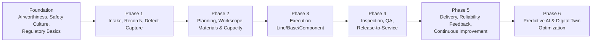
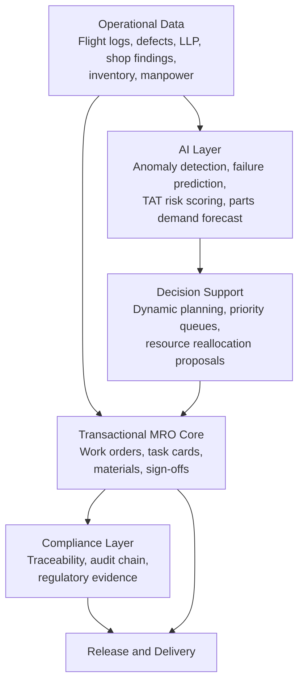
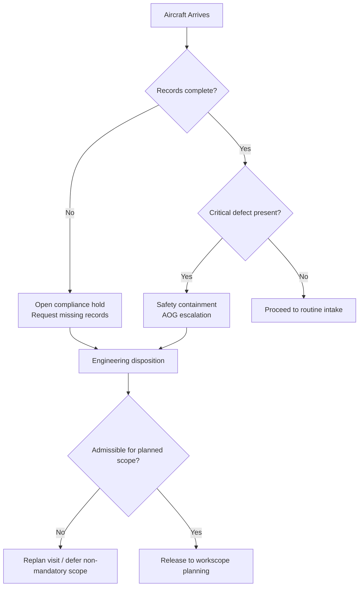
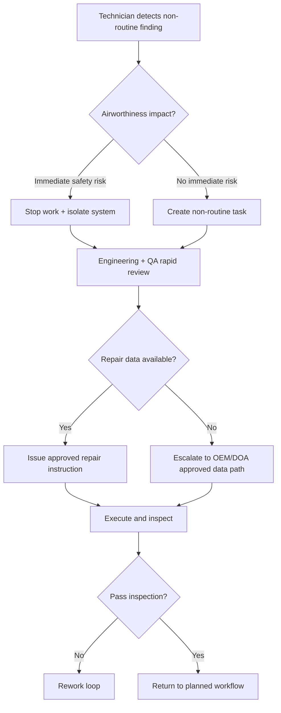
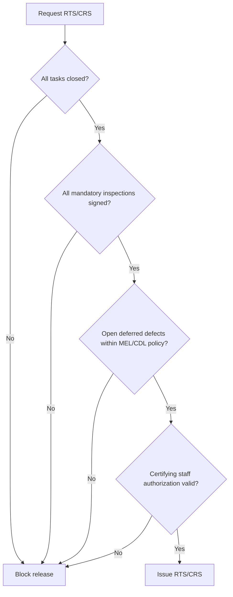
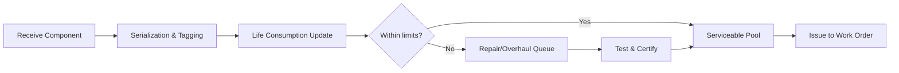
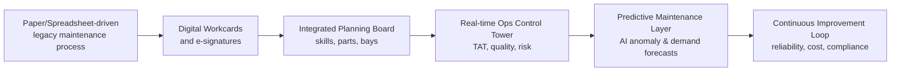

# AMRO Operational Document
## Logic-Nexus-AI Hybrid MRO Operations Blueprint

**Document ID:** OPS-AMRO-001  
**Version:** 1.0.0  
**Date:** 2026-03-24  
**Status:** Operational Baseline for Implementation  
**Owner:** AMRO Operations, Engineering, and Compliance

---

## 1) Purpose and Scope

This document defines the complete, end-to-end MRO operating sequence for Logic-Nexus-AI in the AMRO domain, from aircraft intake through release-to-service and final delivery. It combines:

- Traditional MRO operational controls
- AI-enhanced predictive maintenance and planning controls
- Quality gates and turnaround standards
- Regulatory and audit requirements
- India-specific DGCA and operating-environment considerations

This is a learning-and-execution document for operations leaders, planners, certifying staff, QA, supply chain, and digital teams.

---

## 2) Learning Pathway for MRO Operations

**Recommended progression:**

1. Master compliance and documentation discipline
2. Learn intake-to-plan flow and constraint-based scheduling
3. Learn execution controls and non-routine handling
4. Master quality gates and release authorization
5. Learn reliability loops and predictive decisioning

---

## 3) Hybrid Platform Operating Model (Traditional + AI)

**Design principle:** AI proposes, authorized personnel approve; regulatory control remains deterministic and human-governed.

---

## 4) Best-in-Class Methodology Integration

| Industry benchmark source | Publicly observable strengths | Logic-Nexus-AI operational adoption |
|---|---|---|
| Lufthansa Technik | Operational excellence, workshop TAT optimization, AI-supported component planning, integrated quality systems | Closed-loop TAT control tower, component pooling logic, process excellence scorecards |
| ST Engineering Aerospace | Smart MRO digitization, document-to-data workflows, predictive scheduling, resource optimization | Digital-first workcards, paperless execution, predictive maintenance scheduling triggers |
| Air France Industries KLM E&M | Predictive maintenance programs, innovation labs, multi-product maintenance model, fleet-availability focus | Reliability intelligence module, aircraft/engine/component predictive packs, MRO innovation backlog |
| GE Aerospace | AI-assisted inspection acceleration, predictive engine analytics, human-in-the-loop AI governance | AI-assisted visual inspection workflows, engine-health prioritization, governed AI use policy |

---

## 5) End-to-End Operational Sequence

### 5.1 Master Process Map

```mermaid
flowchart LR
  S1[Intake & Induction] --> S2[Airworthiness Record Validation]
  S2 --> S3[Initial Inspection & Defect Capture]
  S3 --> S4[Workscope Definition\nRoutine + Non-routine]
  S4 --> S5[Planning & Scheduling]
  S5 --> S6[Materials & Tooling Allocation]
  S6 --> S7[Execution: Line/Base/Component]
  S7 --> S8[In-Process Inspection & QA]
  S8 --> S9[Rectification/Rework Loop]
  S9 --> S10[Final Inspection & Compliance Closure]
  S10 --> S11[Release-to-Service Decision]
  S11 --> S12[Delivery & Reliability Feedback]
```

### 5.2 Stage-by-Stage Operations Standard

| Stage | Operational objective | Quality gate | TAT benchmark target | Compliance evidence |
|---|---|---|---|---|
| 1. Intake & induction | Register aircraft visit and intake condition | Complete intake checklist and technical log acceptance | 30-90 min | Arrival log, discrepancy log, intake checklist |
| 2. Record validation | Verify maintenance status and applicability | No missing mandatory records before planning release | 1-3 hr | AD/SB status, AMP status, deferred defect list |
| 3. Initial inspection | Confirm actual condition and defect set | Defects classified and risk-ranked | Transit: 30-60 min, base: 2-8 hr | Inspection findings, photo evidence, ATA-tagged defects |
| 4. Workscope definition | Convert findings into executable scope | Planner + QA concurrence on scope baseline | 2-6 hr | Approved work package baseline, task card set |
| 5. Planning & scheduling | Sequence jobs, bays, skills, shifts | Capacity-feasible plan with critical path | 2-8 hr planning cycle | Approved production plan, manpower roster |
| 6. Material/tool allocation | Ensure kitting and calibrated tooling | 100% critical parts/tool readiness | 2-24 hr by check type | Pick lists, calibration status, shelf-life check |
| 7. Execution | Perform line/base/component tasks safely | Task completion with evidence per card | Line tasks 30 min-4 hr; heavy checks multi-day | Task sign-offs, digital checklists, NDT logs |
| 8. In-process QA | Detect process escapes early | Mandatory hold-point inspections pass | Real-time/shift-based | QA hold-point records, NCR records |
| 9. Rework loop | Contain and clear non-conformities | Root cause captured and rework approved | 2-24 hr typical | NCR closure, corrective action log |
| 10. Final inspection | Verify all scope and regulatory obligations | Zero open airworthiness items | 2-6 hr | Final QA release file, compliance pack |
| 11. Release-to-service | Certifying authorization decision | Authorized certifier sign-off only | 15-60 min | CRS/RTS record, certifying staff credentials |
| 12. Delivery & feedback | Hand over aircraft and feed reliability | Customer acceptance and data closed-loop | 30-120 min | Delivery dossier, reliability event payload |

---

## 6) Decision Trees by Operational Phase

### 6.1 Intake and Airworthiness Admissibility

### 6.2 Non-Routine Discovery During Execution

### 6.3 Release-to-Service Gate

---

## 7) Core Operational Sequences

### 7.1 Component Tracking and Serialized Life Control

**Standard sequence:**

1. Register component with part number, serial number, ATA chapter, and owner context
2. Capture life data (hours/cycles/calendar) and threshold rules
3. Track install/remove events with aircraft and position references
4. Trigger alerts for LLP or condition thresholds
5. Route unserviceable units to repair, quarantine, or scrap decision flow
6. Reconcile serviceability before re-issue

**Control standards:**

- 100% serialized traceability for rotable and life-limited components
- No issue without serviceability and shelf-life validation
- Full install/remove genealogy retained for audit and reliability analysis

### 7.2 Work Order Management

**Lifecycle standard:** Create → Plan → Approve → Schedule → Execute → Inspect → Close → Analyze

**Mandatory controls:**

- Source linkage (defect, schedule, campaign, predictive trigger)
- Scope freeze window and controlled change approval
- Digital sign-off with role-based authorization
- Cost, labor, and downtime baselining at planning stage

### 7.3 Resource Allocation and Production Control

**Allocation dimensions:**

- Hangar/line slot capacity
- Certifying and specialized skill availability
- Tooling and calibration status
- Parts readiness and supplier ETA risk
- Shift-level productivity and bottleneck metrics

**Optimization policy:**

- Prioritize by safety criticality, operational impact, and contractual commitment
- Apply dynamic resequencing when parts or manpower variance exceeds threshold
- Trigger control-tower intervention for predicted TAT breach

### 7.4 Regulatory Compliance and Evidence Chain

**Compliance operating principles:**

- Every maintenance action must be traceable to approved data
- Mandatory inspections and independent inspections at defined hold points
- Release authorization only by valid certifying staff within scope
- Immutable evidence package for each major event and release

---

## 8) Quality Gates Framework

| Gate | Trigger point | Exit criteria | Owner roles |
|---|---|---|---|
| QG-1 Intake Gate | After induction | Records complete, intake discrepancy baseline approved | Production + Records |
| QG-2 Planning Gate | Before schedule release | Scope approved, manpower/material feasibility confirmed | Planning + QA |
| QG-3 Start Gate | Before execution | Tool calibration valid, staff authorization valid, risk briefing complete | Production |
| QG-4 In-Process Gate | During execution | Hold-point inspections passed, NCR contained | QA + Inspectors |
| QG-5 Final Gate | Before RTS | All findings closed, compliance pack complete, no unsafe open items | QA + CAMO/Engineering |
| QG-6 Delivery Gate | Before handover | Customer dossier accepted, reliability updates posted | Ops + Customer Support |

---

## 9) Turnaround Time Benchmarks (Best-Practice Ranges)

These ranges are operational benchmark references and must be calibrated by fleet type, visit scope, and local constraints.

| MRO activity | Benchmark range | Key drivers |
|---|---|---|
| Transit/line check | 30-60 minutes | Crew readiness, pre-kitted consumables, immediate defect disposition |
| Daily/overnight check | 2-8 hours | Night-shift skill mix, bay readiness, parts availability |
| A-check equivalent | 8-24 hours | Standardized task packs, digital workcards, preplanned NDT |
| C-check equivalent | 7-21 days | Dock flow, non-routine rate, structural findings management |
| Engine shop visit (module scope dependent) | 20-60 days | Material lead time, inspection throughput, repair network |
| Component repair event | 3-20 days | Test bench availability, vendor/OEM dependency, certification queue |

**TAT governance metrics:**

- Planned vs actual TAT variance (%)
- First-pass yield at inspection gates
- Non-routine ratio per check
- WIP aging and bottleneck station time
- AOG recovery cycle time

---

## 10) AI-Enhanced Predictive Maintenance Integration

### 10.1 AI Integration Points

- Intake risk scoring from flight and defect history
- Dynamic scope expansion recommendations
- Predicted parts demand and pre-positioning
- AI-assisted visual/borescope inspection support
- TAT breach early-warning and schedule resequencing
- Reliability trend detection for recurrent defects

### 10.2 Human-Governed AI Decision Policy

- AI output is advisory unless explicitly approved in controlled workflow
- Safety-critical decisions require certifying/engineering authority
- Model performance and drift must be monitored with periodic validation
- Explainability and decision trace retained for audits

---

## 11) India-Focused MRO Operations Framework

### 11.1 DGCA-Centric Regulatory Coverage

Logic-Nexus-AI AMRO deployments in India should implement configurable compliance packs aligned with DGCA civil aviation requirements, including:

- CAR-145 aligned maintenance organization control framework
- Continuing airworthiness and maintenance program controls (CAR-M aligned operating practice)
- Certifying staff licensing and authorization governance (CAR-66 aligned role controls)
- Training organization competency and recurrent training evidence (CAR-147 aligned enablement)
- Design/approved data and modification traceability controls (CAR-21 aligned interfaces where applicable)
- Mandatory AD/SB/inspection applicability tracking and closure evidence

### 11.2 Indian Airline-Operational Procedure Templates

**Template profile A: High-frequency LCC operations**

- Fast transit and overnight check orchestration
- Tight MEL-driven dispatch decision cycle
- High automation in defect triage and line maintenance dispatch

**Template profile B: Full-service mixed fleet operations**

- Long-haul maintenance planning integration with IOCC
- Enhanced pre-flight and release verification pack
- Wide-body structural and system-depth planning controls

**Template profile C: Regional and UDAN-linked operators**

- Remote-station tooling and spares strategy
- AOG support escalation to regional hubs
- Lightweight digital evidence and connectivity-resilient workflows

### 11.3 Regional Facility Standards for India

| Regional condition | Operational standard |
|---|---|
| Coastal humidity/salinity | Corrosion-focused inspection enhancement, protective storage and preservation cycles |
| High-temperature zones | Shift heat-stress controls, tool and consumable handling controls |
| Monsoon-heavy regions | Water-ingress checks, drainage and sealing inspection campaigns |
| High-traffic metro hubs | Slot discipline, turn-time orchestration, bay conflict management |
| Remote or tier-2 stations | Mobile maintenance packs, remote engineering support, escalation SLAs |

---

## 12) Digital Transformation Process Map

**Transformation checkpoints:**

- Stage 1: Digitize records and task execution
- Stage 2: Integrate planning, materials, and compliance
- Stage 3: Introduce predictive alerts and AI-assisted inspection
- Stage 4: Optimize end-to-end flow with closed-loop analytics

---

## 13) Operational KPI Scorecard

| KPI group | Metric | Target baseline |
|---|---|---|
| Safety and compliance | Regulatory finding closure on time | ≥ 99% |
| Quality | First-pass yield at final inspection | ≥ 97% |
| Turnaround | Planned vs actual TAT adherence | ≥ 90% |
| Reliability | Repeat defect rate within 30 days | ≤ 3% |
| Supply chain | Critical part availability at execution start | ≥ 98% |
| Workforce | Certifying coverage for active shifts | 100% |
| Digital adoption | Digital sign-off penetration | 100% |
| Predictive effectiveness | AI alert precision for actionable events | ≥ 75% and improving |

---

## 14) Implementation Guidance for Logic-Nexus-AI

1. Start with deterministic quality gates and digital traceability
2. Introduce control-tower TAT monitoring before advanced AI automation
3. Launch predictive models on high-value assets first (engines, recurrent ATA chapters)
4. Use tenant-specific regulatory packs and airline operating templates
5. Maintain strict role-based release controls across all tenants and franchisees

---

## 15) Source Notes and Public Benchmarks

The following publicly available references informed the benchmark methodology and India context:

- Lufthansa Group annual reporting and MRO segment operational priorities (turnaround, digitalization, AI planning)
- Lufthansa Technik quality and component service references
- ST Engineering Smart MRO and digitization references
- Air France-KLM Group and AFI KLM E&M references on predictive maintenance and MRO innovation
- GE Aerospace references on AI-assisted inspection and MRO investment strategy
- Government of India / policy references for MRO incentives and sector reforms (GST reduction, FDI liberalization, policy updates)
- DGCA portal references for airworthiness and maintenance organization requirements

---

## 16) Usage Rule

This document is an operational blueprint. Each tenant implementation must configure:

- Aircraft/fleet profile
- Regulatory authority profile
- Contractual TAT commitments
- Facility and manpower constraints
- Approved AI maturity level and governance controls

No release-to-service workflow can bypass configured regulatory and certifying controls.
