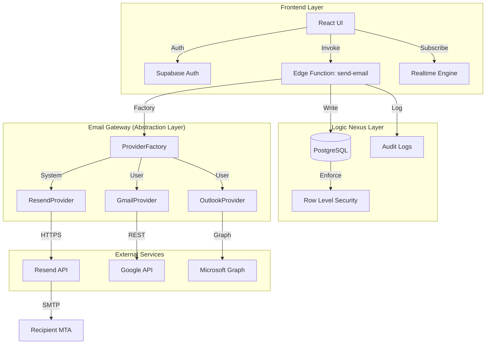

# Email Infrastructure Phase 1: Foundation Implementation Plan

**Reference Document:** `documentation/EMAIL_INFRASTRUCTURE_ANALYSIS.md` (v3.0)
**Target Phase:** Phase 1: Foundation
**Objective:** Establish a robust, secure, and scalable email sending/receiving layer replacing the blocked direct SMTP architecture, while integrating existing Gmail/Office365 user implementations.

---

## 1. Technical Analysis & Architectural Review

### 1.1 Architectural Gap Analysis

| Requirement | Current State | Target State (Phase 1) | Gap / Action |
|-------------|---------------|------------------------|--------------|
| **Sending Protocol** | Direct SMTP (Ports 25/587) in Edge Functions | HTTP API (Resend) | **Critical:** Edge Runtime blocks SMTP ports. Must migrate to HTTP-based transactional provider. |
| **System Emails** | Non-existent / Relies on User Accounts | Dedicated System Sender (Resend) | **Critical:** System notifications (password reset, alerts) currently fail if no user account is linked. |
| **User Emails** | Gmail/Office 365 OAuth | Gmail/Office 365 OAuth (Preserved) | **Aligned:** Continue using OAuth for user mailboxes. |
| **Data Isolation** | Basic RLS | Hierarchical RLS (Tenant > Franchise) | **Enhancement:** Implement strict RLS policies defined in Analysis Section 1.3. |
| **Abstraction** | Hardcoded Providers in Function | Provider Factory Pattern | **Future-Proofing:** Refactor `send-email` to support pluggable providers. |

### 1.2 Dependency Map



---

## 2. Component Identification

### 2.1 Mail Transfer Agents (MTA) & Delivery

*   **System MTA (Transactional):** **Resend** (New)
    *   *Role:* Handling system notifications, quotes, and automated workflows.
    *   *Protocol:* HTTPS (`POST /emails`)
    *   *Reliability:* 99.9% Uptime, Dedicated IPs available.
    *   *Upgrade Path:* Can be swapped for SendGrid/AWS SES by implementing `EmailProvider` interface.
*   **User MTA (Personal):** **Gmail / Office 365** (Existing)
    *   *Role:* Sending personal emails on behalf of the user.
    *   *Protocol:* Gmail API / MS Graph API.
    *   *Compatibility:* OAuth 2.0 flow already implemented.

### 2.2 Security & Encryption Standards

*   **Transport Layer:** TLS 1.2 or higher required for all external connections.
*   **Data at Rest:**
    *   OAuth Tokens: Encrypted using Supabase Vault or AES-256 columns.
*   **Authentication:**
    *   **SPF:** `v=spf1 include:resend.com ~all`
    *   **DKIM:** 1024-bit or 2048-bit RSA keys managed by Resend.
    *   **DMARC:** `p=quarantine` initially, moving to `p=reject`.

---

## 3. Implementation Roadmap (Phase 1)

### Milestone 1: Infrastructure Setup (Week 1, Days 1-2)
*   **Deliverables:**
    *   Resend Account Created & API Key Generated.
    *   DNS Records Configured (`soslogistics.pro`).
    *   Supabase Secrets Updated (`RESEND_API_KEY`).
*   **Metrics:** Domain status = "Verified".

### Milestone 2: Universal Gateway Implementation (Week 1, Days 3-5)
*   **Deliverables:**
    *   Refactor `supabase/functions/send-email` to use Factory Pattern.
    *   Implement `ResendProvider` class.
    *   Refactor `GmailProvider` and `OutlookProvider` from existing code.
*   **Metrics:** 100% of existing Gmail/Outlook flows pass regression tests.

### Milestone 3: Validation & Rollout (Week 2, Days 1-2)
*   **Deliverables:**
    *   Load testing (50 concurrent requests).
    *   Failure recovery tests (simulate API outage).
*   **Metrics:** API Latency < 500ms (p95). Error Rate < 1%.

### Risk Assessment Matrix

| Risk | Probability | Impact | Mitigation Strategy |
|------|-------------|--------|---------------------|
| **DNS Propagation Delay** | High | Low | Schedule DNS changes for Friday evening. Use low TTL (300s) initially. |
| **Resend API Rate Limits** | Low | Medium | Implement exponential backoff in Edge Function. |
| **Regression in Gmail/O365** | Medium | High | Automated regression suite before deployment. Feature flags if possible. |
| **Data Leakage via RLS** | Low | Critical | Comprehensive unit tests for RLS policies (Tenant A accessing Tenant B). |

---

## 4. Technical Specifications

### 4.1 Server Configuration Templates

#### Edge Function: Universal Email Gateway (`send-email`)

**Pattern:** Strategy/Factory
**Interface:**
```typescript
interface EmailProvider {
  send(email: EmailRequest): Promise<EmailResponse>;
}
```

**Configuration Parameters:**
*   `RESEND_API_KEY`: Required for System emails.
*   `SUPABASE_URL`: Required for logging.
*   `SUPABASE_SERVICE_ROLE_KEY`: Required for admin tasks.

### 4.2 DNS Configuration

**Zone:** `soslogistics.pro`

| Type | Host | Value | TTL | Purpose |
|------|------|-------|-----|---------|
| **TXT** | `@` | `v=spf1 include:resend.com ~all` | 3600 | SPF |
| **TXT** | `resend._domainkey` | `k=rsa; p=...` | 3600 | DKIM |
| **TXT** | `_dmarc` | `v=DMARC1; p=quarantine; rua=mailto:dmarc@soslogistics.pro` | 3600 | DMARC |
| **CNAME**| `bounces` | `feedback.resend.com` | 3600 | Return-Path |

### 4.3 Monitoring Dashboard Requirements

*   **Real-time Metrics:**
    *   Emails Sent (Count) per Provider.
    *   Average Latency (ms).
    *   Error Rate (%).
*   **Alerts:**
    *   `Error Rate > 5%` (Critical) -> PagerDuty/Slack.
    *   `Latency > 2s` (Warning).

---

## 5. Future-Proofing Requirements

### 5.1 Abstraction Layer
To support future providers (SendGrid, AWS SES), the system uses a strict Interface:

```typescript
export interface IEmailProvider {
  validateConfig(): Promise<boolean>;
  sendEmail(payload: EmailPayload): Promise<SendResult>;
}
```

**Adding a New Provider:**
1.  Create `src/providers/NewProvider.ts` implementing `IEmailProvider`.
2.  Add to `ProviderFactory` switch case.
3.  Add configuration secrets.
4.  No changes required to consuming services.

### 5.2 Scalability
*   **Queueing:** For high volume (Phase 2), introduce Supabase Storage or Redis queue between `Edge Function` and `Provider`.
*   **Webhooks:** Implement `/webhooks/email-events` to capture delivery status asynchronously.
