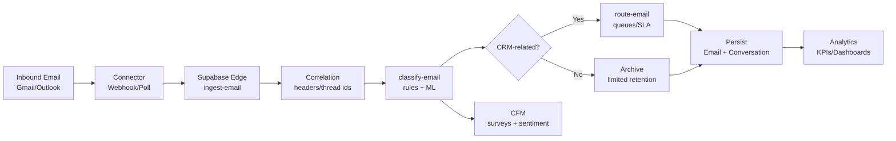

# Email Management System – Functionality Specification

## 1) Functional Requirements and Acceptance Criteria

* Email Ingestion
  * Ingest inbound emails from Gmail and Outlook via provider webhooks or polling.
  * Normalize provider payloads into a common schema; preserve headers (Message-ID, In-Reply-To, References, ConversationIndex).
  * Acceptance: Inbound emails received from both providers are stored with full metadata within 2 minutes of arrival.
* Thread Correlation
  * Derive conversation\_id using precedence: In-Reply-To → References → provider thread id (Gmail threadId / Outlook ConversationIndex) → Message-ID fallback. <mccoremem id="03fe6a3u77de1i32s8ntjuws6" />
  * Acceptance: Emails belonging to the same thread display as one conversation group; ≥98% thread accuracy on test set.
* CRM Classification
  * Identify CRM-related emails by resolving sender/recipients to Contacts/Leads/Accounts; non-resolvable emails marked non-CRM.
  * Acceptance: ≥90% precision for CRM classification on labeled validation set.
* Feedback Detection
  * Detect customer feedback/survey emails (NPS/CSAT/CES) via subject/body patterns and known senders; extract scores and verbatims.
  * Acceptance: ≥95% recall for known survey patterns; negative feedback triggers routing within 5 minutes.
* Sentiment Analysis
  * Score email body sentiment with ML; categorize into seven-point scale (very negative → very positive).
  * Acceptance: Agreement ≥80% with human labels on validation corpus; configurable thresholds for routing.
* Routing
  * Route emails to queues (Support, Sales, CFM Negative, VIP) via rules based on sentiment, sender domain, intent, and product.
  * Acceptance: Correct queue assignment ≥95%; SLA timers attached (e.g., negative: 30 min, VIP: 15 min).
* Persistence and Reportability
  * Store emails as native records; archive attachments in object storage; index for search.
  * Acceptance: 100% of CRM emails are reportable via analytics; non-CRM limited retention policy applied.
* UI/UX
  * Inbox supports Threads toggle (group by conversation\_id), folder/queue navigation, unread counts, search and filters.
  * Acceptance: Toggle renders grouped conversations without flicker; navigation updates selected state and counts seamlessly.
* Governance
  * Blocklist personal domains; only associate emails to CRM if a matching record exists.
  * Acceptance: Blocklisted emails never enter CRM; unmatched emails kept out of CRM activity views.

## 2) System Architecture and Component Interactions

* Components
  * Provider Connectors (Gmail/Outlook): Webhooks/subscriptions; polling fallback.
  * Supabase Edge Functions: ingest-email, classify-email, route-email.
  * Storage: Email records, conversation mapping, attachments object storage.
  * ML Services: Sentiment scoring; optional intent classification.
  * Rule Engine: Declarative routing rules; SLA timers; notifications.
  * Frontend: Inbox, Sidebar, Detail View; Threads grouping; folder counts.
* Flow (Mermaid)

## 3) API Specifications

* Edge Function: ingest-email
  * POST /ingest-email
  * Request (JSON):
    * provider: "gmail" | "outlook"
    * payload: provider-specific message object
  * Response (JSON):
    * status: "accepted"
    * normalized\_id: string
    * conversation\_id: string
* Edge Function: classify-email
  * POST /classify-email
  * Request:
    * email\_id: string
  * Response:
    * category: "crm" | "non\_crm" | "feedback"
    * sentiment: "very\_negative" | "negative" | "slightly\_negative" | "neutral" | "slightly\_positive" | "positive" | "very\_positive"
    * intent?: "support" | "sales" | "other"
* Edge Function: route-email
  * POST /route-email
  * Request:
    * email\_id: string
    * category: string
    * sentiment: string
    * attributes: object
  * Response:
    * queue: string
    * sla\_minutes: number
    * notifications: string\[]

## 4) Database Schema Design

* Tables
  * emails
    * id (uuid, pk)
    * provider (text)
    * message\_id (text, unique)
    * in\_reply\_to (text)
    * references (text\[])
    * provider\_thread\_id (text)
    * conversation\_id (text, indexed)
    * from\_address (text)
    * to\_addresses (text\[])
    * cc\_addresses (text\[])
    * subject (text)
    * body\_preview (text)
    * body\_html (text)
    * received\_at (timestamptz)
    * category (text)
    * sentiment (text)
    * intent (text)
    * is\_crm (boolean)
  * email\_attachments
    * id (uuid, pk)
    * email\_id (uuid, fk emails.id)
    * filename (text)
    * content\_type (text)
    * storage\_url (text)
    * size\_bytes (int)
  * conversation\_index
    * conversation\_id (text, pk)
    * first\_message\_id (text)
    * provider\_hint (text)
    * updated\_at (timestamptz)
  * routing\_events
    * id (uuid, pk)
    * email\_id (uuid, fk)
    * queue (text)
    * sla\_minutes (int)
    * routed\_at (timestamptz)
  * contact\_resolutions
    * email\_id (uuid, fk)
    * contact\_id (uuid)
    * account\_id (uuid)
    * lead\_id (uuid)

## 5) User Interface Mockups/Wireframes

* Inbox Header
  * Left: Search input; Filters (queue, sentiment, category).
  * Right: Toggle \[Threads] (groups by conversation\_id); Compose; Sync.
* Sidebar
  * Sections: Mailbox (Inbox, Sent, All Mail, Drafts, Flagged, Trash), Queues (Support, Sales, CFM Negative, VIP), Custom folders.
* List View
  * Thread group cards: subject, participants, latest snippet, unread count, sentiment badge.
* Detail View
  * Conversation timeline; message body; attachments; associated CRM records; actions (reply, forward, escalate).

## 6) Security Requirements and Authentication Flows

* OAuth scopes per provider; secrets stored in environment manager; rotation policy.
* Webhook signature verification; replay protection via nonce/timestamp.
* RBAC for queues and folders; least-privilege for Edge functions.
* Data at rest encryption for attachments; TLS in transit; audit logs for routing and access.
* PII minimization; retention policies for non-CRM emails.

## 7) Performance Benchmarks and Scalability

* Ingestion latency: <2 minutes end-to-end under normal load.
* Routing latency: <60 seconds.
* Thread accuracy: ≥98% with header precedence.
* Horizontal scaling: stateless Edge functions; database indexes on conversation\_id and message\_id; batched writes for high volume.
* Backpressure strategies: queueing, exponential backoff on provider APIs; idempotent processing keyed by message\_id.

## 8) Error Handling and Logging Strategy

* Structured logs (JSON) with correlation\_id and provider metadata.
* Retry policies:
  * Provider API transient errors: retry with jitter/backoff.
  * Database conflicts on message\_id: deduplicate and upsert.
* Dead-letter queue for unprocessable payloads; alerting on DLQ spikes.
* Metrics: error rate, retry count, SLA breach count; dashboards and alerts.

## References

* Email threading approach and conversation\_id derivation <mccoremem id="03fe6a3u77de1i32s8ntjuws6" />
* UI code:
  * EmailInbox: [EmailInbox.tsx](file:///Users/vims/Downloads/Development%20Projects/Trae/SOS%20Logistics%20Pro/logic-nexus-ai/src/components/email/EmailInbox.tsx)
  * EmailSidebar: [EmailSidebar.tsx](file:///Users/vims/Downloads/Development%20Projects/Trae/SOS%20Logistics%20Pro/logic-nexus-ai/src/components/email/EmailSidebar.tsx)
* Server:
  * Search emails: [index.ts](file:///Users/vims/Downloads/Development%20Projects/Trae/SOS%20Logistics%20Pro/logic-nexus-ai/supabase/functions/search-emails/index.ts)
