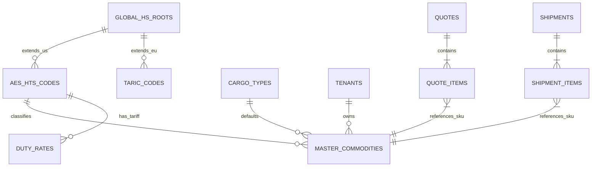

# Enterprise Commodity Architecture & Implementation Roadmap

**Date:** 2026-02-12
**Status:** Draft / Proposed
**Target System:** Logic Nexus AI - Logistics & Compliance Modules

## 1. Executive Summary

The current Logic Nexus AI platform suffers from a critical data fragmentation issue regarding Commodity and Product master data. While an advanced `aes_hts_codes` system exists for compliance, the operational modules (Quick Quote, Detailed Quote, Cargo Details) rely on free-text fields (`commodity`, `product_name`, `hs_code`) that bypass this single source of truth.

This architecture document proposes a comprehensive **Enterprise Commodity Architecture** that unifies the data model, enforces strict referential integrity between commercial documents (Quotes/Invoices) and compliance data (HTS/Schedule B), and establishes a WCO-compliant Global HS framework to support international expansion.

## 2. Gap Analysis: Current vs. Required

### 2.1. Identified Inconsistencies

| Feature Module | Current Implementation | Risk / Defect |
| :--- | :--- | :--- |
| **Quick Quote** | `commodity` (String) input. No validation. | Duplicate data entry; impossible to automate duty calculation; no learning from history. |
| **Detailed Quote** | `quote_items.product_name` (String). `hs_code` (String) in attributes. | Disconnected from `aes_hts_codes`. Users can enter invalid HTS codes (e.g., "123"). |
| **Cargo Details** | `cargo_details.hs_code` (String). `aes_hts_id` column status unclear/missing in some contexts. | Compliance screenings (RPS/Sanctions) cannot reliably identify the commodity. |
| **Master Data** | `master_commodities` exists but is not integrated into Quote creation workflows. | "Zombie" catalog: The master list exists but grows stale as actual business happens in free-text fields. |

### 2.2. Missing Primitives
1.  **Global HS Root:** System is US-centric (`aes_hts_codes`). No support for EU TARIC or China HS without duplication.
2.  **Auto-Cataloging:** No mechanism to "save new commodity from quote" into the master catalog.
3.  **Versioning:** `master_commodities` has no version control for HTS code changes (e.g., 2026 tariff updates).

## 3. Target Enterprise Architecture

### 3.1. Core Entity-Relationship Diagram (ERD)

### 3.2. Data Dictionary Updates

#### `public.global_hs_roots` (New)
The universal 6-digit WCO standard shared by all member countries.
- `id` (UUID, PK)
- `hs6_code` (Text, 6 chars)
- `description` (Text)

#### `public.master_commodities` (Enhanced)
The single source of truth for a tenant's products.
- `id` (UUID, PK)
- `tenant_id` (UUID, FK)
- `name` (Text)
- `sku` (Text)
- `aes_hts_id` (UUID, FK) -> Links to specific US classification.
- `global_hs_root_id` (UUID, FK) -> Links to universal classification.
- `default_cargo_type_id` (UUID, FK)

#### `public.quote_items` (Refactored)
- `commodity_id` (UUID, FK) -> References `master_commodities(id)`.
- `product_name` (Text) -> Snapshotted from master (or override).
- `aes_hts_id` (UUID, FK) -> Snapshotted from master (or override).

## 4. Competitive Analysis & Best Practices

| Platform | Commodity Handling | Logic Nexus Strategy |
| :--- | :--- | :--- |
| **Flexport** | "Smart Search" predicts HTS from description. Unified product library. | **Adopt:** Implement Vector Search on `aes_hts_codes` for predictive entry in Quick Quote. |
| **Cargowise** | Rigid, strict validation. High setup cost. | **Avoid:** Allow "Draft" commodities in quotes, but enforce validation before "Booking". |
| **Freightos** | Simple text, relies on LSPs to fix data. | **Surpass:** Use AI to suggest HTS codes during the quote phase to improve duty accuracy. |

## 5. Implementation Roadmap

### Phase 1: Foundation & Schema Hardening (Week 1)
- [ ] **Audit:** Conclusively verify `aes_hts_id` presence in `cargo_details`. Add if missing.
- [ ] **Schema:** Create `global_hs_roots` table and populate with WCO data (extracted from AES).
- [ ] **Linkage:** Add `commodity_id` and `aes_hts_id` columns to `quote_items` and `quote_items_extension`.

### Phase 2: "Smart" Quick Quote (Week 2)
- [ ] **Backend:** Create `search_master_commodities` RPC (combines catalog + global HTS).
- [ ] **Frontend:** Replace `QuickQuoteModal` text input with a **Smart ComboBox**.
  - *Behavior:* User types "T-Shirt" -> System suggests existing SKU "TS-001" OR Generic HTS "6109.10".
- [ ] **AI Integration:** Connect OpenAI to suggest `aes_hts_id` based on description if no match found.

### Phase 3: Detailed Quote & Catalog Sync (Week 3)
- [ ] **Frontend:** Update `QuoteLineItems.tsx` to use the same Smart ComboBox.
- [ ] **Workflow:** Implement "Save to Catalog" checkbox on Quote completion.
- [ ] **Sync:** Trigger: When a Quote becomes a Shipment, ensure all items have valid `aes_hts_id`.

### Phase 4: Global Compliance (Week 4+)
- [ ] **Expansion:** Import EU TARIC data into new `taric_codes` table linked to `global_hs_roots`.
- [ ] **Logic:** Update Duty Calculator to select AES vs TARIC based on Destination Country.

## 6. Technical Recommendations

1.  **Strict Typing:** Stop passing strings for HTS codes. Always pass UUIDs (`aes_hts_id`).
2.  **Snapshotting:** Quote Items should reference the Master Commodity ID but *also* snapshot the critical data (HTS Code, Duty Rate) at the time of quoting to prevent historical data corruption if the master changes.
3.  **Validation Gates:**
    -   *Draft Quote:* No validation required.
    -   *Final Quote:* Warning if HTS missing.
    -   *Booking:* Error if HTS missing.

