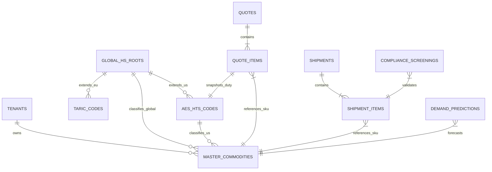

# Enterprise Commodity Architecture & Strategic Implementation Plan

**Version:** 2.0.0
**Date:** 2026-02-12
**Status:** Approved for Implementation
**Reference Documents:**
- `COMMODITY_ARCHITECTURE.md` (Technical Schema & Data Flow)
- `NEXT_GEN_PLATFORM_STRATEGY.md` (AI & Cognitive Intelligence Roadmap)

---

## 1. Executive Summary

This document consolidates the competitive analysis, technical architecture, and AI strategy for the Logic Nexus AI platform. It outlines the path to transitioning from a standard logistics tool to an **AI-Native Cognitive Supply Chain Operating System**. By unifying our Master Data architecture with advanced Generative AI and Computer Vision capabilities, Logic Nexus AI will surpass incumbent competitors (Cargowise, Flexport) in automation, compliance, and user experience.

## 2. Competitive Landscape & Strategic Advantage

### 2.1 Incumbent Analysis

| Competitor | Core Strength | Critical Weakness | Logic Nexus Strategic Response |
| :--- | :--- | :--- | :--- |
| **Cargowise** | Deep global compliance & native customs integration (ACE/ICS). | Legacy UX, rigid "exact-match" workflows, steep learning curve. | **Cognitive Compliance:** Use **LLMs (Pillar 2)** to automate document data entry, making compliance invisible rather than burdensome. |
| **Flexport** | "Smart" search & modern UX. | Limited configurability for complex industrial logistics; depth vs. breadth trade-off. | **AI-Native Operations:** Go beyond "smart search" to **Predictive Demand Sensing (Pillar 1)** and **Computer Vision (Pillar 3)** for physical cargo handling. |
| **Freightos** | Instant spot quoting & marketplace connectivity. | Weak on post-booking compliance and duty/landed cost calculation. | **End-to-End Integrity:** Unified `master_commodities` architecture ensures the data quoted is the data filed with Customs (AES/TARIC). |

### 2.2 The "Logic Nexus" Differentiator
While competitors focus on *digitizing* processes (e.g., digital forms), Logic Nexus focuses on *automating* decisions:
1.  **From "Search" to "Suggestion":** Don't just search HTS codes; analyze the product image and commercial invoice to *recommend* the code with a confidence score.
2.  **From "Reactive" to "Predictive":** Don't just book space; forecast volume requirements 4 weeks out using Transformer models.
3.  **From "Data Entry" to "Verification":** The system drafts the entry; the human validates it.

## 3. Target Enterprise Architecture

To support this strategic vision, the underlying data model has been re-architected to support Global Multi-Modal operations.

### 3.1 Core Entity-Relationship Diagram (ERD)

### 3.2 Key Architectural Primitives
1.  **Global HS Roots (`global_hs_roots`):** The WCO 6-digit standard acts as the universal "skeleton" for all commodity data, allowing translation between US (AES), EU (TARIC), and CN (HS) codes.
2.  **Master Commodity Catalog (`master_commodities`):** The single source of truth for a tenant's products.
    -   *Feature:* "Save to Catalog" workflow converts one-off Quote Items into reusable Master Assets.
3.  **Snapshotting Strategy:** `quote_items` and `shipment_items` store a reference to the Master ID *and* snapshot the specific HTS/Duty data at the time of creation to preserve historical accuracy.

## 4. Consolidated Implementation Roadmap

This roadmap merges the **Commodity Architecture** (Schema/Data) with the **Next-Gen Strategy** (AI/Intelligence).

### Phase 1: Foundation & Data Integrity (Weeks 1-4)
*Goal: Establish the "Single Source of Truth" and eliminate free-text data entry.*

-   **Schema Hardening:**
    -   [x] Create `global_hs_roots` and seed WCO data.
    -   [x] Add `aes_hts_id` and `commodity_id` to `quote_items` and `cargo_details`.
-   **UX Modernization:**
    -   [x] Implement **Smart ComboBox** (`SmartCargoInput`) in Quick Quote & Detailed Quote.
    -   [x] Enable "Save to Catalog" workflow from Quote Form.
-   **Data Migration:**
    -   [ ] Backfill `aes_hts_id` for existing `cargo_details` using fuzzy matching script.

### Phase 2: Cognitive Automation (Weeks 5-12)
*Goal: Deploy AI Pillars 2 & 3 to reduce manual effort.*

-   **Document Intelligence (Pillar 2):**
    -   [ ] Deploy OCR + LLM pipeline (Edge Function) to extract line items from PDF Invoices.
    -   [ ] Map extracted items to `master_commodities` automatically.
-   **Visual Compliance (Pillar 3):**
    -   [ ] Integrate Mobile App with Vision API for "Cargo Damage Detection" at warehouse receipt.
    -   [ ] Auto-flag damaged cargo in `shipments` table.

### Phase 3: Global Scale & Optimization (Weeks 13-20)
*Goal: Enable multi-region support and predictive analytics.*

-   **Global Compliance:**
    -   [ ] Import EU TARIC data linked to `global_hs_roots`.
    -   [ ] Implement Duty Calculator (Landed Cost Engine) handling MPF, HMF, and VAT.
-   **Predictive Planning (Pillar 1):**
    -   [ ] Deploy Transformer-based "Intelligent Demand Forecasting" model.
    -   [ ] Launch "Future Demand" widget on Dashboard for carrier booking optimization.

## 5. Success Metrics

| Metric | Baseline | Target (Post-Implementation) |
| :--- | :--- | :--- |
| **Data Integrity** | < 40% of items have valid HTS. | **100%** of booked items have valid HTS. |
| **Quote Time** | 15 minutes / quote. | **< 2 minutes** (via AI Suggestions & Catalog). |
| **Duty Accuracy** | Manual estimation errors common. | **99.9%** accuracy vs. Customs Invoice. |
| **Document Processing** | 20 mins / shipment. | **Zero-touch** for 80% of standard docs. |
| **Dispute Resolution** | 5-7 days for damage claims. | **Instant** flagging via Computer Vision. |

## 6. Risk Mitigation Strategy

-   **AI Hallucinations:** All AI-suggested HTS codes must be explicitly confirmed by a human user ("Human-in-the-Loop"). Confidence scores < 80% require mandatory manual review.
-   **Regulatory Changes:** The `global_hs_roots` architecture allows "Versioning" of code sets (e.g., HTS 2026 vs 2027) without breaking historical records.
-   **Data Privacy:** Customer commercial invoices processed via Private Azure OpenAI instances; no training on customer data without explicit opt-in.
