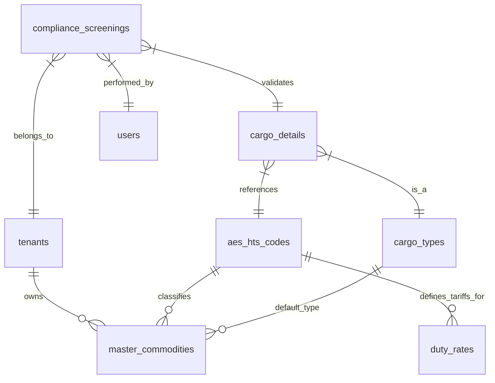

# Enterprise Commodity/Cargo Architecture: Competitive Analysis & Gap Assessment

**Version:** 1.0.0
**Date:** 2026-02-05
**Author:** Logic Nexus AI Team

---

## 1. Executive Summary
This document analyzes the current state of the Logic Nexus AI Commodity/Cargo module against industry leaders (Cargowise, Flexport, Freightos). It identifies critical gaps in architecture, compliance, and automation, and proposes a roadmap to achieve "Enterprise-Grade" status.

## 2. Competitive Landscape

### 2.1 Cargowise (WiseTech Global)
**Strengths:**
- **Deep Customs Integration:** Native integration with 30+ customs authorities (ACE, CHIEF, ICS).
- **Universal Customs Data Model:** Single data entry populates all downstream docs.
- **Tariff Management:** Integrated global tariff database with complex duty logic (FTAs, anti-dumping).
**Weaknesses:**
- **UX/UI:** Legacy, steep learning curve.
- **Search:** Rigid, requires exact code knowledge often.

### 2.2 Flexport
**Strengths:**
- **UX-First Classification:** "Smart" search with autocomplete and AI suggestions.
- **Visibility:** SKU-level tracking linked to HTS codes.
- **Collaboration:** Supplier portal for collaborative classification.
**Weaknesses:**
- **Depth:** Less configurable for complex/niche compliance scenarios than Cargowise.

### 2.3 Freightos
**Strengths:**
- **Rate/Booking Focus:** Instant quoting based on commodity density/type.
- **Simplicity:** Streamlined for SMB/Mid-market.
**Weaknesses:**
- **Compliance:** Limited native customs/duty depth compared to Cargowise.

## 3. Gap Analysis

| Feature Domain | Current Logic Nexus State | Industry Standard (Enterprise) | Gap Severity |
| :--- | :--- | :--- | :--- |
| **HTS Architecture** | `aes_hts_codes` (Flat list), recent hierarchy add. | Hierarchical (Chapter > Heading > Subheading) with versioning (2024 vs 2025). | **High** |
| **Search/Classification** | Basic SQL `ILIE` / recent `websearch`. | Fuzzy matching, AI suggestion, synonym dictionaries (e.g., "Sneakers" -> "Footwear"). | **Medium** |
| **Product Catalog** | `master_commodities` (Just added). | Tenant-specific SKU library with approval workflows and document attachment. | **Medium** |
| **Duty Calculation** | None. | Landed cost engine: Duty + Harbor Maintenance Fee (HMF) + Merchandise Processing Fee (MPF) + VAT. | **Critical** |
| **Compliance** | Basic HTS validation. | Real-time Restricted Party Screening (RPS), OGA/PGA (FDA, EPA) flagging. | **Critical** |
| **Multi-Country** | US-Centric (AES). | Global HTS (US Schedule B, EU TARIC, CN HS, HS 2022 WCO Base). | **High** |
| **Integration** | None. | Direct EDI/API with CBP (ACE) or broker networks. | **High** |

## 4. Architectural Deficiencies (Pre-Remediation)

1.  **Lack of Versioning:** HTS codes change annually. The old schema overwrote data; the new one needs a `valid_from` / `valid_to` mechanism.
2.  **US-Centricity:** The schema was built around "AES" (US Export). Enterprise clients ship Global-to-Global.
3.  **Missing "Landed Cost" Primitives:** No structures for tax rates, ancillary fees, or currency conversion for duty.
4.  **No Compliance Audit Trail:** Who classified this SKU? When? Why? (Solved partially by new `compliance_screenings`).

## 5. Proposed Enterprise Architecture (Target State)

### 5.1 Core Data Model
Here is the Entity-Relationship Diagram (ERD) for the target architecture:

- **Global HS Root:** WCO 6-digit standard.
- **Country Extensions:** US (+4 digits), CN (+4 digits), DE (+2 digits).
- **Temporal Validity:** Effective dates for all codes and rates.

### 5.2 Services
1.  **Classification Engine:**
    - Input: Description, Image, Material.
    - Output: HTS Code, Confidence Score.
2.  **Landed Cost Engine:**
    - Input: HTS, Origin, Destination, Value.
    - Output: Duty, VAT, Fees.
3.  **Screening Service:**
    - Check against DPL/EL/UVL lists.

### 5.3 UX Enhancements
- **Smart Input:** (Partially Implemented) Auto-complete.
- **Visual Browser:** Drill-down tree view of HTS chapters.
- **Duty Simulator:** "What-if" analysis for sourcing.

## 6. Roadmap
- **Phase 1 (Done):** Master Catalog, Basic Search, Schema Normalization.
- **Phase 2 (Current):** API Specification, Landed Cost Data Structures.
- **Phase 3:** Integration with 3rd party classification data (or scraping).
- **Phase 4:** AI-assisted classification.
