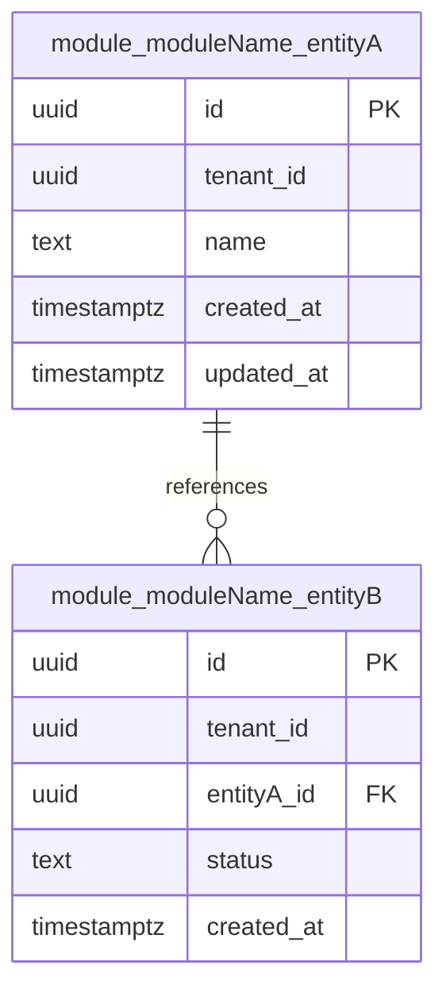

# Module ERD Template

## ERD Documentation Checklist

- Cardinality and optionality clearly indicated.
- Primary key and foreign key columns highlighted.
- Tenant/franchise boundary columns visible.
- Ownership annotation for each entity.
