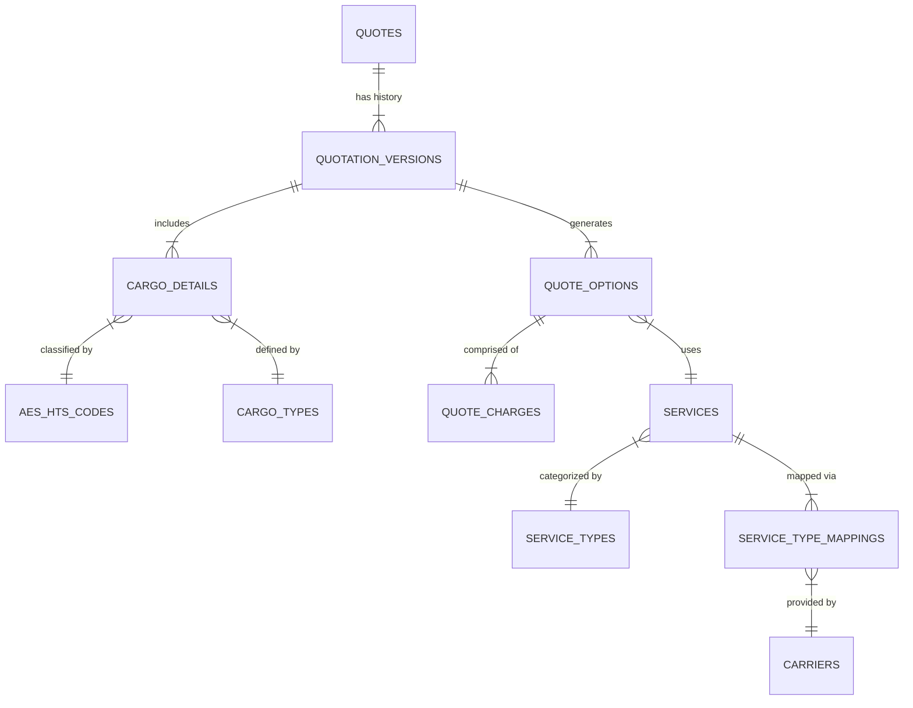

# Logistics Data Model Analysis & Remediation Plan

## Executive Summary
This document outlines the analysis and proposed data model for the Logic Nexus AI logistics platform, specifically focusing on the Quotation and Shipment modules. The goal is to establish a normalized, scalable schema that supports end-to-end workflows from quotation generation to fulfillment, ensuring data integrity, regulatory compliance (AES/HTS), and multi-modal capabilities.

## Current State Analysis

### Existing Entities
1.  **AES/HTS Codes**: `aes_hts_codes` table exists but is not strictly enforced in `cargo_details` (currently a text field).
2.  **Cargo Types**: `container_types` exists for Ocean FCL. `cargo_types` is referenced but definition is fragmented.
3.  **Cargo Details**: `cargo_details` table exists but is:
    -   Loosely coupled (missing direct FK to `quotes` in some contexts).
    -   Denormalized in `quotes` table (stored as JSONB).
    -   Uses text `hs_code` instead of FK to `aes_hts_codes`.
    -   Tightly coupled to `services` (has `service_id`), limiting its use for generic quote requests.
4.  **Service Types**: `service_types` table exists (Ocean, Air, etc.).
5.  **Services**: `services` table defines specific offerings (e.g., "Maersk Spot").
6.  **Service Mappings**: `carrier_service_types` maps Carriers to Service Types.

### Identified Gaps
-   **Normalization**: `quotes` table stores cargo info in JSONB, preventing efficient querying and integrity checks.
-   **Referential Integrity**: `cargo_details.hs_code` does not ensure valid HTS codes.
-   **Flexibility**: `cargo_details` requires a `service_id`, but initial quote requests often don't have a selected service yet.
-   **Traceability**: No clear link between a specific `cargo_detail` item and the `aes_hts_code` definition for compliance validation.

## Proposed Data Model

### Entity Relationship Diagram (Conceptual)

### Schema Changes

#### 1. AES HTS Integration
-   **Table**: `aes_hts_codes` (Existing)
-   **Action**: Ensure `id` is UUID and Primary Key.

#### 2. Cargo Details Normalization
-   **Table**: `cargo_details`
-   **Changes**:
    -   Add `quotation_version_id` (UUID, FK) to link to specific quote versions.
    -   Add `aes_hts_id` (UUID, FK) to replace/supplement `hs_code` text.
    -   Make `service_id` nullable (for initial request phase).
    -   Add `cargo_type_id` (UUID, FK) pointing to a unified `cargo_types` table (unifying containers and packages).

#### 3. Service Type Mappings
-   **Table**: `service_type_mappings` (New/Refined)
-   **Purpose**: Map internal `service_types` to external standards (EDI, Carrier Codes) and internal `services`.
-   **Fields**: `id`, `service_type_id`, `carrier_id`, `external_code` (SCAC/IATA), `mapping_type`.

#### 4. Services
-   **Table**: `services`
-   **Changes**: Ensure linkage to `service_types` is via FK, not just text string.

## Implementation Plan

1.  **Refactor `cargo_types`**: Ensure a unified table for all cargo types (Container, Pallet, Box) or distinct tables (`container_types`, `package_types`) with a polymorphic relation. *Decision: Use `cargo_types` as a master type table or keep `container_types` and add `package_types`.*
2.  **Update `cargo_details`**: Add FKs for `aes_hts_id` and `quotation_version_id`.
3.  **Migrate Data**: Move JSONB data from `quotes.cargo_details` to `cargo_details` table.
4.  **Create `service_type_mappings`**: Formalize the mapping structure.

## Audit & Compliance
-   Enable `audit_logs` on all modified tables.
-   Enforce RLS policies.
