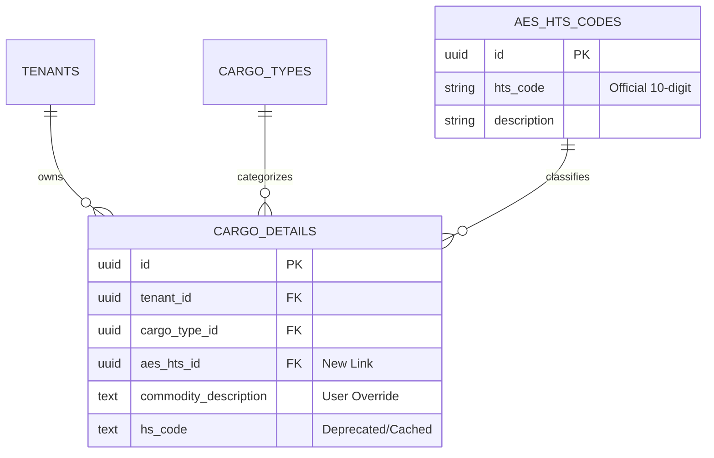

# Logistics Database Analysis & Refactoring Report

**Date:** 2026-01-30
**Status:** Proposed

## 1. Executive Summary
This report analyzes the current database schema regarding logistics data (`cargo_details`, `cargo_types`) and its relationship with the newly implemented `aes_hts_codes` system. The analysis identifies significant data redundancy and a lack of referential integrity between cargo operations and official HTS classifications. A refined architecture is proposed to normalize data, enforce compliance, and enable robust AES filing.

## 2. Current Schema Analysis

### 2.1 Existing Tables

#### `cargo_details`
- **Purpose:** Stores specific shipment line items.
- **Key Columns:** `id`, `tenant_id`, `cargo_type_id`, `commodity_description`, `hs_code` (text), `hazmat_class`.
- **Issues:**
  - `hs_code` is a free-text field with no validation against official HTS standards.
  - `commodity_description` is often manually entered, leading to inconsistencies with official tariff descriptions.
  - No direct link to the AES/HTS database, making automated compliance checks impossible.

#### `cargo_types`
- **Purpose:** High-level categorization (e.g., "General Cargo", "Perishable").
- **Key Columns:** `id`, `cargo_code` (e.g., "GEN", "PERISH").
- **Status:** Functions well as a broad filter but lacks granular regulatory data.

#### `aes_hts_codes` (New System)
- **Purpose:** Official universe of HTS/Schedule B codes.
- **Key Columns:** `id`, `hts_code` (unique, verified), `description`, `unit_of_measure`.
- **Status:** Robust and isolated; currently not utilized by the operational `cargo_details` table.

### 2.2 Identified Redundancies & Risks
1.  **Data Duplication:** `hs_code` in `cargo_details` duplicates data that should be referenced from `aes_hts_codes`.
2.  **Integrity Risk:** Users can enter invalid HTS codes in `cargo_details` that do not exist in `aes_hts_codes`.
3.  **Maintenance Overhead:** Updating a commodity description requires manual updates across all `cargo_details` records instead of a single update in the master table.

## 3. Proposed Architecture Refactoring

### 3.1 Schema Changes

#### 1. Link `cargo_details` to `aes_hts_codes`
- **Action:** Add `aes_hts_id` foreign key to `cargo_details`.
- **Constraint:** `REFERENCES public.aes_hts_codes(id)`.
- **Benefit:** Enforces that every classified cargo item maps to a valid, existing HTS code.

#### 2. Deprecate Free-Text `hs_code`
- **Action:** Retain `hs_code` column for historical data/fallback but mark as deprecated. New logic should prioritize `aes_hts_id`.
- **Migration:** Auto-populate `aes_hts_id` by matching existing `hs_code` text values against `aes_hts_codes.hts_code`.

#### 3. Enhanced Cargo Type Logic
- **Action:** Maintain `cargo_types` for high-level handling rules (e.g., temperature control) but use `aes_hts_codes` for regulatory classification.

### 3.2 Entity Relationship Diagram (Refined)

## 4. Migration Plan

### 4.1 Migration Script (`20260130180000_refactor_cargo_logistics.sql`)
1.  Add `aes_hts_id` column to `cargo_details`.
2.  Create index on `aes_hts_id` for performance.
3.  Execute update statement to match and link existing records based on text match.
4.  Add foreign key constraint.

### 4.2 Impact Analysis
-   **API/Backend:** Endpoints reading `cargo_details` should join `aes_hts_codes` to fetch official descriptions.
-   **Frontend:** The Cargo Details form needs an autocomplete picker for HTS codes (linked to `aes_hts_codes`) instead of a plain text input.
-   **Downtime:** Zero downtime expected. The migration is additive (adding column) and data-fixing.

### 4.3 Rollback Procedure
-   Drop the `aes_hts_id` column.
-   Revert frontend to use text input for `hs_code`.

## 5. Conclusion
This refactoring aligns the operational logistics module with the compliance module, enabling automated AES filing validation and reducing data entry errors.
