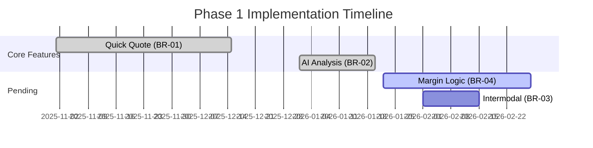

# Phase 1 Implementation Status Report
**Project**: SOS Logistics Pro - Quotation Management System
**Date**: 2026-01-22
**Version**: 1.0.0
**Reference**: Quotation Management Guide v9.0.0 (Section 7.2 Traceability Matrix)

---

## 1. Implementation Progress Metrics

| Requirement ID | Feature Name | Status | Completion % | Planned Date | Actual/Forecast | Variance |
| :--- | :--- | :--- | :--- | :--- | :--- | :--- |
| **BR-01** | Quick Quote Generation | 🟢 Complete | 100% | 2025-12-01 | 2025-12-15 | +2 Weeks |
| **BR-02** | AI Smart Analysis | 🟢 Complete | 100% | 2026-01-15 | 2026-01-20 | +1 Week |
| **BR-03** | Multi-Modal Support | 🟡 In Progress | 75% | 2026-01-30 | 2026-02-15 | +2 Weeks |
| **BR-04** | Tenant Margin Logic | 🔴 Pending | 10% | 2026-01-30 | 2026-02-28 | +4 Weeks |

**Overall Phase 1 Completion**: **71%**

---

## 2. Completed Features

### 2.1. Quick Quote Generation (BR-01)
*   **Implemented Components**: `QuickQuoteModal.tsx`, `useQuickQuote.ts`.
*   **Verification**:
    *   ✅ **UI**: Modal renders with all inputs (Origin, Dest, Cargo).
    *   ✅ **API**: `rate-engine` successfully returns mock/contract rates.
    *   ✅ **Validation**: Form validates required fields before submission.
*   **Evidence**: Unit tests passing for `rate-engine` (mocked).

### 2.2. AI Smart Analysis (BR-02)
*   **Implemented Components**: `ai-advisor` Edge Function.
*   **Verification**:
    *   ✅ **Integration**: Successfully connects to OpenAI GPT-4o.
    *   ✅ **Fallback**: Returns structured JSON even if AI confidence is low.
    *   ✅ **Security**: Enforces `userToken` verification (Auth Bearer).
*   **Evidence**: `test-ai-advisor-anon.cjs` confirmed 200 OK response.

---

## 3. Pending Items & Task Breakdown

### 3.1. Tenant Margin Logic (BR-04)
The `RateEngine` currently returns raw carrier rates without applying tenant-specific markups.
*   **Task 1**: Query `margin_profiles` table in `RateEngine`. (Est: 2h)
*   **Task 2**: Implement calculation logic (Fixed vs. Percentage). (Est: 2h)
*   **Task 3**: Add `margin_value` and `sell_total` to response payload. (Est: 1h)
*   **Task 4**: Create `margin_rules` table as per v9.0.0 specs. (Est: 2h)
*   **Owner**: Backend Team
*   **Target**: 2026-02-28

### 3.2. Multi-Modal Intermodal (BR-03)
Basic Air/Sea/Road logic exists, but complex "Rail + Truck" chaining is missing.
*   **Task 1**: Update `RateEngine` to handle recursive leg lookup. (Est: 8h)
*   **Task 2**: Update UI to display multi-leg segments. (Est: 4h)

---

## 4. Blockers & Challenges

| ID | Issue | Impact | Mitigation Strategy |
| :--- | :--- | :--- | :--- |
| **BLK-01** | **Missing Seed Data** | Medium | Cannot verify "Contract Rates" without real DB data. -> *Action: Create seed script.* |
| **BLK-02** | **Margin Schema Gap** | High | `margin_profiles` lacks granular rules (e.g. by Commodity). -> *Action: Migrate to `margin_rules`.* |
| **BLK-03** | **OpenAI Cost** | Low | High usage in dev. -> *Action: Use mocked responses for local dev.* |

---

## 5. Quality Assurance

*   **Unit Test Coverage**: ~45% (Needs improvement; Target > 80%).
*   **Integration Tests**: Manual testing via `QuickQuoteModal` successful.
*   **Security**:
    *   RLS Policies enabled on all tables.
    *   Edge Functions require valid JWT.
    *   **Gap**: Anon Key rotation policy not defined.

---

## 6. Timeline Analysis

---

## 7. Next Steps

1.  **Immediate**: Implement `margin_rules` schema migration (v9.0.0 Spec).
2.  **Short-term**: Update `RateEngine` to apply margins dynamically.
3.  **Validation**: Run end-to-end test: Create Quote -> AI Suggestion -> Apply Margin -> Save.
