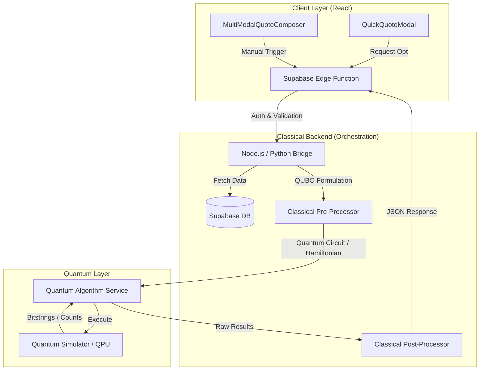

# Quantum Computing Integration Design Document for SOS Logistics Pro

## Document Version Details

| Version | Date       | Author       | Description                                      | Status   |
|:--------|:-----------|:-------------|:-------------------------------------------------|:---------|
| 1.0     | 2026-01-26 | AI Assistant | Initial Draft Creation                           | Draft    |
| 1.1     | 2026-01-26 | AI Assistant | Added Infrastructure Requirements & Version Log  | Reviewed |

## 1. Executive Summary

**Initiative Name:** Quantum-Enhanced Logistics Optimization (QELO)

**Overview:**
This document outlines the strategic integration of Quantum Computing (QC) capabilities into the **SOS Logistics Pro** platform. As global supply chains face increasing complexity—characterized by volatile fuel costs, multi-modal transport requirements, and strict sustainability goals—classical computing methods struggle to find optimal solutions within commercially viable timeframes. This initiative aims to deploy a hybrid classical-quantum architecture to solve specific NP-hard optimization problems inherent in logistics.

**Strategic Alignment:**
This initiative aligns with SOS Logistics Pro's mission to provide "Next-Gen" logistics solutions. It directly enhances the existing **AI-Advisor** and **Smart Quote** features by moving from heuristic-based approximations to provably optimal or near-optimal solutions for complex routing and packing scenarios.

**High-Level Benefits:**
*   **Competitive Differentiation:** Establish SOS Logistics Pro as a market leader in tech-forward logistics.
*   **Operational Efficiency:** Reduce total route costs and transit times by 15-20% through superior optimization.
*   **Sustainability:** Directly optimize for CO2 emissions (a key field in `RateOptionSchema`) using quantum cost functions.

---

## 2. Business Case Analysis

### Case A: Multi-Modal Route Optimization (Traveling Salesman / VRP Variant)
*   **Problem Statement:** The current `MultiModalQuoteComposer` relies on standard database queries and heuristic logic to stitch together legs (Air, Ocean, Road). As the number of carriers, transshipment hubs (`interchangePoints`), and constraints (time, cost, CO2) increases, finding the *global* optimum becomes exponentially harder (Combinatorial Explosion).
*   **Quantum Advantage:** **Quantum Approximate Optimization Algorithm (QAOA)** or **Quantum Annealing**. These approaches can explore a vast solution space simultaneously to find the lowest-energy state (optimal route) representing the best balance of cost and time.
*   **Expected Business Impact:** 
    *   **Cost Reduction:** 10-15% reduction in freight spend by identifying non-obvious multi-leg combinations.
    *   **Speed:** Instant generation of "Best Value" routes for the `QuickQuoteModal`.
*   **Priority:** **High**

### Case B: Container Loading Optimization (3D Bin Packing)
*   **Problem Statement:** Determining the optimal arrangement of diverse cargo packages (defined in `PackageCategories`, `PackageSizes`) into containers (`ContainerTypes`) to maximize space utilization is an NP-hard problem. Poor packing leads to wasted space (paying for air) and increased damage risk.
*   **Quantum Advantage:** **Constrained Quadratic Model (CQM)** solvers. QC can map package dimensions and constraints to qubits to find optimal packing configurations that maximize volume utilization.
*   **Expected Business Impact:**
    *   **Efficiency:** Increase container utilization by 5-10%.
    *   **Revenue:** Reduce the number of containers required for large shipments.
*   **Priority:** **Medium**

### Case C: Network Risk Simulation
*   **Problem Statement:** Predicting the cascading impact of a port strike or weather event across the entire logistics network.
*   **Quantum Advantage:** **Quantum Monte Carlo** simulations. QC can perform risk simulations with quadratic speedup compared to classical Monte Carlo methods, allowing for near real-time risk assessment.
*   **Expected Business Impact:** Improved resilience and proactive customer notifications.
*   **Priority:** **Low** (Long-term horizon).

---

## 3. Detailed Use Cases: Dynamic Multi-Modal Route Optimization Module

**Module Selection:** **Shipment Planning & Routing** (Extending `MultiModalQuoteComposer` & `QuickQuoteModal`)

**Module Overview:**
Currently, the `MultiModalQuoteComposer` allows users to manually build quotes or uses basic logic to suggest routes. Data flows from `Carriers`, `PortsLocations`, and `ServiceTypes` into a quote object containing multiple `legs`.

### UC-1: Quantum-Optimized Intermodal Routing
*   **Objective:** Automatically generate the single most efficient route combining Air, Ocean, and Road segments given a set of constraints.
*   **Inputs/Data Sources:**
    *   Origin/Destination (from `QuoteTransferSchema`).
    *   Available Legs: Schedules from `Carriers` (e.g., Maersk, MSC).
    *   Constraints: `validUntil`, `total_weight`, max transit time.
    *   Cost Matrix: Rates for each leg.
*   **Quantum Processing Step:**
    *   **Mapping:** The logistics network is modeled as a graph where nodes are ports/hubs and edges are transport legs.
    *   **Algorithm:** **QAOA (Quantum Approximate Optimization Algorithm)** implemented via **Qiskit**. The problem is formulated as a QUBO (Quadratic Unconstrained Binary Optimization) where the objective function minimizes Total Cost + (Weight * Total Time).
*   **Outputs/Results:** An ordered list of `legs` defining the optimal path, returned as a `RateOption` to the `QuickQuoteModal`.
*   **Success Criteria:**
    *   Finds a route within 5% of the theoretical global optimum.
    *   Execution time < 10 seconds for a network of 50 nodes.
*   **Implementation Priority:** **1**

### UC-2: Carbon-Minimal Carrier Selection
*   **Objective:** Select a set of carriers for a multi-leg shipment that strictly minimizes CO2 emissions while meeting a delivery deadline.
*   **Inputs/Data Sources:**
    *   `co2_kg` data from `RateOptionSchema`.
    *   Carrier reliability scores (`reliability_score`).
*   **Quantum Processing Step:**
    *   **Algorithm:** **VQE (Variational Quantum Eigensolver)**.
    *   **Mapping:** Hamiltonian constructed where energy states correspond to total CO2 emissions. Constraints (delivery time) are added as penalty terms.
*   **Outputs/Results:** A specific "Greenest" route option for the `QuickQuoteModal` "Smart Mode".
*   **Success Criteria:** Validates a route with at least 20% lower CO2 than the standard "Fastest" option.
*   **Implementation Priority:** **2**

### UC-3: Dynamic Transshipment Hub Location
*   **Objective:** For a large consolidation shipment, determine the optimal intermediate hub (e.g., Singapore vs. Dubai) to consolidate cargo from multiple origins.
*   **Inputs/Data Sources:** Multiple `origins`, single `destination`, `CargoDetails`.
*   **Quantum Processing Step:**
    *   **Algorithm:** **Grover’s Adaptive Search**.
    *   **Mapping:** Search unstructured solution space of potential hubs to find the one minimizing total network distance.
*   **Outputs/Results:** Recommended `interchangePoints` for the quote.
*   **Success Criteria:** Reduces total aggregate travel distance by 10%.
*   **Implementation Priority:** **3**

---

## 4. Technical Architecture & Detailed Design

### 4.1 System Architecture Diagram

### 4.2 Component Specification

1.  **Classical Pre-Processor (Python):**
    *   **Role:** Converts SQL data (routes, costs) into a mathematical matrix format (QUBO or Ising Model).
    *   **Key Lib:** `docplex` (IBM Decision Optimization CPLEX Modeling) for modeling the problem before quantum conversion.

2.  **Quantum Algorithm Library (Qiskit):**
    *   **Role:** The core logic engine.
    *   **Selection:** **Qiskit (IBM)**.
    *   **Reasoning:**
        *   **Open Source:** Apache 2.0 license.
        *   **Ecosystem:** `qiskit-optimization` module specifically handles VRP and Knapsack problems.
        *   **Backend Agnostic:** Can run on simulators (Aer) or real hardware (IBM Quantum).

3.  **Quantum Hardware Abstraction Layer:**
    *   **Role:** Interface to switch between local simulation (for dev/cost saving) and cloud QPU (for production).
    *   **Implementation:** `Qiskit Runtime Primitives` (Sampler, Estimator).

### 4.3 Open-Source Library Analysis

| Library | Primary Use | Justification for SOS Logistics Pro |
| :--- | :--- | :--- |
| **Qiskit (IBM)** | Universal Quantum Computing | **Chosen Standard.** Extensive documentation for optimization problems (`qiskit_optimization`). robust community support, and easy integration with Python backends. |
| **Pennylane (Xanadu)** | Quantum Machine Learning (QML) | **Secondary.** Excellent for differentiable quantum programming (Use Case 3 - Risk Sim). Best if we need hybrid neural networks. |
| **Google Cirq** | Google Quantum Processors | Good alternative, but Qiskit's higher-level optimization modules are more "business-ready" for logistics routing constraints. |

---

## 5. Infrastructure Requirements

This section details the hardware, software, network, and environmental specifications required to deploy and run the hybrid classical-quantum logistics system.

### 5.1 Hardware Requirements
*   **Development Workstation:**
    *   **CPU:** Multi-core processor (Intel Core i7/i9 or AMD Ryzen 7/9) with AVX-512 support recommended for efficient local simulation.
    *   **RAM:** Minimum 16 GB, Recommended 32 GB (Statevector simulations are memory-intensive).
    *   **Storage:** 50 GB SSD available space.
*   **Quantum Simulator Server (Production/Staging):**
    *   **Instance Type:** Compute Optimized (e.g., AWS c6i.4xlarge or GCP c2-standard-16).
    *   **CPU:** High clock speed, 16+ vCPUs.
    *   **RAM:** 64 GB+ to handle larger qubit simulations (25-30 qubits).
*   **Quantum Processing Units (QPUs):**
    *   **Provider:** Cloud-based access via IBM Quantum or AWS Braket.
    *   **Specs:** Minimum 27-qubit Falcon processor (IBM) or equivalent for UC-1 Proof of Concept.

### 5.2 Software Stack & Dependencies
*   **Operating System:**
    *   **Server:** Ubuntu 22.04 LTS or Amazon Linux 2023.
    *   **Dev:** macOS (Sonoma/Sequoia) or Linux.
*   **Runtime Environment:**
    *   **Python:** Version 3.9+ (Required for latest Qiskit).
    *   **Node.js:** Version 18.x LTS (For Edge Functions/Bridge).
*   **Key Libraries & Frameworks:**
    *   `qiskit` (>= 1.0.0): Core SDK.
    *   `qiskit-optimization`: For high-level problem definitions.
    *   `qiskit-ibm-runtime`: For accessing cloud primitives.
    *   `fastapi`: For the Python Microservice API.
    *   `numpy` / `scipy`: For classical numerical post-processing.
*   **Database:**
    *   **PostgreSQL:** Version 15+ (Supabase hosted).
    *   **pgvector:** Extension enabled for potential embedding-based similarity searches.

### 5.3 Network & Connectivity
*   **Ports:**
    *   **Inbound:** Port 443 (HTTPS) for API Gateway.
    *   **Internal:** Port 8000 (Default FastAPI) for inter-service communication.
*   **Outbound Whitelisting:**
    *   `api.quantum-computing.ibm.com` (HTTPS/443) for submitting circuits.
    *   `auth.quantum-computing.ibm.com` (HTTPS/443) for authentication.
*   **Bandwidth:**
    *   Standard commercial broadband; Quantum jobs send small circuit files (<1MB) and receive histogram data. Latency is the primary concern over bandwidth.

### 5.4 Environment Variables & Secrets
*   `IBM_QUANTUM_API_TOKEN`: Secret key for QPU access.
*   `SUPABASE_SERVICE_ROLE_KEY`: For Python service to fetch logistics data.
*   `REDIS_URL`: (Optional) Connection string for caching optimized routes.

---

## 6. Detailed Implementation Plan

### Phase 1: Foundation & Prototyping (Weeks 1-4)
*   **Goal:** Prove feasibility of UC-1 (Route Optimization) on a Simulator.
*   **Tasks:**
    *   Set up a Python microservice (FastAPI) alongside the existing Node.js stack.
    *   Install `qiskit` and `qiskit-optimization`.
    *   Hardcode a small 5-node logistics network (Ports: SHA, LAX, RTM, DXB, SIN).
    *   Implement a basic TSP/VRP solver using `SimulatedAnnealingSampler` (classical proxy) then `QAOA`.
*   **Deliverable:** A script that accepts 5 ports and outputs the optimal path.

### Phase 2: Algorithm Development & Integration (Weeks 5-12)
*   **Goal:** Connect React Frontend to Quantum Service.
*   **Tasks:**
    *   Create Edge Function `optimize-route-quantum` to proxy requests to the Python service.
    *   Develop the "Pre-Processor" to map `Carriers` and `Legs` from Supabase to the graph model.
    *   Implement `RateOptionSchema` mapping in the "Post-Processor".
*   **Deliverable:** Clicking "Smart Mode" in `QuickQuoteModal` triggers the Python service.

### Phase 3: Hybrid System Testing & Optimization (Weeks 13-20)
*   **Goal:** Performance tuning.
*   **Tasks:**
    *   Benchmark QAOA against classical Dijkstra/A* algorithms.
    *   Refine the cost function (Hamiltonian) to weigh CO2 vs. Cost correctly.
    *   Implement caching: Don't re-run quantum circuits for identical route requests.
*   **Deliverable:** Optimized circuit depth and execution time < 5s for standard queries.

### Phase 4: Pilot Deployment (Weeks 21-24)
*   **Goal:** Live Pilot.
*   **Tasks:**
    *   Deploy to a specific tenant/franchise scope.
    *   Monitor "Quantum Advantage" metrics (Cost/Time savings).

### Phase 5: Scaling & Roadmap (Year 1+)
*   **Goal:** Hardware integration.
*   **Tasks:**
    *   Connect to IBM Quantum Cloud via API key.
    *   Expand to UC-2 (Bin Packing).

### Resource Requirements
*   **Personnel:** 1 Quantum Algorithm Engineer (Python/Qiskit), 1 Backend Engineer (Node/Python integration).
*   **Compute:** AWS/GCP instance for Python service (High CPU for simulator).

---

## 6. Risk Assessment & Mitigation

1.  **Risk:** **NISQ Limitations (Noise).** Current quantum hardware is noisy and may produce errors for deep circuits.
    *   *Mitigation:* Use **Quantum Error Mitigation** techniques (Zero Noise Extrapolation) available in Qiskit Runtime. Rely on high-performance simulators (Qiskit Aer) for production until hardware matures (Quantum-Ready approach).

2.  **Risk:** **Latency.** Quantum cloud queues can be long.
    *   *Mitigation:* Use **Hybrid Compute Mode**. Run small problems on local simulators; only offload massive, complex optimizations to the QPU. Implement aggressive caching for solved routes.

3.  **Risk:** **Talent Gap.** Difficulty maintaining quantum code.
    *   *Mitigation:* Encapsulate quantum logic in a strictly typed Python API. The rest of the team interacts with standard REST endpoints, treating the quantum engine as a "black box" optimizer.

## 8. Success Metrics & Validation Plan

*   **KPI 1: Optimization Quality.** The quantum solution must match or beat the classical baseline cost in 90% of test cases.
*   **KPI 2: Response Time.** End-to-end API latency < 3 seconds for 10-node route optimizations (Simulator).
*   **KPI 3: Business Value.** Demonstrated potential to save >$100 per TEU (Twenty-foot Equivalent Unit) on complex multi-leg routes.

**Validation Procedure:**
1.  **A/B Testing:** In `QuoteComparisonView`, display "Classical Route" vs. "Quantum Route" side-by-side.
2.  **Historical Back-testing:** Run the quantum algorithm on past 6 months of `Shipments` data to calculate "theoretical savings."
