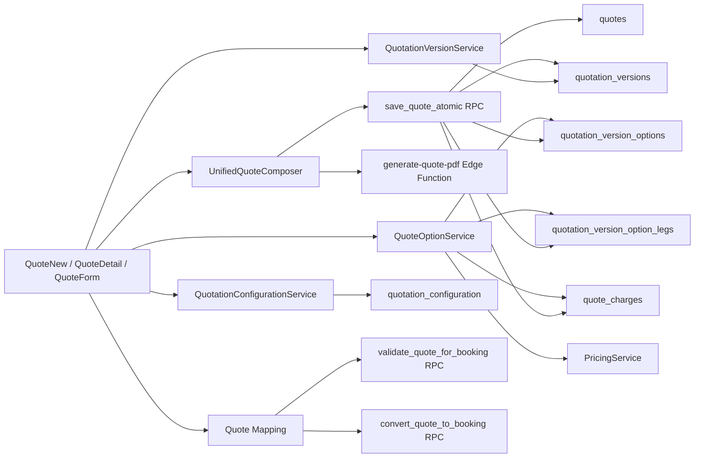
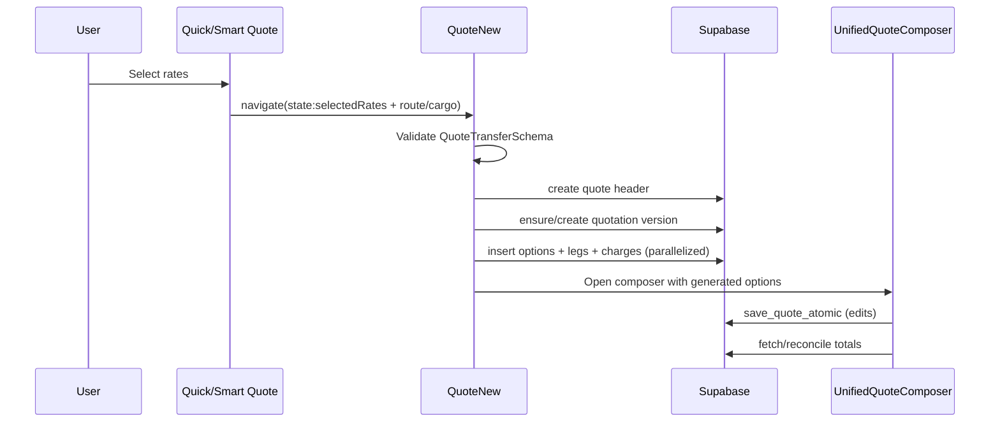
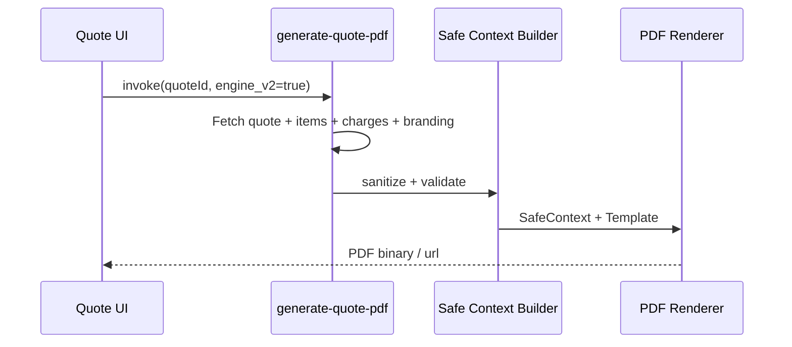
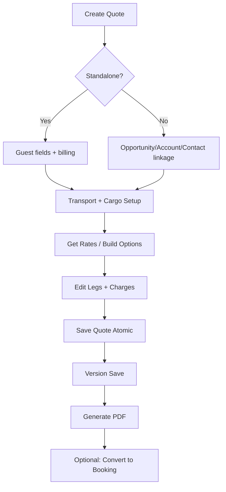
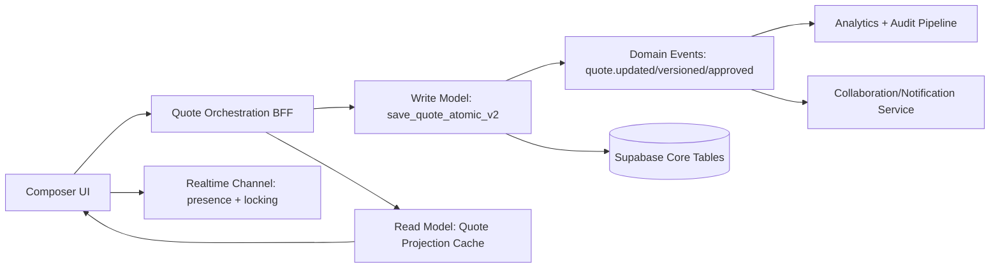
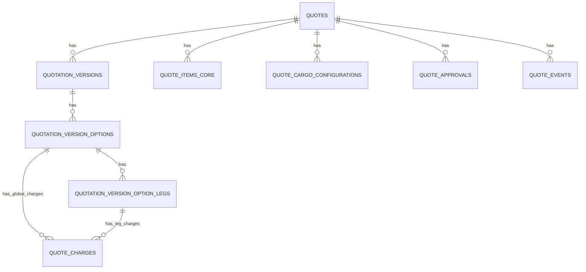
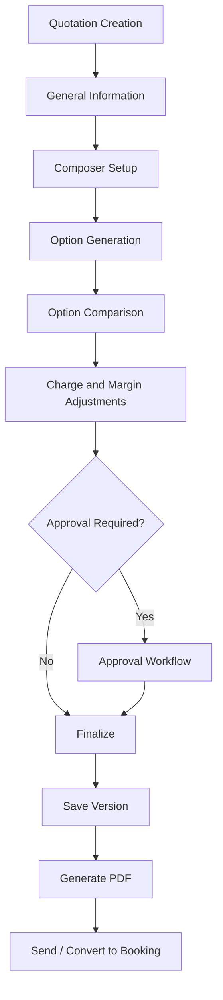

# Quotation Module Product Requirements Document (PRD)
## Comprehensive Audit and Target-State Specification

- Document Version: `1.0`
- Date: `2026-04-07`
- Author Name: `Vimal Bahuguna, Senior Solution Architect`
- Authoring Method: `Codebase Audit + Existing Technical Artifact Synthesis`
- Scope: `Quotation and Quote Composer ecosystem (UI, APIs, services, schema, integrations, governance)`

---

## 0) Executive Summary

This PRD is built from a systematic audit of the current Quotation implementation. It documents:

1. Full inventory of modules and dependencies across routes, components, services, APIs, RPCs, edge functions, and data schema.
2. Section-level behavior for each primary module, including interaction models and conditional logic.
3. Field-level contract documentation for key entities, including validations, defaults, formulas, and persistence mapping.
4. General information requirements: role/permission hierarchy, audit trail standards, integration APIs, and compliance.
5. Detailed Quotation Composer specifications (current + target), with visual and interaction requirements.
6. Current-state analysis, screenshots, flowcharts, and gap matrixes.
7. Future-state roadmap and architecture proposals with scalability and resilience controls.
8. Persona-driven stories with explicit acceptance criteria.
9. MoSCoW prioritization with estimates and staffing guidance.

---

## 1) Systematic Audit Baseline

### 1.1 Audited Sources (Primary Evidence)

- UI routes and pages:
  - `src/pages/dashboard/QuoteNew.tsx`
  - `src/pages/dashboard/QuoteDetail.tsx`
  - `src/pages/dashboard/Quotes.tsx`
  - `src/pages/dashboard/QuotesImportExport.tsx`
  - `src/pages/dashboard/QuoteTemplates.tsx`
  - `src/pages/dashboard/QuoteBookingMapper.tsx`
- Core composer and form modules:
  - `src/components/sales/unified-composer/UnifiedQuoteComposer.tsx`
  - `src/components/sales/unified-composer/FormZone.tsx`
  - `src/components/sales/unified-composer/ResultsZone.tsx`
  - `src/components/sales/unified-composer/FinalizeSection.tsx`
  - `src/components/sales/unified-composer/schema.ts`
  - `src/components/sales/quote-form/*`
- Services and domain logic:
  - `src/services/quotation/*`
  - `src/services/QuoteOptionService.ts`
  - `src/services/pricing.service.ts`
- API and integration contracts:
  - `src/pages/api/v2/quotations/import.ts`
  - `src/pages/api/v2/quotations/export.ts`
  - `docs/api/quote-mapping-api.yaml`
- Database contracts and migration evolution:
  - `supabase/migrations/20251005170000_quotation_core.sql`
  - `supabase/migrations/20251108115738_69577924-736f-40dd-9d24-0a104675c62e.sql`
  - `supabase/migrations/20260122090000_enhance_quote_schema.sql`
  - `supabase/migrations/20260201170001_enterprise_quote_architecture.sql`
  - `supabase/migrations/20260215000000_quote_cargo_configurations.sql`
  - `supabase/migrations/20260227000002_enhance_quotation_module.sql`
  - `supabase/migrations/20260303120000_update_save_quote_atomic_locations.sql`
  - `supabase/migrations/20260306180000_update_quote_templates_schema.sql`
- Role and access model:
  - `src/config/permissions.ts`
- Existing analysis and performance evidence:
  - `docs/quote-data-pipeline.md`
  - `docs/quote-generation-workflow.md`
  - `docs/quick-quote-integration-spec.md`
  - `docs/technical_specs/quotation_engine_architecture.md`
  - `tests/e2e/quotation/quotation-e2e-review-and-traceability.md`

### 1.2 Current Product Posture (As-Is)

- The platform supports end-to-end quotation lifecycle: create, enrich, compare, persist versions, generate PDFs, import/export, and map quote to booking.
- Core persistence centers around `quotes`, `quotation_versions`, `quotation_version_options`, `quotation_version_option_legs`, `quote_charges`, and cargo/item extensions.
- Composer already supports complex multimodal option editing and financial recalculation, but collaborative editing and true drag-and-drop layout composition are not fully realized in the quotation creation flow.
- Quote template and PDF-generation ecosystem is mature and schema-driven; visual-template designer capability is partially implemented and partially planned.

---

## 2) Quotation System Architecture Inventory

### 2.1 Module Inventory

| Layer | Module | Responsibility | Key Dependencies | Integration Touchpoints |
|---|---|---|---|---|
| Route | `QuoteNew` | New quote orchestration, quick/smart quote conversion, option generation | `QuoteFormRefactored`, `UnifiedQuoteComposer`, `QuoteOptionService` patterns | Supabase tables, RPC `save_quote_atomic`, rate payload mapping |
| Route | `QuoteDetail` | Version management, save/restore version, detail visualization | Version panels, option cards, comparison components | Edge functions `save-quotation-version`, `restore-quotation-version` |
| Route | `Quotes` | Quote list/search/filter actions | data hooks, table/list components | CRUD endpoints and direct data reads |
| Route | `QuotesImportExport` | Batch import/export entry UI | API routes v2, permission checks | `/api/v2/quotations/import`, `/api/v2/quotations/export` |
| Route | `QuoteTemplates` | Template list/editor and quote creation from template | template components + auth context | `quote_templates`, `quotes` insert |
| Route | `QuoteBookingMapper` | Quote-to-booking conversion workflow | `QuoteSelectionGrid`, `QuoteMappingPreview` | RPC `validate_quote_for_booking`, `convert_quote_to_booking` |
| Component | `UnifiedQuoteComposer` | Main composer shell (tabs/phases), save, calculate, generate PDF | `FormZone`, `ResultsZone`, `FinalizeSection`, schema | RPC `save_quote_atomic`, Edge `generate-quote-pdf` |
| Component | `QuoteFormRefactored` | Structured quote editor (header/logistics/cargo/financials) | `QuoteHeader`, `QuoteLogistics`, `QuoteLineItems`, `QuoteFinancials` | `useQuoteRepository`, scoped DB writes |
| Service | `QuoteOptionService` | Option, leg, charge normalization and persistence | `PricingService`, mappers, charge matching utils | `quotation_version_options`, `quotation_version_option_legs`, `quote_charges` |
| Service | `QuotationVersionService` | Create/list/set active/restore logic | DB wrapper and version policies | `quotation_versions`, `quotes.current_version_id` |
| Service | `QuotationOptionCrudService` | Option-level delete/update wrappers | DB RPC abstraction | RPC `delete_quote_option_safe` |
| Service | `QuotationConfigurationService` | Tenant-level composer defaults and smart mode controls | tenant context | `quotation_configuration` |
| Service | `QuotationRankingService` | Option scoring and recommendation | scoring criteria and metadata | rank fields in `quotation_version_options` |
| Service | `PricingService` | margin rules, financial calculations, realtime subscriptions | `margin_rules`, `service_pricing_tiers`, `services` | RPC `calculate_service_price`, client fallback |
| DB Core | `quotes` + related | Header-level quote contract | contacts/accounts/service types/currency | CRUD and version linkage |
| DB Versioning | `quotation_versions` | immutable-ish state progression and snapshots | quote FK, template snapshot | save/restore workflows |
| DB Options | `quotation_version_options` | carrier options and ranking metadata | version FK + carrier/reference data | compare/rank/select flows |
| DB Legs | `quotation_version_option_legs` | multimodal route legs and transit detail | ports/carrier/service type FKs | per-leg charge mapping and UI route breakdown |
| DB Charges | `quote_charges` | buy/sell financial lines | bases/categories/currency/sides | final totals, reconciliation, margin |
| DB Cargo | `quote_cargo_configurations` | structured cargo setup by transport mode | package and dimensional metadata | pricing, operational planning |
| DB Governance | `quote_approval_rules`, `quote_approvals`, `quote_pricing_logs`, `quote_events` | approvals + auditability | user/tenant context | compliance, enterprise controls |

### 2.2 Dependency Diagram



### 2.3 Data Flow Diagrams

#### A) Quick/Smart Quote to Composer



#### B) PDF Generation



---

## 3) Section-Level Functional Decomposition

### 3.1 `QuoteNew` Primary Sections

| Section | Purpose | User Interactions | Business Logic | Conditional Rendering | Performance Expectations |
|---|---|---|---|---|---|
| Initialization | Resolve navigation payload and startup data | enter page / convert flow | validates transfer payload, creates quote header/version | shows failure UI when tenant/version missing | initial load under 1s for standard form |
| Generation Progress | show conversion from selected rates | view progress and errors | parallel option insertion and timeout handling | visible only when selected rates exist | 4 options target ~1-3s |
| Composer Launch | route to detailed editing | edit options / legs / charges | binds generated data to composer state | appears once version/options exist | smooth transition without hard reload |

### 3.2 `UnifiedQuoteComposer` Sections

| Section | Purpose | User Interactions | Business Logic | Conditional Rendering | Performance Requirements |
|---|---|---|---|---|---|
| General Information tab | CRM/guest context and core quote header | select opp/account/contact, standalone toggle | cross-field synchronization and validation | guest fields only in standalone | under 100ms field-response |
| FormZone | route and cargo intake | choose mode, origin/destination, cargo, attachments | mode-specific required fields and schema validation | air/ocean/rail-specific controls | autocomplete lookup <300ms perceived |
| ResultsZone | option review and editing | compare options, adjust charges/margins | ranking, charge aggregation, smart suggestions | only after rates/options available | list/grid rendering should stay <16ms/frame |
| FinalizeSection | save/version/pdf actions | save draft/final, generate pdf | payload normalization then `save_quote_atomic` | enabled when form validity passes | save RPC robust retry and clear error taxonomy |
| Error handling surface | resilience to RPC/schema mismatches | user retries with guidance | maps backend error signatures to user-readable remediation | shown only on failure | no hard crash; recoverable fallback path |

### 3.3 `QuoteFormRefactored` Sections

| Section | Purpose | User Interactions | Business Logic | Conditional Rendering | Performance Requirements |
|---|---|---|---|---|---|
| `QuoteHeader` | quote identity + CRM linkage | set title/status/dates and link entities | auto-populate account/contact from opportunity | standalone guest block toggled | reactive updates with no full re-render |
| `QuoteLogistics` | service/carrier/route configuration | select service type/level/carrier/ports | mode normalization + leg-derived placeholders | multi-leg rows only when legs exist | lookup + select under 200ms |
| `QuoteLineItems` | cargo/commercial line management | add/remove/edit items | maps nested cargo object to flat form state | empty state card when no items | virtualization for large item lists |
| `QuoteFinancials` | pricing, taxes, terms, notes | calculate estimate, apply totals, verify server | margin-rule application + reconciliation | warning only when items exist and total is zero | calculation feedback <2s target |

### 3.4 Versioning/Approval/Template Sections

| Module | Sections | Notes |
|---|---|---|
| `quotation-versions/*` | history, comparison, actions, PDF generation, approval workflow | supports save/restore and enterprise governance controls |
| `QuoteTemplates` | list, editor, selection/create-from-template | schema-backed template content with quote instantiation |
| `QuoteBookingMapper` | selection and preview/validation | quote conversion guardrails and audit mapping |

---

## 4) Comprehensive Field-Level Documentation

Note: Length semantics are inferred from schema and DB type. For `text` columns, practical limits are product-defined rather than DB hard caps.

### 4.1 Quote Header Contract (`quotes` + form schema)

| Field | Type / Length | Required | Default | Validation / Rule | Formula / Dependency | DB Mapping |
|---|---|---|---|---|---|---|
| `title` | string, variable text | Yes | none | min length 1 | base identity field | `quotes.title` |
| `description` | string text | No | null | none | optional context note | `quotes.description` |
| `quote_number` | string <= 32 (composer path) | Optional/manual | auto generated when blank | regex `[A-Za-z0-9._-]*` | uniqueness in sequence policy | `quotes.quote_number` |
| `status` | enum-like text | Yes | `draft` | UI set (`draft/sent/accepted/rejected`) | drives available actions | `quotes.status` |
| `account_id` | UUID | Conditional | null | required unless standalone or opportunity used | syncs contact/opportunity filtering | `quotes.account_id` |
| `contact_id` | UUID | No | null | must align to account if account selected | auto-filled from opportunity/contact | `quotes.contact_id` |
| `opportunity_id` | UUID | Conditional | null | required in non-standalone when account absent | backfills account/contact | `quotes.opportunity_id` |
| `service_type_id` | UUID | No | null | selected from service types | filters service list and carrier mode | `quotes.service_type_id` |
| `service_id` | UUID | No | null | must belong to selected service type | dependency on `service_type_id` | `quotes.service_id` |
| `incoterms` | string | No | null | selected from allowed incoterms list | impacts pricing/compliance context | `quotes.incoterms` |
| `currency_id` | UUID | No | null | selected from currency master | used in charge and totals display | `quotes.currency_id` |
| `origin_port_id` | UUID | No | null | selected from locations | used by routing and leg derivation | `quotes.origin_port_id` |
| `destination_port_id` | UUID | No | null | selected from locations | used by routing and leg derivation | `quotes.destination_port_id` |
| `pickup_date` | date/string | No | null | date input; downstream chronology checks | paired with delivery deadline | `quotes.pickup_date` |
| `delivery_deadline` | date/string | No | null | optional date | should be >= pickup in ops process | `quotes.delivery_deadline` |
| `vehicle_type` | string | No | null | free text | used in logistics and docs | `quotes.vehicle_type` |
| `special_handling` | string/json | No | null | free text / structured in RPC payload | compliance and execution hints | `quotes.special_handling` |
| `tax_percent` | numeric-string | No | `0` | non-negative | total = shipping + tax | `quotes.tax_percent` |
| `shipping_amount` | numeric-string | No | `0` | non-negative | subtotal input for financials | `quotes.shipping_amount` |
| `terms_conditions` | text | No | null | none | shown in outbound quote docs | `quotes.terms_conditions` |
| `notes` | text | No | null | internal use | non-customer-facing | `quotes.notes` |
| `billing_address` | jsonb | No | `{}` | standalone mode requires key fields | used for guest quote mode | `quotes.billing_address` |
| `shipping_address` | jsonb | No | `{}` | optional | address output in docs | `quotes.shipping_address` |
| `tenant_id` | UUID | Yes | context-derived | must match scoped tenant | multitenant isolation | `quotes.tenant_id` |
| `franchise_id` | UUID | Conditional | context-derived | org hierarchy dependent | franchise partitioning | `quotes.franchise_id` |

### 4.2 Cargo Item Contract (`items` -> `quote_items_core` + extension)

| Field | Type | Required | Default | Validation | Formula/Dependency | DB Mapping |
|---|---|---|---|---|---|---|
| `type` | enum `loose/container/unit` | Yes | `loose` | enum constraint | drives container fields requirement | `logistics.quote_items_extension.type` |
| `product_name` | string | Yes | none | min length 1 | basis for commodity description | `quote_items_core.product_name` |
| `description` | string | No | null | none | can mirror product name | `quote_items_core.description` |
| `quantity` | number | Yes | `1` | min 1 | line total calc | `quote_items_core.quantity` |
| `unit_price` | number | Yes | `0` | min 0 | line total calc | `quote_items_core.unit_price` |
| `discount_percent` | number | No | `0` | min 0 max 100 | discount amount derivation | `quote_items_core.discount_percent` |
| `commodity_id` | UUID | No | null | optional lookup | commodity master link | `quote_items_core.commodity_id` |
| `aes_hts_id` | UUID | No | null | optional lookup | trade compliance linkage | `quote_items_core.aes_hts_id` |
| `attributes.weight` | number | No | 0 | non-negative | logistics calculations | `logistics.quote_items_extension.weight_kg` |
| `attributes.volume` | number | No | 0 | non-negative | logistics calculations | `logistics.quote_items_extension.volume_cbm` |
| `attributes.length/width/height` | number | No | 0 | non-negative | dimensional weight contexts | `logistics.quote_items_extension.attributes` |
| `attributes.hs_code` | string | No | null | optional | customs mapping | `logistics.quote_items_extension.attributes` |
| `attributes.hazmat` | object | No | null | optional structured | hazmat compliance | `logistics.quote_items_extension.attributes` |
| `container_type_id` | UUID | Conditional | null | required for container type | mode/type dependent | `logistics.quote_items_extension.container_type_id` |
| `container_size_id` | UUID | Conditional | null | required for container type | mode/type dependent | `logistics.quote_items_extension.container_size_id` |

### 4.3 Cargo Configuration Contract (`quote_cargo_configurations`)

| Field | Type | Required | Default | Validation | Dependency | DB Mapping |
|---|---|---|---|---|---|---|
| `transport_mode` | text enum-like | Yes | none | one of ocean/air/road/rail | drives downstream logic | `quote_cargo_configurations.transport_mode` |
| `cargo_type` | text enum-like | Yes | none | one of FCL/LCL/Breakbulk/RoRo | impacts container and pricing logic | `quote_cargo_configurations.cargo_type` |
| `container_type` | text | No | null | mode dependent | linked with type_id | `quote_cargo_configurations.container_type` |
| `container_size` | text | No | null | mode dependent | linked with size_id | `quote_cargo_configurations.container_size` |
| `container_type_id` | UUID | No | null | optional FK | references master | `quote_cargo_configurations.container_type_id` |
| `container_size_id` | UUID | No | null | optional FK | references master | `quote_cargo_configurations.container_size_id` |
| `quantity` | integer | Yes | 1 | min 1 | primary volume multiplier | `quote_cargo_configurations.quantity` |
| `unit_weight_kg` | numeric | No | null | non-negative | pricing + routing weight | `quote_cargo_configurations.unit_weight_kg` |
| `unit_volume_cbm` | numeric | No | null | non-negative | pricing + stowage | `quote_cargo_configurations.unit_volume_cbm` |
| `length_cm/width_cm/height_cm` | numeric | No | null | non-negative | used in OOG/LCL handling | corresponding columns |
| `is_hazardous` | boolean | No | false | boolean | enables hazardous fields | `quote_cargo_configurations.is_hazardous` |
| `hazardous_class` | text | Conditional | null | required if hazardous | hazmat rule dependency | `quote_cargo_configurations.hazardous_class` |
| `un_number` | text | Conditional | null | required if hazardous | hazmat rule dependency | `quote_cargo_configurations.un_number` |
| `is_temperature_controlled` | boolean | No | false | boolean | enables temperature fields | `quote_cargo_configurations.is_temperature_controlled` |
| `temperature_min/max` | numeric | Conditional | null | numeric range expectation | temp-control dependency | corresponding columns |
| `temperature_unit` | text | No | `C` | expected C/F | temp-control dependency | `quote_cargo_configurations.temperature_unit` |

### 4.4 Option / Leg / Charge Contract

| Entity.Field | Type | Required | Default | Validation | Formula/Dependency | DB Mapping |
|---|---|---|---|---|---|---|
| `option.option_name` | text | No | generated label | none | fallback uses carrier+tier | `quotation_version_options.option_name` |
| `option.total_amount` | numeric | Yes | 0 | non-negative expected | reconciled from sell charges | `quotation_version_options.total_amount` |
| `option.total_buy` | numeric | Derived | 0 | computed | sum of buy-side charges | `quotation_version_options.total_buy` |
| `option.total_sell` | numeric | Derived | 0 | computed | sum of sell-side charges | `quotation_version_options.total_sell` |
| `option.margin_amount` | numeric | Derived | 0 | computed | `total_sell - total_buy` | `quotation_version_options.margin_amount` |
| `option.margin_percentage` | numeric | Derived | 0 | computed | `(margin / buy)*100` | `quotation_version_options.margin_percentage` |
| `option.rank_score` | numeric | No | null | optional scoring | ranking service driven | `quotation_version_options.rank_score` |
| `option.is_recommended` | boolean | No | false | boolean | ranking heuristic output | `quotation_version_options.is_recommended` |
| `leg.sort_order` | integer | Yes | sequential | >0 | ordered route sequence | `quotation_version_option_legs.sort_order` |
| `leg.transport_mode` | text | Yes | derived | expected mode code | affects charge matching + carriers | `quotation_version_option_legs.transport_mode` |
| `leg.origin_location_id` | UUID | No | null | FK optional | resolved from name/port mapping | `quotation_version_option_legs.origin_location_id` |
| `leg.destination_location_id` | UUID | No | null | FK optional | resolved from name/port mapping | `quotation_version_option_legs.destination_location_id` |
| `leg.transit_time_days` | number UI | No | 0 | non-negative | converted to hours in DB writes | mapped to `transit_time_hours` |
| `charge.category_id` | UUID | Yes | fallback category | must resolve category | keyword/fuzzy mapping fallback chain | `quote_charges.category_id` |
| `charge.basis_id` | UUID | No | per_shipment fallback | mapped via basis/unit | fallback to default basis | `quote_charges.basis_id` |
| `charge.currency_id` | UUID | No | USD mapping | mapped via currency code | fallback to quote currency | `quote_charges.currency_id` |
| `charge.quantity` | numeric | Yes | 1 | non-negative | amount = rate * quantity | `quote_charges.quantity` |
| `charge.rate` | numeric | Yes | computed | non-negative | pricing service output | `quote_charges.rate` |
| `charge.amount` | numeric | Yes | computed | non-negative | pair buy/sell insertion | `quote_charges.amount` |
| `charge.charge_side_id` | UUID | Yes | n/a | must resolve buy/sell side | mandatory side records check | `quote_charges.charge_side_id` |

### 4.5 Quotation Configuration and Template Fields

| Field | Type | Required | Default | Notes |
|---|---|---|---|---|
| `quotation_configuration.default_module` | text | Yes | `composer` | check: `composer/legacy/smart` |
| `quotation_configuration.smart_mode_enabled` | boolean | No | false | toggles smart features |
| `quotation_configuration.smart_mode_settings` | jsonb | No | `{}` | tenant-scoped tuning |
| `quotation_configuration.multi_option_enabled` | boolean | No | true | controls option multiplicity |
| `quotation_configuration.auto_ranking_criteria` | jsonb | No | weighted cost/time/reliability | ranking inputs |
| `quote_templates.content` | jsonb | Yes | none | template body schema-validated |
| `quote_templates.template_name` | text | No | null | named template variants |
| `quote_templates.rate_options` | jsonb array | No | `[]` | MGL template extension |
| `quote_templates.transport_modes` | jsonb array | No | `[]` | MGL template extension |

---

## 5) General Information Requirements

### 5.1 User Roles and Permission Hierarchy (Quotation-Relevant)

| Role | View | Create | Edit | Delete | Import/Export | Sensitive Export | Templates Manage | Notes |
|---|---|---|---|---|---|---|---|---|
| `platform_admin` | Yes | Yes | Yes | Yes | Yes | Yes | Yes | full platform scope |
| `super_admin` | Yes | Yes | Yes | Yes | Yes | Yes | Yes | enterprise-wide |
| `tenant_admin` | Yes | Yes | Yes | Yes | Yes | tenant export only | Yes | tenant scope |
| `franchise_admin` | Yes | Yes | Yes | No | Yes | No | No | franchise scope |
| `user` | Yes | Yes | limited | No | Yes | No | No | standard sales operations |

Permission source slugs include:
`quotes.view`, `quotes.create`, `quotes.edit`, `quotes.delete`, `quotes.import_export`, `quotes.analytics`, `quotes.export_sensitive`, `quotes.templates.manage`, `import_quotation`, `export_quotation`, `export_quotation_sensitive`.

### 5.2 Audit Trail Requirements

Mandatory audit points:

- Quote lifecycle events: create/update/status transitions (`quote_events`).
- Versioning events: save, restore, active version change (`quotation_versions` + route actions).
- Pricing provenance: automatic rule application and overrides (`quote_pricing_logs`).
- Approval traces: request/approve/reject with actor and rationale (`quote_approvals`).
- Mapping actions: quote-to-booking validation and conversion logs.

### 5.3 Integration APIs and RPC Matrix

| Interface | Type | Purpose |
|---|---|---|
| `/api/v2/quotations/import` | REST API route | bulk import orchestration |
| `/api/v2/quotations/export` | REST API route | export with permission and sensitivity controls |
| `save_quote_atomic` | PostgreSQL RPC | atomic persistence of quote + items + cargo + options + legs + charges |
| `delete_quote_option_safe` | PostgreSQL RPC | safe option deletion with integrity rules |
| `validate_quote_for_booking` | PostgreSQL RPC | pre-conversion business rule validation |
| `convert_quote_to_booking` | PostgreSQL RPC | quote-to-booking conversion with audit continuity |
| `generate-quote-pdf` | Edge Function | schema-safe PDF generation |
| `save-quotation-version` / `restore-quotation-version` | Edge Functions | version snapshots and restore path |
| `calculate-quote-financials` | Edge Function | server-side financial verification |
| `calculate_service_price` | PostgreSQL RPC | service-tier pricing calculation |

### 5.4 Compliance Standards (Required)

- Multitenant data isolation via `tenant_id`/`franchise_id` + RLS.
- Scoped access patterns for all quote data operations.
- Schema-first validation using Zod for form and payload contracts.
- Safe-context PDF rendering to prevent data exfiltration.
- Auditability for pricing decisions and approval workflows.
- Backward-compatible schema evolution and version-aware payload normalization.

---

## 6) Quotation Composer: Detailed Specification

### 6.1 UI/UX Wireframe Specification (Desktop)

```text
+--------------------------------------------------------------------------------------+
| Header / Breadcrumb / Domain / Actions                                               |
+--------------------------------------------------------------------------------------+
| Tabs: [General Information] [Quotation Composer]                                     |
+--------------------------------------------------------------------------------------+
| Left/Primary (70%)                                            | Right/Secondary (30%)|
| - FormZone                                                     | - Option summary      |
|   - Mode / Route / Cargo                                       | - Ranking badges      |
|   - Carrier preference                                         | - Totals              |
|   - Validation hints                                           | - Save/Version actions|
| - ResultsZone (option table/cards/list)                        |                      |
| - FinalizeSection (notes/margin/pdf/send)                      |                      |
+--------------------------------------------------------------------------------------+
```

### 6.2 Responsive Requirements

- Desktop (`>=1280`): full two-zone composition, persistent action rail.
- Tablet (`768-1279`): stacked sections with sticky action bar.
- Mobile (`<768`): single-column wizard behavior, collapsible detail groups.
- Accessibility:
  - keyboard navigable section controls;
  - visible focus rings;
  - semantic labels for all select/input/button elements.

### 6.3 Drag-and-Drop Functional Requirements

Current:
- Option and charge editing is primarily form-driven; no complete drag-and-drop layout composer for quote-building sections.

Required:
- Drag to reorder legs, charge groups, and optional summary blocks.
- Drag constraints:
  - non-removable mandatory sections pinned;
  - route continuity validator blocks invalid drops.
- Interaction standards:
  - ghost element + insertion indicator;
  - keyboard-accessible reorder controls;
  - undo stack integration.

### 6.4 Real-Time Calculation Engine Requirements

Current:
- Uses `PricingService` with cached margin rules and `calculateFinancials`.
- Supports estimate generation and optional server verification.

Required:
- deterministic calc pipeline per option:
  - input normalization;
  - category/basis/currency resolution;
  - buy/sell pair synthesis;
  - discrepancy-balancing logic;
  - reconciliation writeback.
- SLA targets:
  - single option recalc <200ms client-side;
  - full save+reconcile <1.5s p95 for <=10 options.

### 6.5 Version Control and Collaborative Editing

Current:
- version save/restore exists;
- active/current version semantics supported.

Required:
- soft-locking with collaborator presence indicator;
- conflict resolution:
  - field-level last-writer metadata;
  - diff preview before overwrite;
  - manual merge assistant for critical financial fields.
- timeline model:
  - draft checkpoints;
  - published snapshots;
  - immutable PDF/version pairing.

### 6.6 Interactive Prototype Specifications (Target)

- Prototype scope:
  - quote creation from scratch;
  - quick quote conversion;
  - option comparison/edit;
  - approval trigger path;
  - PDF generation and booking conversion.
- Prototype fidelity:
  - stateful controls for conditional fields;
  - simulated async states (loading/error/partial success);
  - keyboard-only path validation.

---

## 7) Current-State Visual Documentation and Gap Analysis

### 7.1 Screenshot Inventory (Current State)

- Desktop snapshot:
  - `tests/e2e/quotation/quotation-comprehensive.spec.ts-snapshots/quotation-composer-visual-chromium-darwin.png`
- Mobile snapshot:
  - `tests/e2e/quotation/quotation-comprehensive.spec.ts-snapshots/quotation-composer-visual-ios-mobile-darwin.png`
- Browser parity snapshots:
  - chromium, chrome-latest, firefox, webkit variants in same folder.

### 7.2 Annotated Screenshot Legend

1. Header and breadcrumb indicate context and route (`Create Quote`).
2. Top tabset separates General Information and Quotation Composer surfaces.
3. CRM-linked mode toggle controls standalone vs CRM-dependent entry.
4. Context selectors (opportunity/account/contact) drive auto-population logic.
5. Transport mode chips change required cargo constraints and downstream pricing behavior.
6. Commodity and cargo block contains container configuration + dimensions + hazmat controls.
7. Attachments and draft action indicate save pipeline and document input support.

### 7.3 Current Workflow Diagram (As-Is)



### 7.4 Gap Analysis Matrix (Existing vs Required)

| Capability | Existing State | Required State | Gap Severity | Priority |
|---|---|---|---|---|
| Section-level drag-and-drop | partial/not universal | full DnD for legs/charges/layout blocks | High | Must |
| Collaborative editing | none/minimal | realtime presence + conflict handling | High | Must |
| Field governance registry | split across schemas/migrations | unified machine-readable field catalog | High | Must |
| Approval orchestration in composer UX | backend tables exist, UX not fully unified | inline approval trigger/escalation flows | Medium | Should |
| Performance SLO telemetry | partial docs and logs | p95 dashboards by tenant/workflow | Medium | Should |
| Accessibility automation | basic standards used | WCAG assertion suite + CI gate | Medium | Should |
| Visual prototype coverage | fragmented | full end-to-end prototype spec and assets | Medium | Should |
| Predictive ranking explainability | rank fields present | per-option explainability card + trace | Medium | Could |

---

## 8) Future-State Requirements and Architecture Proposal

### 8.1 Target Architecture (To-Be)



### 8.2 Scalability Requirements

- Multi-option save throughput:
  - support 50 options with 5 legs and 40 charges per option under controlled batching.
- Resilience:
  - idempotent save tokens;
  - dead-letter handling for failed async steps (PDF/webhook).
- Data growth:
  - partition or archive strategy for pricing/audit logs.
- Query performance:
  - indexed paths for quote-id, version-id, tenant-id, and status transitions.

### 8.3 Prioritized Feature Roadmap

| Phase | Timeline | Outcomes |
|---|---|---|
| Phase 1 | 4 weeks | unified field dictionary, save flow hardening, error taxonomy, telemetry baseline |
| Phase 2 | 6 weeks | collaborative editing MVP, drag-and-drop leg/charge reordering, approval UX integration |
| Phase 3 | 5 weeks | projection cache, advanced ranking explainability, accessibility CI and performance gates |
| Phase 4 | 4 weeks | enterprise scaling controls, audit dashboards, rollout hardening and migration support |

---

## 9) User Stories, Personas, and Acceptance Criteria

### Persona A: Sales Executive (Fast Quote Creation)

- Story: As a sales executive, I want to convert selected quick quote rates into an editable quotation in one step.
- Acceptance Criteria:
  - selected rates create quote options automatically;
  - progress and failures are visible per-rate;
  - partial success preserves completed options.

### Persona B: Pricing Analyst (Charge and Margin Control)

- Story: As a pricing analyst, I need to inspect and adjust buy/sell charges per leg with transparent margin math.
- Acceptance Criteria:
  - per-leg charge edit updates totals instantly;
  - reconciliation detects mismatches >0.01 and flags anomalies;
  - applied margin rules are explainable.

### Persona C: Sales Manager (Governance and Approval)

- Story: As a manager, I need low-margin or high-value quotes routed for approval before sending.
- Acceptance Criteria:
  - trigger rules execute on save/finalize;
  - approval status is visible in quote header and version panels;
  - approved/rejected actions are auditable with actor and timestamp.

### Persona D: Operations Planner (Route and Cargo Accuracy)

- Story: As operations, I need leg-level route and cargo details to be complete and consistent before booking conversion.
- Acceptance Criteria:
  - origin/destination continuity across legs is enforced;
  - hazardous and temperature fields are validated when applicable;
  - quote-to-booking validation blocks conversion on critical gaps.

### Persona E: Tenant Admin (Template and Configuration Governance)

- Story: As tenant admin, I need control over default composer behavior and templates.
- Acceptance Criteria:
  - tenant-specific quotation configuration is editable with RBAC;
  - template versions can be managed without data leakage across tenants;
  - default module behavior (`composer/legacy/smart`) is applied consistently.

---

## 10) MoSCoW Priorities, Estimates, and Resource Requirements

### 10.1 MoSCoW Matrix

| Priority | Feature | Estimate | Roles Needed |
|---|---|---|---|
| Must | unified field registry + schema governance checks | 2.5 weeks | 1 BE, 1 FE, 1 QA |
| Must | collaborative edit locking + conflict resolution MVP | 4 weeks | 1 FE, 1 BE, 1 QA |
| Must | drag-and-drop leg/charge ordering with validation | 3 weeks | 2 FE, 1 QA |
| Must | approval flow integration in composer and detail pages | 3 weeks | 1 FE, 1 BE, 1 QA |
| Should | projection cache/read optimization | 2 weeks | 1 BE |
| Should | accessibility CI assertions and UX hardening | 1.5 weeks | 1 FE, 1 QA |
| Should | performance dashboards (p95 by workflow) | 1.5 weeks | 1 BE, 1 DevOps |
| Could | explainable ranking cards and what-if simulation | 2 weeks | 1 FE, 1 BE |
| Could | advanced template marketplace workflow | 3 weeks | 1 FE, 1 BE, 1 PM |
| Won’t (current cycle) | full offline composer mode | deferred | backlog |

### 10.2 Aggregate Delivery Estimate

- Total estimated effort (Must + Should): `~17.5 engineering weeks`.
- Suggested squad: `2 FE`, `2 BE`, `1 QA`, `0.5 DevOps`, `0.5 PM/BA`.
- Suggested rollout: feature-flagged per tenant tier, with pilot tenants before broad release.

---

## 11) Visual Documentation Package Requirements (Composer-Focused)

### 11.1 Annotated Screenshots of Every Interface Element

- Required captures:
  - General Information tab (desktop/mobile);
  - FormZone mode variants (air/ocean/road/rail);
  - ResultsZone in card/list/grid modes;
  - FinalizeSection save/version/pdf states;
  - error and timeout states.
- Annotation standard:
  - numeric hotspot IDs;
  - field key names;
  - interaction outcome notes.

### 11.2 Pixel-Perfect Mockups (Module/Section/Row/Column)

- Breakpoints:
  - Desktop `1440x900`;
  - Tablet `1024x1366`;
  - Mobile `390x844`.
- Grid standards:
  - 12-column desktop layout;
  - 8-column tablet;
  - 4-column mobile.
- Tokenized spacing:
  - container padding `24/16/12`;
  - section spacing `24`;
  - control height `40` standard;
  - card radius `8`.

### 11.3 Comprehensive Field Mapping Diagram



### 11.4 Interactive Prototype Journey Coverage

- Journey set:
  - create quote from CRM;
  - create standalone quote;
  - convert quick quote to composer;
  - edit options/charges and recalculate;
  - trigger approval and finalize;
  - generate pdf and map to booking.

### 11.5 Visual Workflow Diagrams



---

## 12) Non-Functional Requirements (Cross-Cutting)

- Performance:
  - quote open p95 < 1.5s;
  - save quote p95 < 1.5s for standard payload;
  - compare options render < 250ms for 20-option set.
- Reliability:
  - transactional integrity for quote+option+leg+charge save;
  - recoverable failures with user-safe retries.
- Security:
  - strict tenant/franchise isolation;
  - RBAC enforcement for template/config/export-sensitive paths.
- Observability:
  - structured logs keyed by `quote_id`, `version_id`, `tenant_id`;
  - error categories for schema, RPC, timeout, integration.
- Backward compatibility:
  - additive schema changes only;
  - versioned API behavior for contract changes.

---

## 13) Implementation Readiness Checklist

- [ ] Consolidate field dictionary from schema + migration deltas into machine-readable artifact.
- [ ] Define collaboration lock model and conflict policy.
- [ ] Add composer drag-and-drop interaction contract and keyboard parity.
- [ ] Finalize approval UX and integration hooks.
- [ ] Formalize performance/error SLO dashboards.
- [ ] Complete visual prototype package with all required annotated states.
- [ ] Execute regression suite (unit/integration/e2e) and attach evidence.

---

## 14) Conclusion

The Quotation module already provides a strong operational baseline with robust data structures, multimodal routing, financial logic, and version controls. The highest-value next steps are collaboration, interaction maturity (drag-and-drop), governance unification (field registry + approval UX), and scalable observability. This PRD provides the complete reference needed for execution planning, architecture review, and phased delivery.
