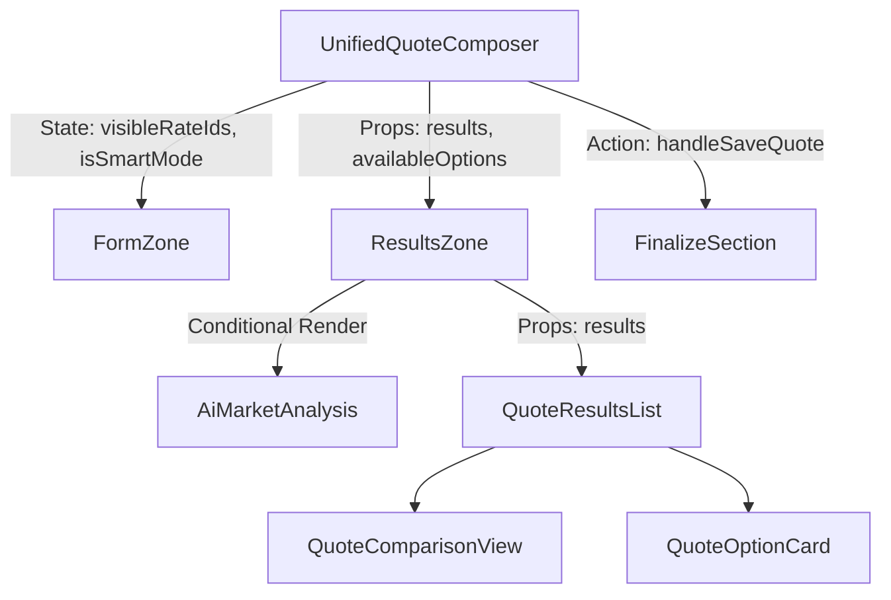

# Rate Visibility & Smart Quote Mode Architecture

## 1. Overview
This document details the architecture and logic governing rate visibility in the Unified Quote Composer, specifically addressing the requirements for "Smart Quote Mode" and the strict separation of "Visible/Selected" options vs. "Available/Hidden" options.

## 2. Problem Statement & Resolution
**Problem**: Previously, market rates fetched from the API were automatically displayed in the "Rate Options" list, cluttering the view and bypassing the "Smart Quote" workflow which requires a clean slate with only AI analysis initially visible.
**Resolution**: Implemented a strict visibility control mechanism using `visibleRateIds`. Fetched rates are now decoupled from displayed rates.

## 3. Component Hierarchy & Responsibilities



### Key Components:
*   **UnifiedQuoteComposer**: The "Brain". Manages strict state for `visibleRateIds`. It filters raw API results into `combinedResults` (visible) and `availableOptions` (hidden).
*   **ResultsZone**: The "View". It receives two distinct lists:
    *   `results`: The list of *selected/visible* options (Standard options + Manual options).
    *   `availableOptions`: The list of *hidden* market rates available for selection.
    *   **Logic**: It conditionally renders the "Rate Options" section only if `hasResults` is true. In Smart Mode, this is initially false.
*   **AiMarketAnalysis**: A standalone component for displaying AI insights, always visible in Smart Mode if data exists.

## 4. State Management & Data Flow

### 4.1. State Variables
*   `rateFetching.results`: Raw array of all rates returned by the backend.
*   `visibleRateIds`: `string[]`. The source of truth for what is "selected".
*   `isSmartMode`: `boolean`. Determines initial behavior.

### 4.2. Data Transformation Pipeline
1.  **Fetch**: `useRateFetching` gets rates from API.
2.  **Filter (The Core Logic)**:
    ```typescript
    const combinedResults = useMemo(() => {
      // 1. Get raw
      const fetched = rateFetching.results || [];
      // 2. Filter by Visibility State
      const visibleFetched = fetched.filter(opt => visibleRateIds.includes(opt.id));
      // 3. Add Manual
      const all = [...visibleFetched, ...manualOptions];
      // 4. Return Visible Set
      return all;
    }, [...]);
    ```
3.  **Available Set**:
    ```typescript
    const availableOptions = useMemo(() => {
      // Items NOT in visibleRateIds
      return fetched.filter(opt => !visibleRateIds.includes(opt.id));
    }, [...]);
    ```

### 4.3. Smart Mode Behavior
*   **Activation**: Triggered via `handleGetRates(..., smart=true)`.
*   **Initialization**: 
    *   `isSmartMode` set to `true`.
    *   `visibleRateIds` set to `[]` (Empty).
*   **Result**: 
    *   `combinedResults` is empty.
    *   `ResultsZone` hides "Rate Options" section.
    *   `AiMarketAnalysis` is shown.
    *   "Available Market Rates" list is shown.

### 4.4. Standard Mode Behavior
*   **Initialization**:
    *   `isSmartMode` set to `false`.
    *   `visibleRateIds` set to `[results[0].id]` (Default to first option).
*   **Result**:
    *   `combinedResults` has 1 item.
    *   `ResultsZone` shows "Rate Options" section.

## 5. Persistence (Saving Quotes)
The `save_quote_atomic` RPC payload is constructed by iterating ONLY over `displayResults` (which is derived from `combinedResults`).
*   **Implication**: Options that are in "Available Market Rates" (hidden) are **NEVER** included in the save payload.
*   **Integrity**: This ensures that what the user *sees* as selected is exactly what gets *saved*.

## 6. Regression & Safety
*   **Backward Compatibility**: Existing quotes load as "Manual Options", which bypass the `visibleRateIds` filter (they are added to `combinedResults` directly), preserving their visibility.
*   **Test Coverage**: 
    *   `SmartMode.test.tsx`: Verifies Smart Mode empty state.
    *   `UnifiedQuoteComposer.test.tsx`: Verifies Standard Mode default selection.
    *   `ResultsZone.test.tsx`: Verifies rendering logic.
