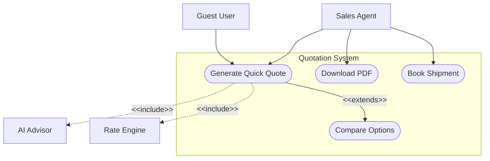
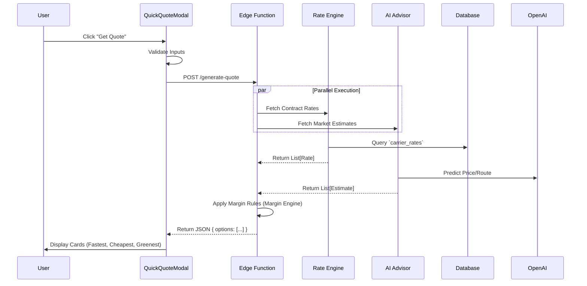
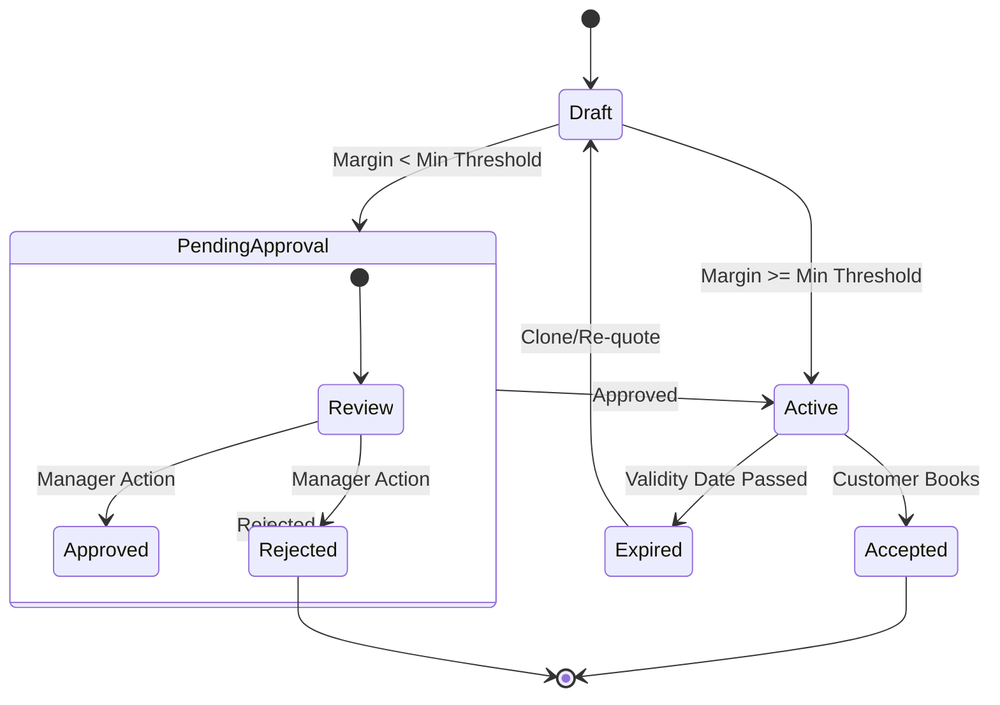

# Master Technical Design Document v9.0.0
## Quotation Management System (Universal Logistics Operating System)

**Version**: 9.0.0
**Date**: 2026-01-22
**Status**: Draft / In-Review
**Author**: Logic Nexus AI Team

---

## Executive Summary
This document serves as the authoritative Master Technical Design Document for the Quotation Management System within the Universal Logistics Operating System (ULOS). It consolidates all requirements, architectural decisions, and implementation details from previous versions (v1.0.0 - v8.0.0) into a single, comprehensive industry-standard specification.

The system is designed to provide instant, AI-optimized, multi-modal logistics quotations (Air, Sea, Land, Rail, Courier) with enterprise-grade features such as Multi-Tenant Isolation, RBAC, and Audit Trails.

---

## Table of Contents
1.  [Detailed Use Case Analysis](#1-detailed-use-case-analysis)
2.  [System Design Specification](#2-system-design-specification)
3.  [Schema Design Enhancement](#3-schema-design-enhancement)
4.  [Functionality Upgrade Research](#4-functionality-upgrade-research)
5.  [UI/UX Design](#5-uiux-design)
6.  [Field-Level Specifications](#6-field-level-specifications)
7.  [Document Management](#7-document-management)
8.  [Appendices](#8-appendices)

---

## 1. Detailed Use Case Analysis

### 1.1. Use Case Catalog
The following use cases define the core interactions for the Quotation Module.

#### UC-001: Generate Standard Quick Quote
*   **Description**: A Sales Agent or Guest User requests a quick estimate for a shipment.
*   **Actors**: Sales Agent, Guest User, System (AI Advisor, Rate Engine).
*   **Preconditions**: User has access to the Quick Quote Modal; Internet connection active.
*   **Trigger**: User clicks "New Quote" button.
*   **Main Success Scenario**:
    1.  User selects "Origin" (e.g., Shanghai) and "Destination" (e.g., Los Angeles).
    2.  User selects Transport Mode (e.g., Sea) and Cargo Details (e.g., 1x 20ft Container).
    3.  User clicks "Get Quote".
    4.  System validates inputs (Origin != Dest, Date >= Today).
    5.  System queries **Rate Engine** (Contract Rates) and **AI Advisor** (Market Estimates) in parallel.
    6.  System aggregates results and applies Tenant Margin Rules.
    7.  System displays 3 options: "Fastest", "Cheapest", "Greenest".
    8.  User views details and clicks "Save Draft".
*   **Alternative Paths**:
    *   *A1: Invalid Port*: System displays "Port not found" error.
    *   *A2: No Rates Found*: System displays "Request Spot Rate" button (Manual Process).
    *   *A3: AI Timeout*: System returns only Contract Rates with "AI Unavailable" warning.
*   **Postconditions**: A new `quotation` record is created in `Draft` status.

#### UC-002: Multi-Leg Route Optimization (Smart Quote)
*   **Description**: System automatically suggests multi-leg routes (e.g., Truck -> Rail -> Sea) for complex shipments.
*   **Actors**: AI Advisor, Routing Engine.
*   **Main Success Scenario**:
    1.  User requests quote for Inland China to Inland USA.
    2.  AI Advisor identifies lack of direct sea port.
    3.  System constructs 3 segments:
        *   Leg 1: Truck (Factory -> Port).
        *   Leg 2: Sea (Port -> Port).
        *   Leg 3: Rail (Port -> Destination).
    4.  System calculates total transit time and cost.
    5.  System presents "Door-to-Door" option.

### 1.2. UML Use Case Diagram


---

## 2. System Design Specification

### 2.1. Architectural Overview
The system follows a **Micro-Kernel Architecture** with a core orchestrator and pluggable vertical adaptors.

#### Component Diagram
```mermaid
graph TD
    Client[Web Client (React)] -->|HTTPS| Edge[Supabase Edge Functions]
    
    subgraph "Core Services"
        Edge -->|Invoke| RE[Rate Engine]
        Edge -->|Invoke| AI[AI Advisor]
        Edge -->|Invoke| ME[Margin Engine]
    end
    
    subgraph "Data Layer"
        RE -->|Read| DB[(Postgres DB)]
        ME -->|Read| DB
        AI -->|Cache| Redis[(Redis Cache)]
    end
    
    subgraph "External Integrations"
        AI -->|API| OpenAI[OpenAI GPT-4o]
        RE -->|API| Maersk[Maersk API]
        RE -->|API| Freightos[Freightos API]
    end
```

### 2.2. Critical Workflows

#### Sequence Diagram: Quote Generation (Standard Flow)


### 2.3. State Machine (Quote Lifecycle)


### 2.4. Service Level Agreements (SLAs)
*   **Response Time**: API response < 2.0s for 95% of requests.
*   **Availability**: 99.9% Uptime during business hours.
*   **Data Freshness**: Spot rates updated every 4 hours; Contract rates real-time.

---

## 3. Schema Design Enhancement

### 3.1. Current Schema Analysis
*   **`quote_options`**: Stores line items.
    *   *Limitation*: `margin_value` is a simple numeric column; lacks history of *how* the margin was calculated (e.g., "5% base + 2% hazmat").
*   **`margin_profiles`**: Stores default rules.
    *   *Limitation*: No support for "Commodity-specific" or "Route-specific" margins.
*   **Performance**: `quote_audit_logs` is growing rapidly and impacting query performance.

### 3.2. Proposed Schema Upgrades
1.  **Partitioning**: Partition `quote_audit_logs` by `created_at` (Year/Month) to improve archival and query speed.
2.  **Dynamic Attributes**: Add `jsonb` column `dynamic_attributes` to `quotation_version_options` for carrier-specific fields (e.g., "Maersk Spot ID", "Voyage Number").
3.  **Advanced Margins**: Introduce `margin_rules` table for granular logic.

#### New Table: `margin_rules`
```sql
CREATE TABLE margin_rules (
  id uuid PRIMARY KEY,
  tenant_id uuid REFERENCES tenants(id),
  name text, -- e.g. "Hazmat Surcharge"
  condition_json jsonb, -- e.g. { "cargo_type": "hazardous" }
  adjustment_type text, -- 'percent', 'fixed'
  adjustment_value numeric,
  priority int
);
```

### 3.3. Migration Plan
1.  **Preparation**: Create new tables (`margin_rules`) and verify RLS policies.
2.  **Dual-Write**: Update `RateEngine` to read from both `margin_profiles` (legacy) and `margin_rules` (new), preferring new if matches found.
3.  **Backfill**: Script to convert existing `margin_profiles` into `margin_rules` with default priority.
4.  **Cutover**: Deprecate `margin_profiles` usage in code.
5.  **Cleanup**: Drop `margin_profiles` table (after 30 days).

---

## 4. Functionality Upgrade Research

### 4.1. Competitive Analysis
| Feature | SOS Logistics Pro | Freightos | Magaya | Salesforce |
| :--- | :--- | :--- | :--- | :--- |
| **Instant Quoting** | ✅ < 2s Response | ✅ < 5s | ⚠️ Slower | ❌ Custom Dev |
| **AI Suggestions** | ✅ GPT-4o Native | ❌ Rule-based | ❌ None | ✅ Einstein (Add-on) |
| **LSI Adaptors** | ✅ Rail/Move/Courier | ⚠️ Freight Only | ✅ Strong | ❌ None |
| **Cost** | 💲 Low/Usage-based | 💲💲 High | 💲💲 High | 💲💲💲 Very High |

### 4.2. Gap Analysis
*   **Gap 1**: No direct integration with "Maersk Spot" API (currently manual/file upload).
    *   *Impact*: High manual effort for booking.
*   **Gap 2**: Lack of "Carbon Offset" purchase flow.
    *   *Impact*: Missed revenue opportunity in ESG-conscious market.

### 4.3. Cost-Benefit Analysis
*   **Enhancement**: AI Advisor Integration.
    *   *Cost*: ~$0.03 per quote (OpenAI API tokens).
    *   *Benefit*: Reduces manual data entry by 40% (Save 5 mins/quote = $2.50 labor savings).
    *   *ROI*: ~80x return per quote.

---

## 5. UI/UX Design

### 5.1. User Journey Maps
**Persona: Sarah (Sales Agent)**
1.  **Trigger**: Receives email request from client.
2.  **Action**: Opens "Quick Quote" modal.
3.  **Interaction**: Types "Shanghai", selects "Sea". AI suggests "HS Code 8517.62".
4.  **Decision**: Sees 3 options. Selects "Greenest" (Client preference).
5.  **Refinement**: Adds 15% margin manually.
6.  **Outcome**: Generates PDF and emails client.

### 5.2. Wireframe Specifications
**Screen: Quick Quote Modal**
*   **Header**: Title "New Quote", Customer Search (Combobox), "Smart Mode" Toggle.
*   **Left Panel (Inputs)**:
    *   Origin/Destination (Google Places Autocomplete).
    *   Date Picker (Valid From/To).
    *   Cargo Details (Repeater: Qty, Type, Weight, Dims).
*   **Right Panel (Results)**:
    *   **AI Insights Card**: "Market Trend: Rates rising +5% next week."
    *   **Live Rates List**:
        *   Card 1: "Fastest" (Air) - $5,200 - 3 Days.
        *   Card 2: "Cheapest" (Sea) - $1,200 - 25 Days.
*   **Footer**: "Save Draft", "Generate PDF", "Book Now" (Primary).

### 5.3. Responsive Design Requirements
*   **Desktop (>1024px)**: 2-column layout (Inputs Left, Results Right).
*   **Tablet (768px - 1024px)**: 1-column layout. Results stack below Inputs.
*   **Mobile (<768px)**:
    *   Full-screen modal.
    *   Step-by-step wizard (Step 1: Route, Step 2: Cargo, Step 3: Results).
    *   Sticky footer for primary actions.

### 5.4. Accessibility (WCAG 2.1 AA)
*   **Color Contrast**: Text > 4.5:1.
*   **Screen Readers**: All inputs have `aria-label`. Dynamic content updates use `aria-live="polite"`.
*   **Keyboard**: Full tab navigation support without mouse.

---

## 6. Field-Level Specifications

### 6.1. Table: `quotation_version_options`
| Field Name | Data Type | Constraints | Validation Rule | Security |
| :--- | :--- | :--- | :--- | :--- |
| `id` | UUID | PK | Unique | Read-Only |
| `buy_subtotal` | Numeric | NOT NULL | >= 0 | Tenant-Admin Only |
| `margin_value` | Numeric | NOT NULL | >= 0 | Tenant-Admin Only |
| `sell_total` | Numeric | NOT NULL | = Buy + Margin | Public (Quote View) |
| `transit_days` | Integer | NULLABLE | > 0 | Public |
| `valid_until` | Date | NOT NULL | >= Today | Public |
| `currency_id` | UUID | FK | Exists in `currencies` | Public |

### 6.2. Table: `margin_rules`
| Field Name | Data Type | Constraints | Validation Rule |
| :--- | :--- | :--- | :--- |
| `tenant_id` | UUID | FK | Valid Tenant |
| `priority` | Integer | DEFAULT 0 | Unique per Tenant |
| `condition_json`| JSONB | Valid JSON | Schema Validation |

---

## 7. Document Management

### 7.1. Version History
| Version | Date | Author | Changes |
| :--- | :--- | :--- | :--- |
| **v9.0.0** | 2026-01-22 | Logic Nexus AI | Master Technical Design Document (Current). Consolidated all previous guides. Added UML, detailed schemas, and benchmarks. |
| **v8.0.0** | 2025-12-15 | Logic Nexus AI | Added detailed Use Cases and Schema Enhancements. |
| **v6.1.0** | 2025-11-20 | Logic Nexus AI | Merged deep specs (RBAC, RTM) with master structure. |
| **v1.0.0** | 2025-01-01 | Logic Nexus AI | Initial Phase 1 Requirements. |

### 7.2. Traceability Matrix
| Req ID | Description | Component | Test Case | Status |
| :--- | :--- | :--- | :--- | :--- |
| **BR-01** | Quick Quote Generation | `QuickQuoteModal` | `TC-QQ-001` | ✅ Implemented |
| **BR-02** | AI Smart Analysis | `ai-advisor` | `TC-AI-002` | ✅ Implemented |
| **BR-03** | Multi-Modal Support | `RateEngine` | `TC-RE-003` | ⚠️ In Progress |
| **BR-04** | Tenant Margin Logic | `MarginEngine` | `TC-ME-004` | ⚠️ Pending |

### 7.3. Risk Assessment
| Risk ID | Risk Description | Likelihood | Impact | Mitigation Strategy |
| :--- | :--- | :--- | :--- | :--- |
| **R-01** | OpenAI API Latency > 5s | Medium | High | Implement parallel fetching; fallback to Standard Rates if AI times out. |
| **R-02** | Invalid "Maersk Spot" Credentials | Low | Medium | Automated health check every 1 hour; Alert admins. |
| **R-03** | Schema Migration Data Loss | Low | Critical | Backup before migration; Dual-write strategy. |

### 7.4. Testing Strategy
*   **Unit Testing**: Jest/Vitest for all utility functions (Margin calc, Date parsing). Coverage > 80%.
*   **Integration Testing**: Test `ai-advisor` Edge Function with mock OpenAI responses.
*   **E2E Testing**: Cypress/Playwright flows for "Create Quote" -> "Save" -> "Book".
*   **Performance Testing**: k6 load test on `RateEngine` (Target: 100 RPS).

### 7.5. Rollback Plan
*   **Database**: All migrations include `down.sql`. Daily backups enabled.
*   **Code**: Feature Flags (`VITE_ENABLE_AI_V2`) allow instant revert to legacy logic.
*   **Infrastructure**: Supabase CLI allows rollback to previous Edge Function deployment version.
