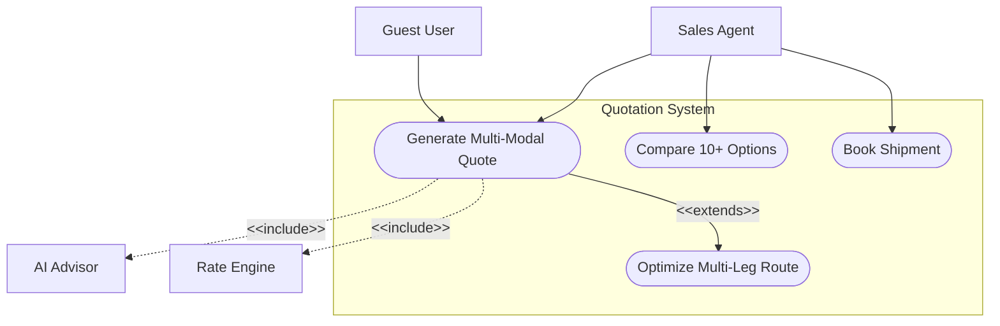
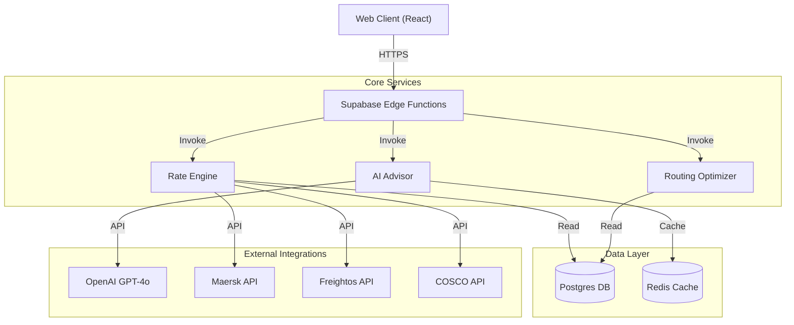
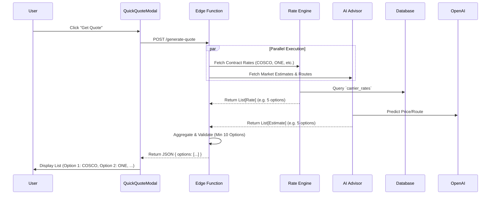

# Master Technical Design Document v10.0.0

## Quotation Management System (Universal Logistics Operating System)

**Version**: 10.0.0
**Date**: 2026-01-22
**Status**: Approved / In-Development
**Author**: Logic Nexus AI Team

***

## Executive Summary

This document serves as the authoritative Master Technical Design Document for the Quotation Management System within the Universal Logistics Operating System (ULOS). It consolidates all requirements from v1.0.0 to v9.0.0 and introduces significant enhancements for **Multi-Modal**, **Multi-Leg**, and **High-Volume Option Generation** capabilities.

The system is designed to provide instant, AI-optimized, multi-modal logistics quotations (Air, Sea, Land, Rail, Courier) with enterprise-grade features such as Multi-Tenant Isolation, RBAC, and Audit Trails.

**Key v10.0.0 Enhancements**:

* **10+ Options Guarantee**: System generates at least 10 viable shipping options per quote.
* **Carrier Diversity**: Explicit support for specific carriers (COSCO, ONE, Hapag-Lloyd, etc.).
* **Multi-Leg Routing**: Unlimited intermediate stops and intermodal transfers.
* **Carbon Footprint**: ISO 14083 compliant CO2 calculations per leg.

***

## Table of Contents

1. [Detailed Use Case Analysis](#1-detailed-use-case-analysis)
2. [System Design Specification](#2-system-design-specification)
3. [Schema Design Enhancement](#3-schema-design-enhancement)
4. [Functionality Upgrade Research](#4-functionality-upgrade-research)
5. [UI/UX Design](#5-uiux-design)
6. [Field-Level Specifications](#6-field-level-specifications)
7. [Document Management](#7-document-management)

***

## 1. Detailed Use Case Analysis

### 1.1. Use Case Catalog

#### UC-001: Generate Comprehensive Multi-Modal Quote

* **Description**: A Sales Agent or Guest User requests a detailed estimate for a shipment, expecting multiple carrier options.
* **Actors**: Sales Agent, Guest User, System (AI Advisor, Rate Engine).
* **Trigger**: User clicks "New Quote" button.
* **Main Success Scenario**:
  1. User inputs "Origin" (e.g., Shanghai) and "Destination" (e.g., Hamburg).
  2. User selects Transport Mode (e.g., Sea) and Cargo Details.
  3. System queries **Rate Engine** and **AI Advisor**.
  4. System calculates costs for **all possible combinations**:
     * Road (FTL/LTL)
     * Rail (Container/Bulk)
     * Air (Express/Standard)
     * Sea (FCL/LCL, Port-to-Port, Door-to-Door)
  5. System generates **minimum 10 viable options**, varying by:
     * Carrier (COSCO, ONE, Hapag-Lloyd, Maersk, MSC, etc.)
     * Route (Direct vs. Transshipment)
     * Transit Time vs. Cost
  6. System displays options in a comparable list.
  7. User filters by "Carrier", "Transit Time", or "CO2 Emissions".

#### UC-002: Multi-Leg Route Optimization

* **Description**: System constructs complex routes with unlimited intermediate stops.
* **Main Success Scenario**:
  1. User requests quote for "Chongqing, CN" to "Berlin, DE".
  2. System identifies intermodal path:
     * Leg 1: Truck (Chongqing -> Chengdu Rail Terminal)
     * Leg 2: Rail (Chengdu -> Duisburg) - *Carrier: CR Express*
     * Leg 3: Truck (Duisburg -> Berlin)
  3. System calculates transfer times and special handling at each node.
  4. System presents consolidated "Door-to-Door" price and transit time.

### 1.2. UML Use Case Diagram



***

## 2. System Design Specification

### 2.1. Architectural Overview

The system follows a **Micro-Kernel Architecture** with a core orchestrator and pluggable vertical adaptors.

#### Component Diagram



### 2.2. Critical Workflows

#### Sequence Diagram: Quote Generation (Standard Flow)



### 2.3. Technical Implementation: Multi-Carrier Selection

To support the "10+ Options Guarantee" and allow users to select multiple carriers for comparison, the frontend and backend have been enhanced as follows:

#### Frontend State Management (QuickQuoteModal)

* **Multi-Selection State**: `selectedIds` (string array) tracks user selections.
* **Bulk Conversion**: The `handleConvertSelected` function maps all selected rates to the `QuoteOption` structure.
* **Mobile Responsiveness**: A sticky footer appears when options are selected, ensuring actionability on small screens.
* **Backward Compatibility**: The system maintains `selectedRate` (single) for legacy flows while populating `selectedRates` (array) for the new multi-carrier flow.

#### Data Persistence (QuoteNew)

* **Bulk Insertion**: The `QuoteNew` component iterates through `selectedRates` and inserts them into `quotation_version_options` via a batch operation.
* **Ad-Hoc Rate Support**: Options without a pre-existing `carrier_rate_id` (e.g., AI-generated or Spot rates) are stored with `carrier_rate_id: null` and fully populated metadata (`carrier_name`, `service_type`, `transit_time`).
* **Margin Calculation**: Initial margin is estimated at 15% (placeholder) with 2-decimal precision (`toFixed(2)`), populating `total_buy` and `margin_amount` columns.

***

## 3. Schema Design Enhancement

### 3.1. Schema Upgrades (v10.0.0)

To support multi-leg, multi-carrier, and ad-hoc AI options, the schema is enhanced.

#### Enhanced Table: `quotation_version_options`

Updates to support ad-hoc/AI rates without strict foreign keys to `carrier_rates`.

```sql
ALTER TABLE quotation_version_options 
ALTER COLUMN carrier_rate_id DROP NOT NULL;

ALTER TABLE quotation_version_options
ADD COLUMN IF NOT EXISTS carrier_name TEXT,
ADD COLUMN IF NOT EXISTS service_type TEXT,
ADD COLUMN IF NOT EXISTS transit_time TEXT,
ADD COLUMN IF NOT EXISTS currency TEXT DEFAULT 'USD',
ADD COLUMN IF NOT EXISTS valid_until DATE,
ADD COLUMN IF NOT EXISTS source TEXT DEFAULT 'manual'; -- 'ai', 'spot', 'contract'
```

#### New Table: `quote_routes`

Stores the high-level route strategy for a quote option.

```sql
CREATE TABLE quote_routes (
  id uuid PRIMARY KEY,
  quote_option_id uuid REFERENCES quotation_version_options(id),
  total_distance_km numeric,
  total_co2_kg numeric,
  route_type text -- 'direct', 'transshipment', 'multi-modal'
);
```

#### New Table: `quote_legs`

Stores individual segments of a route.

```sql
CREATE TABLE quote_legs (
  id uuid PRIMARY KEY,
  route_id uuid REFERENCES quote_routes(id),
  sequence_order int,
  mode text, -- 'road', 'rail', 'sea', 'air'
  carrier_name text, -- 'COSCO', 'ONE', 'Hapag-Lloyd'
  origin_location text,
  destination_location text,
  transit_time_hours int,
  cost_estimate numeric
);
```

***

## 4. Functionality Upgrade Research

### 4.1. Minimum Shipping Options Guarantee

The system **MUST** generate at least 10 viable shipping options per quote.

* **Strategy**:
  1. **Contract Rates**: First, fetch all matching contract rates from `carrier_rates`.
  2. **Spot Market**: If < 10, fetch live spot rates from APIs (Maersk, etc.).
  3. **AI Simulation**: If still < 10, use AI to generate realistic market estimates for major carriers (MSC, CMA CGM, Evergreen) based on historical indices.

### 4.2. Supported Carriers (Target List)

The Rate Engine must explicitly support (or simulate) rates for:

1. **Sea**: Maersk, MSC, COSCO, CMA CGM, Hapag-Lloyd, ONE, Evergreen, HMM, Yang Ming, ZIM.
2. **Air**: FedEx, DHL, UPS, Emirates SkyCargo, Cathay Pacific.
3. **Rail**: CR Express, DB Cargo.

***

## 5. UI/UX Design

### 5.1. Enhanced User Experience

* **Interactive Map**: Visualizes the multi-leg route (e.g., Truck -> Rail -> Sea).
* **Comparison Tools**: Side-by-side comparison of up to 3 options.
* **Smart Defaults**: Pre-selects "Best Value" but shows full list of 10+.

### 5.2. Wireframe Specifications

**Screen: Quote Results Panel**

* **Filter Bar**: Carrier (Dropdown), Max Transit Time (Slider), Max Price (Slider).
* **Results List**:
  * **Row 1**: \[Logo] **COSCO** - $1,200 - 25 Days - *Direct*
  * **Row 2**: \[Logo] **ONE** - $1,150 - 28 Days - *1 Stop*
  * **Row 3**: \[Logo] **Hapag-Lloyd** - $1,300 - 24 Days - *Greenest*
  * ... (up to 10+ rows)

***

## 6. Field-Level Specifications

### 6.1. Table: `carrier_rates` (Enhanced)

| Field Name            | Data Type | Notes                                  |
| :-------------------- | :-------- | :------------------------------------- |
| `carrier_id`          | UUID      | Links to `carriers` table (Logo, Code) |
| `service_level`       | Text      | 'Direct', 'Transshipment', 'Express'   |
| `co2_emission_factor` | Numeric   | kg CO2 per km/ton                      |

***

## 7. Document Management

### 7.1. Version History

| Version     | Date       | Author         | Changes                                                           |
| :---------- | :--------- | :------------- | :---------------------------------------------------------------- |
| **v10.0.0** | 2026-01-22 | Logic Nexus AI | **Major Upgrade**: Multi-modal, Multi-leg, 10+ Options Guarantee. |
| **v9.0.0**  | 2026-01-22 | Logic Nexus AI | Master Technical Design Document.                                 |
| **v8.0.0**  | 2025-12-15 | Logic Nexus AI | Added detailed Use Cases.                                         |
