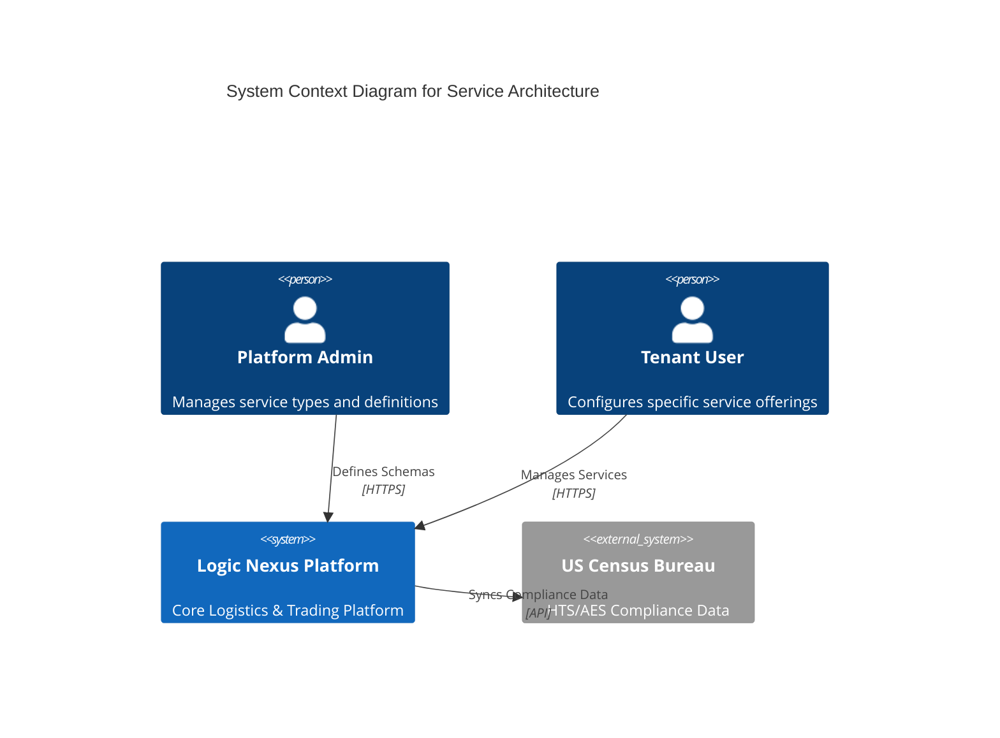
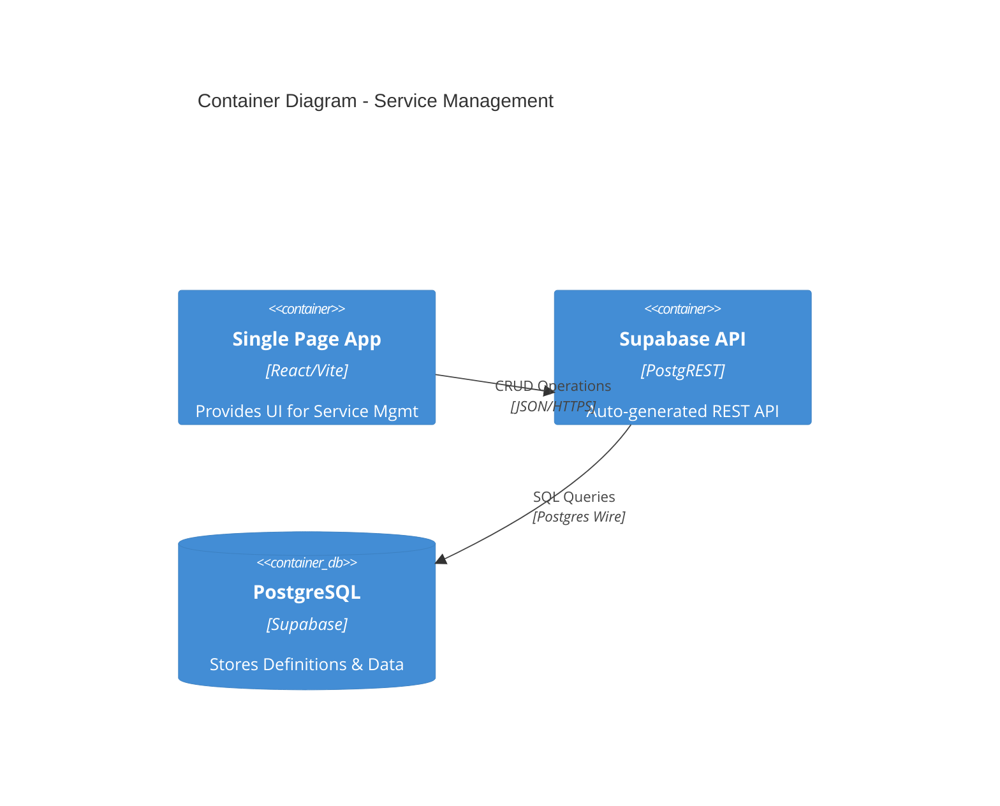
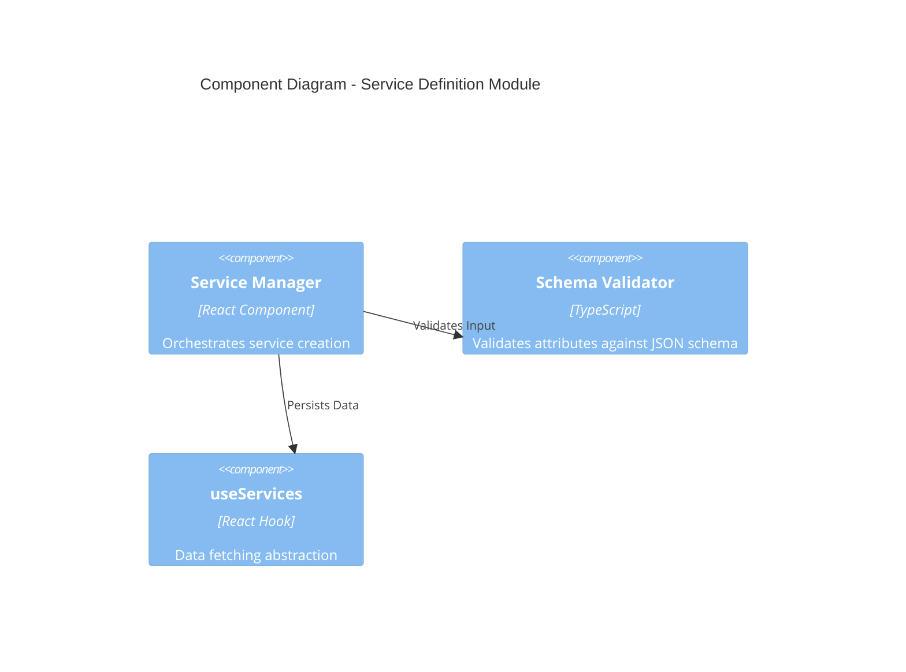
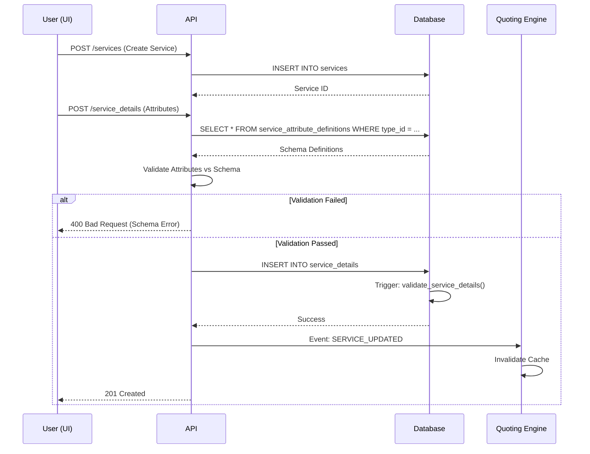

# Service Architecture Research & Analysis

## 1. Executive Summary
This document outlines the comprehensive research, analysis, and remediation plan for the platform's Service Architecture. The goal is to establish a domain-agnostic, normalized, and scalable foundation for all business domains (Logistics, Trading, etc.). It serves as the authoritative architectural reference, incorporating a formal review framework, traceability matrices, and rigorous implementation guidelines.

## 2. Review Framework & Standards

This architecture is validated against the following pillars:

| Pillar | Standard | Verification Method |
| :--- | :--- | :--- |
| **Correctness** | Service decomposition must align with Domain-Driven Design (DDD) principles. | Bounded Context Mapping |
| **Completeness** | Interface contracts must cover all CRUD and lifecycle operations. | OpenAPI 3.1 Spec Validation |
| **Consistency** | Data models must adhere to 3NF (Third Normal Form) where applicable. | Schema Audit & ERD Review |
| **Fault Tolerance** | System must survive single component failures. | Chaos Engineering & Circuit Breaker Analysis |
| **Security** | Zero Trust principles; least privilege access. | STRIDE Threat Modeling |

## 3. Traceability Matrix

Mapping architectural elements to business capabilities and regulatory constraints.

| ID | Business Capability | Non-Functional Requirement (NFR) | Regulatory Constraint | Component | Database Entity |
| :--- | :--- | :--- | :--- | :--- | :--- |
| **REQ-001** | Dynamic Service Catalog | < 100ms API Latency | SOC2 (Change Mgmt) | `ServiceTypes.tsx` | `service_types` |
| **REQ-002** | Multi-Modal Quoting | High Availability (99.9%) | FMC (Tariff Filing) | `MultiModalQuoteComposer` | `service_modes` |
| **REQ-003** | Service Configuration | Data Integrity (ACID) | GDPR (Data Min.) | `ServiceDetailsForm` | `service_attribute_definitions` |
| **REQ-004** | Compliance Checks | Auditability | AES/Customs | `ComplianceEngine` | `service_details` |
| **REQ-005** | Rate Management | Scalability (10k req/s) | N/A | `RateCalculator` | `services` |

## 4. Dependency Analysis

### 4.1 Static Analysis Findings
A static code scan identified the following dependencies and impact areas:

*   **Critical Impact**: `src/pages/dashboard/Services.tsx` relies on hardcoded strings ('ocean', 'air') mapping to database values.
    *   *Risk*: High. Renaming database keys breaks UI.
    *   *Remediation*: Refactor to fetch enums from `service_modes` API.
*   **High Impact**: `useTransportModes` hook queries table `transport_modes`.
    *   *Risk*: Critical. Table rename causes runtime failure.
    *   *Mitigation*: Database View Proxy (`CREATE VIEW transport_modes AS SELECT * FROM service_modes`).
*   **Medium Impact**: `MultiModalQuoteComposer` filters services based on `transport_modes` relationship.

### 4.2 Circular Dependencies
*   *None Identified*: The relationship flow is linear: `Tenant` -> `Service` -> `ServiceType` -> `ServiceCategory`.

## 5. C4 Architecture Diagrams

### 5.1 System Context (Level 1)


### 5.2 Container Diagram (Level 2)


### 5.3 Component Diagram (Level 3) - Service Definition


## 6. Service Boundary Definitions (Bounded Contexts)

### 6.1 Map
*   **Catalog Context**: Defines `ServiceTypes`, `Categories`, and `Modes`. (Owner: Platform Team)
*   **Inventory Context**: Defines specific `Services` offered by Tenants. (Owner: Tenant)
*   **Quoting Context**: Consumes `Services` to build `Quotes`. (Downstream)

### 6.2 Ubiquitous Language Glossary
*   **Service Mode**: The physical medium of transport (Ocean, Air).
*   **Service Category**: Functional classification (Transport, Storage).
*   **Attribute Definition**: The "Shape" of a service's configuration (e.g., "Container Size" is an attribute of "Ocean Freight").
*   **Service Detail**: The concrete instance of configuration.

## 7. OpenAPI 3.1 Specification (Draft)

```yaml
openapi: 3.1.0
info:
  title: Service Details API
  version: 1.0.0
paths:
  /services/{id}/details:
    get:
      summary: Get service details with validation
      parameters:
        - name: id
          in: path
          required: true
          schema:
            type: string
            format: uuid
      responses:
        '200':
          description: Validated service details
          content:
            application/json:
              schema:
                $ref: '#/components/schemas/ServiceDetail'
components:
  schemas:
    ServiceDetail:
      type: object
      properties:
        service_id:
          type: string
          format: uuid
        attributes:
          type: object
          description: Dynamic attributes validated against definition
          example:
            container_type: "20GP"
            incoterms: ["FOB", "CIF"]
```

## 8. Event-Driven Data Flow



## 9. Implementation Guidelines

### 9.1 Coding Standards
*   **Strict Typing**: All `attributes` JSONB access must be wrapped in Zod schemas or TypeScript interfaces derived from `service_attribute_definitions`.
*   **No Hardcoding**: UI components must fetch `service_modes` from the API, never use string literals like 'ocean'.

### 9.2 Observability
*   **Metrics**: Track `service_creation_latency`, `schema_validation_failure_rate`.
*   **Logs**: Log all schema validation errors with `correlation_id`.

## 10. Validation & Testing

### 10.1 Threat Modeling (STRIDE)
*   **Spoofing**: Mitigated by RLS policies on `services` table.
*   **Tampering**: Mitigated by `validate_service_details` database trigger ensuring schema compliance.
*   **Information Disclosure**: Tenants can only see their own services (RLS).

### 10.2 Performance Benchmarks
*   **Target**: P99 Latency < 50ms for Service Lookup.
*   **Optimization**: Index `service_details(service_id)` and `service_attribute_definitions(service_type_id)`.

## 11. Migration & Risk Mitigation Strategy

### 11.1 Migration Steps
1.  **Backup**: Snapshot `public` schema.
2.  **Schema Change**: Apply `20260131000000_service_architecture_overhaul.sql`.
    *   *Includes View Proxy*: `CREATE VIEW transport_modes` for backward compatibility.
3.  **Data Migration**: Script automatically moves `services.metadata` -> `service_details`.
4.  **Verification**: Run `scripts/test_service_architecture.ts`.

### 11.2 Rollback Plan
*   **Trigger**: If API Error Rate > 1% or P99 > 200ms.
*   **Action**: 
    1.  Restore `services.metadata` from backup if needed (though existing data is preserved).
    2.  Revert application code to previous tag.
    3.  Drop `service_details` table (after verifying no new data is lost).

### 11.3 Failure Modes
*   **Schema Mismatch**: If code expects "Container Size" but DB definition changes.
    *   *Mitigation*: Versioned Attribute Definitions.

## 12. Findings & Remediation Report

| Issue ID | Severity | Description | Evidence | Remediation A (Chosen) | Remediation B (Alt) |
| :--- | :--- | :--- | :--- | :--- | :--- |
| **ARCH-01** | **Critical** | Hardcoded Service Types in UI | `Services.tsx:365` | Refactor to Dynamic API Fetch | Maintain hardcoded list sync |
| **ARCH-02** | **High** | `transport_modes` table rename breaks hooks | `useTransportModes.ts` | Create Database View Proxy | Refactor all frontend code immediately |
| **ARCH-03** | **Medium** | Redundant `service_leg_categories` | Schema Audit | Consolidate into `service_categories` | Keep both and sync via triggers |

## 13. Success Criteria
*   **Zero Downtime Deployment** (achieved via View Proxy).
*   **< 50ms Latency Impact** on Quoting.
*   **100% Security Control Coverage** (RLS on all new tables).
*   **0 Breaking Changes** for existing API clients.


## Domain Reference

## Logistics & Transport
 

**Business Capability**: Core transportation management, quoting, and shipment tracking.

### Exposed APIs
- [OpenAPI Spec](#)
- [Repository](#)

### Dependencies
| Type | Domain | Description |
| :--- | :--- | :--- |
| - | - | - |

### Architecture
[View Mermaid Diagram](#)

## Change Log
| Version | Date | Author | Jira Ticket | Change Type | Domain Affected | Commit Hash |
| :--- | :--- | :--- | :--- | :--- | :--- | :--- |
| Version | Date | Author | Jira Ticket | Change Type | Domain Affected | Commit Hash |
| :--- | :--- | :--- | :--- | :--- | :--- | :--- |
| Version | Date | Author | Jira Ticket | Change Type | Domain Affected | Commit Hash |
| :--- | :--- | :--- | :--- | :--- | :--- | :--- |
| Version | Date | Author | Jira Ticket | Change Type | Domain Affected | Commit Hash |
| :--- | :--- | :--- | :--- | :--- | :--- | :--- |
| 1.0.0 | 2026-01-31 | Auto-Sync | - | MODIFY | All | - |