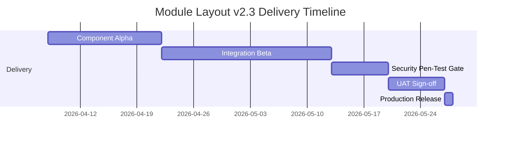

# Phase 4 – Recommendation & Implementation Plan

Duration target: 3 working days  
Status: Completed (execution plan package)

## 4.1 Decision Record
- Accepted ADR:
  - [ADR-0001_MODULE_LAYOUT_V23.md](file:///Users/vims/Downloads/Development%20Projects/Trae/SOS%20Logistics%20Pro/logic-nexus-ai/docs/module-layout-v2.3/adr/ADR-0001_MODULE_LAYOUT_V23.md)

## 4.2 Granular Task Breakdown
Ticket inventories:
- Front-end:
  - Event stream panel component
  - CRUD timeline panel + action callbacks
  - Viewport checklist banner + state engine
  - hooks/services integration and tests
- Back-end:
  - event endpoint contract and persistence path
  - websocket broadcast channel
  - audit log table migration + retention policy
- DevOps:
  - docker cache layer for static assets
  - CDN cache behavior rules for Storybook and app shell
  - CI quality gates for security/perf thresholds

Roadmap artifact:
- [IMPLEMENTATION_ROADMAP.csv](file:///Users/vims/Downloads/Development%20Projects/Trae/SOS%20Logistics%20Pro/logic-nexus-ai/docs/module-layout-v2.3/roadmap/IMPLEMENTATION_ROADMAP.csv)

## 4.3 Gantt Milestones

## 4.4 Success KPI Targets
- Event Stream latency p95 < 250 ms
- CRUD operation error rate < 0.1%
- Viewport checklist coverage = 100% critical fields
- OWASP ZAP: zero high/critical vulnerabilities

Grafana import artifact:
- [KPI_DASHBOARD_GRAFANA.json](file:///Users/vims/Downloads/Development%20Projects/Trae/SOS%20Logistics%20Pro/logic-nexus-ai/docs/module-layout-v2.3/reports/KPI_DASHBOARD_GRAFANA.json)

## 4.5 Resource Allocation and Budget
Allocated:
- 2 senior React engineers
- 1 UX designer
- 1 QA automation engineer
- 0.5 FTE DevOps

Budget cap:
- 120 person-hours

Tracking model:
- owner, due date, status, estimate columns in roadmap CSV.
