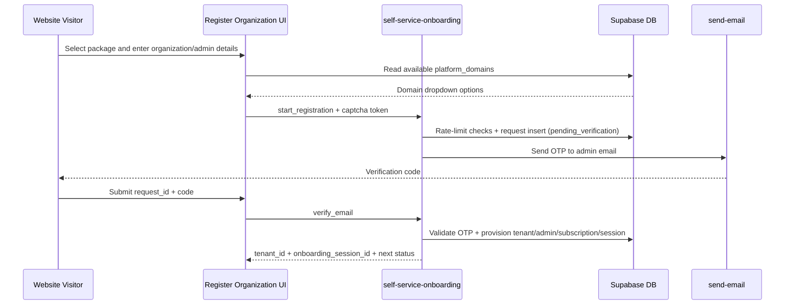
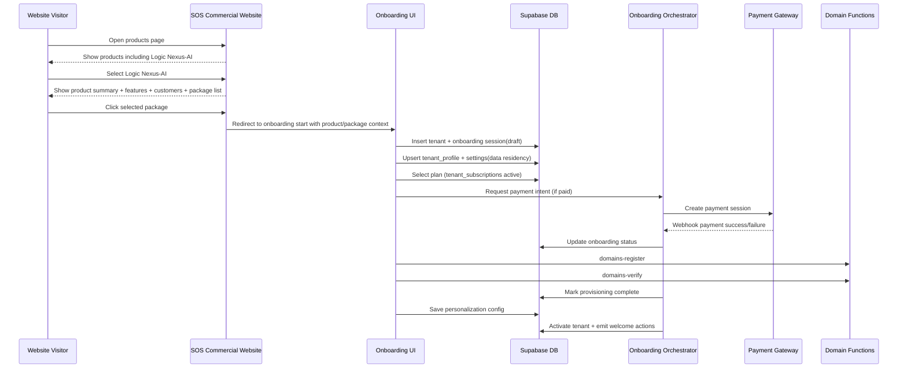

# Tenant Onboarding Functional and Technical Architecture

## 1. Objective

Define an enterprise-grade tenant onboarding workflow for Logic Nexus-AI that is:

- Compatible with existing React + Supabase architecture.
- Aligned with the current hierarchy: Platform Admin → Tenant Admin → Franchise Admin → Users.
- Compliant-ready for international and Indian billing/payment expectations.
- Minimalist at signup, while still capturing legal/tax, data residency, domain, plan, branding, and activation requirements.

## 2. Scope

This architecture covers:

- SOS commercial website product catalog and package entry flow.
- Tenant registration and approval.
- Legal and tax profile capture.
- Data residency selection and policy enforcement.
- Plan selection and subscription activation.
- Domain provisioning and verification.
- First-login personalization (tenant/franchise templates + preview).
- Welcome kit, guided tour, and assisted support fallback.

This architecture does not introduce a hard dependency on an external payment provider in Phase 1. It defines a pluggable approach using existing subscription entities.

## 3. Current System Mapping

### 3.1 Reusable Existing Assets

- Tenant base create/update form exists in `src/components/admin/TenantForm.tsx`.
- Plan selection and tier synchronization exist in `src/pages/dashboard/SubscriptionManagement.tsx`.
- Domain registration and verification exist in `src/services/email/DomainVerificationService.ts` using `domains-register` and `domains-verify` edge functions.
- Scoped theme persistence exists in `src/hooks/useTheme.tsx` and `public.ui_themes`.
- Plan catalog CRUD exists in `supabase/functions/subscription-plans/index.ts`.
- Plan change event dispatch stub exists in `supabase/functions/plan-event-webhook/index.ts`.
- Tenant legal profile base table exists in `supabase/migrations/20260306170000_create_tenant_profile.sql` (`public.tenant_profile`).

### 3.2 Gaps to Close

- Tenant onboarding form does not yet collect full legal/tax/data residency.
- Tenant form still uses raw Supabase client in key paths instead of scoped access.
- First-login screen personalization templates and preview flow are not yet tenant/franchise-admin managed as onboarding steps.
- Payment execution is not implemented, although subscription tables include Stripe-linked fields.
- Onboarding orchestration is not modeled as a state machine.

## 4. Target Functional Workflow

## 4.1 Lifecycle States

`draft → submitted → identity_review → plan_pending → payment_pending → provisioning → active`

Failure/fallback states:

`needs_info`, `verification_failed`, `payment_failed`, `provisioning_failed`, `support_assisted`, `rejected`

## 4.2 Workflow Steps

0. SOS Commercial Product Discovery
   - Input: visitor lands on SOS commercial website.
   - UI: product cards listing available products, including Logic Nexus-AI.
   - Interaction: click product card to open product detail panel/page.
   - Product detail must include:
     - short description,
     - core features,
     - customer logos/list or named customer references,
     - package comparison (Free, Professional, Enterprise) with feature matrix.
   - CTA: selecting any package launches onboarding with product and package preselected.
   - Output: onboarding session created with `selected_product = logic-nexus-ai` and selected package metadata.

1. Minimal Signup
   - Input: organization name, admin email, country.
   - Output: draft tenant + onboarding session.

2. Identity and Legal Profile
   - Input: legal name, registered address, tax ID, emergency contact, billing terms.
   - Output: tenant profile persisted; readiness checks run.

3. Data Residency and Compliance Preferences
   - Input: region/jurisdiction (India, EU, US, Other), retention class, encryption policy flags.
   - Output: policy metadata bound to tenant settings and enforced at runtime.

4. Plan Selection
   - Input: free/professional/enterprise, user count, franchise count.
   - Output: active `tenant_subscriptions` row + `tenants.subscription_tier` sync.

5. Payment
   - Free plan: skip payment, proceed directly.
   - Paid plans: payment intent/session creation and webhook-driven confirmation.

6. Domain Provisioning
   - Register custom domain through `domains-register`.
   - Verify SPF/DKIM/DMARC through `domains-verify`.

7. Login Personalization
   - Tenant/franchise admin selects template and branding in preview mode.
   - Persist scoped theme/template records (tenant scope and franchise scope).

8. Welcome Kit and Guided Activation
   - Send welcome communication.
   - Run guided tour for first login.
   - Present checklists for tenant admin: create franchises, invite users, connect channels.

9. Human-in-the-Loop Support
   - If onboarding stalls or fails, auto-create support task and expose assisted completion mode.

## 5. Target Technical Architecture

## 5.1 Orchestration Pattern

Implement onboarding as an explicit state machine persisted in database:

- `tenant_onboarding_sessions` (new) to track state and checkpoints.
- Step completion events written to `audit_logs`.
- Retriable, idempotent transitions for payment and provisioning steps.

Suggested session fields:

- `id`, `tenant_id`, `status`, `current_step`, `started_by`, `assigned_support_user_id`
- `step_payloads` (jsonb), `failure_reason`, `created_at`, `updated_at`, `completed_at`

## 5.2 Data Model Extensions

Use existing `public.tenant_profile` and extend for full compliance needs:

- `tax_jurisdiction`
- `tax_registration_type`
- `gstin` (India-specific, nullable)
- `vat_number` (EU/intl, nullable)
- `cin_or_registration_number`
- `kyc_status`

Use `tenants.settings` for onboarding configuration blocks:

- `data_residency`: region, legal_basis, retention_policy
- `onboarding_flags`: identity_verified, payment_verified, domain_verified
- `support`: preferred_channel, escalation_level

Add optional `tenant_branding` table or reuse scoped theme storage plus template metadata.

## 5.3 API and Service Layer

Frontend:

- Commercial entry pages:
  - `sos.com/products` product listing page.
  - `sos.com/products/logic-nexus-ai` product detail page with feature summary, customer proof, package cards.
  - Package CTA routes to onboarding start URL with package identifier.
- `TenantForm` becomes onboarding-aware and writes legal + compliance fields.
- `SubscriptionManagement` functions are reused inside onboarding flow for plan activation.
- Domain step calls `DomainVerificationService`.
- Personalization step reuses `useTheme` persistence pattern for tenant/franchise scope.

Backend:

- New edge function: `tenant-onboarding-orchestrator`
  - Start session.
  - Consume preselected product and package from commercial page entry.
  - Validate transition conditions.
  - Trigger payment intent creation.
  - Trigger domain provision verification checks.
  - Finalize tenant activation.

- New edge function: `payment-webhook-handler`
  - Verify signatures.
  - Update `tenant_subscriptions` and onboarding state.
  - Write `audit_logs`.

- New edge function: `self-service-onboarding`
  - Public tenant registration start (`start_registration`) with CAPTCHA verification.
  - Email OTP verification and tenant bootstrap (`verify_email`).
  - Tenant admin creation, role assignment, subscription bootstrap, onboarding session linking.

## 5.4 Security and Multi-Tenant Isolation

- Continue enforcing RLS by tenant/franchise context.
- Replace raw client writes in tenant onboarding with scoped access where possible.
- Platform-only operations guarded by `is_platform_admin`.
- Ensure all onboarding writes include actor identity for audit traceability.
- Public self-service onboarding endpoint uses strict input validation, payload sanitization, CAPTCHA verification, and per-IP/per-email rate limiting before any provisioning.
- Verification codes are hashed at rest and expiration is enforced before provisioning.

## 5.5 Payment Compliance Model

International baseline:

- PCI DSS scope minimization by tokenized payment methods only.
- 3DS/SCA-ready card flows where required.
- Signed webhook verification, replay protection, idempotency keys.

India-specific baseline:

- RBI-compliant tokenization and recurring mandate handling.
- GST-ready invoice metadata (GSTIN, place of supply, tax split fields as needed).
- UPI/net banking/card rail support through gateway abstraction.

Design principle:

- Implement a `PaymentGatewayAdapter` strategy (gateway-neutral interface).
- Keep gateway-specific artifacts in `provider_metadata`.
- Persist financial events in subscription invoice/payment tables; never store raw PAN/sensitive payment data.

## 5.6 Personalization with Preview

Template model:

- Global templates managed by Platform Admin.
- Tenant template overrides by Tenant Admin.
- Franchise template overrides by Franchise Admin (within tenant boundary).

Preview model:

- Live preview panel fed by selected template + scoped tokens.
- Save as draft and publish controls.
- Rollback to previous active template.

Persistence:

- Reuse `ui_themes` for tokens.
- Add `login_templates` metadata table for non-color template attributes if needed.

## 5.7 Welcome Kit and Guided Tour

Welcome package includes:

- Tenant admin quick-start checklist.
- Franchise setup checklist.
- User invitation checklist.
- Channel integration checklist.

Execution:

- First-login guided tour flag in user preferences.
- Auto-dismiss after completion, with replay option in help menu.

## 5.8 Self-Service Registration API Contract

Public route:

- `/register-organization` hosts the package-first onboarding UI.

Edge API:

- `self-service-onboarding` action `start_registration`
  - Required: organization, admin profile, plan tier, compliance basics, CAPTCHA token.
  - Preferred domain value is validated against active `platform_domains` values before request persistence.
  - Output: `request_id`, verification status, expiry metadata.
- `self-service-onboarding` action `verify_email`
  - Required: `request_id`, OTP code, admin password.
  - Output: tenant and onboarding session identifiers.
  - Free tier: tenant and onboarding are completed in-line.
  - Paid tier: tenant is provisioned with `payment_pending` onboarding continuation.

Schema additions:

- `self_service_onboarding_requests`
  - Request lifecycle, sanitized payload snapshot, OTP hash and expiry, provisioning links (`tenant_id`, `admin_user_id`, `onboarding_session_id`).
- `self_service_onboarding_rate_limits`
  - Rolling-window counters by `ip` and `email`, temporary blocking windows.

Error handling:

- Validation errors return `422` with issue details.
- Rate-limit violations return `429` with `retry_after_seconds`.
- CAPTCHA failures return `400`.
- Domain-catalog connectivity failures surface in the registration UI when reading `platform_domains` for the dropdown.
- Provisioning failures return `500` and persist failure reason in request state.

## 6. End-to-End Sequence

### 6.1 Public Self-Service Registration

### 6.2 Product-to-Onboarding and Activation Flow

## 7. Fallback and Support Handling

- Auto-transition to `needs_info` when mandatory docs/fields are missing beyond SLA.
- Auto-transition to `support_assisted` after repeated failures in payment or domain verification.
- Create support activity with tenant context and failure payload.
- Provide one-click resume from last valid step.
- Allow Platform Admin override with forced transition and mandatory reason logging.

## 8. Implementation Plan

Phase 1: Core Onboarding Data and State

- Extend tenant onboarding UI for legal/tax/data residency.
- Introduce `tenant_onboarding_sessions`.
- Move onboarding writes to scoped access patterns.

Phase 2: Plan + Payment Integration

- Reuse existing subscription activation logic.
- Add gateway adapter and webhook processor.
- Add invoice/receipt event persistence.

Phase 3: Domain + Personalization + Welcome

- Integrate domain registration/verification into wizard.
- Add login template preview and publish flow.
- Add guided tour and welcome kit automation.

Phase 4: Support Automation and Analytics

- Assisted onboarding queue.
- Drop-off analytics by step.
- SLA and escalation dashboards.

## 9. Compatibility Checklist

- React pages/components remain in existing dashboard architecture.
- Public commercial pages can be added as non-auth routes and pass onboarding context into existing onboarding flow.
- Supabase edge function pattern follows existing `serveWithLogger`; public self-service endpoint is intentionally non-auth and guarded by CAPTCHA + rate limits.
- RLS model remains tenant/franchise scoped.
- Existing tables (`tenants`, `tenant_profile`, `tenant_subscriptions`, `subscription_plans`, `ui_themes`) are reused with additive self-service onboarding tables.
- Existing domain verification and subscription workflows are integrated, not replaced.

## 10. Acceptance Criteria

- Tenant onboarding can complete end-to-end for free and paid plans.
- Public product page shows Logic Nexus-AI with short description, key features, customer proof, and package matrix.
- Clicking a package starts onboarding with package pre-selected.
- Public self-service registration enforces CAPTCHA and rate limits for abuse protection.
- Email verification is mandatory before tenant/admin provisioning.
- Legal/tax/data residency data is captured and persisted per tenant.
- Paid onboarding confirms payment via webhook before activation.
- Domain verification status is visible and retryable.
- Tenant/franchise admins can preview and publish first-login personalization.
- Welcome checklist and guided tour trigger on first admin login.
- Support fallback path exists for every critical failure step.
