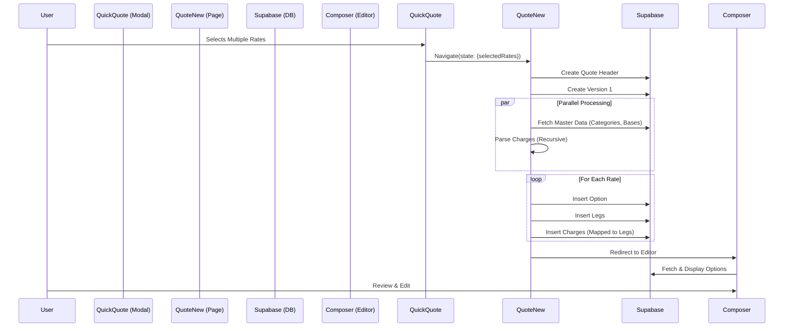

# Quick Quote to Quotation Integration Specification

## Overview

This document defines the technical integration between the **Quick Quote** module (Rate Discovery) and the **Quotation** module (Formal Proposal). It details the user interface components, data flow, validation rules, and database schema involved in transferring multi-carrier rate selections into a formal quotation.

---

## 1. Interface Components & Screen Locations

### 1.1 Quick Quote Module (Source)

*   **Component**: `QuickQuoteModal.tsx`
*   **Screen Location**: Accessed via the global "Quick Quote" button or Dashboard widget.
*   **Rate Display**:
    *   **List View** (`QuoteResultsList`): Cards displaying Carrier, Price, Transit Time, and "Select" toggle.
    *   **Comparison View** (`QuoteComparisonView`): Side-by-side table comparing rates.
*   **Visual Indicators**:
    *   **Available Rates**: Standard card/row styling.
    *   **Selected Rates**: Highlighted border/background.
    *   **Selection Counter**: "X options selected" badge in the sticky footer.
*   **Action**: "Create Quote with Selected" button triggers the transfer.

### 1.2 Quotation Module (Destination)

*   **Component**: `QuoteNew.tsx` (Processing) & `MultiModalQuoteComposer.tsx` (Editor).
*   **Screen Location**: `/dashboard/quotes/new`.
*   **Rate Display**:
    *   **Processing State**: "Generating Quote Options..." loader with progress bar (x/y rates processed).
    *   **Editor State**:
        *   **Tabs/Dropdown**: Switch between different generated Options (e.g., "Option 1: Maersk", "Option 2: MSC").
        *   **Legs Step**: Visual map of the route with assigned carriers per leg.
        *   **Charges Step**: Detailed breakdown of Buy/Sell rates for each leg.

---

## 2. Data Flow & Mapping

### 2.1 Transfer Mechanism

Data is passed via React Router's `location.state` object during navigation:

```javascript
navigate('/dashboard/quotes/new', { 
  state: { 
    ...formData,
    selectedRates: RateOption[], // Array of selected carrier rates
    accountId: string 
  } 
});
```

### 2.2 Field Mapping

| Source (Quick Quote `RateOption`) | Destination (`quotation_version_options`) | Description |
| :--- | :--- | :--- |
| `carrier.name` | `carrier_name` | Name of the shipping line/airline. |
| `price_breakdown.total` | `total_amount` | Total buy rate from API. |
| `transit_time.total_days` | `transit_time` | Estimated duration. |
| `legs[]` | `quotation_version_option_legs` | Array of routing legs (Origin -> Port -> Destination). |
| `price_breakdown` (Recursive) | `quote_charges` | Detailed line items (Freight, THC, Fuel). |

### 2.3 Charge Mapping Logic

The system employs an intelligent parser to map raw API charges to the internal financial schema:

| Raw API Charge Field | Internal Field (`quote_charges`) | Logic |
| :--- | :--- | :--- |
| `code` / `name` | `charge_categories` | Fuzzy match against master data (e.g., "Ocean Freight" -> "Freight"). |
| `unit` / `basis` | `charge_bases` | Mapped via unit code (e.g., "KG" -> "Per KG", "CNTR" -> "Per Container"). |
| `amount` | `buy.rate` | Cost price from carrier. |
| `amount` * Margin | `sell.rate` | Sell price (default margin applied if configured). |
| **Leg Assignment** | `leg_id` | Keywords "Pickup" -> First Leg, "Delivery" -> Last Leg, "Freight" -> Main Leg. |

---

## 3. Technical Specification

### 3.1 API Endpoints

While the transfer is client-side state, the persistence relies on Supabase Client calls:

*   **Master Data Fetch** (Parallel):
    *   `GET /rest/v1/charge_categories`
    *   `GET /rest/v1/charge_bases`
    *   `GET /rest/v1/service_types`
*   **Insertion** (Batch):
    *   `POST /rest/v1/quotation_versions`
    *   `POST /rest/v1/quotation_version_options`
    *   `POST /rest/v1/quotation_version_option_legs`
    *   `POST /rest/v1/quote_charges`

### 3.2 Database Schema

#### `quotation_version_options`
Stores the high-level carrier option.
*   `id`: UUID (PK)
*   `quotation_version_id`: UUID (FK)
*   `carrier_id`: UUID (FK, optional)
*   `transit_time`: Text
*   `valid_until`: Date

#### `quotation_version_option_legs`
Stores the routing segments for an option.
*   `id`: UUID (PK)
*   `quotation_version_option_id`: UUID (FK)
*   `sequence`: Integer (1, 2, 3...)
*   `mode`: Enum (ocean, air, road)
*   `origin_location_id`: UUID
*   `destination_location_id`: UUID

#### `quote_charges`
Stores the financial line items.
*   `id`: UUID (PK)
*   `quote_option_id`: UUID (FK)
*   `leg_id`: UUID (FK, nullable for general charges)
*   `category_id`: UUID (FK)
*   `basis_id`: UUID (FK)
*   `charge_side_id`: UUID (FK) - 'Buy' or 'Sell'
*   `rate`: Numeric
*   `quantity`: Numeric

---

## 4. Validation Rules

1.  **Selection Requirement**: `selectedRates` array must contain at least one item.
2.  **Tenant Context**: `tenant_id` must be present in the user session.
3.  **Data Integrity**:
    *   Charges must have a non-zero amount.
    *   Legs must have valid Origin and Destination strings/IDs.
4.  **Timeout Protection**: The processing workflow has a **30-second hard timeout**. If insertion exceeds this, the process halts, and partial results are shown.

---

## 5. Workflow Diagram


