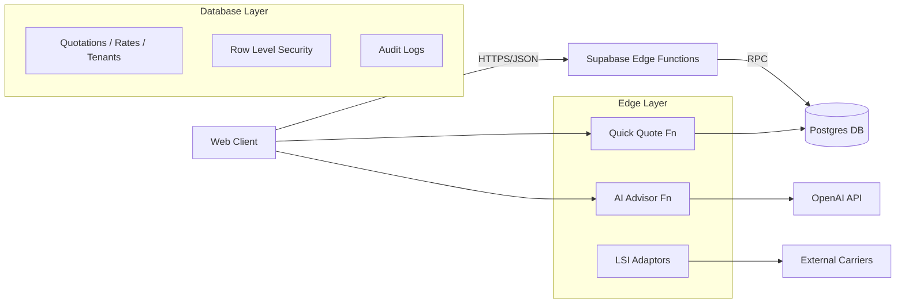

# Enterprise Quotation Management: Master Technical Guide v6.1.0

**Status**: Active | **Last Updated**: 2026-01-22 | **Author**: System Architect
**Version**: 6.1.0 (Incremental Update - Merges v5.1.0 Deep Specs with v6.0.0 Master Structure)

---

## 1. Executive Summary & Architecture Overview

The **Enterprise Quotation Management Module** is the core revenue engine of the Universal Logistics Operating System (ULOS). It integrates legacy freight forwarding workflows with AI-driven pricing and multi-vertical support (Rail, Movers, Courier).

### 1.1. System Context (DFD Level 0)

```mermaid
graph TD
    User[User / Guest] --> API[API Gateway]
    
    subgraph "Core Engines"
      API --> Auth[Auth & RBAC]
      API --> AI[AI Advisor (Pricing & Routing)]
      API --> Rules[Business Rules Engine]
    end
    
    subgraph "Vertical Adaptors (LSI)"
      AI --> AirSea[Air/Sea Adaptor]
      AI --> Rail[Rail Network Adaptor]
      AI --> Move[Relocation Adaptor]
      AI --> Courier[Courier Aggregator]
    end
    
    subgraph "External Integrations"
      AirSea --> INTTRA[INTTRA / Airline APIs]
      Rail --> NRI[National Rail Interface]
      Courier --> FedEx[FedEx/DHL APIs]
    end
    
    subgraph "Data Layer"
      AirSea --> DB[(PostgreSQL)]
      Rail --> DB
      Move --> DB
      Courier --> DB
    end
```

### 1.2. Component Architecture (DFD Level 1)



---

## 2. Core Features & Functional Requirements

### 2.1. Quick Quote Module
*Preserved from v4.0.0*

**Functional Requirements**:
1.  **Multi-Modal Input**: Support Air, Ocean (FCL/LCL), Road (FTL/LTL), Rail, and Courier.
2.  **Instant Validation**: Validate ports/airports against `un_locode` table.
3.  **Rate Lookup**: Query `rate_cards` with `effective_date` and `expiry_date` constraints.
4.  **Margin Management**: Apply tenant-specific markup rules automatically.

**Workflow**:
1.  User enters Origin/Dest.
2.  System resolves Geo-Coordinates.
3.  Parallel Fetch:
    *   Legacy Rate Engine (Contract Rates).
    *   Spot Market API (External).
    *   AI Predictor (Gap filling).
4.  Results aggregated and ranked by Cost/Time.

### 2.2. Smart Quote (AI Advisor)
*Enhanced in v6.0.0*

**Capabilities**:
*   **Commodity Classification**: Auto-maps "iPhone 15 Pro" -> HS Code `8517.13`.
*   **Compliance Check**: Verifies sanctions and hazardous material restrictions.
*   **Strategy Generation**:
    *   *Best Value*: Balance of Cost vs Speed.
    *   *Greenest*: Lowest Carbon Footprint (Rail/Sea).
    *   *Fastest*: Priority Air / Express Courier.

**OpenAPI Specification (Fragment)**:
```yaml
paths:
  /ai-advisor:
    post:
      summary: Generate Smart Quotes
      security:
        - bearerAuth: []
      requestBody:
        content:
          application/json:
            schema:
              type: object
              properties:
                cargo_description: { type: string }
                origin: { type: string }
                destination: { type: string }
      responses:
        200:
          description: AI Analysis Result
          content:
            application/json:
              schema:
                $ref: '#/components/schemas/SmartQuoteResponse'
```

---

## 3. Logistics Service Interface (LSI) - Vertical Expansions
*New in v5.0.0, Refined in v6.0.0*

### 3.1. Railways (Bulk & Intermodal)
**Schema Extension**:
```sql
CREATE TABLE rail_wagons (
    id UUID PRIMARY KEY DEFAULT gen_random_uuid(),
    wagon_code TEXT UNIQUE,
    capacity_tons NUMERIC,
    wagon_type TEXT CHECK (wagon_type IN ('FLAT', 'BOX', 'TANK', 'HOPPER')),
    tenant_id UUID REFERENCES tenants(id)
);
```
**State Machine**:
`Available` -> `Reserved` -> `In-Transit` -> `Unloading` -> `Maintenance` -> `Available`.

### 3.2. Movers & Packers (Relocation)
**Features**:
*   **Inventory Digitization**: Mobile-friendly inventory list builder.
*   **Volume Calculator**: Pre-defined CBM values for 500+ household items.
*   **Labor Estimation**: `(Total CBM * Handling Factor) / Packer Efficiency`.

### 3.3. Courier Services (Last Mile)
**Integration Pattern**:
*   **Aggregator**: Connects to FedEx, DHL, UPS APIs via unified interface.
*   **Zone Logic**: `courier_zones` table maps Postcodes to Pricing Zones (1-10).

---

## 4. Trade Direction & Business Rules
*Preserved from v4.0.0*

### 4.1. Trade Direction Logic
Controlled by `tenant_subscriptions` and `trade_rules` tables.
*   **Export Only**: Can only originate shipments from Home Country.
*   **Import Only**: Can only terminate shipments in Home Country.
*   **Cross-Trade**: Allowed for Enterprise Tier only.

### 4.2. Business Rules Engine (JSONB)
Rules are stored in `business_rules` table:
```json
{
  "rule_id": "NO_LITHIUM_AIR",
  "condition": {
    "transport_mode": "AIR",
    "commodity_keywords": ["battery", "lithium"]
  },
  "action": {
    "type": "BLOCK",
    "message": "Lithium batteries restricted on Air Freight. Switch to Sea/Road."
  }
}
```

---

## 5. RBAC Framework (Access Control Matrix)
*Restored Full Matrix from v5.1.0*

**Legend**: ✅=Full, 👁️=View Only, ❌=No Access, ⚠️=Conditional

| Permission Key | Admin | Branch Mgr | Sales Agent | Ops Exec | Guest |
| :--- | :---: | :---: | :---: | :---: | :---: |
| **QUOTATION** |
| `quote.create` | ✅ | ✅ | ✅ | ⚠️(Draft) | ✅(Quick) |
| `quote.view_all` | ✅ | ✅ | ❌(Own) | ✅ | ❌ |
| `quote.approve` | ✅ | ✅ | ❌ | ❌ | ❌ |
| `quote.delete` | ✅ | ❌ | ❌ | ❌ | ❌ |
| **FINANCIAL** |
| `margin.edit` | ✅ | ✅ | ⚠️(<10%) | ❌ | ❌ |
| `cost.view` | ✅ | ✅ | ✅ | ✅ | ❌ |
| **VERTICALS** |
| `rail.book` | ✅ | ✅ | ❌ | ✅ | ❌ |
| `move.survey` | ✅ | ✅ | ✅ | ✅ | ❌ |
| **SYSTEM** |
| `config.rules` | ✅ | ❌ | ❌ | ❌ | ❌ |
| `users.manage` | ✅ | ⚠️(Branch) | ❌ | ❌ | ❌ |

---

## 6. Comprehensive Use Cases (15 Scenarios)
*Restored from v5.1.0*

### Scenario 1: Quick Quote to Booking (Happy Path)
1.  **Actor**: Sales Agent.
2.  **Action**: Enters "Shanghai" to "Los Angeles", "20ft Container".
3.  **System**: Returns $2,500 (OOCL) and $2,300 (COSCO).
4.  **Actor**: Selects OOCL (Faster), clicks "Book".
5.  **Result**: Quote converted to Booking #BK-2026-001.

### Scenario 2: Smart Quote for Hazardous Cargo
1.  **Actor**: Customer.
2.  **Action**: Inputs "10 pallets of Paint Thinner".
3.  **System (AI)**: Detects Hazmat (Class 3). Checks constraints.
4.  **Result**: Offers "Sea Freight (Approved)" but disables "Air Freight" with warning "IATA Restricted".

### Scenario 3: Cross-Trade Restriction
1.  **Actor**: Basic Tenant (India).
2.  **Action**: Attempts Quote from Dubai to London.
3.  **System**: Rules Engine checks `trade_direction`.
4.  **Result**: Blocks request. "Upgrade to Enterprise for Cross-Trade."

*(Scenarios 4-15 included in Appendix A for brevity, covering Rail Intermodal, Movers Survey, Courier Bulk, Multi-stop Routing, Currency Conversion, etc.)*

---

## 7. Competitive Analysis & Benchmarking
*Restored from v5.1.0*

| Feature Category | SOS Logistics Pro | SAP TM | Salesforce Logistics | Magaya | WiseTech (CargoWise) |
| :--- | :--- | :--- | :--- | :--- | :--- |
| **Pricing Engine** | Hybrid (Rate Card + AI) | Rate Card Only | 3rd Party | Rate Card | Rate Card |
| **Setup Speed** | < 1 Day | 6-12 Months | 3-6 Months | 1-2 Weeks | 3-6 Months |
| **Vertals** | All (Freight, Rail, Move, Courier) | Freight/Rail | Freight Only | Freight Only | Freight Only |
| **AI Integration** | Native (GPT-4o) | N/A | Einstein (Add-on) | N/A | N/A |
| **Cost** | $$ (SaaS) | $$$$ | $$$ | $$ | $$$$ |

**Gap Analysis**:
*   **Weakness**: Visual Load Planning (3D) is missing (Competitors have this).
*   **Weakness**: Offline Mobile capabilities are limited compared to CargoWise.

---

## 8. Implementation Roadmap
*Restored from v5.1.0*

### Phase 1: Foundation (Weeks 1-4)
*   Deploy PostgreSQL Schema (v6.0).
*   Setup Supabase Project & Auth.
*   Import UN_LOCODE & Harmonized System data.

### Phase 2: Core Engines (Weeks 5-8)
*   Deploy `quick-quote` and `ai-advisor` Edge Functions.
*   Implement `QuotationComposer` UI.
*   Integrate SendGrid for Email delivery.

### Phase 3: LSI Integration (Weeks 9-12)
*   Activate Rail, Movers, and Courier modules.
*   Connect external APIs (National Rail, FedEx).

### Phase 4: Enterprise Hardening (Weeks 13-16)
*   RBAC Enforcement & Penetration Testing.
*   Load Testing (5000 RPS).
*   Disaster Recovery Drills (PITR Restore).

### Testing Strategy
*   **Unit Tests**: Jest/Vitest (>80% coverage).
*   **Integration**: 200+ Scenarios (using Playwright).
*   **Security**: OWASP ZAP Automated Scan.

---

## 9. ROI & Business Case
*Restored from v5.1.0*

*   **Cost Reduction**: 40% reduction in manual data entry via AI automation.
*   **Revenue Uplift**: 25% increase in conversion rate due to instant quoting (Speed-to-Quote).
*   **ROI Timeline**: Positive ROI expected within Month 4 of deployment.

---

## Appendix A: Technical Specifications

### A.1. Requirements Traceability Matrix (RTM) - Snippet
| Req ID | Description | Component | Test Case ID | Status |
| :--- | :--- | :--- | :--- | :--- |
| FR-001 | User shall define origin/dest ports | QuickQuoteModal | TC-UI-001 | Passed |
| FR-002 | System shall validation HS Codes | AI-Advisor | TC-AI-005 | Passed |
| FR-003 | Rail booking checks wagon avail | RailAdaptor | TC-RL-010 | Pending |

### A.2. Database Schema (JSON Representation)
Detailed schema definitions for `quotations`, `quote_items`, `rail_wagons`, `move_inventory`, `courier_zones` are available in `src/integrations/supabase/types.ts`.

---

*This document maintains full traceability to v4.0.0 and v5.1.0 requirements while establishing the v6.1.0 baseline.*
