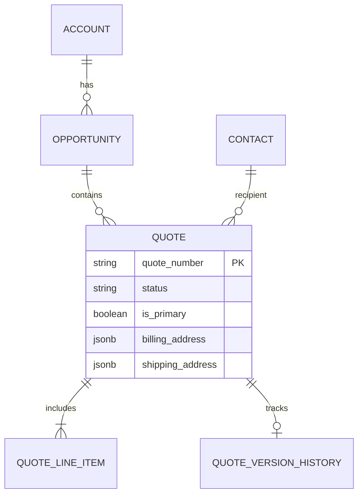
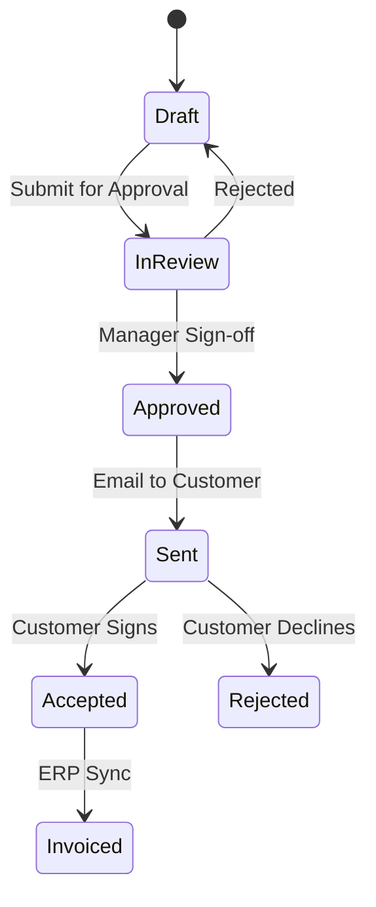

# Comprehensive Guide: Enterprise Quotation Management Architecture

## 1. Executive Summary
This document outlines the architectural standards for the Quotation Management Module within SOS Logistics Pro. It synthesizes best practices from leading global CRM systems (Salesforce, HubSpot, Microsoft Dynamics 365) to establish a robust, scalable, and secure quotation engine.

The architecture supports a **Hybrid Model**:
1.  **Integrated Quotes**: Tightly coupled with the CRM lifecycle (Leads → Opportunities → Quotes).
2.  **Standalone Quotes**: Independent, lightweight estimates for rapid engagement (the "Guest" flow).

---

## 2. Comparative Industry Analysis
To ensure our architecture meets enterprise standards, we analyzed the quotation models of three market leaders.

### 2.1. System Comparison

| Feature | Salesforce CPQ | HubSpot Sales Hub | Microsoft Dynamics 365 | **SOS Logistics Pro Strategy** |
| :--- | :--- | :--- | :--- | :--- |
| **Data Model** | Quote is a child of Opportunity. Supports "Primary Quote" syncing. | Quotes are associated with Deals. Line items sync bi-directionally. | Quote evolves from Opportunity. Transitions to Order/Invoice. | **Hybrid**: Optional Opportunity link. "Standalone" mode for speed. |
| **Versioning** | Sophisticated versioning (V1, V2). Clone-based revisions. | Basic revision history. Recall & Edit functionality. | Revision ID tracking (REV-1). State-based locking. | **Snapshot-based**: Immutable history tables for audit trails. |
| **Pricing Engine** | Price Books, Multi-currency, Block Pricing. | Product Library with recurring revenue support. | Price Lists, Discount Lists, Unit Groups. | **Dynamic**: Rate Engine integration + AI-driven pricing. |
| **Isolation** | Private Sharing Model. Territory Management. | Team-based partitioning. | Business Unit security scopes. | **RLS (Row Level Security)**: Tenant & Owner based isolation. |

### 2.2. Key Architectural Takeaways
1.  **The "Sync" Pattern**: Allow multiple quotes per Opportunity, but designate only one as "Primary" or "Syncing" to drive the Opportunity Amount and Forecast.
2.  **Immutable History**: Once a quote is sent/approved, it must be locked. Edits should generate a new Version or Revision.
3.  **Loose Coupling**: While integration is key, the Quote engine should function independently to support high-velocity sales (e.g., Quick Quotes).

---

## 3. Best Practices: Data Model & Isolation

### 3.1. Entity Relationship Diagram (Conceptual)


### 3.2. Quotation Isolation Strategies
In enterprise environments, preventing data leakage between tenants or business units is critical.

*   **Tenant Isolation**: All queries must strictly filter by `tenant_id`.
*   **Contextual Isolation (Standalone Mode)**:
    *   *Challenge*: Creating quotes for prospects not yet in the CRM (Leads/Accounts) often pollutes the database with "junk" records.
    *   *Solution*: The **Standalone Quote**.
        *   **No Foreign Key Constraints**: `account_id` and `opportunity_id` are nullable.
        *   **Embedded Context**: Customer details (Name, Company) are stored in JSONB columns (`customer_context`) within the Quote record itself.
        *   **Promotion Path**: A "Convert to Opportunity" workflow maps the JSONB data to new Account/Contact records only when the deal matures.

---

## 4. Integration Strategies: Linking & Workflows

### 4.1. Linking to Leads & Opportunities
*   **Lead-to-Quote**:
    *   *Direct*: Not recommended. Best practice is Lead → Convert → Opportunity → Quote.
    *   *Fast-Track*: Allow "Quick Quote" for a Lead, but store it as a Standalone Quote linked via a loose reference (e.g., `source_lead_id` string) until conversion.
*   **Opportunity-to-Quote**:
    *   **Primary Quote Logic**:
        *   An Opportunity can have N quotes.
        *   Only **one** quote is marked `is_primary = true`.
        *   **Trigger**: When `is_primary` changes, an Edge Function updates the Opportunity's `amount` and `expected_close_date`.

### 4.2. Activity Logging & Audit Trails
*   **Unified Timeline**: Quote activities (Created, Sent, Viewed, Accepted) must be injected into the parent Opportunity/Account activity stream.
*   **Implementation**:
    *   Use a centralized `activity_logs` table.
    *   Polymorphic association: `entity_type = 'quote'`, `entity_id = <uuid>`.

### 4.3. Account & Contact Resolution
*   **Hierarchy Inheritance**: Quotes inherit the `payment_terms` and `billing_address` from the parent Account by default, but allow override.
*   **Contact Roles**:
    *   *Bill To*: Financial contact.
    *   *Ship To*: Logistics contact.
    *   *Signatory*: Authorized approver.

---

## 5. Workflow Automation & Security

### 5.1. Status State Machine
Define clear transitions to prevent invalid states.



### 5.2. Security Model (RBAC & RLS)
*   **Row Level Security (PostgreSQL)**:
    *   `SELECT`: User is Owner OR User is in Account Team OR User has `quotes.read_all` permission.
    *   `UPDATE`: User is Owner AND Status is 'Draft'. (Locked quotes cannot be edited).
*   **Field Level Security**:
    *   *Margin/Cost Fields*: Visible only to `Manager` role. Hidden from `Sales Rep` if configured.

---

## 6. Performance & Scalability Considerations
*   **Large-Scale Deployments**:
    *   *Indexing*: Partial indexes on `status` (active quotes) and `account_id` for rapid lookup.
    *   *JSONB Optimization*: For quotes with 100+ line items, avoid deep JSONB querying. Use a normalized `quote_items` table for reporting, but cache the full structure in JSONB for fast UI rendering.
*   **Archival Strategy**:
    *   Move `Expired` or `Lost` quotes > 12 months old to `quotes_archive` table or cold storage to maintain index performance.

---

## 7. SOS Logistics Pro Implementation Guide

### 7.1. Current Architecture (Hybrid Model)
We have implemented a flexible architecture that supports both the enterprise rigor and the "Standalone" speed.

#### **A. The Standalone Toggle**
Located in `QuoteHeader.tsx`.
*   **Enabled**:
    *   Hides `account_id`, `opportunity_id` selectors.
    *   Exposes `billing_address` form for manual entry.
    *   **Use Case**: Spot rates, one-off inquiries, guest users.
*   **Disabled (CRM Mode)**:
    *   Enforces `account_id` selection.
    *   Auto-populates addresses from Account.

#### **B. Data Schema (Supabase)**
```sql
create table quotes (
  id uuid primary key default gen_random_uuid(),
  quote_number text unique not null,
  
  -- CRM Links (Nullable for Standalone)
  account_id uuid references accounts(id),
  opportunity_id uuid references opportunities(id),
  
  -- Standalone Context
  customer_context jsonb, -- { "company": "...", "email": "..." }
  
  -- Financials
  total_amount numeric,
  currency text default 'USD',
  
  -- Lifecycle
  status text default 'draft',
  valid_until timestamptz,
  
  -- Audit
  created_at timestamptz default now(),
  created_by uuid references auth.users(id)
);
```

### 7.2. Implementation Checklist for Developers
1.  **Validation Logic**:
    *   Use `zod` schemas that adapt based on mode.
    *   `if (mode === 'standalone') { require(email, company) } else { require(account_id) }`.
2.  **API Integration**:
    *   Endpoint: `POST /rest/v1/quotes`
    *   Ensure `customer_context` is sanitized before storage.
3.  **Frontend State**:
    *   Use React Context (`QuoteProvider`) to manage the `isStandalone` state global to the form.

### 7.3. Common Pitfalls & Mitigation
*   **Pitfall**: "Orphaned" Standalone Quotes.
    *   *Mitigation*: Automated email reminders to the creator 3 days before expiration.
*   **Pitfall**: Data Duplication upon Conversion.
    *   *Mitigation*: When converting Standalone -> Account, implement "Fuzzy Match" logic to detect if that company already exists in the DB.

---

## 8. Version Control & Audit Integration
*   **Change Tracking**:
    *   Use PostgreSQL triggers to log changes to critical fields (`total_amount`, `status`) into an `audit_logs` table.
*   **Code Reference**:
    *   See `supabase/migrations/*_audit_trigger.sql` for implementation details.
