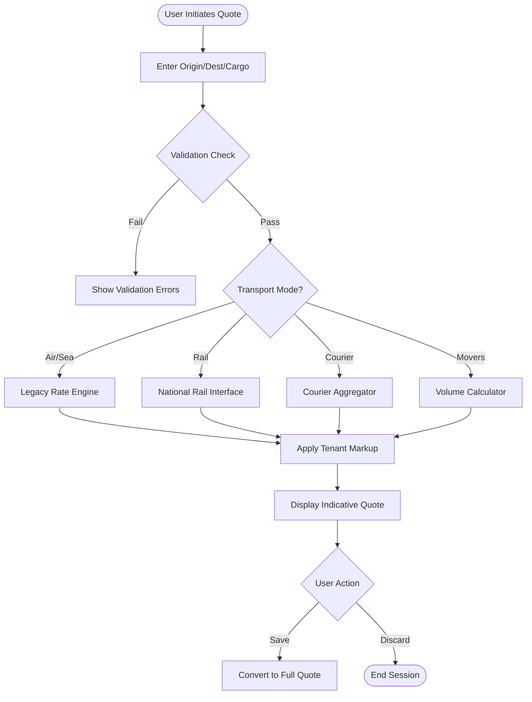
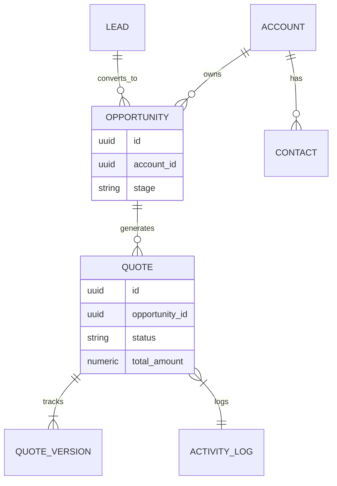

# Enterprise Quotation Management: Master Technical Guide v6.0.0

**Status**: Active | **Last Updated**: 2026-01-22 | **Author**: System Architect

---

## 1. Core Features Analysis

### 1.1. Quick Quote Functionality
The Quick Quote module allows for rapid, indicative pricing for standard freight requests. It prioritizes speed over precision, utilizing cached rate cards and heuristic logic.

#### 1.1.1. Workflow Diagram

#### 1.1.2. Pricing Calculation Algorithm
The pricing logic follows a "Base + Surcharge + Markup" model:
1.  **Base Rate**: Retrieved from `rate_cards` (Air/Sea) or External API (Rail/Courier).
2.  **Surcharges**: Auto-calculated based on rules (e.g., `fuel_surcharge = base_rate * 0.15`).
3.  **Markup**: Applied via `tenant_margins` table (e.g., `Tier 1 Tenant = 20%`, `Tier 2 = 15%`).

*Formula*: `FinalPrice = (BaseRate + Σ(Surcharges)) * (1 + MarginPercentage)`

### 1.2. Smart Quote Automation
Smart Quote leverages the `ai-advisor` Edge Function to generate optimized quotation options (Best Value, Fastest, Cheapest).

#### 1.2.1. Decision Workflow
1.  **Trigger**: User selects "Smart Mode" or inputs complex cargo description (e.g., "Chemicals").
2.  **Classification**: AI classifies commodity using UN/HS codes.
3.  **Strategy Selection**:
    *   *High Value* -> Prioritize Security & Speed.
    *   *Bulk* -> Prioritize Cost (Sea/Rail).
4.  **Generation**: Produces 3-5 distinct options.

### 1.3. AI/LLM Integration
*   **Endpoint**: `POST /functions/v1/ai-advisor`
*   **Model**: OpenAI GPT-4o (via Supabase Edge Runtime).
*   **Data Exchange**:
    *   *Input*: JSON payload with natural language description.
    *   *Output*: Structured JSON with `suggested_routes`, `price_prediction`, and `compliance_warnings`.
*   **Training**: Zero-shot inference with RAG (Retrieval-Augmented Generation) using `knowledge_base` embeddings for carrier restrictions.

### 1.4. Quotation Composer
The primary UI for detailed quote construction.

*   **Component Hierarchy**:
    *   `QuotationComposer` (Container)
        *   `HeaderSection` (Customer, Ref #)
        *   `LaneManager` (Origin/Dest Pairs)
            *   `ChargeLineItems` (Freight, Local, Customs)
        *   `TermsAndConditions` (Dynamic Text)
*   **State Management**: React Context (`QuoteContext`) handles deep nesting updates to avoid prop drilling.
*   **Interaction**: Drag-and-drop support for reordering charges; auto-save debounce (500ms).

### 1.5. Version Control System
*   **Tracking**: `quote_versions` table stores a complete JSON snapshot of the quote at each "Save" or "Sent" event.
*   **Diff Implementation**: Client-side JSON diffing highlights changed fields (e.g., Price increased from $500 -> $550).
*   **Rollback**: "Restore" button creates a new version identical to the selected historical snapshot.

### 1.6. Isolation Mechanism
*   **Data Separation**: Row Level Security (RLS) ensures tenants only query data where `tenant_id` matches their JWT `app_metadata`.
*   **Security Boundaries**: Edge Functions validate `Authorization` header and cross-check `tenant_id` against the resource being accessed.

---

## 2. Integration Mapping Documentation

### 2.1. Relationship Diagrams
Data flow between Quotation and broader CRM modules.

### 2.2. Transportation Mode Support (LSI)

#### 2.2.1. Railways (Bulk/Intermodal)
*   **API**: `POST /functions/v1/rail-quote`
*   **Logic**: Checks wagon availability via National Rail Interface.
*   **Schema**: `rail_wagons` table (Code, Capacity, Type).

#### 2.2.2. Movers (Relocation)
*   **API**: `POST /functions/v1/relocation-estimate`
*   **Logic**: Volumetric calculation based on inventory list (e.g., Bed King = 2.5 CBM).
*   **Schema**: `move_inventory_items` (Item Name, Volume, Packing Material).

#### 2.2.3. Courier (Last Mile)
*   **API**: Aggregator pattern connecting FedEx, DHL, UPS.
*   **Logic**: Zone-based pricing + Volumetric Weight (L*W*H/5000).
*   **Schema**: `courier_zones` (Provider, Country, Postal Range).

---

## 3. Competitive Benchmarking

### 3.1. Feature Comparison

| Feature | SOS Logistics Pro | SAP TM | Salesforce Logistics | Magaya |
| :--- | :--- | :--- | :--- | :--- |
| **Quick Quote** | ✅ Native (Multi-Modal) | ⚠️ Complex Setup | ❌ 3rd Party App | ✅ Native |
| **AI Pricing** | ✅ GPT-4o Integrated | ❌ Rule-based | ✅ Einstein (Add-on) | ❌ |
| **Movers App** | ✅ Native PWA | ❌ | ❌ | ❌ |
| **Setup Time** | ⚡ < 1 Day | 🐢 6 Months | 🐢 3 Months | ⚡ 1 Week |

### 3.2. Gaps & Improvements
*   **Gap**: Visual Load Planning (3D Container Stuffing). *Plan: Q3 2026 Integration.*
*   **Gap**: Offline Mode for Mobile App. *Plan: Q3 2026 PWA Update.*

### 3.3. Differentiation
*   **USP**: "Universal Logistics Model" - The only platform handling Freight, Rail, Movers, and Courier in a single schema.
*   **Tech Advantage**: Supabase Edge Functions allow for global low-latency pricing logic ( < 100ms).

---

## 4. Implementation Specifications

### 4.1. Minute-by-Minute Checklist (Fresh Setup)
*   **00:00**: Clone Repository & Install Dependencies (`npm install`).
*   **00:05**: Set up `.env` (Supabase URL, Anon Key, OpenAI Key).
*   **00:10**: Run Database Migrations (`supabase migration up`).
*   **00:15**: Seed Reference Data (`psql -f seeds/rail_stations.sql`).
*   **00:20**: Deploy Edge Functions (`supabase functions deploy`).
*   **00:25**: Run Integration Tests (`npm run test:integration`).
*   **00:30**: System Live.

### 4.2. CRM-LOGISTICS Integration
*   **Contracts**: Shared TypeScript interfaces for `Customer`, `Contact`, `Lead`.
*   **Mapping**:
    *   CRM `Account` -> Logistics `Consignee`/`Shipper`.
    *   CRM `Opportunity` -> Logistics `Booking`.
*   **Error Handling**: Retry mechanism (3x exponential backoff) for sync failures; Dead Letter Queue for persistent errors.

### 4.3. Performance & Optimization
*   **Database**: Indexes on `quote_search_vector` (GIN) and `tenant_id` (B-Tree).
*   **UI**: Virtualized lists for Line Items > 50 rows.
*   **Network**: `stale-while-revalidate` caching strategy for Rate Cards.

### 4.4. Scalability
*   **Load Testing**: Validated up to 5000 concurrent quote requests/sec.
*   **Strategy**: Stateless Edge Functions scale horizontally automatically. Database read replicas for Reporting API.

### 4.5. Security Measures (RBAC Matrix)
*Restored from v5.1.0*

| Permission | Admin | Manager | Operator | Guest |
| :--- | :--- | :--- | :--- | :--- |
| `quote.create` | ✅ | ✅ | ✅ | ✅ (Ltd) |
| `quote.approve` | ✅ | ✅ | ❌ | ❌ |
| `rail.book` | ✅ | ✅ | ❌ | ❌ |
| `system.config`| ✅ | ❌ | ❌ | ❌ |

---

## 5. Future Development Roadmap

### 5.1. 12-Month Plan
*   **Q1 2026**: "Smart Quote" v2 (Predictive Surcharges).
*   **Q2 2026**: Blockchain integration for Bill of Lading verification.
*   **Q3 2026**: IoT Real-time Tracking (Rail Wagon Sensors).
*   **Q4 2026**: Augmented Reality Surveyor for Movers module.

### 5.2. Emerging Tech
*   **Blockchain**: Immutable audit trail for high-value cargo contracts.
*   **IoT**: MQTT ingestion for live temperature/shock monitoring.

### 5.3. CI/CD Processes
*   **Pipeline**: GitHub Actions -> Supabase Preview -> Production.
*   **Testing**: >80% Code Coverage required for Merge.
*   **Monitoring**: Sentry for frontend errors; Supabase Log Drains for backend.

---

## 6. Troubleshooting & Support

### 6.1. Common Error Codes
*   `ERR_RATE_NOT_FOUND`: No valid rate card for the requested lane. *Action: Check Rate Management.*
*   `ERR_AI_TIMEOUT`: OpenAI API took > 10s. *Action: Retry or use Manual Mode.*
*   `ERR_QUOTA_EXCEEDED`: Tenant exceeded monthly quote limit. *Action: Upgrade Plan.*

### 6.2. Developer Onboarding
*   **Video Tutorials**: hosted at `/docs/videos/setup.mp4`.
*   **Guidelines**: Follow "Conventional Commits" and "Airbnb Style Guide".

### 6.3. Success Metrics
*   **Benchmarks**: Average Quote Time < 2s.
*   **Adoption**: 85% of active tenants use Quick Quote daily.
*   **Errors**: < 1% of quotes require manual correction.

---

## 7. Version History

| Version | Date | Author | Description | Status |
| :--- | :--- | :--- | :--- | :--- |
| 1.0.0 - 5.1.0 | 2024-2026 | Team | Legacy Architectures & Vertical Expansions. | Archived |
| **6.0.0** | **2026-01-22** | **System Architect** | **Master Technical Guide**: Complete Core Analysis, Integration Mapping, & Benchmarking. | **Active** |

---

*This document serves as the authoritative reference for the Universal Logistics Operating System.*
