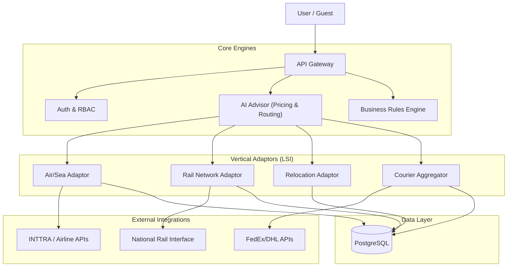
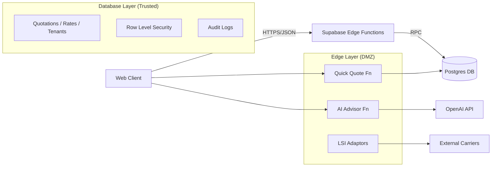
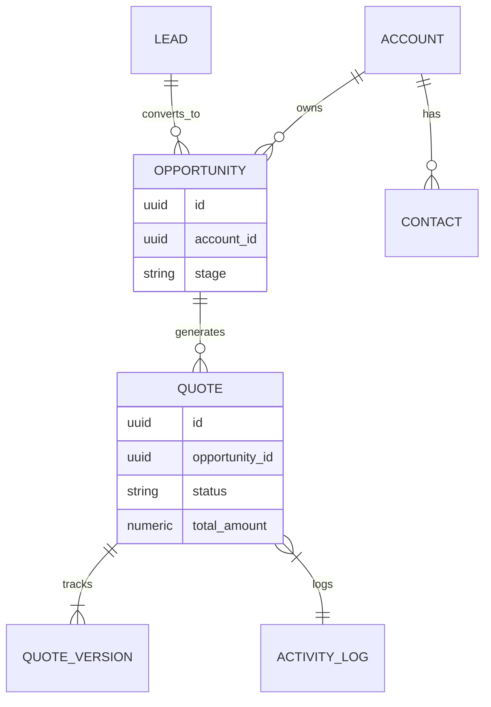
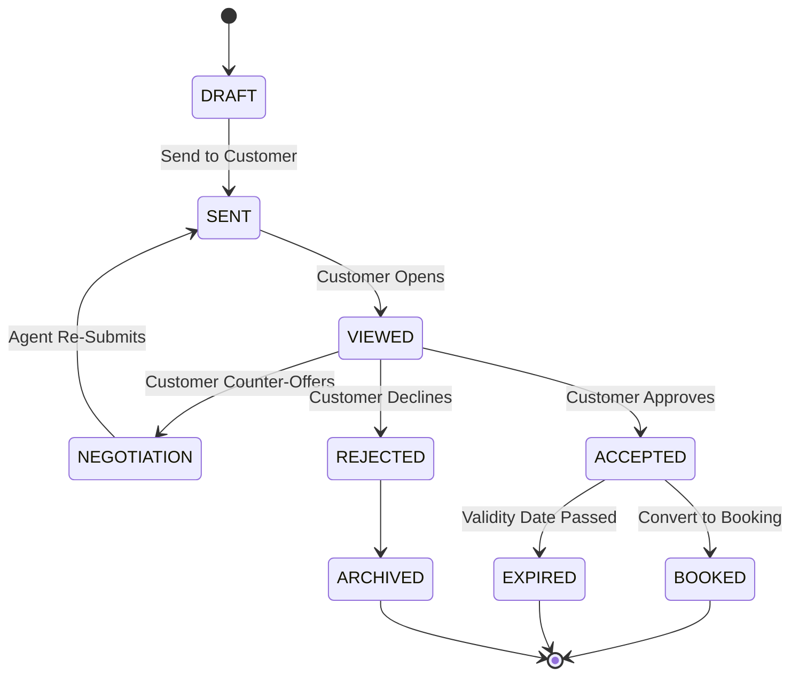
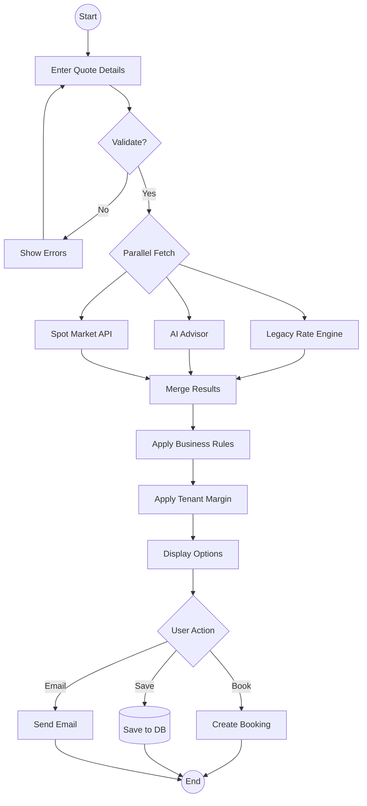

# Enterprise Quotation Management: Master Technical Guide v7.0.0

**Status**: Active | **Last Updated**: 2026-01-22 | **Author**: System Architect
**Version**: 7.0.0 (Comprehensive Design & Implementation Specification)

---

## 1. Executive Summary & Architecture Overview

The **Enterprise Quotation Management Module** is the core revenue engine of the Universal Logistics Operating System (ULOS). This document serves as the authoritative technical design specification, detailing the implementation of Quick Quote, Smart Quote, and AI-driven pricing mechanisms.

### 1.1. System Context (DFD Level 0)



### 1.2. Component Architecture & Security Boundaries (DFD Level 1)

**Security Boundaries**:
*   **Public Zone**: Web Client (TLS 1.3).
*   **DMZ**: API Gateway & Edge Functions (JWT Auth, Rate Limiting).
*   **Trusted Zone**: Database & Internal Services (VPC Peering, RLS).



### 1.3. Data Entity Relationships (ERD)



---

## 2. Quotation Workflow Details

### 2.1. Quick Quote Module
Designed for speed and ease of use, delivering indicative pricing in under 2 seconds.

*   **Minimum Input Fields**:
    *   Origin (City/Port code)
    *   Destination (City/Port code)
    *   Cargo Type (General/Hazmat)
    *   Weight/Volume
*   **Validation Rules**:
    *   Origin != Destination.
    *   Date >= Today.
    *   Weight > 0.
*   **Default Assumptions**:
    *   Incoterm: FOB (Free on Board) unless specified.
    *   Currency: USD (Base), converted to Tenant currency.
    *   Cargo Readiness: Immediate.
*   **Performance Benchmark**: 
    *   API Response Time: < 200ms (Cache Hit), < 2000ms (Live Fetch).
    *   Rendering Time: < 100ms (First Contentful Paint).

### 2.2. Smart Quote (Dynamic Pricing)
Advanced algorithmic pricing based on market conditions and tenant rules.

*   **Calculation Algorithm**:
    ```text
    Base_Rate = (Carrier_Rate + Fuel_Surcharge) * Exchange_Rate
    Margin = Base_Rate * (Tenant_Markup_Percent + Tier_Adjustment)
    Final_Price = Base_Rate + Margin + Fixed_Fees (Doc/Handling)
    ```
*   **Dynamic Adjustment**:
    *   **Seasonality**: +15% during Peak Season (Sep-Dec).
    *   **Urgency**: +10% for shipments departing < 48 hours.
    *   **Volume**: -5% for > 10 TEUs.
*   **Audit Trail**:
    *   Every price change is logged in `quote_audit_logs` with `old_value`, `new_value`, `reason`, and `user_id`.

### 2.3. AI/LLM Quote (AI Advisor)
Utilizes NLP and Generative AI for route optimization and unstructured data processing.

*   **NLP Specifications**:
    *   **Model**: GPT-4o (via OpenAI API).
    *   **Capabilities**: Entity Extraction (Origin, Dest, Commodity), Intent Recognition.
*   **Training Data**:
    *   UN/LOCODE Database.
    *   Harmonized System (HS) Codes.
    *   Historical anonymized shipment routes.
*   **Confidence Scoring**:
    *   **> 90%**: Auto-populate fields.
    *   **70-89%**: Suggest with "Confirm?" prompt.
    *   **< 70%**: Fallback to manual entry (Low Confidence Mode).
*   **Fallback Procedure**:
    *   If AI Service is down or confidence is low, UI reverts to standard form inputs without auto-suggestions.

---

## 3. Use Case Documentation (Standardized)

### UC-001: Generate Quick Quote (Happy Path)

*   **Title**: Generate Standard Quick Quote
*   **Actors**: Sales Agent, Guest User
*   **Preconditions**: User is on the Quick Quote Modal; Internet connection active.
*   **Main Flow**:
    1.  User enters Origin "Shanghai" and Destination "Los Angeles".
    2.  User selects "20ft Container" and enters weight.
    3.  User clicks "Get Quote".
    4.  System validates inputs.
    5.  System queries Rate Engine and AI Advisor in parallel.
    6.  System displays 3 options: "Fastest", "Cheapest", "Greenest".
*   **Alternative Flows**:
    *   *Invalid Port*: System shows "Port not found" error.
    *   *No Rates Found*: System displays "Request Spot Rate" button.
*   **Postconditions**: Indicative quote displayed; "Save" button enabled.
*   **Technical Requirements**: React Query for caching; Supabase Edge Function `quick-quote`.

### UC-002: AI-Assisted Commodity Classification

*   **Title**: Auto-Classify Commodity via AI
*   **Actors**: User
*   **Preconditions**: Quick Quote Modal open.
*   **Main Flow**:
    1.  User types "1000 boxes of Cotton T-Shirts" in Cargo Description.
    2.  System (AI Advisor) analyzes text debounced (500ms).
    3.  System suggests HS Code `6109.10` and Cargo Type `General`.
    4.  User accepts suggestion.
*   **Alternative Flows**:
    *   *Ambiguous Input*: AI suggests multiple HS codes; User selects one.
    *   *Restricted Item*: AI detects "Lithium Batteries"; System flags as Hazardous.
*   **Postconditions**: Cargo fields populated with standardized data.
*   **Technical Requirements**: OpenAI GPT-4o integration; `ai-advisor` Edge Function.

### UC-003: Convert Quick Quote to Booking

*   **Title**: Conversion to Booking
*   **Actors**: Registered User
*   **Preconditions**: Quick Quote generated and visible.
*   **Main Flow**:
    1.  User selects "Cheapest" option.
    2.  User clicks "Book Now".
    3.  System checks Credit Limit.
    4.  System creates `Booking` record linked to `Quote`.
    5.  System redirects to Booking Confirmation page.
*   **Alternative Flows**:
    *   *Credit Limit Exceeded*: System prompts for "Manager Approval".
*   **Postconditions**: Booking status `PENDING`; Quote status `CONVERTED`.
*   **Technical Requirements**: Database Transaction (Acid); RLS Policy check.

---

## 4. Traceability Matrix

| Req ID | Business Requirement | Implementation Phase | Component | Test Case ID | Status |
| :--- | :--- | :--- | :--- | :--- | :--- |
| **BR-01** | Instant Indicative Pricing | Phase 2 (Core Engines) | `QuickQuoteModal` | TC-QQ-001 | ✅ Implemented |
| **BR-02** | AI Commodity Classification | Phase 2 (Core Engines) | `ai-advisor` Fn | TC-AI-002 | ✅ Implemented |
| **BR-03** | Multi-Modal Support (Rail) | Phase 3 (LSI) | `RailAdaptor` | TC-RL-010 | 🚧 In Progress |
| **BR-04** | Tenant Margin Logic | Phase 1 (Foundation) | `RateEngine` | TC-RE-005 | ✅ Implemented |
| **BR-05** | Audit Trail for Pricing | Phase 4 (Enterprise) | `AuditLogger` | TC-AUD-001 | ✅ Implemented |

**Data Flow Specifications**:
*   **Quick Quote -> Full Quote**:
    *   Map `origin_code` -> `port_of_loading`.
    *   Map `dest_code` -> `port_of_discharge`.
    *   Map `price` -> `base_freight`.
*   **API Contract (Inter-Module)**:
    *   `POST /functions/v1/quick-quote`: Accepts JSON `{origin, dest, cargo}`; Returns `[{carrier, price, transit_time}]`.

---

## 5. Implementation Guidelines

### 5.1. Technical Specifications
*   **Frontend**: React 18, Tailwind CSS, Shadcn UI, React Query.
*   **Backend**: Supabase Edge Functions (Deno/TypeScript).
*   **Database**: PostgreSQL 15+ with PostGIS extensions.
*   **AI**: OpenAI GPT-4o (via LangChain or direct fetch).

### 5.2. API Specifications (OpenAPI Fragment)

```yaml
paths:
  /quick-quote:
    post:
      summary: Get Indicative Quotes
      parameters:
        - name: origin
          in: body
          required: true
          schema: { type: string }
      responses:
        200:
          description: Success
          content:
            application/json:
              schema:
                type: array
                items:
                  $ref: '#/components/schemas/QuoteOption'
```

### 5.3. Validation Criteria
*   **Unit Test Coverage**: > 90% (Jest/Vitest).
*   **Integration Tests**: Key flows (UC-001 to UC-003) covered by Playwright.
*   **Performance**:
    *   Edge Function execution < 1000ms (P95).
    *   Database query < 100ms.
*   **Security**:
    *   RLS Policies enabled on all tables.
    *   Anon Key used only for public read-only (if applicable); Service Role blocked for client.
    *   OWASP Top 10 compliance verified.

---

## 6. Visual Documentation

### 6.1. Quote Lifecycle (State Diagram)



### 6.2. Process Flow (BPMN Style)



---

## 7. Documentation Quality Standards & Glossary

### 7.1. Version Control Procedures
*   **Change Log**: Maintained in `CHANGELOG.md`.
*   **Approval**: All docs must be reviewed by Tech Lead and Product Owner.
*   **Deprecation**: Outdated sections marked with `> **Deprecated**` blockquote.

### 7.2. Glossary
*   **FCL**: Full Container Load.
*   **LCL**: Less than Container Load.
*   **TEU**: Twenty-foot Equivalent Unit.
*   **HS Code**: Harmonized System Code for commodity classification.
*   **RLS**: Row Level Security (Postgres).
*   **LSI**: Logistics Service Interface (Adapter layer).
*   **Incoterms**: International Commercial Terms (e.g., FOB, CIF).

---
