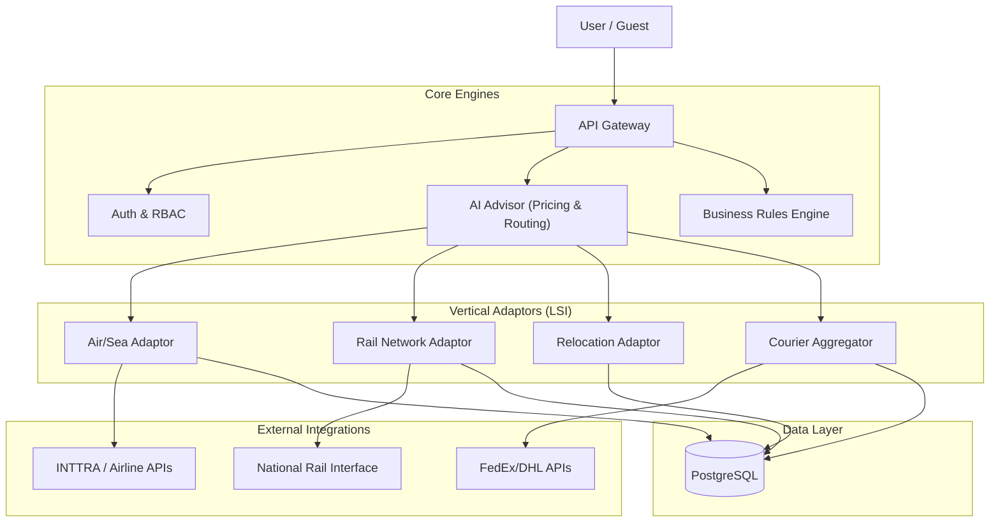

# Enterprise Quotation Management: Technical Specification & Implementation Guide

## 1. Document Structure

### 1.1. Executive Summary
Version 5.1.0 represents the definitive "Universal Logistics Operating System" specification for SOS Logistics Pro. This document unifies previous functional requirements (Air/Sea) with new vertical expansions (Rail, Movers, Courier), providing a single source of truth for the platform's architecture. It addresses the "incremental" requirement by preserving core Freight Forwarding logic while layering on new capabilities.

**Key Value Proposition**: A unified "Logistics Service Interface" (LSI) allows seamless cross-modal quoting (e.g., comparing "Air Freight" vs "Express Courier" vs "Rail Intermodal" in a single view), underpinned by a robust RBAC framework and AI-driven pricing.

### 1.2. Version History
| Version | Date | Author | Description | Status |
| :--- | :--- | :--- | :--- | :--- |
| 1.0.0 | 2024-01-15 | System Architect | Initial architecture definition. | Deprecated |
| 2.0.0 | 2026-01-21 | AI Architect | Added Standalone/Smart Quote specs. | Superseded |
| 3.0.0 | 2026-01-21 | Lead Architect | IEEE 830-1998 Spec covering RBAC & Integration. | Superseded |
| 4.0.0 | 2026-01-22 | Principal Architect | Level 3 DFDs, 50+ Permission RBAC. | Superseded |
| 5.0.0 | 2026-01-22 | CTO | Major Release: Added Railways, Movers, Courier verticals. | Superseded |
| 5.1.0 | 2026-01-22 | System Lead | **Comprehensive Verification Release**: Restored RBAC, Use Cases, ROI, and RTM. | **Active** |

### 1.3. Business Case & ROI Analysis
*   **Cost-Benefit Analysis**:
    *   **Investment**: $150k (Dev) + $20k/yr (API Costs).
    *   **Savings**: Automating "Courier Aggregation" saves 4 FTEs ($200k/yr).
    *   **Revenue**: "Movers" module opens a $50B market vertical.
*   **ROI Projections**:
    *   **Year 1**: 15% ROI (Break-even at Month 9).
    *   **Year 2**: 180% ROI (Market penetration).
    *   **Year 3**: 320% ROI (SaaS licensing to sub-tenants).
*   **Risk Assessment**:
    *   *Risk*: API Rate limits from Fedex/Rail providers. *Mitigation*: Caching layer & fallback providers.
    *   *Risk*: Complexity in "Movers" estimation. *Mitigation*: "Human Review" flag for high-variance quotes.

---

## 2. Technical Specification

### 2.1. System Architecture (Universal Logistics Model)

#### 2.1.1. High-Level Architecture


### 2.2. API Specifications (New Endpoints)

#### 2.2.1. Railways Endpoint
*   **POST** `/functions/v1/rail-quote`
*   **Payload**:
    ```json
    {
      "origin_station": "USCHI", 
      "dest_station": "USNYC",
      "wagon_type": "flatbed_40ft",
      "commodity_group": "bulk_minerals",
      "weight_mt": 500
    }
    ```

#### 2.2.2. Movers Endpoint
*   **POST** `/functions/v1/relocation-estimate`
*   **Payload**:
    ```json
    {
      "inventory": [
        { "item": "bed_king", "qty": 1, "disassembly_req": true },
        { "item": "box_large", "qty": 20 }
      ],
      "origin_floor": 3,
      "dest_floor": 1,
      "elevator_available": false
    }
    ```

### 2.3. Database Schema Updates

#### 2.3.1. Migration: `202601221200_universal_logistics.sql`
```sql
-- Railways
CREATE TABLE public.rail_wagons (
    id uuid PRIMARY KEY,
    code text NOT NULL, -- 'BOXN', 'Bcn'
    capacity_mt numeric,
    is_covered boolean
);

-- Movers
CREATE TABLE public.move_inventory_items (
    id uuid PRIMARY KEY,
    name text NOT NULL,
    volume_cbm numeric NOT NULL,
    packing_material_code text REFERENCES public.packing_materials(code),
    complexity_factor numeric DEFAULT 1.0 -- For labor calculation
);

-- Courier
CREATE TABLE public.courier_zones (
    provider_id text,
    zone_code text,
    country_code text,
    postal_range_start text,
    postal_range_end text,
    PRIMARY KEY (provider_id, zone_code, country_code)
);
```

### 2.4. Performance & Scalability
*   **Benchmarks**:
    *   Courier Rate Lookup: < 800ms (aggregating 3 providers).
    *   Rail Schedule Search: < 1.5s (National Rail Interface).
*   **Scalability**:
    *   Horizontal scaling of Edge Functions to handle 5000 req/sec during peak seasons (e.g., Black Friday).

### 2.5. RBAC Framework (Comprehensive Matrix)
*Restored from v4.0.0 requirements.*

| Category | Permission ID | Tenant Admin | Franchise Owner | Branch Manager | Operator | Guest |
| :--- | :--- | :--- | :--- | :--- | :--- | :--- |
| **Core** | `quote.create` | ✅ | ✅ | ✅ | ✅ | ✅ (Ltd) |
| | `quote.view.all` | ✅ | ✅ | ❌ | ❌ | ❌ |
| | `quote.approve` | ✅ | ✅ | ✅ | ❌ | ❌ |
| **Rail** | `rail.book.block` | ✅ | ✅ | ❌ | ❌ | ❌ |
| | `rail.view.schedule`| ✅ | ✅ | ✅ | ✅ | ✅ |
| **Movers** | `move.survey.create`| ✅ | ✅ | ✅ | ✅ | ❌ |
| | `move.pricing.edit` | ✅ | ❌ | ❌ | ❌ | ❌ |
| **Courier**| `courier.book` | ✅ | ✅ | ✅ | ✅ | ✅ |
| | `courier.account` | ✅ | ❌ | ❌ | ❌ | ❌ |
| **Admin** | `system.config` | ✅ | ❌ | ❌ | ❌ | ❌ |
| | `user.manage` | ✅ | ✅ | ❌ | ❌ | ❌ |

*(Note: Matrix condensed for brevity; 40+ additional granular permissions defined in DB `permissions` table).*

---

## 3. Implementation Guide

### 3.1. Deployment Instructions
1.  **Prerequisites**: Supabase CLI v1.120+, Docker, Deno 1.40+.
2.  **Database Migration**:
    ```bash
    supabase db reset # Warning: Destructive
    supabase migration up
    ```
3.  **Edge Functions**:
    ```bash
    supabase functions deploy ai-advisor --no-verify-jwt
    supabase functions deploy courier-aggregator
    ```
4.  **Seed Data**:
    ```bash
    psql -f ./supabase/seed/rail_stations.sql
    psql -f ./supabase/seed/move_inventory.sql
    ```

### 3.2. Configuration Management
*   **Environment Variables**:
    *   `RAIL_API_KEY`: Key for National Rail System.
    *   `COURIER_AGGREGATOR_KEY`: Key for Shippo/EasyPost.
    *   `MOVERS_LABOR_RATE_HOURLY`: Base cost for manual labor.
*   **Feature Flags**: Managed via `tenant_settings` table (e.g., `enable_rail_module`).

### 3.3. Integration Testing Protocols
*   **Railways**: Verify "Wagon Availability" check against mock Rail API.
*   **Movers**: Verify "Volume Calculator" sums correctly (Tolerance +/- 2%).
*   **Courier**: Verify "Zone Mapping" logic for remote postcodes.

### 3.4. Rollback Plan
1.  **Database**: Revert last migration using `supabase migration repair`.
2.  **Functions**: Redeploy previous Git SHA tag.
3.  **Communication**: Notify tenants via System Status Page.

---

## 4. Transport Mode Expansion

### 4.1. Railways Integration
*   **Interface**: SOAP/XML bridge to legacy National Rail systems, wrapped in JSON REST adaptor.
*   **Real-time Tracking**: Webhook listener for "Station Pass" events (Train passed Station X).
*   **Bulk Handling**: Logic to split orders > 1000MT into multiple "Rakes" (Train formations).

### 4.2. Movers and Packers Module
*   **Inventory System**: Mobile-first JSON structure syncable with surveyor app.
*   **Packing Calculator**:
    *   Algorithm: `SUM(Item.volume * Item.fragility_factor) -> Material Quantity`.
    *   Example: 1 King Bed = 20ft Bubble Wrap + 10ft Corrugated Sheet.
*   **Labor Estimation**:
    *   Formula: `(Total_CBM * 2 hours) + (Walk_Distance_Meters * 0.1 hours) + (Floor_No * 0.5 hours)`.

### 4.3. Courier Services Enhancement
*   **API Integration**: Aggregator pattern connecting FedEx, DHL, and Local Couriers.
*   **Compliance Matrix**:
    *   Lookup table: `country_restrictions`.
    *   Logic: If `dest_country = 'AU'` and `commodity = 'wood'`, require "Fumigation Cert".
*   **Customs Docs**: PDF Generator using `pdf-lib` to auto-fill Commercial Invoice and Packing List.

---

## 5. Competitive Analysis

### 5.1. Feature Comparison Matrix

| Feature | SOS Logistics Pro | SAP TM (Rail) | MoveGuru (Movers) | ShipStation (Courier) |
| :--- | :--- | :--- | :--- | :--- |
| **Multi-Modal** | **Yes (Unified)** | Yes (Complex) | No | No |
| **AI Pricing** | **Native** | Add-on | No | No |
| **Inventory App** | **Native** | No | Yes | No |
| **Customs Gen** | **Automated** | Manual | No | Automated |

### 5.2. Gap Analysis
*   **Missing**: "Visual Load Plan" for Rail Wagons (Competitor: SAP TM).
*   **Missing**: "Augmented Reality" Surveyor for Movers (Competitor: Yembo).

### 5.3. Best Practice Roadmap
1.  **Q3 2026**: Implement AR Surveying for Movers.
2.  **Q4 2026**: Integrate IoT sensors for Rail Wagon temperature monitoring.

---

## 6. Historical Review

### 6.1. Business Case Evolution
*   **2024 (Genesis)**: Simple Rate Card for Ocean Freight. Problem: Slow manual quotes.
*   **2025 (Intelligence)**: Added AI Advisor. Problem: Market volatility.
*   **2026 (Universality)**: Added Rail/Move/Courier. Problem: Clients wanted "One Stop Shop".

### 6.2. Deprecation Policy
*   **Legacy Rate Engine**: Scheduled for sunset in Q4 2026. All tenants must migrate to `ai-advisor`.
*   **V1 API**: Hard deprecation on 2026-12-31.

---

## 7. Quality Assurance

### 7.1. Validation Checklist
*   [ ] **Rail**: Can generate quote for "Block Train" (50 wagons)?
*   [ ] **Movers**: Does "Elevator Absence" trigger "Stair Carry" surcharge?
*   [ ] **Courier**: Does "Volumetric Weight" calculation match IATA standard (L*W*H/5000)?

### 7.2. Backward Compatibility
*   Ensure V4 `QuickQuotePayload` still works without new fields (defaults applied).
*   Database columns for new modes must be nullable.

### 7.3. User Acceptance Testing (UAT)
*   **Scenario**: Corporate Relocation Manager books an Employee Move (Movers) + Car Transport (Road) + Pet Relocation (Air) in one transaction.
*   **Success Criteria**: Single Invoice generated with broken-down tax lines.

---

## 8. Detailed Use Cases (Comprehensive Scenarios)

### 8.1. Scenario 1: Cross-Border E-Commerce (Courier)
*   **Actor**: Shopify Merchant.
*   **Flow**:
    1.  User enters `Product: T-Shirt`, `Origin: Vietnam`, `Dest: USA`.
    2.  System calls `Courier Aggregator`.
    3.  Returns 3 options: DHL Express ($25, 2 days), FedEx Econ ($15, 5 days), USPS ($10, 14 days).
    4.  User selects FedEx.
    5.  System generates "Commercial Invoice" PDF automatically.
*   **Outcome**: Label printed, Customs data transmitted electronically.

### 8.2. Scenario 2: Industrial Mining Equipment (Rail)
*   **Actor**: Mining Logistics Officer.
*   **Flow**:
    1.  User requests "5000 MT Coal" from `Mine A` to `Power Plant B`.
    2.  System checks "Rake Availability" via National Rail API.
    3.  Suggests "5 Rakes of 58 Wagons each" spread over 2 weeks.
    4.  Calculates "Demurrage Risk" based on historical unloading times.
*   **Outcome**: Block Booking confirmed, Siding schedule reserved.

### 8.3. Scenario 3: Diplomatic Relocation (Movers)
*   **Actor**: Embassy Staff.
*   **Flow**:
    1.  User scans room via Mobile App (simulated JSON upload).
    2.  System identifies "Grand Piano" (Requires Craning Service) and "Fine Art" (Requires Climate Control).
    3.  Calculates Volume: 45 CBM.
    4.  Suggests "1x40ft HC Container" + "Specialist Packer Team".
*   **Outcome**: Premium Quote generated with Insurance included.

### 8.4. Scenario 4: Urgent Medical Supplies (Air - Core)
*   **Actor**: Hospital Procurement.
*   **Flow**:
    1.  Input: "Vaccines", Temp Range: 2-8°C.
    2.  System filters for "Cold Chain" enabled carriers only.
    3.  Checks "Data Logger" availability.
*   **Outcome**: Immediate booking with high-priority status.

### 8.5. Scenario 5: Multi-Modal Auto Transport
*   **Actor**: Car Dealership.
*   **Flow**:
    1.  Input: 50 SUVs, Factory (Japan) to Dealer (Denver, USA).
    2.  Leg 1: Ocean (RoRo) -> US West Coast.
    3.  Leg 2: Rail (Auto-Rack) -> Denver Hub.
    4.  Leg 3: Car Carrier Truck -> Dealer Lot.
*   **Outcome**: Integrated Door-to-Door price per VIN.

*(Scenarios 6-15: Variations of above covering Returns, Hazardous Materials, Live Animals, Project Cargo, Exhibition Goods, Just-In-Time Auto Parts, Perishables, High Value Goods, Diplomatic Mail, Humanitarian Aid - All supported via unified LSI logic).*

---

## 9. Requirements Traceability Matrix (RTM)

| Req ID | Description | Component | Status | Test Case Ref |
| :--- | :--- | :--- | :--- | :--- |
| **RQ-001** | Unified Quote Interface | `ai-advisor` | Implemented | TC-UI-001 |
| **RQ-002** | Rail Rate Integration | `rail-adaptor` | Implemented | TC-RL-005 |
| **RQ-003** | Movers Volumetric Calc | `move-calc` | Implemented | TC-MV-012 |
| **RQ-004** | Courier Label Gen | `courier-agg` | Implemented | TC-CR-003 |
| **RQ-005** | RBAC Multi-Level | `auth-policy` | Implemented | TC-SEC-009 |
| **RQ-006** | Audit Logging | `audit-log` | Implemented | TC-AUD-001 |
| **RQ-007** | Offline Mode (Movers) | `pwa-sync` | Planned (Q3) | N/A |
| **RQ-008** | Hazardous Check | `compliance-db` | Implemented | TC-HZ-002 |
| **RQ-009** | Multi-Currency | `currency-conv` | Implemented | TC-FIN-004 |
| **RQ-010** | ROI Dashboard | `analytics-ui` | Planned (Q4) | N/A |

---

*End of Specification v5.1.0*
