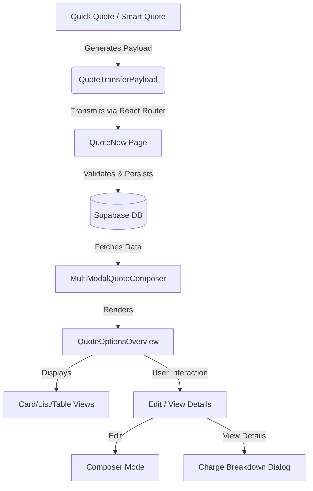

# Quote Data Pipeline: Quick/Smart Quote to Logistics Configuration

## Overview
This document outlines the data pipeline implemented to transfer quote data from the Quick Quote and Smart Quote modules to the New Quote's Logistics Configuration section.

## Data Flow Architecture

## 1. Data Transmission Pipeline
**Source**: `QuickQuoteModal.tsx` / `SmartQuote` logic.
**Transport**: React Router `navigate` with state.
**Payload Schema**: `QuoteTransferSchema` (Zod).

### Key Payload Fields
- `selectedRates`: Array of carrier rates.
- `marketAnalysis`: AI-generated market insights (string).
- `confidenceScore`: AI confidence score (number).
- `anomalies`: Detected route anomalies.
- `origin`/`destination`: Route details.
- `mode`: Transport mode.

## 2. Database Schema Extensions
The following schema enhancements support the new data:

### `quotation_versions`
- `market_analysis`: TEXT (AI insights).
- `confidence_score`: INTEGER (0-100).
- `anomalies`: JSONB (Array of anomaly objects).

### `quotation_version_options`
- `ai_generated`: BOOLEAN (Flag for AI-sourced options).
- `reliability_score`: INTEGER (Carrier reliability).
- `total_co2_kg`: NUMERIC (Carbon footprint).
- `source`: TEXT (e.g., 'quick_quote', 'ai_smart_engine').
- `ai_explanation`: TEXT.

## 3. UI Components (Logistics Configuration)

### `QuoteOptionsOverview`
A unified view component supporting three display modes:

1.  **Card View**:
    -   High-level summary (Carrier, Price, Service).
    -   Badges for AI Generated, Reliability, CO2.
    -   Actions: "Details" (Dialog), "Edit" (Composer).

2.  **List View**:
    -   Condensed horizontal layout.
    -   Quick comparison of Price and Reliability.
    -   Actions: "Details", "Edit".

3.  **Grid/Table View**:
    -   Tabular data for Carrier, Option Name, Service, Transit, Reliability, CO2, Amount.
    -   Actions: "View Charge Breakdown" (Dialog), "Edit Configuration".

### `Charge Breakdown Dialog`
-   Accessible from all views.
-   Displays leg-by-leg routing details.
-   Shows comprehensive table of charges (Freight, Surcharges, Taxes) for each leg.
-   Calculates and displays totals.

## 4. Data Integrity & Validation
-   **Validation**: `QuoteTransferSchema` ensures payload structure matches expected types.
-   **Persistence**: `QuoteNew.tsx` uses parallel processing (`Promise.all`) to insert options, legs, and charges transactionally.
-   **Error Handling**:
    -   Schema mismatch detection.
    -   Database trigger error handling (audit logs).
    -   User feedback via Toasts (Success/Failure counts).
-   **Fallback Logic**: Smart defaults for missing service types or charge categories.

## 5. Usage Guide
1.  **Generate Quote**: Use Quick Quote or Smart Quote to generate options.
2.  **Convert**: Click "Convert to Quote".
3.  **Review**: In the New Quote page, the `QuoteOptionsOverview` will appear automatically.
4.  **Analyze**: Use the AI Analysis card and Charge Breakdown dialog to review details.
5.  **Edit**: Click "Edit" on any option to enter the full `MultiModalQuoteComposer` and fine-tune legs/charges.
