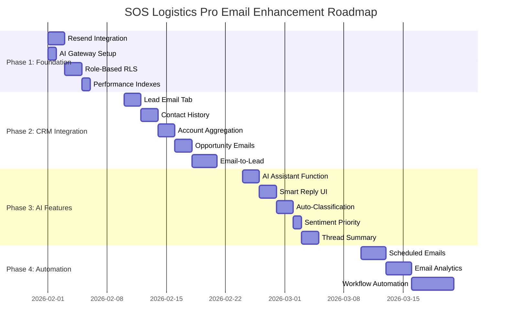

# Email Infrastructure Analysis & Enhancement Plan
## SOS Logistics Pro Multi-Tenant Platform

---

## Executive Summary

This document provides a comprehensive analysis and implementation roadmap for email functionality in **SOS Logistics Pro**, specifically designed for the platform's **Super Admin → Tenant → Franchisee** multi-tenant architecture. It covers the role-based access matrix, database optimization for performance, UI/UX best practices inspired by world-class CRMs (Salesforce, HubSpot, Pipedrive), and module-wise integration opportunities.

**Key Recommendations:**
- **Primary Email Provider**: Resend ($20/month for 50K emails)
- **Multi-Tenant Isolation**: RLS policies with tenant_id + franchise_id scoping
- **AI Enhancement**: Lovable AI Gateway (no additional API key required)
- **UI/UX Standard**: Gmail-like speed, Salesforce-like CRM integration
- **Estimated Monthly Cost**: $20-$80 depending on volume

---

## Table of Contents

1. [Multi-Tenant Architecture](#1-multi-tenant-architecture)
2. [Role Matrix & Access Control](#2-role-matrix--access-control)
3. [Communication Continuity & Team Collaboration](#3-communication-continuity--team-collaboration)
4. [Complete Activity History & 360° View](#4-complete-activity-history--360-view)
5. [Database Design for Performance](#5-database-design-for-performance)
6. [Current Implementation Status](#6-current-implementation-status)
7. [Module-Wise Implementation Plan](#7-module-wise-implementation-plan)
8. [UI/UX Design Standards](#8-uiux-design-standards)
9. [AI Enhancement Opportunities](#9-ai-enhancement-opportunities)
10. [Security & Compliance](#10-security--compliance)
11. [Implementation Roadmap](#11-implementation-roadmap)
12. [Technical Requirements](#12-technical-requirements)
13. [Cost Analysis](#13-cost-analysis)
14. [Risk Assessment](#14-risk-assessment)

---

## 1. Multi-Tenant Architecture

### 1.1 Platform Hierarchy

```
┌─────────────────────────────────────────────────────────────────────┐
│                        PLATFORM ADMIN                               │
│                   (Super Admin / System Owner)                      │
│            • Full platform access & configuration                   │
│            • Cross-tenant visibility & management                   │
│            • Global email settings & templates                      │
└───────────────────────────┬─────────────────────────────────────────┘
                            │
        ┌───────────────────┼───────────────────┐
        ▼                   ▼                   ▼
┌───────────────┐   ┌───────────────┐   ┌───────────────┐
│   TENANT A    │   │   TENANT B    │   │   TENANT C    │
│  (Company 1)  │   │  (Company 2)  │   │  (Company 3)  │
│               │   │               │   │               │
│ • Own domain  │   │ • Own domain  │   │ • Own domain  │
│ • Own users   │   │ • Own users   │   │ • Own users   │
│ • Own data    │   │ • Own data    │   │ • Own data    │
└───────┬───────┘   └───────────────┘   └───────────────┘
        │
    ┌───┴───┬───────────┐
    ▼       ▼           ▼
┌───────┐ ┌───────┐ ┌───────┐
│ FR-1  │ │ FR-2  │ │ FR-3  │
│(Office│ │(Office│ │(Office│
│  LA)  │ │  NYC) │ │  CHI) │
└───────┘ └───────┘ └───────┘
```

### 1.2 Email Visibility Hierarchy (Critical Business Rule)

The email visibility follows a **strict hierarchical cascade** model:

```
┌─────────────────────────────────────────────────────────────────────────────────┐
│                           EMAIL VISIBILITY FLOW                                  │
├─────────────────────────────────────────────────────────────────────────────────┤
│                                                                                  │
│  SUPER ADMIN (Platform Admin)                                                   │
│  ├── Can see ALL tenant emails                                                  │
│  ├── Can see ALL franchisee emails                                              │
│  ├── Can see ALL user emails across the entire platform                         │
│  └── Full administrative control over email configuration                       │
│                                                                                  │
│  TENANT ADMIN                                                                   │
│  ├── Can see ALL emails within their tenant                                     │
│  ├── Can see ALL associated franchisee emails                                   │
│  ├── Can see ALL franchisee user emails                                         │
│  └── Can manage tenant-level email templates & settings                         │
│                                                                                  │
│  FRANCHISEE ADMIN                                                               │
│  ├── Can see ALL emails within their franchisee                                 │
│  ├── Can see ALL user emails within their franchisee                            │
│  └── Can manage franchisee-level templates & settings                           │
│                                                                                  │
│  USER (Standard User)                                                           │
│  ├── Can see ONLY their own emails                                              │
│  ├── Can see emails linked to their assigned records (leads, contacts, etc.)    │
│  └── Can send emails within their permission scope                              │
│                                                                                  │
└─────────────────────────────────────────────────────────────────────────────────┘
```

### 1.3 Email Scope Matrix by Role Level

| Role Level | Own Emails | Team Emails | Franchisee Emails | Tenant Emails | All Platform Emails |
|------------|:----------:|:-----------:|:-----------------:|:-------------:|:-------------------:|
| **Super Admin** | ✅ | ✅ | ✅ (All Franchisees) | ✅ (All Tenants) | ✅ |
| **Tenant Admin** | ✅ | ✅ | ✅ (All Tenant's Franchisees) | ✅ | ❌ |
| **Franchisee Admin** | ✅ | ✅ | ✅ (Own Franchisee Only) | ❌ | ❌ |
| **Sales Manager** | ✅ | ✅ (Direct Reports) | ❌ | ❌ | ❌ |
| **Sales Rep / User** | ✅ | ❌ | ❌ | ❌ | ❌ |
| **Viewer** | ✅ (Read-Only) | ❌ | ❌ | ❌ | ❌ |

### 1.4 Enhanced Visibility Logic

```typescript
// src/lib/email-visibility.ts

/**
 * Email Visibility Determination Service
 * Implements hierarchical cascade visibility model
 */
export class EmailVisibilityService {
  /**
   * Determines what emails a user can see based on their role
   */
  static getVisibilityScope(userRole: string, context: DataAccessContext): EmailVisibilityScope {
    switch (userRole) {
      case 'platform_admin':
      case 'super_admin':
        // Super Admin: See ALL emails across entire platform
        return {
          scope: 'platform',
          filter: {}, // No filter - sees everything
          canSeeAllTenants: true,
          canSeeAllFranchisees: true,
          canSeeAllUsers: true,
        };

      case 'tenant_admin':
        // Tenant Admin: See all emails within their tenant + all franchisees + all users
        return {
          scope: 'tenant',
          filter: { tenant_id: context.tenantId },
          canSeeAllTenants: false,
          canSeeAllFranchisees: true, // All franchisees under this tenant
          canSeeAllUsers: true, // All users under this tenant
        };

      case 'franchise_admin':
        // Franchisee Admin: See all emails within their franchisee + all franchisee users
        return {
          scope: 'franchise',
          filter: { 
            tenant_id: context.tenantId,
            franchise_id: context.franchiseId 
          },
          canSeeAllTenants: false,
          canSeeAllFranchisees: false,
          canSeeAllUsers: true, // All users under this franchisee only
        };

      case 'sales_manager':
        // Sales Manager: Own emails + direct reports' emails
        return {
          scope: 'team',
          filter: { 
            tenant_id: context.tenantId,
            franchise_id: context.franchiseId,
            // Filter by team member IDs
          },
          canSeeAllTenants: false,
          canSeeAllFranchisees: false,
          canSeeAllUsers: false,
          canSeeTeam: true,
        };

      default:
        // Regular User: Only own emails
        return {
          scope: 'user',
          filter: { 
            tenant_id: context.tenantId,
            franchise_id: context.franchiseId,
            user_id: context.userId 
          },
          canSeeAllTenants: false,
          canSeeAllFranchisees: false,
          canSeeAllUsers: false,
        };
    }
  }
}

interface EmailVisibilityScope {
  scope: 'platform' | 'tenant' | 'franchise' | 'team' | 'user';
  filter: Record<string, string | undefined>;
  canSeeAllTenants: boolean;
  canSeeAllFranchisees: boolean;
  canSeeAllUsers: boolean;
  canSeeTeam?: boolean;
}
```

### 1.5 Email Data Isolation

```sql
-- All email tables enforce multi-tenant isolation via RLS
-- Example: emails table structure

emails (
  id UUID PRIMARY KEY,
  -- Multi-tenant columns (REQUIRED for hierarchical visibility)
  tenant_id UUID NOT NULL REFERENCES tenants(id),
  franchise_id UUID REFERENCES franchises(id),
  user_id UUID NOT NULL REFERENCES auth.users(id), -- Email owner
  
  -- Email metadata
  account_id UUID NOT NULL REFERENCES email_accounts(id),
  message_id TEXT NOT NULL,
  thread_id TEXT,
  
  -- Content
  subject TEXT,
  body_html TEXT,
  body_text TEXT,
  
  -- CRM Linking
  lead_id UUID REFERENCES leads(id),
  contact_id UUID REFERENCES contacts(id),
  account_id_crm UUID REFERENCES accounts(id),
  opportunity_id UUID REFERENCES opportunities(id),
  
  -- Timestamps
  created_at TIMESTAMPTZ DEFAULT now()
)
```

---

## 2. Role Matrix & Access Control

### 2.1 Role-Based Email Permissions

| Permission | Platform Admin | Tenant Admin | Franchise Admin | Sales Manager | Sales Rep | Viewer |
|------------|:-------------:|:------------:|:---------------:|:-------------:|:---------:|:------:|
| **View All Tenant Emails** | ✅ | ✅ | ❌ | ❌ | ❌ | ❌ |
| **View Franchise Emails** | ✅ | ✅ | ✅ | ✅ | ❌ | ❌ |
| **View Own Emails** | ✅ | ✅ | ✅ | ✅ | ✅ | ✅ |
| **Send Emails** | ✅ | ✅ | ✅ | ✅ | ✅ | ❌ |
| **Create Templates** | ✅ (Global) | ✅ (Tenant) | ✅ (Local) | ❌ | ❌ | ❌ |
| **Share Templates** | ✅ (All) | ✅ (Tenant) | ✅ (Franchise) | ❌ | ❌ | ❌ |
| **Configure OAuth** | ✅ | ✅ | ✅ | ❌ | ❌ | ❌ |
| **View Analytics** | ✅ (Global) | ✅ (Tenant) | ✅ (Franchise) | ✅ (Team) | ✅ (Own) | ❌ |
| **Delete Emails** | ✅ | ✅ | ✅ | ❌ | ❌ | ❌ |
| **Bulk Operations** | ✅ | ✅ | ✅ | ✅ | ❌ | ❌ |

### 2.2 Permission Implementation

```typescript
// src/lib/email-permissions.ts

export type EmailPermission = 
  | 'email.view_all'
  | 'email.view_franchise'
  | 'email.view_own'
  | 'email.send'
  | 'email.create_template'
  | 'email.share_template'
  | 'email.configure_oauth'
  | 'email.analytics'
  | 'email.delete'
  | 'email.bulk_operations';

export const ROLE_EMAIL_PERMISSIONS: Record<string, EmailPermission[]> = {
  platform_admin: [
    'email.view_all', 'email.view_franchise', 'email.view_own',
    'email.send', 'email.create_template', 'email.share_template',
    'email.configure_oauth', 'email.analytics', 'email.delete', 'email.bulk_operations'
  ],
  tenant_admin: [
    'email.view_all', 'email.view_franchise', 'email.view_own',
    'email.send', 'email.create_template', 'email.share_template',
    'email.configure_oauth', 'email.analytics', 'email.delete', 'email.bulk_operations'
  ],
  franchise_admin: [
    'email.view_franchise', 'email.view_own',
    'email.send', 'email.create_template', 'email.share_template',
    'email.configure_oauth', 'email.analytics', 'email.delete', 'email.bulk_operations'
  ],
  sales_manager: [
    'email.view_franchise', 'email.view_own',
    'email.send', 'email.analytics', 'email.bulk_operations'
  ],
  user: ['email.view_own', 'email.send', 'email.analytics'],
  viewer: ['email.view_own']
};

// Hook for checking permissions
export function useEmailPermission(permission: EmailPermission): boolean {
  const { userRole, context } = useCRM();
  return ROLE_EMAIL_PERMISSIONS[userRole]?.includes(permission) ?? false;
}
```

### 2.3 Enhanced RLS Policy Implementation (Hierarchical Cascade)

```sql
-- =====================================================
-- HELPER FUNCTIONS FOR ROLE-BASED ACCESS
-- =====================================================

-- Check if user is a Super Admin (Platform Admin)
CREATE OR REPLACE FUNCTION public.is_super_admin(_user_id UUID)
RETURNS BOOLEAN
LANGUAGE sql
STABLE
SECURITY DEFINER
SET search_path = public
AS $$
  SELECT EXISTS (
    SELECT 1 FROM public.user_roles ur
    JOIN public.auth_roles ar ON ur.role = ar.id
    WHERE ur.user_id = _user_id
    AND ar.id IN ('platform_admin', 'super_admin')
  );
$$;

-- Check if user is a Tenant Admin
CREATE OR REPLACE FUNCTION public.is_tenant_admin(_user_id UUID)
RETURNS BOOLEAN
LANGUAGE sql
STABLE
SECURITY DEFINER
SET search_path = public
AS $$
  SELECT EXISTS (
    SELECT 1 FROM public.user_roles ur
    JOIN public.auth_roles ar ON ur.role = ar.id
    WHERE ur.user_id = _user_id
    AND ar.id = 'tenant_admin'
  );
$$;

-- Check if user is a Franchisee Admin
CREATE OR REPLACE FUNCTION public.is_franchise_admin(_user_id UUID)
RETURNS BOOLEAN
LANGUAGE sql
STABLE
SECURITY DEFINER
SET search_path = public
AS $$
  SELECT EXISTS (
    SELECT 1 FROM public.user_roles ur
    JOIN public.auth_roles ar ON ur.role = ar.id
    WHERE ur.user_id = _user_id
    AND ar.id = 'franchise_admin'
  );
$$;

-- Get all franchisee IDs under a tenant
CREATE OR REPLACE FUNCTION public.get_tenant_franchise_ids(_tenant_id UUID)
RETURNS UUID[]
LANGUAGE sql
STABLE
SECURITY DEFINER
SET search_path = public
AS $$
  SELECT ARRAY_AGG(id) FROM public.franchises 
  WHERE tenant_id = _tenant_id AND is_active = true;
$$;

-- Get all user IDs within a franchisee
CREATE OR REPLACE FUNCTION public.get_franchise_user_ids(_franchise_id UUID)
RETURNS UUID[]
LANGUAGE sql
STABLE
SECURITY DEFINER
SET search_path = public
AS $$
  SELECT ARRAY_AGG(user_id) FROM public.profiles 
  WHERE franchise_id = _franchise_id;
$$;

-- =====================================================
-- EMAIL VISIBILITY RLS POLICY (Hierarchical Cascade)
-- =====================================================

-- Drop existing policy if exists
DROP POLICY IF EXISTS "Email access based on role scope" ON public.emails;

-- Create comprehensive hierarchical visibility policy
CREATE POLICY "Email hierarchical visibility"
ON public.emails
FOR SELECT
TO authenticated
USING (
  -- =====================================================
  -- LEVEL 1: SUPER ADMIN (Platform Admin)
  -- Can see ALL emails across entire platform
  -- =====================================================
  public.is_super_admin(auth.uid())
  
  OR
  
  -- =====================================================
  -- LEVEL 2: TENANT ADMIN
  -- Can see ALL emails within their tenant:
  --   - All tenant-level emails
  --   - All associated franchisee emails
  --   - All franchisee user emails
  -- =====================================================
  (
    public.is_tenant_admin(auth.uid())
    AND tenant_id = public.get_user_tenant_id(auth.uid())
    -- This includes:
    -- - Emails where tenant_id matches (covers all franchisees under tenant)
    -- - No additional filter needed since franchise_id is always under tenant_id
  )
  
  OR
  
  -- =====================================================
  -- LEVEL 3: FRANCHISEE ADMIN
  -- Can see ALL emails within their franchisee:
  --   - All franchisee-level emails
  --   - All franchisee user emails
  -- =====================================================
  (
    public.is_franchise_admin(auth.uid())
    AND tenant_id = public.get_user_tenant_id(auth.uid())
    AND franchise_id = public.get_user_franchise_id(auth.uid())
  )
  
  OR
  
  -- =====================================================
  -- LEVEL 4: SALES MANAGER
  -- Can see own emails + direct reports' emails
  -- =====================================================
  (
    public.has_role(auth.uid(), 'sales_manager')
    AND tenant_id = public.get_user_tenant_id(auth.uid())
    AND franchise_id = public.get_user_franchise_id(auth.uid())
    AND (
      -- Own emails via email account ownership
      account_id IN (SELECT id FROM email_accounts WHERE user_id = auth.uid())
      OR
      -- Direct reports' emails (users reporting to this manager)
      account_id IN (
        SELECT ea.id FROM email_accounts ea
        JOIN profiles p ON ea.user_id = p.id
        WHERE p.reports_to = auth.uid()
      )
    )
  )
  
  OR
  
  -- =====================================================
  -- LEVEL 5: REGULAR USER
  -- Can see ONLY their own emails + emails linked to assigned records
  -- =====================================================
  (
    tenant_id = public.get_user_tenant_id(auth.uid())
    AND (
      -- Direct ownership through email account
      account_id IN (SELECT id FROM email_accounts WHERE user_id = auth.uid())
      OR
      -- Related to assigned leads
      lead_id IN (SELECT id FROM leads WHERE owner_id = auth.uid())
      OR
      -- Related to assigned contacts
      contact_id IN (SELECT id FROM contacts WHERE owner_id = auth.uid())
      OR
      -- Related to assigned accounts (CRM)
      account_id_crm IN (SELECT id FROM accounts WHERE owner_id = auth.uid())
      OR
      -- Related to assigned opportunities
      opportunity_id IN (SELECT id FROM opportunities WHERE owner_id = auth.uid())
    )
  )
);

-- =====================================================
-- EMAIL ACCOUNTS VISIBILITY (Same Hierarchy)
-- =====================================================
CREATE POLICY "Email accounts hierarchical visibility"
ON public.email_accounts
FOR SELECT
TO authenticated
USING (
  -- Super Admin sees all
  public.is_super_admin(auth.uid())
  OR
  -- Tenant Admin sees all within tenant
  (public.is_tenant_admin(auth.uid()) 
   AND tenant_id = public.get_user_tenant_id(auth.uid()))
  OR
  -- Franchisee Admin sees all within franchisee
  (public.is_franchise_admin(auth.uid()) 
   AND tenant_id = public.get_user_tenant_id(auth.uid())
   AND franchise_id = public.get_user_franchise_id(auth.uid()))
  OR
  -- Regular users see only their own accounts
  (user_id = auth.uid())
);

-- =====================================================
-- EMAIL TEMPLATES VISIBILITY (Hierarchical + Sharing)
-- =====================================================
CREATE POLICY "Email templates hierarchical visibility"
ON public.email_templates
FOR SELECT
TO authenticated
USING (
  -- Super Admin sees all templates
  public.is_super_admin(auth.uid())
  OR
  -- Global templates (created by platform admin, shared to all)
  (is_shared = true AND tenant_id IS NULL)
  OR
  -- Tenant Admin sees all tenant templates + all franchisee templates
  (public.is_tenant_admin(auth.uid()) 
   AND tenant_id = public.get_user_tenant_id(auth.uid()))
  OR
  -- Tenant-shared templates visible to tenant members
  (is_shared = true AND tenant_id = public.get_user_tenant_id(auth.uid()))
  OR
  -- Franchisee Admin sees franchisee templates
  (public.is_franchise_admin(auth.uid()) 
   AND franchise_id = public.get_user_franchise_id(auth.uid()))
  OR
  -- Franchise templates for franchise members
  (franchise_id = public.get_user_franchise_id(auth.uid()))
  OR
  -- Own templates
  (created_by = auth.uid())
);

-- =====================================================
-- EMAIL FILTERS VISIBILITY
-- =====================================================
CREATE POLICY "Email filters hierarchical visibility"
ON public.email_filters
FOR SELECT
TO authenticated
USING (
  -- Super Admin sees all
  public.is_super_admin(auth.uid())
  OR
  -- Tenant Admin sees all within tenant
  (public.is_tenant_admin(auth.uid()) 
   AND tenant_id = public.get_user_tenant_id(auth.uid()))
  OR
  -- Users see only their own filters
  (user_id = auth.uid())
);
```

### 2.4 Visibility Verification Functions

```sql
-- Function to verify email visibility for debugging/auditing
CREATE OR REPLACE FUNCTION public.debug_email_visibility(_email_id UUID)
RETURNS JSON
LANGUAGE plpgsql
SECURITY DEFINER
SET search_path = public
AS $$
DECLARE
  result JSON;
  email_record RECORD;
  viewer_tenant_id UUID;
  viewer_franchise_id UUID;
BEGIN
  -- Get email details
  SELECT * INTO email_record FROM emails WHERE id = _email_id;
  
  -- Get viewer's context
  viewer_tenant_id := public.get_user_tenant_id(auth.uid());
  viewer_franchise_id := public.get_user_franchise_id(auth.uid());
  
  result := json_build_object(
    'email_id', _email_id,
    'email_tenant_id', email_record.tenant_id,
    'email_franchise_id', email_record.franchise_id,
    'viewer_id', auth.uid(),
    'viewer_tenant_id', viewer_tenant_id,
    'viewer_franchise_id', viewer_franchise_id,
    'is_super_admin', public.is_super_admin(auth.uid()),
    'is_tenant_admin', public.is_tenant_admin(auth.uid()),
    'is_franchise_admin', public.is_franchise_admin(auth.uid()),
    'can_view', (
      public.is_super_admin(auth.uid())
      OR (public.is_tenant_admin(auth.uid()) AND email_record.tenant_id = viewer_tenant_id)
      OR (public.is_franchise_admin(auth.uid()) AND email_record.franchise_id = viewer_franchise_id)
      OR email_record.account_id IN (SELECT id FROM email_accounts WHERE user_id = auth.uid())
    )
  );
  
  RETURN result;
END;
$$;
```

---

## 3. Communication Continuity & Team Collaboration

### 3.1 Industry Research: How Top CRMs Handle Vacation Coverage

Based on research of **Salesforce**, **HubSpot**, **Zoho**, **Pipedrive**, and **Freshsales**, here's how leading CRMs solve the vacation/handover problem:

```
┌─────────────────────────────────────────────────────────────────────────────────────┐
│                    TOP CRM COMMUNICATION CONTINUITY PATTERNS                         │
├─────────────────────────────────────────────────────────────────────────────────────┤
│                                                                                      │
│  ┌─────────────────────────────────────────────────────────────────────────────┐    │
│  │ 1. RECORD-LEVEL EMAIL ASSOCIATION (Salesforce, HubSpot)                     │    │
│  │    • All emails are linked to RECORDS (Lead, Contact, Account, Opportunity) │    │
│  │    • Anyone with record access can see ALL communication history            │    │
│  │    • Email is NOT personal - it belongs to the RECORD                       │    │
│  └─────────────────────────────────────────────────────────────────────────────┘    │
│                                                                                      │
│  ┌─────────────────────────────────────────────────────────────────────────────┐    │
│  │ 2. SHARED INBOX / TEAM INBOX (Zoho TeamInbox, Freshworks, HubSpot)         │    │
│  │    • Team-shared email addresses (sales@company.com)                        │    │
│  │    • All team members see all conversations                                 │    │
│  │    • Assignment, @mentions, internal notes                                  │    │
│  └─────────────────────────────────────────────────────────────────────────────┘    │
│                                                                                      │
│  ┌─────────────────────────────────────────────────────────────────────────────┐    │
│  │ 3. ACTIVITY TIMELINE (Salesforce, Dynamics 365)                             │    │
│  │    • Unified view of ALL touchpoints on a record                            │    │
│  │    • Emails, calls, meetings, notes, tasks - all in one timeline            │    │
│  │    • Filterable by type, date, user                                         │    │
│  └─────────────────────────────────────────────────────────────────────────────┘    │
│                                                                                      │
│  ┌─────────────────────────────────────────────────────────────────────────────┐    │
│  │ 4. USER AVAILABILITY / OUT-OF-OFFICE (HubSpot, Salesforce)                  │    │
│  │    • Users set "Out of Office" status                                       │    │
│  │    • Auto-reassignment of conversations                                     │    │
│  │    • Backup user receives notifications                                     │    │
│  └─────────────────────────────────────────────────────────────────────────────┘    │
│                                                                                      │
│  ┌─────────────────────────────────────────────────────────────────────────────┐    │
│  │ 5. CUSTOMER 360° VIEW (Salesforce Customer 360, Gainsight)                  │    │
│  │    • Complete customer profile with all interactions                        │    │
│  │    • Cross-departmental visibility (Sales, Marketing, Support)              │    │
│  │    • Real-time sync across all touchpoints                                  │    │
│  └─────────────────────────────────────────────────────────────────────────────┘    │
│                                                                                      │
└─────────────────────────────────────────────────────────────────────────────────────┘
```

### 3.2 SOS Logistics Pro: Recommended Communication Model

#### Option A: Record-Centric Email Model (RECOMMENDED)

```
┌─────────────────────────────────────────────────────────────────────────────────────┐
│                     RECORD-CENTRIC EMAIL VISIBILITY MODEL                            │
│                                                                                      │
│  User A creates Lead "ABC Corp" and sends email → Email linked to Lead             │
│                                                                                      │
│  ┌─────────────────────────────┐          ┌─────────────────────────────┐           │
│  │       USER A (Owner)        │          │       USER B (Colleague)    │           │
│  │  • Creates Lead "ABC Corp"  │          │  • Has access to Lead view  │           │
│  │  • Sends email to lead      │          │  • Can see ALL emails on    │           │
│  │  • On vacation              │──────────│    the Lead record          │           │
│  │                             │          │  • Can continue conversation│           │
│  └─────────────────────────────┘          └─────────────────────────────┘           │
│                                                                                      │
│  KEY PRINCIPLE: "If you can see the record, you can see its communications"        │
│                                                                                      │
└─────────────────────────────────────────────────────────────────────────────────────┘
```

#### Implementation for SOS Logistics Pro

```typescript
// src/lib/email-record-association.ts

/**
 * Email Association Service
 * Follows Salesforce/HubSpot pattern: emails belong to RECORDS, not users
 */

export interface EmailAssociation {
  email_id: string;
  // Record associations - email can be linked to multiple records
  lead_id?: string;
  contact_id?: string;
  account_id?: string;
  opportunity_id?: string;
  quote_id?: string;
  shipment_id?: string;
  // Primary record determines main visibility
  primary_record_type: 'lead' | 'contact' | 'account' | 'opportunity' | 'quote' | 'shipment';
  primary_record_id: string;
}

/**
 * Visibility Logic:
 * 1. User can see email if they can see ANY associated record
 * 2. This means team members covering for vacationing colleague see all relevant emails
 * 3. Managers with record access automatically see team communications
 */
export function canUserSeeRecordEmail(
  userId: string,
  userRole: string,
  recordOwnerId: string,
  recordTenantId: string,
  recordFranchiseId: string,
  context: DataAccessContext
): boolean {
  // Super Admin: sees everything
  if (context.isPlatformAdmin) return true;
  
  // Tenant Admin: sees all within tenant
  if (userRole === 'tenant_admin' && context.tenantId === recordTenantId) return true;
  
  // Franchise Admin: sees all within franchise
  if (userRole === 'franchise_admin' && context.franchiseId === recordFranchiseId) return true;
  
  // Sales Manager: sees team records
  if (userRole === 'sales_manager') {
    // Check if record owner is in user's team
    return isUserInTeam(recordOwnerId, userId);
  }
  
  // Regular user: only if assigned to record or is owner
  return recordOwnerId === userId || isUserAssignedToRecord(userId, recordId);
}
```

### 3.3 Shared Inbox Implementation

```sql
-- =====================================================
-- SHARED INBOX / TEAM EMAIL SUPPORT
-- =====================================================

-- Team Inboxes for shared email addresses
CREATE TABLE public.shared_inboxes (
  id UUID PRIMARY KEY DEFAULT gen_random_uuid(),
  tenant_id UUID NOT NULL REFERENCES tenants(id),
  franchise_id UUID REFERENCES franchises(id),
  
  -- Inbox details
  name TEXT NOT NULL, -- e.g., "Sales Team", "Support"
  email_address TEXT NOT NULL, -- e.g., sales@company.com
  description TEXT,
  
  -- Configuration
  auto_assign BOOLEAN DEFAULT false,
  assignment_method TEXT DEFAULT 'round_robin', -- round_robin, least_busy, manual
  
  -- Metadata
  is_active BOOLEAN DEFAULT true,
  created_at TIMESTAMPTZ DEFAULT now(),
  
  CONSTRAINT unique_tenant_inbox_email UNIQUE (tenant_id, email_address)
);

-- Team inbox membership
CREATE TABLE public.shared_inbox_members (
  id UUID PRIMARY KEY DEFAULT gen_random_uuid(),
  inbox_id UUID NOT NULL REFERENCES shared_inboxes(id) ON DELETE CASCADE,
  user_id UUID NOT NULL REFERENCES auth.users(id) ON DELETE CASCADE,
  
  -- Role in inbox
  role TEXT DEFAULT 'member', -- owner, admin, member
  
  -- Notifications
  receive_notifications BOOLEAN DEFAULT true,
  
  created_at TIMESTAMPTZ DEFAULT now(),
  
  CONSTRAINT unique_inbox_member UNIQUE (inbox_id, user_id)
);

-- RLS: All inbox members can see all inbox emails
CREATE POLICY "Shared inbox email visibility"
ON public.emails
FOR SELECT
TO authenticated
USING (
  -- If email belongs to a shared inbox the user is member of
  EXISTS (
    SELECT 1 FROM shared_inbox_members sim
    JOIN shared_inboxes si ON sim.inbox_id = si.id
    JOIN email_accounts ea ON ea.email_address = si.email_address
    WHERE sim.user_id = auth.uid()
    AND ea.id = emails.account_id
  )
);
```

### 3.4 User Availability & Out-of-Office (HubSpot Pattern)

```sql
-- =====================================================
-- USER AVAILABILITY MANAGEMENT
-- =====================================================

CREATE TABLE public.user_availability (
  id UUID PRIMARY KEY DEFAULT gen_random_uuid(),
  user_id UUID NOT NULL REFERENCES auth.users(id) ON DELETE CASCADE,
  tenant_id UUID NOT NULL REFERENCES tenants(id),
  franchise_id UUID REFERENCES franchises(id),
  
  -- Status
  status TEXT DEFAULT 'available', -- available, busy, away, out_of_office
  
  -- Out of Office settings
  out_of_office_start TIMESTAMPTZ,
  out_of_office_end TIMESTAMPTZ,
  out_of_office_message TEXT,
  
  -- Backup/Coverage
  backup_user_id UUID REFERENCES auth.users(id),
  auto_reassign_conversations BOOLEAN DEFAULT false,
  auto_reassign_new_leads BOOLEAN DEFAULT false,
  
  -- Working hours (for routing)
  working_hours JSONB DEFAULT '{"monday":{"start":"09:00","end":"17:00"}}'::jsonb,
  timezone TEXT DEFAULT 'UTC',
  
  created_at TIMESTAMPTZ DEFAULT now(),
  updated_at TIMESTAMPTZ DEFAULT now(),
  
  CONSTRAINT unique_user_availability UNIQUE (user_id)
);

-- Index for quick lookup of available users
CREATE INDEX idx_user_availability_status ON user_availability(tenant_id, franchise_id, status);
CREATE INDEX idx_user_availability_backup ON user_availability(backup_user_id);
```

```typescript
// src/lib/user-availability.ts

export interface UserAvailability {
  userId: string;
  status: 'available' | 'busy' | 'away' | 'out_of_office';
  outOfOffice?: {
    start: Date;
    end: Date;
    message: string;
    backupUserId?: string;
  };
}

/**
 * When user is out of office:
 * 1. Show OOO badge on their profile
 * 2. Auto-route new conversations to backup user
 * 3. Backup user receives notifications
 * 4. All team members with record access can still see communications
 */
export async function handleOutOfOfficeRouting(
  originalOwnerId: string,
  recordType: string,
  recordId: string
): Promise<string | null> {
  const availability = await getUserAvailability(originalOwnerId);
  
  if (availability.status === 'out_of_office' && availability.outOfOffice?.backupUserId) {
    // Auto-assign to backup user
    return availability.outOfOffice.backupUserId;
  }
  
  return null; // Keep with original owner
}
```

### 3.5 Vacation Handover Workflow (Best Practice from Top CRMs)

```
┌─────────────────────────────────────────────────────────────────────────────────────┐
│                      VACATION HANDOVER WORKFLOW                                      │
├─────────────────────────────────────────────────────────────────────────────────────┤
│                                                                                      │
│  BEFORE VACATION (User Action):                                                     │
│  ┌─────────────────────────────────────────────────────────────────────────────┐    │
│  │ 1. Set status to "Out of Office"                                            │    │
│  │ 2. Set vacation dates (start/end)                                           │    │
│  │ 3. Select backup user                                                        │    │
│  │ 4. Toggle: "Auto-reassign new conversations"                                │    │
│  │ 5. Add out-of-office message                                                 │    │
│  └─────────────────────────────────────────────────────────────────────────────┘    │
│                                                                                      │
│  DURING VACATION (System Behavior):                                                 │
│  ┌─────────────────────────────────────────────────────────────────────────────┐    │
│  │ 1. New emails to user's records → Notification to backup user               │    │
│  │ 2. Backup user can view & reply to all conversations                        │    │
│  │ 3. Internal notes added: "[Handled by BackupUser during vacation]"          │    │
│  │ 4. Original user's profile shows OOO badge                                  │    │
│  │ 5. Timeline shows who handled each communication                            │    │
│  └─────────────────────────────────────────────────────────────────────────────┘    │
│                                                                                      │
│  AFTER VACATION (Return Sync):                                                      │
│  ┌─────────────────────────────────────────────────────────────────────────────┐    │
│  │ 1. User sees summary: "5 conversations handled during your absence"         │    │
│  │ 2. All communication history visible in record timeline                     │    │
│  │ 3. Automatic status reset to "Available"                                    │    │
│  │ 4. Option to take back reassigned records or keep with backup               │    │
│  └─────────────────────────────────────────────────────────────────────────────┘    │
│                                                                                      │
└─────────────────────────────────────────────────────────────────────────────────────┘
```

---

## 4. Complete Activity History & 360° View

### 4.1 Industry Standard: Unified Activity Timeline

Based on **Salesforce Activity 360**, **Dynamics 365 Timeline**, and **HubSpot Activity Feed**:

```
┌─────────────────────────────────────────────────────────────────────────────────────┐
│                      ACTIVITY TIMELINE ARCHITECTURE                                  │
├─────────────────────────────────────────────────────────────────────────────────────┤
│                                                                                      │
│  ┌─────────────────────────────────────────────────────────────────────────────┐    │
│  │                     RECORD ACTIVITY TIMELINE                                │    │
│  │                                                                              │    │
│  │  ──────────────────────────────────────────────────────────────────────     │    │
│  │  ▼ Today                                                                     │    │
│  │  ├─📧 Email: "Re: Quote for ocean freight" - John (2 hours ago)             │    │
│  │  ├─📞 Call: 15 min call with client - Sarah (4 hours ago)                   │    │
│  │  ├─📝 Note: "Client confirmed budget approval" - John (5 hours ago)         │    │
│  │  ──────────────────────────────────────────────────────────────────────     │    │
│  │  ▼ Yesterday                                                                 │    │
│  │  ├─📄 Quote: Version 2 sent - System                                        │    │
│  │  ├─📧 Email: "Quote attached" - John                                        │    │
│  │  ├─✅ Task: "Follow up on quote" completed - Sarah                          │    │
│  │  ──────────────────────────────────────────────────────────────────────     │    │
│  │  ▼ Last Week                                                                 │    │
│  │  ├─🚀 Stage Change: Lead → Opportunity - John                               │    │
│  │  ├─📅 Meeting: "Initial discovery call" - John, Sarah                       │    │
│  │  ├─📧 Email: "Introduction" - John                                          │    │
│  │  └─➕ Created: Lead created from web form - System                          │    │
│  │                                                                              │    │
│  └─────────────────────────────────────────────────────────────────────────────┘    │
│                                                                                      │
└─────────────────────────────────────────────────────────────────────────────────────┘
```

### 4.2 Platform-Wide Activity Logging

#### Activity History at Different Levels

| Level | What to Track | Who Can See | Use Case |
|-------|--------------|-------------|----------|
| **Platform** | All activities across all tenants | Super Admin only | System health, compliance audits |
| **Tenant** | All activities within tenant | Tenant Admin + | Business analytics, team performance |
| **Franchisee** | All activities within franchisee | Franchise Admin + | Local team management |
| **User** | Own activities | Self + Managers | Personal productivity |
| **Record** | All activities on a record | Anyone with record access | Customer communication history |

### 4.3 Unified Activity Table Design

```sql
-- =====================================================
-- UNIFIED ACTIVITY TRACKING (Customer 360 Pattern)
-- =====================================================

CREATE TABLE public.activity_timeline (
  id UUID PRIMARY KEY DEFAULT gen_random_uuid(),
  
  -- Multi-tenant scope
  tenant_id UUID NOT NULL REFERENCES tenants(id),
  franchise_id UUID REFERENCES franchises(id),
  
  -- Actor
  user_id UUID REFERENCES auth.users(id), -- Who performed the action (NULL for system)
  user_name TEXT, -- Cached for performance
  
  -- Activity type
  activity_type TEXT NOT NULL, -- email, call, note, task, meeting, stage_change, created, etc.
  activity_subtype TEXT, -- email_sent, email_received, call_inbound, etc.
  
  -- Related record (polymorphic)
  record_type TEXT NOT NULL, -- lead, contact, account, opportunity, quote, shipment
  record_id UUID NOT NULL,
  record_name TEXT, -- Cached for display
  
  -- Activity details
  subject TEXT NOT NULL,
  description TEXT,
  metadata JSONB DEFAULT '{}', -- Type-specific data
  
  -- Related email (if applicable)
  email_id UUID REFERENCES emails(id),
  
  -- Timestamps
  occurred_at TIMESTAMPTZ NOT NULL DEFAULT now(),
  created_at TIMESTAMPTZ DEFAULT now(),
  
  -- Full-text search
  search_vector TSVECTOR GENERATED ALWAYS AS (
    setweight(to_tsvector('english', coalesce(subject, '')), 'A') ||
    setweight(to_tsvector('english', coalesce(description, '')), 'B') ||
    setweight(to_tsvector('english', coalesce(record_name, '')), 'C')
  ) STORED
);

-- Indexes for fast querying
CREATE INDEX idx_activity_record ON activity_timeline(record_type, record_id, occurred_at DESC);
CREATE INDEX idx_activity_tenant ON activity_timeline(tenant_id, occurred_at DESC);
CREATE INDEX idx_activity_franchise ON activity_timeline(tenant_id, franchise_id, occurred_at DESC);
CREATE INDEX idx_activity_user ON activity_timeline(user_id, occurred_at DESC);
CREATE INDEX idx_activity_type ON activity_timeline(activity_type, occurred_at DESC);
CREATE INDEX idx_activity_search ON activity_timeline USING GIN(search_vector);

-- Partitioning for large-scale deployments (optional)
-- Consider partitioning by tenant_id and time for very large datasets
```

### 4.4 Activity Timeline RLS Policies

```sql
-- =====================================================
-- ACTIVITY TIMELINE VISIBILITY (Hierarchical)
-- =====================================================

CREATE POLICY "Activity timeline hierarchical visibility"
ON public.activity_timeline
FOR SELECT
TO authenticated
USING (
  -- Super Admin: sees ALL platform activities
  public.is_super_admin(auth.uid())
  OR
  -- Tenant Admin: sees all tenant activities
  (public.is_tenant_admin(auth.uid()) 
   AND tenant_id = public.get_user_tenant_id(auth.uid()))
  OR
  -- Franchise Admin: sees all franchise activities
  (public.is_franchise_admin(auth.uid()) 
   AND franchise_id = public.get_user_franchise_id(auth.uid()))
  OR
  -- Anyone with record access can see record activities
  -- (Uses record-level permissions)
  public.can_access_record(auth.uid(), record_type, record_id)
);

-- Helper function to check record access
CREATE OR REPLACE FUNCTION public.can_access_record(
  _user_id UUID,
  _record_type TEXT,
  _record_id UUID
)
RETURNS BOOLEAN
LANGUAGE plpgsql
STABLE
SECURITY DEFINER
SET search_path = public
AS $$
DECLARE
  has_access BOOLEAN;
BEGIN
  -- Dynamic check based on record type
  CASE _record_type
    WHEN 'lead' THEN
      SELECT EXISTS (
        SELECT 1 FROM leads 
        WHERE id = _record_id 
        AND (owner_id = _user_id OR assigned_to = _user_id
             OR tenant_id = public.get_user_tenant_id(_user_id))
      ) INTO has_access;
    WHEN 'contact' THEN
      SELECT EXISTS (
        SELECT 1 FROM contacts 
        WHERE id = _record_id 
        AND (owner_id = _user_id 
             OR tenant_id = public.get_user_tenant_id(_user_id))
      ) INTO has_access;
    WHEN 'account' THEN
      SELECT EXISTS (
        SELECT 1 FROM accounts 
        WHERE id = _record_id 
        AND (owner_id = _user_id 
             OR tenant_id = public.get_user_tenant_id(_user_id))
      ) INTO has_access;
    WHEN 'opportunity' THEN
      SELECT EXISTS (
        SELECT 1 FROM opportunities 
        WHERE id = _record_id 
        AND (owner_id = _user_id 
             OR tenant_id = public.get_user_tenant_id(_user_id))
      ) INTO has_access;
    WHEN 'quote' THEN
      SELECT EXISTS (
        SELECT 1 FROM quotes 
        WHERE id = _record_id 
        AND tenant_id = public.get_user_tenant_id(_user_id)
      ) INTO has_access;
    WHEN 'shipment' THEN
      SELECT EXISTS (
        SELECT 1 FROM shipments 
        WHERE id = _record_id 
        AND tenant_id = public.get_user_tenant_id(_user_id)
      ) INTO has_access;
    ELSE
      has_access := false;
  END CASE;
  
  RETURN has_access;
END;
$$;
```

### 4.5 Complete Communication History View

```typescript
// src/components/crm/ActivityTimeline.tsx

interface ActivityTimelineProps {
  recordType: 'lead' | 'contact' | 'account' | 'opportunity' | 'quote' | 'shipment';
  recordId: string;
  scope?: 'record' | 'franchise' | 'tenant' | 'platform';
}

/**
 * Unified Activity Timeline Component
 * Shows complete history of all interactions with a record/entity
 * 
 * Features (inspired by Salesforce & HubSpot):
 * - Chronological timeline view
 * - Filter by activity type (emails, calls, notes, tasks)
 * - Filter by user
 * - Group by day/week/month
 * - Quick inline actions (reply to email, add note)
 * - Real-time updates via Supabase Realtime
 */

// Activity types for SOS Logistics Pro
export const ACTIVITY_TYPES = {
  // Communication
  email_sent: { icon: 'Mail', color: 'blue', label: 'Email Sent' },
  email_received: { icon: 'MailOpen', color: 'green', label: 'Email Received' },
  call_outbound: { icon: 'PhoneOutgoing', color: 'orange', label: 'Outbound Call' },
  call_inbound: { icon: 'PhoneIncoming', color: 'teal', label: 'Inbound Call' },
  meeting: { icon: 'Calendar', color: 'purple', label: 'Meeting' },
  
  // Notes & Tasks
  note: { icon: 'FileText', color: 'gray', label: 'Note' },
  task_created: { icon: 'CheckSquare', color: 'yellow', label: 'Task Created' },
  task_completed: { icon: 'CheckCircle', color: 'green', label: 'Task Completed' },
  
  // Record changes
  stage_change: { icon: 'ArrowRight', color: 'indigo', label: 'Stage Changed' },
  owner_change: { icon: 'UserCheck', color: 'pink', label: 'Owner Changed' },
  created: { icon: 'Plus', color: 'emerald', label: 'Created' },
  
  // Logistics-specific
  shipment_created: { icon: 'Ship', color: 'blue', label: 'Shipment Created' },
  shipment_status: { icon: 'Truck', color: 'amber', label: 'Status Updated' },
  document_uploaded: { icon: 'Upload', color: 'slate', label: 'Document Uploaded' },
  quote_sent: { icon: 'FileCheck', color: 'violet', label: 'Quote Sent' },
};
```

### 4.6 Shipment Communication History (Logistics-Specific)

```sql
-- =====================================================
-- SHIPMENT-SPECIFIC ACTIVITY TRACKING
-- =====================================================

-- All communications related to a shipment are tracked
-- This allows any team member to see complete history

CREATE OR REPLACE VIEW public.shipment_communication_history AS
SELECT 
  s.id AS shipment_id,
  s.reference_number,
  at.id AS activity_id,
  at.activity_type,
  at.subject,
  at.description,
  at.occurred_at,
  at.user_name,
  at.email_id,
  e.from_email,
  e.to_emails,
  e.body_text
FROM shipments s
LEFT JOIN activity_timeline at ON at.record_type = 'shipment' AND at.record_id = s.id
LEFT JOIN emails e ON e.id = at.email_id
ORDER BY at.occurred_at DESC;

-- Query for complete shipment history (with all related records)
CREATE OR REPLACE FUNCTION public.get_shipment_full_history(_shipment_id UUID)
RETURNS TABLE (
  activity_id UUID,
  activity_type TEXT,
  subject TEXT,
  description TEXT,
  occurred_at TIMESTAMPTZ,
  user_name TEXT,
  related_record_type TEXT,
  related_record_name TEXT
)
LANGUAGE sql
STABLE
SECURITY DEFINER
SET search_path = public
AS $$
  -- Get activities directly on shipment
  SELECT id, activity_type, subject, description, occurred_at, user_name, 
         'shipment' as related_record_type, NULL as related_record_name
  FROM activity_timeline WHERE record_type = 'shipment' AND record_id = _shipment_id
  
  UNION ALL
  
  -- Get activities on related opportunity
  SELECT at.id, at.activity_type, at.subject, at.description, at.occurred_at, at.user_name,
         'opportunity' as related_record_type, o.name
  FROM activity_timeline at
  JOIN opportunities o ON o.id = at.record_id
  JOIN shipments s ON s.opportunity_id = o.id
  WHERE at.record_type = 'opportunity' AND s.id = _shipment_id
  
  UNION ALL
  
  -- Get activities on related account
  SELECT at.id, at.activity_type, at.subject, at.description, at.occurred_at, at.user_name,
         'account' as related_record_type, a.name
  FROM activity_timeline at
  JOIN accounts a ON a.id = at.record_id
  JOIN shipments s ON s.account_id = a.id
  WHERE at.record_type = 'account' AND s.id = _shipment_id
  
  ORDER BY occurred_at DESC
$$;
```

### 4.7 Platform-Wide Communication Dashboard

```
┌─────────────────────────────────────────────────────────────────────────────────────┐
│                    COMMUNICATION HISTORY DASHBOARD                                   │
├─────────────────────────────────────────────────────────────────────────────────────┤
│                                                                                      │
│  ┌─ Scope Selector ──────────────────────────────────────────────────────────────┐  │
│  │  [Platform ▼]  [All Tenants ▼]  [All Franchisees ▼]  [All Time ▼]            │  │
│  └───────────────────────────────────────────────────────────────────────────────┘  │
│                                                                                      │
│  ┌─ Summary Stats ───────────────────────────────────────────────────────────────┐  │
│  │  📧 12,456 Emails  │  📞 3,421 Calls  │  📝 8,901 Notes  │  ✅ 5,678 Tasks   │  │
│  └───────────────────────────────────────────────────────────────────────────────┘  │
│                                                                                      │
│  ┌─ Activity Feed ─────────────────────────────────────────────────────────────┐    │
│  │  Filter: [All Types ▼] [All Users ▼] [Search...               ] [🔍]        │    │
│  │  ───────────────────────────────────────────────────────────────────────    │    │
│  │  │ 📧 John sent email to ABC Corp - "Re: Quote #1234"           2m ago     │    │
│  │  │ 📞 Sarah logged call with XYZ Ltd - "Discussed pricing"      15m ago    │    │
│  │  │ 📄 Quote #1235 sent to Global Shipping Co                    1h ago     │    │
│  │  │ 🚀 Lead "Maritime Express" converted to Opportunity          2h ago     │    │
│  │  │ ✅ Task "Follow up on RFQ" completed by Mike                  3h ago     │    │
│  └─────────────────────────────────────────────────────────────────────────────┘    │
│                                                                                      │
│  ┌─ By Franchisee ─────────────────────────────────────────────────────────────┐    │
│  │  LA Office:    ████████████ 2,341 activities                                │    │
│  │  NYC Office:   ██████████ 1,987 activities                                  │    │
│  │  Chicago:      ████████ 1,456 activities                                    │    │
│  │  Miami:        ██████ 1,023 activities                                      │    │
│  └─────────────────────────────────────────────────────────────────────────────┘    │
│                                                                                      │
└─────────────────────────────────────────────────────────────────────────────────────┘
```

### 4.8 Key Implementation Recommendations

Based on research of top CRMs, SOS Logistics Pro should implement:

1. **Record-Centric Email Model**: All emails link to records, not just users. Anyone with record access sees all communications.

2. **Unified Activity Timeline**: Single view per record showing emails, calls, notes, tasks, stage changes.

3. **Shared Team Inboxes**: Support for sales@company.com with round-robin assignment and shared visibility.

4. **Out-of-Office Management**: User availability status, backup user assignment, auto-routing.

5. **Hierarchical Visibility**: Platform → Tenant → Franchise → User cascade for complete oversight.

6. **360° Customer View**: Cross-departmental visibility linking leads, contacts, accounts, opportunities, quotes, shipments.

---

## 5. Database Design for Performance

### 5.1 Optimized Schema for Email Storage

```sql
-- =====================================================
-- CORE EMAIL TABLES WITH PERFORMANCE OPTIMIZATION
-- =====================================================

-- Email Accounts with connection pooling support
CREATE TABLE public.email_accounts (
  id UUID PRIMARY KEY DEFAULT gen_random_uuid(),
  user_id UUID NOT NULL REFERENCES auth.users(id) ON DELETE CASCADE,
  tenant_id UUID NOT NULL REFERENCES tenants(id),
  franchise_id UUID REFERENCES franchises(id),
  
  -- Provider details
  provider TEXT NOT NULL CHECK (provider IN ('gmail', 'office365', 'smtp_imap', 'resend')),
  email_address TEXT NOT NULL,
  display_name TEXT,
  
  -- OAuth tokens (encrypted)
  access_token TEXT,
  refresh_token TEXT,
  token_expires_at TIMESTAMPTZ,
  
  -- Sync configuration
  auto_sync_enabled BOOLEAN DEFAULT true,
  sync_frequency INTEGER DEFAULT 5, -- minutes
  last_sync_at TIMESTAMPTZ,
  last_sync_status TEXT,
  
  -- Metadata
  is_active BOOLEAN DEFAULT true,
  is_primary BOOLEAN DEFAULT false,
  created_at TIMESTAMPTZ DEFAULT now(),
  updated_at TIMESTAMPTZ DEFAULT now(),
  
  -- Constraints
  CONSTRAINT unique_user_email UNIQUE (user_id, email_address)
);

-- Emails with full-text search and partitioning
CREATE TABLE public.emails (
  id UUID PRIMARY KEY DEFAULT gen_random_uuid(),
  
  -- Multi-tenant scope (CRITICAL for RLS)
  tenant_id UUID NOT NULL REFERENCES tenants(id),
  franchise_id UUID REFERENCES franchises(id),
  
  -- Account reference
  account_id UUID NOT NULL REFERENCES email_accounts(id) ON DELETE CASCADE,
  
  -- Message identifiers
  message_id TEXT NOT NULL,
  thread_id TEXT,
  conversation_id UUID, -- Internal grouping
  internet_message_id TEXT,
  in_reply_to TEXT,
  email_references TEXT[],
  
  -- Headers
  from_email TEXT NOT NULL,
  from_name TEXT,
  to_emails JSONB NOT NULL DEFAULT '[]',
  cc_emails JSONB DEFAULT '[]',
  bcc_emails JSONB DEFAULT '[]',
  reply_to TEXT,
  
  -- Content
  subject TEXT NOT NULL,
  body_html TEXT,
  body_text TEXT,
  snippet TEXT, -- First 200 chars for preview
  
  -- Metadata
  direction TEXT NOT NULL CHECK (direction IN ('inbound', 'outbound')),
  status TEXT DEFAULT 'received',
  folder TEXT DEFAULT 'inbox',
  priority TEXT DEFAULT 'normal',
  importance TEXT DEFAULT 'normal',
  
  -- Flags
  is_read BOOLEAN DEFAULT false,
  is_starred BOOLEAN DEFAULT false,
  is_archived BOOLEAN DEFAULT false,
  is_spam BOOLEAN DEFAULT false,
  is_deleted BOOLEAN DEFAULT false,
  
  -- Attachments
  has_attachments BOOLEAN DEFAULT false,
  has_inline_images BOOLEAN DEFAULT false,
  attachments JSONB DEFAULT '[]',
  size_bytes INTEGER,
  
  -- CRM Entity Links (denormalized for query performance)
  lead_id UUID REFERENCES leads(id) ON DELETE SET NULL,
  contact_id UUID REFERENCES contacts(id) ON DELETE SET NULL,
  account_id_crm UUID REFERENCES accounts(id) ON DELETE SET NULL,
  opportunity_id UUID REFERENCES opportunities(id) ON DELETE SET NULL,
  
  -- AI Processing Results
  ai_category TEXT, -- quote_request, tracking, complaint, etc.
  ai_sentiment TEXT, -- positive, neutral, negative
  ai_urgency TEXT, -- low, medium, high
  ai_summary TEXT,
  ai_processed_at TIMESTAMPTZ,
  
  -- Timestamps
  received_at TIMESTAMPTZ,
  sent_at TIMESTAMPTZ,
  created_at TIMESTAMPTZ DEFAULT now(),
  updated_at TIMESTAMPTZ DEFAULT now(),
  
  -- Full-text search vector
  search_vector TSVECTOR GENERATED ALWAYS AS (
    setweight(to_tsvector('english', coalesce(subject, '')), 'A') ||
    setweight(to_tsvector('english', coalesce(from_email, '')), 'B') ||
    setweight(to_tsvector('english', coalesce(snippet, '')), 'C') ||
    setweight(to_tsvector('english', coalesce(body_text, '')), 'D')
  ) STORED,
  
  -- Constraints
  CONSTRAINT unique_account_message UNIQUE (account_id, message_id)
);

-- Performance indexes
CREATE INDEX idx_emails_tenant_id ON emails(tenant_id);
CREATE INDEX idx_emails_franchise_id ON emails(franchise_id);
CREATE INDEX idx_emails_account_id ON emails(account_id);
CREATE INDEX idx_emails_thread_id ON emails(thread_id);
CREATE INDEX idx_emails_conversation_id ON emails(conversation_id);
CREATE INDEX idx_emails_folder ON emails(folder);
CREATE INDEX idx_emails_is_read ON emails(is_read) WHERE is_read = false;
CREATE INDEX idx_emails_is_starred ON emails(is_starred) WHERE is_starred = true;
CREATE INDEX idx_emails_received_at ON emails(received_at DESC);
CREATE INDEX idx_emails_search ON emails USING GIN(search_vector);

-- CRM entity indexes for fast lookups
CREATE INDEX idx_emails_lead_id ON emails(lead_id) WHERE lead_id IS NOT NULL;
CREATE INDEX idx_emails_contact_id ON emails(contact_id) WHERE contact_id IS NOT NULL;
CREATE INDEX idx_emails_account_crm ON emails(account_id_crm) WHERE account_id_crm IS NOT NULL;
CREATE INDEX idx_emails_opportunity_id ON emails(opportunity_id) WHERE opportunity_id IS NOT NULL;

-- Composite index for common query patterns
CREATE INDEX idx_emails_tenant_folder_date 
ON emails(tenant_id, folder, received_at DESC);

CREATE INDEX idx_emails_franchise_folder_date 
ON emails(franchise_id, folder, received_at DESC) 
WHERE franchise_id IS NOT NULL;
```

### 3.2 Email Retrieval Optimization

```typescript
// src/lib/email-query-service.ts

import { ScopedDataAccess } from '@/lib/db/access';

interface EmailQueryOptions {
  folder?: string;
  page?: number;
  pageSize?: number;
  search?: string;
  threadId?: string;
  entityType?: 'lead' | 'contact' | 'account' | 'opportunity';
  entityId?: string;
  unreadOnly?: boolean;
  starredOnly?: boolean;
}

export class EmailQueryService {
  constructor(private dao: ScopedDataAccess) {}

  /**
   * Fetch emails with optimized pagination and filtering
   * Uses keyset pagination for consistent performance on large datasets
   */
  async getEmails(options: EmailQueryOptions = {}) {
    const {
      folder = 'inbox',
      page = 1,
      pageSize = 50,
      search,
      threadId,
      entityType,
      entityId,
      unreadOnly = false,
      starredOnly = false,
    } = options;

    let query = this.dao
      .from('emails')
      .select(`
        id, message_id, thread_id, conversation_id,
        from_email, from_name, to_emails,
        subject, snippet, 
        direction, status, folder, priority,
        is_read, is_starred, is_archived, is_deleted,
        has_attachments, attachments,
        lead_id, contact_id, account_id_crm, opportunity_id,
        ai_category, ai_sentiment, ai_urgency,
        received_at, sent_at, created_at
      `)
      .eq('folder', folder)
      .eq('is_deleted', false)
      .order('received_at', { ascending: false })
      .range((page - 1) * pageSize, page * pageSize - 1);

    // Apply filters
    if (unreadOnly) query = query.eq('is_read', false);
    if (starredOnly) query = query.eq('is_starred', true);
    if (threadId) query = query.eq('thread_id', threadId);
    
    // Entity filter
    if (entityType && entityId) {
      const entityColumn = {
        lead: 'lead_id',
        contact: 'contact_id',
        account: 'account_id_crm',
        opportunity: 'opportunity_id',
      }[entityType];
      query = query.eq(entityColumn, entityId);
    }

    // Full-text search using PostgreSQL
    if (search) {
      query = query.textSearch('search_vector', search, {
        type: 'websearch',
        config: 'english',
      });
    }

    const { data, error, count } = await query;
    if (error) throw error;

    return {
      emails: data || [],
      total: count || 0,
      page,
      pageSize,
      totalPages: Math.ceil((count || 0) / pageSize),
    };
  }

  /**
   * Get email thread with all messages
   */
  async getThread(threadId: string) {
    const { data, error } = await this.dao
      .from('emails')
      .select('*')
      .eq('thread_id', threadId)
      .order('received_at', { ascending: true });

    if (error) throw error;
    return data || [];
  }

  /**
   * Get unread count by folder
   */
  async getUnreadCounts() {
    const { data, error } = await this.dao.client
      .rpc('get_email_unread_counts');
    
    if (error) throw error;
    return data || {};
  }
}

// Database function for unread counts
/*
CREATE OR REPLACE FUNCTION get_email_unread_counts()
RETURNS JSON
LANGUAGE sql
STABLE
SECURITY DEFINER
SET search_path = public
AS $$
  SELECT json_object_agg(folder, count)
  FROM (
    SELECT folder, COUNT(*) as count
    FROM emails
    WHERE is_read = false AND is_deleted = false
      AND tenant_id = get_user_tenant_id(auth.uid())
    GROUP BY folder
  ) counts;
$$;
*/
```

### 3.3 Real-time Updates with Supabase Realtime

```typescript
// src/hooks/useEmailRealtime.ts

import { useEffect } from 'react';
import { supabase } from '@/integrations/supabase/client';
import { useCRM } from '@/hooks/useCRM';

export function useEmailRealtime(onNewEmail: (email: any) => void) {
  const { context } = useCRM();

  useEffect(() => {
    if (!context.tenantId) return;

    const channel = supabase
      .channel('emails-realtime')
      .on(
        'postgres_changes',
        {
          event: 'INSERT',
          schema: 'public',
          table: 'emails',
          filter: `tenant_id=eq.${context.tenantId}`,
        },
        (payload) => {
          onNewEmail(payload.new);
        }
      )
      .subscribe();

    return () => {
      supabase.removeChannel(channel);
    };
  }, [context.tenantId, onNewEmail]);
}
```

### 3.4 Caching Strategy

```typescript
// src/lib/email-cache.ts

import { queryClient } from '@/lib/react-query';

export const EMAIL_CACHE_KEYS = {
  inbox: (tenantId: string, folder: string) => 
    ['emails', tenantId, folder],
  thread: (threadId: string) => 
    ['email-thread', threadId],
  unreadCounts: (tenantId: string) => 
    ['email-unread', tenantId],
  entityEmails: (entityType: string, entityId: string) =>
    ['entity-emails', entityType, entityId],
};

// Stale-while-revalidate pattern for email lists
export const EMAIL_QUERY_CONFIG = {
  staleTime: 30 * 1000, // 30 seconds
  cacheTime: 5 * 60 * 1000, // 5 minutes
  refetchOnWindowFocus: true,
  refetchInterval: 60 * 1000, // Poll every minute
};
```

---

## 4. Current Implementation Status

### 4.1 Frontend Components

| Component | Path | Purpose | Status |
|-----------|------|---------|--------|
| `EmailInbox.tsx` | `src/components/email/` | Main inbox with folder navigation | ✅ Complete |
| `EmailAccounts.tsx` | `src/components/email/` | Manage connected accounts | ✅ Complete |
| `EmailComposeDialog.tsx` | `src/components/email/` | Compose new emails | ✅ Complete |
| `EmailDetailView.tsx` | `src/components/email/` | View email content | ✅ Complete |
| `EmailFilters.tsx` | `src/components/email/` | Automation rules | ✅ Complete |
| `EmailTemplates.tsx` | `src/components/email/` | Template management | ✅ Complete |
| `OAuthSettings.tsx` | `src/components/email/` | OAuth configuration | ✅ Complete |
| `EmailActivity.tsx` | `src/components/dashboard/` | Dashboard widget | ✅ Complete |
| `EmailManagement.tsx` | `src/pages/dashboard/` | Full email page | ✅ Complete |

### 4.2 Edge Functions

| Function | Path | Purpose | Status |
|----------|------|---------|--------|
| `send-email` | `supabase/functions/send-email/` | Send via Gmail/Office 365 | ✅ Complete |
| `sync-emails` | `supabase/functions/sync-emails/` | Sync inbox | ✅ Complete |
| `sync-all-mailboxes` | `supabase/functions/sync-all-mailboxes/` | Batch sync | ✅ Complete |
| `search-emails` | `supabase/functions/search-emails/` | Full-text search | ✅ Complete |
| `exchange-oauth-token` | `supabase/functions/exchange-oauth-token/` | OAuth flow | ✅ Complete |

### 4.3 Gaps to Address

| Gap | Impact | Priority |
|-----|--------|----------|
| No Resend fallback | Reliability risk if OAuth fails | High |
| No AI assistant | Missing modern CRM feature | High |
| No scheduled emails | User productivity | Medium |
| No role-based template sharing | Template fragmentation | Medium |
| No email analytics | No visibility into engagement | Low |

---

## 5. Module-Wise Implementation Plan

### 5.1 CRM Module (Leads, Contacts, Accounts, Opportunities)

**Access Rules:**
- Lead/Contact owners see related emails
- Account team members see account emails
- Opportunity owners see deal correspondence

**Features:**
| Feature | Component Location | Implementation |
|---------|-------------------|----------------|
| Email Timeline | `LeadDetailPage.tsx` | Embedded email list with quick compose |
| Contact History | `ContactDetailPage.tsx` | Full conversation threads grouped by date |
| Account Inbox | `AccountDetailPage.tsx` | All contacts' emails for organization |
| Opportunity Correspondence | `OpportunityDetailPage.tsx` | Quote-related emails with template suggestions |

**UI Component:**
```tsx
// src/components/crm/EntityEmailTab.tsx
interface EntityEmailTabProps {
  entityType: 'lead' | 'contact' | 'account' | 'opportunity';
  entityId: string;
}

export function EntityEmailTab({ entityType, entityId }: EntityEmailTabProps) {
  const { emails, loading, sendEmail, linkEmail } = useEntityEmails(entityType, entityId);
  const canSend = useEmailPermission('email.send');
  
  return (
    <Card>
      <CardHeader className="flex flex-row items-center justify-between">
        <CardTitle>Email History</CardTitle>
        {canSend && <ComposeEmailButton entity={{ type: entityType, id: entityId }} />}
      </CardHeader>
      <CardContent>
        <EmailTimeline emails={emails} loading={loading} />
      </CardContent>
    </Card>
  );
}
```

### 5.2 Quotes & Sales Module

**Access Rules:**
- Quote owners send quote emails
- Franchise admins see all franchise quotes
- Tenant admins see all tenant quotes

**Email Templates:**
| Template | Trigger | Variables |
|----------|---------|-----------|
| Quote Submission | Quote sent to customer | `{{quote_number}}`, `{{customer_name}}`, `{{total_amount}}`, `{{valid_until}}` |
| Quote Follow-up | 3 days after sent | `{{quote_number}}`, `{{salesperson_name}}` |
| Quote Accepted | Customer accepts | `{{quote_number}}`, `{{booking_steps}}` |
| Quote Expired | Validity passed | `{{quote_number}}`, `{{new_quote_link}}` |

### 5.3 Shipments Module

**Automated Notifications:**
```typescript
const SHIPMENT_EMAIL_TRIGGERS = [
  { event: 'booking_confirmed', template: 'booking_confirmation', recipients: ['customer', 'carrier'] },
  { event: 'departed_origin', template: 'departure_notification', recipients: ['customer'] },
  { event: 'in_transit', template: 'transit_update', recipients: ['customer'], conditions: { delayDays: 0 } },
  { event: 'customs_hold', template: 'customs_hold_alert', recipients: ['customer', 'customs_agent'] },
  { event: 'delivered', template: 'delivery_confirmation', recipients: ['customer', 'internal'] },
  { event: 'exception', template: 'exception_alert', recipients: ['customer', 'franchise_admin'] },
];
```

### 5.4 Administrative Modules

**User Management Emails:**
| Email Type | Trigger | Template |
|------------|---------|----------|
| Welcome Email | New user created | `welcome_user` |
| Password Reset | User requests reset | `password_reset` |
| Role Change | Admin changes role | `role_update_notification` |
| Franchise Assignment | User assigned to franchise | `franchise_assignment` |

---

## 6. UI/UX Design Standards

### 6.1 Inspiration from Top CRMs

| CRM | Strength | Implementation in SOS |
|-----|----------|----------------------|
| **Gmail** | Speed, search, threading | Fast virtualized lists, instant search |
| **Salesforce** | CRM integration, activity timeline | Unified activity feed with emails |
| **HubSpot** | Templates, sequences, tracking | Template library, scheduled sends |
| **Pipedrive** | Deal-centric email view | Opportunity email sidebar |
| **Zoho CRM** | Multi-channel inbox | Combined email + activity view |

### 6.2 Email Inbox UI Components

```tsx
// src/components/email/EmailInboxLayout.tsx

export function EmailInboxLayout() {
  return (
    <div className="flex h-[calc(100vh-4rem)] overflow-hidden">
      {/* Sidebar - Folders & Accounts */}
      <aside className="w-64 border-r bg-muted/30 flex flex-col">
        <EmailFolderNav />
        <Separator />
        <EmailAccountSwitcher />
      </aside>

      {/* Email List - Virtualized for performance */}
      <div className="w-96 border-r flex flex-col">
        <EmailSearchBar />
        <EmailListVirtualized />
      </div>

      {/* Email Detail / Compose */}
      <main className="flex-1 flex flex-col overflow-hidden">
        <EmailDetailPane />
      </main>
    </div>
  );
}
```

### 6.3 Design System Integration

```css
/* index.css - Email-specific semantic tokens */
:root {
  /* Email status colors */
  --email-unread: hsl(210, 100%, 50%);
  --email-starred: hsl(45, 100%, 50%);
  --email-important: hsl(0, 85%, 60%);
  --email-spam: hsl(25, 95%, 50%);
  
  /* Category colors */
  --email-category-quote: hsl(260, 80%, 60%);
  --email-category-tracking: hsl(180, 70%, 45%);
  --email-category-complaint: hsl(0, 70%, 55%);
  --email-category-booking: hsl(120, 60%, 45%);
  
  /* AI sentiment colors */
  --sentiment-positive: hsl(120, 60%, 45%);
  --sentiment-neutral: hsl(220, 15%, 55%);
  --sentiment-negative: hsl(0, 70%, 55%);
}

.dark {
  /* Adjusted for dark mode */
  --email-unread: hsl(210, 90%, 60%);
  /* ... */
}
```

### 6.4 Key UI Patterns

**1. Gmail-like Email List:**
```tsx
<VirtualList
  items={emails}
  renderItem={(email) => (
    <EmailListItem
      email={email}
      isSelected={selected === email.id}
      onClick={() => setSelected(email.id)}
      // Swipe actions on mobile
      onSwipeLeft={() => archiveEmail(email.id)}
      onSwipeRight={() => toggleStar(email.id)}
    />
  )}
  estimatedItemSize={72}
/>
```

**2. Salesforce-like Activity Timeline:**
```tsx
<ActivityTimeline
  entityId={contactId}
  filters={{ types: ['email', 'call', 'meeting', 'note'] }}
  renderEmail={(email) => (
    <TimelineItem
      icon={<Mail className="h-4 w-4" />}
      timestamp={email.sent_at || email.received_at}
      title={email.subject}
      preview={email.snippet}
      direction={email.direction}
    />
  )}
/>
```

**3. HubSpot-like Template Picker:**
```tsx
<TemplatePickerPopover
  onSelect={(template) => applyTemplate(template)}
  categories={['introduction', 'follow_up', 'quote', 'thank_you']}
  filterByScope={context.franchiseId ? 'franchise' : 'tenant'}
/>
```

### 6.5 Mobile Responsiveness

```tsx
// Responsive breakpoints for email UI
const EmailResponsiveLayout = () => {
  const isMobile = useMediaQuery('(max-width: 768px)');
  const isTablet = useMediaQuery('(max-width: 1024px)');

  if (isMobile) {
    return (
      <MobileEmailStack>
        {/* Stack: Folders → List → Detail */}
        <SwipeableViews>
          <EmailFolderNav />
          <EmailList />
          <EmailDetail />
        </SwipeableViews>
      </MobileEmailStack>
    );
  }

  if (isTablet) {
    return (
      <ResizablePanelGroup direction="horizontal">
        <ResizablePanel defaultSize={35} minSize={25}>
          <EmailList />
        </ResizablePanel>
        <ResizableHandle />
        <ResizablePanel defaultSize={65}>
          <EmailDetail />
        </ResizablePanel>
      </ResizablePanelGroup>
    );
  }

  return <EmailThreeColumnLayout />;
};
```

---

## 7. AI Enhancement Opportunities

### 7.1 Available AI Features (Lovable AI Gateway)

| Feature | Model | Use Case | Cost |
|---------|-------|----------|------|
| Smart Reply | `google/gemini-3-flash-preview` | Generate contextual responses | $0 |
| Email Classification | `google/gemini-2.5-flash-lite` | Auto-categorize incoming | $0 |
| Sentiment Analysis | `google/gemini-2.5-flash` | Detect urgency | $0 |
| Thread Summary | `google/gemini-2.5-flash` | Summarize conversations | $0 |
| Translation | `google/gemini-2.5-flash` | Multi-language support | $0 |

### 7.2 AI Email Assistant Edge Function

```typescript
// supabase/functions/ai-email-assistant/index.ts

import { serve } from "https://deno.land/std@0.190.0/http/server.ts";

const AI_GATEWAY_URL = "https://ai.gateway.lovable.dev/v1/chat/completions";

interface AIRequest {
  action: 'draft' | 'classify' | 'summarize' | 'sentiment';
  emailContent?: string;
  context?: {
    customerHistory?: string;
    quoteData?: any;
    shipmentData?: any;
  };
}

const corsHeaders = {
  "Access-Control-Allow-Origin": "*",
  "Access-Control-Allow-Headers": "authorization, x-client-info, apikey, content-type",
};

serve(async (req) => {
  if (req.method === "OPTIONS") {
    return new Response(null, { headers: corsHeaders });
  }

  try {
    const { action, emailContent, context } = await req.json() as AIRequest;
    
    const prompts = {
      draft: `You are an email assistant for SOS Logistics Pro, a freight forwarding company.
        Write a professional, concise response to this email. Include relevant logistics details.
        
        Original Email: ${emailContent}
        Customer History: ${context?.customerHistory || 'N/A'}
        Quote/Shipment Data: ${JSON.stringify(context?.quoteData || context?.shipmentData || {})}`,
      
      classify: `Classify this email into one category:
        - quote_request
        - tracking_inquiry  
        - booking_request
        - document_request
        - complaint
        - general_inquiry
        
        Return JSON: { "category": "...", "confidence": 0.0-1.0, "urgency": "low|medium|high" }
        
        Email: ${emailContent}`,
      
      summarize: `Summarize this email thread in 2-3 bullet points:
        ${emailContent}`,
      
      sentiment: `Analyze the sentiment of this email. Return JSON:
        { "sentiment": "positive|neutral|negative", "key_concerns": [...], "action_required": true|false }
        
        Email: ${emailContent}`,
    };

    const response = await fetch(AI_GATEWAY_URL, {
      method: "POST",
      headers: {
        "Content-Type": "application/json",
        "Authorization": `Bearer ${Deno.env.get("LOVABLE_API_KEY")}`,
      },
      body: JSON.stringify({
        model: action === 'classify' || action === 'sentiment' 
          ? "google/gemini-2.5-flash-lite" 
          : "google/gemini-3-flash-preview",
        messages: [
          { role: "system", content: "You are a helpful assistant for a logistics company." },
          { role: "user", content: prompts[action] }
        ],
      }),
    });

    const result = await response.json();
    
    return new Response(JSON.stringify(result), {
      headers: { ...corsHeaders, "Content-Type": "application/json" },
    });
  } catch (error) {
    return new Response(JSON.stringify({ error: error.message }), {
      status: 500,
      headers: { ...corsHeaders, "Content-Type": "application/json" },
    });
  }
});
```

---

## 8. Security & Compliance

### 8.1 Multi-Tenant Data Isolation

| Layer | Implementation |
|-------|----------------|
| **Database** | RLS policies with tenant_id/franchise_id checks |
| **API** | Context-aware queries via ScopedDataAccess |
| **UI** | Permission hooks gate feature visibility |
| **OAuth** | Tokens scoped to user, never shared |

### 8.2 Encryption & Token Security

```sql
-- OAuth tokens are stored encrypted
-- Decrypt only in Edge Functions with access to encryption key

-- Token refresh procedure
CREATE OR REPLACE FUNCTION refresh_oauth_token_if_expired(account_id UUID)
RETURNS BOOLEAN
LANGUAGE plpgsql
SECURITY DEFINER
SET search_path = public
AS $$
BEGIN
  -- Check if token expires within 5 minutes
  IF EXISTS (
    SELECT 1 FROM email_accounts 
    WHERE id = account_id 
    AND token_expires_at < (now() + interval '5 minutes')
  ) THEN
    -- Trigger token refresh via Edge Function
    PERFORM net.http_post(
      url := current_setting('app.edge_function_url') || '/refresh-oauth-token',
      body := jsonb_build_object('account_id', account_id)
    );
    RETURN TRUE;
  END IF;
  RETURN FALSE;
END;
$$;
```

### 8.3 Audit Logging

```sql
-- Log all email actions for compliance
CREATE TABLE public.email_audit_log (
  id UUID PRIMARY KEY DEFAULT gen_random_uuid(),
  user_id UUID NOT NULL REFERENCES auth.users(id),
  tenant_id UUID NOT NULL REFERENCES tenants(id),
  action TEXT NOT NULL, -- 'send', 'read', 'delete', 'archive', 'link'
  email_id UUID REFERENCES emails(id),
  details JSONB,
  ip_address TEXT,
  user_agent TEXT,
  created_at TIMESTAMPTZ DEFAULT now()
);

-- Automatic audit trigger
CREATE OR REPLACE FUNCTION log_email_action()
RETURNS TRIGGER
LANGUAGE plpgsql
SECURITY DEFINER
AS $$
BEGIN
  INSERT INTO email_audit_log (user_id, tenant_id, action, email_id, details)
  VALUES (
    auth.uid(),
    COALESCE(NEW.tenant_id, OLD.tenant_id),
    TG_OP,
    COALESCE(NEW.id, OLD.id),
    jsonb_build_object(
      'old', to_jsonb(OLD),
      'new', to_jsonb(NEW)
    )
  );
  RETURN NEW;
END;
$$;
```

---

## 9. Implementation Roadmap

### 9.1 Phase 1: Foundation (Weeks 1-2)

> **Detailed Implementation Plan:** See [`documentation/EMAIL_PHASE_1_IMPLEMENTATION.md`](file:///Users/vims/Downloads/Development%20Projects/Trae/SOS%20Logistics%20Pro/logic-nexus-ai/documentation/EMAIL_PHASE_1_IMPLEMENTATION.md) for full technical specifications, DNS requirements, and configuration templates.

| Task | Owner | Effort | Deliverable |
|------|-------|--------|-------------|
| Add Resend integration | Backend | 2 days | `send-email-resend/` edge function |
| Enable AI Gateway | DevOps | 1 day | `LOVABLE_API_KEY` configured |
| Implement role-based RLS | Backend | 2 days | Updated RLS policies |
| Add email permissions hook | Frontend | 1 day | `useEmailPermission()` |
| Performance indexes | Backend | 1 day | Optimized queries |

### 9.2 Phase 2: CRM Integration (Weeks 3-4)

| Task | Owner | Effort | Deliverable |
|------|-------|--------|-------------|
| Lead email tab | Frontend | 2 days | Email timeline in lead detail |
| Contact email history | Frontend | 2 days | Full conversation view |
| Account email aggregation | Frontend | 2 days | All contacts' emails |
| Opportunity correspondence | Frontend | 2 days | Quote email integration |
| Email-to-Lead creation | Backend | 3 days | Auto-link new senders |

### 9.3 Phase 3: AI Features (Weeks 5-6)

| Task | Owner | Effort | Deliverable |
|------|-------|--------|-------------|
| AI email assistant function | Backend | 2 days | Edge function deployed |
| Smart reply UI | Frontend | 2 days | Suggestion panel |
| Auto-classification | Backend | 2 days | Incoming email categorization |
| Sentiment-based prioritization | Frontend | 1 day | Visual urgency indicators |
| Thread summarization | Frontend | 2 days | Summary card in thread view |

### 9.4 Phase 4: Automation (Weeks 7-8)

| Task | Owner | Effort | Deliverable |
|------|-------|--------|-------------|
| Scheduled emails table | Backend | 1 day | Database migration |
| Schedule send UI | Frontend | 2 days | Date/time picker in compose |
| Email analytics | Backend | 3 days | Tracking & reporting |
| Workflow automation | Full-stack | 5 days | Visual rule builder |

### 9.5 Gantt Chart



---

## 10. Technical Requirements

### 10.1 New Edge Functions

| Function | Purpose | Auth Required |
|----------|---------|---------------|
| `send-email-resend` | Fallback email sending | Yes |
| `ai-email-assistant` | AI drafting/classification | Yes |
| `scheduled-email-processor` | Process scheduled sends | Cron |
| `email-webhook-handler` | Gmail/O365 push notifications | Webhook secret |

### 10.2 Database Migrations

```sql
-- Migration: Add scheduled emails
CREATE TABLE public.scheduled_emails (
  id UUID PRIMARY KEY DEFAULT gen_random_uuid(),
  tenant_id UUID NOT NULL REFERENCES tenants(id),
  franchise_id UUID REFERENCES franchises(id),
  user_id UUID NOT NULL REFERENCES auth.users(id),
  account_id UUID NOT NULL REFERENCES email_accounts(id),
  to_emails JSONB NOT NULL,
  cc_emails JSONB,
  bcc_emails JSONB,
  subject TEXT NOT NULL,
  body_html TEXT,
  scheduled_at TIMESTAMPTZ NOT NULL,
  status TEXT DEFAULT 'pending',
  sent_at TIMESTAMPTZ,
  error_message TEXT,
  created_at TIMESTAMPTZ DEFAULT now()
);

ALTER TABLE scheduled_emails ENABLE ROW LEVEL SECURITY;

-- Migration: Add AI columns to emails
ALTER TABLE public.emails 
ADD COLUMN IF NOT EXISTS ai_category TEXT,
ADD COLUMN IF NOT EXISTS ai_sentiment TEXT,
ADD COLUMN IF NOT EXISTS ai_urgency TEXT,
ADD COLUMN IF NOT EXISTS ai_summary TEXT,
ADD COLUMN IF NOT EXISTS ai_processed_at TIMESTAMPTZ;
```

### 10.3 Required Secrets

| Secret | Purpose | Provider |
|--------|---------|----------|
| `RESEND_API_KEY` | Transactional email sending | Resend |
| `LOVABLE_API_KEY` | AI Gateway (auto-provisioned) | Lovable |

---

## 11. Cost Analysis

### 11.1 Monthly Cost Breakdown

| Component | Startup | Growing | Scale |
|-----------|---------|---------|-------|
| **Email Volume** | < 3K | 10-50K | 50-200K |
| **Resend** | $0 (Free) | $20 | $80 |
| **AI (Lovable Gateway)** | $0 | $0 | $0 |
| **OAuth (Gmail/O365)** | $0 | $0 | $0 |
| **Total** | **$0** | **$20** | **$80** |

### 11.2 Cost Optimization Tips

1. **Use AI sparingly**: Classify only ambiguous emails
2. **Batch syncs**: Reduce API calls with smart polling
3. **Archive old emails**: Move to cold storage after 1 year
4. **Template reuse**: Reduce composition time

---

## 12. Risk Assessment

### 12.1 Technical Risks

| Risk | Impact | Probability | Mitigation |
|------|--------|-------------|------------|
| OAuth token expiry | Sync fails | Medium | Proactive refresh |
| Rate limiting | API blocked | Medium | Queue + backoff |
| AI hallucination | Wrong response | Medium | Human review required |
| Large attachment | Memory error | Low | Size limits + streaming |

### 12.2 Business Risks

| Risk | Impact | Mitigation |
|------|--------|------------|
| Poor deliverability | Emails to spam | SPF/DKIM/DMARC setup |
| User confusion | Low adoption | Training + onboarding |
| Data breach | Compliance failure | Encryption + audit logs |

---

## Appendix: File Reference

### Frontend Components
- `src/components/email/EmailInbox.tsx`
- `src/components/email/EmailAccounts.tsx`
- `src/components/email/EmailComposeDialog.tsx`
- `src/components/email/EmailDetailView.tsx`
- `src/components/email/EmailFilters.tsx`
- `src/components/email/EmailTemplates.tsx`
- `src/components/email/OAuthSettings.tsx`
- `src/components/dashboard/EmailActivity.tsx`

### Edge Functions
- `supabase/functions/send-email/`
- `supabase/functions/sync-emails/`
- `supabase/functions/sync-all-mailboxes/`
- `supabase/functions/search-emails/`
- `supabase/functions/exchange-oauth-token/`

### Pages
- `src/pages/dashboard/EmailManagement.tsx`

---

**Document Version:** 3.0  
**Last Updated:** 2026-01-11  
**Author:** SOS Logistics Pro Engineering Team
