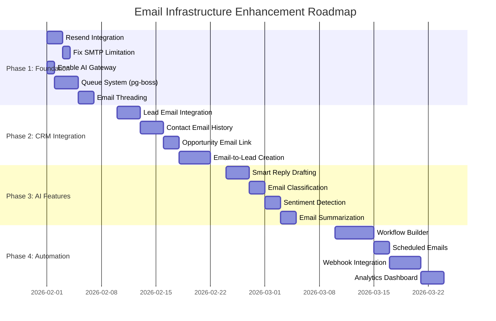

# Email Infrastructure Analysis & Enhancement Plan

## Executive Summary

This document provides a comprehensive analysis and implementation roadmap for the email functionality in SOS Logistics Pro. It covers the current architecture, identifies gaps, proposes cost-effective solutions, and outlines module-wise integration opportunities across the platform.

**Key Recommendations:**
- **Primary Email Provider**: Resend (cost-effective at $20/month for 50K emails)
- **OAuth Integration**: Gmail & Office 365 for enterprise users (already implemented)
- **AI Enhancement**: Lovable AI Gateway (no additional API key required)
- **Estimated Monthly Cost**: $20-$80 depending on volume

---

## Table of Contents

1. [Technical Assessment](#1-technical-assessment)
2. [Current Implementation Status](#2-current-implementation-status)
3. [Cost Analysis & Provider Comparison](#3-cost-analysis--provider-comparison)
4. [Module-Wise Implementation Plan](#4-module-wise-implementation-plan)
5. [AI Enhancement Opportunities](#5-ai-enhancement-opportunities)
6. [Security & Compliance](#6-security--compliance)
7. [Implementation Roadmap](#7-implementation-roadmap)
8. [Technical Requirements](#8-technical-requirements)
9. [Risk Assessment & Mitigation](#9-risk-assessment--mitigation)

---

## 1. Technical Assessment

### 1.1 Current Email Architecture

The platform uses a **Serverless Edge Architecture** built on Supabase Edge Functions with the following components:

| Component | Technology | Status | Location |
|-----------|------------|--------|----------|
| **Database Layer** | PostgreSQL | ✅ Implemented | `emails`, `email_accounts`, `email_templates`, `email_filters` tables |
| **Sending Service** | Edge Function | ✅ Implemented | `supabase/functions/send-email/` |
| **Sync Service** | Edge Function | ✅ Implemented | `supabase/functions/sync-emails/` |
| **OAuth Service** | Edge Function | ✅ Implemented | `supabase/functions/exchange-oauth-token/` |
| **Search Service** | Edge Function | ✅ Implemented | `supabase/functions/search-emails/` |
| **Batch Sync** | Edge Function | ✅ Implemented | `supabase/functions/sync-all-mailboxes/` |
| **Frontend UI** | React Components | ✅ Implemented | `src/components/email/` (10 components) |
| **Email Management Page** | React Page | ✅ Implemented | `src/pages/dashboard/EmailManagement.tsx` |

### 1.2 Database Schema

**Core Tables:**

```sql
-- email_accounts: Stores connected email accounts
- id, user_id, tenant_id, franchise_id
- provider (gmail, office365, smtp_imap)
- email_address, display_name
- access_token, refresh_token, token_expires_at
- imap_host, imap_port, smtp_host, smtp_port
- auto_sync_enabled, sync_frequency, last_sync_at

-- emails: Stores all email messages
- id, account_id, tenant_id, franchise_id
- message_id, thread_id, conversation_id
- subject, from_email, from_name
- to_emails, cc_emails, bcc_emails (JSON arrays)
- body_text, body_html, snippet
- direction (inbound/outbound), status, folder
- is_read, is_starred, is_archived, is_spam, is_deleted
- priority, importance, in_reply_to, email_references
- has_attachments, has_inline_images, attachments
- lead_id, contact_id, account_id_crm, opportunity_id (CRM linking)
- received_at, sent_at, created_at

-- email_templates: Reusable email templates
- id, tenant_id, franchise_id, name, subject
- body_html, body_text, variables (JSON)
- category, is_active, is_shared

-- email_filters: Automation rules
- id, user_id, account_id, tenant_id
- name, description, conditions (JSON), actions (JSON)
- priority, is_active
```

### 1.3 Supported Providers

| Provider | Send | Receive | OAuth | Status |
|----------|------|---------|-------|--------|
| **Gmail** | ✅ Gmail API | ✅ Gmail API | ✅ OAuth 2.0 | Fully Implemented |
| **Office 365** | ✅ MS Graph | ✅ MS Graph | ✅ OAuth 2.0 | Fully Implemented |
| **SMTP/IMAP** | ⚠️ Blocked | ⚠️ Limited | N/A | Runtime Restriction |
| **Resend** | 🔄 Planned | N/A | API Key | Recommended |

**Note:** Direct SMTP (ports 25/465/587) is blocked in Edge runtime. IMAP sync is implemented but memory-intensive.

### 1.4 Current Limitations

| Limitation | Impact | Solution |
|------------|--------|----------|
| **SMTP Blocked** | Cannot send via traditional SMTP | Use OAuth providers or Resend API |
| **Edge Function Timeout** | 60s limit affects large syncs | Implement pagination, async processing |
| **No Job Queue** | High load causes rate limiting | Add pg-boss or similar queue system |
| **Synchronous Sending** | User waits for API response | Background processing with status updates |
| **No Webhook Support** | Pull-based sync introduces latency | Implement Gmail/MS Push Notifications |

---

## 2. Current Implementation Status

### 2.1 Frontend Components (`src/components/email/`)

| Component | Purpose | Status |
|-----------|---------|--------|
| `EmailInbox.tsx` | Main inbox view with folder navigation | ✅ Complete |
| `EmailAccounts.tsx` | Manage connected email accounts | ✅ Complete |
| `EmailAccountDialog.tsx` | Add/edit email account modal | ✅ Complete |
| `EmailClientSettings.tsx` | SMTP/IMAP configuration | ✅ Complete |
| `EmailComposeDialog.tsx` | Compose new email modal | ✅ Complete |
| `EmailDetailView.tsx` | View email content | ✅ Complete |
| `EmailDetailDialog.tsx` | Email detail modal wrapper | ✅ Complete |
| `EmailFilters.tsx` | Manage automation rules | ✅ Complete |
| `EmailTemplates.tsx` | Manage email templates | ✅ Complete |
| `OAuthSettings.tsx` | Configure OAuth credentials | ✅ Complete |

### 2.2 Dashboard Integration

| Component | Location | Purpose |
|-----------|----------|---------|
| `EmailActivity.tsx` | `src/components/dashboard/` | Dashboard widget showing recent emails |
| Email Management Page | `/dashboard/email-management` | Full email management interface |

### 2.3 Edge Functions (`supabase/functions/`)

| Function | Purpose | Lines | Status |
|----------|---------|-------|--------|
| `send-email/index.ts` | Send emails via Gmail/Office 365 API | 426 | ✅ Complete |
| `sync-emails/index.ts` | Sync inbox from providers | 770 | ✅ Complete |
| `sync-all-mailboxes/` | Batch sync all active accounts | - | ✅ Complete |
| `search-emails/` | Search email content | - | ✅ Complete |
| `exchange-oauth-token/` | Handle OAuth token exchange | - | ✅ Complete |

---

## 3. Cost Analysis & Provider Comparison

### 3.1 Transactional Email Providers

| Provider | Free Tier | Paid Plans | Best For |
|----------|-----------|------------|----------|
| **Resend** | 3,000/month | $20/50K, $80/200K | Modern API, React Email |
| **SendGrid** | 100/day | $19.95/40K | Legacy systems |
| **Mailgun** | 5,000/month (3mo) | $35/50K | High volume |
| **Postmark** | 100/month | $15/10K | Deliverability focus |
| **AWS SES** | 62,000/month (EC2) | $0.10/1K | AWS infrastructure |

### 3.2 Recommended: Resend

**Why Resend?**
- ✅ **Free Tier**: 3,000 emails/month (sufficient for testing)
- ✅ **Cost-Effective**: $20/month for 50,000 emails
- ✅ **React Email**: Native React component support for templates
- ✅ **Developer Experience**: Clean API, excellent documentation
- ✅ **Edge Function Compatible**: Works perfectly with Supabase
- ✅ **Deliverability**: Built-in SPF, DKIM, DMARC support

### 3.3 Monthly Cost Estimate

| Scenario | Email Volume | Provider Cost | AI Cost* | Total |
|----------|--------------|---------------|----------|-------|
| **Startup** | < 3,000 | $0 (Free) | $0 | **$0** |
| **Growing** | 10-50K | $20 | $0 | **$20** |
| **Scale** | 50-200K | $80 | $0 | **$80** |
| **Enterprise** | 200K+ | $225+ | $0 | **$225+** |

*AI features use Lovable AI Gateway at no additional cost

---

## 4. Module-Wise Implementation Plan

### 4.1 CRM Module Integration

**Location:** `src/pages/dashboard/` (Leads, Contacts, Accounts, Opportunities)

| Feature | Description | Priority | Effort |
|---------|-------------|----------|--------|
| **Lead Email** | Send/receive emails from Lead detail page | High | 3 days |
| **Contact Email** | Full email history per contact | High | 3 days |
| **Account Email** | Organization-wide email view | Medium | 2 days |
| **Opportunity Email** | Quote-related correspondence | High | 2 days |
| **Email-to-Lead** | Auto-create leads from emails | Medium | 4 days |
| **Email Tracking** | Track opens, clicks, replies | Low | 5 days |

**Implementation Requirements:**

```typescript
// CRM Email Integration Hook
interface CRMEmailContext {
  entityType: 'lead' | 'contact' | 'account' | 'opportunity';
  entityId: string;
  relatedEmails: Email[];
  sendEmail: (to: string, subject: string, body: string) => Promise<void>;
  linkEmail: (emailId: string) => Promise<void>;
}

// Link emails to CRM entities via existing columns:
// emails.lead_id, emails.contact_id, emails.account_id_crm, emails.opportunity_id
```

### 4.2 Quotes & Sales Module

**Location:** `src/pages/dashboard/Quotes.tsx`, `QuoteDetail.tsx`

| Feature | Description | Priority | Effort |
|---------|-------------|----------|--------|
| **Quote Email** | Send quotes via email | High | 2 days |
| **Quote Templates** | Pre-built quote email templates | High | 2 days |
| **Follow-up Reminders** | Auto-send follow-ups | Medium | 3 days |
| **Acceptance Tracking** | Track quote acceptance via email links | Medium | 4 days |
| **Rate Sheet Distribution** | Email rate updates to customers | Low | 2 days |

**Email Template Variables for Quotes:**

```json
{
  "quote_number": "Q-2026-001234",
  "customer_name": "{{account.name}}",
  "total_amount": "{{quote.total_amount}}",
  "valid_until": "{{quote.valid_until}}",
  "origin": "{{quote.origin_port}}",
  "destination": "{{quote.destination_port}}",
  "service_type": "{{quote.service_type}}",
  "view_link": "{{quote.public_link}}"
}
```

### 4.3 Shipments Module

**Location:** `src/pages/dashboard/Shipments.tsx`, `ShipmentDetail.tsx`

| Feature | Description | Priority | Effort |
|---------|-------------|----------|--------|
| **Shipment Notifications** | Status update emails | High | 3 days |
| **Document Delivery** | Send BOL, customs docs via email | High | 2 days |
| **Carrier Communication** | Direct email to carriers | Medium | 2 days |
| **Customer Updates** | Automated tracking updates | Medium | 4 days |
| **Exception Alerts** | Delay/issue notifications | High | 3 days |

**Automated Triggers:**

```typescript
// Shipment Email Triggers
const SHIPMENT_EMAIL_TRIGGERS = [
  { event: 'shipment_created', template: 'booking_confirmation' },
  { event: 'shipment_departed', template: 'departure_notification' },
  { event: 'shipment_arrived', template: 'arrival_notification' },
  { event: 'customs_cleared', template: 'customs_clearance' },
  { event: 'shipment_delivered', template: 'delivery_confirmation' },
  { event: 'shipment_delayed', template: 'delay_notification' },
  { event: 'document_ready', template: 'document_available' }
];
```

### 4.4 Carrier & Vendor Module

**Location:** `src/pages/dashboard/Carriers.tsx`

| Feature | Description | Priority | Effort |
|---------|-------------|----------|--------|
| **Rate Requests** | Request quotes from carriers | High | 2 days |
| **Booking Requests** | Send booking confirmations | High | 2 days |
| **Vendor Communication** | Track vendor correspondence | Medium | 2 days |
| **Rate Expiry Alerts** | Notify when rates expire | Low | 2 days |

### 4.5 Customs & Compliance Module

**Location:** `src/pages/dashboard/CustomsClearancePipeline.tsx`

| Feature | Description | Priority | Effort |
|---------|-------------|----------|--------|
| **Document Requests** | Request missing documents | High | 2 days |
| **Customs Notifications** | Clearance status updates | High | 2 days |
| **Compliance Alerts** | Regulation/document expiry | Medium | 3 days |
| **Agency Communication** | Direct email to customs agents | Medium | 2 days |

### 4.6 Dashboard & Reports Module

**Location:** `src/pages/dashboard/Dashboards.tsx`, `Reports.tsx`

| Feature | Description | Priority | Effort |
|---------|-------------|----------|--------|
| **Report Scheduling** | Email reports on schedule | Medium | 4 days |
| **Alert Notifications** | KPI threshold alerts | Medium | 3 days |
| **Daily Digest** | Summary email to users | Low | 3 days |
| **Export & Email** | Export data and send via email | Low | 2 days |

### 4.7 User & Team Management

**Location:** `src/pages/dashboard/Users.tsx`, `Teams.tsx`

| Feature | Description | Priority | Effort |
|---------|-------------|----------|--------|
| **Welcome Emails** | New user onboarding | High | 1 day |
| **Password Reset** | Self-service password recovery | High | 1 day |
| **Assignment Notifications** | Lead/task assignment alerts | Medium | 2 days |
| **Team Announcements** | Broadcast to team members | Low | 2 days |

---

## 5. AI Enhancement Opportunities

### 5.1 Available AI Features (No Additional Cost)

Using **Lovable AI Gateway**, the following features can be implemented without requiring external API keys:

| Feature | Model | Use Case |
|---------|-------|----------|
| **Smart Email Drafting** | `google/gemini-3-flash-preview` | Generate contextual email replies |
| **Email Classification** | `google/gemini-2.5-flash-lite` | Categorize incoming emails |
| **Sentiment Analysis** | `google/gemini-2.5-flash` | Detect urgency/sentiment |
| **Email Summarization** | `google/gemini-2.5-flash` | Summarize long email threads |
| **Translation** | `google/gemini-2.5-flash` | Translate emails for international |

### 5.2 Implementation: AI Email Assistant

```typescript
// Edge Function: ai-email-assistant/index.ts
import { createClient } from "https://esm.sh/@supabase/supabase-js@2";

const AI_GATEWAY_URL = "https://ai.gateway.lovable.dev/v1/chat/completions";

interface AIEmailRequest {
  action: 'draft' | 'classify' | 'summarize' | 'sentiment';
  emailId?: string;
  context?: string;
  prompt?: string;
}

// Smart Email Drafting
async function generateEmailDraft(context: {
  originalEmail: string;
  customerHistory: string;
  quoteData?: object;
}) {
  const response = await fetch(AI_GATEWAY_URL, {
    method: "POST",
    headers: {
      "Content-Type": "application/json",
      "Authorization": `Bearer ${Deno.env.get("LOVABLE_API_KEY")}`
    },
    body: JSON.stringify({
      model: "google/gemini-3-flash-preview",
      messages: [
        {
          role: "system",
          content: `You are an email assistant for a logistics company. 
            Write professional, concise responses. Include relevant quote/shipment details when provided.
            Use logistics terminology appropriately (Bill of Lading, FCL, LCL, etc.).`
        },
        {
          role: "user", 
          content: `Draft a reply to this email:\n\n${context.originalEmail}\n\n
            Customer History: ${context.customerHistory}\n\n
            Quote Details: ${JSON.stringify(context.quoteData || {})}`
        }
      ]
    })
  });
  
  return response.json();
}

// Email Classification (for auto-routing)
async function classifyEmail(emailBody: string) {
  const categories = [
    'quote_request', 'tracking_inquiry', 'complaint', 
    'booking_request', 'document_request', 'general_inquiry'
  ];
  
  const response = await fetch(AI_GATEWAY_URL, {
    method: "POST",
    headers: {
      "Content-Type": "application/json",
      "Authorization": `Bearer ${Deno.env.get("LOVABLE_API_KEY")}`
    },
    body: JSON.stringify({
      model: "google/gemini-2.5-flash-lite",
      messages: [
        {
          role: "system",
          content: `Classify the following email into one of these categories: ${categories.join(', ')}. 
            Respond with JSON: { "category": "...", "confidence": 0.0-1.0, "urgency": "low|medium|high" }`
        },
        { role: "user", content: emailBody }
      ]
    })
  });
  
  return response.json();
}
```

### 5.3 AI Feature Roadmap

| Phase | Feature | Effort | Dependencies |
|-------|---------|--------|--------------|
| **Phase 1** | Smart Reply Suggestions | 3 days | AI Gateway enabled |
| **Phase 1** | Email Classification | 2 days | AI Gateway enabled |
| **Phase 2** | Sentiment-based Prioritization | 2 days | Classification complete |
| **Phase 2** | Email Summarization | 2 days | Thread grouping |
| **Phase 3** | Auto-routing to Departments | 3 days | Classification + Rules engine |
| **Phase 3** | Predictive Response Templates | 4 days | Historical data analysis |

---

## 6. Security & Compliance

### 6.1 Data Protection

| Requirement | Implementation |
|-------------|----------------|
| **Encryption at Rest** | OAuth tokens encrypted in database |
| **Encryption in Transit** | TLS 1.3 for all API calls |
| **Token Security** | Access tokens refreshed before expiry |
| **Multi-tenancy** | RLS policies on all email tables |
| **Audit Logging** | All email actions logged |

### 6.2 Compliance Requirements

| Regulation | Implementation |
|------------|----------------|
| **GDPR** | Right to deletion (soft delete + hard delete option) |
| **CCPA** | Data export capability |
| **SOC 2** | Access controls, audit logs |
| **HIPAA** | (If applicable) Additional encryption layers |

### 6.3 Deliverability Best Practices

```markdown
## Required DNS Records

1. **SPF Record**
   TXT: v=spf1 include:_spf.resend.com ~all

2. **DKIM Record**
   Provided by Resend upon domain verification

3. **DMARC Record**
   TXT: v=DMARC1; p=quarantine; rua=mailto:dmarc@yourdomain.com
```

---

## 7. Implementation Roadmap

### 7.1 Phase 1: Foundation Enhancement (Weeks 1-2)

| Task | Description | Effort | Priority |
|------|-------------|--------|----------|
| Add Resend Integration | Fallback email provider for reliability | 2 days | High |
| Fix SMTP Limitation | Clear error messaging, Resend fallback | 1 day | High |
| Enable AI Gateway | Configure for email AI features | 1 day | High |
| Queue System (pg-boss) | Async email processing | 3 days | Medium |
| Email Threading | Group by conversation | 2 days | Medium |

### 7.2 Phase 2: CRM Integration (Weeks 3-4)

| Task | Description | Effort | Priority |
|------|-------------|--------|----------|
| Lead Email Integration | Compose/view from Lead detail | 3 days | High |
| Contact Email History | Full conversation history | 3 days | High |
| Opportunity Email Link | Quote correspondence | 2 days | High |
| Email-to-Lead Creation | Auto-create from new contacts | 4 days | Medium |

### 7.3 Phase 3: AI Features (Weeks 5-6)

| Task | Description | Effort | Priority |
|------|-------------|--------|----------|
| Smart Reply Drafting | AI-generated responses | 3 days | High |
| Email Classification | Auto-categorize incoming | 2 days | Medium |
| Sentiment Detection | Priority based on tone | 2 days | Medium |
| Email Summarization | Thread summaries | 2 days | Low |

### 7.4 Phase 4: Automation & Scale (Weeks 7-8)

| Task | Description | Effort | Priority |
|------|-------------|--------|----------|
| Workflow Builder | Visual automation editor | 5 days | Medium |
| Scheduled Emails | Send later functionality | 2 days | Medium |
| Webhook Integration | Real-time Gmail/Office 365 | 4 days | Medium |
| Analytics Dashboard | Email metrics & reporting | 3 days | Low |

### 7.5 Gantt Chart



---

## 8. Technical Requirements

### 8.1 New Edge Functions Required

| Function | Purpose | Endpoint |
|----------|---------|----------|
| `send-email-resend` | Send via Resend API | `POST /send-email-resend` |
| `ai-email-assistant` | AI drafting/classification | `POST /ai-email-assistant` |
| `email-webhook-handler` | Gmail/Office 365 push notifications | `POST /email-webhook` |
| `scheduled-email-processor` | Process scheduled emails | Cron trigger |

### 8.2 Database Enhancements

```sql
-- Add scheduled emails table
CREATE TABLE public.scheduled_emails (
  id UUID PRIMARY KEY DEFAULT gen_random_uuid(),
  tenant_id UUID NOT NULL REFERENCES tenants(id),
  user_id UUID NOT NULL REFERENCES auth.users(id),
  account_id UUID NOT NULL REFERENCES email_accounts(id),
  to_emails JSONB NOT NULL,
  cc_emails JSONB,
  bcc_emails JSONB,
  subject TEXT NOT NULL,
  body_html TEXT,
  body_text TEXT,
  scheduled_at TIMESTAMPTZ NOT NULL,
  status TEXT DEFAULT 'pending', -- pending, sent, failed, cancelled
  sent_at TIMESTAMPTZ,
  error_message TEXT,
  created_at TIMESTAMPTZ DEFAULT now(),
  updated_at TIMESTAMPTZ DEFAULT now()
);

-- Add email analytics table
CREATE TABLE public.email_analytics (
  id UUID PRIMARY KEY DEFAULT gen_random_uuid(),
  email_id UUID NOT NULL REFERENCES emails(id),
  event_type TEXT NOT NULL, -- sent, delivered, opened, clicked, bounced
  event_data JSONB,
  occurred_at TIMESTAMPTZ DEFAULT now(),
  user_agent TEXT,
  ip_address TEXT
);

-- Add AI classification results
ALTER TABLE public.emails 
ADD COLUMN ai_category TEXT,
ADD COLUMN ai_sentiment TEXT,
ADD COLUMN ai_urgency TEXT,
ADD COLUMN ai_summary TEXT,
ADD COLUMN ai_processed_at TIMESTAMPTZ;
```

### 8.3 Required Secrets

| Secret | Purpose | Required For |
|--------|---------|--------------|
| `RESEND_API_KEY` | Resend email sending | Fallback email provider |
| `LOVABLE_API_KEY` | AI Gateway access | AI features (auto-provisioned) |

### 8.4 API Endpoints

| Endpoint | Method | Purpose |
|----------|--------|---------|
| `/api/email/send` | POST | Send email |
| `/api/email/draft` | POST | AI-generate draft |
| `/api/email/classify` | POST | Classify email |
| `/api/email/schedule` | POST | Schedule email |
| `/api/email/link-entity` | POST | Link to CRM entity |

---

## 9. Risk Assessment & Mitigation

### 9.1 Technical Risks

| Risk | Impact | Probability | Mitigation |
|------|--------|-------------|------------|
| **OAuth Token Expiry** | Email sync fails | Medium | Proactive refresh, error handling |
| **Rate Limiting** | API calls blocked | Medium | Queue system, exponential backoff |
| **Email Delivery Failure** | Messages not sent | Low | Fallback providers, retry logic |
| **Data Loss** | Emails not synced | Low | Regular backups, deduplication |
| **AI Hallucination** | Incorrect responses | Medium | Human review for all AI drafts |

### 9.2 Business Risks

| Risk | Impact | Mitigation |
|------|--------|------------|
| **Cost Overrun** | Budget exceeded | Volume monitoring, tier alerts |
| **User Adoption** | Feature underutilized | Training, gradual rollout |
| **Deliverability Issues** | Emails to spam | SPF/DKIM/DMARC, warm-up |

### 9.3 Rollback Procedures

1. **Feature Flags**: All AI features behind `enable_ai_email` flag
2. **Database Rollback**: Point-in-time recovery enabled
3. **Code Rollback**: Git revert to tagged release
4. **Provider Fallback**: Multiple email providers configured

---

## 10. Appendix

### 10.1 Existing Files Reference

**Frontend Components:**
- `src/components/email/EmailInbox.tsx`
- `src/components/email/EmailAccounts.tsx`
- `src/components/email/EmailComposeDialog.tsx`
- `src/components/email/EmailDetailView.tsx`
- `src/components/email/EmailFilters.tsx`
- `src/components/email/EmailTemplates.tsx`
- `src/components/email/OAuthSettings.tsx`
- `src/components/email/EmailClientSettings.tsx`
- `src/components/dashboard/EmailActivity.tsx`

**Edge Functions:**
- `supabase/functions/send-email/index.ts`
- `supabase/functions/sync-emails/index.ts`
- `supabase/functions/sync-all-mailboxes/`
- `supabase/functions/search-emails/`
- `supabase/functions/exchange-oauth-token/`

**Pages:**
- `src/pages/dashboard/EmailManagement.tsx`

### 10.2 Integration Points Summary

| Module | Page Location | Email Features |
|--------|---------------|----------------|
| **Dashboard** | `/dashboard` | Email Activity Widget |
| **Leads** | `/dashboard/leads/:id` | Lead correspondence |
| **Contacts** | `/dashboard/contacts/:id` | Contact email history |
| **Accounts** | `/dashboard/accounts/:id` | Organization emails |
| **Opportunities** | `/dashboard/opportunities/:id` | Deal correspondence |
| **Quotes** | `/dashboard/quotes/:id` | Quote emails |
| **Shipments** | `/dashboard/shipments/:id` | Tracking notifications |
| **Carriers** | `/dashboard/carriers/:id` | Carrier communication |
| **Email Hub** | `/dashboard/email-management` | Central email management |

### 10.3 Revision History

| Version | Date | Author | Changes |
|---------|------|--------|---------|
| 1.0 | Initial | - | Original assessment |
| 2.0 | 2026-01-11 | AI | Complete rewrite with module-wise implementation, cost analysis, AI features |
