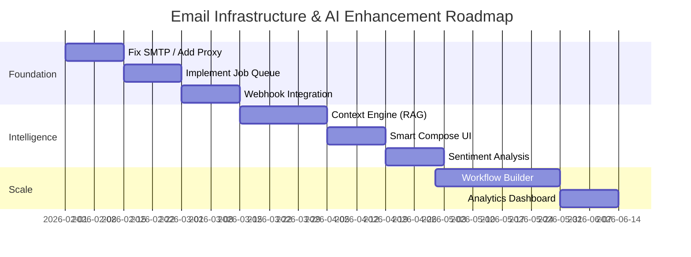

# Email Infrastructure Analysis & Enhancement Plan

## 1. Technical Assessment

### 1.1 Existing Email Architecture

The current email infrastructure within SOS Logistics Pro is built on a **Serverless Edge Architecture** using Supabase Edge Functions. It supports both traditional SMTP/IMAP (with limitations) and modern OAuth2-based integrations for Gmail and Office 365.

**Component Overview:**

| Component | Technology | Description |
|-----------|------------|-------------|
| **Database Layer** | PostgreSQL | `email_accounts` (credentials), `emails` (messages), `email_filters` (rules). |
| **Sending Service** | Edge Function (`send-email`) | Handles outbound delivery via Gmail API or MS Graph API. **Note:** Direct SMTP is currently blocked in the Edge Runtime environment. |
| **Sync Service** | Edge Function (`sync-emails`) | Fetches inbound emails. Implements a raw IMAP client for generic providers and REST API clients for OAuth providers. |
| **Auth Service** | Edge Function (`exchange-oauth-token`) | Manages OAuth2 handshake and token lifecycle (refresh tokens). |
| **Frontend** | React (SPA) | Provides `EmailInbox`, `EmailComposer`, and configuration forms. |

**Protocols & Security:**
*   **OAuth 2.0:** Used for Gmail and Office 365. Access tokens are encrypted at rest.
*   **SMTP/IMAP:** Technically supported in code but **operationally restricted** due to port blocking (25/465/587) in the Supabase Edge environment.
*   **TLS/SSL:** Enforced for all connections.

### 1.2 Performance & Scalability Analysis

**Current Limitations:**
*   **Throughput:** Constrained by Edge Function execution time limits (default 60s). Large attachments or batch sending can trigger timeouts.
*   **Concurrency:** No dedicated job queue (e.g., Redis/BullMQ). High load results in immediate function invocation spikes, risking rate-limiting by email providers (Google/Microsoft).
*   **Latency:** Synchronous sending means the user waits for the external API call to complete before the UI confirms "Sent".

**Bottlenecks:**
1.  **IMAP Sync:** The raw IMAP implementation in `sync-emails` is fragile and memory-intensive for large mailboxes.
2.  **No Retry Logic:** Transient failures (network blips) result in failed operations without automatic retries.

### 1.3 Workflow Mapping

**Transactional Emails:**
*   **Trigger:** User Action (e.g., "Send Quote")
*   **Flow:** UI -> `send-email` -> Provider API -> DB Log
*   **Gap:** No fallback if primary provider fails.

**Inbound Sync:**
*   **Trigger:** Cron (`sync-all-mailboxes`) or Manual Refresh
*   **Flow:** Scheduler -> `sync-emails` -> Fetch Recent -> Deduplicate -> Insert to DB
*   **Gap:** "Pull" model introduces latency. No Webhook ("Push") support for real-time updates.

---

## 2. Competitive Research

### 2.1 Market Analysis (Top Logistics CRMs)

| Feature | SOS Logistics Pro (Current) | Salesforce (Logistics Cloud) | CargoWise | HubSpot (Service Hub) |
|---------|-----------------------------|------------------------------|-----------|-----------------------|
| **Architecture** | Serverless / Pull-Sync | Einstein Activity Capture (Streaming) | Integrated Messaging (Proprietary) | Connected Inbox (IMAP/API) |
| **Context** | Basic Linking | Deep Object Linking (Shipment/Quote) | Job-Centric Filing | Contact-Centric |
| **Automation** | Basic Filters | Flow Builder / Process Builder | Workflow Templates | Sequences / Workflows |
| **AI Features** | None | Einstein GPT (Drafting, Summary) | Automating Docs | Content Assistant |

### 2.2 Industry Best Practices

1.  **Deliverability:** Implementation of SPF, DKIM, and DMARC records is mandatory. Use of dedicated IP pools for high-volume transactional emails.
2.  **Thread Management:** Grouping emails by `In-Reply-To` and `References` headers, not just Subject lines.
3.  **Compliance:** GDPR/CCPA "Right to be Forgotten" must scrub emails from the `emails` table.

---

## 3. AI Enhancement Opportunities

### 3.1 Priority Implementations

**A. Smart Email Routing (Classification)**
*   **Concept:** Analyze incoming email body to classify intent (e.g., "Quote Request", "Tracking Inquiry", "Complaint").
*   **Action:** Automatically tag and route to the correct department/user.
*   **Model:** Fine-tuned BERT or lightweight LLM (e.g., DistilBERT) for classification.

**B. Predictive Response Generation (RAG)**
*   **Concept:** "Draft a reply to this quote request."
*   **Mechanism:** Retrieval Augmented Generation (RAG). Fetch customer's historical rates and active contracts from DB, then prompt LLM to generate a personalized response.
*   **Model:** GPT-4o or Claude 3.5 Sonnet (via API).

**C. Sentiment Analysis & Escalation**
*   **Concept:** Detect "Angry" or "Urgent" tone.
*   **Action:** Set `priority = high` and trigger Slack/SMS notification to Manager.
*   **Model:** VADER (simple) or OpenAI Embeddings (advanced).

### 3.2 Model Selection

*   **Logistics Terminology:** Models need fine-tuning on terms like "Bill of Lading", "Demurrage", "FCL/LCL".
*   **Recommendation:** Use **OpenAI GPT-4o** for generation (superior reasoning) and **HuggingFace transformers** (hosted locally or via inference API) for high-volume classification/routing to manage costs.

---

## 4. Implementation Planning

### 4.1 Phased Roadmap

**Implementation Gantt Chart:**

**Phase 1: Foundation (Weeks 1-4)**
*   [ ] **Fix SMTP:** Replace direct Edge SMTP with a proxy service or integrate a transactional provider (Resend/SendGrid) for reliability.
*   [ ] **Queue System:** Implement `pg-boss` (Postgres-based job queue) for asynchronous sending and syncing.
*   [ ] **Webhooks:** Implement Gmail/Outlook Push Notifications to replace polling.

**Phase 2: Intelligence (Weeks 5-8)**
*   [ ] **Context Engine:** Build the RAG pipeline to inject Quote/Shipment data into LLM context.
*   [ ] **Smart Compose:** Add "Generate Reply" button in `EmailDetailView`.
*   [ ] **Sentiment Tagging:** Auto-tag incoming emails on arrival.

**Phase 3: Automation & Scale (Weeks 9-12)**
*   [ ] **Workflow Builder:** Visual editor for "If Email contains X, then Do Y".
*   [ ] **Bulk Campaigns:** Marketing module integration.
*   [ ] **Analytics:** Dashboard for "Average Response Time", "Sentiment Trends".

### 4.2 Technical Requirements

**API Specifications (New Endpoints):**
*   `POST /api/ai/generate-draft`: Input `{ email_id, intent }`, Output `{ subject, body }`.
*   `POST /api/ai/classify`: Input `{ body }`, Output `{ category, confidence }`.

**Data Pipeline:**
*   **Ingest:** `sync-emails` -> `Raw Email` -> **Vector Embedding** -> `pinecone/pgvector`.
*   **Query:** Semantic search against vector store for context retrieval.

### 4.3 Risk Assessment

| Risk | Impact | Mitigation |
|------|--------|------------|
| **Data Privacy** | High | PII Redaction before sending to LLM. Enterprise Agreement with AI provider (Zero Retention). |
| **Hallucination** | Medium | "Human in the Loop" - User must approve all AI drafts before sending. |
| **Cost** | Medium | Cache common queries. Use smaller models for classification. |

### 4.4 Rollback Procedures

*   **Feature Flags:** Wrap all AI features in `enable_ai_email` flag.
*   **Database:** Daily PITR (Point-in-Time Recovery) backups.
*   **Code:** Git Revert to `release/v3.0` tag if critical regression occurs.
