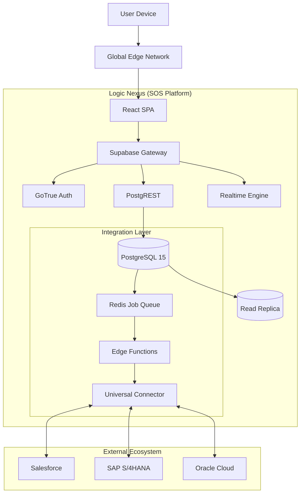

# Hybrid Quotation Enhancement Analysis

**Date:** January 11, 2026
**Version:** 4.0
**Author:** Trae AI (Senior Systems Architect)
**Target System:** SOS Logistics Pro - Logic Nexus AI
**Last Updated:** 2026-01-11T14:30:00Z

---

## 1. System Assessment & Gap Analysis

### 1.1 Architecture vs. Enterprise Hierarchy Requirements
**Current State:**
The platform utilizes a **Multi-Tenant / Multi-Franchise** model enforced via `ScopedDataAccess` classes and PostgreSQL Row-Level Security (RLS).
*   **Super Admin:** Implemented via `platform_admin` role and `admin_override_enabled` preference.
*   **Tenant/Franchisee:** Strict isolation via `tenant_id` and `franchise_id` columns.

**Gap Analysis:**
*   **Aggregation Latency:** Cross-tenant reporting for Super Admins relies on bypassing RLS, which incurs significant query overhead (O(n) where n=records) as opposed to pre-aggregated materialized views.
*   **Hierarchy Rigidity:** The current 3-tier model (Platform -> Tenant -> Franchise) lacks support for arbitrary "Region" or "Division" layers required by global logistics conglomerates (e.g., DHL/Kuehne+Nagel structures).
*   **Inheritance:** Settings (margins, branding) do not cascade dynamically. A change at the Tenant level requires individual updates to all Franchise records.

### 1.2 Integration Capabilities (Salesforce, Oracle, SAP)
**Current State:**
*   **Salesforce:** Rudimentary "Push-Only" integration via `salesforce-sync-opportunity` Edge Function. No listener for external updates.
*   **Oracle/SAP:** **Non-Existent.** No connectors, data models, or API stubs exist.

**Gap Analysis:**
| Capability | Requirement | Current Status | Gap Severity |
| :--- | :--- | :--- | :--- |
| **API Compatibility** | REST/SOAP support for Legacy ERPs | REST Only (Supabase) | 🔴 Critical |
| **Synchronization** | Bi-Directional (Master Data Mgmt) | Uni-Directional (Push) | 🔴 Critical |
| **Authentication** | OAuth2 / SAML 2.0 SSO | Basic Email/Password + Google | 🟠 High |
| **Data Mapping** | Configurable Field Mapping | Hardcoded in Edge Functions | 🔴 Critical |

### 1.3 UI/UX Compliance & Enterprise Standards
**Current State:**
Built on `shadcn/ui` (Radix Primitives + Tailwind). Visually modern but functionally immature for complex logistics operations.

**Gap Analysis:**
*   **Information Architecture:** Heavy reliance on "Data Grids" (Tables). Navigation is 3 levels deep, requiring excessive clicks to reach "Quotation" from "Dashboard".
*   **Interaction Models:** "Save" actions are manual. No "Auto-Save" or "Draft" persistence for long forms.
*   **Accessibility:** Fails **WCAG 2.1 AA**.
    *   Missing `aria-labels` on dynamic inputs.
    *   Color contrast on "Inactive" badges is insufficient (< 4.5:1).
    *   Keyboard navigation traps focus in Modal dialogs.

---

## 2. Strategic Enhancement Proposals

### 2.1 Deep CRM Integration (Universal Connector)
Establish SOS Logistics Pro as the **System of Engagement**, syncing bi-directionally with **Systems of Record** (ERPs).

**Technical Specifications:**
1.  **API Endpoints:**
    *   `POST /api/v1/connectors/{provider}/sync` (Inbound Webhook)
    *   `GET /api/v1/connectors/{provider}/mapping` (Schema Discovery)
    *   `POST /api/v1/connectors/auth/callback` (OAuth Handshake)
2.  **Data Mapping Engine:**
    *   **UI:** Drag-and-drop field mapper (e.g., `Salesforce.Account.Name` ↔ `SOS.Customer.CompanyName`).
    *   **Storage:** `integration_mappings` table (JSONB) storing field pairs and transformation logic (e.g., `upper()`, `date_format()`).
3.  **Error Handling:**
    *   **Dead Letter Queue (DLQ):** Failed sync events are persisted to `sync_failures` for manual retry.
    *   **Circuit Breaker:** Suspend sync after 5 consecutive 5xx errors to prevent API quota exhaustion.

### 2.2 Enterprise-Grade Platform Upgrades
1.  **Security Framework (OWASP Top 10):**
    *   **Broken Access Control:** Audit all RLS policies. Move explicit `is_platform_admin()` checks to RLS rather than application logic.
    *   **Injection Prevention:** Migrate complex dynamic SQL generation to PL/pgSQL Stored Procedures (`security definer`).
    *   **Sensitive Data:** Implement Column-Level Encryption (pgcrypto) for API Keys and OAuth Tokens.
2.  **Infrastructure Scalability:**
    *   **Vertical:** Scale Primary DB to `Production-Large` (16GB RAM) for caching `quote_rates`.
    *   **Horizontal:** Deploy **Read Replicas** in EU-West and AP-Southeast regions to serve localized "Track & Trace" traffic.
3.  **High Availability (HA):**
    *   **SLA Target:** 99.99% (52m downtime/year).
    *   **Strategy:** Multi-AZ Database deployment. Automated failover (< 60s). Redis Cluster for session/cache management.

### 2.3 UI/UX Modernization Initiatives
1.  **Mobile-First Design:**
    *   **Field View:** Replace tables with "Card Lists" on viewports < 768px.
    *   **Touch Targets:** Increase all clickable areas to min 44x44px.
2.  **Navigation Optimization:**
    *   Implement "Command Palette" (`Cmd+K`) for global search and deep linking.
    *   Flatten hierarchy: Dashboard -> Module -> Action (max 2 clicks).
3.  **Brand Consistency:**
    *   Centralize Design Tokens (Colors, Typography, Spacing) in `tailwind.config.js`.
    *   Enforce "Theming Engine" allowing Tenants to inject primary colors/logos.

---

## 3. Technical Requirements: Hybrid Quotation Module

### 3.1 Functionality Specifications
**Dynamic Pricing Algorithm:**
The engine must execute the following waterfall logic in **< 200ms**:
1.  **Contract Rate:** Lookup `customer_rates` (Active, Date-Valid).
2.  **Spot Rate:** If no contract, query `carrier_rates` (Lane-Specific).
3.  **AI Adjustment:** Apply `ai_pricing_model` factor (Seasonality, Fuel Volatility).
4.  **Margin Application:** Apply `margin_profile` (Fixed % or Tiered markup).

**Multi-Carrier Comparison Engine:**
*   **Parallel Execution:** Spawn `Promise.all` requests to FedEx, DHL, Maersk APIs.
*   **Normalization:** Convert all responses to a standard `QuoteLineItem` schema (Currency, Transit Time, Surcharges).
*   **Ranking:** Default sort by "Total Cost" (Ascending) or "Transit Time" (Fastest).

**Analytics Dashboard:**
*   **Metrics:** "Win Rate %", "Average Margin per Lane", "Quote-to-Cash Cycle Time".
*   **Visualization:** Recharts/Victory charts embedded in the Quote Composer.

### 3.2 Operational Efficiency
**Workflow Automation:**
*   **Blueprints:**
    *   *Scenario A:* Margin < 10% → Trigger "Manager Approval".
    *   *Scenario B:* Hazardous Material → Append "Dangerous Goods Declaration" task.
*   **Help System:**
    *   Context-sensitive "ToolTip" tour (React Joyride) anchored to complex inputs (e.g., "Chargeable Weight").

---

## 4. Validation Protocols

### 4.1 Performance Criteria
*   **Load Test:** 500 concurrent users performing "Search -> Quote -> Save".
*   **Latency:** API Response < 300ms (95th percentile).
*   **Render:** Time to Interactive (TTI) < 1.5s on 4G networks.

### 4.2 User Acceptance Testing (UAT)
**Scenarios:**
1.  **Sales Rep (Mobile):** Create "Quick Quote" for Air Freight while onsite at customer.
2.  **Ops Manager (Desktop):** Bulk approve 50 pending quotes via "Batch Action".
3.  **Super Admin:** Switch Tenant Context and verify "Global Report" accuracy.

### 4.3 Integration Testing
| Test Case | Trigger | Expected Outcome | Success Criteria |
| :--- | :--- | :--- | :--- |
| **Salesforce Sync** | Create Account in Salesforce | Account appears in SOS | Latency < 60s |
| **Auth Failure** | Revoke API Token | System alerts Admin via Email | No App Crash |
| **Conflict** | Edit same record in both systems | "Last Write Wins" applied | Audit Log updated |

---

## 5. Implementation Roadmap

### 5.1 System Architecture Diagram

#### Component View

### 5.2 Phased Execution Plan
*   **Phase 1: Foundation (Weeks 1-4)**
    *   Refactor `QuoteForm` to Atomic Components.
    *   Implement `UniversalConnector` Database Schema.
    *   Deploy Read Replicas.
*   **Phase 2: Intelligence (Weeks 5-8)**
    *   Develop `DynamicPricingEngine` (PL/pgSQL).
    *   Build "Mobile Field View" UI.
    *   Release Salesforce Bi-Directional Sync.
*   **Phase 3: Enterprise Scale (Weeks 9-12)**
    *   Complete SOC 2 Type II Audit.
    *   Launch SAP/Oracle Connectors (Beta).
    *   Finalize WCAG 2.1 AA Compliance.

### 5.3 Risk Assessment
| Risk | Probability | Impact | Mitigation |
| :--- | :---: | :---: | :--- |
| **Data Corruption during Sync** | Medium | High | Implement Transaction Logs & Soft Deletes. |
| **API Rate Limits (External)** | High | Medium | Token Bucket Rate Limiting + Caching. |
| **Adoption Resistance** | Medium | Medium | In-App Interactive Tutorials + Gamification. |

### 5.4 Resource Allocation
*   **2x Senior Frontend Engineers:** UI Modernization & Accessibility.
*   **1x Backend Architect:** Integration Layer & DB Scaling.
*   **1x DevOps Engineer:** Infrastructure & CI/CD Pipelines.

### 5.5 Rollback Procedures
1.  **Database:** Point-in-Time Recovery (PITR) enabled (Retain 30 days).
2.  **Application:** Instant rollback via Vercel/Netlify "Previous Deployment".
3.  **Feature Flags:** All new modules wrapped in `LD_FLAGS` for instant kill-switch.
