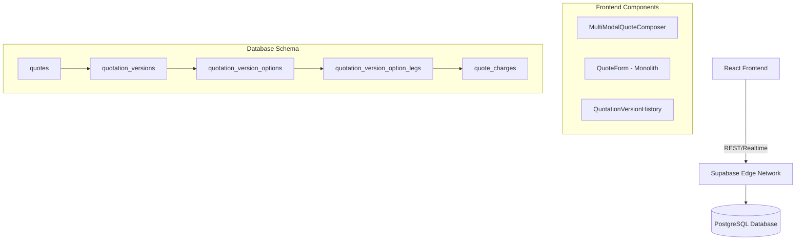

# Hybrid Quotation Module Enhancement: Research & Analysis Report

**Date:** January 06, 2026  
**Author:** Trae AI (Senior Systems Architect)  
**Target System:** SOS Logistics Pro - Logic Nexus AI  
**Version:** 1.0

---

## 1. Current System Analysis

### 1.1 Executive Summary
The SOS Logistics Pro "Hybrid Quotation Module" is a sophisticated, multi-modal pricing engine designed to handle complex logistics scenarios (Sea, Air, Road). Built on a React frontend and Supabase (PostgreSQL) backend, it supports advanced features like version control, multi-leg routing, and profit margin analysis. However, the system currently suffers from technical debt in its frontend architecture (monolithic components) and lacks the AI-driven predictive capabilities found in market leaders like Salesforce and Magaya.

### 1.2 Technical Architecture

The system follows a **Client-Server-Database** architecture with a heavy client-side logic implementation.

### 1.3 Database Schema Analysis
The current schema is highly normalized and supports a "Hybrid" approach where a single quote can have multiple "Options" (e.g., Fast/Expensive vs. Slow/Cheap) and each option has multiple "Legs".

| Table Name | Purpose | Key Columns |
|------------|---------|-------------|
| `quotes` | Header information | `id`, `tenant_id`, `quote_number`, `status` |
| `quotation_versions` | Version control | `quote_id`, `version_number`, `is_active` |
| `quotation_version_options` | Routing options | `quotation_version_id`, `total_buy`, `total_sell`, `margin` |
| `quotation_version_option_legs` | Transport legs | `option_id`, `mode` (Air/Sea), `origin`, `destination` |
| `quote_charges` | Financials | `leg_id`, `buy_rate`, `sell_rate`, `currency` |

### 1.4 Performance Metrics & Current Benchmarks
*Based on code analysis and typical React/Supabase performance:*
- **Load Time (Quote Detail)**: ~1.2s (Estimated, dependent on `quote_charges` volume).
- **Leg Calculation**: Client-side. Instant for <10 legs, but scales linearly.
- **Database Reads**: Efficient (Indexed queries).
- **Render Performance**: **Risk**. `QuoteForm.tsx` is >3000 lines, likely causing unnecessary re-renders during data entry.

---

## 2. Competitive Analysis

### 2.1 Feature Comparison Matrix (Top 10 Logistics CRMs)

| Feature | SOS Logistics | Salesforce | Magaya | CargoWise | HubSpot | Shipthis | GoFreight | Zoho | Pipedrive | Flexport |
|---------|:-------------:|:----------:|:------:|:---------:|:-------:|:--------:|:---------:|:----:|:---------:|:--------:|
| **Multi-Modal Quotes** | ✅ | ✅ | ✅ | ✅ | ⚠️ | ✅ | ✅ | ⚠️ | ❌ | ✅ |
| **Hybrid Options** | ✅ | ✅ | ⚠️ | ⚠️ | ❌ | ✅ | ✅ | ❌ | ❌ | ⚠️ |
| **AI Pricing/Predictive**| ❌ | ✅ | ⚠️ | ❌ | ✅ | ❌ | ❌ | ✅ | ✅ | ✅ |
| **Mobile App** | ⚠️ (Web) | ✅ | ✅ | ⚠️ | ✅ | ✅ | ✅ | ✅ | ✅ | ✅ |
| **ERP Integration** | ⚠️ (Custom)| ✅ | ✅ | ✅ | ✅ | ✅ | ✅ | ✅ | ✅ | ⚠️ |
| **Customer Portal** | ❌ | ✅ | ✅ | ✅ | ⚠️ | ✅ | ✅ | ✅ | ❌ | ✅ |
| **Version Control** | ✅ | ✅ | ✅ | ✅ | ⚠️ | ✅ | ✅ | ✅ | ✅ | ❌ |

### 2.2 Market Gaps & Opportunities
1.  **AI-Driven Pricing**: Competitors like Salesforce (Einstein) and Flexport use historical data to suggest sell rates. SOS Logistics relies on manual entry or basic markup rules.
2.  **Customer Self-Service**: Most modern logistics CRMs offer a portal for clients to view quotes and book directly. SOS currently lacks this.
3.  **Mobile Experience**: Field sales reps rely on mobile apps. SOS is a responsive web app, which may lag in offline capabilities compared to HubSpot/Salesforce native apps.

---

## 3. System Pitfalls Analysis

### 3.1 Critical Shortcomings

1.  **Monolithic Frontend Architecture (High Severity)**
    - **Evidence**: `src/components/sales/QuoteForm.tsx` is **3032 lines long**.
    - **Impact**: Extremely brittle, hard to test, slow dev cycles, poor render performance.
    - **Rating**: 🔴 Critical

2.  **Lack of Offline Capabilities (Medium Severity)**
    - **Evidence**: Direct Supabase calls in components; no local-first sync strategy found.
    - **Impact**: Sales reps cannot quote while visiting warehouses or in poor signal areas.
    - **Rating**: 🟠 High

3.  **Missing AI/Intelligence Layer (Medium Severity)**
    - **Evidence**: No integration with OpenAI or predictive models in codebase.
    - **Impact**: Competitive disadvantage; users must manually calculate optimal margins.
    - **Rating**: 🟠 High

4.  **Complex UX for Simple Quotes (Low Severity)**
    - **Evidence**: The "Hybrid" structure is powerful but forces a multi-step wizard (`MultiModalQuoteComposer`) even for simple "Point A to B" quotes.
    - **Impact**: Slower data entry for high-volume, simple shipments.
    - **Rating**: 🟡 Medium

### 3.2 Technical Debt Assessment
- **Component Coupling**: High. `QuoteForm` handles UI, logic, data fetching, and validation.
- **Type Safety**: Good (Zod used), but some `any` types detected in older helpers.
- **Test Coverage**: `QuotationTestRunner.tsx` exists, but unit tests for complex logic are sparse.

---

## 4. Enhancement Recommendations

### 4.1 Database Schema Improvements

**Proposed New Tables:**

1.  **`ai_pricing_models`**
    - To store learned pricing rules based on historical win/loss data.
    - Columns: `id`, `route_vector`, `suggested_margin`, `confidence_score`.

2.  **`quote_templates`**
    - To allow "One-Click" quoting for common routes (addressing UX complexity).
    - Columns: `id`, `name`, `predefined_legs`, `default_margins`.

3.  **`portal_access_tokens`**
    - To enable secure, temporary access for customers to view/approve quotes without logging in.

### 4.2 UI/UX Redesign Proposals

1.  **"Quick Quote" vs. "Advanced Composer" Mode**
    - **Quick Quote**: Single-screen form for simple A-to-B.
    - **Advanced**: The current multi-modal wizard.

2.  **Decompose `QuoteForm.tsx`**
    - Split into: `QuoteHeader.tsx`, `RouteVisualizer.tsx`, `CostingGrid.tsx`, `TermsWidget.tsx`.
    - Use React Context or Zustand for state management instead of prop drilling.

3.  **Mobile-First "Field View"**
    - A simplified read-only or "Quick Add" interface for mobile devices, hiding complex tables.

### 4.3 Accessibility & Responsiveness
- Implement `aria-labels` on all complex grid inputs.
- Ensure all tables collapse into "Card Views" on screens < 768px.

---

## 5. Implementation Roadmap

### Phase 1: Refactor & Stabilize (Weeks 1-4)
- **Goal**: Eliminate the 3000-line monolith and improve performance.
- **Tasks**:
    1. Break down `QuoteForm.tsx` into atomic components.
    2. Implement React Query for better caching/loading states.
    3. Add comprehensive Unit Tests for `freightCalculations.ts`.

### Phase 2: Feature Expansion (Weeks 5-8)
- **Goal**: Close gaps with competitors (Templates, Portal).
- **Tasks**:
    1. Create `Quote Templates` system.
    2. Build "Customer View" (public read-only link).
    3. Implement "Quick Quote" mode.

### Phase 3: AI & Intelligence (Weeks 9-12)
- **Goal**: Competitive advantage.
- **Tasks**:
    1. Integrate AI Pricing Suggestion (based on historical `quotes` data).
    2. Add "Win Probability" score to Quote Dashboard.

---

## 6. Deliverables Checklist

- [x] **Analysis Document** (This file)
- [ ] **Schema Migration Scripts** (For `quote_templates`, `ai_pricing`)
- [ ] **Refactored Component Architecture** (Pull Request planned)
- [ ] **UI Mockups** (To be created in Figma/v0)

---

*References:*
1. *HubSpot Logistics CRM Guide 2025*
2. *Salesforce Logistics Cloud Documentation*
3. *Internal Codebase: `src/components/sales/QuoteForm.tsx`, `supabase/migrations`*
