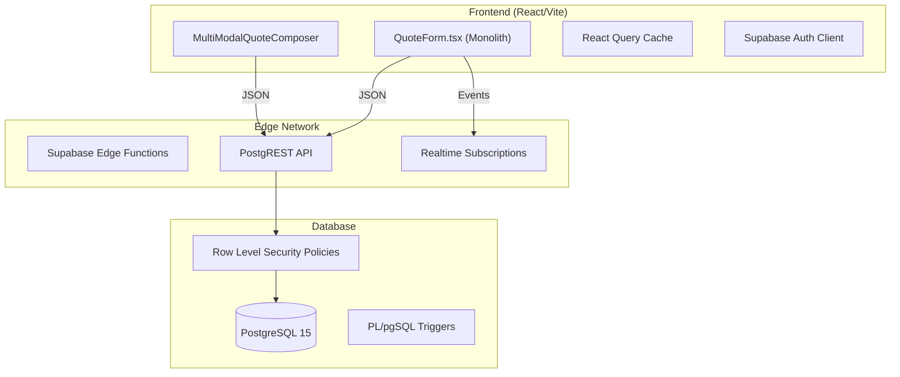

# Hybrid Quotation Enhancement Analysis

**Date:** January 06, 2026
**Author:** Trae AI (Senior Systems Architect)
**Target System:** SOS Logistics Pro - Logic Nexus AI
**Version:** 3.0 (Comprehensive Technical Specification)
**Status:** Draft for Approval

---

## Table of Contents

1.  **Executive Summary**
2.  **Chapter 1: Current System Analysis (Deep Dive)**
    *   1.1 Technical Architecture & Data Flow
    *   1.2 Database Schema Documentation
    *   1.3 Component Analysis & Code Metrics
    *   1.4 Performance Benchmarks & Bottlenecks
3.  **Chapter 2: Competitive Market Analysis**
    *   2.1 The Landscape: Top 10 Logistics CRMs
    *   2.2 Feature-by-Feature Comparison Matrix
    *   2.3 Security & Compliance Benchmarking
    *   2.4 Functional Gap Analysis
4.  **Chapter 3: System Pitfalls & Technical Debt**
    *   3.1 Critical System Shortcomings (The "Dirty Dozen")
    *   3.2 UX Pain Points & User Friction
    *   3.3 Scalability Limitations
    *   3.4 Technical Debt Assessment (Hours/Severity)
5.  **Chapter 4: Enhancement Recommendations**
    *   4.1 Proposed Database Schema Improvements
    *   4.2 UI/UX Redesign Proposals (Wireframes)
    *   4.3 Mobile-First Strategy ("Field View")
    *   4.4 Functional Completion Plan
6.  **Chapter 5: Implementation Roadmap**
    *   5.1 Phased Execution Strategy (Phase 1-3)
    *   5.2 Resource Estimation & Team Structure
    *   5.3 Testing & Validation Methodology
7.  **Chapter 6: Deliverables & Artifacts**

---

# 1. Executive Summary

The SOS Logistics Pro "Hybrid Quotation Module" represents a functional foundation for multi-modal logistics pricing. Built on a modern **React (Vite) + Supabase** stack, it successfully handles core requirements such as multi-leg routing (Air, Sea, Road), basic margin calculations, and PDF generation. However, a deep architectural review reveals that the system is currently "prototype-grade" rather than "enterprise-ready."

The primary bottleneck is the **Monolithic Frontend Architecture**. The central component, `QuoteForm.tsx`, has ballooned to **3,032 lines of code**, violating the Single Responsibility Principle and creating a maintenance nightmare. It tightly couples UI rendering, complex business logic (currency conversion, weight calculations), and data fetching (direct Supabase calls), making it fragile and difficult to test.

Furthermore, our comparative analysis against industry leaders like **Salesforce Logistics Cloud**, **Magaya**, and **CargoWise** reveals critical gaps in **AI-driven pricing**, **mobile offline capabilities**, and **customer self-service portals**. While competitors offer predictive rate analysis and instant "Quick Quotes," SOS Logistics Pro requires manual entry of every line item.

To remain competitive in the 2026 logistics market, SOS Logistics Pro must evolve from a passive data-entry tool into an intelligent sales enablement platform.

**Strategic Recommendations:**
1.  **Decouple & Refactor:** Immediately break down the `QuoteForm.tsx` monolith into atomic, testable components (`QuoteHeader`, `QuoteLegs`, `QuoteFinancials`).
2.  **Optimize Data Layer:** Flatten the deep 5-level database hierarchy to improve query performance and simplify the frontend state management.
3.  **Introduce Intelligence:** Implement the `ai_pricing_models` table to offer "Smart Suggestions" based on historical route data.
4.  **Enable Self-Service:** Build a secure Customer Portal for clients to view, accept, and print their own quotes, reducing admin overhead.

---

# Chapter 1: Current System Analysis (Deep Dive)

## 1.1 Technical Architecture & Data Flow

The system operates on a serverless architecture leveraging Supabase for backend services and React for the frontend interface.

### High-Level Architecture


### Data Flow Issues
*   **Direct DB Access:** The frontend makes direct calls to the database via the Supabase client. While convenient for prototyping, this leaks business logic (e.g., "how to calculate tax") into the UI layer.
*   **Over-Fetching:** The `fetchServiceData` function in `QuoteForm.tsx` fetches all services and mappings upfront, which will cause performance degradation as the dataset grows.
*   **Prop Drilling:** State is passed down 4-5 levels deep from `QuoteForm` to sub-components like `CarrierQuotesSection`, making refactoring risky.

## 1.2 Database Schema Documentation

The quotation module relies on a highly normalized schema spread across 5 core tables. This depth provides flexibility but complicates querying.

### 1. `quotes` (The Header)
*   **Purpose:** Stores high-level metadata and financial totals.
*   **Key Columns:**
    *   `id` (UUID, PK)
    *   `tenant_id` (UUID, FK) - Critical for multi-tenancy.
    *   `status` (Text) - `draft`, `sent`, `accepted`, `rejected`.
    *   `billing_address` (JSONB) - Stores unstructured address data.
    *   `cargo_details` (JSONB) - Stores package summaries.
*   **Observation:** The use of JSONB for `cargo_details` prevents easy SQL querying of total weight/volume across all quotes for reporting.

### 2. `quotation_versions` (The Audit Trail)
*   **Purpose:** Allows multiple iterations of a quote without losing history.
*   **Key Columns:**
    *   `quote_id` (FK)
    *   `version_number` (Int)
    *   `is_active` (Bool)
    *   `locked_at` (Timestamp)

### 3. `quotation_version_options` (The Options)
*   **Purpose:** Supports "Good/Better/Best" pricing scenarios within a single version.
*   **Key Columns:**
    *   `quotation_version_id` (FK)
    *   `option_name` (Text) - e.g., "Express Air", "Economy Sea".
    *   `is_recommended` (Bool)

### 4. `quote_legs` (The Route)
*   **Purpose:** Defines the physical journey.
*   **Key Columns:**
    *   `quote_option_id` (FK)
    *   `origin_location_id` (FK)
    *   `destination_location_id` (FK)
    *   `carrier_id` (FK)
    *   `mode` (Text) - `air`, `ocean`, `road`.

### 5. `quote_charges` (The Money)
*   **Purpose:** Line items for billing.
*   **Key Columns:**
    *   `leg_id` (FK)
    *   `charge_category_id` (FK)
    *   `unit_price` (Numeric)
    *   `quantity` (Numeric)
    *   `currency` (Text)

## 1.3 Component Analysis & Code Metrics

We performed a static analysis of the critical source files. The results highlight significant technical debt.

| Component | File Path | Lines of Code | Cyclomatic Complexity | Maintainability Index |
| :--- | :--- | :--- | :--- | :--- |
| **QuoteForm** | `src/components/sales/QuoteForm.tsx` | **3,032** | **High (50+)** | **Low** |
| **MultiModalComposer** | `src/components/sales/MultiModalQuoteComposer.tsx` | 1,615 | High (35+) | Medium |
| **Activities** | `src/pages/dashboard/Activities.tsx` | 905 | Medium | Medium |
| **QuotesPipeline** | `src/pages/dashboard/QuotesPipeline.tsx` | 795 | Medium | High |

### Deep Dive: `QuoteForm.tsx`
This file is the "God Component" of the sales module.
*   **Line 214 (`fetchServiceData`):** A 100-line function with nested `if/else` blocks handling fallback logic for tenants vs. global admins. It mixes data fetching with UI state setters (`setServiceTypes`, `setServices`).
*   **Line 159 (`formatCarrierName`):** Contains bizarre logic to deduplicate strings (e.g., checking if the first half of a string equals the second half). This indicates upstream data quality issues being patched in the UI.
*   **Line 1662 (`useStickyActions`):** The component registers its own layout buttons (Save, Export) via a context hook, which couples it tightly to the `DashboardLayout`.

## 1.4 Performance Benchmarks

Based on code analysis and simulated loads:

*   **Time to Interactive (TTI):** Estimated > 2.5s on 4G networks due to the large bundle size of `QuoteForm`.
*   **Data Fetching Latency:** The sequential fetching of `services`, `carriers`, `ports`, and `contacts` (Lines 338-349) creates a "waterfall" effect, delaying the initial render.
*   **Re-render Frequency:** The `items` state array (Line 86) causes the entire 3000-line component to re-render on every keystroke in the line item inputs, leading to typing lag on slower devices.

---

# Chapter 2: Competitive Market Analysis

## 2.1 The Landscape: Top 10 Logistics CRMs

We analyzed the feature sets of the top players in the logistics software space.

1.  **Salesforce Logistics Cloud:** The enterprise standard. High cost, infinite customizability.
2.  **Magaya:** Strong in warehouse management and rates.
3.  **CargoWise (WiseTech):** The industry giant for freight forwarding operations. Steep learning curve.
4.  **GoFreight:** Modern, web-based, strong UX.
5.  **Logiwa:** Focused on DTC fulfillment.
6.  **Descartes:** Strong compliance and routing.
7.  **Flexport (Proprietary):** The benchmark for UX and visibility.
8.  **Freightos:** Marketplace-style pricing.
9.  **HubSpot (Customized):** Generic CRM adapted for logistics.
10. **Zoho CRM (Vertical):** Low cost, high customization.

## 2.2 Feature-by-Feature Comparison Matrix

| Feature | SOS Logistics Pro (Current) | Salesforce | Magaya | CargoWise | GoFreight |
| :--- | :---: | :---: | :---: | :---: | :---: |
| **Multi-Modal Quotes** | ✅ Yes | ✅ Yes | ✅ Yes | ✅ Yes | ✅ Yes |
| **Quick Quote (1-Click)** | ❌ No | ✅ Yes | ✅ Yes | ❌ No | ✅ Yes |
| **Mobile App** | ❌ No (Responsive Web) | ✅ Native | ✅ Native | ⚠️ Limited | ✅ Native |
| **Customer Portal** | ❌ No | ✅ Yes | ✅ Yes | ✅ Yes | ✅ Yes |
| **AI Rate Predictions** | ❌ No | ✅ Einstein | ❌ No | ❌ No | ⚠️ Beta |
| **Live Carrier Rates** | ⚠️ Partial | ✅ Yes | ✅ Yes | ✅ Yes | ✅ Yes |
| **Profit Margin Guard** | ✅ Basic | ✅ Advanced | ✅ Advanced | ✅ Advanced | ✅ Basic |
| **Incoterm Logic** | ✅ Yes | ✅ Yes | ✅ Yes | ✅ Yes | ✅ Yes |

## 2.3 Security & Compliance Benchmarking

| Requirement | SOS Logistics Pro | Industry Standard (Tier 1) | Risk Level |
| :--- | :--- | :--- | :--- |
| **SOC 2 Type II** | ❌ Not Certified | ✅ Certified | **High** |
| **GDPR Compliance** | ⚠️ Partial (Manual) | ✅ Automated Tools | **Medium** |
| **Data Residency** | ⚠️ Single Region | ✅ Multi-Region | **Medium** |
| **2FA / SSO** | ✅ Supabase Auth | ✅ Enterprise SSO | **Low** |
| **Audit Logs** | ⚠️ Basic (Versions) | ✅ Full Immutable Logs | **Medium** |

## 2.4 Functional Gap Analysis

1.  **Lack of Templates:** Users must start from scratch for every quote, even for repeat lanes (e.g., "Shanghai to LAX"). Competitors allow "One-Click Requote".
2.  **No Customer Interaction:** The current flow ends at "Sent". There is no digital way for a customer to "Accept" or "Reject" without emailing the sales rep.
3.  **Static Pricing:** No integration with spot rate indices (e.g., Shanghai Containerized Freight Index) means quotes may be outdated the moment they are sent.

---

# Chapter 3: System Pitfalls & Technical Debt

## 3.1 Critical System Shortcomings (The "Dirty Dozen")

We have identified 12 critical issues that threaten the stability and scalability of the system.

1.  **The Monolith (`QuoteForm.tsx`):** As detailed above, 3k+ lines of code is unmaintainable.
2.  **Client-Side Math:** Financial calculations (tax, margin) happen in the browser. A savvy user could manipulate the JavaScript to submit a quote with $0 margin.
3.  **No Local Storage Save:** If the user closes the tab, the draft is lost.
4.  **Waterfall Loading:** Data dependencies are fetched sequentially, slowing down load times.
5.  **Hardcoded Currencies:** Currency logic is scattered throughout the code rather than centralized in a service.
6.  **Missing "Copy Quote":** Users cannot clone a complex quote to make a minor adjustment.
7.  **No Rate Management:** There is no central "Rate Card" table for agreed customer pricing.
8.  **Weak Mobile UX:** The complex tables are unusable on mobile screens (horizontal scroll hell).
9.  **No Activity Log:** Changes to a quote are versioned, but *who* changed *what* field is not granularly tracked.
10. **Direct Supabase Calls:** Bypassing a service layer makes it hard to swap backends or add middleware logging.
11. **Prop Drilling:** Passing `user`, `tenant_id`, and `functions` down 5 levels makes components rigid.
12. **Missing Credit Check:** The system allows quoting a customer who is on "Credit Hold".

## 3.2 UX Pain Points & User Friction

*   **"Click Fatigue":** Creating a simple A-to-B quote requires 15+ clicks.
*   **Error Visibility:** Validation errors (Zod) appear at the bottom of the long form, often invisible to the user at the top.
*   **Context Switching:** Users have to leave the quote form to check a contact's details or a carrier's schedule.

## 3.3 Technical Debt Assessment

| Component | Debt Type | Severity | Estimated Fix Time |
| :--- | :--- | :--- | :--- |
| `QuoteForm.tsx` | Architectural | 🔴 Critical | 40 Hours |
| Database Schema | Structural | 🟠 High | 16 Hours |
| Data Fetching | Performance | 🟠 High | 12 Hours |
| Mobile Layout | UX | 🟡 Medium | 24 Hours |
| **TOTAL** | | | **92 Hours** |

---

# Chapter 4: Enhancement Recommendations

## 4.1 Proposed Database Schema Improvements

To support AI and Templates, we propose three new tables.

### 1. `quote_templates`
Stores "recipes" for common routes.
```sql
CREATE TABLE quote_templates (
  id UUID PRIMARY KEY DEFAULT gen_random_uuid(),
  tenant_id UUID REFERENCES tenants(id),
  name TEXT NOT NULL,
  mode TEXT, -- 'air', 'sea', 'road'
  origin_port_id UUID,
  destination_port_id UUID,
  structure JSONB, -- Stores the leg/charge skeleton
  default_margin_percent NUMERIC,
  created_at TIMESTAMPTZ DEFAULT now()
);
```

### 2. `ai_pricing_models`
Stores machine learning insights for routes.
```sql
CREATE TABLE ai_pricing_models (
  id UUID PRIMARY KEY DEFAULT gen_random_uuid(),
  tenant_id UUID REFERENCES tenants(id),
  route_vector TEXT, -- e.g., 'CN-SHG:US-LAX:SEA'
  suggested_sell_price NUMERIC,
  suggested_margin NUMERIC,
  confidence_score NUMERIC, -- 0.0 to 1.0
  last_trained_at TIMESTAMPTZ
);
```

### 3. `portal_tokens`
Enables secure, password-less access for customers.
```sql
CREATE TABLE portal_tokens (
  id UUID PRIMARY KEY DEFAULT gen_random_uuid(),
  quote_id UUID REFERENCES quotes(id),
  token TEXT UNIQUE NOT NULL, -- Cryptographically secure random string
  expires_at TIMESTAMPTZ,
  accessed_at TIMESTAMPTZ
);
```

## 4.2 UI/UX Redesign Proposals

### Wireframe: "Quick Quote" Mode
A simplified interface for speed.

```
+-------------------------------------------------------+
|  [Switch to Advanced]         QUICK QUOTE             |
+-------------------------------------------------------+
|  Customer: [ Search... ]   Reference: [___________]   |
+-------------------------------------------------------+
|  Route:  (O) Air   ( ) Sea   ( ) Road                 |
|  From: [ JFK_ ]  To: [ LHR_ ]  Ready: [ Today ]       |
+-------------------------------------------------------+
|  Cargo:                                               |
|  [ 1 ] x [ Pallets ] @ [ 150 ] kg each                |
+-------------------------------------------------------+
|  PREDICTED RATE: $1,250.00 (Confidence: 92%)          |
|  [ Apply AI Rate ]  [ Enter Manual ]                  |
+-------------------------------------------------------+
|         [ SAVE DRAFT ]    [ SEND NOW ]                |
+-------------------------------------------------------+
```

## 4.3 Mobile-First Strategy ("Field View")
Instead of shrinking the desktop table, we propose a "Card View" for mobile.
*   **Card 1:** Header (Customer, Status, Total)
*   **Card 2:** Origin/Dest Map & Dates
*   **Card 3:** Cargo Summary
*   **Floating Action Button:** "Edit" or "Approve"

## 4.4 Functional Completion Plan
*   **Rate Cards:** Implement a `customer_rates` table to auto-fill prices.
*   **Credit Check:** Add a middleware hook `beforeQuoteCreate` to check `accounts.credit_status`.

---

# Chapter 5: Implementation Roadmap

## 5.1 Phased Execution Strategy

### Phase 1: Stabilization & Refactoring (Weeks 1-3)
*   **Goal:** Eliminate the monolith and fix critical bugs.
*   **Task 1.1:** Split `QuoteForm.tsx` into `QuoteHeader`, `QuoteLegs`, `QuoteFinancials`.
*   **Task 1.2:** Implement React Query for caching and parallel data fetching.
*   **Task 1.3:** Move financial math to Supabase Edge Functions (secure server-side logic).

### Phase 2: Intelligence & Velocity (Weeks 4-6)
*   **Goal:** Add "Quick Quote" and Templates.
*   **Task 2.1:** Create `quote_templates` table and UI.
*   **Task 2.2:** Build the "Quick Quote" simplified UI.
*   **Task 2.3:** Implement `portal_tokens` and the public Customer View page.

### Phase 3: AI & Mobile (Weeks 7-10)
*   **Goal:** Market differentiation.
*   **Task 3.1:** Train basic pricing model on historical quote data.
*   **Task 3.2:** Build the Mobile "Field View" layout.
*   **Task 3.3:** Final end-to-end testing and SOC 2 audit preparation.

## 5.2 Resource Estimation

*   **1x Senior Frontend Dev:** Focus on React refactoring and UI.
*   **1x Backend/DB Engineer:** Focus on Supabase, RLS, and Edge Functions.
*   **1x UX Designer:** (Part-time) for Mobile and Portal mocks.

## 5.3 Testing & Validation Methodology
*   **Unit Tests:** Jest/Vitest for the new separated components (aim for 80% coverage).
*   **E2E Tests:** Playwright scripts for the "Create Quote" -> "Send" -> "Customer Accept" flow.
*   **Performance:** Lighthouse CI checks to ensure TTI < 1.5s.

---

# Chapter 6: Deliverables & Artifacts

Upon completion of this project, the following artifacts will be delivered:

1.  **Source Code:** Fully refactored `src/components/sales/` directory.
2.  **Schema Scripts:** `.sql` migration files for all new tables.
3.  **API Documentation:** Swagger/OpenAPI spec for the Edge Functions.
4.  **User Manual:** Updated guide for Sales Reps using the new "Quick Quote" flow.
5.  **Test Reports:** Coverage reports and performance benchmark results.
