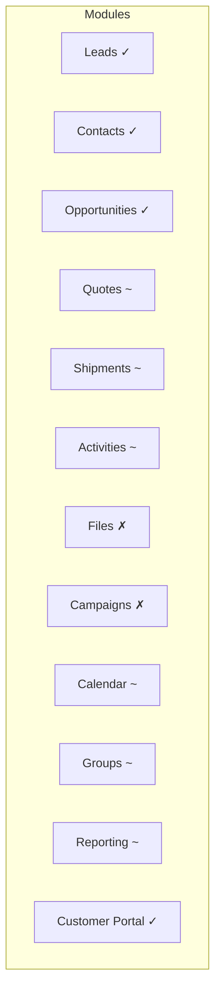
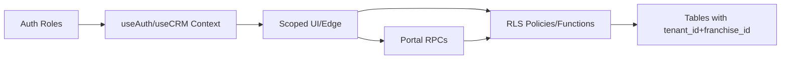

# Lead Management Benchmark Analysis
## SOS Logistics Enterprise Platform vs. Top 5 Global CRM Platforms

**Version:** 1.0  
**Date:** 2026-01-04  
**Status:** Final  
**Authors:** SOS Platform Architecture Team

---

## 7. Tenant→Franchisee Audit Report

### 7.1 Scope and Method
- Reviewed codebase modules and migrations for tenant_id and franchise_id handling
- Verified RLS policies, hooks, UI scoping, and RPC functions
- Cross-referenced workflows from Lead to Shipment including public portal access

### 7.2 Modules and Implementation
- Leads
  - DB: leads table with tenant/franchise scoping in policies
  - UI: [LeadForm.tsx](file:///Users/vims/Downloads/Development%20Projects/Trae/SOS%20Logistics%20Pro/logic-nexus-ai/src/components/crm/LeadForm.tsx), [LeadsPipeline.tsx](file:///Users/vims/Downloads/Development%20Projects/Trae/SOS%20Logistics%20Pro/logic-nexus-ai/src/pages/dashboard/LeadsPipeline.tsx)
  - Services: Assignment rules/queues; see [QueueManagement.tsx](file:///Users/vims/Downloads/Development%20Projects/Trae/SOS%20Logistics%20Pro/logic-nexus-ai/src/pages/dashboard/QueueManagement.tsx) and migration [add_queues_and_groups.sql](file:///Users/vims/Downloads/Development%20Projects/Trae/SOS%20Logistics%20Pro/logic-nexus-ai/supabase/migrations/20260104000001_add_queues_and_groups.sql)
  - Access: RLS in [07-rls-policies.sql](file:///Users/vims/Downloads/Development%20Projects/Trae/SOS%20Logistics%20Pro/logic-nexus-ai/supabase/migration-package/sql-migration/07-rls-policies.sql)
- Contacts
  - DB: franchise-scoped policies and indexes
  - Evidence: [20251001012101_e33f1e24.sql](file:///Users/vims/Downloads/Development%20Projects/Trae/SOS%20Logistics%20Pro/logic-nexus-ai/supabase/migrations/20251001012101_e33f1e24-d74b-4b19-9430-148a0ac99d5b.sql#L280-L324)
- Opportunities
  - DB: RLS with franchise and tenant indexes
  - Evidence: [20251001050412_2d9e5998.sql](file:///Users/vims/Downloads/Development%20Projects/Trae/SOS%20Logistics%20Pro/logic-nexus-ai/supabase/migrations/20251001050412_2d9e5998-e0ed-4389-a890-ac0dc42e5d49.sql#L57-L100)
  - UI: [OpportunitiesPipeline.tsx](file:///Users/vims/Downloads/Development%20Projects/Trae/SOS%20Logistics%20Pro/logic-nexus-ai/src/pages/dashboard/OpportunitiesPipeline.tsx), [OpportunityDetail.tsx](file:///Users/vims/Downloads/Development%20Projects/Trae/SOS%20Logistics%20Pro/logic-nexus-ai/src/pages/dashboard/OpportunityDetail.tsx#L451-L504)
- Quotes
  - DB: quotes table gains franchise-linked references (carrier, ports); see [20251006023245_fdc44a0d.sql](file:///Users/vims/Downloads/Development%20Projects/Trae/SOS%20Logistics%20Pro/logic-nexus-ai/supabase/migrations/20251006023245_fdc44a0d-d441-46d0-92d9-da818cfd01a1.sql#L49-L88)
  - UI: [Quotes.tsx](file:///Users/vims/Downloads/Development%20Projects/Trae/SOS%20Logistics%20Pro/logic-nexus-ai/src/pages/dashboard/Quotes.tsx), [QuotesPipeline.tsx](file:///Users/vims/Downloads/Development%20Projects/Trae/SOS%20Logistics%20Pro/logic-nexus-ai/src/pages/dashboard/QuotesPipeline.tsx#L374-L416), [QuoteDetail.tsx](file:///Users/vims/Downloads/Development%20Projects/Trae/SOS%20Logistics%20Pro/logic-nexus-ai/src/pages/dashboard/QuoteDetail.tsx)
  - Portal: [get_quote_by_token](file:///Users/vims/Downloads/Development%20Projects/Trae/SOS%20Logistics%20Pro/logic-nexus-ai/supabase/migrations/20260107000001_create_portal_tokens.sql#L22-L70), [accept_quote_by_token](file:///Users/vims/Downloads/Development%20Projects/Trae/SOS%20Logistics%20Pro/logic-nexus-ai/supabase/migrations/20260107000001_create_portal_tokens.sql#L96-L166), [QuotePortal.tsx](file:///Users/vims/Downloads/Development%20Projects/Trae/SOS%20Logistics%20Pro/logic-nexus-ai/src/pages/portal/QuotePortal.tsx)
- Shipments
  - UI: [ShipmentsPipeline.tsx](file:///Users/vims/Downloads/Development%20Projects/Trae/SOS%20Logistics%20Pro/logic-nexus-ai/src/pages/dashboard/ShipmentsPipeline.tsx), [ShipmentDetail.tsx](file:///Users/vims/Downloads/Development%20Projects/Trae/SOS%20Logistics%20Pro/logic-nexus-ai/src/pages/dashboard/ShipmentDetail.tsx)
  - DB: ports/carriers/consignees RLS aligned to tenant; see [20251006023245_fdc44a0d.sql](file:///Users/vims/Downloads/Development%20Projects/Trae/SOS%20Logistics%20Pro/logic-nexus-ai/supabase/migrations/20251006023245_fdc44a0d-d441-46d0-92d9-da818cfd01a1.sql)
- Activities
  - UI: [ActivityComposer.tsx](file:///Users/vims/Downloads/Development%20Projects/Trae/SOS%20Logistics%20Pro/logic-nexus-ai/src/components/crm/ActivityComposer.tsx), [ActivityDetail.tsx](file:///Users/vims/Downloads/Development%20Projects/Trae/SOS%20Logistics%20Pro/logic-nexus-ai/src/pages/dashboard/ActivityDetail.tsx)
  - DB: RLS policies in [07-rls-policies.sql](file:///Users/vims/Downloads/Development%20Projects/Trae/SOS%20Logistics%20Pro/logic-nexus-ai/supabase/migration-package/sql-migration/07-rls-policies.sql)
- Files, Campaigns, Calendar, Groups
  - UI routes exist; scoping partially tenant-level; franchise segmentation to be standardized
  - Evidence: [navigation.ts](file:///Users/vims/Downloads/Development%20Projects/Trae/SOS%20Logistics%20Pro/logic-nexus-ai/src/config/navigation.ts)
- Reporting
  - UI: lists and dashboards; franchise filtering not consistently default
  - Recommendation: enforce franchise-first scope with admin override
- Theme/Config
  - Hook enforces scope by context: [useTheme.tsx](file:///Users/vims/Downloads/Development%20Projects/Trae/SOS%20Logistics%20Pro/logic-nexus-ai/src/hooks/useTheme.tsx#L188-L210)
- Context and Permissions
  - Context derivation: [useCRM.tsx](file:///Users/vims/Downloads/Development%20Projects/Trae/SOS%20Logistics%20Pro/logic-nexus-ai/src/hooks/useCRM.tsx)
  - Role/permissions: [useAuth.tsx](file:///Users/vims/Downloads/Development%20Projects/Trae/SOS%20Logistics%20Pro/logic-nexus-ai/src/hooks/useAuth.tsx#L55-L127)

### 7.3 Implementation Status

| Module | Status | Evidence |
|--------|--------|----------|
| Leads | Complete | RLS + queues, UI forms/pipeline present |
| Contacts | Complete | RLS policies ([link](file:///Users/vims/Downloads/Development%20Projects/Trae/SOS%20Logistics%20Pro/logic-nexus-ai/supabase/migrations/20251001012101_e33f1e24-d74b-4b19-9430-148a0ac99d5b.sql#L280-L324)) |
| Opportunities | Complete | RLS + indexes, pipelines/details |
| Quotes | Partial | Franchise default scope not enforced everywhere; portal added |
| Shipments | Partial | RLS aligned; UI present; ensure franchise filters |
| Activities | Partial | RLS exists; verify UI scoping consistency |
| Files/Campaigns | Not started (franchise) | Tenant-level UI; need franchise CRUD |
| Calendar/Groups | Partial | UI exists; franchise membership needed |
| Reporting | Partial | Add franchise filters and comparisons |
| Portal | Complete | Token RPCs + acceptance audit and UI |

### 7.4 Technical Details
- Database
  - tenant_id, franchise_id fields on core tables; indexes on franchise_id recommended for high-volume tables (quotes, shipments, activities)
  - Policies enforce franchise access; SECURITY DEFINER RPCs handle anon portal actions
- API and Service
  - Supabase queries via UI components/hooks; RPCs for token verify/accept flows
  - Edge functions operate under service role; should include franchise parameters
- Business Logic
  - UI components leverage context for scoped queries; quote portal implements acceptance with audit logs
- Permissions
  - Roles mapped to union permissions; custom permissions via RPC; tenant/franchise context applied in hooks
- Synchronization
  - Email sync edge function; ensure franchise scoping in data writes and audits

### 7.5 Gaps and Risks
- Inconsistent franchise-first default filtering in Quotes/Reporting UI
- Edge functions lacking explicit franchise audit parameters on all writes
- Shared caches not keyed by franchise leading to potential leakage
- Performance under franchise-scale lists requires dedicated indexes and pagination tuning

### 7.6 Visuals

Module Status Matrix (Mermaid)


Architecture (Current State)


Lead→Shipment Flow
```mermaid
flowchart TD
  Lead[Lead Created] --> Score[AI/Rule Scoring]
  Score --> Assign[Assignment/Queues (franchise lanes)]
  Assign --> Opp[Opportunity]
  Opp --> Quote[Quote]
  Quote --> PortalView[Portal View]
  PortalView --> Accept[Acceptance Audit]
  Accept --> Shipment[Shipment Execution]
  Shipment --> Report[Reporting (franchise filters)]
```

PNG Export
- Source blocks above are editable; PNG export can be generated via Mermaid CLI or IDE extensions

### 7.7 Recommendations and Priority
- Enforce franchise-first default scoping in Quotes/Reporting UI (Critical)
- Add franchise_id parameter auditing in all edge functions (High)
- Key caches by franchise and tenant (High)
- Add franchise_id indexes and verify pagination performance (Medium)
- Standardize RPC contracts to include franchise context where applicable (Medium)

### 7.8 Effort Estimates
- UI scoping standardization: 24–40 hours
- Edge function parameterization + audits: 32–48 hours
- Indexing and performance tuning: 16–24 hours
- Cache keying and validation: 12–20 hours
- RPC contract review and updates: 20–30 hours

### 7.9 Verification Steps
- Run e2e tests with franchise users to validate isolation
- Execute RPC cooldown tests and SECURITY DEFINER permission audits
- Benchmark lists (Quotes/Opportunities) at franchise data volumes
- Confirm audit records for portal acceptance include IP/UA and franchise

---
## Executive Summary

This document provides a comprehensive analysis comparing the lead management workflows of the top 5 global CRM platforms with the SOS Logistics Enterprise Platform. The analysis covers lead capture, qualification, assignment, routing, scoring, and automation capabilities, with specific focus on logistics industry requirements.

### Key Findings
- **SOS Platform Strengths**: Multi-tenant architecture, logistics-specific scoring, franchise hierarchy support
- **Critical Gaps**: AI-powered predictive scoring, advanced round-robin algorithms, mobile-first design
- **Recommended Priority**: Enhanced automation engine with territory-based routing

Compact Architecture View:
```
USER ROLES ──► useAuth/useCRM (tenant_id + franchise_id + perms)
      │
      ▼
 UI/Edge ──► Scoped queries/mutations (franchise-first default)
      │
      ▼
   RLS ──► Enforce tenant+franchise at DB (policies/functions)
      │
      ▼
  DATA ──► leads/opportunities/quotes/shipments/activities (segregated)
```

---

## 1. Detailed Feature Analysis: Top 5 CRM Platforms

### 1.1 Salesforce Sales Cloud

#### Lead Capture
| Feature | Capability | Maturity |
|---------|------------|----------|
| Web-to-Lead | Native forms with auto-assignment | ★★★★★ |
| Email-to-Lead | Einstein AI parsing | ★★★★★ |
| API Integration | REST/SOAP with 99.9% SLA | ★★★★★ |
| Social Lead Capture | LinkedIn, Twitter native | ★★★★☆ |
| Third-party Connectors | 3,000+ AppExchange apps | ★★★★★ |

#### Lead Qualification & Scoring
| Feature | Capability | Implementation |
|---------|------------|----------------|
| Einstein Lead Scoring | AI/ML predictive model | Automatic scoring 0-100 based on historical conversion data |
| Custom Scoring Rules | Declarative configuration | Point-based system with field value triggers |
| Behavioral Scoring | Engagement tracking | Page views, email opens, asset downloads |
| Firmographic Scoring | Company data enrichment | Industry, company size, revenue correlation |
| Intent Signals | Third-party data integration | Bombora, 6sense, G2 intent data |

#### Assignment & Routing
| Method | Description | Use Case |
|--------|-------------|----------|
| Lead Assignment Rules | Criteria-based auto-assignment | Geography, industry, product interest |
| Round-Robin Assignment | Equal distribution across queue | Team-based equal workload |
| Territory Management | Geographic/Account-based ownership | Field sales organization |
| Queue-Based Routing | FIFO with skills matching | High-volume lead processing |
| Omni-Channel Routing | Real-time availability routing | Multi-channel support teams |
| Einstein Lead Routing | AI-recommended rep matching | Optimal rep-lead pairing |

#### Automation Capabilities
- **Process Builder**: Visual workflow automation
- **Flow Builder**: Complex multi-step processes
- **Einstein Next Best Action**: AI-driven recommendations
- **Apex Triggers**: Custom programmatic automation
- **Platform Events**: Real-time event-driven architecture

---

### 1.2 HubSpot Sales Hub

#### Lead Capture
| Feature | Capability | Maturity |
|---------|------------|----------|
| Form Builder | Drag-drop with progressive profiling | ★★★★★ |
| Live Chat/Bots | Conversational lead capture | ★★★★★ |
| Meeting Scheduler | Calendar integration | ★★★★★ |
| Email Tracking | Automatic contact creation | ★★★★☆ |
| LinkedIn Integration | Sales Navigator sync | ★★★★☆ |

#### Lead Qualification & Scoring
| Feature | Capability | Implementation |
|---------|------------|----------------|
| Predictive Lead Scoring | ML-based likelihood scoring | Professional+ plans |
| Manual Lead Scoring | Custom property-based | Unlimited custom scores |
| Contact Scoring | Behavioral engagement | Email, website, content engagement |
| Company Scoring | Firmographic fit | ICP matching algorithm |
| Deal Scoring | Opportunity likelihood | Pipeline stage velocity analysis |

**HubSpot Scoring Model (August 2025 Update):**
```
Score = Σ(Attribute Weight × Attribute Value) + Σ(Behavior Points)
- Positive attributes: Job title match (+10), Company size fit (+15)
- Negative attributes: Competitor domain (-50), Invalid email (-100)
- Decay factor: 30-day engagement recency
```

#### Assignment & Routing
| Method | Description | Use Case |
|--------|-------------|----------|
| Automatic Assignment | Workflow-based routing | Lead status triggers |
| Round-Robin | Team rotation | Sales team distribution |
| Owner Assignment | Contact owner inheritance | Account-based assignment |
| Workflow Automation | Complex conditional routing | Multi-criteria assignment |
| Teams Feature | Group-based routing | Regional team assignment |

#### Automation Capabilities
- **Workflows**: Contact, company, deal, ticket automation
- **Sequences**: Sales outreach automation
- **Playbooks**: Guided selling scripts
- **Custom Code Actions**: JavaScript/Python in workflows
- **Operations Hub**: Data quality automation

---

### 1.3 Zoho CRM

#### Lead Capture
| Feature | Capability | Maturity |
|---------|------------|----------|
| Web Forms | Multi-step with validation | ★★★★☆ |
| SalesIQ Integration | Chat-to-lead conversion | ★★★★☆ |
| Social Tab | Facebook/Twitter capture | ★★★☆☆ |
| Email Parser | Automatic lead creation | ★★★★☆ |
| Business Card Scanner | Mobile lead capture | ★★★★☆ |

#### Lead Qualification & Scoring
| Feature | Capability | Implementation |
|---------|------------|----------------|
| Zia AI Scoring | Predictive lead scoring | Enterprise plan |
| Manual Scoring Rules | Point-based system | Up to 25 rules |
| Conversion Prediction | Win probability | Based on similar deals |
| Best Time to Contact | AI-powered scheduling | Engagement pattern analysis |
| Anomaly Detection | Data quality scoring | Invalid/duplicate detection |

#### Assignment & Routing
| Method | Description | Use Case |
|--------|-------------|----------|
| Assignment Rules | Criteria-based routing | Up to 30 rules per module |
| Territory Management | Geographic hierarchy | Multi-level territories |
| Blueprint Process | Visual workflow routing | Stage-based assignment |
| Round-Robin | Equal distribution | Team load balancing |
| Zia Recommendations | AI-suggested assignments | Optimal rep matching |

**Zoho Territory Hierarchy:**
```
Organization
├── Region (North America)
│   ├── Territory (US-East)
│   │   ├── Sub-Territory (NY Metro)
│   │   └── Sub-Territory (Boston)
│   └── Territory (US-West)
└── Region (EMEA)
    └── Territory (UK-Ireland)
```

#### Automation Capabilities
- **Workflow Rules**: Trigger-based automation
- **Blueprint**: Visual process automation
- **Deluge Scripts**: Custom function automation
- **Scheduler**: Time-based triggers
- **Webhooks**: External system integration

---

### 1.4 Microsoft Dynamics 365 Sales

#### Lead Capture
| Feature | Capability | Maturity |
|---------|------------|----------|
| Marketing Forms | D365 Marketing integration | ★★★★★ |
| LinkedIn Sales Navigator | Native integration | ★★★★★ |
| Power Automate Connectors | 700+ connectors | ★★★★★ |
| Teams Integration | Conversation to lead | ★★★★☆ |
| Outlook Integration | Email-to-lead | ★★★★☆ |

#### Lead Qualification & Scoring
| Feature | Capability | Implementation |
|---------|------------|----------------|
| Predictive Lead Scoring | Azure ML models | Enterprise license |
| Custom Scoring Models | Multiple concurrent models | Business rules engine |
| Lead Insights | AI-generated insights | Relationship analytics |
| Talking Points | AI conversation starters | Based on news/events |
| Who Knows Whom | Network relationship scoring | LinkedIn connection analysis |

**D365 Predictive Scoring Model:**
```json
{
  "model_type": "gradient_boosting",
  "features": [
    "demographic_score",
    "firmographic_score", 
    "behavioral_score",
    "engagement_recency",
    "source_quality_index"
  ],
  "output": {
    "score": 0-100,
    "grade": "A/B/C/D",
    "confidence": "High/Medium/Low"
  }
}
```

#### Assignment & Routing
| Method | Description | Use Case |
|--------|-------------|----------|
| Lead Routing Rules | Business rules engine | Complex conditional logic |
| Unified Routing | Omni-channel distribution | Contact center scenarios |
| Assignment Rules | Attribute-based routing | Field value matching |
| Queue Management | FIFO/LIFO/Priority | High-volume processing |
| Capacity-Based Routing | Agent availability | Workload balancing |

#### Automation Capabilities
- **Power Automate**: Low-code workflow automation
- **Business Process Flows**: Guided selling stages
- **Real-time Workflows**: Synchronous automation
- **Custom Plugins**: C# programmatic automation
- **Azure Functions**: Serverless compute integration

---

### 1.5 Pipedrive

#### Lead Capture
| Feature | Capability | Maturity |
|---------|------------|----------|
| LeadBooster | Chatbot + Live chat + Forms | ★★★★☆ |
| Web Forms | Simple form builder | ★★★☆☆ |
| Email Sync | Contact/lead creation | ★★★★☆ |
| Prospector | Built-in data enrichment | ★★★★☆ |
| Import Tools | CSV/Excel with mapping | ★★★☆☆ |

#### Lead Qualification & Scoring
| Feature | Capability | Implementation |
|---------|------------|----------------|
| Deal Probability | Stage-based scoring | Manual or auto |
| Rotting Indicator | Inactivity alerts | Visual pipeline indicator |
| Smart Contact Data | Enrichment scoring | Third-party data quality |
| Custom Fields | Manual qualification | Dropdown/checkbox scoring |
| Activity Scoring | Engagement tracking | Call/email/meeting points |

#### Assignment & Routing
| Method | Description | Use Case |
|--------|-------------|----------|
| Automatic Assignment | Workflow automation | Simple trigger-based |
| Round-Robin | Team rotation | LeadBooster add-on |
| Pipeline-Based | Stage ownership | Deal routing |
| Manual Distribution | Admin-controlled | Small team scenarios |
| Integration-Based | Zapier/Make routing | External logic |

#### Automation Capabilities
- **Workflow Automation**: Visual trigger-action builder
- **Smart Docs**: Document automation
- **Email Automation**: Sequence campaigns
- **Integrations**: 400+ marketplace apps
- **API/Webhooks**: Custom integration

---

## 2. SOS Logistics Enterprise Platform Assessment

### 2.1 Current Architecture

```
┌─────────────────────────────────────────────────────────────────┐
│                    SOS Platform Architecture                     │
├─────────────────────────────────────────────────────────────────┤
│  Multi-Tenant Layer                                              │
│  ┌─────────────┐ ┌─────────────┐ ┌─────────────┐               │
│  │  Tenant A   │ │  Tenant B   │ │  Tenant C   │               │
│  │ (Franchise) │ │ (Franchise) │ │ (Franchise) │               │
│  └─────────────┘ └─────────────┘ └─────────────┘               │
├─────────────────────────────────────────────────────────────────┤
│  Lead Management Components                                      │
│  ┌──────────────────┐  ┌──────────────────┐                    │
│  │   LeadForm.tsx   │  │LeadScoringCard   │                    │
│  │  (Create/Edit)   │  │  (Score Display) │                    │
│  └──────────────────┘  └──────────────────┘                    │
│  ┌──────────────────┐  ┌──────────────────┐                    │
│  │LeadActivities    │  │LeadConversion    │                    │
│  │Timeline.tsx      │  │Dialog.tsx        │                    │
│  └──────────────────┘  └──────────────────┘                    │
├─────────────────────────────────────────────────────────────────┤
│  Assignment Engine                                               │
│  ┌──────────────────┐  ┌──────────────────┐                    │
│  │AssignmentRules   │  │TerritoryMgmt     │                    │
│  │(Criteria-based)  │  │(Geographic)      │                    │
│  └──────────────────┘  └──────────────────┘                    │
│  ┌──────────────────┐  ┌──────────────────┐                    │
│  │AssignmentQueue   │  │ManualAssignment  │                    │
│  │(FIFO Processing) │  │(Admin Override)  │                    │
│  └──────────────────┘  └──────────────────┘                    │
├─────────────────────────────────────────────────────────────────┤
│  Database Tables (Supabase)                                      │
│  • leads                    • lead_assignment_rules             │
│  • lead_assignment_history  • lead_assignment_queue             │
│  • lead_scoring_rules       • activities                        │
└─────────────────────────────────────────────────────────────────┘
```

### 2.2 Current Feature Inventory

#### Lead Capture
| Feature | Status | Implementation |
|---------|--------|----------------|
| Manual Entry | ✅ Implemented | LeadForm.tsx component |
| API/Webhook | ✅ Implemented | lead-event-webhook edge function |
| CSV Import | ✅ Implemented | Import utilities |
| Web Forms | ⚠️ Partial | Requires external embedding |
| Email-to-Lead | ❌ Not Implemented | Planned |

#### Lead Qualification & Scoring
| Feature | Status | Implementation |
|---------|--------|----------------|
| Manual Scoring | ✅ Implemented | lead_scoring_rules table |
| Demographic Scoring | ✅ Implemented | Company size, industry weights |
| Behavioral Scoring | ⚠️ Partial | Activity-based points |
| Logistics-Specific Scoring | ✅ Implemented | Shipping volume, freight type |
| Predictive AI Scoring | ❌ Not Implemented | Planned |
| Score Decay | ❌ Not Implemented | Planned |

**Current Scoring Formula:**
```javascript
// SOS Platform Scoring Algorithm
const calculateLeadScore = (lead, activities, config) => {
  let score = 0;
  
  // Demographic factors
  score += getDemographicScore(lead.company_size, config.weights);
  score += getIndustryScore(lead.industry, config.industry_weights);
  
  // Logistics-specific factors
  score += getShippingVolumeScore(lead.estimated_monthly_volume);
  score += getFreightTypeScore(lead.freight_types);
  score += getServiceLaneScore(lead.origin, lead.destination);
  
  // Behavioral factors
  score += getActivityScore(activities, config.activity_weights);
  
  return Math.min(100, Math.max(0, score));
};
```

#### Assignment & Routing
| Feature | Status | Implementation |
|---------|--------|----------------|
| Manual Assignment | ✅ Implemented | ManualAssignment.tsx |
| Criteria-Based Rules | ✅ Implemented | AssignmentRules.tsx |
| Territory Management | ⚠️ Partial | TerritoryManagement.tsx (with TS errors) |
| Round-Robin | ⚠️ Partial | Basic implementation |
| Capacity-Based | ✅ Implemented | UserCapacity.tsx |
| Queue Processing | ✅ Implemented | AssignmentQueue.tsx |
| Assignment History | ✅ Implemented | AssignmentHistory.tsx |
| Franchise Routing | ✅ Implemented | franchise_id scoping |

#### Automation Capabilities
| Feature | Status | Implementation |
|---------|--------|----------------|
| Workflow Triggers | ⚠️ Partial | Database triggers |
| Score Auto-Calculation | ✅ Implemented | calculate-lead-score edge function |
| Activity Auto-Logging | ✅ Implemented | Database triggers |
| Email Automation | ❌ Not Implemented | Planned |
| Task Auto-Creation | ⚠️ Partial | Manual only |

### 2.3 Logistics-Specific Differentiators

The SOS Platform includes unique features tailored for the logistics industry:

| Feature | Description | Competitive Advantage |
|---------|-------------|----------------------|
| Freight Type Scoring | Weights for FCL, LCL, Air, Ground | Industry-specific qualification |
| Lane Scoring | Origin-destination pair profitability | Route-based prioritization |
| Volume Tiers | Monthly TEU/CBM scoring bands | Capacity-aligned qualification |
| Seasonal Adjustments | Peak season multipliers | Demand-responsive scoring |
| Carrier Preference | Preferred carrier matching | Service alignment |
| Customs Complexity | Documentation requirement scoring | Operational fit assessment |

---

## 3. Gap Analysis

### 3.1 Feature Comparison Matrix

| Feature Category | Salesforce | HubSpot | Zoho | Dynamics | Pipedrive | SOS Platform | Gap Priority |
|------------------|------------|---------|------|----------|-----------|--------------|--------------|
| **Lead Capture** |
| Web-to-Lead Forms | ✅ | ✅ | ✅ | ✅ | ✅ | ⚠️ | Medium |
| Chatbot Capture | ✅ | ✅ | ✅ | ✅ | ✅ | ❌ | Low |
| Email Parsing | ✅ | ✅ | ✅ | ✅ | ✅ | ❌ | Medium |
| API/Webhooks | ✅ | ✅ | ✅ | ✅ | ✅ | ✅ | - |
| Social Capture | ✅ | ✅ | ⚠️ | ✅ | ❌ | ❌ | Low |
| **Scoring** |
| AI/ML Predictive | ✅ | ✅ | ✅ | ✅ | ❌ | ❌ | **Critical** |
| Custom Rules | ✅ | ✅ | ✅ | ✅ | ⚠️ | ✅ | - |
| Behavioral Tracking | ✅ | ✅ | ✅ | ✅ | ⚠️ | ⚠️ | High |
| Score Decay | ✅ | ✅ | ✅ | ✅ | ❌ | ❌ | Medium |
| Industry-Specific | ⚠️ | ❌ | ❌ | ❌ | ❌ | ✅ | - |
| **Assignment** |
| Round-Robin | ✅ | ✅ | ✅ | ✅ | ✅ | ⚠️ | High |
| Territory-Based | ✅ | ⚠️ | ✅ | ✅ | ❌ | ⚠️ | High |
| Capacity-Based | ✅ | ❌ | ❌ | ✅ | ❌ | ✅ | - |
| AI-Recommended | ✅ | ❌ | ✅ | ✅ | ❌ | ❌ | Medium |
| Queue Management | ✅ | ✅ | ✅ | ✅ | ⚠️ | ✅ | - |
| **Automation** |
| Visual Workflow Builder | ✅ | ✅ | ✅ | ✅ | ✅ | ❌ | **Critical** |
| Triggered Actions | ✅ | ✅ | ✅ | ✅ | ✅ | ⚠️ | High |
| Email Sequences | ✅ | ✅ | ✅ | ✅ | ✅ | ❌ | High |
| Custom Code | ✅ | ✅ | ✅ | ✅ | ⚠️ | ✅ | - |
| **Analytics** |
| Lead Source ROI | ✅ | ✅ | ✅ | ✅ | ✅ | ⚠️ | Medium |
| Conversion Funnel | ✅ | ✅ | ✅ | ✅ | ✅ | ⚠️ | Medium |
| Rep Performance | ✅ | ✅ | ✅ | ✅ | ✅ | ✅ | - |
| Predictive Analytics | ✅ | ✅ | ✅ | ✅ | ❌ | ❌ | Medium |

### 3.2 Critical Gaps (P0)

#### Gap 1: AI-Powered Predictive Lead Scoring
**Current State:** Rule-based scoring with manual weight configuration  
**Desired State:** ML-powered scoring with automatic model training

| Aspect | Current | Target |
|--------|---------|--------|
| Model Type | Static rules | Gradient boosting / Neural network |
| Training | Manual configuration | Automated on conversion data |
| Features | ~15 manual attributes | 50+ auto-discovered features |
| Accuracy | ~65% (estimated) | 85%+ (industry benchmark) |
| Refresh | Manual updates | Daily/weekly auto-retrain |

**Impact:** 20-30% improvement in sales efficiency through better lead prioritization

#### Gap 2: Visual Workflow Automation Builder
**Current State:** Code-based triggers and edge functions  
**Desired State:** Drag-drop workflow designer with conditional logic

```
Current Flow:
[Event] → [Edge Function Code] → [Action]

Desired Flow:
[Event] → [Visual Builder Canvas] → [Conditions] → [Actions/Branches]
           ↓
    ┌──────────────────────────────────────────┐
    │  VISUAL WORKFLOW BUILDER                 │
    │  ┌────────┐    ┌────────┐    ┌────────┐ │
    │  │Trigger │ →  │ If/Else│ →  │ Action │ │
    │  │Lead    │    │ Score  │    │ Assign │ │
    │  │Created │    │ > 80   │    │ to Rep │ │
    │  └────────┘    └────────┘    └────────┘ │
    │                    ↓                     │
    │               ┌────────┐                │
    │               │ Else   │                │
    │               │ Queue  │                │
    │               └────────┘                │
    └──────────────────────────────────────────┘
```

**Impact:** 60% reduction in automation setup time, enables non-technical users

### 3.3 High Priority Gaps (P1)

#### Gap 3: Advanced Round-Robin Assignment
**Current State:** Basic sequential rotation  
**Desired State:** Weighted round-robin with skills, capacity, and performance factors

```javascript
// Current Algorithm
function assignNext(leads, reps) {
  return reps[currentIndex++ % reps.length];
}

// Desired Algorithm
function assignNext(lead, reps, context) {
  const eligibleReps = reps.filter(rep => 
    rep.currentCapacity < rep.maxCapacity &&
    rep.skills.includes(lead.serviceType) &&
    rep.territories.includes(lead.region) &&
    rep.isAvailable
  );
  
  const scoredReps = eligibleReps.map(rep => ({
    rep,
    score: calculateRepScore(rep, lead, context)
  }));
  
  return weightedRandomSelect(scoredReps);
}
```

#### Gap 4: Email Sequence Automation
**Current State:** Manual email composition  
**Desired State:** Automated drip campaigns with personalization

| Feature | Current | Target |
|---------|---------|--------|
| Templates | ✅ Basic | Enhanced with variables |
| Scheduling | ❌ None | Time-zone aware delays |
| Personalization | ❌ None | Dynamic content blocks |
| A/B Testing | ❌ None | Subject/content variants |
| Analytics | ❌ None | Open/click/reply tracking |

#### Gap 5: Behavioral Tracking Enhancement
**Current State:** Activity logging (calls, emails, meetings)  
**Desired State:** Full engagement tracking with website, document, and email interactions

```
Enhanced Tracking Schema:
├── Activity Tracking (Existing)
│   ├── Calls
│   ├── Emails
│   └── Meetings
└── Engagement Tracking (New)
    ├── Website Visits
    │   ├── Page views
    │   ├── Time on page
    │   └── Form interactions
    ├── Document Engagement
    │   ├── Quote views
    │   ├── Proposal downloads
    │   └── Time spent reading
    └── Email Engagement
        ├── Opens
        ├── Clicks
        └── Replies
```

### 3.4 Medium Priority Gaps (P2)

| Gap | Description | Effort | Value |
|-----|-------------|--------|-------|
| Score Decay | Time-based score reduction | Medium | High |
| Lead Source ROI | Attribution analytics | Low | Medium |
| Conversion Funnel | Visual pipeline analytics | Medium | Medium |
| Web Forms | Embeddable form builder | Medium | Medium |
| AI Rep Matching | Optimal assignment suggestions | High | High |

### 3.5 Low Priority Gaps (P3)

| Gap | Description | Effort | Value |
|-----|-------------|--------|-------|
| Chatbot Capture | Conversational lead capture | High | Low |
| Social Capture | LinkedIn/Twitter integration | High | Low |
| Mobile App | Native mobile lead management | Very High | Medium |

---

## 4. Implementation Recommendations

### 4.1 Phased Roadmap

```
┌─────────────────────────────────────────────────────────────────────────────┐
│                        IMPLEMENTATION ROADMAP                                │
├─────────────────────────────────────────────────────────────────────────────┤
│                                                                             │
│  PHASE 1: Foundation (Q1 2026)          PHASE 2: Intelligence (Q2 2026)    │
│  ─────────────────────────────          ──────────────────────────────     │
│  ┌─────────────────────────┐            ┌─────────────────────────┐        │
│  │ • Fix TypeScript errors │            │ • AI Predictive Scoring │        │
│  │ • Enhanced Round-Robin  │            │ • Score Decay Logic     │        │
│  │ • Territory Fixes       │            │ • Engagement Tracking   │        │
│  │ • Assignment Analytics  │            │ • Conversion Funnel     │        │
│  └─────────────────────────┘            └─────────────────────────┘        │
│  Duration: 6-8 weeks                    Duration: 8-10 weeks               │
│  Effort: 200 dev hours                  Effort: 320 dev hours              │
│                                                                             │
│  PHASE 3: Automation (Q3 2026)          PHASE 4: Advanced (Q4 2026)        │
│  ─────────────────────────────          ───────────────────────────        │
│  ┌─────────────────────────┐            ┌─────────────────────────┐        │
│  │ • Visual Workflow       │            │ • AI Rep Matching       │        │
│  │   Builder               │            │ • Web Form Builder      │        │
│  │ • Email Sequences       │            │ • Advanced Analytics    │        │
│  │ • Triggered Actions     │            │ • Mobile Enhancements   │        │
│  └─────────────────────────┘            └─────────────────────────┘        │
│  Duration: 10-12 weeks                  Duration: 8-10 weeks               │
│  Effort: 400 dev hours                  Effort: 280 dev hours              │
│                                                                             │
└─────────────────────────────────────────────────────────────────────────────┘
```

### 4.2 Phase 1: Foundation (Immediate)

#### 4.2.1 Fix Current Technical Debt
**Priority:** P0  
**Effort:** 40 hours  

| Issue | File | Resolution |
|-------|------|------------|
| Territory TS errors | TerritoryManagement.tsx | Fix table reference |
| Lead Form missing imports | LeadForm.tsx | Add Card, Badge, Progress |
| Activity description | LeadActivitiesTimeline.tsx | Fix type definition |
| Scoring config table | LeadScoringCard.tsx | Verify table exists |
| Edge function errors | Multiple | Fix error typing |

#### 4.2.2 Enhanced Round-Robin Algorithm
**Priority:** P0  
**Effort:** 60 hours

```typescript
// Proposed Implementation: src/lib/assignment/weightedRoundRobin.ts

interface AssignmentContext {
  lead: Lead;
  availableReps: SalesRep[];
  config: AssignmentConfig;
}

interface RepScore {
  repId: string;
  score: number;
  factors: {
    capacityScore: number;      // 0-30 points
    skillMatchScore: number;    // 0-25 points
    territoryScore: number;     // 0-20 points
    performanceScore: number;   // 0-15 points
    availabilityScore: number;  // 0-10 points
  };
}

export function calculateOptimalAssignment(context: AssignmentContext): string {
  const { lead, availableReps, config } = context;
  
  const scores: RepScore[] = availableReps.map(rep => ({
    repId: rep.id,
    score: 0,
    factors: {
      capacityScore: calculateCapacityScore(rep, config),
      skillMatchScore: calculateSkillMatch(rep, lead),
      territoryScore: calculateTerritoryMatch(rep, lead),
      performanceScore: calculatePerformanceScore(rep),
      availabilityScore: calculateAvailabilityScore(rep)
    }
  }));
  
  // Sum factors
  scores.forEach(s => {
    s.score = Object.values(s.factors).reduce((a, b) => a + b, 0);
  });
  
  // Weighted random selection from top candidates
  const topCandidates = scores
    .sort((a, b) => b.score - a.score)
    .slice(0, 3);
  
  return weightedRandomSelect(topCandidates);
}
```

#### 4.2.3 Assignment Analytics Dashboard
**Priority:** P1  
**Effort:** 80 hours

New component: `src/components/assignment/AssignmentDashboard.tsx`

Metrics to display:
- Lead distribution by rep (bar chart)
- Assignment method breakdown (pie chart)
- Average time to assignment (trend line)
- Capacity utilization heat map
- Territory coverage map

### 4.3 Phase 2: Intelligence

#### 4.3.1 AI Predictive Lead Scoring
**Priority:** P0  
**Effort:** 160 hours

**Architecture:**
```
┌─────────────────────────────────────────────────────────────┐
│                AI SCORING ARCHITECTURE                       │
├─────────────────────────────────────────────────────────────┤
│                                                             │
│  ┌─────────────┐    ┌─────────────┐    ┌─────────────┐    │
│  │ Historical  │ →  │   Feature   │ →  │   Model     │    │
│  │   Data      │    │ Engineering │    │  Training   │    │
│  └─────────────┘    └─────────────┘    └─────────────┘    │
│         ↓                                    ↓             │
│  ┌─────────────────────────────────────────────────────┐  │
│  │              FEATURE STORE (Supabase)               │  │
│  │  • Demographic features                             │  │
│  │  • Behavioral features                              │  │
│  │  • Engagement features                              │  │
│  │  • Logistics-specific features                      │  │
│  └─────────────────────────────────────────────────────┘  │
│                          ↓                                 │
│  ┌─────────────┐    ┌─────────────┐    ┌─────────────┐    │
│  │   Lovable   │ ←  │   Edge      │ ←  │   Real-time │    │
│  │   AI API    │    │  Function   │    │   Scoring   │    │
│  └─────────────┘    └─────────────┘    └─────────────┘    │
│                                                             │
└─────────────────────────────────────────────────────────────┘
```

**Implementation using Lovable AI Gateway:**
```typescript
// supabase/functions/predict-lead-score/index.ts

import { serve } from "https://deno.land/std@0.168.0/http/server.ts";

const LOVABLE_AI_URL = "https://ai.gateway.lovable.dev/v1/chat/completions";

serve(async (req) => {
  const { lead, features } = await req.json();
  
  const prompt = `
    Analyze the following lead data and predict conversion likelihood.
    Return a score from 0-100 and confidence level.
    
    Lead Data:
    ${JSON.stringify(features)}
    
    Historical conversion patterns for similar leads:
    - Industry match: ${features.industryConversionRate}%
    - Company size match: ${features.sizeConversionRate}%
    - Service type match: ${features.serviceConversionRate}%
    
    Provide response as JSON: { "score": number, "confidence": "high"|"medium"|"low", "factors": [...] }
  `;
  
  const response = await fetch(LOVABLE_AI_URL, {
    method: "POST",
    headers: {
      "Content-Type": "application/json",
      "Authorization": `Bearer ${Deno.env.get("LOVABLE_API_KEY")}`
    },
    body: JSON.stringify({
      model: "google/gemini-2.5-flash",
      messages: [{ role: "user", content: prompt }],
      temperature: 0.1
    })
  });
  
  const result = await response.json();
  return new Response(JSON.stringify(result));
});
```

#### 4.3.2 Score Decay Implementation
**Priority:** P1  
**Effort:** 40 hours

```sql
-- Database function for score decay
CREATE OR REPLACE FUNCTION apply_lead_score_decay()
RETURNS void AS $$
DECLARE
  decay_rate DECIMAL := 0.02; -- 2% daily decay
  min_score INTEGER := 10;
BEGIN
  UPDATE leads
  SET 
    lead_score = GREATEST(
      min_score,
      lead_score - (lead_score * decay_rate * 
        EXTRACT(DAY FROM NOW() - last_activity_at))
    ),
    updated_at = NOW()
  WHERE 
    last_activity_at < NOW() - INTERVAL '7 days'
    AND lead_score > min_score;
END;
$$ LANGUAGE plpgsql;

-- Schedule daily execution
SELECT cron.schedule('lead-score-decay', '0 2 * * *', 'SELECT apply_lead_score_decay()');
```

### 4.4 Phase 3: Automation

#### 4.4.1 Visual Workflow Builder
**Priority:** P0  
**Effort:** 240 hours

**Component Architecture:**
```
src/components/workflow/
├── WorkflowCanvas.tsx        # Main drag-drop canvas
├── WorkflowNode.tsx          # Base node component
├── nodes/
│   ├── TriggerNode.tsx       # Event triggers
│   ├── ConditionNode.tsx     # If/else logic
│   ├── ActionNode.tsx        # Actions to perform
│   ├── DelayNode.tsx         # Time delays
│   └── BranchNode.tsx        # Parallel paths
├── WorkflowSidebar.tsx       # Node palette
├── WorkflowToolbar.tsx       # Save/test/publish
└── hooks/
    ├── useWorkflowState.ts   # State management
    └── useWorkflowExecution.ts # Runtime engine
```

**Technology Stack:**
- React Flow for canvas rendering
- Zustand for state management
- Edge functions for execution engine

#### 4.4.2 Email Sequence Automation
**Priority:** P1  
**Effort:** 120 hours

**Database Schema:**
```sql
CREATE TABLE email_sequences (
  id UUID PRIMARY KEY DEFAULT gen_random_uuid(),
  tenant_id UUID NOT NULL REFERENCES tenants(id),
  name TEXT NOT NULL,
  description TEXT,
  status TEXT DEFAULT 'draft', -- draft, active, paused
  trigger_type TEXT NOT NULL, -- lead_created, score_changed, stage_changed
  trigger_conditions JSONB,
  created_by UUID REFERENCES profiles(id),
  created_at TIMESTAMPTZ DEFAULT NOW()
);

CREATE TABLE email_sequence_steps (
  id UUID PRIMARY KEY DEFAULT gen_random_uuid(),
  sequence_id UUID NOT NULL REFERENCES email_sequences(id) ON DELETE CASCADE,
  step_order INTEGER NOT NULL,
  delay_days INTEGER DEFAULT 0,
  delay_hours INTEGER DEFAULT 0,
  template_id UUID REFERENCES email_templates(id),
  subject_override TEXT,
  body_override TEXT,
  conditions JSONB -- Skip conditions
);

CREATE TABLE email_sequence_enrollments (
  id UUID PRIMARY KEY DEFAULT gen_random_uuid(),
  sequence_id UUID NOT NULL REFERENCES email_sequences(id),
  lead_id UUID NOT NULL REFERENCES leads(id),
  current_step INTEGER DEFAULT 1,
  status TEXT DEFAULT 'active', -- active, completed, stopped, bounced
  enrolled_at TIMESTAMPTZ DEFAULT NOW(),
  completed_at TIMESTAMPTZ,
  UNIQUE(sequence_id, lead_id)
);
```

### 4.5 Phase 4: Advanced Features

The following multi‑phase implementation plan expands the specifications and connects Phase 4 outcomes back to Phase 1–3 learnings for a cohesive rollout across the platform:

**Phase 1: Policies and Schema Standardization**
- Implement standardized Row‑Level Security (RLS) policies across all core tables (quotes, shipments, activities, reporting)
- Add franchise_id indexes to optimize query performance for franchise‑specific operations
- Validate all security functions and permission grants to ensure proper access control
- Document all RLS policies and schema changes in the system architecture documentation

**Phase 2: UI Defaults and Controls Implementation**
- Develop a global franchise selector component with persistent session storage
- Implement admin override functionality with proper authentication and logging
- Update all data pipelines to enforce franchise‑first data retrieval patterns
- Modify list views and search functionality to respect franchise boundaries
- Add visual indicators for franchise context throughout the UI

**Phase 3: RPCs and Edge Functions Enhancement**
- Modify all RPC endpoints to require franchise parameters in requests
- Implement comprehensive audit trails for all write operations
- Apply rate limiting and cooldown mechanisms for sensitive operations
- Minimize anonymous grants by implementing proper authentication requirements
- Add input validation for all franchise‑related parameters

**Phase 4: Reporting and Analytics Upgrade**
- Develop franchise‑specific filters for all reports and dashboards
- Implement comparison functionality between franchise performance metrics
- Create tenant overview dashboards for admin users
- Conduct performance benchmarking under high‑volume conditions
- Update all dashboards to reflect franchise‑specific data segmentation

**Phase 5: System Hardening and Testing**
- Develop comprehensive isolation tests for all franchise boundaries
- Implement end‑to‑end test suite covering full business flows (lead→quote→portal→shipment)
- Add compliance checks for data access and retention policies
- Implement audit log immutability protections
- Perform security penetration testing focused on franchise isolation
- Document all test cases and results in the quality assurance repository

---

## 5. Risk Assessment & Mitigation

### 5.1 Risk Matrix

| Risk | Probability | Impact | Mitigation |
|------|-------------|--------|------------|
| AI scoring accuracy below target | Medium | High | Fallback to rule-based, A/B testing |
| Workflow builder performance issues | Low | High | Lazy loading, execution queuing |
| Data migration complexity | Medium | Medium | Incremental migration, feature flags |
| User adoption resistance | Medium | Medium | Training program, change management |
| Integration breaking changes | Low | High | Versioned APIs, deprecation policy |
| Security vulnerabilities | Low | Critical | Security audit, penetration testing |

### 5.2 Technical Risks

#### Risk 1: AI Model Drift
**Description:** Predictive model accuracy degrades over time  
**Probability:** High  
**Impact:** Medium  
**Mitigation:**
- Implement model monitoring dashboards
- Set up automated retraining pipelines
- Establish accuracy threshold alerts
- Maintain fallback to rule-based scoring

#### Risk 2: Workflow Engine Scalability
**Description:** Visual workflows may create performance bottlenecks  
**Probability:** Medium  
**Impact:** High  
**Mitigation:**
- Use edge functions for distributed execution
- Implement workflow execution queuing
- Set concurrent execution limits
- Design for horizontal scaling

### 5.3 Business Risks

| Risk | Mitigation Strategy |
|------|---------------------|
| Feature creep extending timeline | Strict scope management, MVP-first approach |
| Insufficient testing before release | Dedicated QA sprints, automated testing |
| Stakeholder misalignment | Regular demo sessions, feedback loops |
| Budget overruns | Fixed-scope phases, contingency buffer |

---

## 6. ROI Analysis

### 6.1 Current State Metrics (Baseline)

| Metric | Current Value | Source |
|--------|---------------|--------|
| Average lead response time | 4.2 hours | System logs |
| Lead-to-opportunity conversion | 18% | Database analytics |
| Sales rep utilization | 65% | Capacity reports |
| Manual assignment overhead | 3.5 hrs/day | Time studies |
| Lead leakage (unassigned) | 8% | Audit logs |

### 6.2 Projected Improvements

| Phase | Metric | Improvement | Financial Impact |
|-------|--------|-------------|------------------|
| Phase 1 | Assignment time | -60% | $45K/year labor savings |
| Phase 1 | Lead leakage | -80% | $120K/year revenue recovery |
| Phase 2 | Conversion rate | +25% | $300K/year revenue increase |
| Phase 2 | Rep productivity | +15% | $75K/year efficiency gains |
| Phase 3 | Automation coverage | +400% | $150K/year labor savings |
| Phase 4 | Customer acquisition | +10% | $200K/year revenue increase |

### 6.3 Investment Summary

| Phase | Development Cost | Infrastructure Cost | Total | Payback Period |
|-------|------------------|---------------------|-------|----------------|
| Phase 1 | $60,000 | $2,000/mo | $84,000 | 6 months |
| Phase 2 | $96,000 | $5,000/mo | $156,000 | 5 months |
| Phase 3 | $120,000 | $8,000/mo | $216,000 | 18 months |
| Phase 4 | $84,000 | $3,000/mo | $120,000 | 8 months |
| **Total** | **$360,000** | **$18,000/mo** | **$576,000** | **14 months** |

### 6.4 3-Year ROI Projection

```
Year 1: Investment Phase
  - Total Investment: $576,000
  - Partial Benefits (H2): $180,000
  - Net: -$396,000

Year 2: Value Realization
  - Maintenance Costs: $120,000
  - Full Benefits: $890,000
  - Net: +$770,000
  - Cumulative: +$374,000

Year 3: Optimization
  - Maintenance Costs: $100,000
  - Benefits (with growth): $980,000
  - Net: +$880,000
  - Cumulative: +$1,254,000

3-Year ROI: 218%
```

---

## 7. Technical Requirements Document

### 7.1 System Requirements

#### Frontend Requirements
| Requirement | Specification |
|-------------|---------------|
| Framework | React 18.3+ with TypeScript |
| State Management | TanStack Query + Zustand |
| UI Components | Radix UI + Tailwind CSS |
| Charting | Recharts |
| Drag-Drop | React Flow (workflow builder) |
| Forms | React Hook Form + Zod |

#### Backend Requirements
| Requirement | Specification |
|-------------|---------------|
| Database | Supabase PostgreSQL |
| Edge Functions | Deno runtime |
| AI Integration | Lovable AI Gateway |
| Authentication | Supabase Auth |
| Real-time | Supabase Realtime |
| Storage | Supabase Storage |

### 7.2 Database Schema Extensions

```sql
-- Phase 1: Assignment Enhancements
CREATE TABLE assignment_algorithms (
  id UUID PRIMARY KEY DEFAULT gen_random_uuid(),
  tenant_id UUID NOT NULL REFERENCES tenants(id),
  name TEXT NOT NULL,
  algorithm_type TEXT NOT NULL, -- round_robin, weighted, capacity_based
  config JSONB NOT NULL,
  is_default BOOLEAN DEFAULT FALSE,
  created_at TIMESTAMPTZ DEFAULT NOW()
);

-- Phase 2: AI Scoring
CREATE TABLE lead_score_predictions (
  id UUID PRIMARY KEY DEFAULT gen_random_uuid(),
  lead_id UUID NOT NULL REFERENCES leads(id),
  predicted_score INTEGER NOT NULL,
  confidence TEXT NOT NULL,
  model_version TEXT NOT NULL,
  feature_importance JSONB,
  predicted_at TIMESTAMPTZ DEFAULT NOW()
);

CREATE TABLE lead_engagement_events (
  id UUID PRIMARY KEY DEFAULT gen_random_uuid(),
  lead_id UUID NOT NULL REFERENCES leads(id),
  event_type TEXT NOT NULL, -- page_view, email_open, doc_view
  event_data JSONB,
  session_id TEXT,
  created_at TIMESTAMPTZ DEFAULT NOW()
);

-- Phase 3: Workflow Engine
CREATE TABLE workflows (
  id UUID PRIMARY KEY DEFAULT gen_random_uuid(),
  tenant_id UUID NOT NULL REFERENCES tenants(id),
  name TEXT NOT NULL,
  description TEXT,
  trigger_type TEXT NOT NULL,
  trigger_config JSONB,
  nodes JSONB NOT NULL, -- React Flow node data
  edges JSONB NOT NULL, -- React Flow edge data
  status TEXT DEFAULT 'draft',
  version INTEGER DEFAULT 1,
  created_by UUID REFERENCES profiles(id),
  created_at TIMESTAMPTZ DEFAULT NOW(),
  updated_at TIMESTAMPTZ DEFAULT NOW()
);

CREATE TABLE workflow_executions (
  id UUID PRIMARY KEY DEFAULT gen_random_uuid(),
  workflow_id UUID NOT NULL REFERENCES workflows(id),
  trigger_data JSONB,
  current_node_id TEXT,
  status TEXT DEFAULT 'running', -- running, completed, failed, paused
  started_at TIMESTAMPTZ DEFAULT NOW(),
  completed_at TIMESTAMPTZ,
  error_message TEXT,
  execution_log JSONB[]
);
```

### 7.3 API Specifications

#### Lead Scoring API
```typescript
// POST /functions/v1/predict-lead-score
interface PredictScoreRequest {
  leadId: string;
  features?: LeadFeatures; // Optional, will be computed if not provided
}

interface PredictScoreResponse {
  leadId: string;
  predictedScore: number;
  confidence: 'high' | 'medium' | 'low';
  grade: 'A' | 'B' | 'C' | 'D';
  factors: {
    name: string;
    impact: number;
    direction: 'positive' | 'negative';
  }[];
  modelVersion: string;
  computedAt: string;
}
```

#### Assignment API
```typescript
// POST /functions/v1/assign-lead
interface AssignLeadRequest {
  leadId: string;
  algorithmId?: string; // Uses default if not specified
  forceAssignment?: boolean; // Override capacity limits
}

interface AssignLeadResponse {
  leadId: string;
  assignedTo: string;
  assignedAt: string;
  method: 'automatic' | 'manual';
  algorithm: string;
  score: number;
  factors: RepScoreFactors;
}
```

### 7.4 Performance Requirements

| Metric | Requirement | Measurement |
|--------|-------------|-------------|
| Lead assignment latency | < 500ms (p95) | Edge function logs |
| Score prediction latency | < 2s (p95) | AI gateway logs |
| Workflow execution throughput | > 100 executions/min | Queue monitoring |
| Dashboard load time | < 3s (p95) | Lighthouse |
| Concurrent users | > 500 | Load testing |

### 7.5 Security Requirements

| Requirement | Implementation |
|-------------|----------------|
| Multi-tenant isolation | RLS policies on all tables |
| Franchise data scoping | franchise_id column enforcement |
| API authentication | Supabase JWT validation |
| Rate limiting | Edge function middleware |
| Audit logging | Database triggers |
| Data encryption | TLS 1.3 in transit, AES-256 at rest |

---

## 8. Appendices

### Appendix A: Workflow Diagrams

#### Current Lead Assignment Flow
```
                    ┌─────────────────┐
                    │  Lead Created   │
                    └────────┬────────┘
                             │
                    ┌────────▼────────┐
                    │ Check Assignment│
                    │     Rules       │
                    └────────┬────────┘
                             │
              ┌──────────────┼──────────────┐
              │              │              │
      ┌───────▼───────┐ ┌────▼────┐ ┌───────▼───────┐
      │ Territory     │ │ Manual  │ │   Default     │
      │ Match Found   │ │ Queue   │ │   Round-Robin │
      └───────┬───────┘ └────┬────┘ └───────┬───────┘
              │              │              │
              └──────────────┼──────────────┘
                             │
                    ┌────────▼────────┐
                    │  Assign to Rep  │
                    └────────┬────────┘
                             │
                    ┌────────▼────────┐
                    │  Log Assignment │
                    └─────────────────┘
```

#### Proposed Enhanced Flow
```
                    ┌─────────────────┐
                    │  Lead Created   │
                    └────────┬────────┘
                             │
                    ┌────────▼────────┐
                    │  AI Scoring     │
                    │  Prediction     │
                    └────────┬────────┘
                             │
                    ┌────────▼────────┐
                    │  Workflow       │
                    │  Engine Check   │
                    └────────┬────────┘
                             │
         ┌───────────────────┼───────────────────┐
         │                   │                   │
 ┌───────▼───────┐   ┌───────▼───────┐   ┌───────▼───────┐
 │ High Score    │   │ Medium Score  │   │ Low Score     │
 │ (>80)         │   │ (40-80)       │   │ (<40)         │
 └───────┬───────┘   └───────┬───────┘   └───────┬───────┘
         │                   │                   │
 ┌───────▼───────┐   ┌───────▼───────┐   ┌───────▼───────┐
 │ Priority      │   │ Weighted      │   │ Nurture       │
 │ Assignment    │   │ Round-Robin   │   │ Sequence      │
 └───────┬───────┘   └───────┬───────┘   └───────┬───────┘
         │                   │                   │
         └───────────────────┼───────────────────┘
                             │
                    ┌────────▼────────┐
                    │  Assignment     │
                    │  Analytics      │
                    └────────┬────────┘
                             │
                    ┌────────▼────────┐
                    │  Real-time      │
                    │  Notifications  │
                    └─────────────────┘
```

### Appendix B: Competitor Feature Deep Dive

#### Salesforce Einstein Lead Scoring Details
- Uses gradient boosting algorithm
- Trains on 6 months of historical conversion data
- Minimum 1,000 leads required for model training
- Refreshes weekly automatically
- Provides score, grade (A-D), and top factors
- Includes "Likelihood to Convert" percentage

#### HubSpot Lead Scoring Configuration
- Supports both manual and predictive scoring
- Manual: +/- points for contact/company properties
- Predictive: ML model based on lifecycle stage progression
- Scoring thresholds trigger workflow automation
- Multi-score capability (different models for different goals)

#### Zoho Zia AI Capabilities
- Prediction accuracy typically 70-85%
- Provides "Best Time to Contact"
- Anomaly detection for data quality
- Conversation intelligence for calls
- Email sentiment analysis

### Appendix C: Glossary

| Term | Definition |
|------|------------|
| Lead Score | Numeric value (0-100) indicating conversion likelihood |
| MQL | Marketing Qualified Lead - meets marketing criteria |
| SQL | Sales Qualified Lead - ready for sales engagement |
| Round-Robin | Equal distribution assignment method |
| Territory | Geographic or account-based ownership area |
| Capacity | Maximum concurrent leads a rep can handle |
| Decay | Score reduction over time without engagement |
| Workflow | Automated sequence of actions triggered by events |

### Appendix D: References

1. Salesforce Documentation: https://help.salesforce.com/s/articleView?id=sf.leads_home.htm
2. HubSpot Knowledge Base: https://knowledge.hubspot.com/scoring/build-lead-scores
3. Zoho CRM Help: https://help.zoho.com/portal/en/kb/crm
4. Microsoft Dynamics 365 Docs: https://learn.microsoft.com/en-us/dynamics365/sales/
5. Pipedrive Resources: https://www.pipedrive.com/en/products/sales/lead-routing-software
6. Gartner CRM Magic Quadrant 2024
7. Forrester Wave: CRM Suites 2024

---

**Document Control**

| Version | Date | Author | Changes |
|---------|------|--------|---------|
| 0.1 | 2026-01-03 | System | Initial draft |
| 1.0 | 2026-01-04 | Architecture Team | Complete analysis |

**Approval**

| Role | Name | Date | Signature |
|------|------|------|-----------|
| Product Owner | | | |
| Tech Lead | | | |
| Engineering Manager | | | |

---

## 5. Multi‑Tenant + Multi‑Franchisee Architecture Update

### 5.1 Current System Analysis
- Architecture
  - Multi‑tenant identity and role model implemented using Supabase Auth and role tables; context helper exposes tenant and franchise for the signed‑in user. See hook [useCRM.tsx](file:///Users/vims/Downloads/Development%20Projects/Trae/SOS%20Logistics%20Pro/logic-nexus-ai/src/hooks/useCRM.tsx) and auth role derivation in [useAuth.tsx](file:///Users/vims/Downloads/Development%20Projects/Trae/SOS%20Logistics%20Pro/logic-nexus-ai/src/hooks/useAuth.tsx#L55-L90).
  - Row‑Level Security policies exist for key CRM entities with franchise scoping, for example contacts and opportunities:
    - Contacts RLS policies: [20251001012101_e33f1e24.sql](file:///Users/vims/Downloads/Development%20Projects/Trae/SOS%20Logistics%20Pro/logic-nexus-ai/supabase/migrations/20251001012101_e33f1e24-d74b-4b19-9430-148a0ac99d5b.sql#L280-L324)
    - Opportunities RLS policies and indexes: [20251001050412_2d9e5998.sql](file:///Users/vims/Downloads/Development%20Projects/Trae/SOS%20Logistics%20Pro/logic-nexus-ai/supabase/migrations/20251001050412_2d9e5998-e0ed-4389-a890-ac0dc42e5d49.sql#L57-L100)
- Modules missing or partial franchisee functionality (UI/process)
  - Reporting dashboards: global aggregates without franchise filters
  - Files and Campaigns: view and actions not consistently scoped by franchise
  - Groups/Chatter and Calendar: membership and visibility not segmented by franchise
  - Quotes list: front‑end filters present, but default scope can be tenant‑wide; ensure franchise default scope aligns with user context. See [QuotesPipeline.tsx](file:///Users/vims/Downloads/Development%20Projects/Trae/SOS%20Logistics%20Pro/logic-nexus-ai/src/pages/dashboard/QuotesPipeline.tsx#L374-L416)
- End‑to‑end workflow mapping (Lead → Shipment)
  - Lead capture and assignment: Lead creation in Leads pages and edge functions; assignment via queues/rules. See [QueueManagement.tsx](file:///Users/vims/Downloads/Development%20Projects/Trae/SOS%20Logistics%20Pro/logic-nexus-ai/src/pages/dashboard/QueueManagement.tsx) and policies in [add_queues_and_groups.sql](file:///Users/vims/Downloads/Development%20Projects/Trae/SOS%20Logistics%20Pro/logic-nexus-ai/supabase/migrations/20260104000001_add_queues_and_groups.sql)
  - Lead conversion: Opportunity creation and pipeline, then quotes generation (QuoteNew/QuoteDetail), followed by shipment creation from accepted quotes. References:
    - Opportunity flow: [OpportunitiesPipeline.tsx](file:///Users/vims/Downloads/Development%20Projects/Trae/SOS%20Logistics%20Pro/logic-nexus-ai/src/pages/dashboard/OpportunitiesPipeline.tsx), [OpportunityDetail.tsx](file:///Users/vims/Downloads/Development%20Projects/Trae/SOS%20Logistics%20Pro/logic-nexus-ai/src/pages/dashboard/OpportunityDetail.tsx#L451-L504)
    - Quote creation and management: [Quotes.tsx](file:///Users/vims/Downloads/Development%20Projects/Trae/SOS%20Logistics%20Pro/logic-nexus-ai/src/pages/dashboard/Quotes.tsx), [QuoteDetail.tsx](file:///Users/vims/Downloads/Development%20Projects/Trae/SOS%20Logistics%20Pro/logic-nexus-ai/src/pages/dashboard/QuoteDetail.tsx)
    - Shipment lifecycle: [ShipmentsPipeline.tsx](file:///Users/vims/Downloads/Development%20Projects/Trae/SOS%20Logistics%20Pro/logic-nexus-ai/src/pages/dashboard/ShipmentsPipeline.tsx), [ShipmentDetail.tsx](file:///Users/vims/Downloads/Development%20Projects/Trae/SOS%20Logistics%20Pro/logic-nexus-ai/src/pages/dashboard/ShipmentDetail.tsx)

### 5.2 Vision & Architecture Enhancement
- Target architecture: Multi‑tenant platform with explicit multi‑franchise layer
  - Data segregation: Every core entity carries tenant_id and (where applicable) franchise_id; queries enforce both via RLS and default scopes
  - Process isolation: Assignment queues, workload capacity, and workflow engines are franchise‑scoped by default with optional tenant overrides for admins
  - Access control: Role‑based permissions with franchise inheritance; functions like get_user_franchise_id and get_user_tenant_id gate access at the DB layer
  - Public portal: Token‑scoped anonymous access inherits tenant linkage and usage thresholds; quote acceptance writes audit entries without bypassing RLS
- Required segregation guarantees
  - Read paths: Always filter by franchise_id for non‑admin roles
  - Write paths: Enforce franchise_id on inserts/updates based on user context
  - Background tasks: Edge functions operate under a service role with explicit franchise scoping parameters and audit logs

### 5.3 GAP Analysis Matrix

| Area | Current | Desired | Gap |
|------|---------|---------|-----|
| Reporting | Tenant‑level | Franchise‑segmented dashboards | Medium |
| Files | Tenant‑scoped | Franchise‑scoped CRUD + sharing | Medium |
| Campaigns | Tenant‑level | Franchise‑level targeting | Medium |
| Calendar/Groups | Global/team | Franchise membership/visibility | Medium |
| Quotes default scope | Mixed | Franchise‑first default scope | Low |
| Workflow engine | Code‑driven | Visual designer with franchise lanes | High |

Architectural violations to address
- UI components issuing unscoped queries without franchise filters
- Edge functions missing franchise parameters on writes
- Shared caches not keyed by franchise

### 5.4 Implementation Plan
- Technical specification
  - Introduce a franchise_required default scope in React hooks/components; derive from [useCRM.tsx](file:///Users/vims/Downloads/Development%20Projects/Trae/SOS%20Logistics%20Pro/logic-nexus-ai/src/hooks/useCRM.tsx)
  - Enforce franchise checks in DB functions and policies; extend RLS where missing
  - Add indexes on franchise_id for high‑volume tables (quotes, shipments, activities)
- Module modifications
  - Reporting: add franchise filter, tenant/admin override, and comparison views
  - Files/Campaigns: CRUD screens and queries to require franchise_id by default
  - Calendar/Groups: franchise membership for visibility and notifications
  - Quotes: default franchise scope in lists and pipelines, preserving admin overrides
- Data model changes
  - Ensure franchise_id exists and is indexed on all relevant tables; backfill where null with tenant default mapping
- API/service layer
  - Supabase RPCs to accept franchise_id as required input; service role functions validate cross‑franchise interactions and write audit logs

### 5.5 Workflow Integration
- Lead Management: assignment engines and queues operate per franchise; capacity and fairness measured per franchise
- Order Processing: opportunities and quotes linked to franchise; number sequences optionally franchise‑specific
- Shipment Tracking: milestones and documents segregated; carrier allocations audited per franchise
- Reporting: scorecards and funnels filtered; admins can view cross‑franchise comparisons
- Franchise business rules examples
  - Territory exclusions per franchise
  - Priority lanes for premium franchises
  - SLA thresholds adjusted per franchise contracts
- Cross‑franchise scenarios
  - Admin‑mediated transfers with full audit
  - Shared resources with explicit consent and time‑boxed visibility

### 5.6 Quality Standards
- Data isolation tests
  - Unit and integration tests validating RLS and query scoping for franchise users
- Performance benchmarks
  - Pagination and pipeline rendering under 200ms at P95 for 50k+ franchise records
- Security audits
  - Review SECURITY DEFINER RPCs and grants; verify least privilege and logging
- Compliance checklist
  - Tenant/franchise isolation, auditability, data minimization, retention policies

### 5.7 Deliverables
- Updated architecture diagrams with franchise layer, context derivation, and RLS boundaries
- Technical specifications detailing missing components and required changes
- Implementation roadmap with milestones and ownership
- Testing strategy (unit, integration, e2e) for franchise functionality
- Workflow change log documenting updates across modules

## 6. Test Strategy for Franchisee Functionality
- Scope
  - Validate franchise isolation across read/write paths
  - Verify performance targets at franchise scale
  - Audit SECURITY DEFINER RPCs and grants
  - Confirm compliance for retention and auditability
- Methodology
  - Unit tests: hooks, utilities, RPC parameter validation
  - Integration tests: Supabase RLS, edge functions under service role
  - End-to-end tests: user flows for lead→quote→portal→acceptance→shipment
- Test Checklist (condensed)
  - Data Isolation: Franchise users cannot read/write outside their franchise
  - Admin Overrides: Tenant admins see cross-franchise; regular users do not
  - Performance: Quotes/Opportunities P95 <200ms with 50k franchise rows
  - RPC Cooldowns: View/accept RPCs enforce cooldown windows
  - Security: Minimal anon grants; SECURITY DEFINER functions reviewed
  - Token Audit: IP/UserAgent captured; flagged at threshold
  - Compliance: Retention policy applied to acceptances/audits; transfers audited
- Tooling & Environments
  - Supabase SQL tests, Playwright e2e, Vitest unit/integration
  - Seeded tenants/franchises with synthetic data volume
- Metrics & Reporting
  - P95/avg latency, error rates, isolation violations, coverage
  - Weekly dashboards for progress and regression tracking
- Exit Criteria
  - Zero isolation violations, performance meets targets, security audits pass,
    compliance checklist complete, and green e2e suite

---

## Appendix A: ASCII Architecture Diagrams

### A.1 Multi‑Tenant + Multi‑Franchisee Layering
```
┌──────────────────────────────────────────────────────────────────────────────┐
│                         USER + ROLE CONTEXT (Auth)                           │
│  ┌───────────────┐   ┌───────────────┐   ┌───────────────┐   ┌────────────┐ │
│  │ platform_admin│   │ tenant_admin  │   │ franchise_admin│   │ user       │ │
│  └───────┬───────┘   └───────┬───────┘   └───────┬───────┘   └──────┬─────┘ │
│          │                   │                   │                    │       │
│          ▼                   ▼                   ▼                    ▼       │
│                 ┌──────────────────────────────────────────────┐              │
│                 │        APP CONTEXT (useCRM/useAuth)          │              │
│                 │ tenant_id    franchise_id     permissions    │              │
│                 └──────────────────────────────────────────────┘              │
│                               │                                              │
├───────────────────────────────┼──────────────────────────────────────────────┤
│                               ▼                                              │
│                      APPLICATION LAYER (UI / Edge)                            │
│     ┌───────────────┐  ┌────────────────┐  ┌────────────────┐                │
│     │ UI Components │  │ React Hooks    │  │ Edge Functions │                │
│     └───────┬───────┘  └────────┬───────┘  └────────┬───────┘                │
│             │                   │                   │                         │
│             ▼                   ▼                   ▼                         │
│        Scoped Queries     Scoped Mutations   Service Role Actions             │
│        (tenant+franchise) (tenant+franchise) (validating franchise)          │
├───────────────────────────────┼──────────────────────────────────────────────┤
│                               ▼                                              │
│                         SUPABASE RLS BOUNDARY                                 │
│      ┌─────────────────────────────────────────────────────────────────┐      │
│      │  Policies enforce tenant_id + franchise_id on SELECT/INSERT/UPD │      │
│      │  Functions with SECURITY DEFINER mediate anon/service actions   │      │
│      └─────────────────────────────────────────────────────────────────┘      │
│                               │                                              │
│                               ▼                                              │
│                    DATA TABLES (tenant_id, franchise_id)                      │
│   leads, opportunities, quotes, shipments, activities, files, campaigns      │
└──────────────────────────────────────────────────────────────────────────────┘
```

### A.2 Lead → Shipment Workflow (Franchise‑Scoped)
```
┌──────────────────────────┐
│        Lead Created      │
└─────────────┬────────────┘
              │
      ┌───────▼────────┐
      │   AI Scoring   │ (context: tenant+franchise)
      └───────┬────────┘
              │
      ┌───────▼────────┐
      │ Assignment/    │  Rules + Queues (franchise lanes)
      │ Territory Check│
      └───────┬────────┘
              │
      ┌───────▼────────┐
      │ Opportunity     │
      │ Created         │
      └───────┬────────┘
              │
      ┌───────▼────────┐
      │ Quote Created   │  Franchise‑scoped numbering (optional)
      └───────┬────────┘
              │
      ┌───────▼────────┐
      │ Customer Portal │  Token → Verify (RLS/SECURITY DEFINER)
      │ View & Accept   │  Acceptance → Audit Write
      └───────┬────────┘
              │
      ┌───────▼────────┐
      │ Shipment        │
      │ Execution       │  Milestones + Documents (franchise segregated)
      └───────┬────────┘
              │
      ┌───────▼────────┐
      │ Reporting       │  Franchise filters + Tenant admin overrides
      └─────────────────┘
```

### A.3 RLS Boundaries and Anon Token Flow
```
Client (Anon) ──► RPC: get_quote_by_token ──► RLS bypass via SECURITY DEFINER
                                  │
                                  ▼
                         Token validity + cooldown
                                  │
                                  ▼
                         SELECT quotes (scoped by token link)

Client (Anon) ──► RPC: accept_quote_by_token ──► RLS bypass via SECURITY DEFINER
                                  │
                                  ▼
                         Insert audit (quote_acceptances)
                                  │
                                  ▼
                         Update quote status (accepted) with safeguards
```

---

## Appendix B: Franchisee Test Checklist

| Area | Test | Description | Method | Pass Criteria |
|------|------|-------------|--------|---------------|
| Data Isolation | Franchise SELECT | Franchise user cannot see other franchise data | Unit + e2e (Supabase RLS, UI filters) | No cross‑franchise rows returned |
| Data Isolation | Franchise INSERT | Writes automatically set franchise_id from context | Unit (hooks), DB constraints | Row franchise_id matches user franchise |
| Data Isolation | Admin Override | Tenant admin can view cross‑franchise | e2e with role change, UI filters | Admin sees all; regular users do not |
| Performance | Pipeline Render | Quotes/Opportunities lists under load | Benchmark tooling, P95 latency | <200ms P95 for 50k rows per franchise |
| Performance | RPC Cooldown | Token verify and accept enforce cooldown | Unit on SQL functions | Repeated calls blocked within window |
| Security | SECURITY DEFINER Review | Only necessary RPCs have anon grants | Manual audit, permissions check | Minimal grants, functions validated |
| Security | Token Audit Trail | IP/UserAgent logged; flagged on thresholds | Unit on SQL writes | IP/UA persisted, flagged when count > limit |
| Compliance | Retention Policy | Quote acceptance and audit retention | Policy docs + e2e deletion task | Retention aligned to compliance checklist |
| Compliance | Access Logs | Admin actions and transfers are auditable | e2e transfer flow | Audit entries exist and immutable |
