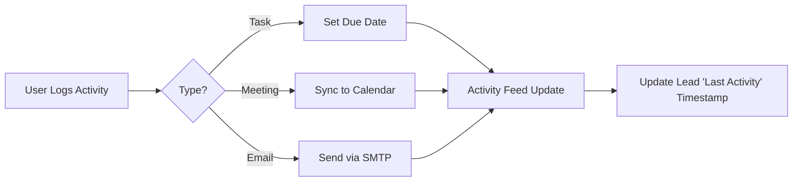
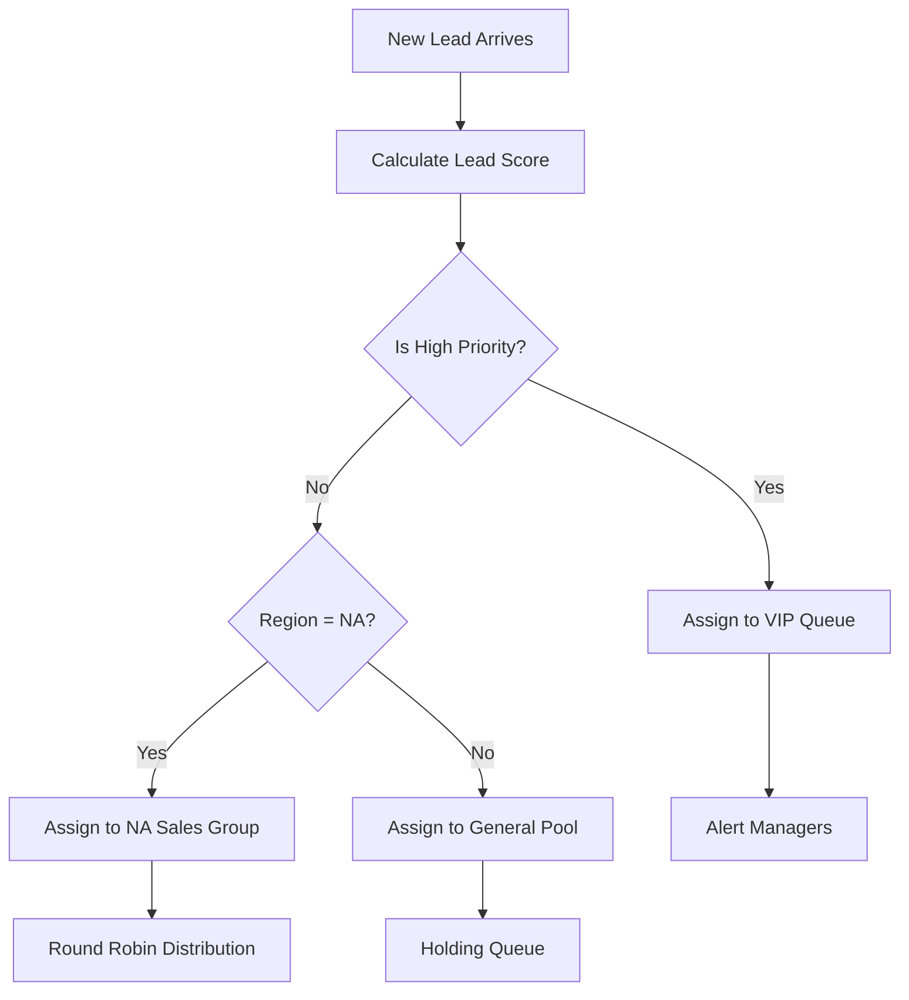
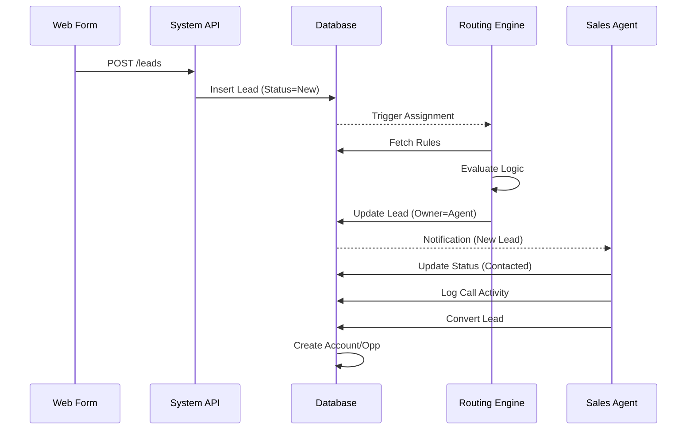
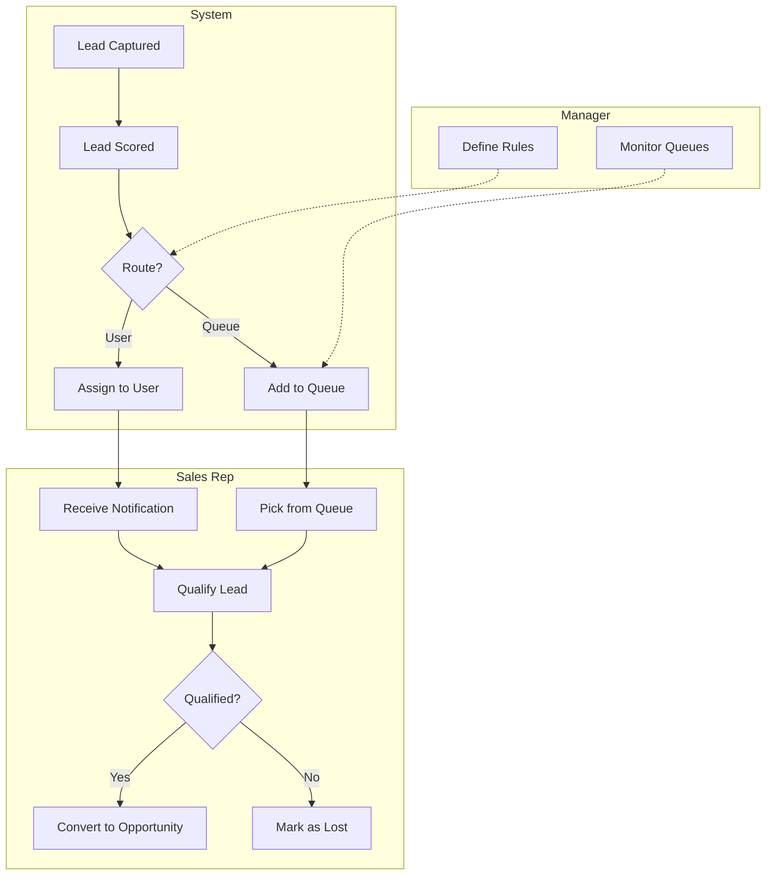

# Lead Management Module: Technical Documentation & Implementation Guide

**Version**: 1.0.0
**Date**: 2026-01-06
**Status**: Approved for Implementation

---

## Executive Summary
This document serves as the authoritative technical reference for the Lead Management Module within the SOS Logistics Pro platform. It details the architecture, configuration, and operational workflows required to implement a robust lead-to-cash lifecycle.

---

## 1. System Pre-requisites & Configuration

### 1.1 Hardware & Software Requirements
The Lead Management Module is a cloud-native application component hosted on the Supabase platform.

*   **Server-Side**:
    *   **Runtime**: Supabase (PostgreSQL 15+, Edge Functions via Deno).
    *   **Storage**: Supabase Storage for attachment handling.
    *   **Infrastructure**: Hosted on AWS (via Supabase Managed Service).
*   **Client-Side**:
    *   **Browser**: Chrome 90+, Firefox 88+, Safari 14+, Edge 90+.
    *   **Device**: Responsive design supports Desktop (1920x1080 optimized), Tablet, and Mobile.
    *   **Network**: Minimum 5 Mbps broadband connection recommended.

### 1.2 Database Schema Integration
The module integrates directly with the core CRM schema. Key integration points include:

| Table | Relationship | Description |
| :--- | :--- | :--- |
| `leads` | Primary | Core record storage for potential customers. |
| `activities` | 1:N | Human interactions (calls, emails, meetings) linked to a lead. |
| `lead_activities` | 1:N | Automated system events (email opens, link clicks) for scoring. |
| `queues` | Reference | Holding buckets or round-robin groups for assignment. |
| `queue_members` | Join | Users assigned to specific queues. |
| `tenants` | Scope | Root isolation layer for multi-tenancy. |

**Schema Snippet (`leads`):**
```sql
CREATE TABLE public.leads (
  id UUID PRIMARY KEY DEFAULT gen_random_uuid(),
  tenant_id UUID NOT NULL REFERENCES public.tenants(id) ON DELETE CASCADE,
  franchise_id UUID REFERENCES public.franchises(id) ON DELETE SET NULL,
  first_name TEXT NOT NULL,
  last_name TEXT NOT NULL,
  company TEXT,
  title TEXT,
  email TEXT,
  phone TEXT,
  status public.lead_status DEFAULT 'new', -- Enum: new, contacted, qualified, etc.
  source public.lead_source DEFAULT 'other', -- Enum: website, referral, etc.
  estimated_value DECIMAL(15,2),
  expected_close_date DATE,
  description TEXT,
  notes TEXT,
  owner_id UUID REFERENCES public.profiles(id),
  owner_queue_id UUID REFERENCES public.queues(id), -- Polymorphic assignment
  converted_account_id UUID REFERENCES public.accounts(id),
  converted_contact_id UUID REFERENCES public.contacts(id),
  converted_at TIMESTAMP WITH TIME ZONE,
  created_by UUID REFERENCES public.profiles(id),
  created_at TIMESTAMP WITH TIME ZONE DEFAULT now(),
  updated_at TIMESTAMP WITH TIME ZONE DEFAULT now()
);
```

**Schema Snippet (`queues`):**
```sql
CREATE TABLE public.queues (
    id UUID PRIMARY KEY DEFAULT gen_random_uuid(),
    tenant_id UUID NOT NULL REFERENCES public.tenants(id) ON DELETE CASCADE,
    franchise_id UUID REFERENCES public.franchises(id) ON DELETE SET NULL,
    name TEXT NOT NULL,
    description TEXT,
    email TEXT,
    is_active BOOLEAN DEFAULT true,
    type TEXT CHECK (type IN ('holding', 'round_robin')) DEFAULT 'holding',
    created_at TIMESTAMPTZ DEFAULT NOW(),
    updated_at TIMESTAMPTZ DEFAULT NOW()
);
```

### 1.3 User Permission Matrix
Access is controlled via Row Level Security (RLS) and Application-Level Permissions defined in `src/config/permissions.ts`.

| Permission Slug | Platform Admin | Tenant Admin | Franchise Admin | Sales User | Description |
| :--- | :---: | :---: | :---: | :---: | :--- |
| `leads.view` | ✅ All | ✅ Tenant | ✅ Franchise | ✅ Owned | View lead records. |
| `leads.create` | ✅ | ✅ | ✅ | ✅ | Create new leads. |
| `leads.edit` | ✅ | ✅ | ✅ | ✅ | Edit existing leads. |
| `leads.delete` | ✅ | ✅ | ✅ | ❌ | Delete leads. |
| `leads.convert` | ✅ | ✅ | ✅ | ✅ | Convert lead to Account/Opp. |
| `leads.assign` | ✅ | ✅ | ✅ | ❌ | Manually reassign lead owner. |
| `admin.lead_routing`| ✅ | ✅ | ❌ | ❌ | Configure routing rules/queues. |

### 1.4 API Access Configuration
*   **Authentication**: Bearer Token (JWT) via Supabase Auth.
*   **Base URL**: `https://<project-ref>.supabase.co/rest/v1`
*   **Headers**:
    *   `apikey`: Public Anon Key (for client) or Service Role (for backend).
    *   `Authorization`: `Bearer <token>`
    *   `Prefer`: `return=representation` (to receive created/updated data).

---

## 2. Lead Creation Process

### 2.1 Data Entry & Validation
The creation interface enforces data quality through strict validation rules defined in the Zod schema (`leadSchema`).

**Validation Rules (Zod):**
```typescript
const leadSchema = z.object({
  first_name: z.string().min(1, 'First name is required').max(100),
  last_name: z.string().min(1, 'Last name is required').max(100),
  company: z.string().optional(),
  title: z.string().optional(),
  // Email or Phone must be provided (refinement rule)
  email: z.string().email('Invalid email').optional().or(z.literal('')),
  phone: z.string().optional(),
  status: z.enum(['new', 'contacted', 'qualified', 'proposal', 'negotiation', 'won', 'lost']),
  source: z.enum(['website', 'referral', 'email', 'phone', 'social', 'event', 'other']),
  estimated_value: z.string().optional(), // Parsed to decimal on submit
  expected_close_date: z.string().optional(),
  description: z.string().optional(),
  notes: z.string().optional(),
  tenant_id: z.string().optional(),
  franchise_id: z.string().optional()
}).refine((data) => {
  const hasEmail = !!(data.email && data.email.trim());
  const hasPhone = !!(data.phone && data.phone.trim());
  return hasEmail || hasPhone;
}, {
  path: ['email'],
  message: 'Provide at least one contact: email or phone',
});
```

### 2.2 Sample Lead Dataset
```json
[
  {
    "first_name": "John",
    "last_name": "Doe",
    "company": "Acme Logistics",
    "email": "j.doe@acme.example.com",
    "phone": "+1-555-0199",
    "source": "website",
    "status": "new",
    "estimated_value": 15000,
    "description": "Inquiry about cold chain storage."
  },
  {
    "first_name": "Jane",
    "last_name": "Smith",
    "company": null,
    "email": "jane.s@gmail.com",
    "source": "referral",
    "status": "new",
    "notes": "Referred by existing client Bob Wilson."
  }
]
```

### 2.3 Interface Reference
The Lead Form UI is divided into logical sections:
1.  **Contact Information**: First Name, Last Name, Title, Email, Phone (2-column grid).
2.  **Company Details**: Company Name, Website (if added), Address.
3.  **Lead Status & Source**: Dropdowns for Status (New, Contacted, etc.) and Source.
4.  **Opportunity Details**: Estimated Value, Expected Close Date.
5.  **Additional Info**: Description (Textarea), Notes (Textarea).
6.  **Attachments**: File upload area for supporting docs.

*Note: The form supports dynamic loading of Tenants/Franchises based on the logged-in user's role.*

---

## 3. Lead Activities Management

### 3.1 Activity Types & Fields
Activities represent human interactions. They are stored in the `activities` table.

| Activity Type | Mandatory Fields | Optional Fields | Icon |
| :--- | :--- | :--- | :--- |
| **Call** | Subject, Duration | Outcome, Recording URL | 📞 |
| **Email** | Subject, Body | Attachments, Message ID | ✉️ |
| **Meeting** | Subject, Start/End Time | Location, Attendees | 📅 |
| **Task** | Subject, Due Date | Priority, Description | ☑️ |
| **Note** | Content | - | 📝 |

### 3.2 Automated Events (`lead_activities`)
Separate from human activities, the system tracks automated engagement signals for scoring:
*   `email_opened`
*   `link_clicked`
*   `page_view`
*   `form_submission`

### 3.3 Activity Workflow


---

## 4. Lead Routing Mechanism

### 4.1 Routing Logic
The routing engine evaluates rules in priority order (1 = Highest). It supports both **User Assignment** and **Queue Assignment**.

**Decision Factors:**
1.  **Geography**: Country, State/Province (e.g., "US West Coast").
2.  **Lead Score**: High value (> $50k) vs Standard.
3.  **Source**: Website vs Partner Referral.

### 4.2 Workflow Diagram


### 4.3 Performance Metrics
*   **Routing Latency**: Target < 500ms.
*   **Rule Match Rate**: % of leads matching a specific rule vs default catch-all.

---

## 5. Lead Assignment Framework

### 5.1 Assignment Configurations
1.  **Direct User**: Assigns to a specific `user_id`.
2.  **Queue (Holding)**: Assigns to `owner_queue_id` (User ID remains null).
3.  **Round Robin**:
    *   Selects Group Members from `queue_members`.
    *   Filters by availability (future feature).
    *   Distributes sequentially to ensure even load.

### 5.2 Assignment Success Tracking
We track assignment history (future implementation) or rely on `updated_at` timestamps.
*   **Success Rate**: (Successful Assignments / Total Routing Attempts) * 100.
*   **Failure Modes**: "No Available Agents", "Queue Full", "System Error".

---

## 6. Queue Management System

### 6.1 Queue Configuration
*   **Type**:
    *   `holding`: Passive. Leads wait to be picked.
    *   `round_robin`: Active. System distributes leads.
*   **Scope**: Tenant-wide or Franchise-specific.
*   **Security**: `queue_members` table controls who can access leads in a queue.

### 6.2 Monitoring KPIs
*   **Queue Depth**: Current number of unassigned leads (`owner_id` IS NULL AND `owner_queue_id` IS NOT NULL).
*   **Avg Wait Time**: Time from Queue Entry to User Assignment.
*   **Abandonment Rate**: Leads closed/lost while in queue.

---

## 7. Integration with Related Objects

### 7.1 Conversion Workflow
When a lead is converted via `LeadConversionDialog`:
1.  **Account**: Checks for duplicates or creates new `accounts` record.
2.  **Contact**: Creates `contacts` record linked to Account.
3.  **Opportunity**: Creates `opportunities` record with stage "Prospecting" (if requested).
4.  **Lead**:
    *   Status updates to `converted`.
    *   `converted_at`, `converted_account_id`, `converted_contact_id` are set.
5.  **Activities**: All linked activities are re-parented to the new Account/Contact/Opportunity.

### 7.2 Data Consistency
*   **Transactional Integrity**: Conversion is wrapped in a database transaction to ensure atomicity.
*   **Field Mapping**:
    *   Lead `company` -> Account `name`
    *   Lead `estimated_value` -> Opportunity `amount`
    *   Lead `expected_close_date` -> Opportunity `close_date`

---

## 8. End-to-End Process Flow

### 8.1 Sequence Diagram


### 8.2 Swimlane Diagram (Process Flow)


---

## Appendices

### A. Troubleshooting Guide
| Issue | Probable Cause | Solution |
| :--- | :--- | :--- |
| **Lead stuck in 'New'** | No matching rules; Default rule missing. | Check `LeadRouting` config; ensure a "Catch-all" rule exists. |
| **Round Robin failing** | All agents at capacity or unavailable. | Check `user_capacity` table; increase limits or mark agents available. |
| **Permissions Error** | User lacks `leads.view` permission. | Verify User Role assignments in `PermissionsMatrix` and `queue_members`. |

### B. Security Matrix
*   **Encryption**: TLS 1.2+ for transit; AES-256 for data at rest.
*   **RLS**: Strict Row Level Security policies ensure tenants cannot see each other's data.
*   **Audit**: All status changes logged in `lead_assignment_history` (planned) or `activities`.

### C. API Integration Specs
**Endpoint**: `POST /rest/v1/leads`
**Payload**:
```json
{
  "first_name": "String",
  "last_name": "String",
  "email": "String",
  "tenant_id": "UUID",
  "source": "website"
}
```

### D. Change Log
| Version | Date | Author | Changes |
| :--- | :--- | :--- | :--- |
| 1.0.0 | 2026-01-06 | System Architect | Initial comprehensive release. |
