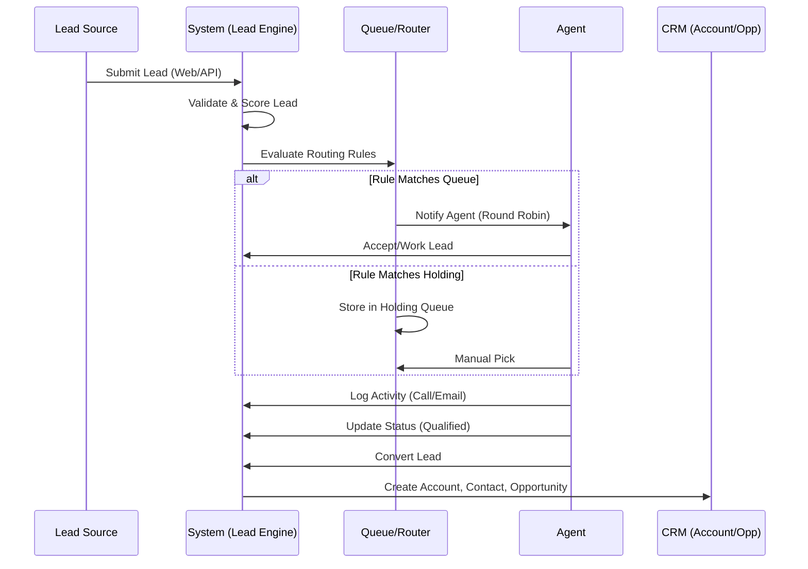

# Lead Management Module Documentation

This document provides a comprehensive guide to the Lead Management Module in the SOS Logistics Pro platform. It details the end-to-end process from lead creation to conversion, including routing, assignment, and queue management.

## 1. Lead Creation

### 1.1 Required & Optional Fields
When creating a new lead, the following fields are available. Fields marked with **(*)** are mandatory.

| Field Name | Type | Required | Description |
| :--- | :--- | :--- | :--- |
| **First Name** | Text | Yes (*) | Lead's first name (Max 100 chars). |
| **Last Name** | Text | Yes (*) | Lead's last name (Max 100 chars). |
| **Company** | Text | No | Organization name. |
| **Title** | Text | No | Job title of the lead. |
| **Email** | Email | No | Valid email address. Required for email activities. |
| **Phone** | Phone | No | Contact number. |
| **Source** | Dropdown | No | Origin of lead (Website, Referral, Email, Phone, Social, Event, Other). |
| **Status** | Dropdown | Yes | Default is 'New'. Options: New, Contacted, Qualified, Proposal, Negotiation, Won, Lost, Converted. |
| **Estimated Value** | Currency | No | Potential revenue value. |
| **Expected Close** | Date | No | Target date for conversion. |
| **Description** | Text Area | No | Brief summary of the lead's needs. |
| **Notes** | Text Area | No | Internal notes. |

### 1.2 Validation Rules
-   **First Name / Last Name**: Must be non-empty and under 100 characters.
-   **Email**: Must be a valid email format if provided.
-   **Duplicate Check**: System checks for existing leads with the same email address (if configured).

### 1.3 Sample Lead Data
```json
{
  "first_name": "Alice",
  "last_name": "Logistics",
  "company": "Global Trade Inc.",
  "title": "Logistics Manager",
  "email": "alice@globaltrade.example.com",
  "phone": "+1-555-0123",
  "source": "website",
  "status": "new",
  "estimated_value": 50000,
  "description": "Interested in trans-pacific freight options."
}
```

---

## 2. Lead Activities Creation

Activities track interactions with leads. They can be created manually or automatically (e.g., via email integration).

### 2.1 Activity Types
| Type | Label | Icon | Description |
| :--- | :--- | :--- | :--- |
| **email** | Email | ✉️ | Sent or received emails. |
| **call** | Call | 📞 | Phone call logs (inbound/outbound). |
| **task** | Task | ☑️ | To-do items related to the lead. |
| **meeting** | Event | 📅 | Scheduled meetings or calendar events. |
| **note** | Note | 📝 | General notes or internal comments. |

### 2.2 Fields
-   **Subject** (*): Summary of the activity.
-   **Description**: Detailed content.
-   **Due Date**: For tasks and meetings.
-   **Assigned To**: Owner of the activity (defaults to current user).
-   **Priority**: Low, Medium, High, Urgent.

### 2.3 Sample Activity Record
```json
{
  "type": "call",
  "subject": "Introductory Call",
  "description": "Discussed initial requirements for Q3 shipments.",
  "due_date": "2025-10-15T14:00:00Z",
  "status": "completed",
  "priority": "medium",
  "lead_id": "uuid-of-alice-lead"
}
```

---

## 3. Lead Routing

The platform uses a rules-based engine to route leads to the correct user or queue immediately upon creation or update.

### 3.1 Routing Rules
Rules are evaluated in **Priority Order** (1 = Highest). The first matching rule determines the assignment.

**Common Rule Criteria:**
-   **Source**: e.g., "If Source = Website".
-   **Location**: e.g., "If Country = United States".
-   **Value**: e.g., "If Estimated Value > $10,000".
-   **Status**: e.g., "If Status = New".

### 3.2 Workflow Diagram
```mermaid
graph TD
    A[New Lead Created] --> B{Active Rules Exist?}
    B -- No --> C[Assign to Default/Catch-all]
    B -- Yes --> D[Evaluate Rule 1 (Highest Priority)]
    D -- Match --> E[Execute Assignment]
    D -- No Match --> F[Evaluate Rule 2]
    F -- Match --> E
    F -- No Match --> G[...]
    G --> H[Fallback / Unassigned]
```

### 3.3 Exception Handling
-   **No Match**: If a lead matches no rules, it remains "Unassigned" or falls to a default "Catch-all" rule if configured.
-   **Queue Full/Error**: If an assignment fails, the lead is logged in `lead_assignment_history` with an error status for manual review.

---

## 4. Lead Assignment

Leads can be assigned to a **User**, a **Queue**, or a **Round Robin Group**.

### 4.1 Assignment Rules
1.  **Direct User Assignment**: Assigns to a specific individual (e.g., "CEO" for VIP leads).
2.  **Queue Assignment**: Places the lead in a "Holding Queue" for agents to pick manually.
3.  **Round Robin Group**: Automatically distributes leads among a group of users based on:
    -   **Availability**: User must be marked 'Available' in capacity settings.
    -   **Capacity**: User must have `current_leads < max_leads`.
    -   **Fairness**: Assigns to the user who received a lead least recently.

### 4.2 Reassignment & Escalation
-   **Manual Reassignment**: Admins can manually change the owner from the Lead Detail page.
-   **Escalation**: (Planned) Leads sitting in "New" status for > 48 hours can trigger an automation to notify a manager or reassign to a high-priority queue.

### 4.3 Sample Scenario
*Scenario*: A "High Value" lead comes in from the "Website".
1.  **Rule Match**: "High Priority Web Leads" (Priority 10).
2.  **Action**: Assign to "North America Sales" (Round Robin Group).
3.  **Execution**: System checks Agent A (Busy), Agent B (Available). Assigns to Agent B.
4.  **Notification**: Agent B receives an email/in-app notification.

---

## 5. Lead Queue Management

Queues act as buckets for leads that are not yet assigned to a specific person or are being distributed automatically.

### 5.1 Queue Configuration
-   **Name**: Display name (e.g., "Inbound Sales").
-   **Type**:
    -   **Holding Queue**: Passive bucket. Agents "cherry-pick" leads.
    -   **Round Robin**: Active distribution. System auto-assigns from this queue.
-   **Members**: Users who are part of this queue (for Round Robin) or have access to pick from it.
-   **Tenant/Franchise Scope**: Queues can be isolated to specific tenants or franchises.

### 5.2 Prioritization
-   **Default**: FIFO (First In, First Out).
-   **Scoring**: Leads can be sorted by `Lead Score` within a queue to ensure high-value prospects are handled first.

### 5.3 Sample Queue View
*(Interface Mockup)*
> **Queue: US Sales Team (Round Robin)**
> *   **Status**: Active
> *   **Members**: 5 (3 Available)
> *   **Pending Leads**: 0 (Auto-distributing)

---

## 6. Related Object Integration

Converting a lead moves it to the next stage of the sales lifecycle.

### 6.1 Conversion Workflow
When a lead is marked "Converted":
1.  **Account Creation**: A new Account is created using the `Company` name.
2.  **Contact Creation**: A new Contact is created using the `First Name`, `Last Name`, `Email`, and `Phone`.
3.  **Opportunity Creation**: (Optional) A new Opportunity is created, linked to the Account and Contact.
    -   *Default Stage*: Prospecting.
    -   *Default Name*: "{Lead Name} Opportunity".

### 6.2 Best Practices
-   **Account Matching**: Before conversion, search for existing accounts to avoid duplicates.
-   **Contact Management**: Ensure personal emails are replaced with work emails if available.

---

## 7. Process Flow

### 7.1 End-to-End Sequence


---

## 8. Appendix

### 8.1 Troubleshooting
-   **Lead Not Assigned**: Check if "Active" rules exist. Verify `user_capacity` for Round Robin agents.
-   **Email Not Sent**: Check `Assignments` table for failure reasons (e.g., invalid email configuration).
-   **Missing Fields**: Ensure `Lead Form` validation schema matches API payload.

### 8.2 Performance Metrics (KPIs)
-   **Time to Assign**: Average time from Creation -> Owner Assignment.
-   **Time to Contact**: Average time from Assignment -> First Activity.
-   **Conversion Rate**: % of Leads converted to Opportunities.

### 8.3 Security & Access
-   **RLS (Row Level Security)**:
    -   **Tenants**: Users can only see leads within their Tenant.
    -   **Franchises**: (Optional) Further restriction to Franchise level.
    -   **Roles**: 'Sales Reps' see own leads; 'Managers' see all leads in territory.

### 8.4 Mobile Accessibility
-   The Lead Management UI is fully responsive.
-   **Key Actions on Mobile**: Quick Call (tap-to-dial), Quick Status Update, View Notes.

### 8.5 Testing Scenarios
| Scenario | Expected Result |
| :--- | :--- |
| **Create Empty Lead** | Validation Error (Name required). |
| **Route by Country** | Lead with Country='US' assigns to 'US Team'. |
| **Round Robin Saturation** | If all agents full, lead stays in 'Pending' or goes to Overflow queue. |
| **Convert Lead** | Verifies Account, Contact, and Opp exist in database. |
