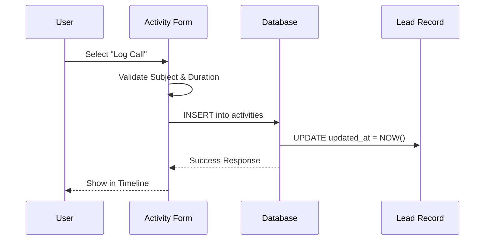

# Lead Management Module: Implementation Wizard & Technical Guide

**Version**: 2.0.0
**Date**: 2026-01-06
**Status**: Implementation Ready
**Guide Format**: Sequential Implementation Wizard

---

## Executive Summary
This document is structured as a **Step-by-Step Implementation Wizard**. Follow the steps sequentially to configure, implement, and verify the Lead Management Module. Each step represents a logical phase in the deployment lifecycle.

---

## 🧙‍♂️ Implementation Wizard

### Step 1: System Pre-requisites & Configuration
*Objective: Prepare the environment and core security layer.*

#### 1.1 Hardware & Software Requirements
Ensure the following baseline configuration for end-to-end implementation:
*   **Server Runtime**: Supabase (PostgreSQL 15+, Edge Functions via Deno).
*   **Client Environment**:
    *   **Browser**: Chrome 90+, Firefox 88+, Safari 14+, Edge 90+.
    *   **Display**: Optimized for 1920x1080 (Desktop) down to 375x667 (Mobile).
    *   **Network**: Low-latency broadband (>5 Mbps) recommended for real-time updates.
*   **Mobile Access**:
    *   Fully responsive web interface (PWA-ready).
    *   Touch-optimized input fields for field sales.

#### 1.2 Database Schema & Integration
The module requires the following core tables. Run the migration scripts to establish the schema.

**Core Table: `leads`**
```sql
CREATE TABLE public.leads (
  id UUID PRIMARY KEY DEFAULT gen_random_uuid(),
  tenant_id UUID NOT NULL REFERENCES public.tenants(id) ON DELETE CASCADE,
  franchise_id UUID REFERENCES public.franchises(id) ON DELETE SET NULL,
  first_name TEXT NOT NULL,
  last_name TEXT NOT NULL,
  company TEXT,
  title TEXT,
  email TEXT,
  phone TEXT,
  status public.lead_status DEFAULT 'new',
  source public.lead_source DEFAULT 'other',
  estimated_value DECIMAL(15,2),
  expected_close_date DATE,
  description TEXT,
  notes TEXT,
  owner_id UUID REFERENCES public.profiles(id),
  owner_queue_id UUID REFERENCES public.queues(id),
  created_at TIMESTAMPTZ DEFAULT now(),
  updated_at TIMESTAMPTZ DEFAULT now()
);
```

**Integration Points**:
*   **`tenants`**: Strict foreign key enforcement for multi-tenancy.
*   **`profiles`**: Links to `owner_id` for user assignment.
*   **`queues`**: Links to `owner_queue_id` for pool-based assignment.

**Data Import Order (pg_dump-based migrations)**:
*   Parent tables must be imported before children to satisfy foreign keys.
*   For the Lead stack, the effective order is:
    1. `public.tenants`
    2. `public.profiles`
    3. `public.accounts` / `public.contacts` (optional but recommended before leads)
    4. `public.leads`
    5. `public.queues` + `public.queue_members`
    6. `public.email_accounts` + `public.emails`
    7. `public.activities`
*   The pg_dump import tooling enforces this order using foreign key topology, but exported data must still respect:
    *   `leads.owner_id` → `profiles.id`
    *   `activities.lead_id` → `leads.id`
*   Before exporting, the Database Export pre-flight checks will warn if:
    *   Any `leads.owner_id` values reference missing `profiles.id`.
    *   Any `activities.lead_id` values reference missing `leads.id`.

#### 1.3 User Permission Matrix & Security
Configure Role-Based Access Control (RBAC) in `src/config/permissions.ts`.

| Permission | Platform Admin | Tenant Admin | Franchise Admin | Sales User |
| :--- | :---: | :---: | :---: | :---: |
| `leads.view` | ✅ All | ✅ Tenant | ✅ Franchise | ✅ Owned |
| `leads.create` | ✅ | ✅ | ✅ | ✅ |
| `leads.edit` | ✅ | ✅ | ✅ | ✅ |
| `leads.delete` | ✅ | ✅ | ✅ | ❌ |
| `leads.convert`| ✅ | ✅ | ✅ | ✅ |
| `leads.assign` | ✅ | ✅ | ✅ | ❌ |

#### 1.4 API Access Configuration
*   **Endpoint**: `https://<project>.supabase.co/rest/v1/leads`
*   **Auth**: Bearer Token (JWT).
*   **Headers**: `apikey`, `Authorization`, `Content-Type: application/json`.

---

### Step 2: Implementing Lead Creation Process
*Objective: Deploy the lead capture interface and validation logic.*

#### 2.1 Required Fields & Validation Rules
Implement the following Zod schema (`leadSchema`) to enforce data integrity:

| Field | Requirement | Validation Rule |
| :--- | :--- | :--- |
| `first_name` | **Required** | Min 1 char, Max 100 chars. |
| `last_name` | **Required** | Min 1 char, Max 100 chars. |
| `company` | Optional | String. |
| `email` | **Conditional** | Valid Email format. *Must provide Email OR Phone.* |
| `phone` | **Conditional** | String. *Must provide Email OR Phone.* |
| `status` | Default | Enum: `new`, `contacted`, `qualified`, etc. |
| `source` | Default | Enum: `website`, `referral`, `other`, etc. |

#### 2.2 Data Entry Guidelines & Input Masks
*   **Phone Numbers**: Use international format (e.g., `+1-555-0123`). UI should strip non-numeric characters before saving.
*   **Email**: Auto-trim whitespace; lowercase normalization.
*   **Currency**: `estimated_value` inputs should allow commas but save as raw decimal (e.g., input "1,500.00" -> save `1500.00`).

#### 2.3 Interface Preview & Annotations
The Lead Creation UI (`LeadNew.tsx`) is designed as a focused data entry form.

```
[UI Mockup Placeholder]
+-------------------------------------------------------+
|  New Lead                                    [Save]   |
|                                                       |
|  1. Contact Information ----------------------------  |
|  [ First Name * ]  [ Last Name * ]                    |
|  [ Email        ]  [ Phone       ] <--(At least one)  |
|                                                       |
|  2. Business Details -------------------------------  |
|  [ Company Name ]  [ Job Title   ]                    |
|                                                       |
|  3. Opportunity Data -------------------------------  |
|  [ Est. Value ($) ]  [ Close Date (DD/MM/YYYY) ]      |
|                                                       |
|  4. Status & Source --------------------------------  |
|  [ Status (New) v]  [ Source (Website) v]             |
+-------------------------------------------------------+
```

#### 2.4 Sample Lead Dataset (Validation Scenarios)
Use these records to test your implementation:

**Scenario A: Standard Web Lead**
```json
{
  "first_name": "Sarah",
  "last_name": "Connor",
  "company": "Cyberdyne Systems",
  "email": "sarah@cyberdyne.net",
  "source": "website",
  "status": "new",
  "estimated_value": 50000
}
```

**Scenario B: Referral (Phone Only)**
```json
{
  "first_name": "James",
  "last_name": "Howlett",
  "phone": "+1-555-0199",
  "source": "referral",
  "notes": "Referred by Professor X."
}
```

---

### Step 3: Implementing Lead Activities Management
*Objective: Enable tracking of interactions (Calls, Emails, Meetings).*

#### 3.1 Activity Types & Field Matrix
Configure the `activities` table to support these polymorphic types.

| Activity Type | Mandatory Fields | Optional Fields |
| :--- | :--- | :--- |
| **Call** 📞 | `subject`, `duration_minutes` | `outcome` (connected/voicemail), `recording_url` |
| **Email** ✉️ | `subject`, `body` | `message_id`, `attachments` |
| **Meeting** 📅 | `subject`, `start_time`, `end_time` | `location`, `attendees_list` |
| **Task** ☑️ | `subject`, `due_date` | `priority`, `status` |

#### 3.2 Activity Tracking Workflow
The system automatically updates the parent Lead's "Last Activity" timestamp whenever a new activity is logged.



#### 3.3 Sample Activity Record
```json
{
  "type": "call",
  "subject": "Introductory Discovery Call",
  "duration_minutes": 15,
  "outcome": "qualified",
  "lead_id": "uuid-of-lead",
  "created_by": "uuid-of-agent",
  "created_at": "2026-01-06T10:00:00Z"
}
```

---

### Step 4: Configuring Lead Routing & Assignment
*Objective: Automate lead distribution to the right agents.*

#### 4.1 Routing Logic Flow
1.  **Capture**: Lead enters system (Status = `new`).
2.  **Score**: System calculates priority (e.g., Value > $10k = High).
3.  **Route**:
    *   **Direct**: Assign to specific user if logic matches.
    *   **Queue**: Place in `holding` or `round_robin` queue.
    *   **Fallback**: Assign to "General Pool" if no rules match.

#### 4.2 Queue Management
*   **Round Robin Queues**: Automatically cycle through available members.
*   **Holding Queues**: "First-come, first-served" pull model.

---

### Step 5: Integration & Conversion
*Objective: Move the lead to the next stage of the lifecycle.*

#### 5.1 Conversion Workflow
When a lead is marked `converted`:
1.  **Create Account**: `Acme Logistics` (from Lead Company).
2.  **Create Contact**: `Sarah Connor` (from Lead Name).
3.  **Create Opportunity**: `Acme Logistics Deal` (from Lead Value).
4.  **Archive Lead**: Status -> `converted`; link to new objects.

---

## Appendices

### A. Troubleshooting
*   **Validation Errors**: Check Zod schema in `LeadForm.tsx`.
*   **Missing Activities**: Ensure `lead_id` foreign key is correctly set on activity insert.
*   **Routing Failures**: Verify `queues` table has active members.

### B. Glossary
*   **Lead**: Unqualified prospect.
*   **Activity**: Interaction event.
*   **Queue**: Container for unassigned leads.
