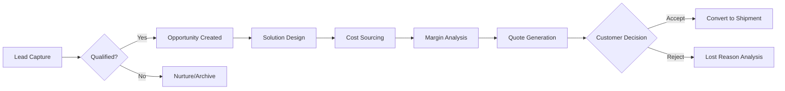
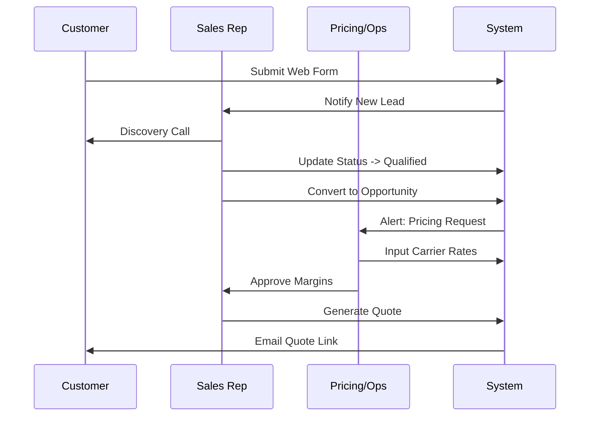

# Lead to Quotation (L2Q) CRM Workflow: Implementation Guide & Business Process Reference

**Version**: 1.0.0
**Date**: 2026-01-06
**Status**: Draft
**Target Audience**: Implementation Teams, Business Analysts, System Architects

---

## Executive Summary
This document provides a comprehensive end-to-end guide for the Lead-to-Quotation (L2Q) lifecycle within the SOS Logistics Pro platform. It serves as both a technical implementation reference and a business process manual, detailing the transformation of a raw lead into a legally binding logistics quotation.

The workflow is designed to address specific freight forwarding complexities, including multi-leg routing, HS code compliance, and margin-based pricing, which differentiate it from generic CRM implementations.

---

## 1. Workflow Mapping (Lead to Quote)

### 1.1 High-Level Customer Journey
The L2Q journey consists of four distinct phases:
1.  **Capture & Qualify**: Raw data intake and viability assessment.
2.  **Opportunity Development**: Needs analysis and solution design.
3.  **Pricing & Sourcing**: Carrier selection and cost estimation.
4.  **Quotation & Negotiation**: Formal proposal generation and contract closure.

### 1.2 Detailed Process Map
| Stage | Description | Input | Output |
| :--- | :--- | :--- | :--- |
| **1. Lead** | Prospect identification via Website, Referral, or Manual Entry. | Contact Info, Cargo Interest | Validated Lead Record |
| **2. Qualification** | Assessment of budget, authority, need, and timeline (BANT). | Lead Score, Engagement | `Converted` Status |
| **3. Opportunity** | Formal tracking of a potential deal. | Cargo Details, Routes | Opportunity Record |
| **4. Sourcing** | Identifying carriers and calculating costs. | Origin/Dest, Incoterms | Cost Sheets |
| **5. Quotation** | Creation of customer-facing proposal. | Margin %, T&Cs | PDF/Digital Quote |

---

## 2. Process Documentation

### 2.1 Swimlane Diagram
*(Note: Visual representation of roles across the timeline)*

### 2.2 Decision Rules
*   **Auto-Qualification**: Leads with `Score > 70` are auto-flagged as "Hot".
*   **Pricing Approval**:
    *   Margin < 10%: Requires Manager Approval.
    *   Margin > 10%: Auto-approved for Agent release.
*   **Escalation**: Quotes in `Draft` > 48 hours trigger "Stalled Deal" alert to Manager.

---

## 3. Competitive Benchmarking (Logistics Focus)

| Feature | SOS Logistics Pro | Salesforce Sales Cloud | HubSpot Sales Hub | WiseTech / CargoWise |
| :--- | :--- | :--- | :--- | :--- |
| **Multi-Leg Routing** | ✅ Native (Sea/Air/Land segments) | ❌ Requires customization | ❌ Text-based only | ✅ Native |
| **Incoterm Logic** | ✅ Built-in Validation | ❌ Custom Field only | ❌ Custom Field only | ✅ Native |
| **Unit Conversions** | ✅ CBM/KGS Auto-calc | ❌ Manual formula | ❌ Manual formula | ✅ Native |
| **CRM Integration** | ✅ Native (Unified DB) | ✅ Core Feature | ✅ Core Feature | ⚠️ Module Add-on |
| **Pricing Engine** | ✅ Cost + Margin Logic | ⚠️ CPQ Add-on ($$$) | ⚠️ Line Items only | ✅ Tariff Engine |

**Key Differentiation**: SOS Logistics Pro bridges the gap between a generic CRM (Salesforce/HubSpot) and a rigid ERP (CargoWise) by offering modern CRM usability with native freight logic (Containers, Incoterms, Ports).

---

## 4. Gap Analysis

### 4.1 Identified Deficiencies
| Gap | Severity | Description | Recommendation |
| :--- | :--- | :--- | :--- |
| **Tariff Rate Management** | Major | No centralized database for carrier negotiated rates. | Build `Rate Cards` module. |
| **Spot Rate API** | Minor | No live API connection to Maersk/CMA for spot rates. | Integration with aggregation API (e.g., Freightos). |
| **Credit Check** | Critical | No automated credit limit validation before quoting. | Integration with Finance module or external credit bureau. |

### 4.2 Regulatory Considerations
*   **Denied Party Screening**: Must check OFAC lists before issuing quotes.
*   **GDPR**: Lead data retention policies must be configurable.

---

## 5. Enhancement Recommendations

### 5.1 Prioritized Roadmap
1.  **Quick Win**: **"Clone Quote" Button**
    *   *ROI*: Reduces data entry time by 60% for repeat shipments.
    *   *Effort*: Low (1-2 days).
2.  **Strategic**: **Dynamic PDF Generator**
    *   *ROI*: Professional branding improves close rate.
    *   *Effort*: Medium (1 sprint).
3.  **Long-Term**: **AI Rate Predictor**
    *   *ROI*: Optimizes margins based on historical lane data.
    *   *Effort*: High (3+ months).

---

## 6. Data Specifications

### 6.1 Lead Object
*   `status`: Enum (New, Contacted, Qualified...)
*   `source`: Enum (Web, Referral...)
*   `estimated_value`: Decimal(15,2)

### 6.2 Quote Object
*   `quote_number`: String (Unique Sequence, e.g., Q-2026-001)
*   `incoterms`: Enum (FOB, CIF, EXW...)
*   `valid_until`: Date (Default: Today + 30 days)
*   `legs`: JSON Array (Origin, Dest, Mode, Carrier)

**Validation Rules**:
*   `valid_until` cannot be in the past.
*   `sell_price` must be >= `cost_price` (unless Manager Override).

---

## 7. Performance Metrics (KPIs)

| Metric | Definition | Target Benchmark |
| :--- | :--- | :--- |
| **Lead-to-Quote Time** | Avg hours from Lead Creation to First Quote Sent. | < 24 Hours |
| **Quote Conversion Rate** | % of Quotes converted to Shipments. | > 25% |
| **Avg Margin per TEU** | Net Profit divided by TEU count. | > $150 |

---

## 8. System Integration

### 8.1 API Endpoints
*   `POST /leads`: Capture raw leads.
*   `POST /quotes/{id}/convert`: Trigger shipment creation.
*   `GET /master-data/ports`: Fetch validated port codes (UN/LOCODE).

### 8.2 Data Mapping
*   **External ERP**:
    *   Quote `id` -> ERP `OrderRef`
    *   Account `tax_id` -> ERP `CustomerTaxID`

---

## 9. Testing Framework

### 9.1 Test Cases
1.  **Happy Path**: Create Lead -> Convert -> Add Route -> Send Quote -> Accept.
2.  **Exception**: Quote Expired -> Try to Accept (Should Fail).
3.  **Margin Check**: Set Sell Price < Cost Price -> Verify Warning/Block.

### 9.2 Acceptance Criteria
*   Quote PDF must generate within 3 seconds.
*   Email notification must reach customer inbox (not spam).
*   Converted Shipment must retain all Cargo Details from Quote.

---

## Appendices
*   **A. Glossary**: TEU, FEU, Incoterms, Chargeable Weight.
*   **B. Port Codes**: Link to UN/LOCODE master list.
