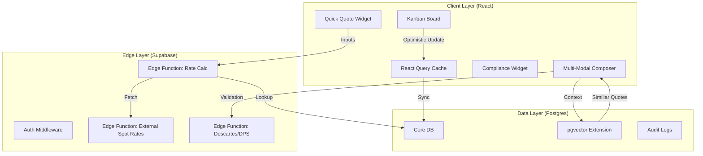
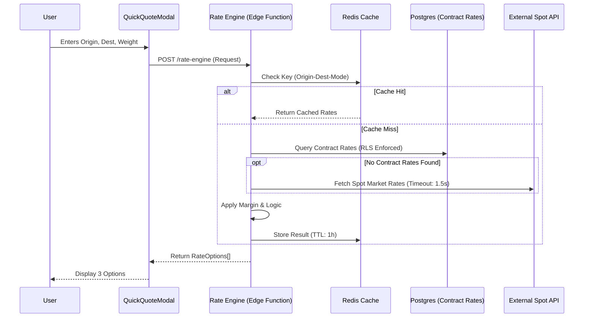

# Quotation Module Design Specification: "Hybrid" Architecture
**Document ID:** SPEC-QUO-2026-001
**Version:** 1.3.0
**Date:** January 20, 2026
**Status:** PHASE 2 INITIATED - QUICK QUOTE HARDENING PLANNED
**Author:** Trae AI (Senior Systems Architect)
**Related Analysis:** [HYBRID_QUOTATION_ENHANCEMENT_ANALYSIS.md](./HYBRID_QUOTATION_ENHANCEMENT_ANALYSIS.md)

---

## 1. Executive Summary
This document outlines the architectural and design specifications for the **Next-Generation Quotation Module** within SOS Logistics Pro. The initiative aims to bridge the gap between "Speed" (Quick Quote) and "Precision" (Multi-Modal Composer) while introducing AI-driven intelligence (Smart Quote).

The core philosophy is **"Hybrid Entry, Unified Pipeline"**:
1.  **Quick Quote**: A sub-30-second workflow for rapid estimations.
2.  **Smart Quote**: RAG-based intelligence providing "Win Probability" and "Price Guidance".
3.  **Unified Pipeline**: A visual control tower with both **Kanban** and **List** views for managing the entire lifecycle.
4.  **Trade-Aware Intelligence**: (New in v1.2) Explicit handling of Import/Export/Cross-Trade workflows with mode-specific validation (RORO, Breakbulk) and compliance checks.

---

## 2. Current State & Gap Analysis

### 2.1 Existing Capabilities
*   **Deep Composition**: The current `MultiModalQuoteComposer.tsx` is robust, handling complex multi-leg journeys, charge codes, and versioning (`QuotationVersionHistory.tsx`).
*   **Testing Infrastructure**: `QuotationTestRunner.tsx` provides excellent regression coverage for complex logic.
*   **Customer Portal**: `QuotePortal.tsx` offers a decent read-only view and PDF export.

### 2.2 Critical Gaps
*   **Velocity Friction**: The "Composer" requires too many clicks (Steps: Details -> Legs -> Charges -> Review) for simple "A to B" spot quotes.
*   **Visual Blindness**: `Quotes.tsx` is a static grid. Sales managers cannot visualize the pipeline velocity or bottlenecks.
*   **Pricing Guesswork**: Users rely on "gut feeling" or external emails for pricing. No system intelligence exists.
*   **Trade Direction Blindness**: (Identified in Enhancement Analysis) System treats "Export" and "Import" identically, missing critical compliance triggers (AES vs ISF) and Incoterm validation.
*   **Specialized Mode Gap**: No native support for Project Cargo (Breakbulk) or Automotive (RORO) logic.

---

## 3. Feature Specifications

### 3.1 Feature A: Quick Quote (Rapid Estimator)
**Objective**: Generate a valid quote in < 30 seconds.

*   **UX Design**:
    *   **Interface**: Single-screen "Flight Search" style interface.
    *   **Inputs**: Origin (City/Zip), Destination (City/Zip), Weight/Dims, Commodity, Mode (Air/Ocean/Road).
    *   **Output**: 3 Tiered Options (Economy, Standard, Express).
    *   **Action**: "Convert to Full Quote" (Save & Edit in Composer) or "Email Now".

*   **Technical Logic**:
    *   **Data Source**: `rate_cards` table (Contracted Rates) + External Spot API (via Edge Function).
    *   **Algorithm**: Simplified Rating Engine (Base Rate * Weight + Fuel Surcharge).
    *   **State Management**: Transient state until "Converted".

### 3.2 Feature B: Smart Quote (Intelligence Layer)
**Objective**: Increase "Win Rate" by 15% through data-driven pricing.

*   **UX Design**:
    *   **Interface**: "Copilot Sidebar" within the Quote Composer.
    *   **Indicators**:
        *   "Win Probability": 0-100% Gauge.
        *   "Price Guidance": Histogram showing "Losing", "Competitive", and "Winning" ranges.
    *   **Interactions**: "Apply Suggested Margin" button.

*   **Technical Logic (RAG)**:
    *   **Vector Database**: `pgvector` store of last 24 months of *Accepted* vs. *Rejected* quotes.
    *   **Embeddings**: Vectors derived from `[Origin, Dest, Commodity, Month, Weight]`.
    *   **Query**: `SELECT * FROM quote_vectors ORDER BY embedding <-> current_quote_embedding LIMIT 20`.

### 3.3 Feature C: Visual Workflow (Kanban & List)
**Objective**: Pipeline visibility and rapid status management.

*   **UX Design**:
    *   **Views**: Toggle between "Board" (Kanban) and "List" (Table).
    *   **Columns**: Draft -> Internal Review -> Client Review -> Negotiation -> Approved -> Booked.
    *   **Card Anatomy**: Client Name, Port Pair (NYC->LON), Revenue, "Stale" Indicator (Red border if > 48h).
    *   **Interaction**: Drag-and-drop to move columns (triggers API status update).
    *   **Bulk Actions**: Select multiple quotes for batch Status Update or Delete.

*   **Technical Logic**:
    *   **Library**: `@dnd-kit/core` (accessible, lightweight) for Board.
    *   **Optimistic UI**: UI updates immediately; background API call syncs state. Reverts on error.
    *   **View Persistence**: Preference saved in local state/session.

### 3.4 Feature D: Trade Direction & Compliance Engine (New in v1.2)
**Objective**: Automate compliance and workflow triggers based on International Trade Direction.
*   **Logic**:
    *   **Export**: `Origin.Country == Tenant.Country` AND `Dest.Country != Tenant.Country`. Triggers: AES/EEI Filing task.
    *   **Import**: `Origin.Country != Tenant.Country` AND `Dest.Country == Tenant.Country`. Triggers: ISF Filing task, Duty Calculation.
    *   **Cross-Trade**: `Origin != Tenant` AND `Dest != Tenant`. Triggers: Blind Shipment protocols, Switch B/L flag.
*   **Validation Rules**:
    *   Block "EXW" Incoterm for Exports if Shipper is Tenant (Logic Mismatch).
    *   Require "AES Number" before status can move to "Booked" for Exports > $2500.

### 3.5 Feature E: Specialized Mode Support (New in v1.2)
**Objective**: Support high-value complex cargo types.
*   **RORO (Roll-on/Roll-off)**:
    *   New Inputs: VIN, Make/Model, "Run & Drive" status.
    *   Constraint: Valid only for Port-to-Port or Port-to-Door with specialized car hauler.
*   **Breakbulk**:
    *   New Inputs: Lifting Points, Center of Gravity, Lashing Requirements.
    *   Logic: Forces "Manual Rate" (disable auto-rating) due to complexity.

---

## 4. UX/UI Design Document

### 4.1 Design System (Shadcn UI Extension)
*   **Typography**: Inter (Sans) for UI, JetBrains Mono for Rate Codes/Tariffs.
*   **Color Palette**:
    *   *Primary*: Slate-900 (Corporate).
    *   *Accents*: Emerald-600 (Profit/Win), Amber-500 (Review/Warning), Rose-600 (Loss/Stale).
*   **Layout**:
    *   *Sidebar*: Collapsible, Icon-driven.
    *   *Main Stage*: "Paper" elevation (white bg, subtle shadow) for Quote Forms.

### 4.2 Interaction Models
*   **Keyboard First**: `Cmd+K` to "Create Quick Quote". `Cmd+S` to Save.
*   **Feedback Loops**:
    *   *Success*: Sonner Toast (Bottom Right).
    *   *Error*: Inline validation (Zod) + Shake animation.
*   **Accessibility**: WCAG 2.1 AA Compliance. Focus traps for Modals. Aria-labels for all Drag handles.

---

## 5. Technical Architecture

### 5.1 System Diagram


### 5.2 Data Schema Additions
```sql
-- For Smart Quote
create extension vector;
create table quote_embeddings (
  id uuid references quotes(id),
  embedding vector(1536), -- OpenAI Ada-002
  metadata jsonb -- { "seasonality": "high", "lane_type": "ocean" }
);

-- For Kanban Metadata
alter table quotes 
add column stage_entered_at timestamptz default now(),
add column win_probability float check (win_probability between 0 and 1);

-- (New v1.2) For Trade Direction & Compliance
alter table quotes
add column trade_direction text check (trade_direction in ('export', 'import', 'cross_trade', 'domestic')),
add column compliance_status text default 'pending_check',
add column mode_specific_data jsonb; -- Stores RORO/Breakbulk specific fields
```

### 5.3 API Specification (New in v1.2)

#### 5.3.1 Trade Direction Logic
*   **Endpoint**: `POST /functions/v1/determine-trade-direction`
*   **Input**:
    ```json
    {
      "origin_country": "US",
      "destination_country": "CN",
      "tenant_country": "US"
    }
    ```
*   **Output**:
    ```json
    {
      "direction": "export",
      "required_tasks": ["AES_FILING", "EXPORT_PACKING_LIST"],
      "compliance_checks": ["DPS", "EMBARGO"]
    }
    ```

#### 5.3.2 Compliance Validation
*   **Endpoint**: `POST /functions/v1/validate-compliance`
*   **Input**:
    ```json
    {
      "parties": ["Shipper Name", "Consignee Name"],
      "commodities": ["HS Code 1", "HS Code 2"],
      "countries": ["US", "CN"]
    }
    ```
*   **Output**:
    ```json
    {
      "status": "pass", // or "blocked", "manual_review"
      "hits": []
    }
    ```

---

## 6. Implementation Roadmap

### Phase 1: The "Speed" Update (Completed)
*   **Week 1-4**: Quick Quote, Simple Rate Engine, Kanban View (Verified Jan 20, 2026).
    *   *Deliverable*: `QuickQuoteModal`, `rate-engine` Edge Function, Basic Kanban.

### Phase 2: The "Brain" Update (Weeks 5-8)
*   **Week 5**: Enable `pgvector`. Write script to vectorize historical quotes.
*   **Week 6**: Build Edge Function for "Similar Quote Search".
*   **Week 7**: Integrate "Smart Sidebar" into Composer.
*   **Week 8**: Full End-to-End Testing & Performance Tuning.

### Phase 3: The "Compliance" Update (Weeks 9-12)
*   **Week 9: Foundation**
    *   Schema Migration: Add `trade_direction`, `compliance_status`, `mode_specific_data` to `quotes` table.
    *   API Dev: Build `determine-trade-direction` Edge Function.
*   **Week 10: Workflow Triggers**
    *   Frontend: Add "Trade Direction" visual indicator to Kanban cards.
    *   Logic: Implement "Auto-Task Generation" (e.g., "File AES" for Exports).
*   **Week 11: Integration**
    *   API Dev: Build `validate-compliance` Edge Function (Integration with Descartes/Visual Compliance).
    *   Security: Update RLS policies to restrict "Blocked" quotes from being Booked.
*   **Week 12: Specialized UI**
    *   Forms: Build `ROROInputForm` (VIN, Make, Model) and `BreakbulkInputForm` (Dims, COG).
    *   Validation: Ensure RORO fields are mandatory when Mode = Ocean-RORO.

### Phase 4: Quick Quote Hardening & Scale (Weeks 13-16) - NEW
*   **Week 13: Geocoding & Resolution**
    *   **Objective**: Replace string matching with UN/LOCODE resolution.
    *   **Tech**: Integrate Google Places API / Local Port DB into `rate-engine`.
    *   **Resource**: Backend Engineer (3d).
*   **Week 14: Hybrid Rate Logic**
    *   **Objective**: Implement 3-Tier Lookup (Contract -> Internal Spot Matrix -> External API).
    *   **Tech**: `spot_rates_matrix` table + Freightos/Chain.io API webhook.
    *   **Resource**: Data Engineer (Ingestion) + Backend (API).
*   **Week 15: Caching & Performance**
    *   **Objective**: Sub-200ms response time.
    *   **Tech**: Redis (Upstash) caching for Top 100 Lanes (Origin-Dest-Mode).
    *   **Benchmark**: 95th percentile latency < 250ms.
*   **Week 16: Security & Deployment**
    *   **Objective**: Enterprise-grade security.
    *   **Action**: RLS Audit, Rate Limiting (100 req/min per user), Blue/Green Deployment.

---

## 7. Testing Plan

### 7.1 Functional Testing
*   **Quick Quote**: Verify 3-tier output logic. Ensure conversion to Full Quote preserves all data.
*   **Kanban**: Verify Drag-and-Drop persistence. Verify "Stale" logic (time-based styling).
*   **Trade Logic (New)**:
    *   Test "Export" logic: Set Origin=US, Dest=CN. Verify `trade_direction` auto-sets to "Export".
    *   Test "RORO" logic: Verify "Run & Drive" field appears only when Mode=Ocean-RORO.

### 7.2 Performance Testing
*   **Metric**: Quick Quote response < 200ms.
*   **Tool**: k6 Load Testing on Edge Functions.

### 7.3 Security Testing
*   **Scope**: RLS Policy enforcement on "Smart Quote" (Users should only see *their* tenant's historical data in RAG).
*   **Validation**: Attempt to query cross-tenant vectors.

---

## 8. Integration Requirements
*   **Email**: SendGrid/Resend template for "Quick Quote" HTML output.
*   **CRM**: Bi-directional sync with Salesforce (if applicable) for Opportunity Stages.
*   **Carriers**: API keys for Spot Rate aggregators (e.g., Freightos, Chain.io) stored in Vault.
*   **Compliance**: API keys for Descartes/Visual Compliance (New v1.2).

---

## 9. Change Log

### Phase 1: Foundation & Visuals (Completed Jan 20, 2026)
*   **Visual Pipeline**: Implemented Kanban/List views, Swimlanes, and Optimistic UI.
*   **Quick Quote**: Built Modal, Rate Engine, and Conversion logic.
*   **Architecture**: Centralized types and Stale logic.

### Phase 2: Intelligence & Compliance (Planned)
*   **Enhancement Integration**: Added Trade Direction logic, RORO/Breakbulk specs, and Compliance architecture based on [Enhancement Analysis](./HYBRID_QUOTATION_ENHANCEMENT_ANALYSIS.md).

---

## 10. Appendix A: Quick Quote Deep Dive (Research Findings)

### 10.1 Detailed Module Architecture
The Quick Quote module follows a **Serverless Event-Driven Architecture** to ensure low latency and high availability.



### 10.2 API Specifications (Revised)

#### Endpoint: `POST /functions/v1/rate-engine`

**Request Header**:
*   `Authorization`: Bearer <User_JWT> (Required for RLS)

**Request Body (`QuickQuoteRequest`)**:
```typescript
interface QuickQuoteRequest {
  origin: {
    raw: string;      // "New York"
    resolved_id?: string; // UN/LOCODE "USNYC" (Optional)
  };
  destination: {
    raw: string;
    resolved_id?: string;
  };
  weight: number;
  unit: 'kg' | 'lbs';
  mode: 'air' | 'ocean' | 'road';
  commodity_code?: string; // HS Code
  incoterms?: string; // e.g., "FOB"
}
```

**Response Body (`QuickQuoteResponse`)**:
```typescript
interface RateOption {
  id: string;
  source: 'contract' | 'spot_internal' | 'spot_external';
  carrier_name: string;
  service_level: 'economy' | 'standard' | 'express';
  total_price: number;
  currency: 'USD';
  transit_time: {
    min_days: number;
    max_days: number;
  };
  validity: string; // ISO Date
  breakdown: {
    freight: number;
    surcharges: number;
  };
}
```

### 10.3 Performance & Scalability Strategy
1.  **Latency Target**:
    *   **Internal Rates**: < 200ms (P95).
    *   **External Rates**: < 1500ms (P95).
2.  **Caching Layer**:
    *   **Technology**: Upstash Redis (Serverless).
    *   **Strategy**: "Stale-While-Revalidate" for popular lanes (Top 100).
    *   **Keys**: `rate:{origin}:{dest}:{mode}:{weight_bracket}`.
3.  **Database Optimization**:
    *   **Indexing**: Composite Index on `carrier_rates(origin_port_id, destination_port_id, mode, is_active)`.
    *   **Partitions**: Partition `carrier_rates` by `mode` (Air/Ocean/Road) if rows > 1M.

### 10.4 Security & Compliance
1.  **Row Level Security (RLS)**:
    *   `carrier_rates`: Users can only SELECT rates belonging to their `tenant_id` OR `tenant_id IS NULL` (System/Global Rates).
    *   **Policy**: `(tenant_id = auth.uid()::uuid) OR (tenant_id IS NULL AND is_public = true)`.
2.  **Rate Limiting**:
    *   Limit `POST /rate-engine` to 100 requests/minute per User ID to prevent scraping.
3.  **Data Privacy**:
    *   Do not log detailed payload (Commodity/Value) in standard logs; use Anonymized Analytics for demand planning.

### 10.5 Risk Assessment & Mitigation
| Risk | Probability | Impact | Mitigation Strategy |
| :--- | :--- | :--- | :--- |
| **External API Latency** | High | High | Implement strict 1.5s timeout. Fallback to "Historical Average" if API fails. |
| **Rate Stale-ness** | Medium | Medium | TTL of 1 hour for Cache. Daily sync job for Contract Rates. |
| **Cost Overrun (API Fees)** | Low | Medium | Cache aggressively (Upstash). Use "Internal Rates" first. |
| **Bot Scraping** | Medium | High | Rate Limit (100/min). Require Captcha after 5 failed attempts. |

### 10.6 Deployment Strategy
*   **Canary Release**: Deploy new `rate-engine` to 10% of traffic (Internal Users first).
*   **Feature Flag**: Use `ENABLE_EXTERNAL_RATES` env var to toggle spot API calls.
*   **Rollback**: Automated rollback if Error Rate > 1% in CloudWatch/Sentry.


