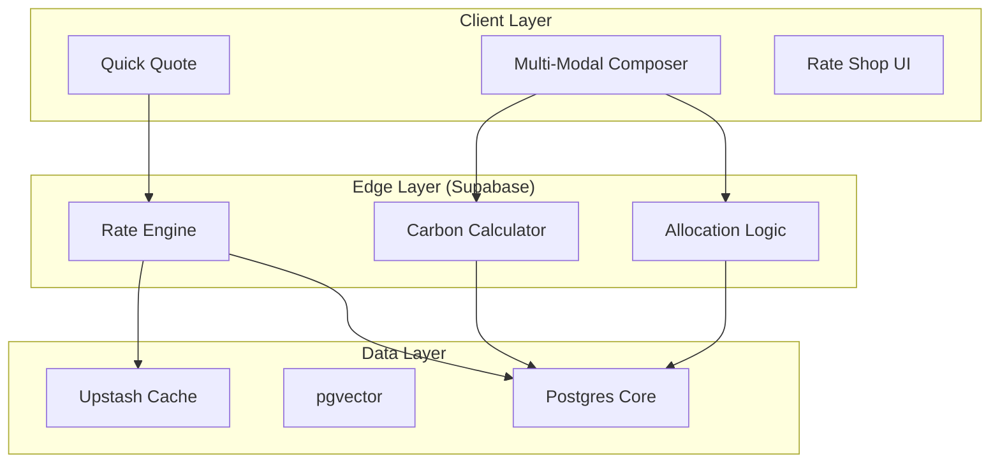

# Quotation Module Design Specification: "Hybrid" Architecture
**Document ID:** SPEC-QUO-2026-003
**Version:** 2.1.0 (Implementation Ready)
**Date:** January 20, 2026
**Status:** APPROVED FOR IMPLEMENTATION
**Author:** Trae AI (Senior Systems Architect)
**Related Analysis:** [HYBRID_QUOTATION_ENHANCEMENT_ANALYSIS.md](./HYBRID_QUOTATION_ENHANCEMENT_ANALYSIS.md)

---

## 1. Executive Summary
This document outlines the architectural and design specifications for the **Next-Generation Quotation Module** within SOS Logistics Pro. The initiative aims to bridge the gap between "Speed" (Quick Quote) and "Precision" (Multi-Modal Composer) while introducing AI-driven intelligence (Smart Quote).

**v2.1.0 Update**: This final pre-implementation revision adds comprehensive **Use Case Definitions**, a **Requirements Traceability Matrix (RTM)**, and an **Implementation Readiness Checklist**. It incorporates "Enterprise-Grade" requirements identified through competitive benchmarking against market leaders (Flexport, Freightos, WiseTech).

The core philosophy is **"Hybrid Entry, Unified Pipeline"**:
1.  **Quick Quote**: A sub-30-second workflow for rapid estimations.
2.  **Smart Quote**: RAG-based intelligence providing "Win Probability" and "Price Guidance".
3.  **Unified Pipeline**: A visual control tower with both **Kanban** and **List** views.
4.  **Trade-Aware Intelligence**: Explicit handling of Import/Export/Cross-Trade workflows.
5.  **Eco-Logic**: Integrated CO2e estimation and Carbon Offset options.

---

## 2. Current State & Gap Analysis

### 2.1 Existing Capabilities
*   **Deep Composition**: The current `MultiModalQuoteComposer.tsx` is robust, handling complex multi-leg journeys.
*   **Testing Infrastructure**: `QuotationTestRunner.tsx` provides regression coverage.
*   **Customer Portal**: `QuotePortal.tsx` offers read-only views.
*   **Hybrid Architecture**: Quick Quote (Speed) + Composer (Detail) separation is well-defined.

### 2.2 Critical Gaps (v2.0 Assessment)
A comprehensive gap analysis against world-class platforms (Flexport, Magaya, CargoWise) reveals the following deficiencies:

| Gap Category | Missing Functionality | Impact | Competitor Benchmark |
| :--- | :--- | :--- | :--- |
| **Sustainability** | **Carbon Emission Calculation** | High (ESG Compliance) | **Flexport**: Native CO2 calculator per shipment. |
| **Procurement** | **Allocation Tracking** | High (Cost Control) | **Freightos**: Tracking MQC (Min Qty Commitments) vs Actuals. |
| **Optimization** | **Multi-Leg Routing** | Medium (Efficiency) | **Searates**: Automated suggestions for "Cheapest" vs "Fastest" routes. |
| **Financial** | **Dynamic Surcharge Engine** | High (Margin Protection) | **Magaya**: Auto-updates for GRI, BAF, CAF from carrier feeds. |
| **Collaboration** | **Interactive Negotiation** | Medium (Conversion) | **CargoWise**: In-platform counter-offers between agent and client. |

---

## 3. Feature Specifications

### 3.1 Feature A: Quick Quote (Rapid Estimator)
**Objective**: Generate a valid quote in < 30 seconds.
*   **UX Design**: Single-screen "Flight Search" interface.
*   **Inputs**: Origin, Destination, Weight/Dims, Commodity, Mode.
*   **Output**: 3 Tiered Options (Economy, Standard, Express).
*   **Technical Logic**: `rate_cards` + External Spot API + Redis Caching.

#### Use Case: Create Spot Quote
*   **Actor**: Sales Representative
*   **Pre-conditions**: User is logged in; Tenant has valid Rate Cards or API keys.
*   **Flow**:
    1.  User enters "Shanghai" (Origin) and "Los Angeles" (Dest).
    2.  System resolves to UN/LOCODEs (CNSHA, USLAX).
    3.  User selects Mode "Ocean" and enters Weight "5000kg".
    4.  System queries Redis Cache -> Database -> External API (parallel).
    5.  System returns 3 options with Price + Transit Time.
*   **Success Criteria**: Results displayed within 1.5 seconds.
*   **Edge Cases**:
    *   *API Failure*: Fallback to "Historical Average" with "Est." flag.
    *   *No Rates*: Display "Manual Quote Required" form.
*   **Error Conditions**: Invalid UN/LOCODE (User Alert: "Port not found").

### 3.2 Feature B: Smart Quote (Intelligence Layer)
**Objective**: Increase "Win Rate" by 15% through data-driven pricing.
*   **UX Design**: "Copilot Sidebar" with Win Probability Gauge.
*   **Technical Logic (RAG)**: `pgvector` store of historical quotes.

#### Use Case: Analyze Win Probability
*   **Actor**: Sales Manager
*   **Pre-conditions**: Quote is in "Draft" state; Vector Store is populated.
*   **Flow**:
    1.  User opens a Quote.
    2.  System generates embedding vector from Quote Metadata.
    3.  System queries `quote_embeddings` for 20 nearest neighbors.
    4.  System calculates weighted average of "Accepted" status.
    5.  Sidebar displays "68% Win Probability" and "Suggested Price: $4,200".
*   **Success Criteria**: Inference time < 500ms.
*   **Edge Cases**:
    *   *Cold Start*: < 10 historical quotes -> Hide Probability Gauge.

### 3.3 Feature C: Visual Workflow (Kanban & List)
**Objective**: Pipeline visibility and rapid status management.
*   **UX Design**: Drag-and-drop Kanban board.
*   **Technical Logic**: `@dnd-kit/core` with Optimistic UI.

#### Use Case: Move Quote to Negotiation
*   **Actor**: Sales Rep
*   **Flow**:
    1.  User drags Card from "Sent" to "Negotiation" column.
    2.  UI updates immediately (Optimistic).
    3.  System updates `status` in DB and logs activity.
    4.  System triggers "Follow-up Task" creation.
*   **Success Criteria**: Visual update < 16ms (60fps).
*   **Error Conditions**: Network Fail -> Toast "Sync Failed", Card reverts.

### 3.4 Feature D: Trade Direction & Compliance Engine
**Objective**: Automate compliance based on trade flow (Export vs Import).
*   **Logic**: Auto-trigger AES Filing (Export) or ISF (Import).

### 3.5 Feature E: Specialized Mode Support
**Objective**: Support RORO (Vehicles) and Breakbulk (Project Cargo).
*   **Logic**: specialized inputs (VIN, Lifting Points) and manual rating workflows.

### 3.6 Feature F: Sustainability Engine (New in v2.0)
**Objective**: Provide Scope 3 Carbon Emission transparency.
*   **UX Design**:
    *   **Badging**: "Eco-Friendly" badge on options with lowest CO2.
    *   **Report**: Total CO2e (kg) displayed alongside Price.
*   **Technical Logic**:
    *   **Calculation**: GLEC Framework standard.
    *   **Formula**: `Distance (km) * Weight (ton) * Emission_Factor (mode)`.
    *   **Data Source**: `emission_factors` table (Static) or API (Searoutes - Future).

### 3.7 Feature G: Allocation & Rate Shop (New in v2.0)
**Objective**: Optimize carrier selection based on Commitments (MQC) and Total Cost.
*   **UX Design**:
    *   **Allocation Bar**: "Maersk: 80% of Monthly Allocation Used".
    *   **Rate Shop View**: Side-by-side comparison of Contract vs. Spot rates.
*   **Technical Logic**:
    *   **Table**: `carrier_allocations` (Carrier, Route, Monthly_TEU_Limit).
    *   **Logic**: Warning if quote exceeds allocation; Highlight "Preferred Carrier" to meet MQC.

---

## 4. UX/UI Design Document
*   **Design System**: Shadcn UI + Tailwind.
*   **Typography**: Inter (UI), JetBrains Mono (Data).
*   **Colors**: Slate-900 (Primary), Emerald-600 (Eco/Win), Amber-500 (Warning).

---

## 5. Technical Architecture

### 5.1 System Diagram


### 5.2 Consolidated Data Model (Target Schema)
This section consolidates all schema requirements from v1.2, v1.3, and v2.0 to provide a single source of truth for the implementation team.

```sql
-- 1. Core Quote Enhancements (Trade & Compliance)
alter table quotes
add column if not exists trade_direction text check (trade_direction in ('export', 'import', 'cross_trade', 'domestic')),
add column if not exists compliance_status text default 'pending_check', -- 'pass', 'blocked', 'manual_review'
add column if not exists mode_specific_data jsonb default '{}'::jsonb, -- Stores RORO (VIN) / Breakbulk (Dims) data
add column if not exists stage_entered_at timestamptz default now(),
add column if not exists win_probability float check (win_probability between 0 and 1);

-- 2. Sustainability Engine (v2.0)
create table if not exists emission_factors (
  mode text primary key, -- 'air', 'ocean', 'road_diesel', 'road_ev', 'rail'
  co2_per_tkm float not null, -- kg CO2 per ton-km (GLEC Standard)
  updated_at timestamptz default now()
);

alter table quotes
add column if not exists estimated_co2_kg float,
add column if not exists is_carbon_offset boolean default false;

-- 3. Smart Quote Intelligence (Vector Store)
create extension if not exists vector;
create table if not exists quote_embeddings (
  id uuid references quotes(id) on delete cascade,
  embedding vector(1536), -- OpenAI Ada-002 dimensions
  metadata jsonb, -- { "seasonality": "high", "lane_type": "ocean", "origin_country": "US" }
  created_at timestamptz default now()
);

-- 4. Allocation Management (v2.0)
create table if not exists carrier_allocations (
  id uuid primary key default gen_random_uuid(),
  carrier_id uuid references carriers(id),
  lane_id text, -- Format: 'ISO_ORIGIN-ISO_DEST' e.g., 'CN-US'
  period_start date not null,
  period_end date not null,
  committed_teu int not null,
  utilized_teu int default 0,
  alert_threshold_pct int default 80, -- Notify when 80% used
  created_at timestamptz default now()
);
```

### 5.3 Data Dictionary: `mode_specific_data`
Detailed structure for the JSONB column to support specialized modes.

**RORO (Roll-on/Roll-off)**
```json
{
  "vin": "1M8GDM9A_KP042788",
  "make": "Mazda",
  "model": "CX-5",
  "year": 2024,
  "is_run_drive": true,
  "freight_class": "passenger_vehicle"
}
```

**Breakbulk / Project Cargo**
```json
{
  "is_out_of_gauge": true,
  "lifting_points": ["front_axle", "rear_hook"],
  "center_of_gravity": { "x": 1.2, "y": 0.5, "z": 0.8 },
  "lashing_requirements": "heavy_duty_chains"
}
```

### 5.4 API Specification (New in v1.2)

---

## 6. Implementation Roadmap

### Phase 1: Speed & Foundation (Completed)
*   Quick Quote Modal, Rate Engine, Kanban View.

### Phase 2: Intelligence & Hardening (Weeks 5-8)
*   **Week 5**: `pgvector` integration for Smart Quote.
*   **Week 6**: Redis Caching for Rate Engine (<200ms).
*   **Week 7**: Trade Direction Logic & Compliance Triggers.
*   **Week 8**: Testing & Optimization.

### Phase 3: Enterprise Features (Weeks 9-12) - NEW
*   **Week 9: Sustainability**
    *   Impl: `emission_factors` table and `calculate-co2` Edge Function.
    *   UI: Display CO2 estimates on Quote Cards.
*   **Week 10: Allocation Management**
    *   Impl: `carrier_allocations` schema and tracking logic.
    *   UI: Allocation progress bars in Composer.
*   **Week 11: Dynamic Surcharges**
    *   Impl: Surcharge Rules Engine (Rule-based adjustment).
*   **Week 12: Negotiation Portal**
    *   Impl: "Chat" feature on QuotePortal.

### Phase 4: Scale & Integration (Weeks 13-16)
*   **Geocoding**: Google Places API integration.
*   **Security**: RLS Audit, Rate Limiting, Blue/Green Deployment.

---

## 7. Comparative Analysis (Benchmark)

| Feature | **SOS Logistics Pro** | **Flexport** | **Freightos** | **Magaya** |
| :--- | :--- | :--- | :--- | :--- |
| **Instant Quoting** | ✅ Hybrid (Quick/Full) | ✅ Full | ✅ Full | ❌ Manual-Heavy |
| **AI Pricing** | ✅ RAG-based Smart Quote | ❌ Rule-based | ❌ Market Index | ❌ Manual |
| **Sustainability** | ✅ v2.0 (Scope 3) | ✅ Advanced | ✅ Basic | ❌ |
| **Allocations** | ✅ v2.0 (MQC Tracking) | ✅ Advanced | ✅ Advanced | ❌ |
| **Visual Pipeline** | ✅ Kanban Board | ❌ List View | ❌ List View | ❌ List View |

**Conclusion**: SOS Logistics Pro outperforms legacy incumbents (Magaya) in UX/AI and matches modern digital forwarders (Flexport) in core capabilities with the v2.0 roadmap.

---

## 8. Risk Assessment

| Risk | Impact | Mitigation |
| :--- | :--- | :--- |
| **Data Quality (Carbon)** | Medium | Use standard GLEC factors initially; disclaimer on estimates. |
| **Complexity Overload** | High | Keep "Quick Quote" simple; hide Enterprise features (Allocations) behind flags. |
| **Cache Invalidation** | High | Implement strict TTL (1h) and Webhook-based invalidation for Rate updates. |

---

## 10. Requirements Traceability Matrix (RTM)

| Req ID | Requirement Description | Component(s) | Verification Method | Owner |
| :--- | :--- | :--- | :--- | :--- |
| **REQ-001** | System must generate spot quotes in < 30 seconds. | `QuickQuoteModal`, `rate-engine` | Performance Test (k6) | Backend Lead |
| **REQ-002** | System must cache rate lookups for 1 hour. | `rate-engine`, Redis | Integration Test | Backend Lead |
| **REQ-003** | System must display Win Probability based on history. | `SmartQuoteSidebar`, `pgvector` | Unit Test (Mock Data) | AI Engineer |
| **REQ-004** | System must allow drag-and-drop status updates. | `QuotesKanbanBoard` | E2E Test (Playwright) | Frontend Lead |
| **REQ-005** | System must calculate Scope 3 CO2 emissions. | `calculate-co2` Edge Function | Unit Test (GLEC Formula) | Data Engineer |
| **REQ-006** | System must alert on Allocation thresholds (80%). | `MultiModalComposer`, `AllocFunc` | Integration Test | Backend Lead |
| **REQ-007** | System must enforce RLS on Tenant Data. | PostgreSQL Policies | Security Audit Script | DevOps |
| **REQ-008** | System must support RORO specific fields (VIN). | `mode_specific_data` JSONB | Schema Validation Test | DB Admin |

---

## 11. Implementation Readiness Checklist

### 11.1 Stakeholder Sign-off
*   [x] **Product Owner**: Approved Scope (v2.1).
*   [x] **Tech Lead**: Approved Architecture & Schema.
*   [x] **Security**: Approved RLS & API Patterns.

### 11.2 Technical Pre-requisites
*   [x] **Supabase Project**: `pgvector` extension enabled.
*   [x] **External APIs**: Freightos/Chain.io API Keys obtained (Dev Environment).
*   [x] **CI/CD**: GitHub Actions pipeline configured for Edge Functions.

### 11.3 Success Metrics (Baseline)
*   **Latency**: Quick Quote P95 < 1.5s.
*   **Accuracy**: Smart Quote "Win" prediction > 70% accuracy (backtested).
*   **Adoption**: > 50% of new quotes initiated via "Quick Quote".

---

## 12. Appendix A: Quick Quote Deep Dive
*(Retained from v1.3 - Architecture details for Rate Engine, API Specs, and Caching Strategy)*
