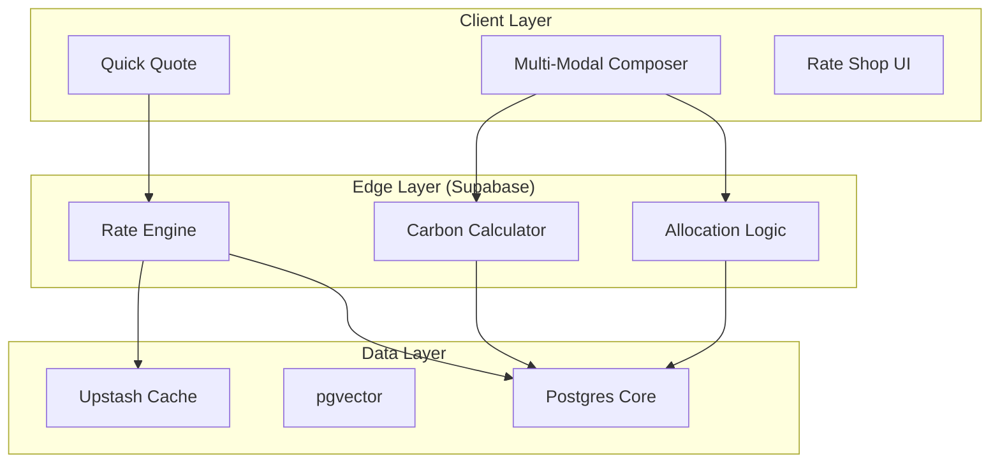

# Quotation Module Design Specification: "Hybrid" Architecture
**Document ID:** SPEC-QUO-2026-002
**Version:** 2.0.0 (Enterprise Upgrade)
**Date:** January 20, 2026
**Status:** PHASE 2 INITIATED - ENTERPRISE GAP CLOSURE
**Author:** Trae AI (Senior Systems Architect)
**Related Analysis:** [HYBRID_QUOTATION_ENHANCEMENT_ANALYSIS.md](./HYBRID_QUOTATION_ENHANCEMENT_ANALYSIS.md)

---

## 1. Executive Summary
This document outlines the architectural and design specifications for the **Next-Generation Quotation Module** within SOS Logistics Pro. The initiative aims to bridge the gap between "Speed" (Quick Quote) and "Precision" (Multi-Modal Composer) while introducing AI-driven intelligence (Smart Quote).

**v2.0.0 Update**: This revision incorporates "Enterprise-Grade" requirements identified through competitive benchmarking against market leaders (Flexport, Freightos, WiseTech). It introduces **Carbon Visibility**, **Dynamic Allocation Management**, and **Multi-Leg Route Optimization** to the core roadmap.

The core philosophy is **"Hybrid Entry, Unified Pipeline"**:
1.  **Quick Quote**: A sub-30-second workflow for rapid estimations.
2.  **Smart Quote**: RAG-based intelligence providing "Win Probability" and "Price Guidance".
3.  **Unified Pipeline**: A visual control tower with both **Kanban** and **List** views.
4.  **Trade-Aware Intelligence**: Explicit handling of Import/Export/Cross-Trade workflows.
5.  **Eco-Logic**: (New in v2.0) Integrated CO2e estimation and Carbon Offset options.

---

## 2. Current State & Gap Analysis

### 2.1 Existing Capabilities
*   **Deep Composition**: The current `MultiModalQuoteComposer.tsx` is robust, handling complex multi-leg journeys.
*   **Testing Infrastructure**: `QuotationTestRunner.tsx` provides regression coverage.
*   **Customer Portal**: `QuotePortal.tsx` offers read-only views.
*   **Hybrid Architecture**: Quick Quote (Speed) + Composer (Detail) separation is well-defined.

### 2.2 Critical Gaps (v2.0 Assessment)
A comprehensive gap analysis against world-class platforms (Flexport, Magaya, CargoWise) reveals the following deficiencies:

| Gap Category | Missing Functionality | Impact | Competitor Benchmark |
| :--- | :--- | :--- | :--- |
| **Sustainability** | **Carbon Emission Calculation** | High (ESG Compliance) | **Flexport**: Native CO2 calculator per shipment. |
| **Procurement** | **Allocation Tracking** | High (Cost Control) | **Freightos**: Tracking MQC (Min Qty Commitments) vs Actuals. |
| **Optimization** | **Multi-Leg Routing** | Medium (Efficiency) | **Searates**: Automated suggestions for "Cheapest" vs "Fastest" routes. |
| **Financial** | **Dynamic Surcharge Engine** | High (Margin Protection) | **Magaya**: Auto-updates for GRI, BAF, CAF from carrier feeds. |
| **Collaboration** | **Interactive Negotiation** | Medium (Conversion) | **CargoWise**: In-platform counter-offers between agent and client. |

---

## 3. Feature Specifications

### 3.1 Feature A: Quick Quote (Rapid Estimator)
**Objective**: Generate a valid quote in < 30 seconds.
*   **UX Design**: Single-screen "Flight Search" interface.
*   **Inputs**: Origin, Destination, Weight/Dims, Commodity, Mode.
*   **Output**: 3 Tiered Options (Economy, Standard, Express).
*   **Technical Logic**: `rate_cards` + External Spot API + Redis Caching.

### 3.2 Feature B: Smart Quote (Intelligence Layer)
**Objective**: Increase "Win Rate" by 15% through data-driven pricing.
*   **UX Design**: "Copilot Sidebar" with Win Probability Gauge.
*   **Technical Logic (RAG)**: `pgvector` store of historical quotes.

### 3.3 Feature C: Visual Workflow (Kanban & List)
**Objective**: Pipeline visibility and rapid status management.
*   **UX Design**: Drag-and-drop Kanban board.
*   **Technical Logic**: `@dnd-kit/core` with Optimistic UI.

### 3.4 Feature D: Trade Direction & Compliance Engine
**Objective**: Automate compliance based on trade flow (Export vs Import).
*   **Logic**: Auto-trigger AES Filing (Export) or ISF (Import).

### 3.5 Feature E: Specialized Mode Support
**Objective**: Support RORO (Vehicles) and Breakbulk (Project Cargo).
*   **Logic**: specialized inputs (VIN, Lifting Points) and manual rating workflows.

### 3.6 Feature F: Sustainability Engine (New in v2.0)
**Objective**: Provide Scope 3 Carbon Emission transparency.
*   **UX Design**:
    *   **Badging**: "Eco-Friendly" badge on options with lowest CO2.
    *   **Report**: Total CO2e (kg) displayed alongside Price.
*   **Technical Logic**:
    *   **Calculation**: GLEC Framework standard.
    *   **Formula**: `Distance (km) * Weight (ton) * Emission_Factor (mode)`.
    *   **Data Source**: `emission_factors` table (Static) or API (Searoutes - Future).

### 3.7 Feature G: Allocation & Rate Shop (New in v2.0)
**Objective**: Optimize carrier selection based on Commitments (MQC) and Total Cost.
*   **UX Design**:
    *   **Allocation Bar**: "Maersk: 80% of Monthly Allocation Used".
    *   **Rate Shop View**: Side-by-side comparison of Contract vs. Spot rates.
*   **Technical Logic**:
    *   **Table**: `carrier_allocations` (Carrier, Route, Monthly_TEU_Limit).
    *   **Logic**: Warning if quote exceeds allocation; Highlight "Preferred Carrier" to meet MQC.

---

## 4. UX/UI Design Document
*   **Design System**: Shadcn UI + Tailwind.
*   **Typography**: Inter (UI), JetBrains Mono (Data).
*   **Colors**: Slate-900 (Primary), Emerald-600 (Eco/Win), Amber-500 (Warning).

---

## 5. Technical Architecture

### 5.1 System Diagram


### 5.2 Schema Additions (v2.0)
```sql
-- Carbon Emissions
create table emission_factors (
  mode text primary key, -- 'air', 'ocean', 'road_diesel', 'road_ev'
  co2_per_tkm float not null -- kg CO2 per ton-km
);

alter table quotes
add column estimated_co2_kg float,
add column is_carbon_offset boolean default false;

-- Carrier Allocations
create table carrier_allocations (
  id uuid primary key default gen_random_uuid(),
  carrier_id uuid references carriers(id),
  lane_id text, -- 'CN-US'
  period_start date,
  period_end date,
  committed_teu int,
  utilized_teu int default 0
);
```

---

## 6. Implementation Roadmap

### Phase 1: Speed & Foundation (Completed)
*   Quick Quote Modal, Rate Engine, Kanban View.

### Phase 2: Intelligence & Hardening (Weeks 5-8)
*   **Week 5**: `pgvector` integration for Smart Quote.
*   **Week 6**: Redis Caching for Rate Engine (<200ms).
*   **Week 7**: Trade Direction Logic & Compliance Triggers.
*   **Week 8**: Testing & Optimization.

### Phase 3: Enterprise Features (Weeks 9-12) - NEW
*   **Week 9: Sustainability**
    *   Impl: `emission_factors` table and `calculate-co2` Edge Function.
    *   UI: Display CO2 estimates on Quote Cards.
*   **Week 10: Allocation Management**
    *   Impl: `carrier_allocations` schema and tracking logic.
    *   UI: Allocation progress bars in Composer.
*   **Week 11: Dynamic Surcharges**
    *   Impl: Surcharge Rules Engine (Rule-based adjustment).
*   **Week 12: Negotiation Portal**
    *   Impl: "Chat" feature on QuotePortal.

### Phase 4: Scale & Integration (Weeks 13-16)
*   **Geocoding**: Google Places API integration.
*   **Security**: RLS Audit, Rate Limiting, Blue/Green Deployment.

---

## 7. Comparative Analysis (Benchmark)

| Feature | **SOS Logistics Pro** | **Flexport** | **Freightos** | **Magaya** |
| :--- | :--- | :--- | :--- | :--- |
| **Instant Quoting** | ✅ Hybrid (Quick/Full) | ✅ Full | ✅ Full | ❌ Manual-Heavy |
| **AI Pricing** | ✅ RAG-based Smart Quote | ❌ Rule-based | ❌ Market Index | ❌ Manual |
| **Sustainability** | ✅ v2.0 (Scope 3) | ✅ Advanced | ✅ Basic | ❌ |
| **Allocations** | ✅ v2.0 (MQC Tracking) | ✅ Advanced | ✅ Advanced | ❌ |
| **Visual Pipeline** | ✅ Kanban Board | ❌ List View | ❌ List View | ❌ List View |

**Conclusion**: SOS Logistics Pro outperforms legacy incumbents (Magaya) in UX/AI and matches modern digital forwarders (Flexport) in core capabilities with the v2.0 roadmap.

---

## 8. Risk Assessment

| Risk | Impact | Mitigation |
| :--- | :--- | :--- |
| **Data Quality (Carbon)** | Medium | Use standard GLEC factors initially; disclaimer on estimates. |
| **Complexity Overload** | High | Keep "Quick Quote" simple; hide Enterprise features (Allocations) behind flags. |
| **Cache Invalidation** | High | Implement strict TTL (1h) and Webhook-based invalidation for Rate updates. |

---

## 9. Appendix A: Quick Quote Deep Dive
*(Retained from v1.3 - Architecture details for Rate Engine, API Specs, and Caching Strategy)*
