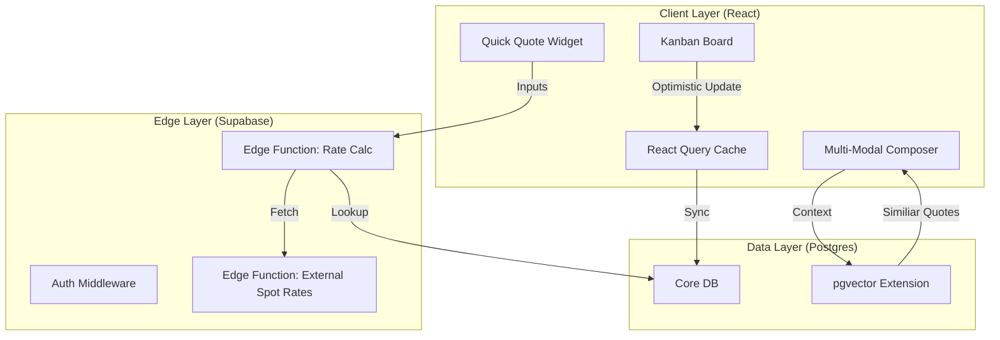

# Quotation Module Design Specification: "Hybrid" Architecture
**Document ID:** SPEC-QUO-2026-001
**Version:** 1.0.0
**Date:** January 20, 2026
**Status:** DRAFT
**Author:** Trae AI (Senior Systems Architect)

---

## 1. Executive Summary
This document outlines the architectural and design specifications for the **Next-Generation Quotation Module** within SOS Logistics Pro. The initiative aims to bridge the gap between "Speed" (Quick Quote) and "Precision" (Multi-Modal Composer) while introducing AI-driven intelligence (Smart Quote).

The core philosophy is **"Hybrid Entry, Unified Pipeline"**:
1.  **Quick Quote**: A sub-30-second workflow for rapid estimations.
2.  **Smart Quote**: RAG-based intelligence providing "Win Probability" and "Price Guidance".
3.  **Unified Kanban**: A visual control tower for managing the entire lifecycle.

---

## 2. Current State & Gap Analysis

### 2.1 Existing Capabilities
*   **Deep Composition**: The current `MultiModalQuoteComposer.tsx` is robust, handling complex multi-leg journeys, charge codes, and versioning (`QuotationVersionHistory.tsx`).
*   **Testing Infrastructure**: `QuotationTestRunner.tsx` provides excellent regression coverage for complex logic.
*   **Customer Portal**: `QuotePortal.tsx` offers a decent read-only view and PDF export.

### 2.2 Critical Gaps
*   **Velocity Friction**: The "Composer" requires too many clicks (Steps: Details -> Legs -> Charges -> Review) for simple "A to B" spot quotes.
*   **Visual Blindness**: `Quotes.tsx` is a static grid. Sales managers cannot visualize the pipeline velocity or bottlenecks.
*   **Pricing Guesswork**: Users rely on "gut feeling" or external emails for pricing. No system intelligence exists.

---

## 3. Feature Specifications

### 3.1 Feature A: Quick Quote (Rapid Estimator)
**Objective**: Generate a valid quote in < 30 seconds.

*   **UX Design**:
    *   **Interface**: Single-screen "Flight Search" style interface.
    *   **Inputs**: Origin (City/Zip), Destination (City/Zip), Weight/Dims, Commodity, Mode (Air/Ocean/Road).
    *   **Output**: 3 Tiered Options (Economy, Standard, Express).
    *   **Action**: "Convert to Full Quote" (Save & Edit in Composer) or "Email Now".

*   **Technical Logic**:
    *   **Data Source**: `rate_cards` table (Contracted Rates) + External Spot API (via Edge Function).
    *   **Algorithm**: Simplified Rating Engine (Base Rate * Weight + Fuel Surcharge).
    *   **State Management**: Transient state until "Converted".

### 3.2 Feature B: Smart Quote (Intelligence Layer)
**Objective**: Increase "Win Rate" by 15% through data-driven pricing.

*   **UX Design**:
    *   **Interface**: "Copilot Sidebar" within the Quote Composer.
    *   **Indicators**:
        *   "Win Probability": 0-100% Gauge.
        *   "Price Guidance": Histogram showing "Losing", "Competitive", and "Winning" ranges.
    *   **Interactions**: "Apply Suggested Margin" button.

*   **Technical Logic (RAG)**:
    *   **Vector Database**: `pgvector` store of last 24 months of *Accepted* vs. *Rejected* quotes.
    *   **Embeddings**: Vectors derived from `[Origin, Dest, Commodity, Month, Weight]`.
    *   **Query**: `SELECT * FROM quote_vectors ORDER BY embedding <-> current_quote_embedding LIMIT 20`.

### 3.3 Feature C: Visual Workflow (Kanban)
**Objective**: Pipeline visibility and rapid status management.

*   **UX Design**:
    *   **Columns**: Draft -> Internal Review -> Client Review -> Negotiation -> Approved -> Booked.
    *   **Card Anatomy**: Client Name, Port Pair (NYC->LON), Revenue, "Stale" Indicator (Red border if > 48h).
    *   **Interaction**: Drag-and-drop to move columns (triggers API status update).

*   **Technical Logic**:
    *   **Library**: `@dnd-kit/core` (accessible, lightweight).
    *   **Optimistic UI**: UI updates immediately; background API call syncs state. Reverts on error.

---

## 4. UX/UI Design Document

### 4.1 Design System (Shadcn UI Extension)
*   **Typography**: Inter (Sans) for UI, JetBrains Mono for Rate Codes/Tariffs.
*   **Color Palette**:
    *   *Primary*: Slate-900 (Corporate).
    *   *Accents*: Emerald-600 (Profit/Win), Amber-500 (Review/Warning), Rose-600 (Loss/Stale).
*   **Layout**:
    *   *Sidebar*: Collapsible, Icon-driven.
    *   *Main Stage*: "Paper" elevation (white bg, subtle shadow) for Quote Forms.

### 4.2 Interaction Models
*   **Keyboard First**: `Cmd+K` to "Create Quick Quote". `Cmd+S` to Save.
*   **Feedback Loops**:
    *   *Success*: Sonner Toast (Bottom Right).
    *   *Error*: Inline validation (Zod) + Shake animation.
*   **Accessibility**: WCAG 2.1 AA Compliance. Focus traps for Modals. Aria-labels for all Drag handles.

---

## 5. Technical Architecture

### 5.1 System Diagram


### 5.2 Data Schema Additions
```sql
-- For Smart Quote
create extension vector;
create table quote_embeddings (
  id uuid references quotes(id),
  embedding vector(1536), -- OpenAI Ada-002
  metadata jsonb -- { "seasonality": "high", "lane_type": "ocean" }
);

-- For Kanban Metadata
alter table quotes 
add column stage_entered_at timestamptz default now(),
add column win_probability float check (win_probability between 0 and 1);
```

---

## 6. Implementation Roadmap

### Phase 1: The "Speed" Update (Weeks 1-4)
*   **Week 1**: Design & Build "Quick Quote" Modal (UI Only).
*   **Week 2**: Implement "Simple Rate Engine" (DB Lookup only).
*   **Week 3**: Integrate `@dnd-kit` for Kanban View in `QuotesPipeline.tsx`.
*   **Week 4**: UAT for Quick Quote & Kanban.

### Phase 2: The "Brain" Update (Weeks 5-8)
*   **Week 5**: Enable `pgvector`. Write script to vectorize historical quotes.
*   **Week 6**: Build Edge Function for "Similar Quote Search".
*   **Week 7**: Integrate "Smart Sidebar" into Composer.
*   **Week 8**: Full End-to-End Testing & Performance Tuning.

---

## 7. Testing Plan

### 7.1 Functional Testing
*   **Quick Quote**: Verify 3-tier output logic. Ensure conversion to Full Quote preserves all data.
*   **Kanban**: Verify Drag-and-Drop persistence. Verify "Stale" logic (time-based styling).

### 7.2 Performance Testing
*   **Metric**: Quick Quote response < 200ms.
*   **Tool**: k6 Load Testing on Edge Functions.

### 7.3 Security Testing
*   **Scope**: RLS Policy enforcement on "Smart Quote" (Users should only see *their* tenant's historical data in RAG).
*   **Validation**: Attempt to query cross-tenant vectors.

---

## 8. Integration Requirements
*   **Email**: SendGrid/Resend template for "Quick Quote" HTML output.
*   **CRM**: Bi-directional sync with Salesforce (if applicable) for Opportunity Stages.
*   **Carriers**: API keys for Spot Rate aggregators (e.g., Freightos, Chain.io) stored in Vault.
