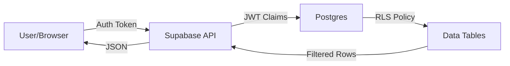

# Tenant & Franchisee Implementation Plan

**Version:** 1.0  
**Date:** 2026-01-07  
**Status:** Draft  
**Reference:** [LEAD_MANAGEMENT_BENCHMARK_ANALYSIS.md](file:///Users/vims/Downloads/Development%20Projects/Trae/SOS%20Logistics%20Pro/logic-nexus-ai/documentation/LEAD_MANAGEMENT_BENCHMARK_ANALYSIS.md)

---

## 1. Executive Summary

### 1.1 Business Objectives
The primary objective is to evolve the SOS Logistics Enterprise Platform into a robust multi-tenant, multi-franchise ecosystem. This transformation will allow:
- **Scalable Expansion**: Rapid onboarding of new franchise units with zero infrastructure provisioning overhead.
- **Operational Isolation**: Strict data boundaries ensuring franchisees only access their own operational data while allowing headquarters (Tenant Admin) global oversight.
- **Brand Consistency**: Unified operational workflows across all franchises while supporting localized configurations.

### 1.2 Technical Goals
- **Security & Isolation**: Achieve 100% data isolation at the database layer using PostgreSQL Row-Level Security (RLS), ensuring no cross-franchise data leakage.
- **Performance**: Maintain sub-200ms API response times for franchise-scoped queries by implementing targeted composite indexes (`tenant_id`, `franchise_id`).
- **Scalability**: Support horizontal scaling to 100+ franchises per tenant without schema modification.
- **Usability**: Implement "Franchise-First" UI patterns where users default to their active franchise context, with seamless context switching for multi-franchise admins.

### 1.3 Capability Comparison Matrix

| Feature | Requirement | Current Platform Capability | Gap Status |
| :--- | :--- | :--- | :--- |
| **Data Isolation** | Strict RLS by Tenant & Franchise | Partial; Core tables covered, some peripheral tables pending | 🟡 In Progress |
| **User Context** | Persist selected franchise across sessions | Session-volatile; requires `user_preferences` persistence | 🔴 Critical Gap |
| **Admin Oversight** | "God Mode" for Tenant/Platform Admins | No unified UI control; manual query required | 🔴 Critical Gap |
| **Reporting** | Franchise-level vs. Aggregate views | Standard reporting mixes scopes inconsistently | 🟡 Moderate Gap |
| **Portal Access** | Token-based public access linked to franchise | Implemented via RPCs and token audit | 🟢 Complete |
| **Edge Functions** | Franchise-aware server-side logic | Logic exists but lacks consistent audit parameter logging | 🟡 Moderate Gap |

### 1.4 Version Control Strategy
We will utilize a **Gitflow-inspired** workflow adapted for our Monorepo structure to ensure stability during this complex migration.

- **Main Branch**: Production-ready code. Protected. Deployable.
- **Develop Branch**: Integration branch for ongoing work.
- **Feature Branches**: `feature/phase-x-component` (e.g., `feature/phase-2-ui-controls`).
- **Release Branches**: `release/vX.Y.Z` for final hardening before merge to Main.

### 1.5 Risk Management

| Risk Category | Risk Description | Probability | Impact | Mitigation Strategy |
| :--- | :--- | :--- | :--- | :--- |
| **Security** | RLS Policy misconfiguration leaks data | Low | Critical | Comprehensive `pg_tap` style verification queries; Automated policy regression tests. |
| **Operational** | Admin Override remains active accidentally | Medium | High | "Admin Mode" visual indicators (red banner); Auto-timeout for override sessions. |
| **Performance** | Missing indexes on franchise_id slow down lists | High | Medium | Systematic index auditing (Phase 1); `EXPLAIN ANALYZE` on key queries. |
| **Migration** | Existing data orphaned without franchise_id | Low | High | Migration scripts default to "Headquarters" franchise or NULL (Tenant-Global) explicitly. |

---

## 2. Current State Analysis

### 2.1 Functional Mapping
The platform currently operates as a Single Page Application (SPA) interacting with Supabase.

- **Frontend**: React (Vite) + Shadcn UI.
- **Backend**: Supabase (PostgreSQL, Auth, Edge Functions, Storage).
- **Modules**:
    - **CRM**: Leads, Contacts, Opportunities (RLS Implemented).
    - **Operations**: Quotes, Shipments (RLS Implemented).
    - **Admin**: Users, Roles, configuration (Partial Franchise Awareness).

### 2.2 Architecture Documentation
*Current Data Flow:*

*Key Dependency*: The system relies heavily on `auth.uid()` and `app_metadata` to determine scope.

### 2.3 Gap Analysis

#### Functional Gaps
1.  **Global Franchise Selector**: No persistent UI component allows a user to "select" their working franchise.
2.  **Admin Override Toggle**: No mechanism for an Admin to explicitly "break glass" and see all data.
3.  **Default Scoping**: Lists (e.g., Shipment List) often load *all* accessible data instead of *current franchise* data, cluttering the view for multi-franchise users.

#### Technical Limitations
1.  **Audit Logging**: `audit_logs` table captures actions but often misses the specific `franchise_id` context of the *action*, only the record.
2.  **User Preferences**: No backend storage for UI state (e.g., "last selected franchise"), forcing users to re-select on login.

#### Performance Bottlenecks
-   **Unindexed Foreign Keys**: Many `franchise_id` columns were added without corresponding B-Tree indexes, posing a risk for `JOIN` performance and filtering on large tables. (Addressed in Phase 1).

### 2.4 Capacity Planning
-   **Current Load**: ~50 concurrent users, single tenant focus.
-   **Projected Load**: 500+ concurrent users, 20+ franchises.
-   **Resource Req**: Database upgrade likely required for IOPS if `franchise_id` filtering is inefficient. Pre-emptive indexing is mandatory.

---

## 3. Implementation Strategy

### 3.1 Phased Rollout

#### Phase 1: Foundation & Security (Completed/In-Verification)
-   **Goal**: Secure the database layer.
-   **Deliverables**:
    -   Standardized RLS policies on all core tables.
    -   Index auditing and creation (`idx_tablename_franchise_id`).
    -   Verification scripts.

#### Phase 2: UI Controls & Persistence (Current)
-   **Goal**: Enable user context management.
-   **Deliverables**:
    -   `user_preferences` table and API.
    -   `admin_override_audit` table.
    -   Global "Franchise Selector" UI Component.
    -   "Admin Mode" Toggle Component.

#### Phase 3: "Franchise-First" UI Refactor
-   **Goal**: Update all application views to respect the selected context.
-   **Deliverables**:
    -   Update `useCRM` hook to consume `user_preferences`.
    -   Refactor `Leads`, `Quotes`, `Shipments` lists to filter by the active franchise ID from context (client-side or API parameter).
    -   Add visual cues for "Global" vs "Franchise" records.

#### Phase 4: Reporting & Aggregation
-   **Goal**: Provide management insights.
-   **Deliverables**:
    -   Cross-franchise dashboards for Tenant Admins.
    -   Franchise-specific dashboards for Franchise Managers.

### 3.2 Tenant Isolation
-   **Storage**: Shared schema, row-level isolation.
-   **Processing**: Stateless Edge Functions; isolation enforced by passing `franchise_id` as a required parameter to all business logic functions.
-   **Configuration**: `franchises` table extended to hold config JSON (branding, defaults) per franchise.

### 3.3 Access Control (RBAC)
We utilize a simplified RBAC model augmented by RLS:
-   **Platform Admin**: All access (system-wide).
-   **Tenant Admin**: Full access to Tenant data; can "Assume Role" of Franchise Admin.
-   **Franchise Admin**: Full access to Franchise data.
-   **Franchise User**: Operational access to Franchise data.

### 3.4 Data Management
-   **Segregation**: All write operations MUST include `franchise_id`.
-   **Multi-tenant Queries**: Tenant Admins query with `franchise_id IS NULL` (if global) or `franchise_id IN (...)` for aggregation.
-   **Migration**:
    -   Existing records with `NULL` franchise_id are treated as "Headquarters/Global".
    -   Batch update scripts provided to move records to specific franchises if needed.

### 3.5 User Migration
-   **Plan**:
    1.  Deploy Schema Changes (Phase 1 & 2).
    2.  Run `08-ui-controls.sql` to initialize preferences.
    3.  Users login -> `set_user_franchise_preference` auto-inits to their primary franchise.
    4.  No downtime required; seamless transition.

---

## 4. Version Control Plan

### 4.1 Branching Strategy
We adhere to a strict branching policy to manage the migration:

1.  **`main`**: The source of truth. Protected.
2.  **`develop`**: Staging environment code.
3.  **`migration/phase-N`**: Long-lived branches for each migration phase (e.g., `migration/phase-2-ui`).
4.  **`hotfix/*`**: Critical production fixes, merged to `main` and back-ported to `develop`.

### 4.2 Repository Architecture
**Current**: Monorepo (Frontend + Database Migration Scripts).
**Recommendation**: Continue with Monorepo.
-   **Justification**: Tight coupling between Schema (RLS policies) and Frontend Logic (Types, Hooks) requires atomic commits to prevent "drift".
-   **Structure**:
    ```
    /
    ├── src/              # React Frontend
    ├── supabase/
    │   ├── migrations/   # Auto-generated migrations
    │   └── migration-package/
    │       ├── sql-migration/  # Hand-crafted, ordered migration scripts
    │       └── run-migration.sh # Orchestrator
    ```

### 4.3 Versioning Methodology
-   **Semantic Versioning (SemVer)**: `MAJOR.MINOR.PATCH`
    -   **MAJOR**: Breaking schema changes (e.g., RLS policy overhauls).
    -   **MINOR**: New features (e.g., new tables, new UI modules).
    -   **PATCH**: Bug fixes, index tweaks.
-   **Tagging**: All deployments to production must be tagged: `v1.2.0-phase2`.

### 4.4 Change Management
-   **Code Reviews**: Mandatory for all PRs.
    -   *Database Changes*: Must include output of verification queries.
    -   *Frontend Changes*: Must pass linting and type-checking.
-   **Approval**: Requires 1 Senior Developer approval.

### 4.5 Automation
-   **CI/CD**: GitHub Actions (or similar).
    -   **On PR**: Run `npm run typecheck`, `npm run lint`.
    -   **On Merge to Main**: Auto-tag version, trigger deployment pipeline.
    -   **Audit Trail**: Git history + PR comments serve as the audit trail for architectural decisions.

